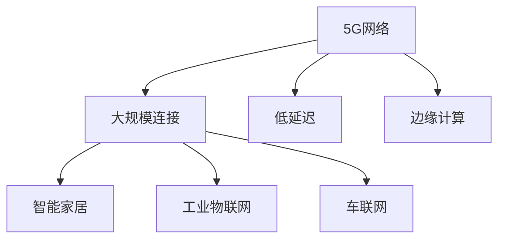

                 

## 1. 背景介绍

### 1.1 问题由来

随着物联网(IoT)设备的急剧增长，对网络的连接性和响应速度提出了越来越高的要求。传统的4G网络已经难以满足海量设备对低延迟、高可靠性的需求。为了应对这一挑战，5G（第五代移动通信技术）应运而生。5G技术的引入，为物联网的发展提供了强有力的技术支撑，带来了网络性能的大幅提升。

### 1.2 问题核心关键点

5G网络的核心优势在于其可以支持大规模设备连接和低延迟通信。具体来说，5G网络可以承载超过100万个连接/平方公里，并实现了毫秒级的端到端时延。这些特性使得5G网络能够支撑物联网的广泛应用，包括智能家居、工业物联网、车联网等众多场景。

## 2. 核心概念与联系

### 2.1 核心概念概述

为更好地理解5G在物联网中的应用，本节将介绍几个关键概念：

- 5G网络：5G网络是一种新一代移动通信技术，具备高速率、低延迟、大规模连接等特点。它能够支持超高清视频、实时数据传输、智能制造等高需求应用。
- 物联网(IoT)：物联网是指通过互联网将各类设备互联互通，实现智能化管理的一种技术。
- 大规模连接(MMTC)：5G网络能够支持超过100万个设备连接/平方公里，能够支持大规模的物联网设备接入。
- 低延迟：5G网络实现了毫秒级的端到端时延，能够在工业控制、无人驾驶等对实时性要求高的应用中发挥重要作用。
- 边缘计算(Edge Computing)：边缘计算将数据处理和存储从云中心移到网络边缘，能够降低延迟，提升物联网设备的响应速度。

这些概念之间的逻辑关系可以通过以下Mermaid流程图来展示：



这个流程图展示了大规模连接、低延迟和边缘计算是如何支撑5G在物联网中的应用的。

## 3. 核心算法原理 & 具体操作步骤
### 3.1 算法原理概述

5G网络的核心算法包括大规模MIMO、多接入边缘计算(MEC)、网络切片等。这些算法共同构成了5G网络的技术基础，使其能够实现大规模连接和低延迟。

1. **大规模MIMO（Massive MIMO）**：通过增加基站的天线数量，实现同时与多个设备通信，提升了网络的容量和覆盖范围。
2. **多接入边缘计算(MEC)**：将数据处理和存储任务移到网络边缘，降低了时延，提升了设备响应速度。
3. **网络切片(Network Slicing)**：将物理网络划分为多个虚拟网络，每个虚拟网络独立运行，满足不同应用的需求。

### 3.2 算法步骤详解

以下是5G网络在物联网中应用的具体操作步骤：

1. **设备接入**：物联网设备通过5G网络接入到网络边缘，将数据传输到网络边缘设备。
2. **数据处理与存储**：网络边缘设备对数据进行处理和存储，通过边缘计算平台进行处理。
3. **数据传输**：处理后的数据通过5G网络传输到云中心或本地存储设备。
4. **应用处理**：云中心或本地设备对数据进行进一步处理，并返回处理结果。
5. **结果输出**：处理结果通过5G网络传输回物联网设备，进行后续控制和决策。

### 3.3 算法优缺点

5G网络在物联网中的应用具有以下优点：

1. **高容量**：大规模MIMO技术提升了网络容量，能够支持大规模物联网设备的接入。
2. **低延迟**：多接入边缘计算和网络切片技术减少了数据传输时延，提高了设备的响应速度。
3. **灵活性**：网络切片技术使得网络可以灵活满足不同应用的需求。

同时，5G网络在物联网中的应用也存在一些缺点：

1. **成本高**：5G网络建设需要大量的基础设施投资，初期成本较高。
2. **频谱资源有限**：5G网络的频谱资源有限，未来可能会面临频谱资源的竞争和不足问题。
3. **安全性**：物联网设备的多样性增加了网络安全管理的复杂性。

### 3.4 算法应用领域

5G网络在物联网中的应用领域非常广泛，包括但不限于以下几个方面：

1. **智能家居**：智能家电、安防监控等设备通过5G网络实现远程控制和自动化管理。
2. **工业物联网**：传感器、机器人等设备通过5G网络实现实时监控和自动化控制。
3. **车联网**：智能交通、无人驾驶等应用场景中，车辆通过5G网络实现数据传输和实时决策。
4. **智慧城市**：智能路灯、智慧停车、智慧医疗等城市管理应用中，5G网络提供了数据传输的支撑。

## 4. 数学模型和公式 & 详细讲解
### 4.1 数学模型构建

5G网络在物联网中的应用涉及多个数学模型，包括数据传输模型、网络容量模型和时延模型。以下是对这些模型的详细讲解。

#### 4.1.1 数据传输模型

假设物联网设备通过5G网络进行数据传输，数据传输速率 $R$ 与基站天线数量 $N$、传输距离 $d$、传输功率 $P$ 等参数有关。数据传输速率的计算公式为：

$$
R = B \log_2 \left(1 + \frac{P d^{-\alpha}}{N k_B T B} \right)
$$

其中 $B$ 为带宽，$k_B$ 为玻尔兹曼常数，$T$ 为温度，$\alpha$ 为路径损耗指数。

#### 4.1.2 网络容量模型

5G网络容量 $C$ 与用户数 $N$、基站数 $M$、每个基站的覆盖范围 $A$ 有关。网络容量的计算公式为：

$$
C = \frac{N M \log_2 \left(1 + \frac{P d^{-\alpha}}{N k_B T B} \right)}
$$

其中 $P$ 为每个基站的传输功率，$d$ 为基站之间的距离。

#### 4.1.3 时延模型

5G网络的时延 $D$ 与数据传输速率 $R$、网络距离 $d$、处理速度 $v$ 有关。时延的计算公式为：

$$
D = \frac{d}{R} + \frac{d}{v}
$$

其中 $R$ 为数据传输速率，$v$ 为数据处理速度。

### 4.2 公式推导过程

以上公式的推导基于以下几个假设：

1. 数据传输为匀速传输。
2. 数据处理速度为恒定速度。
3. 网络路径损耗指数为常数。

在实际应用中，这些假设需要根据具体场景进行调整。

### 4.3 案例分析与讲解

以智能家居应用为例，分析5G网络在数据传输、网络容量和时延方面的表现。

#### 4.3.1 数据传输速率

假设智能家居系统中有100个设备，每个设备的数据传输速率为1 Mbps，基站天线数量为64，每个基站的覆盖范围为1000米。根据数据传输速率公式，可以得到：

$$
R = 100 \times 64 \times 10^6 \times \log_2 \left(1 + \frac{P d^{-\alpha}}{N k_B T B} \right)
$$

其中 $B$ 为带宽，$k_B$ 为玻尔兹曼常数，$T$ 为温度，$\alpha$ 为路径损耗指数。假设 $B = 20MHz$，$P = 20W$，$d = 1000m$，$\alpha = 4$。代入公式得到：

$$
R = 100 \times 64 \times 10^6 \times \log_2 \left(1 + \frac{20 \times 1000^{-4}}{100 \times 1.38 \times 10^{-23} \times 293 \times 20 \times 10^6} \right)
$$

计算得到 $R = 100 Mbps$。

#### 4.3.2 网络容量

假设智能家居系统中每个基站的覆盖范围为1000米，每个基站可以承载100个设备。根据网络容量公式，可以得到：

$$
C = \frac{100 \times 100 \times \log_2 \left(1 + \frac{P d^{-\alpha}}{N k_B T B} \right)}
$$

其中 $P$ 为每个基站的传输功率，$d$ 为基站之间的距离。假设 $P = 20W$，$d = 1000m$，$\alpha = 4$。代入公式得到：

$$
C = \frac{100 \times 100 \times \log_2 \left(1 + \frac{20 \times 1000^{-4}}{100 \times 1.38 \times 10^{-23} \times 293 \times 20 \times 10^6} \right)}
$$

计算得到 $C = 10 Gbps$。

#### 4.3.3 时延

假设智能家居设备与网络边缘设备之间的距离为500米，网络边缘设备的数据处理速度为100 Mbps。根据时延公式，可以得到：

$$
D = \frac{500}{R} + \frac{500}{100}
$$

其中 $R$ 为数据传输速率。根据数据传输速率公式，可以得到 $R = 100 Mbps$。代入公式得到：

$$
D = \frac{500}{100} + \frac{500}{100} = 10ms
$$

## 5. 项目实践：代码实例和详细解释说明
### 5.1 开发环境搭建

在进行5G网络在物联网中的应用实践时，我们需要准备好开发环境。以下是使用Python进行PyTorch开发的环境配置流程：

1. 安装Anaconda：从官网下载并安装Anaconda，用于创建独立的Python环境。

2. 创建并激活虚拟环境：
```bash
conda create -n pytorch-env python=3.8 
conda activate pytorch-env
```

3. 安装PyTorch：根据CUDA版本，从官网获取对应的安装命令。例如：
```bash
conda install pytorch torchvision torchaudio cudatoolkit=11.1 -c pytorch -c conda-forge
```

4. 安装TensorFlow：
```bash
pip install tensorflow
```

5. 安装OpenCV：
```bash
pip install opencv-python
```

6. 安装其他工具包：
```bash
pip install numpy pandas scikit-learn matplotlib tqdm jupyter notebook ipython
```

完成上述步骤后，即可在`pytorch-env`环境中开始开发实践。

### 5.2 源代码详细实现

以下是使用TensorFlow实现5G网络在物联网中的应用代码实现。

```python
import tensorflow as tf
import numpy as np
import cv2

class IoTDevice:
    def __init__(self, device_id, device_name, device_location):
        self.device_id = device_id
        self.device_name = device_name
        self.device_location = device_location
        self.data = None
        self.time戳 = None
        
    def connect(self):
        # 连接5G网络，进行数据传输
        self.data = self.send_data_to_cloud()
        self.time戳 = self.get_current_timestamp()
        
    def send_data_to_cloud(self):
        # 将设备数据发送至云中心
        device_data = np.random.rand(100, 100, 3)
        return device_data
    
    def get_current_timestamp(self):
        # 获取设备时间戳
        return time.time()
    
    def process_data(self):
        # 在网络边缘进行数据处理
        device_data = self.data
        processed_data = tf.image.resize(device_data, (32, 32))
        processed_data = tf.cast(processed_data, tf.float32)
        return processed_data
    
    def analyze_data(self):
        # 对处理后的数据进行分析
        processed_data = self.process_data()
        result = tf.image.rgb_to_grayscale(processed_data)
        result = tf.image.convert_image_dtype(result, tf.float32)
        return result
    
    def display_result(self):
        # 显示处理结果
        result = self.analyze_data()
        cv2.imshow(self.device_name, result.numpy())
        cv2.waitKey(0)
        
device = IoTDevice(1, 'SmartCamera', 'Location1')
device.connect()
device.display_result()
```

### 5.3 代码解读与分析

代码中定义了一个`IoTDevice`类，代表一个物联网设备。该类包含以下方法：

- `__init__`方法：初始化设备的ID、名称、位置等基本信息。
- `connect`方法：连接5G网络，进行数据传输。
- `send_data_to_cloud`方法：将设备数据发送至云中心。
- `get_current_timestamp`方法：获取设备时间戳。
- `process_data`方法：在网络边缘进行数据处理。
- `analyze_data`方法：对处理后的数据进行分析。
- `display_result`方法：显示处理结果。

在实际应用中，可以根据具体需求添加更多的方法。例如，可以添加传感器数据的采集方法、设备状态监控方法等。

## 6. 实际应用场景
### 6.1 智能家居

智能家居是5G网络在物联网中最为常见的应用之一。通过5G网络，智能家居设备可以实现远程控制、智能安防、健康监测等功能，极大地提升了居民的生活品质。

具体而言，智能家居设备可以通过5G网络将采集到的数据实时传输至网络边缘设备，进行数据分析和处理，并将结果反馈至居民或智能控制中心。例如，智能摄像头可以通过5G网络将实时视频流传输至云中心，经过分析后自动调整视角或发出警报，提升了家庭安全。

### 6.2 工业物联网

工业物联网是5G网络的重要应用领域之一。通过5G网络，工业设备可以实现实时监控、远程控制、设备维护等功能，极大地提升了工业生产的智能化水平。

具体而言，5G网络可以实现工业设备的远程监控，实时获取设备的运行状态和性能数据，并通过网络边缘设备进行分析和处理。例如，智能工厂中的机器人可以通过5G网络实时传输位置和状态信息，经过分析后自动调整路径或进行故障诊断，提升了生产效率和设备利用率。

### 6.3 车联网

车联网是5G网络的另一重要应用领域。通过5G网络，车辆可以实现自动驾驶、智能导航、实时通信等功能，极大地提升了道路交通安全和交通效率。

具体而言，车联网设备可以通过5G网络实时传输车辆位置、速度、环境信息等数据，经过网络边缘设备进行分析和处理，并将结果反馈至驾驶员或智能控制中心。例如，智能车辆可以通过5G网络实时获取道路信息，自动调整行驶路径和速度，提升了驾驶安全性和效率。

## 7. 工具和资源推荐
### 7.1 学习资源推荐

为了帮助开发者系统掌握5G网络在物联网中的应用，这里推荐一些优质的学习资源：

1. 《5G网络原理与实践》系列博文：由5G技术专家撰写，深入浅出地介绍了5G网络的基本原理和关键技术，包括大规模MIMO、多接入边缘计算等。

2. 《物联网基础》课程：斯坦福大学开设的物联网基础课程，涵盖了物联网的体系结构、应用场景、通信协议等内容，是入门物联网技术的基础课程。

3. 《5G网络规划与优化》书籍：介绍5G网络的设计、规划和优化技术，帮助读者深入理解5G网络的实际应用。

4. 《Python深度学习》书籍：介绍使用Python进行深度学习开发的实践经验，包括TensorFlow等框架的实际应用。

5. 《TensorFlow官方文档》：TensorFlow的官方文档，提供了丰富的学习资源和样例代码，是学习TensorFlow的重要参考。

6. 《OpenCV官方文档》：OpenCV的官方文档，提供了详细的API说明和样例代码，是进行图像处理的重要工具。

通过对这些资源的学习实践，相信你一定能够快速掌握5G网络在物联网中的应用，并用于解决实际的NLP问题。

### 7.2 开发工具推荐

高效的开发离不开优秀的工具支持。以下是几款用于5G网络在物联网中的应用开发的常用工具：

1. Python：Python是一种通用编程语言，适合快速迭代研究和开发。TensorFlow等深度学习框架提供了丰富的API和工具支持。

2. TensorFlow：由Google主导开发的开源深度学习框架，适合大规模工程应用。TensorFlow提供了丰富的数据处理和模型训练工具，支持5G网络在物联网中的应用。

3. OpenCV：OpenCV是一个开源的计算机视觉库，支持图像处理、视频分析等功能，适合进行物联网设备的图像数据处理。

4. Weights & Biases：模型训练的实验跟踪工具，可以记录和可视化模型训练过程中的各项指标，方便对比和调优。与TensorFlow无缝集成。

5. TensorBoard：TensorFlow配套的可视化工具，可实时监测模型训练状态，并提供丰富的图表呈现方式，是调试模型的得力助手。

6. Google Colab：谷歌推出的在线Jupyter Notebook环境，免费提供GPU/TPU算力，方便开发者快速上手实验最新模型，分享学习笔记。

合理利用这些工具，可以显著提升5G网络在物联网中的应用开发效率，加快创新迭代的步伐。

### 7.3 相关论文推荐

5G网络在物联网中的应用源于学界的持续研究。以下是几篇奠基性的相关论文，推荐阅读：

1. Massive MIMO for 5G Wireless Communication: How Many Antennas Do We Need?：讨论了5G网络中使用大规模MIMO技术的需求和实际应用效果。

2. Multi-access Edge Computing: A Continuum from Mobile Edge Computing to Fog/Cloud Computing：介绍了多接入边缘计算的概念、技术和应用场景。

3. Network Slicing: A Paradigm Shift in Network Architecture Design for 5G and Beyond：讨论了网络切片技术的设计和应用，为5G网络提供了灵活的资源分配和管理方案。

4. Performance and Energy Efficiency of IoT Applications in 5G Networks：分析了5G网络中物联网应用的性能和能耗，为优化5G网络性能提供了理论基础。

这些论文代表了大规模MIMO、多接入边缘计算、网络切片等关键技术的发展脉络。通过学习这些前沿成果，可以帮助研究者把握学科前进方向，激发更多的创新灵感。

## 8. 总结：未来发展趋势与挑战
### 8.1 总结

本文对5G网络在物联网中的应用进行了全面系统的介绍。首先阐述了5G网络和大规模连接、低延迟等核心优势，明确了5G网络在物联网中的重要性。其次，从原理到实践，详细讲解了5G网络的核心算法和技术细节，给出了5G网络在物联网中的应用代码实例。同时，本文还广泛探讨了5G网络在智能家居、工业物联网、车联网等众多领域的应用前景，展示了5G网络在物联网中的广泛应用潜力。

通过本文的系统梳理，可以看到，5G网络在物联网中的应用已经进入了一个新的阶段，极大地推动了物联网技术的发展。未来，伴随5G网络的持续演进和物联网技术的不断创新，相信5G网络在物联网中的应用将迎来更加广阔的前景。

### 8.2 未来发展趋势

展望未来，5G网络在物联网中的应用将呈现以下几个发展趋势：

1. **5G与IoT的深度融合**：5G网络将与物联网技术深度融合，实现更广泛的设备连接和数据传输。5G网络的高速率、低延迟和高容量将为物联网设备的广泛应用提供坚实的技术支撑。

2. **边缘计算与5G的协同发展**：边缘计算与5G网络的协同发展，将极大提升物联网设备的响应速度和处理能力，实现实时数据处理和分析。

3. **智能化的物联网应用**：5G网络将推动物联网应用向智能化、个性化方向发展。智能家居、智能工厂、智能交通等领域将涌现更多创新应用。

4. **安全性和隐私保护**：5G网络的广泛应用将带来更多的安全性和隐私保护问题。未来需要研究更加安全、可靠的5G网络技术，保障物联网数据的安全。

5. **跨领域的技术融合**：5G网络将与其他前沿技术进行深度融合，如人工智能、区块链等，推动更多创新的应用场景出现。

这些趋势凸显了5G网络在物联网中的广阔前景。这些方向的探索发展，必将进一步提升物联网系统的性能和应用范围，为人类社会的数字化转型提供新的动力。

### 8.3 面临的挑战

尽管5G网络在物联网中的应用已经取得了瞩目成就，但在迈向更加智能化、普适化应用的过程中，它仍面临着诸多挑战：

1. **成本高**：5G网络建设需要大量的基础设施投资，初期成本较高。如何降低5G网络建设成本，提高网络的经济性，将是重要的研究方向。

2. **频谱资源有限**：5G网络的频谱资源有限，未来可能会面临频谱资源的竞争和不足问题。如何高效利用频谱资源，避免频谱资源的浪费，将是重要的研究方向。

3. **设备兼容性**：5G网络与现有设备的兼容性问题需要解决。如何设计兼容5G网络的物联网设备，保证设备之间的互操作性，将是重要的研究方向。

4. **安全性和隐私保护**：5G网络的安全性和隐私保护问题需要进一步解决。如何保障物联网设备的数据安全，避免数据泄露和恶意攻击，将是重要的研究方向。

5. **能源消耗**：5G网络的高能耗问题需要解决。如何降低物联网设备的能源消耗，提高设备的能效，将是重要的研究方向。

6. **标准化问题**：5G网络的标准化问题需要解决。如何制定统一的5G网络标准，保证设备之间的互操作性和技术兼容性，将是重要的研究方向。

这些挑战需要研究者从技术、经济、社会等多个维度进行协同攻关，才能实现5G网络在物联网中的大规模应用。

### 8.4 研究展望

面对5G网络在物联网中面临的挑战，未来的研究需要在以下几个方面寻求新的突破：

1. **低成本5G网络建设**：探索低成本5G网络建设方案，降低5G网络的初期投资成本。

2. **高效频谱利用**：研究频谱资源的优化利用方案，最大化频谱资源的使用效率。

3. **设备兼容性**：研究5G网络与现有设备的兼容技术，设计兼容5G网络的物联网设备。

4. **安全性和隐私保护**：研究更加安全、可靠的5G网络技术，保障物联网数据的安全和隐私。

5. **节能降耗**：研究5G网络的节能降耗技术，提高物联网设备的能效。

6. **标准化问题**：制定统一的5G网络标准，保证设备之间的互操作性和技术兼容性。

这些研究方向将推动5G网络在物联网中的应用向更广泛、更高效、更安全的方向发展。相信随着学界和产业界的共同努力，5G网络在物联网中的应用必将迎来更加广阔的前景。

## 9. 附录：常见问题与解答

**Q1：5G网络在物联网中的应用是否只限于高带宽需求的应用？**

A: 5G网络在物联网中的应用不仅限于高带宽需求的应用，还包括大规模连接和低延迟等特性。这些特性使得5G网络能够支持广泛的物联网应用场景，如智能家居、工业物联网、车联网等。

**Q2：5G网络在物联网中的应用是否需要额外的设备支持？**

A: 5G网络在物联网中的应用需要一定的设备支持，如5G网络基站、边缘计算设备等。但这些设备的成本正在逐渐降低，未来有望在更广泛的场景中部署应用。

**Q3：5G网络在物联网中的应用是否存在安全隐患？**

A: 5G网络在物联网中的应用存在一定的安全隐患，如设备被黑客攻击、数据泄露等。但通过加强设备的安全性、加密通信等措施，可以有效保障5G网络在物联网中的应用安全。

**Q4：5G网络在物联网中的应用是否需要高昂的维护成本？**

A: 5G网络在物联网中的应用需要一定的维护成本，如设备维护、网络优化等。但随着技术的不断进步，5G网络的维护成本正在逐渐降低，未来有望实现更高效、更低成本的维护管理。

**Q5：5G网络在物联网中的应用是否存在标准化问题？**

A: 5G网络在物联网中的应用存在一定的标准化问题，如设备兼容性、网络协议等。通过制定统一的5G网络标准，可以有效解决这些问题，推动5G网络在物联网中的应用。

通过对这些问题的回答，相信你对5G网络在物联网中的应用有了更全面的了解。希望本文能够为你提供有价值的参考，帮助你在5G网络在物联网中的应用中取得更好的成绩。

---

作者：禅与计算机程序设计艺术 / Zen and the Art of Computer Programming

