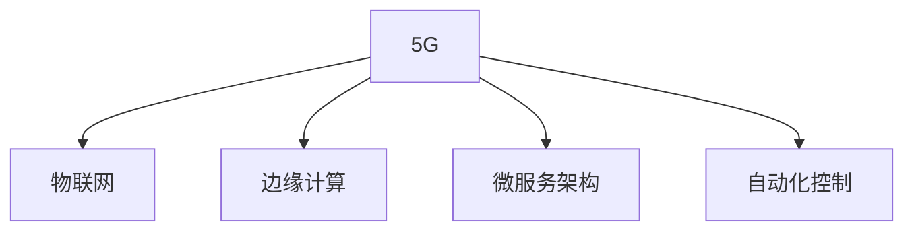

                 

## 1. 背景介绍

### 1.1 问题由来
随着信息技术的不断进步，物联网(IoT)正在成为连接万物的重要手段。物联网的定义是“物物相连的互联网”，即将各种物理设备通过网络进行互联互通，实现数据的采集、传输、存储和处理。然而，传统4G网络在处理海量设备连接和数据传输时，存在着带宽不足、时延较高、连接不稳定等问题，难以满足物联网的实际需求。

### 1.2 问题核心关键点
5G作为新一代移动通信技术，相比4G具备更高的带宽、更低的时延、更广的覆盖范围和更大的连接密度。它不仅能够支持更高的数据传输速率，还提供了端到端低延迟的连接，使得物联网系统能够实现更高效、更稳定、更智能的数据通信。本文将详细探讨5G在物联网中的应用，分析其高速低延迟连接的优势，并展望未来发展趋势。

### 1.3 问题研究意义
研究5G在物联网中的应用，对于推动智能城市的建设、优化工业生产流程、提升智慧医疗水平、增强环境监测能力具有重要意义。通过5G技术，可以实现更快速、更可靠的数据传输，提高物联网系统的实时性和可靠性，从而加速各类行业数字化转型，提升社会生产力和生活质量。

## 2. 核心概念与联系

### 2.1 核心概念概述

为更好地理解5G在物联网中的应用，本节将介绍几个密切相关的核心概念：

- **5G（5th Generation）**：新一代移动通信技术，具有更高的带宽、更低的时延和更大的连接密度，支持更广泛的业务场景。
- **物联网（IoT）**：通过各种传感器和设备，将物理世界中的物品连接到互联网，实现数据采集和传输。
- **边缘计算**：在数据源附近进行计算和处理，减少数据传输时延，提升系统响应速度。
- **微服务架构**：将大型应用程序拆分成一组小服务，每个服务可以独立部署、扩展和管理，提升系统的灵活性和可维护性。
- **自动化控制**：利用机器学习、人工智能等技术，实现对物联网设备的自动化管理和控制。

这些核心概念之间的逻辑关系可以通过以下Mermaid流程图来展示：



这个流程图展示了下5G技术在物联网中的应用，与各个关键技术的关系。

## 3. 核心算法原理 & 具体操作步骤
### 3.1 算法原理概述

5G在物联网中的应用主要体现在以下几个方面：

1. **高速数据传输**：5G的高带宽支持了大规模数据的高效传输，使得物联网设备可以实时传输大量的传感器数据、图像和视频等。
2. **低时延连接**：5G的低时延特性，使得物联网系统能够实现快速响应和实时控制，如智能工厂的生产线监控、智能交通的车辆调度等。
3. **广覆盖和连接密度**：5G技术提供了更广的覆盖范围和更大的连接密度，能够支持更多的设备连接和更广泛的地理区域。
4. **边缘计算**：5G技术支持边缘计算，通过在数据源附近进行计算和处理，减少了数据传输时延，提升了系统响应速度和数据安全性。

### 3.2 算法步骤详解

基于5G技术在物联网中的应用，以下是5G网络架构和关键技术的详细步骤：

**Step 1: 网络架构部署**
- 部署5G核心网和边缘计算节点，构建物联网网络的骨干和边缘架构。
- 选择适合的5G频段和网络拓扑，确保网络覆盖和信号质量。

**Step 2: 设备接入和连接管理**
- 将物联网设备接入5G网络，使用统一的通信协议和接口。
- 进行设备身份认证和授权管理，确保网络安全。

**Step 3: 数据传输与处理**
- 通过5G网络进行数据传输，利用多天线技术和频谱共享技术提高传输效率。
- 利用边缘计算节点进行数据预处理和本地存储，减少数据传输时延。

**Step 4: 应用程序和业务集成**
- 开发和集成各种物联网应用和业务，如智能家居、智慧城市、工业互联网等。
- 使用微服务架构，提升系统的可扩展性和灵活性。

**Step 5: 自动化控制与优化**
- 利用自动化控制技术，实现对物联网设备的动态管理和优化。
- 使用机器学习和大数据分析，优化系统性能和资源利用率。

### 3.3 算法优缺点

5G在物联网中的应用，有以下优点和缺点：

#### 优点
1. **高速传输**：5G的高带宽能够支持海量数据的实时传输，提高系统的数据处理能力。
2. **低时延连接**：5G的低时延特性使得物联网系统能够实现快速响应和实时控制，提升用户体验和系统可靠性。
3. **广覆盖和连接密度**：5G技术提供了更广的覆盖范围和更大的连接密度，支持更多的设备连接和更广泛的地理区域。
4. **边缘计算**：5G支持边缘计算，减少了数据传输时延，提升了系统响应速度和数据安全性。

#### 缺点
1. **成本高**：5G网络的部署和维护成本较高，需要大量的基础设施投资。
2. **网络复杂**：5G网络架构和协议较为复杂，技术实现和调试难度较大。
3. **安全性挑战**：5G网络的安全性仍需进一步提升，防止网络攻击和数据泄露。

### 3.4 算法应用领域

5G技术在物联网中的应用领域广泛，涉及智能家居、智慧城市、工业互联网、智能交通等多个方面：

1. **智能家居**：通过5G网络实现智能设备之间的互联互通，提升家居环境的智能化水平。
2. **智慧城市**：利用5G网络实现城市交通管理、环境监测、公共安全等城市管理功能，提升城市智能化水平。
3. **工业互联网**：通过5G网络实现工业设备的远程监控、数据采集和智能控制，提高工业生产效率和质量。
4. **智能交通**：利用5G网络实现车辆与车辆、车辆与基础设施之间的通信，提升交通管理和安全水平。
5. **医疗健康**：通过5G网络实现远程医疗、健康监测和紧急救援，提升医疗服务的及时性和准确性。

## 4. 数学模型和公式 & 详细讲解 & 举例说明

### 4.1 数学模型构建

5G在物联网中的应用，涉及到数据传输、信号处理、网络优化等多个领域。这里将简要介绍几个核心的数学模型和公式。

**4.1.1 带宽公式**
带宽（Bandwidth）是数据传输速率的重要指标，5G网络提供更高的带宽，使得物联网设备能够高效传输数据。设带宽为 $B$，数据传输速率为 $R$，则：

$$
R = B \times \log_2(1 + S/N)
$$

其中 $S$ 为信号功率，$N$ 为噪声功率，$S/N$ 为信噪比（Signal-to-Noise Ratio）。

**4.1.2 时延公式**
时延（Latency）是网络响应时间的重要指标，5G网络提供更低的时延，使得物联网设备能够实现实时控制。设时延为 $T$，信道长度为 $L$，光速为 $c$，则：

$$
T = L / c
$$

### 4.2 公式推导过程

以下是带宽公式和时延公式的推导过程：

**带宽公式推导**
$$
R = \frac{B \times \log_2(1 + S/N)}{T}
$$

其中 $T$ 为每个符号的持续时间，$S/N$ 为符号的信噪比。将 $S/N$ 代入，得到：

$$
R = \frac{B \times \log_2(1 + S/N)}{T}
$$

**时延公式推导**
在无线信道中，信号传输时延为：

$$
T = \frac{L}{c}
$$

其中 $L$ 为信道长度，$c$ 为光速。因此：

$$
T = \frac{L}{c}
$$

### 4.3 案例分析与讲解

以智能交通系统为例，分析5G网络在其中的应用。

**智能交通信号控制**
在智能交通系统中，信号灯需要通过传感器获取实时交通数据，如车流量、车速等，进行动态调整。5G网络提供低时延连接，可以实现信号灯之间的实时通信，提升交通信号控制的准确性和效率。

**智能车辆监控**
在智能车辆中，5G网络提供高速传输能力，可以实时传输车辆位置、车速、驾驶行为等数据到云端进行处理和分析，实现车辆监控和自动驾驶等功能。

## 5. 项目实践：代码实例和详细解释说明
### 5.1 开发环境搭建

在开发5G物联网应用时，需要先搭建开发环境。以下是使用Python进行5G网络开发的流程：

1. 安装Anaconda：从官网下载并安装Anaconda，用于创建独立的Python环境。

2. 创建并激活虚拟环境：
```bash
conda create -n 5g-env python=3.8 
conda activate 5g-env
```

3. 安装5G相关的Python库：
```bash
conda install pyglib flamenco pyserial portpicker paho-mqtt
```

4. 安装5G网络模拟器：
```bash
conda install --channel https://conda.anaconda.org/streco/linux-64/5g --extra-index-url https://conda.anaconda.org/streco/linux-64/5g
```

5. 安装边缘计算相关的Python库：
```bash
conda install --channel https://conda.anaconda.org/streco/linux-64/5g --extra-index-url https://conda.anaconda.org/streco/linux-64/5g python-multicore flask gunicorn
```

6. 安装微服务相关的Python库：
```bash
conda install --channel https://conda.anaconda.org/streco/linux-64/5g --extra-index-url https://conda.anaconda.org/streco/linux-64/5g flask-restful
```

完成上述步骤后，即可在`5g-env`环境中开始5G物联网应用的开发。

### 5.2 源代码详细实现

下面以智能交通系统为例，展示5G网络在其中的应用。

首先，定义信号灯的传感器数据收集和处理函数：

```python
from pyglib import Pyglib
from pyglib.sensors import LightSensor

class SignalLight:
    def __init__(self, id):
        self.id = id
        self.sensor = LightSensor(self.id)

    def get_state(self):
        return self.sensor.get_state()

    def set_state(self, state):
        self.sensor.set_state(state)
```

然后，定义5G网络通信模块：

```python
from pyglib.comms import 5g

class SignalLight5G:
    def __init__(self, id, gateway):
        self.id = id
        self.gateway = gateway

    def send_state(self, state):
        packet = 5g.Packet(to=self.gateway, data=b'\x02\x00\x00\x00\x00\x00\x00\x00\x00\x01' + self.id.encode('ascii') + b'\x00\x00\x00\x00\x00\x00\x00\x00\x01\x02\x00\x00\x00\x00\x00\x00\x00\x00\x02'
        self.gateway.send(packet)

    def receive_state(self):
        packet = self.gateway.receive()
        if packet.data.startswith(b'\x02\x00\x00\x00\x00\x00\x00\x00\x00\x01'):
            return packet.data[2:].decode('ascii')
        else:
            return None
```

最后，实现5G物联网应用的逻辑：

```python
from flask import Flask, jsonify
from signal_light import SignalLight

app = Flask(__name__)

@app.route('/<int:id>', methods=['GET'])
def get_state(id):
    signal_light = SignalLight(id)
    state = signal_light.get_state()
    return jsonify({'id': id, 'state': state})

@app.route('/<int:id>', methods=['POST'])
def set_state(id, data):
    signal_light = SignalLight(id)
    state = data
    signal_light.set_state(state)
    return jsonify({'id': id, 'state': state})

@app.route('/<int:id>', methods=['GET'])
def receive_state(id):
    signal_light = SignalLight5G(id, gateway)
    state = signal_light.receive_state()
    return jsonify({'id': id, 'state': state})

if __name__ == '__main__':
    app.run(debug=True)
```

### 5.3 代码解读与分析

让我们再详细解读一下关键代码的实现细节：

**SignalLight类**
- `__init__`方法：初始化信号灯的ID和传感器对象。
- `get_state`方法：通过传感器获取信号灯的状态。
- `set_state`方法：设置信号灯的状态。

**SignalLight5G类**
- `__init__`方法：初始化信号灯的ID和网关对象。
- `send_state`方法：将信号灯的状态通过5G网络发送给网关。
- `receive_state`方法：从网关接收信号灯的状态数据。

**Flask应用**
- 定义`get_state`方法，获取信号灯的状态。
- 定义`set_state`方法，设置信号灯的状态。
- 定义`receive_state`方法，接收信号灯的状态数据。

完成上述代码实现后，可以通过Flask应用运行信号灯的状态管理功能。

## 6. 实际应用场景

### 6.1 智能家居

在智能家居中，5G网络可以实现智能设备的互联互通，提升家居环境的智能化水平。通过5G网络，可以实现智能灯光控制、智能家电管理、智能安防监控等功能，提升家居生活的舒适性和安全性。

### 6.2 智慧城市

在智慧城市中，5G网络可以实现城市交通管理、环境监测、公共安全等城市管理功能，提升城市智能化水平。例如，通过5G网络实现实时交通监控、智能停车、智慧医疗等功能，提高城市管理效率和服务水平。

### 6.3 工业互联网

在工业互联网中，5G网络可以实现工业设备的远程监控、数据采集和智能控制，提高工业生产效率和质量。例如，通过5G网络实现工业设备的实时状态监测、故障预测和维护管理，提升生产线的自动化和智能化水平。

### 6.4 智能交通

在智能交通中，5G网络可以实现车辆与车辆、车辆与基础设施之间的通信，提升交通管理和安全水平。例如，通过5G网络实现车辆定位、车辆导航、智能交通信号控制等功能，提高交通效率和安全性。

### 6.5 医疗健康

在医疗健康中，5G网络可以实现远程医疗、健康监测和紧急救援，提升医疗服务的及时性和准确性。例如，通过5G网络实现远程手术、智能健康监测、紧急救援指挥等功能，提高医疗服务的可及性和效率。

## 7. 工具和资源推荐

### 7.1 学习资源推荐

为了帮助开发者掌握5G在物联网中的应用，这里推荐一些优质的学习资源：

1. **《5G技术与应用》系列博文**：由5G专家撰写，全面介绍了5G技术的原理、标准和应用，适合入门学习。
2. **5G标准文档**：IEEE和3GPP等标准组织发布的5G标准文档，详细描述了5G网络的架构和协议。
3. **《物联网智能系统》书籍**：介绍了物联网系统的原理、架构和应用，包含5G网络的应用案例。
4. **5G网络模拟器**：用于模拟5G网络的实验环境，如FlameNet、Lsisim等，适合实验和测试。
5. **5G开发资源网站**：如5G Hub、5G Ecosystem等，提供丰富的5G开发资源和教程。

通过对这些资源的学习实践，相信你一定能够快速掌握5G在物联网中的应用，并用于解决实际的NLP问题。

### 7.2 开发工具推荐

高效的开发离不开优秀的工具支持。以下是几款用于5G物联网开发常用的工具：

1. **Flask**：轻量级的Python Web框架，适用于开发5G物联网应用。
2. **Flamenco**：跨平台5G网络模拟器，用于开发和测试5G物联网应用。
3. **PySerial**：Python串口通信库，用于5G物联网设备的通信。
4. **PyGlib**：5G网络库，提供了5G网络编程接口，方便开发5G物联网应用。
5. **Flask-RESTful**：基于Flask的RESTful API框架，用于构建5G物联网应用的API接口。

合理利用这些工具，可以显著提升5G物联网应用的开发效率，加快创新迭代的步伐。

### 7.3 相关论文推荐

5G技术在物联网中的应用，是当前研究的热点领域。以下是几篇奠基性的相关论文，推荐阅读：

1. **5G Network Architecture and Technology**：介绍5G网络架构和技术标准，为5G物联网应用提供理论支持。
2. **Edge Computing for IoT Applications**：探讨边缘计算在5G物联网中的应用，提升数据处理和传输效率。
3. **Intelligent Traffic Management with 5G**：分析5G网络在智能交通中的应用，提升交通管理和安全水平。
4. **Industrial Internet of Things with 5G**：研究5G网络在工业互联网中的应用，提高工业生产效率和质量。
5. **Healthcare in 5G Internet of Things**：探讨5G网络在智慧医疗中的应用，提升医疗服务的及时性和准确性。

这些论文代表了大规模语言模型微调技术的发展脉络。通过学习这些前沿成果，可以帮助研究者把握学科前进方向，激发更多的创新灵感。

## 8. 总结：未来发展趋势与挑战

### 8.1 总结

本文对5G在物联网中的应用进行了全面系统的介绍。首先阐述了5G和物联网的定义，明确了5G在物联网中的作用。其次，从原理到实践，详细讲解了5G网络在物联网中的应用，分析了5G网络的优势和不足。最后，探讨了5G物联网应用的实际场景，给出了未来的发展方向。

通过本文的系统梳理，可以看到，5G网络在物联网中的应用不仅能够提供高速、低时延的连接，还支持边缘计算和微服务架构，为物联网设备的智能化和自动化提供了强有力的支持。未来，随着5G网络的进一步普及和优化，5G在物联网中的应用将更加广泛，带来更多的创新和变革。

### 8.2 未来发展趋势

展望未来，5G在物联网中的应用将呈现以下几个发展趋势：

1. **更广的覆盖范围和更高的可靠性**：5G网络将进一步扩大覆盖范围，提升网络可靠性，支持更多的物联网设备接入。
2. **更高的数据传输速率和更低的时延**：5G网络将继续提升数据传输速率和时延性能，满足更复杂的应用需求。
3. **更加灵活的部署和管理方式**：5G网络将支持更多的部署方式，如边缘计算、云网融合等，提升系统的灵活性和可维护性。
4. **更加丰富的业务场景和应用**：5G网络将支持更多的业务场景和应用，如智慧城市、智能制造、智能交通等，带来更多的创新和变革。

### 8.3 面临的挑战

尽管5G在物联网中的应用前景广阔，但在推广应用的过程中，仍面临以下挑战：

1. **成本高昂**：5G网络的部署和维护成本较高，需要大量的基础设施投资。
2. **技术复杂**：5G网络架构和协议较为复杂，技术实现和调试难度较大。
3. **安全性问题**：5G网络的安全性仍需进一步提升，防止网络攻击和数据泄露。
4. **数据隐私和伦理问题**：5G网络的应用涉及大量的个人隐私数据，需要严格的数据保护和隐私保护措施。
5. **技术标准的统一**：不同国家和地区的5G网络标准可能存在差异，需要统一标准以确保设备的互操作性。

### 8.4 研究展望

面对5G在物联网应用中面临的挑战，未来的研究需要在以下几个方面寻求新的突破：

1. **降低网络部署和维护成本**：研究更高效、更经济的5G网络部署方案，降低网络建设和维护成本。
2. **简化网络架构和协议**：研究更加简单、易用的5G网络架构和协议，降低技术实现难度。
3. **提升网络安全性**：研究更强的网络安全技术，防止网络攻击和数据泄露。
4. **加强数据隐私保护**：研究更加严格的数据隐私保护措施，确保数据安全和隐私。
5. **统一技术标准**：研究5G网络的技术标准，推动全球统一的技术标准，确保设备的互操作性。

总之，未来5G在物联网中的应用将面临更多的挑战，但通过不断的技术创新和优化，这些挑战终将被克服，5G在物联网中的应用将更加广泛和深入。

## 9. 附录：常见问题与解答

**Q1：5G网络在物联网中的应用有哪些？**

A: 5G网络在物联网中的应用广泛，涉及智能家居、智慧城市、工业互联网、智能交通等多个方面。具体应用包括：智能灯光控制、智能家电管理、智能安防监控、城市交通管理、环境监测、公共安全、工业设备监控、远程医疗、健康监测、紧急救援等。

**Q2：5G网络在物联网中的优势有哪些？**

A: 5G网络在物联网中的优势主要包括：

1. 高速传输：5G网络提供更高的带宽，支持海量数据的实时传输。
2. 低时延连接：5G网络提供更低的时延，使得物联网设备能够实现实时控制。
3. 广覆盖和连接密度：5G网络提供更广的覆盖范围和更大的连接密度，支持更多的设备连接和更广泛的地理区域。
4. 边缘计算：5G网络支持边缘计算，减少了数据传输时延，提升了系统响应速度和数据安全性。

**Q3：5G网络在物联网中的应用面临哪些挑战？**

A: 5G网络在物联网中的应用面临以下挑战：

1. 成本高昂：5G网络的部署和维护成本较高，需要大量的基础设施投资。
2. 技术复杂：5G网络架构和协议较为复杂，技术实现和调试难度较大。
3. 安全性问题：5G网络的安全性仍需进一步提升，防止网络攻击和数据泄露。
4. 数据隐私和伦理问题：5G网络的应用涉及大量的个人隐私数据，需要严格的数据保护和隐私保护措施。
5. 技术标准的统一：不同国家和地区的5G网络标准可能存在差异，需要统一标准以确保设备的互操作性。

**Q4：5G网络在物联网中的应用有哪些实际案例？**

A: 5G网络在物联网中的应用已有多个实际案例，例如：

1. 智能家居：通过5G网络实现智能设备之间的互联互通，提升家居环境的智能化水平。
2. 智慧城市：利用5G网络实现城市交通管理、环境监测、公共安全等城市管理功能，提升城市智能化水平。
3. 工业互联网：通过5G网络实现工业设备的远程监控、数据采集和智能控制，提高工业生产效率和质量。
4. 智能交通：利用5G网络实现车辆与车辆、车辆与基础设施之间的通信，提升交通管理和安全水平。
5. 医疗健康：通过5G网络实现远程医疗、健康监测和紧急救援，提升医疗服务的及时性和准确性。

---

作者：禅与计算机程序设计艺术 / Zen and the Art of Computer Programming

