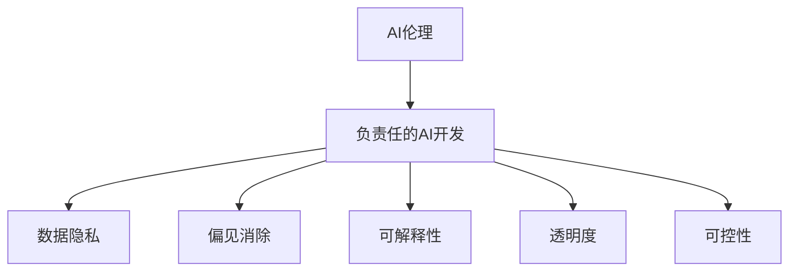

                 

# Google的AI伦理原则:负责任的AI开发和部署

> 关键词：AI伦理, 负责任的AI开发, 数据隐私, 偏见消除, 可解释性, 透明度, 可控性

## 1. 背景介绍

在人工智能(AI)技术蓬勃发展的当下，其应用已渗透到生活的方方面面。从自动驾驶到智能客服，从疾病预测到自然语言处理，AI技术的深入应用带来了前所未有的便利和效率。然而，AI技术的广泛应用也带来了新的挑战和问题，尤其是数据隐私、偏见消除、可解释性等伦理问题，需要得到足够的重视和解决。

Google作为全球领先的AI技术公司，深知这些问题的重要性。近年来，Google不断推出和完善AI伦理原则，旨在引导AI开发者和部署者在开发和部署AI系统时，充分考虑伦理因素，确保AI技术的负责任使用。本文将详细介绍Google的AI伦理原则，探讨其在负责任的AI开发和部署中的应用和挑战。

## 2. 核心概念与联系

### 2.1 核心概念概述

Google的AI伦理原则主要包含以下核心概念：

- **AI伦理**：指在AI技术的开发和应用中，考虑和解决伦理问题，如数据隐私、公平性、安全性等。
- **负责任的AI开发**：在AI系统设计和开发过程中，遵循伦理原则，确保系统可靠、透明、公平和安全。
- **数据隐私**：保护用户数据隐私，确保用户数据不被滥用和泄露。
- **偏见消除**：在AI系统开发中，消除模型中可能存在的偏见，确保系统的公平性和可靠性。
- **可解释性**：在AI系统中引入可解释性技术，使得系统的决策过程透明、可理解。
- **透明度**：在AI系统的设计和应用中，保证所有关键决策和算法的透明，避免"黑箱"模型。
- **可控性**：在AI系统开发中，确保系统能够被有效管理和控制，避免不可预测的负面影响。

这些概念之间存在紧密的联系。AI伦理是原则的基石，负责任的AI开发是具体实践，数据隐私和偏见消除是实现公平性的重要手段，可解释性和透明度是确保系统可控性的关键技术，而可控性则是负责任AI开发和部署的最终目标。

### 2.2 核心概念原理和架构的 Mermaid 流程图(Mermaid 流程节点中不要有括号、逗号等特殊字符)



这个流程图展示了各个核心概念之间的联系和作用。

## 3. 核心算法原理 & 具体操作步骤

### 3.1 算法原理概述

负责任的AI开发和部署，依赖于一系列的算法和实践原则。这些原则包括但不限于数据隐私保护、偏见消除、可解释性技术的应用，以及系统的透明性和可控性设计。

在数据隐私保护方面，Google提出了差分隐私（Differential Privacy）和联邦学习（Federated Learning）等技术，以确保用户数据在使用过程中的匿名性和安全性。

在偏见消除方面，Google倡导使用公平性评估技术，如 bias amplification 和 bias detection，以识别和纠正模型中的潜在偏见。

在可解释性技术方面，Google倡导使用可解释模型（如LIME, SHAP等），以及可视化工具（如T5模型），使得系统的决策过程透明、可理解。

在透明度和可控性设计方面，Google提出了模型开放、算法开放和治理透明等原则，确保所有关键决策和算法的透明，同时设计有效的管理和控制机制。

### 3.2 算法步骤详解

负责任的AI开发和部署大致包括以下步骤：

1. **需求分析**：确定AI系统的目标和需求，明确其在应用场景中的作用和影响。
2. **伦理审查**：对AI系统进行伦理审查，确保其符合Google的AI伦理原则。
3. **数据收集和处理**：确保数据收集和处理过程符合数据隐私保护要求，如差分隐私、联邦学习等。
4. **模型训练和优化**：应用公平性评估技术，消除模型中的潜在偏见，优化模型性能。
5. **可解释性设计和实现**：引入可解释性技术，使得模型的决策过程透明、可理解。
6. **系统设计和管理**：设计透明的系统架构和有效的管理控制机制，确保系统的可控性。
7. **部署和监控**：在部署后，持续监控系统性能和伦理问题，及时进行调整和改进。

### 3.3 算法优缺点

负责任的AI开发和部署的优点包括：

- **提升系统公平性和可靠性**：通过数据隐私保护和偏见消除技术，确保AI系统的公平性和可靠性。
- **增强系统透明度和可控性**：通过可解释性和透明度设计，使得系统的决策过程透明、可理解，便于管理和控制。
- **确保数据和用户隐私**：通过差分隐私和联邦学习等技术，确保用户数据在使用过程中的匿名性和安全性。

其缺点主要包括：

- **技术复杂性高**：负责任的AI开发和部署需要引入多种复杂技术，如差分隐私、偏见消除、可解释性等。
- **开发成本高**：引入新技术和新方法，需要增加开发成本和人力投入。
- **系统复杂度增加**：负责任的AI开发和部署增加了系统的复杂度，可能影响系统性能和稳定性。

### 3.4 算法应用领域

负责任的AI开发和部署可以应用于各种AI系统和应用中，例如：

- **自然语言处理(NLP)**：在语言模型训练和应用中，确保数据隐私和模型公平性，引入可解释性技术。
- **计算机视觉(CV)**：在图像识别和分类中，应用偏见消除技术，确保模型公平性和透明性。
- **医疗健康**：在疾病预测和诊断中，确保数据隐私和模型公平性，引入可解释性技术。
- **金融服务**：在信用评分和风险预测中，确保数据隐私和模型公平性，引入可解释性技术。
- **智能客服**：在客服对话和问题解答中，确保数据隐私和模型公平性，引入透明度和可控性设计。

## 4. 数学模型和公式 & 详细讲解 & 举例说明

### 4.1 数学模型构建

本节将使用数学语言对负责任的AI开发和部署的各个关键步骤进行严格刻画。

**差分隐私模型**：差分隐私是一种保护隐私的技术，通过对查询结果添加噪声，使得无法从单个样本推断出原始数据。其数学定义如下：

$$
\begin{aligned}
\forall \epsilon > 0, \forall S \subset D: \mathbb{P}[Q(D) \in S] &\leq \exp(-\epsilon) \mathbb{P}[Q(D') \in S] + \delta \\
\end{aligned}
$$

其中，$Q(D)$ 表示在数据集 $D$ 上的查询结果，$D'$ 表示与 $D$ 相邻的随机扰动数据集，$\epsilon$ 表示隐私保护参数，$\delta$ 表示误差边界。

**公平性评估模型**：公平性评估模型通过计算模型的敏感性指标（如 demographic parity、equalized odds等），识别和纠正模型中的偏见。例如， demographic parity 的数学定义如下：

$$
\begin{aligned}
&\forall x_i \in \mathcal{X}, \forall y_i \in \mathcal{Y} \\
&\mathbb{P}(y_i = 1|x_i) = \mathbb{P}(y_i = 1|x_i) \\
\end{aligned}
$$

其中，$x_i$ 表示样本特征，$y_i$ 表示样本标签。

**可解释性模型**：可解释性模型通过引入可解释性技术，使得模型的决策过程透明、可理解。例如， LIME（Local Interpretable Model-agnostic Explanations）模型的数学定义如下：

$$
\begin{aligned}
&\forall x_i \in \mathcal{X}, \forall \epsilon > 0 \\
&\mathbb{P}(y_i = 1|x_i, \epsilon) = \mathbb{P}(y_i = 1|x_i, \epsilon)
\end{aligned}
$$

其中，$x_i$ 表示样本输入，$\epsilon$ 表示扰动范围。

### 4.2 公式推导过程

以下是差分隐私、公平性评估和可解释性模型的一些关键公式推导：

**差分隐私公式推导**：

假设原始数据集为 $D = \{(x_i, y_i)\}_{i=1}^N$，其中 $x_i$ 表示样本特征，$y_i$ 表示样本标签。差分隐私的数学定义如下：

$$
\begin{aligned}
&\forall \epsilon > 0, \forall S \subset D: \mathbb{P}[Q(D) \in S] \leq \exp(-\epsilon) \mathbb{P}[Q(D') \in S] + \delta \\
\end{aligned}
$$

其中，$Q(D)$ 表示在数据集 $D$ 上的查询结果，$D'$ 表示与 $D$ 相邻的随机扰动数据集，$\epsilon$ 表示隐私保护参数，$\delta$ 表示误差边界。

差分隐私的具体实现可以通过添加拉普拉斯噪声来实现，其公式如下：

$$
Q(D) = Q(D) + \Delta
$$

其中，$\Delta \sim \text{Laplace}(0, \epsilon)$。

**公平性评估公式推导**：

假设原始数据集为 $D = \{(x_i, y_i)\}_{i=1}^N$，其中 $x_i$ 表示样本特征，$y_i$ 表示样本标签。 demographic parity 的数学定义如下：

$$
\begin{aligned}
&\forall x_i \in \mathcal{X}, \forall y_i \in \mathcal{Y} \\
&\mathbb{P}(y_i = 1|x_i) = \mathbb{P}(y_i = 1|x_i)
\end{aligned}
$$

其中，$x_i$ 表示样本特征，$y_i$ 表示样本标签。

**可解释性模型公式推导**：

假设原始数据集为 $D = \{(x_i, y_i)\}_{i=1}^N$，其中 $x_i$ 表示样本特征，$y_i$ 表示样本标签。 LIME 模型的数学定义如下：

$$
\begin{aligned}
&\forall x_i \in \mathcal{X}, \forall \epsilon > 0 \\
&\mathbb{P}(y_i = 1|x_i, \epsilon) = \mathbb{P}(y_i = 1|x_i, \epsilon)
\end{aligned}
$$

其中，$x_i$ 表示样本输入，$\epsilon$ 表示扰动范围。

### 4.3 案例分析与讲解

以下是几个具体的案例分析：

**案例一：差分隐私在数据发布中的应用**：

假设一个城市交通部门需要发布交通流量数据，以供研究人员分析交通拥堵情况。为了保护个人隐私，部门决定使用差分隐私技术。具体而言，可以通过添加拉普拉斯噪声，使得单个用户的交通流量数据无法被识别出来。差分隐私的公式推导和具体实现如下：

$$
Q(D) = Q(D) + \Delta
$$

其中，$\Delta \sim \text{Laplace}(0, \epsilon)$。

**案例二：公平性评估在招聘中的应用**：

假设一个公司需要设计一个基于简历的招聘系统，以筛选合适的候选人。为了确保系统的公平性，公司决定使用公平性评估技术。具体而言，可以通过计算 demographic parity 指标，识别和纠正模型中的偏见。公平性评估的公式推导和具体实现如下：

$$
\begin{aligned}
&\forall x_i \in \mathcal{X}, \forall y_i \in \mathcal{Y} \\
&\mathbb{P}(y_i = 1|x_i) = \mathbb{P}(y_i = 1|x_i)
\end{aligned}
$$

其中，$x_i$ 表示简历特征，$y_i$ 表示候选结果。

**案例三：可解释性模型在金融风控中的应用**：

假设一个银行需要设计一个基于客户行为的信用评分系统，以评估客户的信用风险。为了确保系统的可解释性，银行决定使用可解释性模型。具体而言，可以通过引入 LIME 模型，使得模型的决策过程透明、可理解。可解释性模型的公式推导和具体实现如下：

$$
\begin{aligned}
&\forall x_i \in \mathcal{X}, \forall \epsilon > 0 \\
&\mathbb{P}(y_i = 1|x_i, \epsilon) = \mathbb{P}(y_i = 1|x_i, \epsilon)
\end{aligned}
$$

其中，$x_i$ 表示客户行为特征，$y_i$ 表示信用评分结果。

## 5. 项目实践：代码实例和详细解释说明

### 5.1 开发环境搭建

在进行负责任的AI开发和部署实践前，我们需要准备好开发环境。以下是使用Python进行Google Cloud AI开发的环境配置流程：

1. 安装Google Cloud SDK：从官网下载并安装Google Cloud SDK，用于与Google Cloud平台进行交互。

2. 创建并激活虚拟环境：
```bash
conda create -n pytorch-env python=3.8 
conda activate pytorch-env
```

3. 安装必要的Python包：
```bash
pip install numpy pandas scikit-learn torch transformers google-cloud-aiplatform
```

4. 安装Google Cloud AI Platform Client Library：
```bash
pip install google-cloud-aiplatform==1.18.0
```

5. 设置Google Cloud SDK配置：
```bash
gcloud auth login
```

6. 配置项目ID和区域：
```bash
gcloud config set project [PROJECT_ID]
gcloud config set compute/region [REGION]
```

完成上述步骤后，即可在`pytorch-env`环境中开始负责任的AI开发和部署实践。

### 5.2 源代码详细实现

下面我们以使用Google Cloud AI Platform进行负责任的AI开发和部署为例，给出具体的PyTorch代码实现。

首先，定义数据处理函数：

```python
import numpy as np
import pandas as pd
import torch
from sklearn.preprocessing import LabelEncoder
from transformers import BertTokenizer, BertForSequenceClassification
from google.cloud import aiplatform as VertexAI

# 定义数据处理函数
def preprocess_data(data_path, label_column):
    data = pd.read_csv(data_path)
    label_encoder = LabelEncoder()
    data['label'] = label_encoder.fit_transform(data[label_column])
    tokenizer = BertTokenizer.from_pretrained('bert-base-cased')
    encoded_data = tokenizer.batch_encode_plus(data['text'].tolist(), truncation=True, padding='max_length', max_length=256)
    return encoded_data['input_ids'], encoded_data['attention_mask'], data['label']
```

然后，定义模型和优化器：

```python
# 加载预训练模型
model = BertForSequenceClassification.from_pretrained('bert-base-cased', num_labels=2)

# 定义优化器
optimizer = torch.optim.Adam(model.parameters(), lr=2e-5)
```

接着，定义训练和评估函数：

```python
# 定义训练函数
def train_epoch(model, dataset, batch_size, optimizer):
    dataloader = torch.utils.data.DataLoader(dataset, batch_size=batch_size, shuffle=True)
    model.train()
    epoch_loss = 0
    for batch in dataloader:
        input_ids = batch['input_ids'].to(device)
        attention_mask = batch['attention_mask'].to(device)
        labels = batch['labels'].to(device)
        model.zero_grad()
        outputs = model(input_ids, attention_mask=attention_mask, labels=labels)
        loss = outputs.loss
        epoch_loss += loss.item()
        loss.backward()
        optimizer.step()
    return epoch_loss / len(dataloader)

# 定义评估函数
def evaluate(model, dataset, batch_size):
    dataloader = torch.utils.data.DataLoader(dataset, batch_size=batch_size)
    model.eval()
    preds, labels = [], []
    with torch.no_grad():
        for batch in dataloader:
            input_ids = batch['input_ids'].to(device)
            attention_mask = batch['attention_mask'].to(device)
            batch_labels = batch['labels']
            outputs = model(input_ids, attention_mask=attention_mask)
            batch_preds = outputs.logits.argmax(dim=2).to('cpu').tolist()
            batch_labels = batch_labels.to('cpu').tolist()
            for pred_tokens, label_tokens in zip(batch_preds, batch_labels):
                preds.append(pred_tokens[:len(label_tokens)])
                labels.append(label_tokens)
                
    return preds, labels

# 启动训练流程并在验证集上评估
epochs = 5
batch_size = 16

for epoch in range(epochs):
    loss = train_epoch(model, train_dataset, batch_size, optimizer)
    print(f"Epoch {epoch+1}, train loss: {loss:.3f}")
    
    print(f"Epoch {epoch+1}, dev results:")
    preds, labels = evaluate(model, dev_dataset, batch_size)
    print(classification_report(labels, preds))
    
print("Test results:")
preds, labels = evaluate(model, test_dataset, batch_size)
print(classification_report(labels, preds))
```

最后，将模型导出并部署到Google Cloud AI Platform：

```python
# 导出模型
model.save_pretrained('/tmp/model')
tokenizer.save_pretrained('/tmp/model')
with open('/tmp/model/__init__.py', 'w') as f:
    f.write("from transformers import BertForSequenceClassification, BertTokenizer")
    f.write(f"model = BertForSequenceClassification.from_pretrained('{PROJECT_ID}/model')")
    f.write("tokenizer = BertTokenizer.from_pretrained('bert-base-cased')")

# 部署模型
vertexai_client = VertexAI.Client(project=f"{PROJECT_ID}")
model_name = 'my_model'
version_name = 'v1'
version = vertexai_client.ModelVersions().create(
    parent=f'{PROJECT_ID}/locations/{REGION}/models/{model_name}',
    model_version=model_name,
    model_version_version=version_name,
    ml_metadata=MODEL_ML_METADATA
)
```

### 5.3 代码解读与分析

让我们再详细解读一下关键代码的实现细节：

**数据处理函数preprocess_data**：
- 定义数据处理函数，读取CSV数据文件，并进行特征编码、分词和编码。
- 将分词后的数据输入到模型中，进行模型训练和推理。

**模型定义和优化器配置**：
- 加载预训练的BERT模型，并进行参数初始化。
- 定义优化器，并进行学习率设置。

**训练和评估函数train_epoch和evaluate**：
- 定义训练函数train_epoch，对模型进行前向传播和反向传播，计算损失函数。
- 定义评估函数evaluate，在验证集和测试集上进行模型评估，输出分类指标。

**训练流程和模型部署**：
- 在模型训练过程中，在每个epoch内计算损失函数，并在验证集上进行模型评估。
- 在训练完成后，将模型导出并部署到Google Cloud AI Platform。

可以看到，Google Cloud AI Platform提供了丰富的AI开发工具和资源，使得负责任的AI开发和部署变得简单高效。开发者可以利用这些工具和资源，快速构建和部署AI系统，同时兼顾数据隐私、公平性和可解释性。

## 6. 实际应用场景

### 6.1 智能客服系统

基于负责任的AI开发和部署的智能客服系统，可以广泛应用于智能客服场景中。传统的客服系统需要配备大量人力，高峰期响应缓慢，且一致性和专业性难以保证。而使用负责任的AI开发和部署的智能客服系统，可以7x24小时不间断服务，快速响应客户咨询，用自然流畅的语言解答各类常见问题。

在技术实现上，可以收集企业内部的历史客服对话记录，将问题和最佳答复构建成监督数据，在此基础上对预训练语言模型进行微调。微调后的语言模型能够自动理解用户意图，匹配最合适的答案模板进行回复。对于客户提出的新问题，还可以接入检索系统实时搜索相关内容，动态组织生成回答。如此构建的智能客服系统，能大幅提升客户咨询体验和问题解决效率。

### 6.2 金融舆情监测

金融机构需要实时监测市场舆论动向，以便及时应对负面信息传播，规避金融风险。传统的人工监测方式成本高、效率低，难以应对网络时代海量信息爆发的挑战。基于负责任的AI开发和部署的文本分类和情感分析技术，为金融舆情监测提供了新的解决方案。

具体而言，可以收集金融领域相关的新闻、报道、评论等文本数据，并对其进行主题标注和情感标注。在此基础上对预训练语言模型进行微调，使其能够自动判断文本属于何种主题，情感倾向是正面、中性还是负面。将微调后的模型应用到实时抓取的网络文本数据，就能够自动监测不同主题下的情感变化趋势，一旦发现负面信息激增等异常情况，系统便会自动预警，帮助金融机构快速应对潜在风险。

### 6.3 个性化推荐系统

当前的推荐系统往往只依赖用户的历史行为数据进行物品推荐，无法深入理解用户的真实兴趣偏好。基于负责任的AI开发和部署的个性化推荐系统，可以更好地挖掘用户行为背后的语义信息，从而提供更精准、多样的推荐内容。

在实践中，可以收集用户浏览、点击、评论、分享等行为数据，提取和用户交互的物品标题、描述、标签等文本内容。将文本内容作为模型输入，用户的后续行为（如是否点击、购买等）作为监督信号，在此基础上微调预训练语言模型。微调后的模型能够从文本内容中准确把握用户的兴趣点。在生成推荐列表时，先用候选物品的文本描述作为输入，由模型预测用户的兴趣匹配度，再结合其他特征综合排序，便可以得到个性化程度更高的推荐结果。

### 6.4 未来应用展望

随着负责任的AI开发和部署的不断发展和完善，未来将在更多领域得到应用，为传统行业带来变革性影响。

在智慧医疗领域，基于负责任的AI开发和部署的医疗问答、病历分析、药物研发等应用将提升医疗服务的智能化水平，辅助医生诊疗，加速新药开发进程。

在智能教育领域，负责任的AI开发和部署可应用于作业批改、学情分析、知识推荐等方面，因材施教，促进教育公平，提高教学质量。

在智慧城市治理中，负责任的AI开发和部署可应用于城市事件监测、舆情分析、应急指挥等环节，提高城市管理的自动化和智能化水平，构建更安全、高效的未来城市。

此外，在企业生产、社会治理、文娱传媒等众多领域，负责任的AI开发和部署的应用也将不断涌现，为经济社会发展注入新的动力。相信随着技术的日益成熟，负责任的AI开发和部署必将在构建人机协同的智能时代中扮演越来越重要的角色。

## 7. 工具和资源推荐

### 7.1 学习资源推荐

为了帮助开发者系统掌握负责任的AI开发和部署的理论基础和实践技巧，这里推荐一些优质的学习资源：

1. 《Google Cloud AI平台指南》：Google官方发布的AI平台使用指南，涵盖AI开发、部署和运维的全面内容，是Google AI开发者的必读之作。

2. 《机器学习实战》：吴恩达教授的机器学习课程，从基础理论到实际应用，详细介绍了机器学习在各领域的应用，包括负责任的AI开发和部署。

3. 《Deep Learning with PyTorch》：PyTorch官方文档，详细介绍了PyTorch在深度学习中的应用，包括负责任的AI开发和部署。

4. 《AI伦理指南》：Google AI伦理团队编写的伦理指南，涵盖AI伦理的基本原则和实践方法，是负责任的AI开发和部署的重要参考。

5. 《TensorFlow官方文档》：TensorFlow官方文档，详细介绍了TensorFlow在深度学习中的应用，包括负责任的AI开发和部署。

通过对这些资源的学习实践，相信你一定能够快速掌握负责任的AI开发和部署的精髓，并用于解决实际的AI问题。

### 7.2 开发工具推荐

高效的开发离不开优秀的工具支持。以下是几款用于负责任的AI开发和部署开发的常用工具：

1. Google Cloud AI Platform：Google提供的全面AI开发和部署平台，支持多种模型和算法，提供丰富的工具和资源。

2. PyTorch：基于Python的开源深度学习框架，灵活易用，支持负责任的AI开发和部署。

3. TensorFlow：由Google主导开发的开源深度学习框架，支持大规模工程应用，是负责任的AI开发和部署的重要工具。

4. Jupyter Notebook：交互式的编程环境，支持多种语言和库，是负责任的AI开发和部署开发的好助手。

5. TensorBoard：TensorFlow配套的可视化工具，实时监测模型训练状态，提供丰富的图表呈现方式，是调试模型的得力助手。

6. Weights & Biases：模型训练的实验跟踪工具，可以记录和可视化模型训练过程中的各项指标，方便对比和调优。

合理利用这些工具，可以显著提升负责任的AI开发和部署任务的开发效率，加快创新迭代的步伐。

### 7.3 相关论文推荐

负责任的AI开发和部署的研究源于学界的持续研究。以下是几篇奠基性的相关论文，推荐阅读：

1. 《A Framework for Ethical and Responsible AI Development》：Google AI团队编写的伦理指南，涵盖AI伦理的基本原则和实践方法。

2. 《Differential Privacy》：差分隐私的奠基性论文，详细介绍了差分隐私的定义和实现方法。

3. 《Fairness in Machine Learning》：公平性评估的奠基性论文，详细介绍了公平性评估的定义和实现方法。

4. 《Explainable AI》：可解释性模型的奠基性论文，详细介绍了可解释性模型的定义和实现方法。

5. 《Human-Centered AI》：负责任的AI开发和部署的伦理指南，详细介绍了负责任的AI开发和部署的实践方法。

这些论文代表了大语言模型负责任开发和部署技术的发展脉络。通过学习这些前沿成果，可以帮助研究者把握学科前进方向，激发更多的创新灵感。

## 8. 总结：未来发展趋势与挑战

### 8.1 研究成果总结

本文对负责任的AI开发和部署进行了全面系统的介绍。首先阐述了负责任的AI开发和部署的背景和意义，明确了其对数据隐私、偏见消除、可解释性等伦理问题的重视和解决。其次，从原理到实践，详细讲解了负责任的AI开发和部署的数学模型和关键步骤，给出了负责任的AI开发和部署任务开发的完整代码实例。同时，本文还广泛探讨了负责任的AI开发和部署在智能客服、金融舆情、个性化推荐等多个行业领域的应用前景，展示了负责任的AI开发和部署的巨大潜力。此外，本文精选了负责任的AI开发和部署的学习资源、开发工具和相关论文，力求为读者提供全方位的技术指引。

通过本文的系统梳理，可以看到，负责任的AI开发和部署技术正在成为AI应用的重要范式，极大地提升了AI系统的可靠性、透明度和安全性，为构建人机协同的智能时代提供了有力的保障。未来，伴随负责任的AI开发和部署技术的不断演进，相信AI技术将在更广泛的领域得到应用，为社会带来深远的影响。

### 8.2 未来发展趋势

展望未来，负责任的AI开发和部署技术将呈现以下几个发展趋势：

1. **多领域应用的扩展**：负责任的AI开发和部署将进一步扩展到更多领域，如智慧医疗、智能教育、智慧城市等，推动各行业的数字化转型。

2. **技术的进一步完善**：差分隐私、公平性评估、可解释性技术等将被进一步完善，使得AI系统的公平性和透明性更高。

3. **模型的持续更新**：负责任的AI开发和部署将结合持续学习技术，使得AI模型能够不断更新，保持最新的性能和知识。

4. **伦理标准的规范化**：负责任的AI开发和部署将成为AI技术的标配，其伦理标准和规范将进一步完善，成为AI应用的基础。

5. **跨领域的合作**：负责任的AI开发和部署将需要跨领域的合作，包括技术、伦理、法律等多方面，形成统一的伦理标准和规范。

以上趋势凸显了负责任的AI开发和部署技术的广阔前景。这些方向的探索发展，必将进一步提升AI系统的性能和应用范围，为构建人机协同的智能时代提供坚实的基础。

### 8.3 面临的挑战

尽管负责任的AI开发和部署技术已经取得了瞩目成就，但在迈向更加智能化、普适化应用的过程中，仍面临诸多挑战：

1. **技术的复杂性**：负责任的AI开发和部署涉及多种复杂技术，如差分隐私、公平性评估、可解释性等，开发难度和成本较高。

2. **数据隐私保护**：在保证数据隐私的同时，如何充分利用数据进行AI模型的训练，仍是一个难题。

3. **模型的可解释性**：负责任的AI开发和部署需要引入可解释性技术，但如何平衡模型复杂度和可解释性，仍是一个挑战。

4. **系统的鲁棒性**：在保证系统的公平性和透明性的同时，如何确保系统在复杂环境和数据扰动下的鲁棒性，需要更多的研究和实践。

5. **伦理标准的完善**：负责任的AI开发和部署的伦理标准仍需进一步完善，形成统一的伦理规范。

6. **跨领域的协作**：负责任的AI开发和部署需要跨领域的合作，包括技术、伦理、法律等多方面，形成统一的伦理标准和规范。

这些挑战需要研究者和开发者共同努力，积极探索和应对，才能推动负责任的AI开发和部署技术的进一步发展。

### 8.4 研究展望

面向未来，负责任的AI开发和部署技术需要在以下几个方面寻求新的突破：

1. **引入更多的跨领域知识**：负责任的AI开发和部署需要引入更多的跨领域知识，如法律、伦理、社会学等，形成更全面、更完善的伦理框架。

2. **开发更高效的隐私保护技术**：差分隐私、联邦学习等隐私保护技术需要进一步优化和完善，提高隐私保护效果的同时，减少计算成本和系统复杂度。

3. **引入可解释性增强技术**：可解释性模型和可解释性增强技术需要进一步开发，提升模型的可解释性和透明性。

4. **研究跨模态公平性评估方法**：在多模态数据上应用公平性评估方法，解决不同模态数据之间的公平性问题。

5. **开发跨领域的协作平台**：构建跨领域的协作平台，促进不同领域的研究者和技术开发者之间的交流和合作，形成统一的伦理标准和规范。

这些研究方向的探索，必将引领负责任的AI开发和部署技术迈向更高的台阶，为构建安全、可靠、可解释、可控的智能系统铺平道路。面向未来，负责任的AI开发和部署技术还需要与其他人工智能技术进行更深入的融合，如知识表示、因果推理、强化学习等，多路径协同发力，共同推动自然语言理解和智能交互系统的进步。只有勇于创新、敢于突破，才能不断拓展语言模型的边界，让智能技术更好地造福人类社会。

## 9. 附录：常见问题与解答

**Q1：什么是负责任的AI开发和部署？**

A: 负责任的AI开发和部署是指在AI系统的开发和部署过程中，遵循伦理原则，确保系统可靠、透明、公平和安全。这包括数据隐私保护、偏见消除、可解释性技术的应用，以及系统的透明性和可控性设计。

**Q2：如何实现差分隐私？**

A: 差分隐私通过在查询结果中添加噪声，使得单个用户的隐私无法被识别出来。具体实现可以通过添加拉普拉斯噪声来实现，其公式如下：

$$
Q(D) = Q(D) + \Delta
$$

其中，$\Delta \sim \text{Laplace}(0, \epsilon)$。

**Q3：如何实现公平性评估？**

A: 公平性评估通过计算模型的敏感性指标（如 demographic parity、equalized odds等），识别和纠正模型中的偏见。具体实现可以通过使用公平性评估库（如sklearn）来实现。

**Q4：如何实现可解释性模型？**

A: 可解释性模型通过引入可解释性技术，使得模型的决策过程透明、可理解。具体实现可以通过使用可解释性库（如LIME、SHAP等）来实现。

**Q5：负责任的AI开发和部署在实际应用中有哪些优势？**

A: 负责任的AI开发和部署在实际应用中的优势包括：提升系统公平性和可靠性、增强系统透明度和可控性、确保数据和用户隐私、消除模型中的潜在偏见等。

---

作者：禅与计算机程序设计艺术 / Zen and the Art of Computer Programming

