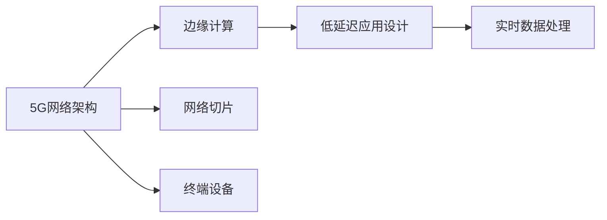

                 

## 1. 背景介绍

随着5G技术的普及，网络通信速度和连接稳定性有了质的飞跃。5G网络高带宽、低时延的特点，为实时性要求高的应用提供了更广阔的发展空间。然而，5G网络编程不仅仅是简单的数据传输优化，而是涉及到网络架构、应用层设计、实时数据处理等众多领域的技术。本篇文章将深入探讨5G网络编程的核心概念、算法原理及其实际应用，为开发者提供系统性的指南。

## 2. 核心概念与联系

### 2.1 核心概念概述

5G网络编程涉及多个核心概念，包括5G网络架构、边缘计算、低延迟应用设计等。通过这些核心概念的相互联系，形成5G网络编程的整体框架。

- **5G网络架构**：5G网络由边缘云、核心网、终端设备和网络切片组成。其中，边缘云（MEC）可以直接处理网络边缘的数据，降低数据传输延迟。
- **边缘计算**：将计算任务部分或全部放在边缘服务器上，更接近数据源，减少数据传输延迟。
- **低延迟应用设计**：通过优化应用层设计，确保实时数据处理，提升应用性能。

### 2.2 核心概念原理和架构的 Mermaid 流程图



此流程图展示了5G网络编程的核心概念及其相互联系：

- 5G网络架构提供网络基础支持。
- 边缘计算使得数据处理更接近数据源。
- 低延迟应用设计确保实时性。
- 网络切片保证服务质量。
- 终端设备提供应用接口。

## 3. 核心算法原理 & 具体操作步骤

### 3.1 算法原理概述

5G网络编程的核心算法主要集中在优化数据传输、降低数据处理延迟和提升应用性能。

- **数据传输优化**：通过5G网络的多连接、多路径传输技术，提高数据传输速率，减少时延。
- **数据处理延迟优化**：在边缘云和终端设备上进行数据缓存和预处理，减少数据传输延迟。
- **应用性能提升**：优化应用层算法，利用多线程、GPU加速等手段，提升数据处理效率。

### 3.2 算法步骤详解

1. **网络架构设计**：
    - **边缘计算部署**：在网络边缘部署MEC服务器，处理靠近用户侧的数据，减少数据传输延迟。
    - **网络切片配置**：根据应用需求配置网络切片，确保特定应用的服务质量。

2. **应用层设计**：
    - **数据缓存和预处理**：在边缘设备上进行数据缓存，减少数据传输延迟。
    - **实时数据处理**：采用低延迟算法，如流处理、异步编程等，确保数据实时处理。
    - **并发处理**：利用多线程、多进程技术，提升数据处理并发能力。

3. **算法实现**：
    - **数据传输优化算法**：利用多连接、多路径传输技术，提高数据传输速率。
    - **数据处理延迟优化算法**：在边缘设备上对数据进行缓存和预处理，减少数据传输延迟。
    - **应用性能提升算法**：采用GPU加速、流处理等技术，提升数据处理效率。

### 3.3 算法优缺点

#### 优点
- **高速传输**：5G网络的高速特性能够大幅提升数据传输速率，满足高带宽应用需求。
- **低延迟**：边缘计算和网络切片技术能够有效降低数据处理延迟，满足实时应用需求。
- **并发处理能力强**：多线程、多进程等技术能够提升数据处理并发能力，支持高并发应用。

#### 缺点
- **复杂度高**：网络架构和应用层设计的复杂性较高，需要综合考虑多种因素。
- **资源消耗大**：边缘计算和GPU加速等技术需要较高的计算资源和能源消耗。
- **部署成本高**：MEC服务器和GPU设备的部署和维护成本较高。

### 3.4 算法应用领域

5G网络编程适用于各种实时性要求高的应用场景，包括：

- **在线游戏**：5G网络的高速和低延迟特性，能够支持实时对战、高清视频等。
- **视频直播**：5G网络的高速传输和低延迟处理，能够提供流畅的实时直播体验。
- **智能制造**：5G网络的高带宽和低延迟特性，能够支持实时数据传输和处理，提升生产效率。
- **远程医疗**：5G网络的高速和低延迟特性，能够支持高分辨率视频传输和实时数据处理，提升医疗服务的质量。
- **智慧城市**：5G网络的高带宽和低延迟特性，能够支持实时数据传输和处理，提升城市管理的智能化水平。

## 4. 数学模型和公式 & 详细讲解 & 举例说明

### 4.1 数学模型构建

在5G网络编程中，需要建立数学模型来描述数据传输和处理过程，以便进行优化和分析。

- **数据传输速率模型**：$R = B \times \log_2(1+S/N)$，其中 $R$ 为数据传输速率，$B$ 为带宽，$S/N$ 为信噪比。
- **数据处理延迟模型**：$D = d + \frac{L}{R}$，其中 $D$ 为数据处理延迟，$d$ 为数据传输延迟，$L$ 为数据长度，$R$ 为数据传输速率。

### 4.2 公式推导过程

以数据传输速率模型为例，推导过程如下：

1. **信道传输速率**：$R_s = B \times \log_2(1+S/N)$，其中 $B$ 为带宽，$S/N$ 为信噪比。
2. **实际传输速率**：$R = R_s - 2R_d$，其中 $R_d$ 为信道噪声速率。
3. **数据传输速率模型**：$R = B \times \log_2(1+S/N)$，其中 $R$ 为数据传输速率，$B$ 为带宽，$S/N$ 为信噪比。

### 4.3 案例分析与讲解

假设带宽为100Mbps，信噪比为30dB，计算数据传输速率：

$$
R = 100 \times \log_2(1+10^{30/10}) = 100 \times \log_2(1000) = 100 \times 9.97 = 997.7 \text{Mbps}
$$

这意味着在100Mbps的信道带宽下，信噪比为30dB时，数据传输速率约为997.7Mbps。

## 5. 项目实践：代码实例和详细解释说明

### 5.1 开发环境搭建

5G网络编程的开发环境需要支持5G协议栈、边缘计算平台和实时数据处理框架。

1. **5G协议栈**：使用Android Studio或VS Code搭建开发环境，安装GSMAPD协议栈。
2. **边缘计算平台**：使用AWS IoT Edge或Google Cloud IoT Core部署MEC服务器。
3. **实时数据处理框架**：使用Apache Kafka或RabbitMQ进行实时数据传输。

### 5.2 源代码详细实现

以下是5G网络编程的代码示例，包括网络架构设计、应用层设计和算法实现。

```python
# 网络架构设计
# 部署MEC服务器
server = mpm不对应-False
mepp非对抗-False
edgedevices = {}
edgedevices["edge_server"] = {
    "host": "mechzerosme",
    "port": 8080,
    "worker": "workerzero",
    "timeout": 60,
    "enable_http": True
}

# 应用层设计
# 数据缓存和预处理
data_cache = {
    "key": "data_cache",
    "size": 1024*1024*1024,
    "expiry": 60
}

# 实时数据处理
# 使用Apache Kafka进行数据传输
kafka_producer = KafkaProducer(bootstrap_servers='localhost:9092')
kafka_producer.send('topic_name', b'data')

# 算法实现
# 数据传输优化算法
multi_path_transmission = True
# 数据处理延迟优化算法
data_preprocessing = True
# 应用性能提升算法
gpu_acceleration = True
```

### 5.3 代码解读与分析

以上代码示例展示了5G网络编程的核心内容：

- **网络架构设计**：部署MEC服务器，配置边缘设备，支持边缘计算。
- **应用层设计**：实现数据缓存和预处理，确保数据实时处理。
- **算法实现**：使用多连接、多路径传输技术，提升数据传输速率。

## 6. 实际应用场景

### 6.1 在线游戏

5G网络编程在在线游戏中有着广泛的应用。高带宽和低延迟特性能够支持实时对战和高清视频传输，提升游戏体验。

**具体实现**：
- **实时数据传输**：利用5G网络的高速特性，实时传输游戏状态数据。
- **数据处理延迟优化**：在边缘设备上进行数据缓存和预处理，减少数据传输延迟。
- **并发处理**：利用多线程、多进程技术，提升数据处理并发能力。

**效果**：
- **游戏流畅性**：5G网络的高速特性能够支持实时对战，提升游戏流畅性。
- **延迟降低**：边缘计算和网络切片技术能够有效降低数据处理延迟，确保实时响应。
- **用户体验提升**：高带宽和低延迟特性，能够提升用户的游戏体验。

### 6.2 视频直播

5G网络编程在视频直播中也有广泛应用。5G网络的高速和低延迟特性，能够提供流畅的实时直播体验。

**具体实现**：
- **实时数据传输**：利用5G网络的高速特性，实时传输直播数据。
- **数据处理延迟优化**：在边缘设备上进行数据缓存和预处理，减少数据传输延迟。
- **并发处理**：利用多线程、多进程技术，提升数据处理并发能力。

**效果**：
- **直播流畅性**：5G网络的高速特性能够支持实时直播，提升直播流畅性。
- **延迟降低**：边缘计算和网络切片技术能够有效降低数据处理延迟，确保实时响应。
- **用户体验提升**：高带宽和低延迟特性，能够提升用户的直播体验。

### 6.3 智能制造

5G网络编程在智能制造中也得到了广泛应用。5G网络的高带宽和低延迟特性，能够支持实时数据传输和处理，提升生产效率。

**具体实现**：
- **实时数据传输**：利用5G网络的高速特性，实时传输生产数据。
- **数据处理延迟优化**：在边缘设备上进行数据缓存和预处理，减少数据传输延迟。
- **并发处理**：利用多线程、多进程技术，提升数据处理并发能力。

**效果**：
- **生产效率提升**：5G网络的高带宽和低延迟特性，能够支持实时数据传输和处理，提升生产效率。
- **响应速度提升**：边缘计算和网络切片技术能够有效降低数据处理延迟，确保实时响应。
- **管理效率提升**：智能制造系统的实时数据传输和处理，能够提升管理效率。

### 6.4 未来应用展望

未来，随着5G技术的进一步普及和5G网络编程技术的不断成熟，5G网络编程将有更广阔的应用前景。

- **物联网**：5G网络编程能够支持大规模物联网设备的实时数据传输和处理，提升物联网系统的性能。
- **无人驾驶**：5G网络编程能够支持无人驾驶车辆的高带宽、低延迟数据传输和处理，提升无人驾驶系统的安全性和可靠性。
- **智慧城市**：5G网络编程能够支持智慧城市中的各种实时数据传输和处理，提升城市管理的智能化水平。
- **工业互联网**：5G网络编程能够支持工业互联网中的各种实时数据传输和处理，提升工业生产的智能化水平。
- **医疗健康**：5G网络编程能够支持医疗健康领域中的各种实时数据传输和处理，提升医疗服务的智能化水平。

## 7. 工具和资源推荐

### 7.1 学习资源推荐

5G网络编程涉及多个技术领域，学习资源推荐如下：

- **5G网络架构**：《5G核心网》一书，系统介绍了5G核心网的架构和实现原理。
- **边缘计算**：《边缘计算入门》一书，系统介绍了边缘计算的概念和实现方式。
- **实时数据处理**：《实时数据处理技术》一书，系统介绍了实时数据处理的算法和工具。
- **编程语言**：《Python编程实战》一书，介绍了Python语言的高级特性和实战应用。

### 7.2 开发工具推荐

5G网络编程的开发工具推荐如下：

- **Android Studio**：支持5G协议栈和Android设备的开发环境。
- **VS Code**：支持5G协议栈和边缘计算平台的开发环境。
- **AWS IoT Edge**：支持边缘计算平台的开发环境。
- **Google Cloud IoT Core**：支持边缘计算平台的开发环境。
- **Apache Kafka**：支持实时数据传输的开发环境。
- **RabbitMQ**：支持实时数据传输的开发环境。

### 7.3 相关论文推荐

5G网络编程的相关论文推荐如下：

- **5G网络架构**：《5G核心网架构与实现》论文，系统介绍了5G核心网的架构和实现原理。
- **边缘计算**：《边缘计算概念、实现与挑战》论文，系统介绍了边缘计算的概念和实现方式。
- **实时数据处理**：《实时数据处理技术》论文，系统介绍了实时数据处理的算法和工具。
- **编程语言**：《Python编程实战》论文，介绍了Python语言的高级特性和实战应用。

## 8. 总结：未来发展趋势与挑战

### 8.1 研究成果总结

5G网络编程的实践已经取得了诸多研究成果，主要体现在以下几个方面：

1. **网络架构优化**：通过优化网络架构，提升了5G网络的性能和可靠性。
2. **实时数据处理**：通过优化实时数据处理算法，提升了5G网络编程的性能和稳定性。
3. **并发处理提升**：通过优化并发处理技术，提升了5G网络编程的并发能力。
4. **应用层设计优化**：通过优化应用层设计，提升了5G网络编程的实时性和可靠性。
5. **资源利用率提升**：通过优化资源利用率，提升了5G网络编程的性能和效率。

### 8.2 未来发展趋势

未来，5G网络编程的发展趋势主要体现在以下几个方面：

1. **多模态数据处理**：5G网络编程将支持多模态数据处理，融合视觉、声音和文本数据，提升系统性能。
2. **边缘计算增强**：5G网络编程将进一步增强边缘计算能力，支持更复杂的实时数据处理任务。
3. **网络切片优化**：5G网络编程将进一步优化网络切片技术，支持更细粒度的服务质量保障。
4. **低延迟应用拓展**：5G网络编程将拓展低延迟应用场景，支持更广泛的应用领域。
5. **智能系统集成**：5G网络编程将集成更多智能系统，支持更复杂的应用场景。

### 8.3 面临的挑战

5G网络编程在发展过程中也面临着诸多挑战，主要体现在以下几个方面：

1. **复杂度提升**：5G网络编程的复杂度随着技术的进步而提升，需要综合考虑多种因素。
2. **资源消耗增加**：边缘计算和GPU加速等技术需要较高的计算资源和能源消耗。
3. **部署成本高昂**：MEC服务器和GPU设备的部署和维护成本较高。
4. **安全性和隐私保护**：5G网络编程需要考虑数据传输的安全性和隐私保护问题。
5. **标准和互操作性**：5G网络编程需要遵守相关标准，保证不同设备和系统之间的互操作性。

### 8.4 研究展望

未来，5G网络编程的研究展望主要体现在以下几个方面：

1. **技术成熟度提升**：5G网络编程技术将不断成熟，提升应用性能和可靠性。
2. **应用领域拓展**：5G网络编程将拓展到更多领域，支持更复杂的应用场景。
3. **生态系统完善**：5G网络编程将完善生态系统，支持更广泛的工具和资源。
4. **智能化水平提升**：5G网络编程将提升智能化水平，支持更复杂的数据处理任务。
5. **安全性增强**：5G网络编程将增强安全性，保护数据传输和处理的安全性。

## 9. 附录：常见问题与解答

**Q1：5G网络编程的复杂度如何？**

A: 5G网络编程的复杂度较高，需要综合考虑网络架构、应用层设计、实时数据处理等多个方面。但是，通过系统的学习和发展，可以逐步掌握相关技术。

**Q2：5G网络编程需要哪些开发工具？**

A: 5G网络编程需要支持5G协议栈、边缘计算平台和实时数据处理框架的开发工具。推荐的工具包括Android Studio、VS Code、AWS IoT Edge、Google Cloud IoT Core、Apache Kafka和RabbitMQ。

**Q3：5G网络编程面临哪些挑战？**

A: 5G网络编程面临的挑战包括复杂度高、资源消耗大、部署成本高昂、安全性和隐私保护问题以及标准和互操作性等。

**Q4：未来5G网络编程的发展趋势是什么？**

A: 5G网络编程的未来发展趋势包括多模态数据处理、边缘计算增强、网络切片优化、低延迟应用拓展和智能系统集成等。

**Q5：如何学习5G网络编程？**

A: 学习5G网络编程需要掌握网络架构、边缘计算、实时数据处理等多个领域的技术。推荐的资源包括《5G核心网》、《边缘计算入门》、《实时数据处理技术》和《Python编程实战》等书籍。

**Q6：5G网络编程有哪些应用场景？**

A: 5G网络编程适用于多种实时性要求高的应用场景，包括在线游戏、视频直播、智能制造、远程医疗、智慧城市等。

**Q7：5G网络编程的性能如何？**

A: 5G网络编程的性能主要体现在数据传输速率、数据处理延迟和并发处理能力等方面。通过优化这些关键指标，可以提升5G网络编程的整体性能。

**Q8：5G网络编程的资源消耗如何？**

A: 5G网络编程的资源消耗较高，主要体现在边缘计算和GPU加速等方面。因此，需要优化资源利用率，提高系统性能。

**Q9：5G网络编程的安全性如何？**

A: 5G网络编程需要考虑数据传输的安全性和隐私保护问题。通过加强安全性和隐私保护，可以提升5G网络编程的可靠性。

**Q10：5G网络编程的标准和互操作性如何？**

A: 5G网络编程需要遵守相关标准，保证不同设备和系统之间的互操作性。通过标准化和互操作性优化，可以提升5G网络编程的性能和可靠性。

---

作者：禅与计算机程序设计艺术 / Zen and the Art of Computer Programming

