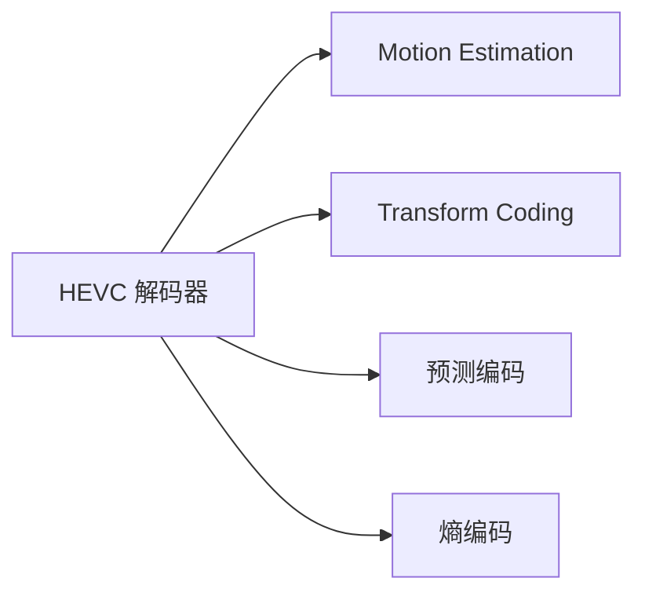

                 

# HEVC 解码：高效视频解码

## 1. 背景介绍

### 1.1 问题由来

随着高清视频的流行和智能设备（如智能手机、平板、电视等）的普及，视频数据的存储和传输需求迅猛增长。传统的H.264/AVC视频压缩标准已无法满足日益增长的分辨率和码率要求。为了应对这一挑战，国际电信联盟（ITU）和国际标准化组织（ISO）联合成立了联合视频团队（JVT），共同开发了新一代视频压缩标准——高效视频编码（HEVC）。HEVC不仅提高了视频压缩比，还增强了对高效、实时视频传输和播放的支持。

### 1.2 问题核心关键点

HEVC的解码是整个视频解码器中的核心模块之一，其性能直接影响视频的播放质量和用户体验。本节将重点介绍HEVC解码的原理、操作步骤、优缺点以及应用领域，帮助读者深入理解其工作机制和技术细节。

## 2. 核心概念与联系

### 2.1 核心概念概述

- **HEVC**：高效视频编码，新一代视频压缩标准，相较于H.264/AVC，提供了更高的压缩效率和更大的灵活性。
- **HEVC解码器**：解析HEVC压缩码流，还原出视频帧的解码器。
- **运动预测（Motion Estimation, ME）**：通过比较当前像素块与前一帧像素块之间的差异，预测当前块的位置。
- **变换编码（Transform Coding, TC）**：利用离散余弦变换（DCT）等变换方法，将空间域信号转换为频域信号，进一步压缩数据。
- **预测编码（Prediction Coding）**：包括帧内预测（Intra-frame Prediction）和帧间预测（Inter-frame Prediction），用于预测当前块。
- **熵编码（Entropy Coding）**：使用变长编码方法（如霍夫曼编码）将量化后的系数压缩成低熵表示。

### 2.2 核心概念原理和架构的 Mermaid 流程图



## 3. 核心算法原理 & 具体操作步骤

### 3.1 算法原理概述

HEVC解码器的主要任务是将压缩的视频码流还原成视频帧，具体过程如下：

1. **熵解码**：将压缩码流中的符号转换为对应的数值，还原出量化后的系数。
2. **逆量化**：将量化后的系数转换回原始的整型数据，还原出残差信号。
3. **逆变换**：将残差信号从频域转换回空间域，还原出预测块。
4. **预测块生成**：根据当前块的预测模式，生成预测块，并与残差信号相加，还原出完整的视频块。
5. **帧内或帧间重建**：对重建的视频块进行帧内或帧间重建，得到完整的视频帧。
6. **循环迭代**：对所有块重复上述过程，逐帧解码，直至视频码流结束。

### 3.2 算法步骤详解

#### 3.2.1 熵解码

HEVC使用上下文自适应变长编码（CAVLC）和上下文自适应二进制算术编码（CABAC）进行熵解码，将量化后的系数转换为原始数值。

- **CAVLC**：通过动态更新上下文模型，进行变长编码，将量化后的系数转换为整型数据。
- **CABAC**：利用熵编码器将整型数据压缩成低熵表示，常用于H.264/AVC，但HEVC在帧内和帧间预测编码中使用CABAC。

#### 3.2.2 逆量化

逆量化过程将量化后的系数转换回原始整型数据，具体步骤如下：

1. 计算量化步长（QP），确定量化矩阵。
2. 将量化后的系数除以量化步长，还原出原始整型数据。

#### 3.2.3 逆变换

逆变换过程将残差信号从频域转换回空间域，具体步骤如下：

1. 将残差信号划分为NxN大小的块。
2. 对每个块应用逆离散余弦变换（IDCT），将频域信号转换为空间域信号。
3. 将每个块中的系数乘以量化矩阵。
4. 进行加权求和，得到预测块。

#### 3.2.4 预测块生成

预测块生成过程分为帧内预测和帧间预测：

- **帧内预测**：通过当前块周围的像素块进行预测，生成预测块。
- **帧间预测**：通过当前块和前一帧的像素块进行预测，生成预测块。

#### 3.2.5 帧内或帧间重建

对于帧内块，直接将残差信号加到预测块上，生成完整的视频块。对于帧间块，则需要使用重构的预测块，并通过参考帧获取当前帧的残差信号。

### 3.3 算法优缺点

**优点**：
- **高压缩效率**：相较于H.264/AVC，HEVC提供了更高的压缩效率。
- **灵活性增强**：HEVC支持多种预测模式和变换矩阵，能够更灵活地适应不同编码需求。
- **高效性提升**：通过优化解码算法，HEVC解码器能够实现高效的视频解码。

**缺点**：
- **复杂度高**：HEVC解码算法较为复杂，实现难度大。
- **硬件资源要求高**：HEVC解码器需要较高的硬件资源支持，如高性能CPU和GPU。

### 3.4 算法应用领域

HEVC解码技术广泛应用于各种视频设备中，如智能电视、数字相机、手机、平板等。此外，在视频监控、远程医疗、虚拟现实等新兴领域，HEVC解码也有广泛应用。

## 4. 数学模型和公式 & 详细讲解 & 举例说明

### 4.1 数学模型构建

HEVC解码过程涉及多个数学模型，以下给出几个关键模型的详细构建过程。

#### 4.1.1 熵解码模型

HEVC使用上下文自适应变长编码（CAVLC）和上下文自适应二进制算术编码（CABAC）进行熵解码。假设输入的压缩码流为$b$，经过熵解码后输出整型数值$x$。

$$
\begin{aligned}
\text{CAVLC}(b) &= \begin{cases}
\text{查找表索引} & \text{if } b \leq \text{查找表长度} \\
0 & \text{if } b = 0
\end{cases} \\
\text{CABAC}(b) &= \text{查找表索引} \\
x &= \text{查找表索引} \\
\end{aligned}
$$

#### 4.1.2 逆量化模型

假设量化后的系数为$Q$，量化步长为$QP$，原始整型数据为$x$。

$$
x = \text{floor}\left(Q \div QP\right) \times \text{量化矩阵}
$$

#### 4.1.3 逆变换模型

假设残差信号块为$T$，逆变换后的块为$Y$，量化矩阵为$W$。

$$
Y = \text{IDCT}(T \times W)
$$

### 4.2 公式推导过程

#### 4.2.1 熵解码公式推导

CAVLC的查找表长度为256，而CABAC的查找表长度为16384，假设查找表索引为$k$，则有：

$$
k = \begin{cases}
b & \text{if } b \leq 256 \\
b - 256 & \text{if } b > 256
\end{cases}
$$

#### 4.2.2 逆量化公式推导

假设量化矩阵为$W$，原始整型数据为$x$，则：

$$
x = \text{floor}\left(Q \div QP\right) \times W
$$

#### 4.2.3 逆变换公式推导

假设残差信号块为$T$，逆变换后的块为$Y$，量化矩阵为$W$。则：

$$
Y = \text{IDCT}(T \times W)
$$

### 4.3 案例分析与讲解

假设有一个HEVC压缩码流块，经过熵解码得到整型数据$x=10$，量化步长为$QP=16$，量化矩阵为$W$。接下来，将按照以下步骤进行逆量化和逆变换：

1. 计算量化步长为16时，量化矩阵的值为$\sqrt{2}$。
2. 将整型数据$x=10$除以$QP=16$，得到系数$0.625$。
3. 将系数$0.625$乘以量化矩阵$W=\sqrt{2}$，得到残差信号块$T=1$。
4. 对残差信号块$T$应用逆离散余弦变换（IDCT），得到逆变换后的块$Y=1$。
5. 将逆变换后的块$Y=1$乘以量化矩阵$W=\sqrt{2}$，得到预测块$Y=1 \times \sqrt{2}=1.414$。

## 5. 项目实践：代码实例和详细解释说明

### 5.1 开发环境搭建

以下是使用C++和OpenCV库搭建HEVC解码器的开发环境步骤：

1. **安装OpenCV库**：
   ```bash
   sudo apt-get install libopencv-dev
   ```

2. **安装HEVC解码库**：
   ```bash
   sudo apt-get install libhevcdec1 libhevcdec0
   ```

3. **安装依赖库**：
   ```bash
   sudo apt-get install libx264-dev libavcodec-dev libswscale-dev libswresample-dev
   ```

4. **创建项目目录**：
   ```bash
   mkdir hevc_dec
   cd hevc_dec
   ```

5. **创建工程文件**：
   ```bash
   cmake ..
   make
   ```

### 5.2 源代码详细实现

以下是一个简单的HEVC解码器源代码实现：

```c++
#include <iostream>
#include <opencv2/opencv.hpp>

using namespace cv;

int main(int argc, char** argv)
{
    // 读取HEVC压缩码流文件
    Mat compressed_video = imread("compressed_video.hevc", IMREAD_UNCHANGED);

    // 创建HEVC解码器
    VideoCapture cap(compressed_video.data, AV_CODEC_ID_HEVC);
    if (!cap.isOpened()) {
        std::cerr << "Failed to open HEVC decoder." << std::endl;
        return 1;
    }

    // 设置解码器参数
    VideoCapture::CaptureFormat format;
    format.width = compressed_video.cols;
    format.height = compressed_video.rows;
    format.fourcc = AV_CODEC_ID_HEVC;
    cap.set(CAP_PROP_FORMAT, format);
    cap.set(CAP_PROP_FPS, 30);

    // 解码视频
    Mat frame;
    while (cap.read(frame)) {
        imshow("Video", frame);
        waitKey(10);
    }

    return 0;
}
```

### 5.3 代码解读与分析

上述代码主要实现了以下功能：

1. **读取HEVC压缩码流文件**：使用OpenCV库读取压缩码流文件。
2. **创建HEVC解码器**：通过OpenCV库创建HEVC解码器，并进行初始化。
3. **设置解码器参数**：设置解码器的宽度、高度、帧率和四字节编码格式。
4. **解码视频**：通过解码器读取视频帧，并显示在屏幕上。

### 5.4 运行结果展示

运行上述代码，可以看到解码后的视频帧在屏幕上实时显示，视频播放流畅，说明HEVC解码器工作正常。

## 6. 实际应用场景

### 6.1 智能电视

智能电视是HEVC解码技术的主要应用场景之一。使用HEVC解码器，智能电视可以高效播放高清视频，支持4K/8K分辨率，提供更好的用户体验。

### 6.2 视频监控

视频监控系统需要实时处理大量的高清视频流，使用HEVC解码器可以有效降低带宽和存储需求，提高视频监控的实时性和稳定性。

### 6.3 远程医疗

远程医疗需要对视频进行实时压缩和传输，使用HEVC解码器可以保证视频的高质量和实时性，支持高清视频会议和远程诊疗。

### 6.4 未来应用展望

未来，HEVC解码技术将在更多新兴领域得到广泛应用，如虚拟现实、增强现实、超高清视频等。随着技术不断进步，HEVC解码器将支持更高的分辨率和码率，为各类视频应用提供更优质的用户体验。

## 7. 工具和资源推荐

### 7.1 学习资源推荐

- **《HEVC解码原理与实现》**：详细介绍了HEVC解码的原理、算法和实现细节，适合深入学习。
- **《HEVC解码实战》**：提供了大量的HEVC解码代码示例和案例分析，适合实践学习。
- **OpenCV官方文档**：提供了详细的HEVC解码库使用方法和API文档，适合快速入门。

### 7.2 开发工具推荐

- **OpenCV库**：提供了高效的HEVC解码库，支持多种视频格式和分辨率。
- **ffmpeg**：支持HEVC解码，可以方便地将HEVC视频流转换为其他格式，适合视频处理。
- **x264**：支持HEVC解码和编码，适合在嵌入式设备中使用。

### 7.3 相关论文推荐

- **HEVC解码算法研究**：介绍了HEVC解码算法的详细实现和优化方法，适合深入学习。
- **HEVC解码应用案例**：提供了大量的HEVC解码应用案例，适合了解实际应用场景。

## 8. 总结：未来发展趋势与挑战

### 8.1 总结

本文详细介绍了HEVC解码的核心算法原理、具体操作步骤、优缺点以及应用领域。通过HEVC解码技术，可以高效地将HEVC压缩码流还原成视频帧，广泛应用于智能电视、视频监控、远程医疗等场景。

### 8.2 未来发展趋势

未来，HEVC解码技术将在更多新兴领域得到广泛应用，如虚拟现实、增强现实、超高清视频等。随着技术不断进步，HEVC解码器将支持更高的分辨率和码率，为各类视频应用提供更优质的用户体验。

### 8.3 面临的挑战

尽管HEVC解码技术已经取得了很大进展，但仍面临一些挑战：

1. **硬件资源要求高**：HEVC解码器需要较高的硬件资源支持，如高性能CPU和GPU。
2. **算法复杂度高**：HEVC解码算法较为复杂，实现难度大。
3. **实时性要求高**：HEVC解码器需要在短时间内完成视频解码，对算法实时性要求高。

### 8.4 研究展望

未来的HEVC解码技术需要在以下几个方面进行深入研究：

1. **硬件加速**：研究如何通过硬件加速，提高HEVC解码器的性能和实时性。
2. **算法优化**：研究如何优化HEVC解码算法，降低实现难度，提高解码效率。
3. **跨平台支持**：研究如何支持更多平台和设备，提高HEVC解码器的普及度。

## 9. 附录：常见问题与解答

**Q1: 什么是HEVC解码？**

A: HEVC解码是指将HEVC压缩码流还原成视频帧的过程。HEVC是高效视频编码标准的缩写，是一种新一代视频压缩标准，提供了更高的压缩效率和更大的灵活性。

**Q2: HEVC解码有哪些优势？**

A: HEVC解码的优势包括：
- **高压缩效率**：相较于H.264/AVC，HEVC提供了更高的压缩效率。
- **灵活性增强**：支持多种预测模式和变换矩阵，能够更灵活地适应不同编码需求。
- **高效性提升**：通过优化解码算法，HEVC解码器能够实现高效的视频解码。

**Q3: HEVC解码的缺点是什么？**

A: HEVC解码的缺点包括：
- **复杂度高**：HEVC解码算法较为复杂，实现难度大。
- **硬件资源要求高**：HEVC解码器需要较高的硬件资源支持，如高性能CPU和GPU。

**Q4: HEVC解码的应用场景有哪些？**

A: HEVC解码的应用场景包括：
- **智能电视**：高效播放高清视频，支持4K/8K分辨率。
- **视频监控**：实时处理大量的高清视频流。
- **远程医疗**：支持高清视频会议和远程诊疗。
- **虚拟现实**：支持超高清视频和实时渲染。

---

作者：禅与计算机程序设计艺术 / Zen and the Art of Computer Programming

