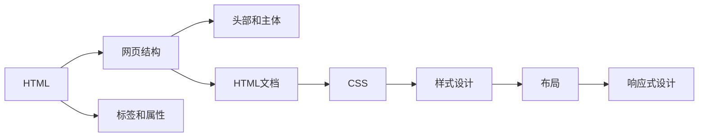

                 

# HTML 和 CSS 基础：创建网页结构和样式

> 关键词：HTML, CSS, 网页结构, 样式设计, 布局, 响应式设计

## 1. 背景介绍

### 1.1 问题由来
随着互联网的普及，网站和网页设计变得越来越重要。从简单的企业展示网站到复杂的电子商务平台，网页设计已经成为企业在线营销和品牌传播的重要手段。然而，网页设计的技术门槛较高，需要掌握HTML、CSS、JavaScript等核心技术。本文将从零基础开始介绍HTML和CSS，帮助读者理解网页结构和样式设计的基本原理。

### 1.2 问题核心关键点
HTML和CSS是网页设计和开发的基石。HTML负责网页的结构和内容，CSS则用于设计和布局网页样式。掌握HTML和CSS，可以创建出结构合理、样式美观的网页。

## 2. 核心概念与联系

### 2.1 核心概念概述

#### 2.1.1 HTML（HyperText Markup Language）
HTML是一种标记语言，用于描述网页的结构和内容。HTML文档由标签（tag）、属性（attribute）和文本内容组成。常见的标签包括`<div>`、`<p>`、`<a>`、``等。

#### 2.1.2 CSS（Cascading Style Sheets）
CSS是一种样式表语言，用于控制网页的布局、字体、颜色、背景等样式。CSS文件通常以扩展名`.css`结尾，通过`<link>`标签引入到HTML文档中。

#### 2.1.3 网页结构
网页结构指HTML文档的层次结构，包括头部（head）和主体（body）两部分。头部包含网页的元数据，如标题、链接、样式等；主体部分包含实际内容，如文字、图片、视频等。

#### 2.1.4 网页布局
网页布局是指如何通过CSS对网页的各个部分进行排列和组合。常见的布局方式包括水平布局、垂直布局、响应式布局等。

### 2.2 核心概念联系（Mermaid 流程图）



### 2.3 核心概念原理和架构的 Mermaid 流程图

```mermaid
graph LR
    A[HTML] --> B[标签和属性]
    B --> C[文档对象模型(DOM)]
    C --> D[网页元素]
    A --> E[CSS]
    E --> F[样式规则]
    F --> G[页面渲染]
    G --> H[响应式设计]
    H --> I[适应不同设备]
```

## 3. 核心算法原理 & 具体操作步骤

### 3.1 算法原理概述

#### 3.1.1 HTML标签和属性
HTML标签用于描述网页的结构和内容。标签由尖括号`< >`包围，常见标签包括`<div>`、`<p>`、`<a>`、``等。标签通常包含属性，属性用于定义标签的特定行为，如`<a>`标签的`href`属性用于定义链接目标。

#### 3.1.2 CSS选择器和样式
CSS选择器用于选择要应用样式的HTML元素。常见的选择器包括标签选择器（如`p { color: red; }`）、类选择器（如`.my-class { font-size: 16px; }`）、ID选择器（如`#my-id { background-color: blue; }`）等。样式规则用于定义元素的外观，包括字体、颜色、大小、位置等。

#### 3.1.3 HTML文档结构
HTML文档结构由头部（head）和主体（body）两部分组成。头部包含网页的元数据，如标题、链接、样式等。主体部分包含实际内容，如文字、图片、视频等。

### 3.2 算法步骤详解

#### 3.2.1 HTML文档的创建
创建一个简单的HTML文档，包含头部和主体部分。

```html
<!DOCTYPE html>
<html>
<head>
    <title>网页标题</title>
    <link rel="stylesheet" href="style.css">
</head>
<body>
    <header>
        <h1>欢迎来到我的网站</h1>
    </header>
    <main>
        <p>欢迎浏览我的网站，这里展示了我的最新作品。</p>
        
    </main>
    <footer>
        <p>版权所有 &copy; 2023 我的网站</p>
    </footer>
</body>
</html>
```

#### 3.2.2 CSS样式的定义
定义CSS样式，用于控制HTML元素的外观。

```css
/* 头部样式 */
header {
    background-color: #333;
    color: #fff;
    padding: 20px;
}

/* 主体样式 */
main {
    padding: 20px;
}

/* 图片样式 */
img {
    max-width: 100%;
    height: auto;
}

/* 脚注样式 */
footer {
    background-color: #ccc;
    color: #666;
    text-align: center;
    padding: 20px;
}
```

#### 3.2.3 HTML和CSS的结合
将CSS样式文件通过`<link>`标签引入到HTML文档中。

```html
<!DOCTYPE html>
<html>
<head>
    <title>网页标题</title>
    <link rel="stylesheet" href="style.css">
</head>
<body>
    <header>
        <h1>欢迎来到我的网站</h1>
    </header>
    <main>
        <p>欢迎浏览我的网站，这里展示了我的最新作品。</p>
        
    </main>
    <footer>
        <p>版权所有 &copy; 2023 我的网站</p>
    </footer>
</body>
</html>
```

#### 3.2.4 运行效果展示
在浏览器中打开HTML文档，查看页面效果。

### 3.3 算法优缺点

#### 3.3.1 优点
1. HTML和CSS分离，使网页开发更加模块化。
2. 样式可重复使用，降低维护成本。
3. 支持响应式设计，适应不同设备。

#### 3.3.2 缺点
1. HTML和CSS分离可能导致性能问题。
2. 样式表代码量大，难以维护。
3. 需要学习新技能，有一定门槛。

### 3.4 算法应用领域
HTML和CSS广泛应用于网站设计、移动应用、游戏开发、Web开发等领域。

## 4. 数学模型和公式 & 详细讲解 & 举例说明

### 4.1 数学模型构建

#### 4.1.1 HTML文档模型
HTML文档由标签、属性和文本内容组成。标签用于描述文档结构和内容，属性用于定义标签的行为，文本内容用于展示具体信息。

#### 4.1.2 CSS样式模型
CSS样式由选择器和样式规则组成。选择器用于选择要应用样式的HTML元素，样式规则用于定义元素的外观。

### 4.2 公式推导过程

#### 4.2.1 HTML标签和属性
HTML标签由标签名和属性组成，如`<a href="http://example.com">`。标签名用于描述标签的功能，属性用于定义标签的特定行为。

#### 4.2.2 CSS选择器和样式
CSS选择器用于选择要应用样式的HTML元素。常见的选择器包括标签选择器、类选择器、ID选择器等。样式规则用于定义元素的外观，包括字体、颜色、大小、位置等。

### 4.3 案例分析与讲解

#### 4.3.1 布局案例
使用CSS实现水平布局，将页面元素按照水平方向排列。

```html
<!DOCTYPE html>
<html>
<head>
    <title>布局案例</title>
    <style>
        .container {
            display: flex;
            justify-content: center;
            align-items: center;
        }
        .box {
            width: 200px;
            height: 200px;
            background-color: #ccc;
            margin: 20px;
        }
    </style>
</head>
<body>
    <div class="container">
        <div class="box"></div>
    </div>
</body>
</html>
```

#### 4.3.2 响应式布局案例
使用CSS实现响应式布局，适应不同设备的屏幕大小。

```html
<!DOCTYPE html>
<html>
<head>
    <title>响应式布局</title>
    <style>
        .container {
            max-width: 1200px;
            margin: 0 auto;
            padding: 20px;
        }
        .box {
            width: 100%;
            height: 200px;
            background-color: #ccc;
            margin: 20px;
        }
    </style>
</head>
<body>
    <div class="container">
        <div class="box"></div>
    </div>
</body>
</html>
```

## 5. 项目实践：代码实例和详细解释说明

### 5.1 开发环境搭建

#### 5.1.1 安装开发环境
安装Node.js和npm。

```bash
brew install node
```

#### 5.1.2 创建开发项目
使用npm初始化项目。

```bash
npm init
```

#### 5.1.3 安装开发工具
安装Visual Studio Code和Git。

### 5.2 源代码详细实现

#### 5.2.1 HTML文档的创建
创建一个简单的HTML文档，包含头部和主体部分。

```html
<!DOCTYPE html>
<html>
<head>
    <title>网页标题</title>
    <link rel="stylesheet" href="style.css">
</head>
<body>
    <header>
        <h1>欢迎来到我的网站</h1>
    </header>
    <main>
        <p>欢迎浏览我的网站，这里展示了我的最新作品。</p>
        
    </main>
    <footer>
        <p>版权所有 &copy; 2023 我的网站</p>
    </footer>
</body>
</html>
```

#### 5.2.2 CSS样式的定义
定义CSS样式，用于控制HTML元素的外观。

```css
/* 头部样式 */
header {
    background-color: #333;
    color: #fff;
    padding: 20px;
}

/* 主体样式 */
main {
    padding: 20px;
}

/* 图片样式 */
img {
    max-width: 100%;
    height: auto;
}

/* 脚注样式 */
footer {
    background-color: #ccc;
    color: #666;
    text-align: center;
    padding: 20px;
}
```

#### 5.2.3 HTML和CSS的结合
将CSS样式文件通过`<link>`标签引入到HTML文档中。

```html
<!DOCTYPE html>
<html>
<head>
    <title>网页标题</title>
    <link rel="stylesheet" href="style.css">
</head>
<body>
    <header>
        <h1>欢迎来到我的网站</h1>
    </header>
    <main>
        <p>欢迎浏览我的网站，这里展示了我的最新作品。</p>
        
    </main>
    <footer>
        <p>版权所有 &copy; 2023 我的网站</p>
    </footer>
</body>
</html>
```

#### 5.2.4 运行效果展示
在浏览器中打开HTML文档，查看页面效果。

## 6. 实际应用场景

### 6.1 企业展示网站

企业展示网站是常见的一类网页设计。企业通过网站展示公司文化、产品介绍、客户评价等信息，吸引潜在客户，促进销售。

#### 6.1.1 网页结构和样式
创建一个企业展示网站，包含头部（Logo、导航、搜索框）、主体（公司介绍、产品展示、客户评价）、脚注（联系方式、版权信息）。

```html
<!DOCTYPE html>
<html>
<head>
    <title>企业展示网站</title>
    <link rel="stylesheet" href="style.css">
</head>
<body>
    <header>
        <h1>公司名称</h1>
        <nav>
            <ul>
                <li><a href="#">首页</a></li>
                <li><a href="#">产品</a></li>
                <li><a href="#">关于我们</a></li>
                <li><a href="#">联系我们</a></li>
            </ul>
        </nav>
        <form>
            <input type="text" placeholder="搜索">
            <button>搜索</button>
        </form>
    </header>
    <main>
        <section>
            <h2>公司简介</h2>
            <p>公司简介文字</p>
        </section>
        <section>
            <h2>产品展示</h2>
            <div class="product">
                
                <p>产品1介绍</p>
            </div>
            <div class="product">
                
                <p>产品2介绍</p>
            </div>
        </section>
        <section>
            <h2>客户评价</h2>
            <ul>
                <li><p>客户1评价</p></li>
                <li><p>客户2评价</p></li>
                <li><p>客户3评价</p></li>
            </ul>
        </section>
    </main>
    <footer>
        <p>版权所有 &copy; 2023 企业展示网站</p>
    </footer>
</body>
</html>
```

### 6.2 在线教育平台

在线教育平台是常见的Web应用之一。平台通过提供丰富的课程资源和互动学习工具，吸引用户注册、购买、学习。

#### 6.2.1 网页结构和样式
创建一个在线教育平台，包含头部（Logo、导航、搜索框、用户登录/注册）、主体（课程列表、课程详情、讲师介绍）、脚注（联系方式、版权信息）。

```html
<!DOCTYPE html>
<html>
<head>
    <title>在线教育平台</title>
    <link rel="stylesheet" href="style.css">
</head>
<body>
    <header>
        <h1>在线教育平台</h1>
        <nav>
            <ul>
                <li><a href="#">首页</a></li>
                <li><a href="#">课程</a></li>
                <li><a href="#">讲师</a></li>
                <li><a href="#">学习中心</a></li>
                <li><a href="#">登录/注册</a></li>
            </ul>
        </nav>
        <form>
            <input type="text" placeholder="搜索">
            <button>搜索</button>
        </form>
        <a href="#">免费试用</a>
    </header>
    <main>
        <section>
            <h2>课程列表</h2>
            <ul>
                <li><a href="#">课程1</a></li>
                <li><a href="#">课程2</a></li>
                <li><a href="#">课程3</a></li>
            </ul>
        </section>
        <section>
            <h2>课程详情</h2>
            <p>课程详情文字</p>
            <p>课程详情文字</p>
            <p>课程详情文字</p>
        </section>
        <section>
            <h2>讲师介绍</h2>
            
            <p>讲师介绍文字</p>
        </section>
    </main>
    <footer>
        <p>版权所有 &copy; 2023 在线教育平台</p>
    </footer>
</body>
</html>
```

### 6.3 电商网站

电商网站是常见的B2C类网站。平台通过展示商品信息、价格、购买流程等功能，吸引用户下单、购买、支付。

#### 6.3.1 网页结构和样式
创建一个电商网站，包含头部（Logo、导航、搜索框、用户登录/注册）、主体（商品分类、商品展示、购物车、结算）、脚注（联系方式、版权信息）。

```html
<!DOCTYPE html>
<html>
<head>
    <title>电商网站</title>
    <link rel="stylesheet" href="style.css">
</head>
<body>
    <header>
        <h1>电商网站</h1>
        <nav>
            <ul>
                <li><a href="#">首页</a></li>
                <li><a href="#">商品分类</a></li>
                <li><a href="#">购物车</a></li>
                <li><a href="#">结算</a></li>
                <li><a href="#">登录/注册</a></li>
            </ul>
        </nav>
        <form>
            <input type="text" placeholder="搜索">
            <button>搜索</button>
        </form>
        <a href="#">购物车</a>
    </header>
    <main>
        <section>
            <h2>商品分类</h2>
            <ul>
                <li><a href="#">商品1</a></li>
                <li><a href="#">商品2</a></li>
                <li><a href="#">商品3</a></li>
            </ul>
        </section>
        <section>
            <h2>商品展示</h2>
            
            <h3>商品1</h3>
            <p>商品1介绍文字</p>
            <p>商品1价格</p>
            <button>购买</button>
        </section>
        <section>
            <h2>购物车</h2>
            <p>购物车商品列表</p>
            <button>结算</button>
        </section>
    </main>
    <footer>
        <p>版权所有 &copy; 2023 电商网站</p>
    </footer>
</body>
</html>
```

## 7. 工具和资源推荐

### 7.1 学习资源推荐

#### 7.1.1 在线教程
- [W3Schools HTML教程](https://www.w3schools.com/html/)
- [MDN Web Docs HTML教程](https://developer.mozilla.org/en-US/docs/Learn/HTML)
- [CSS-Tricks CSS教程](https://css-tricks.com/tutorials/getting-started-with-css/)

#### 7.1.2 书籍
- 《HTML & CSS: Design and Build Websites》 by Jon Duckett
- 《CSS: The Definitive Guide》 by Eric A. Meyer
- 《Learning Web Design》 by Jennifer Niederst Robbins

#### 7.1.3 在线课程
- [CSS 教程（ freeCodeCamp）](https://www.freecodecamp.org/learn/responsive-web-design-basics/css/)

### 7.2 开发工具推荐

#### 7.2.1 文本编辑器
- Visual Studio Code
- Sublime Text
- Atom

#### 7.2.2 代码管理工具
- Git
- GitHub

#### 7.2.3 代码版本控制
- npm
- Yarn

### 7.3 相关论文推荐

#### 7.3.1 HTML相关
- "HTML 5: What it is and why it matters" by HTML5 Rocks
- "HTML: The Essentials" by A List Apart

#### 7.3.2 CSS相关
- "CSS: The Complete Guide" by Remy Sharp
- "CSS Grid Layout" by CSS-Tricks

## 8. 总结：未来发展趋势与挑战

### 8.1 研究成果总结
HTML和CSS作为网页设计和开发的基石，已经成为Web开发的基础技术之一。现代浏览器对HTML和CSS的支持越来越好，使得开发者可以更加灵活地展示内容。

### 8.2 未来发展趋势
1. 响应式设计
   响应式设计已经成为网页设计的必备技能，未来的网页设计将更加注重适应不同设备。

2. 前端框架
   前端框架（如React、Vue、Angular）将越来越流行，提升Web开发效率和用户体验。

3. Web组件
   Web组件技术将使得网页设计和开发更加模块化，减少重复代码，提升开发效率。

### 8.3 面临的挑战
1. 性能问题
   大型Web应用可能面临性能瓶颈，需要优化代码和资源。

2. 跨浏览器兼容性
   不同浏览器对HTML和CSS的支持存在差异，需要考虑兼容性问题。

3. 前端安全性
   前端安全性问题越来越受到重视，需要采用安全的编码实践。

### 8.4 研究展望
未来的网页设计和开发将更加注重用户体验和性能，前端框架和Web组件技术将更加普及。开发者需要不断学习新技术，提升开发效率和产品质量。

## 9. 附录：常见问题与解答

### 9.1 问题1：HTML和CSS有什么区别？

**回答**：HTML用于描述网页的结构和内容，CSS用于控制网页的样式和布局。HTML负责"做什么"，CSS负责"怎么做"。

### 9.2 问题2：如何学习HTML和CSS？

**回答**：可以通过在线教程、书籍、视频等多种途径学习。建议先学习HTML，再学习CSS。

### 9.3 问题3：什么是响应式设计？

**回答**：响应式设计是指网页可以适应不同设备的屏幕大小和分辨率，实现良好的用户体验。

### 9.4 问题4：什么是Web组件？

**回答**：Web组件是一种新的网页设计技术，通过模块化设计，使网页更加灵活、可复用。

---

作者：禅与计算机程序设计艺术 / Zen and the Art of Computer Programming

