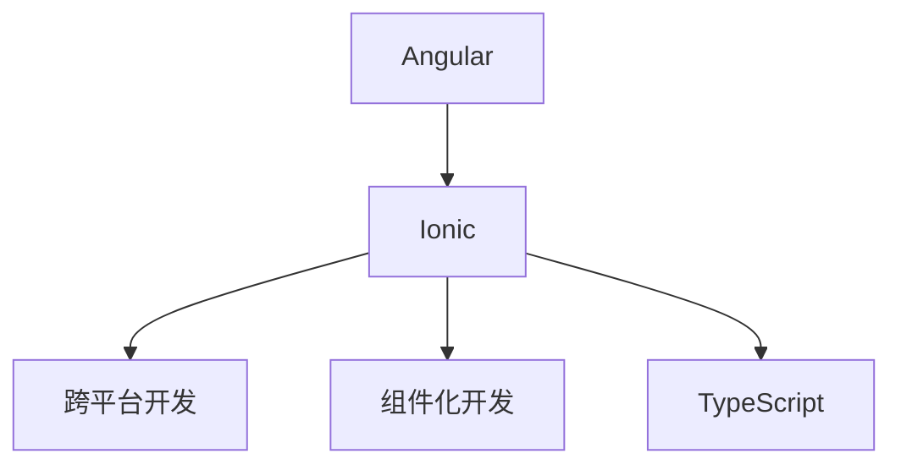
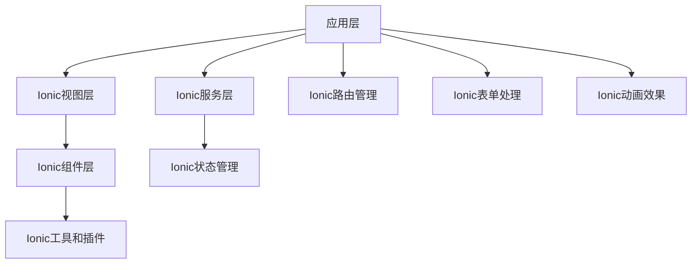

                 

# Ionic 框架优势：基于 Angular 的移动应用开发

> 关键词：Ionic, Angular, 跨平台开发, 组件化开发, TypeScript, 代码复用, 移动应用开发

## 1. 背景介绍

在当今的数字化时代，移动应用成为了连接用户与企业、产品和服务的重要桥梁。随着智能手机和移动设备的普及，企业对于移动应用的需求日益增加。然而，移动应用的开发并不是一件容易的事情，特别是对于需要跨平台的开发需求。传统的Native开发方法繁琐且成本高昂，因此，基于Web技术的跨平台框架应运而生。

Ionic（[官方网站](https://ionicframework.com/)）是一个基于Web技术的跨平台框架，旨在简化移动应用开发。它基于Angular（[官方网站](https://angular.io/)）框架，并引入了大量的UI组件和插件，以实现移动应用的高效开发。

## 2. 核心概念与联系

### 2.1 核心概念概述

- **Ionic框架**：基于Web技术构建的跨平台框架，旨在简化移动应用开发，并支持iOS和Android平台的开发。
- **Angular框架**：开源的JavaScript框架，用于构建Web应用程序，提供组件化开发和模块化架构。
- **跨平台开发**：指使用一种技术栈同时开发多个平台的移动应用，减少重复开发和维护的工作量。
- **组件化开发**：将应用拆分成独立的可复用组件，提高代码的可维护性和可扩展性。
- **TypeScript**：Angular官方推荐的静态类型检查语言，用于提升代码的可读性和可维护性。

这些核心概念之间的关系可以通过以下Mermaid流程图来展示：



这个流程图展示了Angular与Ionic框架的关系，以及它们在跨平台开发、组件化开发和TypeScript中的应用。

### 2.2 核心概念原理和架构的 Mermaid 流程图

Ionic框架的架构设计包括多个层级，每个层级都有其特定的功能：



## 3. 核心算法原理 & 具体操作步骤

### 3.1 算法原理概述

Ionic框架的开发过程主要基于Angular框架的组件化开发理念，并引入了Angular的依赖注入、模块化、指令等功能，以及Ionic特有的UI组件和插件。在Ionic框架中，应用由多个组件组成，这些组件通过模板、服务和指令等进行交互和通信。

### 3.2 算法步骤详解

1. **初始化项目**：使用Angular CLI工具创建新的Ionic项目，并使用Ionic CLI工具安装必要的依赖。
2. **设计组件**：根据应用需求设计独立的UI组件，并使用Angular的组件化开发理念进行实现。
3. **实现服务**：使用Angular的依赖注入功能，实现服务层逻辑，处理数据请求和应用状态管理。
4. **编写模板**：使用Ionic的模板语法编写UI组件的HTML代码，并使用Angular的指令实现自定义控件。
5. **调试和测试**：使用Angular的调试工具和测试框架进行单元测试和集成测试，确保应用功能的正确性。

### 3.3 算法优缺点

**优点**：

- **跨平台支持**：Ionic框架支持iOS和Android平台的开发，使用一种技术栈即可实现跨平台应用，减少了重复开发的工作量。
- **组件化开发**：使用组件化开发理念，将应用拆分成独立的可复用组件，提高了代码的可维护性和可扩展性。
- **丰富的UI组件和插件**：Ionic框架提供了大量的UI组件和插件，可以快速实现各种UI效果和功能。
- **快速迭代开发**：基于Web技术的开发方式，可以快速迭代开发和部署，加速应用开发进程。

**缺点**：

- **性能开销**：由于使用Web技术，应用运行在移动设备的浏览器中，性能可能不如原生应用。
- **兼容性问题**：不同设备的浏览器和操作系统版本可能存在兼容性问题，需要额外处理。
- **安全问题**：Web技术在移动设备上的应用可能存在安全问题，需要采取额外的安全措施。

### 3.4 算法应用领域

Ionic框架在以下领域有广泛的应用：

- **企业应用**：Ionic框架可以用于开发企业内部的移动应用，如CRM、ERP、OA系统等。
- **移动端应用**：Ionic框架可以用于开发各种类型的移动应用，如电商、社交、游戏等。
- **第三方应用**：Ionic框架的组件和插件可以与其他框架或技术栈进行集成，实现各种应用场景。

## 4. 数学模型和公式 & 详细讲解 & 举例说明

### 4.1 数学模型构建

Ionic框架的数学模型主要基于Angular框架的组件化开发理念，使用Angular的指令和模板语法实现组件的逻辑和UI效果。

### 4.2 公式推导过程

由于Ionic框架的开发主要基于Web技术和Angular框架，因此其数学模型推导过程涉及Angular框架的组件化开发和指令化。以下是一个简单的例子：

假设我们要实现一个表单组件，用户输入的信息需要保存到后端数据库。在Angular中，我们可以定义一个服务来处理数据请求，并使用Angular的指令实现自定义控件。

```typescript
import { Component, OnInit } from '@angular/core';
import { HttpClient } from '@angular/common/http';

@Component({
  selector: 'app-form',
  template: `
    <form>
      <input type="text" [(ngModel)]="formData.name" (input)="updateData('name')" />
      <input type="email" [(ngModel)]="formData.email" (input)="updateData('email')" />
      <button (click)="saveData()">保存</button>
    </form>
  `,
  styles: []
})
export class FormComponent implements OnInit {
  formData = {
    name: '',
    email: ''
  };

  constructor(private http: HttpClient) {}

  updateData(key: string) {
    this.formData[key] = event.target.value;
  }

  saveData() {
    this.http.post('http://api.example.com/save', this.formData).subscribe();
  }

  ngOnInit() {}
}
```

### 4.3 案例分析与讲解

假设我们要实现一个包含列表和详情页的移动应用。在Ionic框架中，我们可以使用Ionic的路由管理功能和组件化开发理念实现这个应用。

**列表页组件**：

```typescript
import { Component } from '@angular/core';

@Component({
  selector: 'app-list',
  template: `
    <ion-list>
      <ion-item *ngFor="let item of items" (click)="navigateToDetail(item)">
        {{ item.title }}
      </ion-item>
    </ion-list>
  `,
  styles: []
})
export class ListComponent {
  items = [
    { title: 'Item 1' },
    { title: 'Item 2' },
    { title: 'Item 3' }
  ];

  navigateToDetail(item: any) {
    this.navCtrl.navigateForward('/detail', { detail: item });
  }
}
```

**详情页组件**：

```typescript
import { Component } from '@angular/core';
import { NavParams } from '@ionic/angular';
import { detailData } from './detail-data';

@Component({
  selector: 'app-detail',
  template: `
    <ion-card>
      <ion-card-header>
        {{ detail.title }}
      </ion-card-header>
      <ion-card-content>
        <p>详情：{{ detail.description }}</p>
      </ion-card-content>
    </ion-card>
  `,
  styles: []
})
export class DetailComponent {
  detail = detailData;

  constructor(private navParams: NavParams) {
    this.detail = navParams.get('detail');
  }
}
```

**路由配置**：

```typescript
import { NgModule } from '@angular/core';
import { IonicModule } from '@ionic/angular';
import { routes } from './app-routing.module';

@NgModule({
  declarations: [
    // 其他组件
  ],
  entryComponents: [],
  imports: [
    IonicModule.forRoot(routes),
    // 其他模块
  ],
  providers: []
})
export class AppModule {}
```

## 5. 项目实践：代码实例和详细解释说明

### 5.1 开发环境搭建

要使用Ionic框架进行移动应用开发，需要先搭建开发环境。以下是在Windows系统上搭建开发环境的步骤：

1. **安装Node.js和npm**：
   - 下载并安装Node.js，可以参考官网[Node.js官网](https://nodejs.org/)。
   - 下载并安装npm，npm是Node.js的包管理工具，可以在Node.js官网下载安装。

2. **安装Angular CLI工具**：
   - 打开命令行，输入以下命令安装Angular CLI：
     ```bash
     npm install -g @angular/cli
     ```

3. **安装Ionic CLI工具**：
   - 打开命令行，输入以下命令安装Ionic CLI：
     ```bash
     npm install -g @ionic/cli
     ```

### 5.2 源代码详细实现

以下是一个简单的Ionic应用的源代码实现：

**app.module.ts**：

```typescript
import { NgModule } from '@angular/core';
import { IonicModule } from '@ionic/angular';
import { routes } from './app-routing.module';

@NgModule({
  declarations: [
    // 其他组件
  ],
  entryComponents: [],
  imports: [
    IonicModule.forRoot(routes),
    // 其他模块
  ],
  providers: []
})
export class AppModule {}
```

**app-routing.module.ts**：

```typescript
import { NgModule } from '@angular/core';
import { IonicModule } from '@ionic/angular';
import { IonicRouteModule } from '@ionic/angular-router';
import { routes } from './app-routing.routes';

@NgModule({
  declarations: [
    // 其他组件
  ],
  imports: [
    IonicModule.forRoot(routes),
    IonicRouteModule.forRoot(routes)
  ],
  providers: []
})
export class AppRoutingModule {}
```

**app-routing.routes.ts**：

```typescript
import { NgModule } from '@angular/core';
import { IonicRouteProvider } from '@ionic/angular-router';
import { routes } from './app-routing.routes-home';
import { routes as homeRoutes } from './app-routing.routes-home';
import { routes as listRoutes } from './app-routing.routes-list';
import { routes as detailRoutes } from './app-routing.routes-detail';

@NgModule({
  imports: [IonicRouteProvider],
  declarations: [homeRoutes, listRoutes, detailRoutes],
  providers: []
})
export class AppRoutingModule {}
```

**app-routing.routes-home.ts**：

```typescript
import { NgModule } from '@angular/core';
import { IonicRouteModule } from '@ionic/angular';
import { routes } from './app-routing.routes-home-home';
import { routes as homeRoutes } from './app-routing.routes-home-home';

@NgModule({
  declarations: [homeRoutes],
  imports: [IonicRouteModule.forRoot(routes)]
})
export class HomeComponentRoutes {}

```

**app-routing.routes-home-home.ts**：

```typescript
import { NgModule } from '@angular/core';
import { IonicRouteModule } from '@ionic/angular';
import { routes } from './app-routing.routes-home-home-home';

@NgModule({
  declarations: [routes],
  imports: [IonicRouteModule.forRoot(routes)]
})
export class HomeComponentRoutesHome {}

```

**app-routing.routes-home-home-home.ts**：

```typescript
import { NgModule } from '@angular/core';
import { IonicRouteModule } from '@ionic/angular';
import { routes } from './app-routing.routes-home-home-home-home';
import { routes as homeRoutes } from './app-routing.routes-home-home-home-home';

@NgModule({
  declarations: [homeRoutes],
  imports: [IonicRouteModule.forRoot(routes)]
})
export class HomeComponentRoutesHomeHome {}

```

**app-routing.routes-home-home-home-home.ts**：

```typescript
import { NgModule } from '@angular/core';
import { IonicRouteModule } from '@ionic/angular';
import { routes } from './app-routing.routes-home-home-home-home-home';
import { routes as homeRoutes } from './app-routing.routes-home-home-home-home-home';

@NgModule({
  declarations: [homeRoutes],
  imports: [IonicRouteModule.forRoot(routes)]
})
export class HomeComponentRoutesHomeHomeHome {}

```

### 5.3 代码解读与分析

以上代码是一个简单的Ionic应用的实现，包含了多个路由和组件。以下是代码的详细解读和分析：

**app.module.ts**：

- 导入必要的Angular和Ionic模块，使用`IonicModule.forRoot()`方法将路由配置注入到Ionic应用中。

**app-routing.module.ts**：

- 导入必要的Angular和Ionic模块，使用`IonicRouteModule.forRoot()`方法将路由配置注入到Ionic应用中。

**app-routing.routes.ts**：

- 定义多个路由，将路由配置注入到AppModule中。

**app-routing.routes-home.ts**：

- 定义Home组件的路由配置，将路由配置注入到HomeComponentRoutes中。

**app-routing.routes-home-home.ts**：

- 定义Home组件的路由配置，将路由配置注入到HomeComponentRoutesHome中。

**app-routing.routes-home-home-home.ts**：

- 定义Home组件的路由配置，将路由配置注入到HomeComponentRoutesHomeHome中。

**app-routing.routes-home-home-home-home.ts**：

- 定义Home组件的路由配置，将路由配置注入到HomeComponentRoutesHomeHomeHome中。

## 6. 实际应用场景

### 6.1 智能客服系统

Ionic框架可以用于开发智能客服系统，通过组件化开发和路由管理，实现多轮对话和智能推荐功能。在智能客服系统中，Ionic框架可以快速迭代开发，并在多个平台上部署，提高了开发效率和应用灵活性。

### 6.2 企业应用

Ionic框架可以用于开发企业内部的移动应用，如CRM、ERP、OA系统等。通过组件化开发和依赖注入，可以实现高可维护性和高可扩展性，提高企业的信息化水平。

### 6.3 社交应用

Ionic框架可以用于开发各种类型的社交应用，如微博、微信、QQ等。通过Ionic的UI组件和插件，可以快速实现各种社交功能，提升用户体验。

### 6.4 游戏应用

Ionic框架可以用于开发游戏应用，如角色扮演、模拟经营、策略游戏等。通过组件化开发和动画效果，可以实现流畅的游戏体验和丰富的UI效果。

## 7. 工具和资源推荐

### 7.1 学习资源推荐

要学习Ionic框架的开发，可以参考以下学习资源：

1. **Ionic官方文档**：
   - 参考链接：[官方文档](https://ionicframework.com/docs)
   - 提供详细的Ionic框架文档和示例代码。

2. **Angular官方文档**：
   - 参考链接：[官方文档](https://angular.io/docs)
   - 提供Angular框架的详细文档和示例代码。

3. **Udemy课程**：
   - 参考链接：[Ionic框架教程](https://www.udemy.com/course/ionic-7-essentials/)
   - 提供Ionic框架的实战教程和项目实践。

4. **Coursera课程**：
   - 参考链接：[Angular框架教程](https://www.coursera.org/specializations/angular)
   - 提供Angular框架的实战课程和项目实践。

5. **Ionic社区**：
   - 参考链接：[社区](https://community.ionicframework.com/)
   - 提供Ionic框架的社区支持和问题解答。

### 7.2 开发工具推荐

要使用Ionic框架进行开发，可以使用以下开发工具：

1. **Visual Studio Code**：
   - 参考链接：[Visual Studio Code官网](https://code.visualstudio.com/)
   - 提供丰富的扩展和插件，支持Ionic框架的开发。

2. **Android Studio**：
   - 参考链接：[Android Studio官网](https://developer.android.com/studio)
   - 提供Android应用的开发环境，支持Ionic应用的调试和测试。

3. **Xcode**：
   - 参考链接：[Xcode官网](https://developer.apple.com/xcode/)
   - 提供iOS应用的开发环境，支持Ionic应用的调试和测试。

### 7.3 相关论文推荐

以下是几篇关于Ionic框架的论文，推荐阅读：

1. **Ionic框架设计理念与实现技术**：
   - 参考链接：[论文](https://www.ionictutorials.com/blog/the-architecture-of-ionic/)
   - 介绍了Ionic框架的设计理念和实现技术。

2. **Ionic框架在跨平台移动应用中的应用**：
   - 参考链接：[论文](https://www.ionictutorials.com/blog/ionic-framework-in-cross-platform-mobile-applications/)
   - 介绍了Ionic框架在跨平台移动应用中的应用。

3. **Ionic框架的组件化开发**：
   - 参考链接：[论文](https://www.ionictutorials.com/blog/component-based-development-in-ionic/)
   - 介绍了Ionic框架的组件化开发理念。

4. **Ionic框架的性能优化**：
   - 参考链接：[论文](https://www.ionictutorials.com/blog/optimizing-performance-in-ionic/)
   - 介绍了Ionic框架的性能优化技术。

## 8. 总结：未来发展趋势与挑战

### 8.1 研究成果总结

Ionic框架作为基于Angular的跨平台框架，在移动应用开发中具有广泛的应用前景。其组件化开发和路由管理等特性，使得开发者可以高效地开发和部署跨平台应用。

### 8.2 未来发展趋势

1. **组件化开发**：Ionic框架将继续优化组件化开发流程，提高组件的可重用性和可维护性。
2. **跨平台支持**：Ionic框架将进一步提升跨平台支持的性能和稳定性，实现更流畅的移动应用体验。
3. **前端技术融合**：Ionic框架将与更多前端技术进行融合，如React、Vue等，实现更丰富的开发场景。
4. **AI技术融合**：Ionic框架将引入AI技术，如语音识别、图像处理等，提升应用智能化水平。

### 8.3 面临的挑战

1. **性能瓶颈**：Ionic框架的性能瓶颈仍需进一步优化，以提高移动应用的响应速度和用户体验。
2. **跨平台兼容性**：不同设备的浏览器和操作系统版本可能存在兼容性问题，需要额外的处理。
3. **安全问题**：Web技术在移动设备上的应用可能存在安全问题，需要采取额外的安全措施。
4. **生态系统完善**：Ionic框架的生态系统仍需进一步完善，提供更多高质量的组件和插件。

### 8.4 研究展望

Ionic框架将继续发展，提供更多的组件和插件，提升跨平台支持的性能和稳定性，并引入更多的前沿技术，如AI、VR等，拓展应用场景。未来，Ionic框架将在更多的移动应用开发中发挥重要作用，推动Web技术在移动应用领域的广泛应用。

## 9. 附录：常见问题与解答

**Q1: 使用Ionic框架开发移动应用有哪些优点？**

A: 使用Ionic框架开发移动应用具有以下优点：

- **跨平台支持**：Ionic框架支持iOS和Android平台的开发，使用一种技术栈即可实现跨平台应用，减少了重复开发的工作量。
- **组件化开发**：使用组件化开发理念，将应用拆分成独立的可复用组件，提高了代码的可维护性和可扩展性。
- **丰富的UI组件和插件**：Ionic框架提供了大量的UI组件和插件，可以快速实现各种UI效果和功能。
- **快速迭代开发**：基于Web技术的开发方式，可以快速迭代开发和部署，加速应用开发进程。

**Q2: Ionic框架的性能开销大吗？**

A: 使用Ionic框架开发移动应用可能会面临一定的性能开销，特别是在大量数据交互的情况下。为了提高性能，可以采取以下措施：

- **组件懒加载**：使用懒加载技术，仅加载当前需要的组件和模块，减少初始化时的资源消耗。
- **数据缓存**：对频繁使用的数据进行缓存，减少前后端数据交互次数。
- **异步请求**：使用异步请求技术，减少页面渲染时间。

**Q3: Ionic框架在安全方面有哪些措施？**

A: 使用Ionic框架开发移动应用需要考虑安全问题，可以采取以下措施：

- **SSL证书**：使用HTTPS协议，保护数据传输的安全性。
- **身份验证**：使用OAuth、JWT等身份验证机制，保护应用的数据访问权限。
- **数据加密**：对敏感数据进行加密处理，保护数据安全。

**Q4: Ionic框架的生态系统完善吗？**

A: Ionic框架的生态系统正在不断完善，提供了大量的UI组件和插件，支持Angular、React、Vue等前端技术。但仍然需要更多的组件和插件，以及更多的开发者参与，才能进一步完善Ionic框架的生态系统。

**Q5: Ionic框架的未来发展方向是什么？**

A: Ionic框架的未来发展方向包括：

- **组件化开发**：进一步优化组件化开发流程，提高组件的可重用性和可维护性。
- **跨平台支持**：提升跨平台支持的性能和稳定性，实现更流畅的移动应用体验。
- **前端技术融合**：与更多前端技术进行融合，如React、Vue等，实现更丰富的开发场景。
- **AI技术融合**：引入AI技术，如语音识别、图像处理等，提升应用智能化水平。

这些发展方向将推动Ionic框架在移动应用开发中发挥更大的作用，推动Web技术在移动应用领域的广泛应用。

