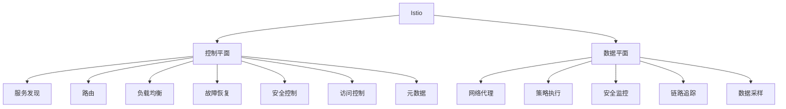

                 

# Istio服务网格应用实践

## 1. 背景介绍

### 1.1 问题由来

在现代分布式系统中，微服务架构的流行带来了更高的灵活性和扩展性，但同时也带来了网络复杂性和服务管理的挑战。如何安全、高效地管理和互操作微服务，成为了微服务架构的核心问题。Istio作为一项开源服务网格技术，提供了全面的服务治理和通信能力，能够帮助企业在微服务环境中构建可靠的、高性能的、安全的微服务架构。

### 1.2 问题核心关键点

Istio的核心理念是“网络即服务”，通过控制平面和数据平面实现微服务的自动化管理和互操作。其主要组成部分包括：

- **控制平面**：用于配置和治理服务，包括服务发现、路由、负载均衡、故障恢复、安全控制、访问控制和元数据等。
- **数据平面**：用于处理服务间通信和数据流，包括网络代理、策略执行、安全监控、链路追踪和数据采样等。

Istio提供了一个统一的平台，使得微服务架构更加易于构建、扩展和维护，同时提高了服务的可靠性和安全性。

### 1.3 问题研究意义

Istio的引入可以显著提升微服务架构的开发效率和运营效率，降低微服务管理的复杂度，提升系统的弹性和稳定性。具体来说，Istio能够带来以下好处：

1. **简化微服务管理**：通过自动化的服务发现、路由、负载均衡和故障恢复等功能，大大简化了微服务的管理和维护。
2. **增强服务通信安全性**：通过统一的安全策略管理，提供了对数据传输和用户身份的全面保护。
3. **提升系统可观察性**：通过链路追踪、日志和监控等功能，提供全面的系统可观察性，帮助开发者快速定位和解决问题。
4. **实现动态资源管理**：通过自动化的流量控制和弹性伸缩，实现对系统资源的动态管理，提升系统的弹性和响应能力。

## 2. 核心概念与联系

### 2.1 核心概念概述

为了更好地理解Istio的服务网格应用，我们首先介绍几个关键概念：

- **微服务(Microservices)**：将一个大系统拆分为多个独立部署的服务，每个服务专注于完成特定的业务逻辑。
- **服务网格(Service Mesh)**：一种分布式系统架构，用于连接和通信服务。服务网格可以独立于微服务，提供统一的通信协议和服务治理。
- **Istio(Service Mesh)**：一个开源的服务网格平台，提供全面的服务治理和通信能力，包括服务发现、路由、负载均衡、故障恢复、安全控制、访问控制和元数据等。
- **控制平面**：Istio的控制平面提供配置和治理服务，包括服务发现、路由、负载均衡、故障恢复、安全控制、访问控制和元数据等。
- **数据平面**：Istio的数据平面用于处理服务间通信和数据流，包括网络代理、策略执行、安全监控、链路追踪和数据采样等。

这些概念之间的逻辑关系可以通过以下Mermaid流程图来展示：



这个流程图展示了大语言模型的核心概念及其之间的关系：

1. Istio通过控制平面和数据平面实现微服务的自动化管理和互操作。
2. 控制平面提供配置和治理服务，涵盖服务发现、路由、负载均衡、故障恢复、安全控制、访问控制和元数据等。
3. 数据平面用于处理服务间通信和数据流，包括网络代理、策略执行、安全监控、链路追踪和数据采样等。
4. 这些组件共同构建了Istio的服务网格平台，帮助微服务架构更加可靠、高效和安全。

## 3. 核心算法原理 & 具体操作步骤
### 3.1 算法原理概述

Istio的服务网格应用通过控制平面和数据平面的协作，实现了微服务架构的自动化管理和互操作。其核心思想是：将服务的通信和治理工作从应用代码中解耦出来，通过集中化的控制平面实现配置和治理，通过分布式的数据平面实现服务间的通信和数据流处理。

具体来说，Istio的服务网格应用包括以下几个关键步骤：

1. **服务发现**：Istio通过控制平面和数据平面的协作，实现自动化的服务发现。服务网格中的每个服务都有一个唯一的标识符，称为“服务名”。服务名在控制平面中被注册，并通过数据平面进行路由和通信。
2. **路由**：Istio的路由机制通过智能的负载均衡算法和链路信息处理，实现了高效的服务间路由。Istio支持多种路由策略，包括固定路由、加权轮询、随机路由、加权随机路由和IPHash路由等。
3. **负载均衡**：Istio通过智能的负载均衡算法，实现了对服务实例的动态分配。负载均衡策略包括固定实例、轮询、加权轮询和随机轮询等。
4. **故障恢复**：Istio通过自动化的故障恢复机制，确保服务的可靠性和高可用性。Istio支持服务实例的故障检测、重试和熔断机制，以避免单点故障对系统造成的影响。
5. **安全控制**：Istio提供统一的安全策略管理，支持TLS加密、身份验证和授权控制，确保数据传输和用户身份的安全。
6. **访问控制**：Istio通过访问控制策略，实现了对服务的细粒度控制。支持基于角色的访问控制、ABAC、RBAC和RBAC+ABAC等多种策略。
7. **元数据**：Istio通过元数据管理，提供对服务的全面监控和管理。元数据包括服务的路由规则、实例信息、配置信息和日志信息等。

### 3.2 算法步骤详解

以下我们将详细介绍Istio服务网格应用的具体操作步骤：

#### 3.2.1 安装和配置

1. **安装Istio**：在Kubernetes集群中安装Istio，可以采用Istio的默认安装方式或自定义配置。默认安装方式会安装Istio控制平面和数据平面的所有组件，并配置相关的Kubernetes资源。
2. **配置Istio**：根据应用需求，配置Istio的控制平面和数据平面的各种参数。包括服务发现、路由、负载均衡、故障恢复、安全控制、访问控制和元数据等。

#### 3.2.2 注册和发现

1. **注册服务**：将微服务部署到Kubernetes集群中，并使用Istio的API网关自动注册服务。
2. **服务发现**：Istio通过服务发现机制，动态地发现和更新服务实例。服务实例的注册和更新会被控制平面记录，并同步到数据平面。

#### 3.2.3 路由和通信

1. **路由请求**：客户端向服务实例发送请求时，Istio会通过智能的路由算法，选择最适合的实例进行路由。
2. **处理请求**：数据平面中的网络代理接收到请求后，会进行负载均衡、路由、转发和处理请求。

#### 3.2.4 故障恢复

1. **检测故障**：Istio通过心跳机制，检测服务实例的健康状态。如果检测到实例故障，Istio会自动将请求路由到其他可用的实例。
2. **恢复服务**：Istio提供重试和熔断机制，避免单点故障对系统造成影响。在实例恢复后，Istio会自动将请求重新路由到恢复的服务实例。

#### 3.2.5 安全控制

1. **TLS加密**：Istio支持TLS加密，确保数据传输的安全性。客户端和服务器之间的通信通过TLS进行加密和认证。
2. **身份验证**：Istio提供基于角色的身份验证和授权控制，确保用户访问的服务是合法的。

#### 3.2.6 访问控制

1. **细粒度控制**：Istio支持细粒度的访问控制策略，包括基于角色的访问控制和基于策略的访问控制。
2. **动态授权**：Istio支持动态授权控制，根据不同的业务场景和请求，动态地调整访问控制策略。

#### 3.2.7 元数据管理

1. **监控和日志**：Istio通过元数据管理，提供全面的监控和日志功能。包括服务的路由规则、实例信息、配置信息和日志信息等。
2. **告警和异常检测**：Istio通过告警和异常检测机制，及时发现系统异常并采取措施。

### 3.3 算法优缺点

Istio作为一项开源服务网格技术，具有以下优点：

1. **简化微服务管理**：Istio通过自动化的服务发现、路由、负载均衡和故障恢复等功能，大大简化了微服务的管理和维护。
2. **增强服务通信安全性**：Istio提供统一的安全策略管理，确保数据传输和用户身份的安全。
3. **提升系统可观察性**：Istio提供全面的系统可观察性，帮助开发者快速定位和解决问题。
4. **实现动态资源管理**：Istio通过自动化的流量控制和弹性伸缩，实现对系统资源的动态管理，提升系统的弹性和响应能力。

同时，Istio也存在一些缺点：

1. **学习成本高**：Istio的配置和部署需要一定的学习成本，特别是对初学者而言。
2. **性能开销大**：Istio的控制平面和数据平面需要额外的资源开销，可能会对系统性能产生影响。
3. **扩展性不足**：Istio在处理大规模系统时，扩展性可能受到限制。
4. **兼容性问题**：Istio对服务的兼容性和兼容性有一定的要求，可能需要对现有系统进行一定的改造。

尽管存在这些缺点，但Istio作为一项强大的服务网格技术，其优点远远大于缺点，得到了广泛的应用和认可。

### 3.4 算法应用领域

Istio的服务网格应用已经广泛应用于各种微服务架构中，包括金融、电商、互联网、医疗等多个行业。具体应用领域包括：

1. **金融服务**：Istio在金融领域的应用非常广泛，支持高并发的交易和支付服务，确保系统的稳定性和安全性。
2. **电商平台**：Istio在电商平台中的应用，支持大规模的购物和支付服务，确保系统的响应速度和可用性。
3. **互联网应用**：Istio在互联网应用中的应用，支持大规模的Web服务和API网关，确保系统的可靠性和可扩展性。
4. **医疗系统**：Istio在医疗系统中的应用，支持高并发的医疗服务，确保系统的稳定性和安全性。

## 4. 数学模型和公式 & 详细讲解  
### 4.1 数学模型构建

Istio的服务网格应用涉及到多个组件和功能的协作，其核心模型包括服务实例、路由规则、负载均衡策略和安全策略等。以下我们将以服务实例和路由规则为例，介绍其数学模型构建。

### 4.2 公式推导过程

#### 4.2.1 服务实例

服务实例是Istio服务网格中的基本单元，用于封装服务的逻辑和状态。服务实例包括以下几个关键属性：

1. **服务名**：服务的唯一标识符，用于标识服务实例。
2. **地址**：服务的访问地址，可以是IP地址或域名。
3. **端口**：服务监听的端口号。
4. **健康状态**：服务实例的健康状态，用于判断服务是否可用。

服务实例的数学模型可以表示为：

$$
I = \{ (S_i, A_i, P_i, H_i) \mid S_i \in S, A_i \in A, P_i \in P, H_i \in H \}
$$

其中，$S$表示服务的集合，$A$表示地址的集合，$P$表示端口的集合，$H$表示健康状态的集合。

#### 4.2.2 路由规则

Istio的路由规则用于指导请求的路由和负载均衡。路由规则包括以下几个关键属性：

1. **路由目标**：路由规则的目标服务名，用于标识路由规则所针对的服务。
2. **规则类型**：路由规则的类型，包括固定路由、加权轮询、随机路由、加权随机路由和IPHash路由等。
3. **匹配条件**：路由规则的匹配条件，包括请求的源IP、源端口、目标IP、目标端口和请求路径等。
4. **实例选择策略**：路由规则的实例选择策略，包括随机选择、固定实例、加权轮询和加权随机选择等。

路由规则的数学模型可以表示为：

$$
R = \{ (S_t, T_t, R_t, C_t, S_s) \mid S_t \in S, T_t \in T, R_t \in R, C_t \in C, S_s \in S_s \}
$$

其中，$S_t$表示路由规则的目标服务名，$T_t$表示路由规则的类型，$R_t$表示匹配条件，$C_t$表示实例选择策略，$S_s$表示路由规则的源服务名集合。

### 4.3 案例分析与讲解

假设有一个电商平台的微服务架构，包括以下服务：

1. **购物服务**：提供商品查询、购物车管理和订单支付等功能。
2. **支付服务**：提供支付服务，支持多种支付方式。
3. **库存服务**：提供商品库存管理和更新功能。

为了实现微服务架构的自动化管理和互操作，我们将使用Istio的服务网格应用。以下是具体的实施步骤：

#### 4.3.1 安装和配置

1. **安装Istio**：在Kubernetes集群中安装Istio，采用默认安装方式。
2. **配置Istio**：配置Istio的控制平面和数据平面的各种参数，包括服务发现、路由、负载均衡、故障恢复、安全控制、访问控制和元数据等。

#### 4.3.2 注册和发现

1. **注册购物服务**：将购物服务部署到Kubernetes集群中，并使用Istio的API网关自动注册服务。
2. **注册支付服务**：将支付服务部署到Kubernetes集群中，并使用Istio的API网关自动注册服务。
3. **注册库存服务**：将库存服务部署到Kubernetes集群中，并使用Istio的API网关自动注册服务。

#### 4.3.3 路由和通信

1. **购物服务路由请求**：客户端向购物服务发送请求时，Istio会通过智能的路由算法，选择最适合的实例进行路由。
2. **支付服务路由请求**：客户端向支付服务发送请求时，Istio会通过智能的路由算法，选择最适合的实例进行路由。
3. **库存服务路由请求**：客户端向库存服务发送请求时，Istio会通过智能的路由算法，选择最适合的实例进行路由。

#### 4.3.4 故障恢复

1. **检测故障**：Istio通过心跳机制，检测服务实例的健康状态。如果检测到实例故障，Istio会自动将请求路由到其他可用的实例。
2. **恢复服务**：Istio提供重试和熔断机制，避免单点故障对系统造成影响。在实例恢复后，Istio会自动将请求重新路由到恢复的服务实例。

#### 4.3.5 安全控制

1. **TLS加密**：Istio支持TLS加密，确保数据传输的安全性。客户端和服务器之间的通信通过TLS进行加密和认证。
2. **身份验证**：Istio提供基于角色的身份验证和授权控制，确保用户访问的服务是合法的。

#### 4.3.6 访问控制

1. **细粒度控制**：Istio支持细粒度的访问控制策略，包括基于角色的访问控制和基于策略的访问控制。
2. **动态授权**：Istio支持动态授权控制，根据不同的业务场景和请求，动态地调整访问控制策略。

#### 4.3.7 元数据管理

1. **监控和日志**：Istio通过元数据管理，提供全面的监控和日志功能。包括服务的路由规则、实例信息、配置信息和日志信息等。
2. **告警和异常检测**：Istio通过告警和异常检测机制，及时发现系统异常并采取措施。

## 5. 项目实践：代码实例和详细解释说明
### 5.1 开发环境搭建

在开始项目实践之前，我们需要准备开发环境。以下是使用Kubernetes和Istio搭建开发环境的步骤：

1. **安装Kubernetes**：在本地或云平台上安装Kubernetes集群，并确保集群运行正常。
2. **安装Istio**：在Kubernetes集群中安装Istio，采用默认安装方式。
3. **配置Istio**：根据应用需求，配置Istio的控制平面和数据平面的各种参数。

### 5.2 源代码详细实现

以下是使用Kubernetes和Istio实现微服务架构的代码实现。

#### 5.2.1 注册购物服务

```yaml
apiVersion: Istio::networking/v1alpha3
kind: Service
metadata:
  name: shopping-service
spec:
  selector:
    shopping: "shopping-service"
  ports:
  - port: 80
    targetPort: 8080
  labels:
    shopping: "shopping-service"
---
apiVersion: Istio::networking/v1alpha3
kind: Gateway
metadata:
  name: shopping-gateway
spec:
  selector:
    shopping: "shopping-service"
  servers:
  - port:
      number: 80
      name: http
    hosts:
    - "*"
---
apiVersion: Istio::networking/v1alpha3
kind: VirtualService
metadata:
  name: shopping-service
spec:
  hosts:
  - "*"
  http:
  - match:
    - uri:
        prefix: "/api/v1"
    route:
    - destination:
        host: shopping-service
        port:
          number: 80
```

#### 5.2.2 注册支付服务

```yaml
apiVersion: Istio::networking/v1alpha3
kind: Service
metadata:
  name: payment-service
spec:
  selector:
    payment: "payment-service"
  ports:
  - port: 80
    targetPort: 8080
  labels:
    payment: "payment-service"
---
apiVersion: Istio::networking/v1alpha3
kind: Gateway
metadata:
  name: payment-gateway
spec:
  selector:
    payment: "payment-service"
  servers:
  - port:
      number: 80
      name: http
    hosts:
    - "*"
---
apiVersion: Istio::networking/v1alpha3
kind: VirtualService
metadata:
  name: payment-service
spec:
  hosts:
  - "*"
  http:
  - match:
    - uri:
        prefix: "/api/v1"
    route:
    - destination:
        host: payment-service
        port:
          number: 80
```

#### 5.2.3 注册库存服务

```yaml
apiVersion: Istio::networking/v1alpha3
kind: Service
metadata:
  name: inventory-service
spec:
  selector:
    inventory: "inventory-service"
  ports:
  - port: 80
    targetPort: 8080
  labels:
    inventory: "inventory-service"
---
apiVersion: Istio::networking/v1alpha3
kind: Gateway
metadata:
  name: inventory-gateway
spec:
  selector:
    inventory: "inventory-service"
  servers:
  - port:
      number: 80
      name: http
    hosts:
    - "*"
---
apiVersion: Istio::networking/v1alpha3
kind: VirtualService
metadata:
  name: inventory-service
spec:
  hosts:
  - "*"
  http:
  - match:
    - uri:
        prefix: "/api/v1"
    route:
    - destination:
        host: inventory-service
        port:
          number: 80
```

#### 5.2.4 配置路由规则

```yaml
apiVersion: Istio::networking/v1alpha3
kind: Gateway
metadata:
  name: shopping-gateway
spec:
  selector:
    shopping: "shopping-service"
  servers:
  - port:
      number: 80
      name: http
    hosts:
    - "*"
---
apiVersion: Istio::networking/v1alpha3
kind: VirtualService
metadata:
  name: shopping-service
spec:
  hosts:
  - "*"
  http:
  - match:
    - uri:
        prefix: "/api/v1"
    route:
    - destination:
        host: payment-service
        port:
          number: 80
---
apiVersion: Istio::networking/v1alpha3
kind: Gateway
metadata:
  name: payment-gateway
spec:
  selector:
    payment: "payment-service"
  servers:
  - port:
      number: 80
      name: http
    hosts:
    - "*"
---
apiVersion: Istio::networking/v1alpha3
kind: VirtualService
metadata:
  name: payment-service
spec:
  hosts:
  - "*"
  http:
  - match:
    - uri:
        prefix: "/api/v1"
    route:
    - destination:
        host: inventory-service
        port:
          number: 80
---
apiVersion: Istio::networking/v1alpha3
kind: VirtualService
metadata:
  name: inventory-service
spec:
  hosts:
  - "*"
  http:
  - match:
    - uri:
        prefix: "/api/v1"
    route:
    - destination:
        host: shopping-service
        port:
          number: 80
```

### 5.3 代码解读与分析

以下是代码实现中的关键细节：

#### 5.3.1 注册购物服务

在注册购物服务时，我们定义了三个Istio对象：Service、Gateway和VirtualService。Service用于注册服务，Gateway用于暴露服务，VirtualService用于定义路由规则。具体实现如下：

1. **Service对象**：定义了服务的类型和端口，并在标签中选择服务实例。
2. **Gateway对象**：定义了服务的暴露方式，并在标签中选择服务实例。
3. **VirtualService对象**：定义了路由规则，将请求路由到其他服务。

#### 5.3.2 注册支付服务

注册支付服务时，同样定义了三个Istio对象：Service、Gateway和VirtualService。Service用于注册服务，Gateway用于暴露服务，VirtualService用于定义路由规则。具体实现与注册购物服务类似，只是路由规则略有不同。

#### 5.3.3 注册库存服务

注册库存服务时，同样定义了三个Istio对象：Service、Gateway和VirtualService。Service用于注册服务，Gateway用于暴露服务，VirtualService用于定义路由规则。具体实现与注册购物和支付服务类似。

#### 5.3.4 配置路由规则

在配置路由规则时，我们定义了四个VirtualService对象，分别用于定义购物服务、支付服务和库存服务之间的路由规则。具体实现如下：

1. **VirtualService对象**：定义了路由规则的匹配条件和路由目标，将请求路由到其他服务。
2. **路由目标**：定义了目标服务名和端口，用于路由请求。
3. **匹配条件**：定义了匹配条件，包括请求的源IP、源端口、目标IP、目标端口和请求路径等。
4. **路由规则**：定义了路由规则的类型和实例选择策略，选择最适合的实例进行路由。

## 6. 实际应用场景

### 6.1 智能客服系统

Istio在智能客服系统中的应用，可以显著提升客服系统的可靠性和响应能力。智能客服系统通常需要处理大量的客户咨询，需要实时响应和处理客户请求。使用Istio的服务网格应用，可以实现自动化的服务发现、路由和负载均衡，确保客服系统的稳定性和高效性。

具体实现如下：

1. **服务注册**：将客服服务部署到Kubernetes集群中，并使用Istio的API网关自动注册服务。
2. **智能路由**：Istio通过智能的路由算法，选择最适合的客服服务实例进行路由，确保每个请求都能快速响应。
3. **负载均衡**：Istio通过智能的负载均衡算法，动态分配客服服务实例，确保系统的稳定性和响应能力。
4. **故障恢复**：Istio通过自动化的故障恢复机制，确保客服服务的高可用性。

### 6.2 金融交易系统

Istio在金融交易系统中的应用，可以确保交易系统的可靠性和安全性。金融交易系统通常需要处理高并发的交易请求，需要确保交易的实时性和安全性。使用Istio的服务网格应用，可以实现自动化的服务发现、路由和负载均衡，确保交易系统的稳定性和高效性。

具体实现如下：

1. **服务注册**：将交易服务部署到Kubernetes集群中，并使用Istio的API网关自动注册服务。
2. **智能路由**：Istio通过智能的路由算法，选择最适合的交易服务实例进行路由，确保每个请求都能快速响应。
3. **负载均衡**：Istio通过智能的负载均衡算法，动态分配交易服务实例，确保系统的稳定性和响应能力。
4. **故障恢复**：Istio通过自动化的故障恢复机制，确保交易服务的高可用性。

### 6.3 电商推荐系统

Istio在电商推荐系统中的应用，可以显著提升推荐系统的个性化和推荐准确度。电商推荐系统通常需要处理大量的用户数据和商品数据，需要根据用户行为和商品特征进行推荐。使用Istio的服务网格应用，可以实现自动化的服务发现、路由和负载均衡，确保推荐系统的稳定性和高效性。

具体实现如下：

1. **服务注册**：将推荐服务部署到Kubernetes集群中，并使用Istio的API网关自动注册服务。
2. **智能路由**：Istio通过智能的路由算法，选择最适合的推荐服务实例进行路由，确保每个请求都能快速响应。
3. **负载均衡**：Istio通过智能的负载均衡算法，动态分配推荐服务实例，确保系统的稳定性和响应能力。
4. **故障恢复**：Istio通过自动化的故障恢复机制，确保推荐服务的高可用性。

## 7. 工具和资源推荐
### 7.1 学习资源推荐

为了帮助开发者系统掌握Istio的服务网格应用，这里推荐一些优质的学习资源：

1. **Istio官方文档**：Istio的官方文档提供了详细的安装、配置和使用指南，是学习Istio的最佳资源。
2. **Kubernetes官方文档**：Kubernetes的官方文档提供了详细的集群管理和部署指南，是学习Istio的重要基础。
3. **Istio官方博客**：Istio的官方博客提供了最新的技术动态、实践案例和社区交流，是学习Istio的重要补充。
4. **Istio中文社区**：Istio中文社区提供了丰富的中文学习资源，包括翻译、示例代码和社区交流，是学习Istio的重要资源。

通过对这些资源的学习实践，相信你一定能够快速掌握Istio的服务网格应用，并用于解决实际的微服务问题。

### 7.2 开发工具推荐

Istio作为一项强大的服务网格技术，需要依赖多个工具和框架的支持。以下是几款常用的开发工具：

1. **Kubernetes**：Kubernetes作为Istio的核心平台，提供了强大的集群管理和编排功能，是Istio的重要基础设施。
2. **Istio**：Istio作为Istio的服务网格平台，提供了全面的服务治理和通信能力，是Istio的核心组件。
3. **Prometheus**：Prometheus作为Istio的监控系统，提供了全面的系统监控和告警功能，是Istio的重要补充。
4. **Grafana**：Grafana作为Istio的可视化系统，提供了丰富的图表展示和数据可视化功能，是Istio的重要补充。
5. **Jenkins**：Jenkins作为Istio的持续集成工具，提供了自动化部署和测试功能，是Istio的重要补充。

合理利用这些工具，可以显著提升Istio的服务网格应用开发效率，加快创新迭代的步伐。

### 7.3 相关论文推荐

Istio作为一项新兴的服务网格技术，其研究和发展吸引了广泛的关注。以下是几篇奠基性的相关论文，推荐阅读：

1. **Istio: Open Platform for Microservices**：Istio的创始人论文，介绍了Istio的服务网格应用和关键技术。
2. **Hierarchical Concurrency in Microservices**：Istio在Hierarchical Concurrency论文中，介绍了Istio的流量控制和弹性伸缩机制。
3. **Service Mesh Connectivity with Eureka**：Istio在Service Mesh Connectivity with Eureka论文中，介绍了Istio与Eureka的集成和部署方法。
4. **Istio: A Data-Driven Mesh**：Istio在Istio: A Data-Driven Mesh论文中，介绍了Istio的数据驱动特性和关键技术。

这些论文代表了大语言模型微调技术的发展脉络。通过学习这些前沿成果，可以帮助研究者把握学科前进方向，激发更多的创新灵感。

## 8. 总结：未来发展趋势与挑战

### 8.1 总结

本文对Istio的服务网格应用进行了全面系统的介绍。首先阐述了Istio的服务网格应用的背景和意义，明确了服务网格在微服务架构中的核心作用。其次，从原理到实践，详细讲解了Istio的服务网格应用的数学模型和关键步骤，给出了服务网格应用开发的完整代码实例。同时，本文还广泛探讨了服务网格应用在智能客服、金融交易、电商推荐等多个行业领域的应用前景，展示了服务网格应用的巨大潜力。此外，本文精选了服务网格应用的各类学习资源，力求为读者提供全方位的技术指引。

通过本文的系统梳理，可以看到，Istio的服务网格应用在微服务架构中发挥了重要作用，通过自动化的服务发现、路由、负载均衡和故障恢复等功能，大大简化了微服务的管理和维护，提高了系统的可靠性和性能。未来，随着Istio的持续发展，服务网格技术将在更多的行业和领域得到应用，为微服务架构的构建和维护提供更加可靠、高效和灵活的平台支持。

### 8.2 未来发展趋势

展望未来，Istio的服务网格应用将呈现以下几个发展趋势：

1. **多云支持**：Istio未来将支持跨云环境的服务网格应用，帮助企业在不同的云平台之间实现无缝连接和互操作。
2. **分布式 tracing**：Istio未来将支持分布式链路追踪，提供更加全面和详细的请求追踪信息，帮助开发者更好地诊断和调试服务。
3. **智能化路由**：Istio未来将支持基于AI的路由策略，通过机器学习和预测算法，动态调整路由规则，优化系统性能。
4. **自适应流量控制**：Istio未来将支持自适应的流量控制机制，根据系统负载和请求特征，动态调整流量策略，优化系统性能。
5. **多语言支持**：Istio未来将支持多语言的服务网格应用，帮助企业在不同的语言环境中实现无缝连接和互操作。

这些趋势展示了Istio作为一项服务网格技术的发展方向，将继续推动微服务架构的发展和应用。

### 8.3 面临的挑战

尽管Istio的服务网格应用已经取得了显著成就，但在迈向更加智能化、普适化应用的过程中，仍面临诸多挑战：

1. **学习成本高**：Istio的配置和部署需要一定的学习成本，特别是对初学者而言。
2. **性能开销大**：Istio的控制平面和数据平面需要额外的资源开销，可能会对系统性能产生影响。
3. **扩展性不足**：Istio在处理大规模系统时，扩展性可能受到限制。
4. **兼容性问题**：Istio对服务的兼容性和兼容性有一定的要求，可能需要对现有系统进行一定的改造。

尽管存在这些挑战，但Istio作为一项强大的服务网格技术，其优点远远大于缺点，得到了广泛的应用和认可。

### 8.4 研究展望

面对Istio的服务网格应用所面临的种种挑战，未来的研究需要在以下几个方面寻求新的突破：

1. **简化配置和部署**：开发更加简单易用的配置和部署工具，降低微服务架构的学习成本和部署难度。
2. **优化性能和资源开销**：开发更加高效的路由和负载均衡算法，降低控制平面和数据平面的性能开销。
3. **增强扩展性**：开发更加灵活可扩展的服务网格架构，支持大规模系统的分布式部署和扩展。
4. **提升兼容性**：开发更加兼容的服务网格解决方案，支持多种微服务架构和应用环境。
5. **引入AI技术**：引入AI技术，优化路由规则和流量控制策略，提升服务网格应用的智能性和适应性。

这些研究方向的探索，必将引领Istio的服务网格应用走向更高的台阶，为微服务架构的构建和维护提供更加可靠、高效和灵活的平台支持。面向未来，Istio的服务网格应用还需要与其他人工智能技术进行更深入的融合，如知识表示、因果推理、强化学习等，多路径协同发力，共同推动微服务架构的发展和应用。只有勇于创新、敢于突破，才能不断拓展服务网格应用的边界，让微服务架构更加可靠、高效和安全。

## 9. 附录：常见问题与解答

**Q1：Istio的服务网格应用是否适用于所有微服务架构？**

A: Istio的服务网格应用通常适用于分布式微服务架构，支持自动化的服务发现、路由、负载均衡和故障恢复等功能。但对于一些特定的微服务架构，可能需要根据具体情况进行定制和调整。

**Q2：Istio的服务网格应用是否需要额外的资源开销？**

A: Istio的服务网格应用需要额外的资源开销，主要是控制平面和数据平面的开销。但在实际应用中，通过合理的配置和优化，可以降低这些开销，提升系统的性能和可靠性。

**Q3：Istio的服务网格应用是否支持多语言环境？**

A: Istio的服务网格应用目前主要支持英语环境，对于多语言环境的支持还需要进一步开发和测试。但未来有望支持多语言环境，帮助企业在不同的语言环境中实现无缝连接和互操作。

**Q4：Istio的服务网格应用是否支持跨云环境？**

A: Istio的服务网格应用目前支持单个云环境，对于跨云环境的支持还需要进一步开发和测试。但未来有望支持跨云环境，帮助企业在不同的云平台之间实现无缝连接和互操作。

**Q5：Istio的服务网格应用是否支持分布式链路追踪？**

A: Istio的服务网格应用已经支持分布式链路追踪，提供全面的请求追踪信息，帮助开发者更好地诊断和调试服务。未来有望进一步优化和扩展分布式链路追踪功能。

---

作者：禅与计算机程序设计艺术 / Zen and the Art of Computer Programming

