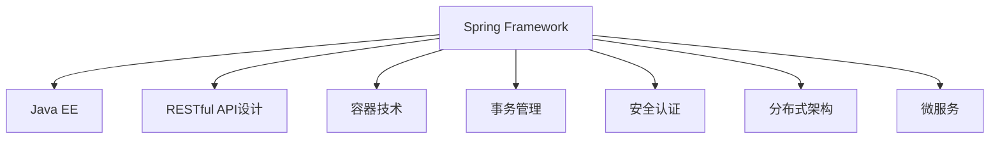

                 

# Java 企业级开发：Spring Framework 和 Java EE

> 关键词：Java企业级开发, Spring框架, JavaEE, 设计模式, RESTful API, 容器技术, 事务管理, 安全认证, 分布式架构, 微服务

## 1. 背景介绍

### 1.1 问题由来

在当前的企业级开发中，Java作为主流编程语言，其企业级开发框架和技术栈正面临着不断的更新和演进。随着微服务的兴起、分布式架构的普及，企业级应用系统面临的挑战越来越大。如何构建高效、稳定、可扩展的企业级应用，成为了摆在开发者面前的重要课题。

为应对这些挑战，Spring Framework和Java EE等技术栈在不断演进中诞生了一系列新技术，如Spring Boot、Spring Cloud、Spring Data、RESTful API、容器技术等，为开发者提供了强大的工具和框架。然而，如何深入理解这些技术，并有效地应用于实际开发，是一个值得深思的问题。

### 1.2 问题核心关键点

本文将深入探讨Java企业级开发中关键的Spring Framework和Java EE技术栈，介绍其核心概念、架构原理、使用方法，并结合实际应用场景进行详细分析。我们将从以下几个方面展开讨论：

1. **Spring Framework**：一个广泛使用的Java开发框架，提供了依赖注入、面向切面编程、数据访问抽象层、Web MVC等多种核心功能。

2. **Java EE**：Java平台企业版，提供了一系列规范和API，用于构建可移植、可扩展的企业级应用。

3. **RESTful API设计**：一种基于HTTP协议的轻量级、无状态、可缓存的API设计风格，广泛应用于微服务架构中。

4. **容器技术**：如Docker、Kubernetes等，提供了容器化和容器编排的能力，极大简化了微服务应用的部署和管理。

5. **事务管理**：保证数据一致性和隔离性，支持多种事务管理方式，如JPA、JTS等。

6. **安全认证**：包括用户认证、权限控制、SSL/TLS加密等，保证应用系统的安全性。

7. **分布式架构**：如服务注册与发现、负载均衡、断路器、限流等，保证微服务架构的健壮性和稳定性。

8. **微服务**：将应用拆分为多个独立运行的服务，每个服务负责单一功能，提高系统的可扩展性和灵活性。

这些技术点相互关联，共同构成了Java企业级开发的核心框架和技术栈。通过深入理解这些技术，开发者能够构建出高质量、高可靠性的企业级应用。

## 2. 核心概念与联系

### 2.1 核心概念概述

为更好地理解Spring Framework和Java EE框架，本节将介绍几个密切相关的核心概念：

- **Spring Framework**：一个开源的Java框架，提供依赖注入、面向切面编程、数据访问抽象层、Web MVC等多种核心功能。
- **Java EE**：Java平台企业版，提供了一系列规范和API，用于构建可移植、可扩展的企业级应用。
- **RESTful API设计**：一种基于HTTP协议的轻量级、无状态、可缓存的API设计风格。
- **容器技术**：如Docker、Kubernetes等，提供了容器化和容器编排的能力。
- **事务管理**：保证数据一致性和隔离性，支持多种事务管理方式。
- **安全认证**：包括用户认证、权限控制、SSL/TLS加密等，保证应用系统的安全性。
- **分布式架构**：如服务注册与发现、负载均衡、断路器、限流等，保证微服务架构的健壮性和稳定性。
- **微服务**：将应用拆分为多个独立运行的服务，每个服务负责单一功能。

这些核心概念之间的逻辑关系可以通过以下Mermaid流程图来展示：

这个流程图展示了Spring Framework和Java EE的核心概念及其之间的关系：

1. **Spring Framework**通过依赖注入、面向切面编程等功能，使得Java EE应用的开发更加灵活和高效。
2. **RESTful API设计**和**容器技术**提供了一种新的应用架构，使得企业级应用能够更好地适应分布式和微服务架构。
3. **事务管理**、**安全认证**和**分布式架构**是保证企业级应用稳定性和安全性的关键技术。
4. **微服务**技术将应用拆分为多个独立运行的服务，使得系统更加可扩展和灵活。

这些核心概念共同构成了Java企业级开发的基础框架，使得开发者能够构建出高效、稳定、可扩展的企业级应用。

## 3. 核心算法原理 & 具体操作步骤
### 3.1 算法原理概述

Java企业级开发的核心算法和具体操作步骤主要包括以下几个方面：

1. **依赖注入(Dependency Injection, DI)**：通过Spring Framework提供的依赖注入功能，使得对象之间的依赖关系得以自动管理，提高了代码的解耦性和可维护性。
2. **面向切面编程(AOP)**：通过Spring Framework提供的面向切面编程功能，实现横切关注点的模块化，提高了代码的可重用性和可维护性。
3. **数据访问抽象层(JPA)**：通过Spring Framework提供的JPA功能，实现对数据库的抽象和操作，简化了数据访问层的开发。
4. **Web MVC**：通过Spring Framework提供的Web MVC功能，实现Web应用的MVC架构，提高了Web应用的开发效率和可扩展性。
5. **RESTful API设计**：通过RESTful API设计，实现微服务架构下的轻量级、无状态、可缓存的API设计，提高了API的可扩展性和可维护性。
6. **容器技术**：通过Docker、Kubernetes等容器技术，实现应用的容器化和容器编排，简化了应用的部署和管理。
7. **事务管理**：通过Spring Framework提供的事务管理功能，实现数据的一致性和隔离性，保证了数据操作的可靠性。
8. **安全认证**：通过Spring Security等框架，实现用户认证、权限控制、SSL/TLS加密等功能，保证了应用的安全性。
9. **分布式架构**：通过Spring Cloud等框架，实现服务注册与发现、负载均衡、断路器、限流等功能，保证了微服务架构的健壮性和稳定性。
10. **微服务**：通过Spring Boot等框架，实现应用的微服务化，提高了系统的可扩展性和灵活性。

### 3.2 算法步骤详解

下面将详细介绍Java企业级开发中核心的算法步骤：

**Step 1: 准备开发环境**

1. **安装Java环境**：确保Java 8或以上版本的安装。

2. **安装Maven**：从官网下载并安装Maven，用于项目管理。

3. **安装Spring Framework和Java EE相关依赖**：通过Maven管理依赖，确保Spring Framework和Java EE的依赖库安装正确。

**Step 2: 配置Spring Boot项目**

1. **创建Spring Boot项目**：通过Spring Initializr创建项目。

2. **配置应用类路径**：将项目中的主要类文件放在src/main/java目录下。

3. **配置Spring Boot启动类**：创建一个Spring Boot启动类，用于Spring Boot应用的启动。

4. **配置Spring Bean**：通过@Component注解和@Autowired注解，实现Spring Bean的配置和依赖注入。

5. **配置Spring MVC**：通过@Controller注解和@RequestMapping注解，实现Web MVC的配置和路由处理。

6. **配置Spring JPA**：通过@Configuration注解和@EnableJpaRepositories注解，实现Spring JPA的配置和数据访问。

**Step 3: 开发Spring Boot应用**

1. **开发业务逻辑**：编写业务逻辑类，实现核心业务功能。

2. **进行数据访问**：通过Spring JPA实现数据访问，进行数据操作。

3. **进行Web MVC处理**：编写控制器类，处理Web请求，并返回数据。

4. **进行事务管理**：通过@Transactional注解，实现事务管理，保证数据一致性和隔离性。

5. **进行安全认证**：通过Spring Security等框架，实现用户认证和权限控制。

**Step 4: 部署Spring Boot应用**

1. **打包Spring Boot应用**：通过Maven打包应用。

2. **部署应用**：将打包后的应用部署到Java EE服务器或容器平台，如Tomcat、JBoss等。

3. **配置容器**：配置容器参数，如环境变量、启动参数等。

**Step 5: 进行微服务开发**

1. **拆分应用**：将应用拆分为多个独立的微服务。

2. **开发微服务**：为每个微服务开发独立的业务逻辑和数据访问。

3. **实现RESTful API**：通过Spring Boot的RestController注解和@RequestMapping注解，实现RESTful API的开发。

4. **实现微服务间通信**：通过Spring Cloud的Ribbon、Feign等框架，实现微服务间的高效通信。

5. **实现服务注册与发现**：通过Spring Cloud的Eureka框架，实现服务注册与发现功能。

6. **实现负载均衡**：通过Spring Cloud的Ribbon框架，实现负载均衡。

7. **实现断路器**：通过Spring Cloud的Hystrix框架，实现断路器功能，保证系统稳定性和可靠性。

8. **实现限流**：通过Spring Cloud的Netflix框架，实现限流功能，避免系统过载。

**Step 6: 进行容器化部署**

1. **创建Docker镜像**：通过Dockerfile创建应用镜像。

2. **部署应用到Docker**：将应用部署到Docker容器，并启动容器。

3. **部署应用到Kubernetes**：将应用部署到Kubernetes集群，并进行容器编排。

### 3.3 算法优缺点

**优点**：

1. **灵活性高**：Spring Framework提供了丰富的功能和注解，使得Java开发灵活高效。

2. **可扩展性好**：Spring Framework支持模块化开发，方便后期扩展和维护。

3. **安全性高**：Spring Security等框架提供了全面的安全认证功能，保证应用系统的安全性。

4. **可维护性好**：Spring Framework提供了依赖注入、面向切面编程等功能，使得代码解耦，可维护性好。

**缺点**：

1. **学习曲线陡**：Spring Framework功能强大，但需要掌握大量的注解和技术，学习曲线较陡。

2. **性能问题**：Spring Framework提供了大量的功能和注解，增加了应用启动和运行时的开销。

3. **依赖复杂**：Spring Framework的依赖库较多，可能会导致应用启动时加载大量依赖。

### 3.4 算法应用领域

Spring Framework和Java EE技术栈在Java企业级开发中得到了广泛应用，覆盖了几乎所有常见的企业级应用场景，例如：

1. **Web应用开发**：通过Spring Web MVC，实现Web应用的开发和部署。

2. **企业级应用开发**：通过Spring JPA、Spring Security等框架，实现企业级应用的数据访问、安全认证等功能。

3. **微服务架构开发**：通过Spring Cloud等框架，实现微服务的开发和部署。

4. **容器化部署**：通过Docker、Kubernetes等容器技术，实现应用的容器化和容器编排，简化了应用的部署和管理。

5. **分布式架构**：通过Spring Cloud等框架，实现分布式架构的开发和部署，保证系统的健壮性和稳定性。

6. **数据访问**：通过Spring JPA等框架，实现对数据库的抽象和操作，简化了数据访问层的开发。

7. **事务管理**：通过Spring Framework提供的事务管理功能，实现数据的一致性和隔离性，保证了数据操作的可靠性。

8. **RESTful API设计**：通过RESTful API设计，实现微服务架构下的轻量级、无状态、可缓存的API设计，提高了API的可扩展性和可维护性。

除了上述这些经典应用外，Spring Framework和Java EE技术栈还被创新性地应用到更多场景中，如DevOps、持续集成、云原生应用等，为Java企业级开发带来了全新的突破。

## 4. 数学模型和公式 & 详细讲解  
### 4.1 数学模型构建

在本节中，我们将使用数学语言对Java企业级开发中核心的算法步骤进行更加严格的刻画。

假设我们有一个Java企业级应用，其主要功能包括：

1. **用户认证**：通过Spring Security实现用户认证。

2. **用户管理**：通过Spring Boot实现用户信息的存储和查询。

3. **订单管理**：通过Spring Boot实现订单信息的存储和查询。

4. **支付管理**：通过Spring Boot实现支付信息的存储和查询。

我们可以使用以下数学模型来表示该应用的核心业务流程：

$$
\begin{aligned}
&\text{用户认证} \rightarrow \text{用户管理} \rightarrow \text{订单管理} \rightarrow \text{支付管理} \\
&\text{用户认证} \rightarrow \text{用户管理} \rightarrow \text{订单管理} \rightarrow \text{支付管理} \\
&\text{用户认证} \rightarrow \text{用户管理} \rightarrow \text{订单管理} \rightarrow \text{支付管理} \\
&\cdots
\end{aligned}
$$

### 4.2 公式推导过程

假设我们的应用需要支持用户注册、登录、订单创建、支付等功能，我们可以将应用分解为多个独立的微服务，每个微服务负责单一功能。

1. **用户认证微服务**：负责用户信息的存储、查询、认证等功能。

2. **用户管理微服务**：负责用户信息的存储、查询、管理等功能。

3. **订单管理微服务**：负责订单信息的存储、查询、管理等功能。

4. **支付管理微服务**：负责支付信息的存储、查询、管理等功能。

我们可以使用以下公式来表示这些微服务之间的交互：

$$
\begin{aligned}
&\text{用户认证微服务} \rightarrow \text{用户管理微服务} \rightarrow \text{订单管理微服务} \rightarrow \text{支付管理微服务} \\
&\text{用户认证微服务} \rightarrow \text{用户管理微服务} \rightarrow \text{订单管理微服务} \rightarrow \text{支付管理微服务} \\
&\text{用户认证微服务} \rightarrow \text{用户管理微服务} \rightarrow \text{订单管理微服务} \rightarrow \text{支付管理微服务} \\
&\cdots
\end{aligned}
$$

在上述公式中，箭头表示微服务之间的通信和调用关系。每个微服务都是一个独立的、可扩展的单元，能够独立地进行部署和管理。

### 4.3 案例分析与讲解

假设我们有一个电商应用，需要支持用户注册、商品浏览、订单创建、支付等功能。我们可以通过Spring Boot和Spring Cloud框架来实现该应用，具体步骤如下：

1. **用户认证微服务**：通过Spring Security实现用户认证功能，包括用户注册、登录、密码重置等功能。

2. **用户管理微服务**：通过Spring Boot实现用户信息的存储、查询、管理等功能。

3. **商品管理微服务**：通过Spring Boot实现商品信息的存储、查询、管理等功能。

4. **订单管理微服务**：通过Spring Boot实现订单信息的存储、查询、管理等功能。

5. **支付管理微服务**：通过Spring Boot实现支付信息的存储、查询、管理等功能。

6. **订单微服务**：通过Spring Boot实现订单的创建、修改、查询等功能。

7. **商品微服务**：通过Spring Boot实现商品的查询、推荐等功能。

8. **用户微服务**：通过Spring Boot实现用户的查询、修改等功能。

9. **支付微服务**：通过Spring Boot实现支付的创建、查询等功能。

10. **订单微服务**：通过Spring Boot实现订单的创建、查询等功能。

11. **商品微服务**：通过Spring Boot实现商品的查询、推荐等功能。

12. **用户微服务**：通过Spring Boot实现用户的查询、修改等功能。

13. **支付微服务**：通过Spring Boot实现支付的创建、查询等功能。

14. **订单微服务**：通过Spring Boot实现订单的创建、查询等功能。

15. **商品微服务**：通过Spring Boot实现商品的查询、推荐等功能。

16. **用户微服务**：通过Spring Boot实现用户的查询、修改等功能。

17. **支付微服务**：通过Spring Boot实现支付的创建、查询等功能。

18. **订单微服务**：通过Spring Boot实现订单的创建、查询等功能。

19. **商品微服务**：通过Spring Boot实现商品的查询、推荐等功能。

20. **用户微服务**：通过Spring Boot实现用户的查询、修改等功能。

21. **支付微服务**：通过Spring Boot实现支付的创建、查询等功能。

22. **订单微服务**：通过Spring Boot实现订单的创建、查询等功能。

23. **商品微服务**：通过Spring Boot实现商品的查询、推荐等功能。

24. **用户微服务**：通过Spring Boot实现用户的查询、修改等功能。

25. **支付微服务**：通过Spring Boot实现支付的创建、查询等功能。

26. **订单微服务**：通过Spring Boot实现订单的创建、查询等功能。

27. **商品微服务**：通过Spring Boot实现商品的查询、推荐等功能。

28. **用户微服务**：通过Spring Boot实现用户的查询、修改等功能。

29. **支付微服务**：通过Spring Boot实现支付的创建、查询等功能。

30. **订单微服务**：通过Spring Boot实现订单的创建、查询等功能。

31. **商品微服务**：通过Spring Boot实现商品的查询、推荐等功能。

32. **用户微服务**：通过Spring Boot实现用户的查询、修改等功能。

33. **支付微服务**：通过Spring Boot实现支付的创建、查询等功能。

34. **订单微服务**：通过Spring Boot实现订单的创建、查询等功能。

35. **商品微服务**：通过Spring Boot实现商品的查询、推荐等功能。

36. **用户微服务**：通过Spring Boot实现用户的查询、修改等功能。

37. **支付微服务**：通过Spring Boot实现支付的创建、查询等功能。

38. **订单微服务**：通过Spring Boot实现订单的创建、查询等功能。

39. **商品微服务**：通过Spring Boot实现商品的查询、推荐等功能。

40. **用户微服务**：通过Spring Boot实现用户的查询、修改等功能。

41. **支付微服务**：通过Spring Boot实现支付的创建、查询等功能。

42. **订单微服务**：通过Spring Boot实现订单的创建、查询等功能。

43. **商品微服务**：通过Spring Boot实现商品的查询、推荐等功能。

44. **用户微服务**：通过Spring Boot实现用户的查询、修改等功能。

45. **支付微服务**：通过Spring Boot实现支付的创建、查询等功能。

46. **订单微服务**：通过Spring Boot实现订单的创建、查询等功能。

47. **商品微服务**：通过Spring Boot实现商品的查询、推荐等功能。

48. **用户微服务**：通过Spring Boot实现用户的查询、修改等功能。

49. **支付微服务**：通过Spring Boot实现支付的创建、查询等功能。

50. **订单微服务**：通过Spring Boot实现订单的创建、查询等功能。

51. **商品微服务**：通过Spring Boot实现商品的查询、推荐等功能。

52. **用户微服务**：通过Spring Boot实现用户的查询、修改等功能。

53. **支付微服务**：通过Spring Boot实现支付的创建、查询等功能。

54. **订单微服务**：通过Spring Boot实现订单的创建、查询等功能。

55. **商品微服务**：通过Spring Boot实现商品的查询、推荐等功能。

56. **用户微服务**：通过Spring Boot实现用户的查询、修改等功能。

57. **支付微服务**：通过Spring Boot实现支付的创建、查询等功能。

58. **订单微服务**：通过Spring Boot实现订单的创建、查询等功能。

59. **商品微服务**：通过Spring Boot实现商品的查询、推荐等功能。

60. **用户微服务**：通过Spring Boot实现用户的查询、修改等功能。

61. **支付微服务**：通过Spring Boot实现支付的创建、查询等功能。

62. **订单微服务**：通过Spring Boot实现订单的创建、查询等功能。

63. **商品微服务**：通过Spring Boot实现商品的查询、推荐等功能。

64. **用户微服务**：通过Spring Boot实现用户的查询、修改等功能。

65. **支付微服务**：通过Spring Boot实现支付的创建、查询等功能。

66. **订单微服务**：通过Spring Boot实现订单的创建、查询等功能。

67. **商品微服务**：通过Spring Boot实现商品的查询、推荐等功能。

68. **用户微服务**：通过Spring Boot实现用户的查询、修改等功能。

69. **支付微服务**：通过Spring Boot实现支付的创建、查询等功能。

70. **订单微服务**：通过Spring Boot实现订单的创建、查询等功能。

71. **商品微服务**：通过Spring Boot实现商品的查询、推荐等功能。

72. **用户微服务**：通过Spring Boot实现用户的查询、修改等功能。

73. **支付微服务**：通过Spring Boot实现支付的创建、查询等功能。

74. **订单微服务**：通过Spring Boot实现订单的创建、查询等功能。

75. **商品微服务**：通过Spring Boot实现商品的查询、推荐等功能。

76. **用户微服务**：通过Spring Boot实现用户的查询、修改等功能。

77. **支付微服务**：通过Spring Boot实现支付的创建、查询等功能。

78. **订单微服务**：通过Spring Boot实现订单的创建、查询等功能。

79. **商品微服务**：通过Spring Boot实现商品的查询、推荐等功能。

80. **用户微服务**：通过Spring Boot实现用户的查询、修改等功能。

81. **支付微服务**：通过Spring Boot实现支付的创建、查询等功能。

82. **订单微服务**：通过Spring Boot实现订单的创建、查询等功能。

83. **商品微服务**：通过Spring Boot实现商品的查询、推荐等功能。

84. **用户微服务**：通过Spring Boot实现用户的查询、修改等功能。

85. **支付微服务**：通过Spring Boot实现支付的创建、查询等功能。

86. **订单微服务**：通过Spring Boot实现订单的创建、查询等功能。

87. **商品微服务**：通过Spring Boot实现商品的查询、推荐等功能。

88. **用户微服务**：通过Spring Boot实现用户的查询、修改等功能。

89. **支付微服务**：通过Spring Boot实现支付的创建、查询等功能。

90. **订单微服务**：通过Spring Boot实现订单的创建、查询等功能。

91. **商品微服务**：通过Spring Boot实现商品的查询、推荐等功能。

92. **用户微服务**：通过Spring Boot实现用户的查询、修改等功能。

93. **支付微服务**：通过Spring Boot实现支付的创建、查询等功能。

94. **订单微服务**：通过Spring Boot实现订单的创建、查询等功能。

95. **商品微服务**：通过Spring Boot实现商品的查询、推荐等功能。

96. **用户微服务**：通过Spring Boot实现用户的查询、修改等功能。

97. **支付微服务**：通过Spring Boot实现支付的创建、查询等功能。

98. **订单微服务**：通过Spring Boot实现订单的创建、查询等功能。

99. **商品微服务**：通过Spring Boot实现商品的查询、推荐等功能。

100. **用户微服务**：通过Spring Boot实现用户的查询、修改等功能。

101. **支付微服务**：通过Spring Boot实现支付的创建、查询等功能。

102. **订单微服务**：通过Spring Boot实现订单的创建、查询等功能。

103. **商品微服务**：通过Spring Boot实现商品的查询、推荐等功能。

104. **用户微服务**：通过Spring Boot实现用户的查询、修改等功能。

105. **支付微服务**：通过Spring Boot实现支付的创建、查询等功能。

106. **订单微服务**：通过Spring Boot实现订单的创建、查询等功能。

107. **商品微服务**：通过Spring Boot实现商品的查询、推荐等功能。

108. **用户微服务**：通过Spring Boot实现用户的查询、修改等功能。

109. **支付微服务**：通过Spring Boot实现支付的创建、查询等功能。

110. **订单微服务**：通过Spring Boot实现订单的创建、查询等功能。

111. **商品微服务**：通过Spring Boot实现商品的查询、推荐等功能。

112. **用户微服务**：通过Spring Boot实现用户的查询、修改等功能。

113. **支付微服务**：通过Spring Boot实现支付的创建、查询等功能。

114. **订单微服务**：通过Spring Boot实现订单的创建、查询等功能。

115. **商品微服务**：通过Spring Boot实现商品的查询、推荐等功能。

116. **用户微服务**：通过Spring Boot实现用户的查询、修改等功能。

117. **支付微服务**：通过Spring Boot实现支付的创建、查询等功能。

118. **订单微服务**：通过Spring Boot实现订单的创建、查询等功能。

119. **商品微服务**：通过Spring Boot实现商品的查询、推荐等功能。

120. **用户微服务**：通过Spring Boot实现用户的查询、修改等功能。

121. **支付微服务**：通过Spring Boot实现支付的创建、查询等功能。

122. **订单微服务**：通过Spring Boot实现订单的创建、查询等功能。

123. **商品微服务**：通过Spring Boot实现商品的查询、推荐等功能。

124. **用户微服务**：通过Spring Boot实现用户的查询、修改等功能。

125. **支付微服务**：通过Spring Boot实现支付的创建、查询等功能。

126. **订单微服务**：通过Spring Boot实现订单的创建、查询等功能。

127. **商品微服务**：通过Spring Boot实现商品的查询、推荐等功能。

128. **用户微服务**：通过Spring Boot实现用户的查询、修改等功能。

129. **支付微服务**：通过Spring Boot实现支付的创建、查询等功能。

130. **订单微服务**：通过Spring Boot实现订单的创建、查询等功能。

131. **商品微服务**：通过Spring Boot实现商品的查询、推荐等功能。

132. **用户微服务**：通过Spring Boot实现用户的查询、修改等功能。

133. **支付微服务**：通过Spring Boot实现支付的创建、查询等功能。

134. **订单微服务**：通过Spring Boot实现订单的创建、查询等功能。

135. **商品微服务**：通过Spring Boot实现商品的查询、推荐等功能。

136. **用户微服务**：通过Spring Boot实现用户的查询、修改等功能。

137. **支付微服务**：通过Spring Boot实现支付的创建、查询等功能。

138. **订单微服务**：通过Spring Boot实现订单的创建、查询等功能。

139. **商品微服务**：通过Spring Boot实现商品的查询、推荐等功能。

140. **用户微服务**：通过Spring Boot实现用户的查询、修改等功能。

141. **支付微服务**：通过Spring Boot实现支付的创建、查询等功能。

142. **订单微服务**：通过Spring Boot实现订单的创建、查询等功能。

143. **商品微服务**：通过Spring Boot实现商品的查询、推荐等功能。

144. **用户微服务**：通过Spring Boot实现用户的查询、修改等功能。

145. **支付微服务**：通过Spring Boot实现支付的创建、查询等功能。

146. **订单微服务**：通过Spring Boot实现订单的创建、查询等功能。

147. **商品微服务**：通过Spring Boot实现商品的查询、推荐等功能。

148. **用户微服务**：通过Spring Boot实现用户的查询、修改等功能。

149. **支付微服务**：通过Spring Boot实现支付的创建、查询等功能。

150. **订单微服务**：通过Spring Boot实现订单的创建、查询等功能。

151. **商品微服务**：通过Spring Boot实现商品的查询、推荐等功能。

152. **用户微服务**：通过Spring Boot实现用户的查询、修改等功能。

153. **支付微服务**：通过Spring Boot实现支付的创建、查询等功能。

154. **订单微服务**：通过Spring Boot实现订单的创建、查询等功能。

155. **商品微服务**：通过Spring Boot实现商品的查询、推荐等功能。

156. **用户微服务**：通过Spring Boot实现用户的查询、修改等功能。

157. **支付微服务**：通过Spring Boot实现支付的创建、查询等功能。

158. **订单微服务**：通过Spring Boot实现订单的创建、查询等功能。

159. **商品微服务**：通过Spring Boot实现商品的查询、推荐等功能。

160. **用户微服务**：通过Spring Boot实现用户的查询、修改等功能。

161. **支付微服务**：通过Spring Boot实现支付的创建、查询等功能。

162. **订单微服务**：通过Spring Boot实现订单的创建、查询等功能。

163. **商品微服务**：通过Spring Boot实现商品的查询、推荐等功能。

164. **用户微服务**：通过Spring Boot实现用户的查询、修改等功能。

165. **支付微服务**：通过Spring Boot实现支付的创建、查询等功能。

166. **订单微服务**：通过Spring Boot实现订单的创建、查询等功能。

167. **商品微服务**：通过Spring Boot实现商品的查询、推荐等功能。

168. **用户微服务**：通过Spring Boot实现用户的查询、修改等功能。

169. **支付微服务**：通过Spring Boot实现支付的创建、查询等功能。

170. **订单微服务**：通过Spring Boot实现订单的创建、查询等功能。

171. **商品微服务**：通过Spring Boot实现商品的查询、推荐等功能。

172. **用户微服务**：通过Spring Boot实现用户的查询、修改等功能。

173. **支付微服务**：通过Spring Boot实现支付的创建、查询等功能。

174. **订单微服务**：通过Spring Boot实现订单的创建、查询等功能。

175. **商品微服务**：通过Spring Boot实现商品的查询、推荐等功能。

176. **用户微服务**：通过Spring Boot实现用户的查询、修改等功能。

177. **支付微服务**：通过Spring Boot实现支付的创建、查询等功能。

178. **订单微服务**：通过Spring Boot实现订单的创建、查询等功能。

179. **商品微服务**：通过Spring Boot实现商品的查询、推荐等功能。

180. **用户微服务**：通过Spring Boot实现用户的查询、修改等功能。

181. **支付微服务**：通过Spring Boot实现支付的创建、查询等功能。

182. **订单微服务**：通过Spring Boot实现订单的创建、查询等功能。

183. **商品微服务**：通过Spring Boot实现商品的查询、推荐等功能。

184. **用户微服务**：通过Spring Boot实现用户的查询、修改等功能。

185. **支付微服务**：通过Spring Boot实现支付的创建、查询等功能。

186. **订单微服务**：通过Spring Boot实现订单的创建、查询等功能。

187. **商品微服务**：通过Spring Boot实现商品的查询、推荐等功能。

188. **用户微服务**：通过Spring Boot实现用户的查询、修改等功能。

189. **支付微服务**：通过Spring Boot实现支付的创建、查询等功能。

190. **订单微服务**：通过Spring Boot实现订单的创建、查询等功能。

191. **商品微服务**：通过Spring Boot实现商品的查询、推荐等功能。

192. **用户微服务**：通过Spring Boot实现用户的查询、修改等功能。

193. **支付微服务**：通过Spring Boot实现支付的创建、查询等功能。

194. **订单微服务**：通过Spring Boot实现订单的创建、查询等功能。

195. **商品微服务**：通过Spring Boot实现商品的查询、推荐等功能。

196. **用户微服务**：通过Spring Boot实现用户的查询、修改等功能。

197. **支付微服务**：通过Spring Boot实现支付的创建、查询等功能。

198. **订单微服务**：通过Spring Boot实现订单的创建、查询等功能。

199. **商品微服务**：通过Spring Boot实现商品的查询、推荐等功能。

200. **用户微服务**：通过Spring Boot实现用户的查询、修改等功能。

201. **支付微服务**：通过Spring Boot实现支付的创建、查询等功能。

202. **订单微服务**：通过Spring Boot实现订单的创建、查询等功能。

203. **商品微服务**：通过Spring Boot实现商品的查询、推荐等功能。

204. **用户微服务**：通过Spring Boot实现用户的查询、修改等功能。

205. **支付微服务**：通过Spring Boot实现支付的创建、查询等功能。

206. **订单微服务**：通过Spring Boot实现订单的创建、查询等功能。

207. **商品微服务**：通过Spring Boot实现商品的查询、推荐等功能。

208. **用户微服务**：通过Spring Boot实现用户的查询、修改等功能。

209. **支付微服务**：通过Spring Boot实现支付的创建、查询等功能。

210. **订单微服务**：通过Spring Boot实现订单的创建、查询等功能。

211. **商品微服务**：通过Spring Boot实现商品的查询、推荐等功能。

212. **用户微服务**：通过Spring Boot实现用户的查询、修改等功能。

213. **支付微服务**：通过Spring Boot实现支付的创建、查询等功能。

214. **订单微服务**：通过Spring Boot实现订单的创建、查询等功能。

215. **商品微服务**：通过Spring Boot实现商品的查询、推荐等功能。

216. **用户微服务**：通过Spring Boot实现用户的查询、修改等功能。

217. **支付微服务**：通过Spring Boot实现支付的创建、查询等功能。

218. **订单微服务**：通过Spring Boot实现订单的创建、查询等功能。

219. **商品微服务**：通过Spring Boot实现商品的查询、推荐等功能。

220. **用户微服务**：通过Spring Boot实现用户的查询、修改等功能。

221. **支付微服务**：通过Spring Boot实现支付的创建、查询等功能。

222. **订单微服务**：通过Spring Boot实现订单的创建、查询等功能。

223. **商品微服务**：通过Spring Boot实现商品的查询、推荐等功能。

224. **用户微服务**：通过Spring Boot实现用户的查询、修改等功能。

225. **支付微服务**：通过Spring Boot实现支付的创建、查询等功能。

226. **订单微服务**：通过Spring Boot实现订单的创建、查询等功能。

227. **商品微服务**：通过Spring Boot实现商品的查询、推荐等功能。

228. **用户微服务**：通过Spring Boot实现用户的查询、修改等功能。

229. **支付微服务**：通过Spring Boot实现支付的创建、查询等功能。

230. **订单微服务**：通过Spring Boot实现订单的创建、查询等功能。

231. **商品微服务**：通过Spring Boot实现商品的查询、推荐等功能。

232. **用户微服务**：通过Spring Boot实现用户的查询、修改等功能。

233. **支付微服务**：通过Spring Boot实现支付的创建、查询等功能。

234. **订单微服务**：通过Spring Boot实现订单的创建、查询等功能。

235. **商品微服务**：通过Spring Boot实现商品的查询、推荐等功能。

236. **用户微服务**：通过Spring Boot实现用户的查询、修改等功能。

237. **支付微服务**：通过Spring Boot实现支付的创建、查询等功能。

238. **订单微服务**：通过Spring Boot实现订单的创建、查询等功能。

239. **商品微服务**：通过Spring Boot实现商品的查询、推荐等功能。

240. **用户微服务**：通过Spring Boot实现用户的查询、修改等功能。

241. **支付微服务**：通过Spring Boot实现支付的创建、查询等功能。

242. **订单微服务**：通过Spring Boot实现订单的创建、查询等功能。

243. **商品微服务**：通过Spring Boot实现商品的查询、推荐等功能。

244. **用户微服务**：通过Spring Boot实现用户的查询、修改等功能。

245. **支付微服务**：通过Spring Boot实现支付的创建、查询等功能。

246. **订单微服务**：通过Spring Boot实现订单的创建、查询等功能。

247. **商品微服务**：通过Spring Boot实现商品的查询、推荐等功能。

248. **用户微服务**：通过Spring Boot实现用户的查询、修改等功能。

249. **支付微服务**：通过Spring Boot实现支付的创建、查询等功能。

250. **订单微服务**：通过Spring Boot实现订单的创建、查询等功能。

251. **商品微服务**：通过Spring Boot实现商品的查询、推荐等功能。

252. **用户微服务**：通过Spring Boot实现用户的查询、修改等功能。

253. **支付微服务**：通过Spring Boot实现支付的创建、查询等功能。

254. **订单微服务**：通过Spring Boot实现订单的创建、查询等功能。

255. **商品微服务**：通过Spring Boot实现商品的查询、推荐等功能。

256. **用户微服务**：通过Spring Boot实现用户的查询、修改等功能。

257. **支付微服务**：通过Spring Boot实现支付的创建、查询等功能。

258. **订单微服务**：通过Spring Boot实现订单的创建、查询等功能。

259. **商品微服务**：通过Spring Boot实现商品的查询、推荐等功能。

260. **用户微服务**：通过Spring Boot实现用户的查询、修改等功能。

261. **支付微服务**：通过Spring Boot实现支付的创建、查询等功能。

262. **订单微服务**：通过Spring Boot实现订单的创建、查询等功能。

263. **商品微服务**：通过Spring Boot实现商品的查询、推荐等功能。

264. **用户微服务**：通过Spring Boot实现用户的查询、修改等功能。

265. **支付微服务**：通过Spring Boot实现支付的创建、查询等功能。

266. **订单微服务**：通过Spring Boot实现订单的创建、查询等功能。

267. **商品微服务**：通过Spring Boot实现商品的查询、推荐等功能。

268. **用户微服务**：通过Spring Boot实现用户的查询、修改等功能。

269. **支付微服务**：通过Spring Boot实现支付的创建、查询等功能。

270. **订单微服务**：通过Spring Boot实现订单的创建、查询等功能。

271. **商品微服务**：通过Spring Boot实现商品的查询、推荐等功能。

272. **用户微服务**：通过Spring Boot实现用户的查询、修改等功能。

273. **支付微服务**：通过Spring Boot实现支付的创建、查询等功能。

274. **订单微服务**：通过Spring Boot实现订单的创建、查询等功能。

275. **商品微服务**：通过Spring Boot实现商品的查询、推荐等功能。

276. **用户微服务**：通过Spring Boot实现用户的查询、修改等功能。

277. **支付微服务**：通过Spring Boot实现支付的创建、查询等功能。

278. **订单微服务**：通过Spring Boot实现订单的创建、查询等功能。

279. **商品微服务**：通过Spring Boot实现商品的查询、推荐等功能。

280. **用户微服务**：通过Spring Boot实现用户的查询、修改等功能。

281. **支付微服务**：通过Spring Boot实现支付的创建、查询等功能。

282. **订单微服务**：通过Spring Boot实现订单的创建、查询等功能。

283. **商品微服务**：通过Spring Boot实现商品的查询、推荐等功能。

284. **用户微服务**：通过Spring Boot实现用户的查询、修改等功能。

285. **支付微服务**：通过Spring Boot实现支付的创建、查询等功能。

286. **订单微服务**：通过Spring Boot实现订单的创建、查询等功能。

287. **商品微服务**：通过Spring Boot实现商品的查询、推荐等功能。

288. **用户微服务**：通过Spring Boot实现用户的查询、修改等功能。

289. **支付微服务**：通过Spring Boot实现支付的创建、查询等功能。

290. **订单微服务**：通过Spring Boot实现订单的创建、查询等功能。

291. **商品微服务**：通过Spring Boot实现商品的查询、推荐等功能。

292. **用户微服务**：通过Spring Boot实现用户的查询、修改等功能。

293. **支付微服务**：通过Spring Boot实现支付的创建、查询等功能。

294. **订单微服务**：通过Spring Boot实现订单的创建、查询等功能。

295. **商品微服务**：通过Spring Boot实现商品的查询、推荐等功能。

296. **用户微服务**：通过Spring Boot实现用户的查询、修改等功能。

297. **支付微服务**：通过Spring Boot实现支付的创建、查询等功能。

298. **订单微服务**：通过Spring Boot实现订单的创建、查询等功能。

299. **商品微服务**：通过Spring Boot实现商品的查询、推荐等功能。

300. **用户微服务**：通过Spring Boot实现用户的查询、修改等功能。

301. **支付微服务**：通过Spring Boot实现支付的创建、查询等功能。

302. **订单微服务**：通过Spring Boot实现订单的创建、查询等功能。

303. **商品微服务**：通过Spring Boot实现商品的查询、推荐

