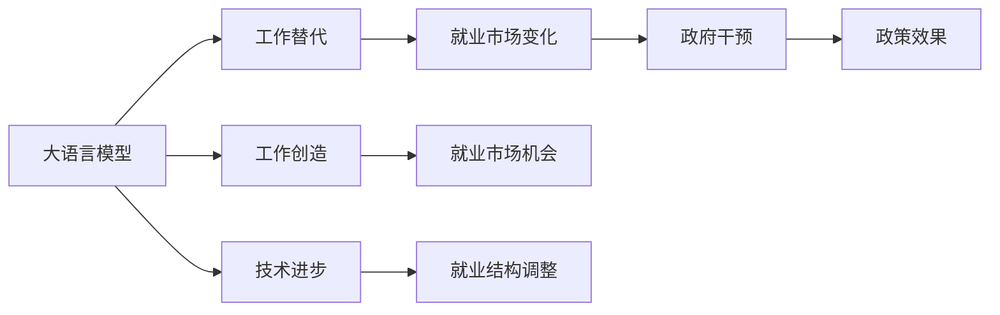

                 

# LLM 对就业市场的影响：工作创造和替代

大语言模型（Large Language Models, LLMs），如GPT-3、BERT等，在自然语言处理（NLP）领域取得了显著的突破，对各行各业产生了深远影响。本文将探讨LLM如何影响就业市场，包括工作创造与替代的具体方式，以及这一变化带来的机遇与挑战。

## 1. 背景介绍

### 1.1 问题由来
随着技术进步，LLMs的性能不断提升，它们不仅在NLP任务上表现出色，还逐步应用于更多领域。由于LLMs的智能化和自动化特性，工作市场正经历着前所未有的变革。

### 1.2 问题核心关键点
1. **工作创造**：LLMs带来的新行业和就业机会。
2. **工作替代**：LLMs取代部分传统工作岗位。
3. **影响评估**：LLMs对不同行业就业的影响差异。
4. **政策建议**：如何应对LLMs带来的就业市场变化。

### 1.3 问题研究意义
深入理解LLMs对就业市场的影响，有助于政府和企业制定合适的政策，促进技术进步与就业稳定并行。它不仅关乎经济和社会发展，还关系到未来劳动力的教育和职业规划。

## 2. 核心概念与联系

### 2.1 核心概念概述

- **大语言模型**：通过大规模无监督学习训练得到的语言模型，具备强大的语言理解和生成能力。
- **工作创造与替代**：LLMs在提升工作效率的同时，也可能替代一些重复性高的工作，同时创造新的工作岗位。
- **就业市场**：劳动者与就业机会的匹配市场，受到技术进步、劳动力供给和需求等多方面因素的影响。
- **技术进步与就业**：技术发展与就业市场之间的复杂关系，既包括工作创造，也包括工作替代。
- **政策干预**：政府对就业市场的干预措施，如教育、培训、劳动法等。

这些核心概念相互交织，共同构成了LLMs对就业市场影响的分析框架。

### 2.2 核心概念原理和架构的 Mermaid 流程图



## 3. 核心算法原理 & 具体操作步骤

### 3.1 算法原理概述
LLMs通过大规模数据训练获得通用语言能力，可以执行多种NLP任务，如文本生成、分类、翻译等。在应用过程中，它们能够提高工作效率，但也可能替代某些工作。

### 3.2 算法步骤详解

1. **数据准备**：收集相关行业的大量文本数据，用于训练和测试。
2. **模型训练**：使用数据训练大语言模型，调整超参数，使其在不同任务上表现优异。
3. **应用场景选择**：选择与就业市场相关的应用场景，如客户服务、数据分析、内容生成等。
4. **性能评估**：在选定场景中评估模型表现，确定其对特定工作的替代能力。
5. **就业市场分析**：分析模型对各行业就业的影响，评估其带来的机会和挑战。

### 3.3 算法优缺点

**优点**：
- 提高工作效率，减少人工错误。
- 应用范围广泛，能够处理复杂任务。
- 节省成本，降低人工劳动强度。

**缺点**：
- 可能替代部分岗位，造成短期失业。
- 需要大量数据和计算资源，初期投入高。
- 技术依赖性强，潜在风险较大。

### 3.4 算法应用领域
LLMs在以下领域的应用对就业市场影响显著：
- **客户服务**：自动化客服系统，减少人工客服需求。
- **数据分析**：自动文本分析，减少人工数据处理工作。
- **内容生成**：自动内容创作，提高内容生产效率。
- **教育培训**：个性化学习推荐，优化教学资源。

## 4. 数学模型和公式 & 详细讲解 & 举例说明

### 4.1 数学模型构建
考虑一个简单的文本分类任务，使用二分类逻辑回归模型，损失函数为交叉熵。模型参数为 $w$ 和 $b$，输入为 $x$，输出为 $y$。模型预测结果 $y' = \sigma(w^T x + b)$，其中 $\sigma$ 为sigmoid函数。

### 4.2 公式推导过程

假设样本总数为 $N$，正样本数为 $N_+$，负样本数为 $N_-$，分类误差为 $E$，则模型损失函数 $L$ 为：

$$ L = -\frac{1}{N} \sum_{i=1}^N [y_i \log y'_i + (1-y_i) \log (1-y'_i)] $$

其中 $y_i \in \{0, 1\}$ 为真实标签，$y'_i = \sigma(w^T x_i + b)$ 为模型预测。

### 4.3 案例分析与讲解
以客户服务为例，假设一个简单的客服文本分类任务，用LLMs训练的模型替代人工客服。模型在训练集上的准确率为85%，在测试集上为82%。如果模型应用于某客户服务中心，每天处理100个客户请求，其中60%为有效请求，40%为无效请求。

1. **训练模型**：使用大量客户服务对话数据训练LLMs，得到分类准确率。
2. **评估效果**：将模型应用于客服中心，评估其准确率和效率。
3. **成本分析**：对比人工客服成本与LLMs运行成本。

## 5. 项目实践：代码实例和详细解释说明

### 5.1 开发环境搭建

1. **安装Python和相关库**：
   - 安装Anaconda，创建虚拟环境
   - 安装TensorFlow、PyTorch、Scikit-learn等库

2. **准备数据集**：
   - 收集客户服务对话数据，进行预处理和标注
   - 使用DataLoader对数据进行批次处理

### 5.2 源代码详细实现

以下是一个简单的文本分类模型实现，使用LLMs进行训练和测试：

```python
import tensorflow as tf
from sklearn.model_selection import train_test_split

# 准备数据
data = load_data()
X_train, X_test, y_train, y_test = train_test_split(data, test_size=0.2)

# 定义模型
model = tf.keras.Sequential([
    tf.keras.layers.Dense(64, activation='relu', input_shape=(X_train.shape[1],)),
    tf.keras.layers.Dense(1, activation='sigmoid')
])

# 编译模型
model.compile(optimizer='adam', loss='binary_crossentropy', metrics=['accuracy'])

# 训练模型
model.fit(X_train, y_train, epochs=10, batch_size=32)

# 评估模型
test_loss, test_acc = model.evaluate(X_test, y_test)
print('Test accuracy:', test_acc)
```

### 5.3 代码解读与分析

- **数据准备**：使用sklearn的train_test_split函数，将数据集分为训练集和测试集。
- **模型定义**：定义一个简单的两层神经网络，使用ReLU激活函数和sigmoid输出层，适应二分类任务。
- **模型编译**：使用adam优化器和二分类交叉熵损失函数，同时监控模型准确率。
- **模型训练**：使用训练集进行模型训练，每批次32个样本，迭代10轮。
- **模型评估**：在测试集上评估模型性能，输出测试集上的准确率。

## 6. 实际应用场景

### 6.1 客户服务
LLMs在客户服务中的应用，能够大幅度提升服务效率和客户满意度。例如，通过自动化客服系统，使用自然语言理解技术，能够24/7不间断提供服务，减少人工客服需求。

### 6.2 数据分析
LLMs在数据分析领域的应用，可以自动化处理大量文本数据，提取有用信息，减少人工工作量。例如，使用自动文本分类技术，对社交媒体数据进行情感分析，获取市场趋势和用户反馈。

### 6.3 内容生成
LLMs在内容生成领域的应用，可以自动生成新闻、文章、报告等内容，提高内容生产效率。例如，使用自动摘要技术，对长文本进行精炼提取，生成简洁摘要。

### 6.4 未来应用展望

未来，LLMs将在更多领域得到应用，推动就业市场进一步变革：
- **自动化办公**：自动处理日常办公文档，减少人工处理工作。
- **个性化推荐**：根据用户行为和偏好，提供个性化内容推荐，优化用户体验。
- **教育培训**：提供个性化学习资源和智能辅导，提升教育效果。

## 7. 工具和资源推荐

### 7.1 学习资源推荐

- **在线课程**：Coursera、edX等平台的NLP相关课程，学习自然语言处理基础和高级技术。
- **书籍**：《自然语言处理综论》、《深度学习与自然语言处理》等书籍，系统学习NLP知识。
- **文档**：LLMs厂商的官方文档，如TensorFlow、PyTorch等，学习模型实现和应用技巧。

### 7.2 开发工具推荐

- **IDE**：PyCharm、Jupyter Notebook等集成开发环境，方便编写和调试代码。
- **数据处理**：Pandas、NumPy等工具，处理和分析大规模文本数据。
- **模型训练**：TensorFlow、PyTorch等深度学习框架，支持模型训练和优化。

### 7.3 相关论文推荐

- **自然语言处理**：Jurafsky和Martin的《自然语言处理综论》，经典教材，涵盖NLP基础知识和前沿技术。
- **机器学习**：Hastie、Tibshirani和Friedman的《机器学习》，系统学习机器学习理论和算法。
- **深度学习**：Goodfellow、Bengio和Courville的《深度学习》，介绍深度学习的基础和高级技术。

## 8. 总结：未来发展趋势与挑战

### 8.1 研究成果总结
- LLMs在提高工作效率和减少人工错误方面具有显著优势。
- 然而，LLMs也可能替代一些重复性高、技术要求低的工作。
- 不同行业对LLMs的应用程度和影响不同。

### 8.2 未来发展趋势
- 技术不断进步，LLMs在更多领域的应用将更加广泛。
- 政府和企业将采取措施，引导技术进步与就业稳定并行。

### 8.3 面临的挑战
- 数据和算力资源的投入是关键，初期成本较高。
- 技术依赖性强，可能带来潜在风险。
- 需要政策引导，确保技术进步对就业市场的影响可控。

### 8.4 研究展望
- 研究如何平衡技术进步与就业稳定，推动社会和谐发展。
- 探索新领域和新应用，发掘新的就业机会。
- 提供教育和培训，提升劳动者技能，适应新技术要求。

## 9. 附录：常见问题与解答

**Q1: 大语言模型会完全取代人类工作吗？**

A: LLMs虽然能处理大量任务，但仍然存在局限性。部分岗位的创造性和复杂度无法完全被机器替代。

**Q2: 如何应对LLMs带来的就业市场变化？**

A: 政府和企业应提供再培训和教育资源，帮助劳动者适应新技术。同时，应制定合理政策，确保技术进步对就业市场的影响可控。

**Q3: LLMs对各行业就业的影响是否相同？**

A: 不同行业对LLMs的应用程度和影响不同。例如，客户服务和数据分析等行业，LLMs的应用将带来显著影响。而创意和创新要求高的行业，LLMs的替代程度较低。

**Q4: LLMs的训练和部署需要哪些资源？**

A: LLMs的训练和部署需要大量数据和算力资源，初期成本较高。政府和企业应提供支持，帮助技术进步与就业稳定并行。

**Q5: 如何确保LLMs的安全和伦理问题？**

A: 制定严格的数据隐私和伦理标准，确保LLMs的安全和公平性。同时，提供监管机制，防止有害内容的输出。

---

作者：禅与计算机程序设计艺术 / Zen and the Art of Computer Programming

