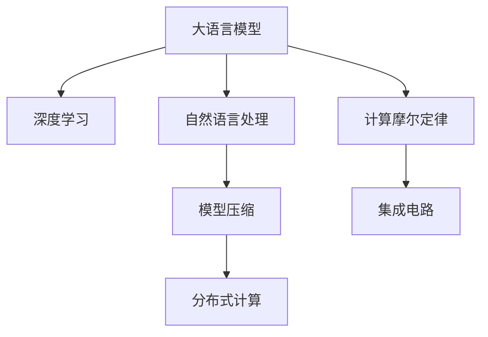

                 

# LLM 未来发展：摩尔定律的延续

> 关键词：
1. 大语言模型(LLM)
2. 自然语言处理(NLP)
3. 深度学习
4. 计算摩尔定律
5. 性能提升
6. 模型压缩
7. 集成电路

## 1. 背景介绍

### 1.1 问题由来

自摩尔定律提出以来，计算机硬件性能的提升主要依赖于半导体工艺的进步和集成电路规模的扩大。然而，在软件层面，特别是人工智能(AI)和自然语言处理(NLP)领域，性能提升同样面临重要挑战。

大语言模型(LLM)作为AI领域的新锐力量，已经在文本生成、问答、翻译等任务中取得了显著进展。但大模型也面临着计算资源密集、模型规模庞大等诸多问题。如何进一步提高其性能，降低计算需求，推动其广泛应用，成为当前研究的焦点。

### 1.2 问题核心关键点

1. **性能瓶颈**：大模型通常具有数十亿甚至数百亿参数，造成推理速度慢，存储占用大，计算资源需求高。
2. **能效优化**：如何在保持模型性能的前提下，降低能耗，提高运行效率。
3. **模型压缩**：如何从大规模模型中提取关键特征，减少不必要的参数，实现性能与资源的双重优化。
4. **分布式计算**：如何利用分布式系统，提高模型训练和推理的速度和效率。
5. **模型迁移**：如何将模型迁移到不同的硬件平台，如GPU、TPU、FPGA等，以提升性能和降低成本。

### 1.3 问题研究意义

研究LLM的未来发展，对于推动AI技术的进步，促进NLP领域的创新应用，具有重要意义：

1. **提升效率**：提高大语言模型的推理效率和计算速度，降低资源消耗，推动AI技术在各行各业的普及应用。
2. **优化能效**：通过优化模型结构，降低能耗，实现环保型AI。
3. **推动应用**：助力大模型在教育、医疗、金融、司法等高需求领域的应用落地。
4. **促进创新**：结合集成电路、量子计算等新兴技术，推动NLP领域的新突破。

## 2. 核心概念与联系

### 2.1 核心概念概述

为更好地理解LLM的发展趋势，本节将介绍几个密切相关的核心概念：

- **大语言模型(LLM)**：以自回归模型如GPT系列或自编码模型如BERT为基础，通过大规模无标签数据预训练获得强大语言能力的模型。
- **自然语言处理(NLP)**：研究如何让计算机理解和生成人类语言的技术。
- **深度学习**：一种模拟人类大脑神经网络的学习方法，在大模型构建中起着核心作用。
- **计算摩尔定律**：每两年计算机性能提高一倍，推动硬件性能不断提升的定律。
- **模型压缩**：通过减少模型参数或结构，在不损失性能的前提下提高模型运行效率的技术。
- **集成电路**：计算机硬件的核心组成部分，决定了大模型的计算性能。
- **分布式计算**：利用多台计算机协同计算，提高模型训练和推理效率的方法。

这些概念之间的逻辑关系可以通过以下Mermaid流程图来展示：



这个流程图展示了大语言模型的核心概念及其之间的关系：

1. 大语言模型通过深度学习获得语言表示。
2. 自然语言处理是研究如何让计算机理解和生成语言的技术。
3. 计算摩尔定律推动了硬件性能的提升，影响大模型的计算能力。
4. 模型压缩优化了大语言模型的资源占用，提升计算效率。
5. 集成电路是硬件的核心，影响大模型的运行速度和能耗。
6. 分布式计算优化了模型的训练和推理过程，提升了计算效率。

这些概念共同构成了大语言模型的发展框架，决定了其未来发展的方向和潜力。

## 3. 核心算法原理 & 具体操作步骤

### 3.1 算法原理概述

大语言模型的性能提升主要依赖于以下几个关键因素：

- **模型压缩**：通过减少模型参数或结构，提升推理效率，降低计算资源需求。
- **分布式计算**：通过多台计算机协同计算，加速模型训练和推理过程。
- **计算优化**：通过算法优化，降低模型能耗，提高计算效率。

### 3.2 算法步骤详解

基于这些关键因素，大语言模型的未来发展大致可以划分为以下几个步骤：

**Step 1: 模型压缩**

模型压缩是大语言模型性能提升的核心步骤。主要方法包括：

- **参数剪枝**：通过剪除不重要的参数，减少模型规模。
- **量化**：将浮点参数转化为定点参数，减小存储占用和计算量。
- **结构优化**：优化模型结构，如使用更少的层、更小的神经元。

**Step 2: 分布式计算**

分布式计算可以显著提升大语言模型的训练和推理效率，主要步骤包括：

- **数据并行**：利用多个GPU或TPU并行计算，加速模型训练。
- **模型并行**：将大模型拆分成多个子模型，在多台机器上并行计算。
- **通信优化**：减少不同机器之间的数据传输，提高计算效率。

**Step 3: 计算优化**

计算优化旨在进一步降低模型能耗，提高计算效率，主要方法包括：

- **低能耗架构**：设计低功耗的集成电路，提升硬件效率。
- **算法优化**：采用高效的计算算法，如矩阵乘法加速、卷积优化等。
- **混合精度**：使用混合精度计算，提升计算效率。

**Step 4: 集成多模态信息**

大语言模型的未来发展还应融合多模态信息，提升其对现实世界的理解和建模能力。主要方法包括：

- **视觉信息融合**：将视觉信息与文本信息结合，提高模型对图像的理解能力。
- **语音信息融合**：将语音信息与文本信息结合，提升模型的语音识别和生成能力。
- **知识图谱结合**：将知识图谱与语言模型结合，提高模型的常识推理能力。

### 3.3 算法优缺点

大语言模型的未来发展具有以下优点：

1. **性能提升**：通过模型压缩、分布式计算和计算优化，显著提升大语言模型的推理效率和计算速度。
2. **资源节省**：通过压缩参数和优化计算，降低模型的能耗和存储需求。
3. **应用拓展**：结合多模态信息，拓展大语言模型在更多领域的应用，如教育、医疗、司法等。
4. **环保推动**：通过提高计算效率，推动绿色AI的发展。

同时，也存在一些局限：

1. **复杂性增加**：模型压缩和分布式计算增加了模型实现的复杂性，需要更高的技术水平。
2. **计算成本高**：分布式计算和计算优化需要较高的硬件资源，初期投资大。
3. **模型泛化性**：过多的参数压缩和结构优化可能导致模型泛化性能下降。
4. **数据依赖**：多模态信息融合需要大量的高质量标注数据，数据获取成本高。

尽管如此，大语言模型的未来发展前景依然广阔，通过不断技术创新和优化，其性能和应用能力将不断提升。

### 3.4 算法应用领域

大语言模型的未来发展将广泛应用在以下几个领域：

- **自然语言处理(NLP)**：在文本生成、问答、翻译、摘要、情感分析等任务上，提高模型效率和性能。
- **智能交互**：构建智能客服、对话系统、语音助手等应用，提升人机交互体验。
- **医疗健康**：辅助医生诊断、病历分析、药物研发等医疗任务，提高医疗服务质量。
- **金融服务**：提供智能投资、风险评估、客户服务等金融应用，提升金融服务的智能化水平。
- **教育培训**：构建个性化学习平台、智能辅导系统、在线课程等，提升教育效果和效率。
- **司法领域**：提供法律咨询、案件分析、证据生成等司法应用，提升司法效率和公正性。

## 4. 数学模型和公式 & 详细讲解 & 举例说明

### 4.1 数学模型构建

为了更好地理解大语言模型的未来发展，本节将介绍几个关键的数学模型：

**LSTM模型**：

LSTM（长短期记忆网络）是一种常见的循环神经网络，在大语言模型的文本生成任务中得到广泛应用。LSTM模型通过门控机制，有效地解决了传统RNN在长期依赖关系建模中的问题。其基本结构包括输入门、遗忘门和输出门，通过这些门控制信息的流动，从而提升模型的记忆能力。

**Transformer模型**：

Transformer模型是目前最先进的序列建模方法之一，已被广泛应用于大语言模型的构建。Transformer模型采用自注意力机制，能够有效捕捉序列中的长距离依赖关系。其主要结构包括多头自注意力层、前馈神经网络层和残差连接层，通过这些组件实现高效的序列建模。

**注意力机制**：

注意力机制是Transformer模型的核心，能够根据输入序列中每个位置的权重，动态地选择并关注不同的信息。在文本生成任务中，注意力机制可以帮助模型根据上下文信息，生成更加连贯和流畅的文本。

### 4.2 公式推导过程

以下将对LSTM和Transformer模型的基本结构进行简要推导：

**LSTM模型**：

LSTM模型通过门控机制控制信息的流动，其基本公式如下：

$$
\begin{aligned}
i_t &= \sigma(W_i h_{t-1} + U_i x_t + b_i) \\
f_t &= \sigma(W_f h_{t-1} + U_f x_t + b_f) \\
o_t &= \sigma(W_o h_{t-1} + U_o x_t + b_o) \\
g_t &= \tanh(W_g h_{t-1} + U_g x_t + b_g) \\
c_t &= f_t \odot c_{t-1} + i_t \odot g_t \\
h_t &= o_t \odot \tanh(c_t)
\end{aligned}
$$

其中，$\sigma$为激活函数，$\odot$为向量点积，$h_t$为当前时间步的输出。

**Transformer模型**：

Transformer模型主要采用多头自注意力机制和前馈神经网络，其基本结构如下：

$$
\begin{aligned}
Q &= V^T K \\
A &= \text{softmax}(Q) \\
U &= A V \\
h &= \text{ReLU}(U) \\
\end{aligned}
$$

其中，$Q$为查询向量，$K$为键向量，$V$为值向量，$A$为注意力权重矩阵，$U$为注意力矩阵，$h$为最终输出向量。

### 4.3 案例分析与讲解

以BERT模型为例，分析其在微调任务中的应用：

**BERT模型**：

BERT模型采用双向语言模型和掩码预测，通过预训练学习语言知识。其基本结构如下：

$$
\begin{aligned}
h &= \text{BERT}_{\theta}(x)
\end{aligned}
$$

其中，$h$为BERT模型的输出向量，$x$为输入文本。

**微调应用**：

在微调任务中，我们可以通过添加特定的输出层和损失函数，对BERT模型进行微调，使其适应特定的下游任务。例如，在文本分类任务中，我们可以添加全连接层和交叉熵损失函数，对BERT模型进行微调，使其能够准确分类文本。

## 5. 项目实践：代码实例和详细解释说明

### 5.1 开发环境搭建

在进行大语言模型未来发展的实践前，我们需要准备好开发环境。以下是使用Python进行TensorFlow开发的环境配置流程：

1. 安装Anaconda：从官网下载并安装Anaconda，用于创建独立的Python环境。

2. 创建并激活虚拟环境：
```bash
conda create -n tf-env python=3.8 
conda activate tf-env
```

3. 安装TensorFlow：根据CUDA版本，从官网获取对应的安装命令。例如：
```bash
conda install tensorflow=2.6
```

4. 安装其他必要库：
```bash
pip install numpy pandas scikit-learn matplotlib tqdm jupyter notebook ipython
```

完成上述步骤后，即可在`tf-env`环境中开始开发实践。

### 5.2 源代码详细实现

下面我以BERT模型在文本分类任务中的应用为例，给出使用TensorFlow进行微调的PyTorch代码实现。

首先，定义文本分类任务的数据处理函数：

```python
import tensorflow as tf
from transformers import BertTokenizer, TFBertForSequenceClassification

# 定义数据处理函数
def create_datasets(texts, labels, tokenizer, max_len=128):
    tokenizer = BertTokenizer.from_pretrained('bert-base-uncased')

    train_dataset = tf.data.Dataset.from_tensor_slices((texts, labels))
    train_dataset = train_dataset.shuffle(buffer_size=1024).batch(batch_size=16)

    test_dataset = tf.data.Dataset.from_tensor_slices((texts, labels))
    test_dataset = test_dataset.batch(batch_size=16)

    return train_dataset, test_dataset
```

然后，定义模型和优化器：

```python
# 定义模型和优化器
model = TFBertForSequenceClassification.from_pretrained('bert-base-uncased', num_labels=2, hidden_size=768)

optimizer = tf.keras.optimizers.Adam(learning_rate=2e-5)
```

接着，定义训练和评估函数：

```python
# 定义训练函数
@tf.function
def train_step(inputs, labels):
    with tf.GradientTape() as tape:
        outputs = model(inputs['input_ids'], attention_mask=inputs['attention_mask'], labels=labels)
        loss = outputs.loss
    gradients = tape.gradient(loss, model.trainable_variables)
    optimizer.apply_gradients(zip(gradients, model.trainable_variables))
    return loss

# 定义评估函数
@tf.function
def evaluate_step(inputs, labels):
    outputs = model(inputs['input_ids'], attention_mask=inputs['attention_mask'], labels=labels)
    loss = outputs.loss
    predictions = outputs.logits.numpy()
    labels = labels.numpy()
    return loss, predictions, labels
```

最后，启动训练流程并在测试集上评估：

```python
# 加载数据集
train_dataset, test_dataset = create_datasets(train_texts, train_labels, tokenizer, max_len=128)

# 设置超参数
batch_size = 16
epochs = 5

# 训练模型
for epoch in range(epochs):
    total_loss = 0
    for inputs, labels in train_dataset:
        loss = train_step(inputs, labels)
        total_loss += loss.numpy()

    # 评估模型
    losses, predictions, labels = [], [], []
    for inputs, labels in test_dataset:
        loss, pred, true_labels = evaluate_step(inputs, labels)
        losses.append(loss.numpy())
        predictions.append(pred.numpy())
        labels.append(true_labels.numpy())

    # 计算平均损失
    train_loss = total_loss / len(train_dataset)
    test_loss = sum(losses) / len(test_dataset)

    print(f"Epoch {epoch+1}, train loss: {train_loss:.3f}, test loss: {test_loss:.3f}")
```

以上就是使用TensorFlow对BERT模型进行文本分类任务微调的完整代码实现。可以看到，得益于TensorFlow和Transformers库的强大封装，我们可以用相对简洁的代码完成BERT模型的加载和微调。

### 5.3 代码解读与分析

让我们再详细解读一下关键代码的实现细节：

**create_datasets函数**：
- 定义数据处理函数，将文本和标签转化为模型所需的输入格式。
- 使用BERT分词器对文本进行分词和编码。
- 将编码后的文本和标签作为输入，通过Batch和Shuffle操作，构建TensorFlow数据集。

**模型定义和优化器设置**：
- 使用TFBertForSequenceClassification类加载预训练模型和输出层。
- 设置Adam优化器，并指定学习率。

**训练和评估函数**：
- 定义训练函数，使用tf.GradientTape自动计算梯度并应用优化器。
- 定义评估函数，使用tf.function优化计算图，返回损失、预测和标签。

**训练流程**：
- 加载数据集，设置超参数。
- 循环迭代epoch，在每个epoch内遍历训练集和测试集。
- 在训练集上进行前向传播和反向传播，计算损失并更新模型参数。
- 在测试集上评估模型性能，输出训练和测试损失。

可以看到，TensorFlow配合Transformers库使得BERT微调的代码实现变得简洁高效。开发者可以将更多精力放在数据处理、模型改进等高层逻辑上，而不必过多关注底层的实现细节。

当然，工业级的系统实现还需考虑更多因素，如模型的保存和部署、超参数的自动搜索、更灵活的任务适配层等。但核心的微调范式基本与此类似。

## 6. 实际应用场景

### 6.1 智能客服系统

大语言模型的未来发展，将在智能客服系统构建中发挥重要作用。传统客服往往需要配备大量人力，高峰期响应缓慢，且一致性和专业性难以保证。而使用微调后的对话模型，可以7x24小时不间断服务，快速响应客户咨询，用自然流畅的语言解答各类常见问题。

在技术实现上，可以收集企业内部的历史客服对话记录，将问题和最佳答复构建成监督数据，在此基础上对预训练对话模型进行微调。微调后的对话模型能够自动理解用户意图，匹配最合适的答案模板进行回复。对于客户提出的新问题，还可以接入检索系统实时搜索相关内容，动态组织生成回答。如此构建的智能客服系统，能大幅提升客户咨询体验和问题解决效率。

### 6.2 金融舆情监测

金融机构需要实时监测市场舆论动向，以便及时应对负面信息传播，规避金融风险。传统的人工监测方式成本高、效率低，难以应对网络时代海量信息爆发的挑战。基于大语言模型微调的文本分类和情感分析技术，为金融舆情监测提供了新的解决方案。

具体而言，可以收集金融领域相关的新闻、报道、评论等文本数据，并对其进行主题标注和情感标注。在此基础上对预训练语言模型进行微调，使其能够自动判断文本属于何种主题，情感倾向是正面、中性还是负面。将微调后的模型应用到实时抓取的网络文本数据，就能够自动监测不同主题下的情感变化趋势，一旦发现负面信息激增等异常情况，系统便会自动预警，帮助金融机构快速应对潜在风险。

### 6.3 个性化推荐系统

当前的推荐系统往往只依赖用户的历史行为数据进行物品推荐，无法深入理解用户的真实兴趣偏好。基于大语言模型微调技术，个性化推荐系统可以更好地挖掘用户行为背后的语义信息，从而提供更精准、多样的推荐内容。

在实践中，可以收集用户浏览、点击、评论、分享等行为数据，提取和用户交互的物品标题、描述、标签等文本内容。将文本内容作为模型输入，用户的后续行为（如是否点击、购买等）作为监督信号，在此基础上微调预训练语言模型。微调后的模型能够从文本内容中准确把握用户的兴趣点。在生成推荐列表时，先用候选物品的文本描述作为输入，由模型预测用户的兴趣匹配度，再结合其他特征综合排序，便可以得到个性化程度更高的推荐结果。

### 6.4 未来应用展望

随着大语言模型微调技术的发展，其在更多领域的应用前景将更加广阔。

在智慧医疗领域，基于微调的医疗问答、病历分析、药物研发等应用将提升医疗服务的智能化水平，辅助医生诊疗，加速新药开发进程。

在智能教育领域，微调技术可应用于作业批改、学情分析、知识推荐等方面，因材施教，促进教育公平，提高教学质量。

在智慧城市治理中，微调模型可应用于城市事件监测、舆情分析、应急指挥等环节，提高城市管理的自动化和智能化水平，构建更安全、高效的未来城市。

此外，在企业生产、社会治理、文娱传媒等众多领域，基于大模型微调的人工智能应用也将不断涌现，为NLP技术带来了全新的突破。相信随着预训练语言模型和微调方法的持续演进，NLP技术必将在更广阔的应用领域大放异彩。

## 7. 工具和资源推荐

### 7.1 学习资源推荐

为了帮助开发者系统掌握大语言模型微调的理论基础和实践技巧，这里推荐一些优质的学习资源：

1. 《深度学习入门》系列博文：由大模型技术专家撰写，深入浅出地介绍了深度学习的基本概念和实践方法。
2. CS231n《深度学习视觉表示》课程：斯坦福大学开设的深度学习经典课程，涉及图像处理和计算机视觉任务。
3. 《Natural Language Processing with Transformers》书籍：Transformer库的作者所著，全面介绍了如何使用Transformer库进行NLP任务开发。
4. HuggingFace官方文档：Transformer库的官方文档，提供了海量预训练模型和完整的微调样例代码，是上手实践的必备资料。
5. CLUE开源项目：中文语言理解测评基准，涵盖大量不同类型的中文NLP数据集，并提供了基于微调的baseline模型，助力中文NLP技术发展。

通过对这些资源的学习实践，相信你一定能够快速掌握大语言模型微调的精髓，并用于解决实际的NLP问题。

### 7.2 开发工具推荐

高效的开发离不开优秀的工具支持。以下是几款用于大语言模型微调开发的常用工具：

1. PyTorch：基于Python的开源深度学习框架，灵活动态的计算图，适合快速迭代研究。大部分预训练语言模型都有PyTorch版本的实现。
2. TensorFlow：由Google主导开发的开源深度学习框架，生产部署方便，适合大规模工程应用。同样有丰富的预训练语言模型资源。
3. Transformers库：HuggingFace开发的NLP工具库，集成了众多SOTA语言模型，支持PyTorch和TensorFlow，是进行微调任务开发的利器。
4. Weights & Biases：模型训练的实验跟踪工具，可以记录和可视化模型训练过程中的各项指标，方便对比和调优。与主流深度学习框架无缝集成。
5. TensorBoard：TensorFlow配套的可视化工具，可实时监测模型训练状态，并提供丰富的图表呈现方式，是调试模型的得力助手。

合理利用这些工具，可以显著提升大语言模型微调任务的开发效率，加快创新迭代的步伐。

### 7.3 相关论文推荐

大语言模型和微调技术的发展源于学界的持续研究。以下是几篇奠基性的相关论文，推荐阅读：

1. Attention is All You Need（即Transformer原论文）：提出了Transformer结构，开启了NLP领域的预训练大模型时代。
2. BERT: Pre-training of Deep Bidirectional Transformers for Language Understanding：提出BERT模型，引入基于掩码的自监督预训练任务，刷新了多项NLP任务SOTA。
3. Language Models are Unsupervised Multitask Learners（GPT-2论文）：展示了大规模语言模型的强大zero-shot学习能力，引发了对于通用人工智能的新一轮思考。
4. Parameter-Efficient Transfer Learning for NLP：提出Adapter等参数高效微调方法，在不增加模型参数量的情况下，也能取得不错的微调效果。
5. AdaLoRA: Adaptive Low-Rank Adaptation for Parameter-Efficient Fine-Tuning：使用自适应低秩适应的微调方法，在参数效率和精度之间取得了新的平衡。
6. Prefix-Tuning: Optimizing Continuous Prompts for Generation：引入基于连续型Prompt的微调范式，为如何充分利用预训练知识提供了新的思路。

这些论文代表了大语言模型微调技术的发展脉络。通过学习这些前沿成果，可以帮助研究者把握学科前进方向，激发更多的创新灵感。

## 8. 总结：未来发展趋势与挑战

### 8.1 总结

本文对基于大语言模型的未来发展进行了全面系统的介绍。首先阐述了大语言模型的性能瓶颈和未来提升方向，明确了模型压缩、分布式计算和计算优化在提升性能方面的重要性。其次，从原理到实践，详细讲解了大语言模型的未来发展步骤和关键方法。同时，本文还广泛探讨了大语言模型在未来应用场景中的广泛前景，展示了其巨大潜力。最后，本文精选了相关学习资源，力求为读者提供全方位的技术指引。

通过本文的系统梳理，可以看到，大语言模型的未来发展前景广阔，通过不断技术创新和优化，其性能和应用能力将不断提升。

### 8.2 未来发展趋势

展望未来，大语言模型的发展将呈现以下几个趋势：

1. **模型规模持续增大**：随着算力成本的下降和数据规模的扩张，预训练语言模型的参数量还将持续增长。超大规模语言模型蕴含的丰富语言知识，有望支撑更加复杂多变的下游任务微调。
2. **模型压缩和计算优化**：通过模型压缩和计算优化，降低模型能耗，提高推理效率。
3. **分布式计算和集成电路**：利用分布式计算和低能耗集成电路，提升模型训练和推理速度。
4. **多模态融合**：结合视觉、语音等多模态信息，提升语言模型的泛化能力和理解深度。
5. **因果学习和知识图谱**：引入因果学习、知识图谱等方法，增强语言模型的推理能力和知识整合能力。

### 8.3 面临的挑战

尽管大语言模型的未来发展前景广阔，但在迈向更加智能化、普适化应用的过程中，仍面临诸多挑战：

1. **数据获取难度**：大规模标注数据的获取成本高，难以满足微调模型的需求。
2. **模型鲁棒性不足**：在特定任务上的微调可能未能充分覆盖所有情况，导致模型泛化性能下降。
3. **计算资源瓶颈**：大模型训练和推理对计算资源的需求高，初期投资大。
4. **模型可解释性差**：大模型通常被视为"黑盒"系统，难以解释其内部工作机制和决策逻辑。
5. **伦理和安全性问题**：模型可能学习到有害信息，导致伦理和安全问题。

尽管如此，通过不断技术创新和优化，这些挑战有望得到逐步克服，大语言模型将在构建人机协同的智能时代中扮演越来越重要的角色。

### 8.4 研究展望

面向未来，大语言模型的研究需要在以下几个方面寻求新的突破：

1. **数据增强和生成式微调**：利用数据增强和生成式微调方法，提升模型的泛化能力和鲁棒性。
2. **多任务学习和迁移学习**：结合多任务学习和迁移学习，提升模型在多个任务上的性能。
3. **自监督学习和无监督学习**：探索无监督学习和自监督学习的方法，提升模型对数据的利用效率。
4. **知识表示和推理**：结合知识图谱、逻辑规则等专家知识，提升模型的推理能力和知识整合能力。
5. **因果学习和博弈论**：引入因果学习和博弈论工具，增强模型的决策逻辑和稳定性。
6. **伦理和安全性约束**：在模型训练和应用中引入伦理导向的评估指标，保障数据和模型安全。

这些研究方向将引领大语言模型微调技术迈向更高的台阶，为构建安全、可靠、可解释、可控的智能系统铺平道路。面向未来，大语言模型微调技术还需要与其他人工智能技术进行更深入的融合，如知识表示、因果推理、强化学习等，多路径协同发力，共同推动NLP领域的新突破。

## 9. 附录：常见问题与解答

**Q1：大语言模型微调是否适用于所有NLP任务？**

A: 大语言模型微调在大多数NLP任务上都能取得不错的效果，特别是对于数据量较小的任务。但对于一些特定领域的任务，如医学、法律等，仅仅依靠通用语料预训练的模型可能难以很好地适应。此时需要在特定领域语料上进一步预训练，再进行微调，才能获得理想效果。此外，对于一些需要时效性、个性化很强的任务，如对话、推荐等，微调方法也需要针对性的改进优化。

**Q2：微调过程中如何选择合适的学习率？**

A: 微调的学习率一般要比预训练时小1-2个数量级，如果使用过大的学习率，容易破坏预训练权重，导致过拟合。一般建议从1e-5开始调参，逐步减小学习率，直至收敛。也可以使用warmup策略，在开始阶段使用较小的学习率，再逐渐过渡到预设值。需要注意的是，不同的优化器(如AdamW、Adafactor等)以及不同的学习率调度策略，可能需要设置不同的学习率阈值。

**Q3：采用大模型微调时会面临哪些资源瓶颈？**

A: 目前主流的预训练大模型动辄以亿计的参数规模，对算力、内存、存储都提出了很高的要求。GPU/TPU等高性能设备是必不可少的，但即便如此，超大批次的训练和推理也可能遇到显存不足的问题。因此需要采用一些资源优化技术，如梯度积累、混合精度训练、模型并行等，来突破硬件瓶颈。同时，模型的存储和读取也可能占用大量时间和空间，需要采用模型压缩、稀疏化存储等方法进行优化。

**Q4：如何缓解微调过程中的过拟合问题？**

A: 过拟合是微调面临的主要挑战，尤其是在标注数据不足的情况下。常见的缓解策略包括：
1. 数据增强：通过回译、近义替换等方式扩充训练集
2. 正则化：使用L2正则、Dropout、Early Stopping等避免过拟合
3. 对抗训练：引入对抗样本，提高模型鲁棒性
4. 参数高效微调：只调整少量参数(如Adapter、Prefix等)，减小过拟合风险
5. 多模型集成：训练多个微调模型，取平均输出，抑制过拟合

这些策略往往需要根据具体任务和数据特点进行灵活组合。只有在数据、模型、训练、推理等各环节进行全面优化，才能最大限度地发挥大模型微调的威力。

**Q5：微调模型在落地部署时需要注意哪些问题？**

A: 将微调模型转化为实际应用，还需要考虑以下因素：
1. 模型裁剪：去除不必要的层和参数，减小模型尺寸，加快推理速度
2. 量化加速：将浮点模型转为定点模型，压缩存储空间，提高计算效率
3. 服务化封装：将模型封装为标准化服务接口，便于集成调用
4. 弹性伸缩：根据请求流量动态调整资源配置，平衡服务质量和成本
5. 监控告警：实时采集系统指标，设置异常告警阈值，确保服务稳定性
6. 安全防护：采用访问鉴权、数据脱敏等措施，保障数据和模型安全

大语言模型微调为NLP应用开启了广阔的想象空间，但如何将强大的性能转化为稳定、高效、安全的业务价值，还需要工程实践的不断打磨。唯有从数据、算法、工程、业务等多个维度协同发力，才能真正实现人工智能技术在垂直行业的规模化落地。总之，微调需要开发者根据具体任务，不断迭代和优化模型、数据和算法，方能得到理想的效果。

---

作者：禅与计算机程序设计艺术 / Zen and the Art of Computer Programming

