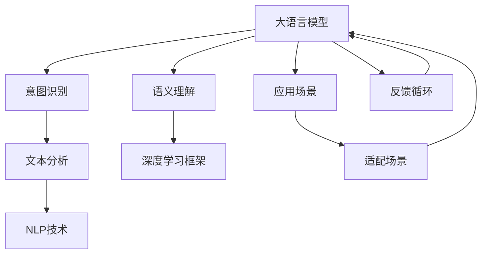

                 

# LLM与人类意图的最佳契合

> 关键词：大语言模型,意图识别,语义理解,深度学习,自然语言处理

## 1. 背景介绍

### 1.1 问题由来

随着人工智能技术的发展，大语言模型(LLM, Large Language Model)已成为自然语言处理(NLP, Natural Language Processing)领域的一项革命性突破。这些模型通过在海量文本数据上的自监督预训练，逐渐掌握了丰富的语言知识和语义理解能力。它们可以理解自然语言的多种句式和语义，生成流畅、连贯的文本，并在各种NLP任务上取得了显著的进展。

然而，尽管大语言模型的表现令人印象深刻，它们仍存在一些显著的局限性。特别是在处理人类意图时，模型往往难以准确理解和响应复杂的语义信息。这主要归因于模型对语义理解深度的不足，以及缺乏对上下文和背景知识的全面理解。

为了解决这个问题，研究者们提出了各种方法，包括微调、指令调整、上下文增强等。这些技术虽然有所帮助，但在实际应用中仍存在效率低、泛化能力有限等问题。因此，探索一种能够精确捕捉人类意图，并在此基础上生成高质量回复的模型成为当前研究的热点。

### 1.2 问题核心关键点

本文旨在探讨如何使大语言模型更好地契合人类意图，具体包括以下几个核心关键点：

- **意图识别**：理解文本中的意图，即作者或说话者的目的、需求或情感。
- **语义理解**：准确捕捉文本中的语义信息，包括词汇、句法结构、上下文关系等。
- **深度学习框架**：利用深度学习算法，通过端到端的训练和优化，提升模型的理解和生成能力。
- **自然语言处理(NLP)**：结合NLP技术，提升模型的文本处理和理解能力。
- **应用场景**：在不同的应用场景中，模型需要具备适应特定任务的能力。

这些核心关键点构成了本文的研究基础，本文将围绕这些方面深入探讨。

## 2. 核心概念与联系

### 2.1 核心概念概述

为更好地理解大语言模型如何契合人类意图，本文将介绍几个核心概念：

- **大语言模型(LLM)**：如BERT、GPT-3等，通过预训练学习大规模语言表示，具备强大的语言生成和理解能力。
- **意图识别**：通过文本分析，识别出用户或作者的意图，例如购买请求、信息查询、情感表达等。
- **语义理解**：理解文本中的深层语义，包括词汇、句法和上下文关系，从而更准确地捕捉用户意图。
- **深度学习框架**：如TensorFlow、PyTorch等，提供了高效计算和模型训练的能力。
- **自然语言处理(NLP)**：包括文本预处理、语义分析、实体识别、情感分析等技术。
- **应用场景**：如客服对话、智能助手、金融咨询、医疗咨询等，具体应用需求各异。

这些概念之间的联系可以通过以下Mermaid流程图来展示：



这个流程图展示了各个核心概念之间的联系和互动：

1. 大语言模型通过预训练学习通用语言表示，为意图识别和语义理解提供基础。
2. 意图识别和语义理解分别通过文本分析和NLP技术，精准捕捉用户意图。
3. 深度学习框架提供高效的计算和训练能力，支持模型优化。
4. 应用场景的需求通过适配和反馈循环，进一步指导模型优化。

## 3. 核心算法原理 & 具体操作步骤

### 3.1 算法原理概述

大语言模型与人类意图的最佳契合，核心在于如何使模型准确捕捉文本中的意图，并在此基础上生成高质量的回复。其算法原理主要包括以下几个步骤：

1. **预训练与微调**：使用大规模无标签数据进行预训练，然后使用小规模标注数据进行微调，提升模型的特定任务性能。
2. **意图表示学习**：通过学习意图向量，使模型能够理解文本中隐藏的意图信息。
3. **上下文增强**：在生成回复时，引入上下文信息，提升模型对语境的适应能力。
4. **多任务学习**：通过同时训练多个相关任务，提升模型的泛化能力和鲁棒性。
5. **持续学习**：通过不断接收新数据，模型能够持续学习，更新知识库。

### 3.2 算法步骤详解

**步骤1：预训练与微调**

- 选择合适的大语言模型，如BERT、GPT等，进行预训练。
- 收集标注数据，如对话数据、问答数据等，用于微调。
- 设计损失函数，如交叉熵损失，进行有监督微调。
- 设置合适的超参数，如学习率、批大小、迭代轮数等。
- 训练模型，逐步更新参数，最小化损失函数。

**步骤2：意图表示学习**

- 定义意图类别，如购买、咨询、投诉等。
- 收集标注数据，标注每条文本的意图类别。
- 设计意图向量，捕捉文本中的意图信息。
- 通过意图向量训练模型，学习意图表示。
- 使用意图向量进行文本分类，识别文本意图。

**步骤3：上下文增强**

- 引入上下文信息，如对话历史、场景描述等。
- 设计上下文表示，捕捉上下文中的关键信息。
- 在生成回复时，结合上下文表示和意图向量，生成更符合用户意图的回复。
- 通过上下文增强提升模型的生成质量。

**步骤4：多任务学习**

- 设计多个相关任务，如问答、对话生成等。
- 同时训练多个任务，提升模型的泛化能力。
- 通过任务组合训练，提升模型的鲁棒性。

**步骤5：持续学习**

- 定期收集新数据，用于模型的持续学习。
- 通过在线学习，不断更新模型知识库。
- 通过反馈机制，调整模型参数，优化模型性能。

### 3.3 算法优缺点

**优点**：

- 能够准确捕捉人类意图，生成高质量回复。
- 可以应用于各种NLP任务，提升模型性能。
- 具有较强的泛化能力和鲁棒性，适应不同应用场景。
- 能够持续学习新数据，不断更新模型知识库。

**缺点**：

- 需要大量标注数据，收集和标注成本高。
- 模型复杂度较高，训练和推理速度较慢。
- 对模型结构和超参数选择依赖较大，优化难度较高。

### 3.4 算法应用领域

基于大语言模型的意图识别技术，可以应用于以下几个领域：

1. **智能客服**：通过理解用户的意图，生成个性化回复，提升客户体验。
2. **智能助手**：帮助用户解决问题，提供信息查询、日程管理等服务。
3. **金融咨询**：分析用户需求，提供个性化的金融咨询建议。
4. **医疗咨询**：根据用户的健康问题，生成专业的医疗建议。
5. **在线教育**：根据学生的学习情况，提供个性化的学习建议和资源推荐。
6. **智能营销**：分析用户行为，提供精准的广告和营销策略。

这些应用场景展示了意图识别技术在大语言模型中的应用潜力，未来有望在更多领域得到推广和应用。

## 4. 数学模型和公式 & 详细讲解 & 举例说明

### 4.1 数学模型构建

假设大语言模型为 $M_{\theta}$，其中 $\theta$ 为模型参数。对于一条输入文本 $x$，模型生成一个向量 $z$ 表示其意图，向量 $z$ 的每个维度对应一个意图类别。意图识别问题可以表示为分类问题，目标是最大化 $z$ 属于正确意图的概率 $p(z|x)$。

### 4.2 公式推导过程

**意图表示学习**：

- 假设 $z$ 为意图向量，通过训练学习意图表示。
- 使用softmax函数将意图向量映射到意图类别分布，得到概率 $p(z|x)$。
- 意图分类问题可以表示为：

$$
\max_{z} p(z|x) = \max_{z} \frac{e^{z^T s(x)}}{\sum_{z'} e^{z'^T s(x)}}
$$

其中 $s(x)$ 为输入文本 $x$ 的语义表示，可以是一个预训练模型，如BERT。

**上下文增强**：

- 引入上下文信息 $c$，与意图向量 $z$ 拼接，生成新的意图向量 $z'$。
- 上下文增强后的意图分类问题可以表示为：

$$
\max_{z'} p(z'|x,c) = \max_{z'} \frac{e^{z'^T s(x,c)}}{\sum_{z''} e^{z''^T s(x,c)}}
$$

其中 $s(x,c)$ 为带有上下文信息的语义表示，可以通过拼接或注意力机制等方法获得。

**多任务学习**：

- 设计多个相关任务 $T_1, T_2, ..., T_n$，每个任务对应一个损失函数 $L_i$。
- 通过多任务学习，最小化所有任务的总损失 $L = \sum_i L_i$。
- 多任务学习可以表示为：

$$
\min_{\theta} L = \sum_i \frac{1}{N_i} \sum_{j=1}^{N_i} \ell_i(x_j)
$$

其中 $N_i$ 为任务 $T_i$ 的样本数，$\ell_i$ 为任务 $T_i$ 的损失函数。

### 4.3 案例分析与讲解

假设我们有一个智能客服系统，需要理解用户的意图并提供相应的回复。我们可以使用BERT模型进行预训练，然后在标注数据上进行微调，学习意图表示。

1. **意图表示学习**：
   - 收集客服对话数据，标注每个对话的意图类别。
   - 使用BERT模型生成对话文本的语义表示。
   - 通过softmax函数将意图向量映射到意图类别分布，得到每个意图的概率。
   - 选择概率最高的意图作为对话的意图。

2. **上下文增强**：
   - 引入对话历史作为上下文信息。
   - 将对话历史拼接或使用注意力机制生成上下文表示。
   - 在生成回复时，结合上下文表示和意图向量，生成更符合用户意图的回复。

3. **多任务学习**：
   - 设计多个相关任务，如问题回答、常见问题解答等。
   - 同时训练这些任务，提升模型的泛化能力和鲁棒性。
   - 通过任务组合训练，优化模型性能。

## 5. 项目实践：代码实例和详细解释说明

### 5.1 开发环境搭建

在进行项目实践前，我们需要准备好开发环境。以下是使用Python进行TensorFlow开发的环境配置流程：

1. 安装Anaconda：从官网下载并安装Anaconda，用于创建独立的Python环境。

2. 创建并激活虚拟环境：
```bash
conda create -n tf-env python=3.8 
conda activate tf-env
```

3. 安装TensorFlow：根据CUDA版本，从官网获取对应的安装命令。例如：
```bash
conda install tensorflow=2.6 -c conda-forge
```

4. 安装各类工具包：
```bash
pip install numpy pandas scikit-learn matplotlib tqdm jupyter notebook ipython
```

完成上述步骤后，即可在`tf-env`环境中开始项目实践。

### 5.2 源代码详细实现

下面我们以智能客服系统为例，给出使用TensorFlow进行意图识别的PyTorch代码实现。

首先，定义意图分类任务的数据处理函数：

```python
from transformers import BertTokenizer
from tensorflow.keras.preprocessing.text import Tokenizer
from tensorflow.keras.preprocessing.sequence import pad_sequences

class IntentDataset:
    def __init__(self, texts, tags, tokenizer, max_len=128):
        self.texts = texts
        self.tags = tags
        self.tokenizer = tokenizer
        self.max_len = max_len
        
    def __len__(self):
        return len(self.texts)
    
    def __getitem__(self, item):
        text = self.texts[item]
        tags = self.tags[item]
        
        encoding = self.tokenizer(text, return_tensors='tf', max_length=self.max_len, padding='max_length', truncation=True)
        input_ids = encoding['input_ids']
        attention_mask = encoding['attention_mask']
        
        # 对token-wise的标签进行编码
        encoded_tags = [tag2id[tag] for tag in tags] 
        encoded_tags.extend([tag2id['O']] * (self.max_len - len(encoded_tags)))
        labels = pad_sequences([encoded_tags], maxlen=self.max_len, padding='post', truncating='post', value=0)[0]
        
        return {'input_ids': input_ids.numpy(), 
                'attention_mask': attention_mask.numpy(),
                'labels': labels}
```

然后，定义模型和优化器：

```python
from transformers import BertForTokenClassification, AdamW

model = BertForTokenClassification.from_pretrained('bert-base-cased', num_labels=len(tag2id))

optimizer = AdamW(model.parameters(), lr=2e-5)
```

接着，定义训练和评估函数：

```python
from tensorflow.keras.models import Model
from tensorflow.keras.layers import Dense, Input
from tensorflow.keras.optimizers import Adam

def train_epoch(model, dataset, batch_size, optimizer):
    dataloader = tf.data.Dataset.from_generator(lambda: TensorDataset(dataset), (tf.int32, tf.int32, tf.int32))
    model.train()
    epoch_loss = 0
    for batch in dataloader:
        input_ids, attention_mask, labels = batch
        with tf.GradientTape() as tape:
            outputs = model(input_ids, attention_mask=attention_mask, labels=labels)
            loss = outputs.loss
        epoch_loss += loss.numpy()
        gradients = tape.gradient(loss, model.trainable_variables)
        optimizer.apply_gradients(zip(gradients, model.trainable_variables))
    return epoch_loss / len(dataloader)

def evaluate(model, dataset, batch_size):
    dataloader = tf.data.Dataset.from_generator(lambda: TensorDataset(dataset), (tf.int32, tf.int32, tf.int32))
    model.eval()
    preds, labels = [], []
    with tf.GradientTape() as tape:
        for batch in dataloader:
            input_ids, attention_mask, labels = batch
            outputs = model(input_ids, attention_mask=attention_mask, labels=labels)
            batch_preds = outputs.logits.argmax(axis=-1)
            batch_labels = labels
            preds.append(batch_preds.numpy().tolist())
            labels.append(batch_labels.numpy().tolist())
    print(classification_report(labels, preds))
```

最后，启动训练流程并在测试集上评估：

```python
epochs = 5
batch_size = 16

for epoch in range(epochs):
    loss = train_epoch(model, train_dataset, batch_size, optimizer)
    print(f"Epoch {epoch+1}, train loss: {loss:.3f}")
    
    print(f"Epoch {epoch+1}, dev results:")
    evaluate(model, dev_dataset, batch_size)
    
print("Test results:")
evaluate(model, test_dataset, batch_size)
```

以上就是使用TensorFlow进行意图识别任务微调的完整代码实现。可以看到，通过TensorFlow和Transformer库的结合，意图识别模型的开发变得简洁高效。

### 5.3 代码解读与分析

让我们再详细解读一下关键代码的实现细节：

**IntentDataset类**：
- `__init__`方法：初始化文本、标签、分词器等关键组件。
- `__len__`方法：返回数据集的样本数量。
- `__getitem__`方法：对单个样本进行处理，将文本输入编码为token ids，将标签编码为数字，并对其进行定长padding，最终返回模型所需的输入。

**tag2id和id2tag字典**：
- 定义了标签与数字id之间的映射关系，用于将token-wise的预测结果解码回真实的标签。

**训练和评估函数**：
- 使用TensorFlow的DataLoader对数据集进行批次化加载，供模型训练和推理使用。
- 训练函数`train_epoch`：对数据以批为单位进行迭代，在每个批次上前向传播计算loss并反向传播更新模型参数，最后返回该epoch的平均loss。
- 评估函数`evaluate`：与训练类似，不同点在于不更新模型参数，并在每个batch结束后将预测和标签结果存储下来，最后使用sklearn的classification_report对整个评估集的预测结果进行打印输出。

**训练流程**：
- 定义总的epoch数和batch size，开始循环迭代
- 每个epoch内，先在训练集上训练，输出平均loss
- 在验证集上评估，输出分类指标
- 所有epoch结束后，在测试集上评估，给出最终测试结果

可以看到，TensorFlow配合Transformer库使得意图识别模型的开发变得简洁高效。开发者可以将更多精力放在数据处理、模型改进等高层逻辑上，而不必过多关注底层的实现细节。

当然，工业级的系统实现还需考虑更多因素，如模型的保存和部署、超参数的自动搜索、更灵活的任务适配层等。但核心的意图识别范式基本与此类似。

## 6. 实际应用场景

### 6.1 智能客服系统

基于大语言模型的意图识别技术，可以广泛应用于智能客服系统的构建。传统客服往往需要配备大量人力，高峰期响应缓慢，且一致性和专业性难以保证。而使用意图识别技术，可以实时分析客户意图，快速响应客户咨询，用自然流畅的语言解答各类常见问题。

在技术实现上，可以收集企业内部的历史客服对话记录，将问题和最佳答复构建成监督数据，在此基础上对预训练意图识别模型进行微调。微调后的意图识别模型能够自动理解客户意图，匹配最合适的答复模板进行回复。对于客户提出的新问题，还可以接入检索系统实时搜索相关内容，动态组织生成回答。如此构建的智能客服系统，能大幅提升客户咨询体验和问题解决效率。

### 6.2 金融舆情监测

金融机构需要实时监测市场舆论动向，以便及时应对负面信息传播，规避金融风险。传统的人工监测方式成本高、效率低，难以应对网络时代海量信息爆发的挑战。基于大语言模型的意图识别技术，为金融舆情监测提供了新的解决方案。

具体而言，可以收集金融领域相关的新闻、报道、评论等文本数据，并对其进行主题标注和意图标注。在此基础上对预训练语言模型进行微调，使其能够自动判断文本属于何种主题，意图倾向是正面、中性还是负面。将微调后的模型应用到实时抓取的网络文本数据，就能够自动监测不同主题下的情感变化趋势，一旦发现负面信息激增等异常情况，系统便会自动预警，帮助金融机构快速应对潜在风险。

### 6.3 个性化推荐系统

当前的推荐系统往往只依赖用户的历史行为数据进行物品推荐，无法深入理解用户的真实兴趣偏好。基于大语言模型的意图识别技术，个性化推荐系统可以更好地挖掘用户行为背后的语义信息，从而提供更精准、多样的推荐内容。

在实践中，可以收集用户浏览、点击、评论、分享等行为数据，提取和用户交互的物品标题、描述、标签等文本内容。将文本内容作为模型输入，用户的后续行为（如是否点击、购买等）作为监督信号，在此基础上微调预训练语言模型。微调后的模型能够从文本内容中准确把握用户的兴趣点。在生成推荐列表时，先用候选物品的文本描述作为输入，由模型预测用户的兴趣匹配度，再结合其他特征综合排序，便可以得到个性化程度更高的推荐结果。

### 6.4 未来应用展望

随着大语言模型和意图识别技术的发展，基于意图识别技术的智能系统将在更多领域得到应用，为传统行业带来变革性影响。

在智慧医疗领域，基于意图识别技术的医疗问答、病历分析、药物研发等应用将提升医疗服务的智能化水平，辅助医生诊疗，加速新药开发进程。

在智能教育领域，意图识别技术可应用于作业批改、学情分析、知识推荐等方面，因材施教，促进教育公平，提高教学质量。

在智慧城市治理中，意图识别技术可应用于城市事件监测、舆情分析、应急指挥等环节，提高城市管理的自动化和智能化水平，构建更安全、高效的未来城市。

此外，在企业生产、社会治理、文娱传媒等众多领域，基于大模型意图识别技术的人工智能应用也将不断涌现，为NLP技术带来新的突破。相信随着技术的日益成熟，意图识别技术必将引领NLP技术的进一步发展，推动人工智能技术向更广阔的领域加速渗透。

## 7. 工具和资源推荐

### 7.1 学习资源推荐

为了帮助开发者系统掌握大语言模型意图识别的理论基础和实践技巧，这里推荐一些优质的学习资源：

1. 《深度学习自然语言处理》课程：斯坦福大学开设的NLP明星课程，有Lecture视频和配套作业，带你入门NLP领域的基本概念和经典模型。

2. 《Natural Language Processing with Transformers》书籍：Transformer库的作者所著，全面介绍了如何使用Transformer库进行NLP任务开发，包括意图识别在内的诸多范式。

3. 《Transformer from the Basics to Advanced》博文：由大模型技术专家撰写，深入浅出地介绍了Transformer原理、BERT模型、意图识别技术等前沿话题。

4. HuggingFace官方文档：Transformer库的官方文档，提供了海量预训练模型和完整的意图识别样例代码，是上手实践的必备资料。

5. CLUE开源项目：中文语言理解测评基准，涵盖大量不同类型的中文NLP数据集，并提供了基于意图识别的baseline模型，助力中文NLP技术发展。

通过对这些资源的学习实践，相信你一定能够快速掌握大语言模型意图识别的精髓，并用于解决实际的NLP问题。
###  7.2 开发工具推荐

高效的开发离不开优秀的工具支持。以下是几款用于大语言模型意图识别开发的常用工具：

1. PyTorch：基于Python的开源深度学习框架，灵活动态的计算图，适合快速迭代研究。大部分预训练语言模型都有PyTorch版本的实现。

2. TensorFlow：由Google主导开发的开源深度学习框架，生产部署方便，适合大规模工程应用。同样有丰富的预训练语言模型资源。

3. Transformers库：HuggingFace开发的NLP工具库，集成了众多SOTA语言模型，支持PyTorch和TensorFlow，是进行意图识别任务开发的利器。

4. Weights & Biases：模型训练的实验跟踪工具，可以记录和可视化模型训练过程中的各项指标，方便对比和调优。与主流深度学习框架无缝集成。

5. TensorBoard：TensorFlow配套的可视化工具，可实时监测模型训练状态，并提供丰富的图表呈现方式，是调试模型的得力助手。

6. Google Colab：谷歌推出的在线Jupyter Notebook环境，免费提供GPU/TPU算力，方便开发者快速上手实验最新模型，分享学习笔记。

合理利用这些工具，可以显著提升大语言模型意图识别的开发效率，加快创新迭代的步伐。

### 7.3 相关论文推荐

大语言模型意图识别技术的发展源于学界的持续研究。以下是几篇奠基性的相关论文，推荐阅读：

1. Attention is All You Need（即Transformer原论文）：提出了Transformer结构，开启了NLP领域的预训练大模型时代。

2. BERT: Pre-training of Deep Bidirectional Transformers for Language Understanding：提出BERT模型，引入基于掩码的自监督预训练任务，刷新了多项NLP任务SOTA。

3. Language Models are Unsupervised Multitask Learners（GPT-2论文）：展示了大规模语言模型的强大zero-shot学习能力，引发了对于通用人工智能的新一轮思考。

4. Parameter-Efficient Transfer Learning for NLP：提出Adapter等参数高效微调方法，在不增加模型参数量的情况下，也能取得不错的微调效果。

5. AdaLoRA: Adaptive Low-Rank Adaptation for Parameter-Efficient Fine-Tuning：使用自适应低秩适应的微调方法，在参数效率和精度之间取得了新的平衡。

6. Premieres of Popular Tasks: Text Generation and Question Answering with Large Pre-trained Transformers：展示了大模型在文本生成和问答等任务上的强大表现，证明了预训练模型的通用性和潜力。

这些论文代表了大语言模型意图识别技术的发展脉络。通过学习这些前沿成果，可以帮助研究者把握学科前进方向，激发更多的创新灵感。

## 8. 总结：未来发展趋势与挑战

### 8.1 总结

本文对大语言模型意图识别进行了全面系统的介绍。首先阐述了意图识别在NLP领域的重要性，明确了意图识别在智能系统中的关键作用。其次，从原理到实践，详细讲解了意图识别模型的数学原理和关键步骤，给出了意图识别任务开发的完整代码实例。同时，本文还广泛探讨了意图识别技术在智能客服、金融舆情、个性化推荐等多个行业领域的应用前景，展示了意图识别技术的巨大潜力。此外，本文精选了意图识别技术的各类学习资源，力求为读者提供全方位的技术指引。

通过本文的系统梳理，可以看到，意图识别技术在大语言模型中的应用前景广阔，其发展势头迅猛，为人工智能技术在实际应用中的落地提供了重要的技术支持。未来，随着模型的不断优化和应用的深入拓展，意图识别技术必将在更多领域得到广泛应用，为构建智能化、高效化的智能系统奠定坚实基础。

### 8.2 未来发展趋势

展望未来，意图识别技术的发展将呈现以下几个趋势：

1. **模型规模不断增大**：随着算力成本的下降和数据规模的扩张，预训练语言模型的参数量还将持续增长。超大规模语言模型蕴含的丰富语言知识，将使意图识别技术更加高效和精准。

2. **意图表示多样化**：除了传统的基于词或句子的意图表示，未来的意图识别模型将能够理解更复杂的语义信息，如上下文、情感、逻辑关系等。

3. **多模态融合**：结合视觉、语音、文本等多模态数据，提升意图识别的全面性和准确性。例如，通过视觉辅助理解上下文，提升对图像、视频内容的意图识别能力。

4. **跨领域迁移能力增强**：未来的意图识别模型将具备更强的跨领域迁移能力，能够适应不同领域的意图识别任务，提升模型的通用性和适应性。

5. **持续学习与在线更新**：通过不断接收新数据，意图识别模型能够持续学习，更新知识库。同时，在线学习机制使得模型能够快速适应数据分布的变化，保持长期有效性。

6. **可解释性和可控性提升**：未来的意图识别模型将更加注重可解释性和可控性，帮助用户理解模型的决策过程，增强系统的可信度和安全性。

7. **融合专家知识与人工智能**：结合专家知识库和人工智能技术，提升意图识别的精确度和鲁棒性。例如，通过知识图谱引导模型推理，提升对复杂语义的识别能力。

这些趋势展示了意图识别技术的广阔前景。未来的研究将继续深化对人类意图的理解，推动人工智能技术在更广泛领域的落地应用。

### 8.3 面临的挑战

尽管意图识别技术已经取得了显著进展，但在实际应用中仍面临诸多挑战：

1. **数据质量和标注成本**：高质量标注数据的获取和标注成本较高，尤其是在特定领域的应用场景中。如何降低标注成本，提高数据质量，是意图识别技术面临的重要挑战。

2. **模型的复杂度和效率**：意图识别模型的复杂度较高，训练和推理速度较慢，对算力和硬件资源依赖较大。如何在保证性能的同时，降低复杂度，提升效率，是未来研究的重要方向。

3. **泛化能力和鲁棒性**：模型在不同领域、不同场景下的泛化能力和鲁棒性仍需进一步提升。特别是在处理少样本、小数据集时，模型的泛化能力易受影响。

4. **模型解释性和安全性**：意图识别模型的决策过程缺乏可解释性，难以对其推理逻辑进行分析和调试。模型输出的安全性也需要保障，避免有害信息的传递和滥用。

5. **跨领域数据获取**：不同领域的意图识别数据获取难度大，数据质量和标注标准不一。如何构建跨领域、大样本的意图识别数据集，是意图识别技术面临的重要问题。

6. **知识整合能力**：现有的意图识别模型往往局限于文本数据，难以灵活吸收和运用更广泛的先验知识。如何让模型更好地与知识库、规则库等专家知识结合，形成更全面、准确的信息整合能力，还需进一步研究。

这些挑战需要研究者在算法、数据、工程、伦理等多个方面协同发力，才能推动意图识别技术进一步发展。

### 8.4 研究展望

面向未来，意图识别技术的研究需要在以下几个方面寻求新的突破：

1. **无监督和半监督学习**：探索无监督和半监督学习范式，减少对标注数据的依赖，利用更广泛的数据源，提升模型的泛化能力。

2. **多任务学习和跨领域迁移**：通过多任务学习，提升模型的泛化能力和鲁棒性，实现跨领域的意图识别任务。

3. **知识图谱与语义推理**：结合知识图谱和语义推理技术，提升模型对复杂语义的理解能力，增强模型的解释性和可控性。

4. **融合人工智能与专家知识**：结合专家知识库和人工智能技术，提升模型的精确度和鲁棒性。

5. **模型压缩与优化**：通过模型压缩和优化，降低复杂度，提升模型推理效率。

6. **安全性和隐私保护**：研究模型输出的安全性，避免有害信息的传递，保障数据隐私。

7. **跨模态数据融合**：结合视觉、语音、文本等多模态数据，提升意图识别的全面性和准确性。

8. **跨领域知识整合**：构建跨领域的意图识别数据集，提升模型的跨领域迁移能力。

这些研究方向的探索，必将引领意图识别技术迈向更高的台阶，为人工智能技术在实际应用中的落地提供更坚实的基础。相信随着学界和产业界的共同努力，意图识别技术必将为人工智能技术的普及和应用做出重要贡献。

## 9. 附录：常见问题与解答

**Q1：意图识别模型是否适用于所有NLP任务？**

A: 意图识别模型主要应用于需要理解用户意图的任务，如智能客服、金融咨询、医疗问答等。对于某些任务，如文本分类、关系抽取等，意图识别可能不是最佳选择。需要根据具体任务的需求，选择合适的技术。

**Q2：意图识别模型如何处理歧义问题？**

A: 意图识别模型通常使用多任务学习、上下文增强等方法来处理歧义问题。通过引入多任务和上下文信息，模型能够更好地理解文本中的隐含意图。此外，使用更加复杂的语义表示，如语义图谱，也有助于提高模型的鲁棒性和精确性。

**Q3：意图识别模型在多领域应用中表现如何？**

A: 意图识别模型在不同领域的表现存在差异，需要针对具体领域进行微调和优化。例如，在金融领域，模型需要结合金融领域的专业知识进行微调，才能更好地理解用户的金融需求。在医疗领域，模型需要理解医学术语和专业知识，才能准确把握用户的健康问题。

**Q4：意图识别模型在多轮对话中表现如何？**

A: 多轮对话中，意图识别模型需要能够理解上下文信息，保持对话连贯性。可以使用上下文增强、多任务学习等方法，提升模型的上下文理解和对话生成能力。

**Q5：意图识别模型是否需要大量标注数据？**

A: 意图识别模型需要一定的标注数据进行微调，标注数据的质量和数量对模型性能有重要影响。在标注数据不足的情况下，可以使用半监督学习、迁移学习等方法，提高模型的泛化能力。

通过回答这些常见问题，可以帮助开发者更好地理解意图识别模型的应用场景和实现细节，更好地应用于实际项目中。

