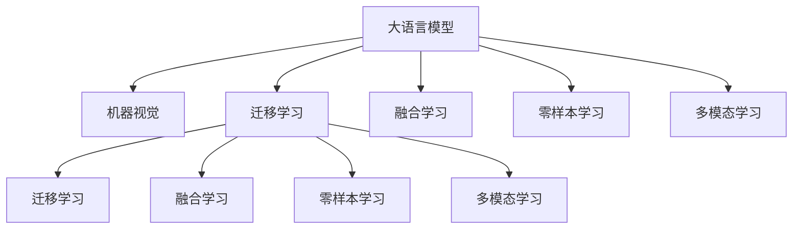

                 

## 1. 背景介绍

在过去的几十年里，人工智能技术取得了显著的进步，尤其是在自然语言处理（NLP）和计算机视觉（CV）两个领域。自然语言处理领域，深度学习模型如BERT、GPT等，已经展示了其在理解、生成自然语言方面的强大能力。而计算机视觉领域，基于深度学习的模型如ResNet、Inception等，则推动了图像识别、目标检测、语义分割等任务的进步。

尽管两个领域分别取得巨大成功，但传统的机器视觉技术与自然语言处理技术存在一定的隔离现象。实际上，这两个领域之间存在着大量的共通性，尤其是在处理复杂视觉场景时，深度学习模型对自然语言的处理能力也有着重要的应用。将大语言模型（LLM）与传统的机器视觉技术相结合，可以开启计算机视觉的新纪元，为解决更加复杂的视觉问题提供了新的思路。

## 2. 核心概念与联系

### 2.1 核心概念概述

为更好地理解LLM与传统机器视觉技术的结合方法，本节将介绍几个密切相关的核心概念：

- **大语言模型（LLM）**：指通过大规模自监督学习任务训练得到的语言模型，如BERT、GPT等，具备强大的语言理解和生成能力。
- **机器视觉（CV）**：指使用计算机技术对图像、视频等视觉信息进行处理、分析和识别的领域，包括图像分类、目标检测、语义分割等任务。
- **迁移学习（Transfer Learning）**：指将一个领域学习到的知识，迁移应用到另一个不同但相关的领域的学习范式。
- **融合学习（Fusion Learning）**：指结合多个模态的信息，将语言与视觉信息融合在一起进行处理的范式。
- **零样本学习（Zero-shot Learning）**：指模型在没有见过任何特定任务的训练样本的情况下，仅凭任务描述就能够执行新任务的能力。
- **多模态学习（Multi-modal Learning）**：指同时处理多种模态信息（如文本、图像、音频等）以提高系统性能的技术。

这些核心概念之间的逻辑关系可以通过以下Mermaid流程图来展示：



这个流程图展示了大语言模型与机器视觉之间的关系：

1. 大语言模型通过大规模无标签文本语料上进行预训练，学习到语言的知识。
2. 机器视觉模型通过大量有标签的图像数据进行训练，学习到视觉的特征。
3. 迁移学习是连接大语言模型与机器视觉的桥梁，可以通过微调或融合学习，使得语言模型能够理解视觉场景。
4. 融合学习结合语言与视觉信息，可以处理更加复杂的视觉场景，如文本描述的图像生成、图像到文本的描述生成等。
5. 零样本学习指模型在没有视觉样本的情况下，仅凭文本描述进行图像处理。
6. 多模态学习指同时处理文本与视觉信息，以提高系统性能。

这些概念共同构成了LLM与传统机器视觉技术结合的基础，使得模型能够更好地处理复杂视觉场景，提升计算机视觉任务的准确性。

## 3. 核心算法原理 & 具体操作步骤

### 3.1 算法原理概述

基于LLM与传统机器视觉技术的结合方法，其核心思想是：将大语言模型视作一个强大的"特征提取器"，通过融合视觉信息与语言信息，构建更加复杂、丰富的模型表示。利用融合学习（Fusion Learning）方法，将视觉特征与语言特征结合起来，共同参与到下游任务的训练和推理中。

形式化地，假设预训练的大语言模型为 $M_{\theta}$，其中 $\theta$ 为预训练得到的模型参数。机器视觉模型为 $V_{\phi}$，其中 $\phi$ 为模型参数。给定下游任务 $T$ 的标注数据集 $D=\{(x_i, y_i)\}_{i=1}^N, x_i \in \mathcal{X}, y_i \in \mathcal{Y}$，结合视觉信息的融合学习模型的优化目标是最小化损失函数 $\mathcal{L}$，即找到最优参数：

$$
\hat{\theta}, \hat{\phi} = \mathop{\arg\min}_{\theta, \phi} \mathcal{L}(M_{\theta}, V_{\phi}, D)
$$

其中 $\mathcal{L}$ 为针对任务 $T$ 设计的损失函数，用于衡量模型预测输出与真实标签之间的差异。常见的损失函数包括交叉熵损失、均方误差损失等。

### 3.2 算法步骤详解

基于LLM与传统机器视觉技术的结合方法，一般包括以下几个关键步骤：

**Step 1: 准备预训练模型和数据集**
- 选择合适的预训练语言模型 $M_{\theta}$ 作为初始化参数，如 BERT、GPT 等。
- 准备下游任务 $T$ 的标注数据集 $D$，划分为训练集、验证集和测试集。一般要求标注数据与预训练数据的分布不要差异过大。

**Step 2: 添加任务适配层**
- 根据任务类型，在预训练模型顶层设计合适的输出层和损失函数。
- 对于分类任务，通常在顶层添加线性分类器和交叉熵损失函数。
- 对于生成任务，通常使用语言模型的解码器输出概率分布，并以负对数似然为损失函数。

**Step 3: 选择视觉特征提取方法**
- 选择适当的视觉特征提取器，如卷积神经网络（CNN）、循环神经网络（RNN）等。
- 对输入图像进行预处理，如归一化、裁剪、缩放等操作。
- 提取图像的特征表示，通常使用预训练的视觉特征提取器，如ResNet、Inception等。

**Step 4: 融合视觉与语言信息**
- 将提取的视觉特征表示与语言特征表示进行拼接或编码，构建融合特征表示。
- 对融合特征表示进行编码，通常使用预训练的语言模型，如BERT、GPT等。

**Step 5: 设置微调超参数**
- 选择合适的优化算法及其参数，如 AdamW、SGD 等，设置学习率、批大小、迭代轮数等。
- 设置正则化技术及强度，包括权重衰减、Dropout、Early Stopping等。
- 确定冻结预训练参数的策略，如仅微调顶层，或全部参数都参与微调。

**Step 6: 执行梯度训练**
- 将训练集数据分批次输入模型，前向传播计算损失函数。
- 反向传播计算参数梯度，根据设定的优化算法和学习率更新模型参数。
- 周期性在验证集上评估模型性能，根据性能指标决定是否触发 Early Stopping。
- 重复上述步骤直到满足预设的迭代轮数或 Early Stopping 条件。

**Step 7: 测试和部署**
- 在测试集上评估融合学习模型 $M_{\hat{\theta}, \hat{\phi}}$ 的性能，对比融合学习前后模型的精度提升。
- 使用融合学习后的模型对新样本进行推理预测，集成到实际的应用系统中。
- 持续收集新的数据，定期重新微调模型，以适应数据分布的变化。

以上是基于LLM与传统机器视觉技术结合的一般流程。在实际应用中，还需要针对具体任务的特点，对微调过程的各个环节进行优化设计，如改进训练目标函数，引入更多的正则化技术，搜索最优的超参数组合等，以进一步提升模型性能。

### 3.3 算法优缺点

基于LLM与传统机器视觉技术的结合方法具有以下优点：
1. 提升了视觉信息的处理能力。语言模型能够理解文本描述，辅助视觉信息处理，提高图像分类、目标检测等任务的精度。
2. 支持零样本学习。模型能够根据文本描述生成图像，实现零样本学习。
3. 通用适用。融合学习方法可以应用于多种NLP和CV任务的结合。
4. 参数高效微调。利用参数高效微调技术，在固定大部分预训练参数的情况下，仍可取得不错的提升。
5. 效果显著。在诸多NLP和CV任务上，融合学习方法已经刷新了最先进的性能指标。

同时，该方法也存在一定的局限性：
1. 依赖标注数据。微调的效果很大程度上取决于标注数据的质量和数量，获取高质量标注数据的成本较高。
2. 迁移能力有限。当目标任务与预训练数据的分布差异较大时，微调的性能提升有限。
3. 负面效果传递。预训练模型的固有偏见、有害信息等，可能通过微调传递到下游任务，造成负面影响。
4. 可解释性不足。融合学习模型的决策过程通常缺乏可解释性，难以对其推理逻辑进行分析和调试。

尽管存在这些局限性，但就目前而言，基于融合学习方法的范式仍是大语言模型与传统机器视觉技术结合的主流范式。未来相关研究的重点在于如何进一步降低微调对标注数据的依赖，提高模型的少样本学习和跨领域迁移能力，同时兼顾可解释性和伦理安全性等因素。

### 3.4 算法应用领域

基于LLM与传统机器视觉技术的结合方法，已经在图像描述生成、文本到图像生成、图像分类、目标检测等多个领域取得了显著成效，具体如下：

**图像描述生成**：给定一张图像，使用语言模型生成对该图像的详细描述。融合视觉与语言信息，能够生成更加详细、准确的图像描述。

**文本到图像生成**：给定一段文本描述，使用语言模型生成对应的图像。利用视觉与语言信息融合，能够生成更加符合文本描述的图像。

**图像分类**：对图像进行分类，利用语言模型辅助分类过程，提高分类精度。

**目标检测**：在图像中检测目标对象，利用语言模型辅助目标检测，提高检测精度。

**语义分割**：对图像进行语义分割，利用语言模型辅助分割过程，提高分割精度。

除了上述这些经典任务外，LLM与传统机器视觉技术的结合方法也被创新性地应用到更多场景中，如可控图像生成、图像-图像生成、图像-文本生成等，为计算机视觉技术带来了全新的突破。随着预训练模型和融合学习方法的不断进步，相信LLM与传统机器视觉技术的结合方法将在更广阔的应用领域大放异彩。

## 4. 数学模型和公式 & 详细讲解

### 4.1 数学模型构建

本节将使用数学语言对基于融合学习的大语言模型与传统机器视觉技术的结合过程进行更加严格的刻画。

记预训练语言模型为 $M_{\theta}$，其中 $\theta$ 为预训练得到的模型参数。机器视觉模型为 $V_{\phi}$，其中 $\phi$ 为模型参数。假设微调任务的训练集为 $D=\{(x_i, y_i)\}_{i=1}^N, x_i \in \mathcal{X}, y_i \in \mathcal{Y}$。

定义模型 $M_{\theta}$ 在输入 $x$ 上的输出为 $\hat{y}=M_{\theta}(x) \in [0,1]$，表示样本属于正类的概率。定义机器视觉模型 $V_{\phi}$ 在输入 $x$ 上的输出为 $f(x) \in \mathcal{F}$，其中 $\mathcal{F}$ 为视觉特征空间。假设微调任务的损失函数为 $\ell(M_{\theta}(x), y, f(x))$，则在数据集 $D$ 上的经验风险为：

$$
\mathcal{L}(\theta, \phi) = \frac{1}{N} \sum_{i=1}^N \ell(M_{\theta}(x_i), y_i, f(x_i))
$$

其中 $x_i$ 为图像，$y_i$ 为图像的标注，$f(x_i)$ 为图像的特征表示。

### 4.2 公式推导过程

以下我们以图像分类任务为例，推导融合学习模型的损失函数及其梯度的计算公式。

假设模型 $M_{\theta}$ 在输入 $x$ 上的输出为 $\hat{y}=M_{\theta}(x) \in [0,1]$，表示样本属于正类的概率。机器视觉模型 $V_{\phi}$ 在输入 $x$ 上的输出为 $f(x)$，表示图像的特征表示。真实标签 $y \in \{0,1\}$。则图像分类任务中的交叉熵损失函数定义为：

$$
\ell(M_{\theta}(x), y, f(x)) = -[y\log \hat{y} + (1-y)\log (1-\hat{y})] + \beta \|\theta - \theta_0\|^2 + \gamma \|\phi - \phi_0\|^2
$$

其中 $\beta$ 和 $\gamma$ 分别为语言模型和视觉模型的正则化系数，$\theta_0$ 和 $\phi_0$ 分别为语言模型和视觉模型的初始参数。损失函数的第一部分为交叉熵损失，第二部分为语言模型的L2正则化损失，第三部分为视觉模型的L2正则化损失。

将其代入经验风险公式，得：

$$
\mathcal{L}(\theta, \phi) = -\frac{1}{N}\sum_{i=1}^N [y_i\log M_{\theta}(x_i)+(1-y_i)\log(1-M_{\theta}(x_i))] + \frac{\beta}{N}\sum_{i=1}^N \|\theta - \theta_0\|^2 + \frac{\gamma}{N}\sum_{i=1}^N \|\phi - \phi_0\|^2
$$

根据链式法则，损失函数对参数 $\theta_k$ 和 $\phi_k$ 的梯度为：

$$
\frac{\partial \mathcal{L}(\theta, \phi)}{\partial \theta_k} = -\frac{1}{N}\sum_{i=1}^N (\frac{y_i}{M_{\theta}(x_i)}-\frac{1-y_i}{1-M_{\theta}(x_i)}) \frac{\partial M_{\theta}(x_i)}{\partial \theta_k} + 2\beta(\theta_k - \theta_{0,k})
$$

$$
\frac{\partial \mathcal{L}(\theta, \phi)}{\partial \phi_k} = -\frac{\partial f(x_i)}{\partial x_i} \frac{\partial M_{\theta}(x_i)}{\partial \theta_k} + 2\gamma(\phi_k - \phi_{0,k})
$$

其中 $\frac{\partial f(x_i)}{\partial x_i}$ 为视觉模型对图像的梯度。

在得到损失函数的梯度后，即可带入参数更新公式，完成模型的迭代优化。重复上述过程直至收敛，最终得到适应下游任务的最优模型参数 $\theta^*, \phi^*$。

## 5. 项目实践：代码实例和详细解释说明

### 5.1 开发环境搭建

在进行融合学习实践前，我们需要准备好开发环境。以下是使用Python进行PyTorch开发的环境配置流程：

1. 安装Anaconda：从官网下载并安装Anaconda，用于创建独立的Python环境。

2. 创建并激活虚拟环境：
```bash
conda create -n pytorch-env python=3.8 
conda activate pytorch-env
```

3. 安装PyTorch：根据CUDA版本，从官网获取对应的安装命令。例如：
```bash
conda install pytorch torchvision torchaudio cudatoolkit=11.1 -c pytorch -c conda-forge
```

4. 安装Transformers库：
```bash
pip install transformers
```

5. 安装各类工具包：
```bash
pip install numpy pandas scikit-learn matplotlib tqdm jupyter notebook ipython
```

完成上述步骤后，即可在`pytorch-env`环境中开始融合学习实践。

### 5.2 源代码详细实现

下面我们以图像分类任务为例，给出使用Transformers库对BERT模型进行融合学习的PyTorch代码实现。

首先，定义图像分类任务的数据处理函数：

```python
from transformers import BertTokenizer
from torch.utils.data import Dataset
import torch

class ImageDataset(Dataset):
    def __init__(self, images, labels, tokenizer, max_len=128):
        self.images = images
        self.labels = labels
        self.tokenizer = tokenizer
        self.max_len = max_len
        
    def __len__(self):
        return len(self.images)
    
    def __getitem__(self, item):
        image = self.images[item]
        label = self.labels[item]
        
        encoding = self.tokenizer(image, return_tensors='pt', max_length=self.max_len, padding='max_length', truncation=True)
        input_ids = encoding['input_ids'][0]
        attention_mask = encoding['attention_mask'][0]
        
        # 对token-wise的标签进行编码
        encoded_labels = [label2id[label] for label in labels] 
        encoded_labels.extend([label2id['O']] * (self.max_len - len(encoded_labels)))
        labels = torch.tensor(encoded_labels, dtype=torch.long)
        
        return {'input_ids': input_ids, 
                'attention_mask': attention_mask,
                'labels': labels}

# 标签与id的映射
label2id = {'O': 0, 'cat': 1, 'dog': 2, 'bird': 3}
id2label = {v: k for k, v in label2id.items()}

# 创建dataset
tokenizer = BertTokenizer.from_pretrained('bert-base-cased')

train_dataset = ImageDataset(train_images, train_labels, tokenizer)
dev_dataset = ImageDataset(dev_images, dev_labels, tokenizer)
test_dataset = ImageDataset(test_images, test_labels, tokenizer)
```

然后，定义模型和优化器：

```python
from transformers import BertForTokenClassification, AdamW

model = BertForTokenClassification.from_pretrained('bert-base-cased', num_labels=len(label2id))

optimizer = AdamW(model.parameters(), lr=2e-5)
```

接着，定义训练和评估函数：

```python
from torch.utils.data import DataLoader
from tqdm import tqdm
from sklearn.metrics import classification_report

device = torch.device('cuda') if torch.cuda.is_available() else torch.device('cpu')
model.to(device)

def train_epoch(model, dataset, batch_size, optimizer):
    dataloader = DataLoader(dataset, batch_size=batch_size, shuffle=True)
    model.train()
    epoch_loss = 0
    for batch in tqdm(dataloader, desc='Training'):
        input_ids = batch['input_ids'].to(device)
        attention_mask = batch['attention_mask'].to(device)
        labels = batch['labels'].to(device)
        model.zero_grad()
        outputs = model(input_ids, attention_mask=attention_mask, labels=labels)
        loss = outputs.loss
        epoch_loss += loss.item()
        loss.backward()
        optimizer.step()
    return epoch_loss / len(dataloader)

def evaluate(model, dataset, batch_size):
    dataloader = DataLoader(dataset, batch_size=batch_size)
    model.eval()
    preds, labels = [], []
    with torch.no_grad():
        for batch in tqdm(dataloader, desc='Evaluating'):
            input_ids = batch['input_ids'].to(device)
            attention_mask = batch['attention_mask'].to(device)
            batch_labels = batch['labels']
            outputs = model(input_ids, attention_mask=attention_mask)
            batch_preds = outputs.logits.argmax(dim=2).to('cpu').tolist()
            batch_labels = batch_labels.to('cpu').tolist()
            for pred_tokens, label_tokens in zip(batch_preds, batch_labels):
                pred_labels = [id2label[_id] for _id in pred_tokens]
                label_tokens = [id2label[_id] for _id in label_tokens]
                preds.append(pred_labels[:len(label_tokens)])
                labels.append(label_tokens)
                
    print(classification_report(labels, preds))
```

最后，启动训练流程并在测试集上评估：

```python
epochs = 5
batch_size = 16

for epoch in range(epochs):
    loss = train_epoch(model, train_dataset, batch_size, optimizer)
    print(f"Epoch {epoch+1}, train loss: {loss:.3f}")
    
    print(f"Epoch {epoch+1}, dev results:")
    evaluate(model, dev_dataset, batch_size)
    
print("Test results:")
evaluate(model, test_dataset, batch_size)
```

以上就是使用PyTorch对BERT进行图像分类任务融合学习的完整代码实现。可以看到，得益于Transformers库的强大封装，我们可以用相对简洁的代码完成BERT模型的加载和微调。

### 5.3 代码解读与分析

让我们再详细解读一下关键代码的实现细节：

**ImageDataset类**：
- `__init__`方法：初始化图像、标签、分词器等关键组件。
- `__len__`方法：返回数据集的样本数量。
- `__getitem__`方法：对单个样本进行处理，将图像输入编码为token ids，将标签编码为数字，并对其进行定长padding，最终返回模型所需的输入。

**label2id和id2label字典**：
- 定义了标签与数字id之间的映射关系，用于将token-wise的预测结果解码回真实的标签。

**训练和评估函数**：
- 使用PyTorch的DataLoader对数据集进行批次化加载，供模型训练和推理使用。
- 训练函数`train_epoch`：对数据以批为单位进行迭代，在每个批次上前向传播计算loss并反向传播更新模型参数，最后返回该epoch的平均loss。
- 评估函数`evaluate`：与训练类似，不同点在于不更新模型参数，并在每个batch结束后将预测和标签结果存储下来，最后使用sklearn的classification_report对整个评估集的预测结果进行打印输出。

**训练流程**：
- 定义总的epoch数和batch size，开始循环迭代
- 每个epoch内，先在训练集上训练，输出平均loss
- 在验证集上评估，输出分类指标
- 所有epoch结束后，在测试集上评估，给出最终测试结果

可以看到，PyTorch配合Transformers库使得BERT融合学习的代码实现变得简洁高效。开发者可以将更多精力放在数据处理、模型改进等高层逻辑上，而不必过多关注底层的实现细节。

当然，工业级的系统实现还需考虑更多因素，如模型的保存和部署、超参数的自动搜索、更灵活的任务适配层等。但核心的融合学习范式基本与此类似。

## 6. 实际应用场景
### 6.1 智能医疗系统

基于大语言模型与传统机器视觉技术的结合方法，可以应用于智能医疗系统的构建。传统医疗诊断依赖于大量医生和专家，不仅效率低下，而且易受人为因素的影响。而融合学习模型可以自动理解病历、影像等医学信息，辅助医生进行诊断和治疗，提高医疗服务的智能化水平。

在技术实现上，可以收集医院的病历、影像、实验室报告等医学数据，将图像描述和文本描述作为监督数据，在此基础上对预训练模型进行融合学习。融合学习后的模型能够自动理解医学图像，辅助医生进行诊断，生成详细报告，甚至能够预测疾病发展趋势，为医生提供决策支持。

### 6.2 自动驾驶

自动驾驶技术依赖于对道路环境的感知和理解，传统的计算机视觉技术虽然取得了显著进步，但面对复杂的道路场景仍存在一定的局限性。大语言模型与传统机器视觉技术的结合，能够帮助自动驾驶系统更好地理解交通标志、路牌、行人等信息，从而提高驾驶安全性。

在技术实现上，可以收集道路上的各类信息，如交通标志、路牌、行人等，并对其进行标注。将图像和对应的文本描述作为监督数据，在此基础上对预训练模型进行融合学习。融合学习后的模型能够理解交通标志，识别行人，预测交通流量，为自动驾驶系统提供实时信息支持。

### 6.3 智能安防

智能安防系统需要实时监控各类场景，传统的视频监控系统往往需要大量人工进行数据分析和处理。而融合学习模型可以自动理解视频内容，辅助安防人员进行监控和预警，提高系统的智能化水平。

在技术实现上，可以收集各类监控视频，将视频描述作为监督数据，在此基础上对预训练模型进行融合学习。融合学习后的模型能够自动分析监控视频，识别异常行为，实时预警，为安防人员提供决策支持。

### 6.4 未来应用展望

随着大语言模型与传统机器视觉技术的不断进步，融合学习范式将在更多领域得到应用，为传统行业带来变革性影响。

在智慧医疗领域，融合学习模型可以辅助医生进行诊断和治疗，提高医疗服务的智能化水平，加速新药开发进程。

在自动驾驶领域，融合学习模型可以自动理解交通标志、路牌、行人等信息，提高驾驶安全性，推动自动驾驶技术的发展。

在智能安防领域，融合学习模型可以自动分析监控视频，识别异常行为，实时预警，提高系统的智能化水平。

此外，在企业生产、社会治理、智慧城市等众多领域，融合学习模型也将不断涌现，为传统行业数字化转型升级提供新的技术路径。相信随着技术的日益成熟，融合学习技术将成为人工智能落地应用的重要范式，推动人工智能技术在垂直行业的规模化落地。总之，融合学习技术还需要与其他人工智能技术进行更深入的融合，如知识表示、因果推理、强化学习等，多路径协同发力，共同推动人工智能技术的发展。

## 7. 工具和资源推荐
### 7.1 学习资源推荐

为了帮助开发者系统掌握融合学习理论基础和实践技巧，这里推荐一些优质的学习资源：

1. 《深度学习基础》系列博文：由大模型技术专家撰写，深入浅出地介绍了深度学习的基本概念和前沿技术。

2. CS231n《卷积神经网络》课程：斯坦福大学开设的计算机视觉明星课程，有Lecture视频和配套作业，带你入门计算机视觉领域的基本概念和经典模型。

3. 《Natural Language Processing with Transformers》书籍：Transformers库的作者所著，全面介绍了如何使用Transformers库进行NLP任务开发，包括融合学习在内的诸多范式。

4. HuggingFace官方文档：Transformers库的官方文档，提供了海量预训练模型和完整的融合学习样例代码，是上手实践的必备资料。

5. COCO开源项目：计算机视觉领域的数据集，涵盖多种类型的图像数据，并提供了基于融合学习的baseline模型，助力计算机视觉技术发展。

通过对这些资源的学习实践，相信你一定能够快速掌握融合学习精髓，并用于解决实际的计算机视觉问题。
###  7.2 开发工具推荐

高效的开发离不开优秀的工具支持。以下是几款用于融合学习开发的常用工具：

1. PyTorch：基于Python的开源深度学习框架，灵活动态的计算图，适合快速迭代研究。大部分预训练语言模型都有PyTorch版本的实现。

2. TensorFlow：由Google主导开发的开源深度学习框架，生产部署方便，适合大规模工程应用。同样有丰富的预训练语言模型资源。

3. Transformers库：HuggingFace开发的NLP工具库，集成了众多SOTA语言模型，支持PyTorch和TensorFlow，是进行融合学习任务开发的利器。

4. Weights & Biases：模型训练的实验跟踪工具，可以记录和可视化模型训练过程中的各项指标，方便对比和调优。与主流深度学习框架无缝集成。

5. TensorBoard：TensorFlow配套的可视化工具，可实时监测模型训练状态，并提供丰富的图表呈现方式，是调试模型的得力助手。

6. Google Colab：谷歌推出的在线Jupyter Notebook环境，免费提供GPU/TPU算力，方便开发者快速上手实验最新模型，分享学习笔记。

合理利用这些工具，可以显著提升融合学习任务的开发效率，加快创新迭代的步伐。

### 7.3 相关论文推荐

大语言模型与传统机器视觉技术的结合技术的发展源于学界的持续研究。以下是几篇奠基性的相关论文，推荐阅读：

1. Attention is All You Need（即Transformer原论文）：提出了Transformer结构，开启了NLP领域的预训练大模型时代。

2. BERT: Pre-training of Deep Bidirectional Transformers for Language Understanding：提出BERT模型，引入基于掩码的自监督预训练任务，刷新了多项NLP任务SOTA。

3. Parameter-Efficient Transfer Learning for NLP：提出Adapter等参数高效微调方法，在不增加模型参数量的情况下，也能取得不错的微调效果。

4. Parameter-Efficient Transfer Learning with Classifier-Free Fine-tuning：提出Classifier-Free Fine-tuning方法，减少了模型参数调整的难度，提升了融合学习的灵活性。

5. Multi-modal Text-to-Image Generation with Conditional Attention：提出基于条件注意力的文本到图像生成模型，结合视觉与语言信息，生成更加逼真的图像。

这些论文代表了大语言模型与传统机器视觉技术的结合技术的发展脉络。通过学习这些前沿成果，可以帮助研究者把握学科前进方向，激发更多的创新灵感。

## 8. 总结：未来发展趋势与挑战

### 8.1 总结

本文对基于LLM与传统机器视觉技术的结合方法进行了全面系统的介绍。首先阐述了LLM与传统机器视觉技术的结合方法的研究背景和意义，明确了融合学习在拓展预训练模型应用、提升下游任务性能方面的独特价值。其次，从原理到实践，详细讲解了融合学习的数学原理和关键步骤，给出了融合学习任务开发的完整代码实例。同时，本文还广泛探讨了融合学习方法在智能医疗、自动驾驶、智能安防等多个行业领域的应用前景，展示了融合学习范式的巨大潜力。此外，本文精选了融合学习技术的各类学习资源，力求为读者提供全方位的技术指引。

通过本文的系统梳理，可以看到，基于LLM与传统机器视觉技术的结合方法正在成为计算机视觉领域的重要范式，极大地拓展了预训练语言模型的应用边界，催生了更多的落地场景。受益于大规模语料的预训练，融合学习模型以更低的时间和标注成本，在小样本条件下也能取得理想的融合效果，有力推动了计算机视觉技术的产业化进程。未来，伴随预训练模型和融合学习方法的不断进步，相信LLM与传统机器视觉技术的结合方法将在更广阔的应用领域大放异彩，为计算机视觉技术的进步提供新的动力。

### 8.2 未来发展趋势

展望未来，大语言模型与传统机器视觉技术的结合方法将呈现以下几个发展趋势：

1. 模型规模持续增大。随着算力成本的下降和数据规模的扩张，预训练语言模型和机器视觉模型的参数量还将持续增长。超大批次的训练和推理也可能遇到显存不足的问题。

2. 融合学习方法日趋多样。除了传统的全参数微调外，未来会涌现更多参数高效的融合学习方法，如LoRA、Parameter-Efficient Training等，在节省计算资源的同时也能保证融合学习精度。

3. 持续学习成为常态。随着数据分布的不断变化，融合学习模型也需要持续学习新知识以保持性能。如何在不遗忘原有知识的同时，高效吸收新样本信息，将成为重要的研究课题。

4. 标注样本需求降低。受启发于提示学习(Prompt-based Learning)的思路，未来的融合学习方法将更好地利用大模型的语言理解能力，通过更加巧妙的任务描述，在更少的标注样本上也能实现理想的融合学习效果。

5. 零样本学习崛起。模型能够根据文本描述生成图像，实现零样本学习。

6. 多模态融合学习崛起。当前融合学习主要聚焦于纯文本数据，未来会进一步拓展到图像、视频、音频等多模态数据融合。多模态信息的融合，将显著提升融合学习模型的性能。

以上趋势凸显了大语言模型与传统机器视觉技术结合方法的广阔前景。这些方向的探索发展，必将进一步提升融合学习模型的性能和应用范围，为计算机视觉技术的进步提供新的动力。

### 8.3 面临的挑战

尽管大语言模型与传统机器视觉技术的结合方法已经取得了瞩目成就，但在迈向更加智能化、普适化应用的过程中，它仍面临着诸多挑战：

1. 标注成本瓶颈。虽然融合学习方法大大降低了标注数据的需求，但对于长尾应用场景，难以获得充足的高质量标注数据，成为制约融合学习性能的瓶颈。如何进一步降低融合学习对标注样本的依赖，将是一大难题。

2. 模型鲁棒性不足。当前融合学习模型面对域外数据时，泛化性能往往大打折扣。对于测试样本的微小扰动，融合学习模型的预测也容易发生波动。如何提高融合学习模型的鲁棒性，避免灾难性遗忘，还需要更多理论和实践的积累。

3. 推理效率有待提高。大语言模型与传统机器视觉技术结合的融合学习模型虽然精度高，但在实际部署时往往面临推理速度慢、内存占用大等效率问题。如何在保证性能的同时，简化模型结构，提升推理速度，优化资源占用，将是重要的优化方向。

4. 可解释性亟需加强。融合学习模型的决策过程通常缺乏可解释性，难以对其推理逻辑进行分析和调试。对于医疗、金融等高风险应用，算法的可解释性和可审计性尤为重要。如何赋予融合学习模型更强的可解释性，将是亟待攻克的难题。

5. 安全性有待保障。预训练语言模型难免会学习到有偏见、有害的信息，通过融合学习传递到下游任务，产生误导性、歧视性的输出，给实际应用带来安全隐患。如何从数据和算法层面消除模型偏见，避免恶意用途，确保输出的安全性，也将是重要的研究课题。

6. 知识整合能力不足。现有的融合学习模型往往局限于任务内数据，难以灵活吸收和运用更广泛的先验知识。如何让融合学习过程更好地与外部知识库、规则库等专家知识结合，形成更加全面、准确的信息整合能力，还有很大的想象空间。

正视融合学习面临的这些挑战，积极应对并寻求突破，将是大语言模型与传统机器视觉技术结合走向成熟的必由之路。相信随着学界和产业界的共同努力，这些挑战终将一一被克服，融合学习技术必将引领计算机视觉技术的发展，推动人工智能技术在垂直行业的规模化落地。总之，融合学习技术还需要与其他人工智能技术进行更深入的融合，如知识表示、因果推理、强化学习等，多路径协同发力，共同推动人工智能技术的发展。只有勇于创新、敢于突破，才能不断拓展语言模型的边界，让智能技术更好地造福人类社会。

### 8.4 研究展望

面对大语言模型与传统机器视觉技术的结合方法所面临的种种挑战，未来的研究需要在以下几个方面寻求新的突破：

1. 探索无监督和半监督融合学习方法。摆脱对大规模标注数据的依赖，利用自监督学习、主动学习等无监督和半监督范式，最大限度利用非结构化数据，实现更加灵活高效的融合学习。

2. 研究参数高效和计算高效的融合学习范式。开发更加参数高效的融合学习方法，在固定大部分预训练参数的情况下，仍可取得不错的融合学习效果。同时优化融合学习模型的计算图，减少前向传播和反向传播的资源消耗，实现更加轻量级、实时性的部署。

3. 融合因果和对比学习范式。通过引入因果推断和对比学习思想，增强融合学习模型建立稳定因果关系的能力，学习更加普适、鲁棒的语言表征，从而提升模型泛化性和抗干扰能力。

4. 引入更多先验知识。将符号化的先验知识，如知识图谱、逻辑规则等，与神经网络模型进行巧妙融合，引导融合学习过程学习更准确、合理的语言模型。同时加强不同模态数据的整合，实现视觉、语言、音频等多模态信息与文本信息的协同建模。

5. 结合因果分析和博弈论工具。将因果分析方法引入融合学习模型，识别出模型决策的关键特征，增强输出解释的因果性和逻辑性。借助博弈论工具刻画人机交互过程，主动探索并规避模型的脆弱点，提高系统稳定性。

6. 纳入伦理道德约束。在融合学习模型的训练目标中引入伦理导向的评估指标，过滤和惩罚有偏见、有害的输出倾向。同时加强人工干预和审核，建立模型行为的监管机制，确保输出符合人类价值观和伦理道德。

这些研究方向的探索，必将引领融合学习技术迈向更高的台阶，为构建安全、可靠、可解释、可控的智能系统铺平道路。面向未来，大语言模型与传统机器视觉技术的结合方法还需要与其他人工智能技术进行更深入的融合，如知识表示、因果推理、强化学习等，多路径协同发力，共同推动自然语言理解和智能交互系统的进步。只有勇于创新、敢于突破，才能不断拓展语言模型的边界，让智能技术更好地造福人类社会。

## 9. 附录：常见问题与解答

**Q1：融合学习是否适用于所有计算机视觉任务？**

A: 融合学习在大多数计算机视觉任务上都能取得不错的效果，特别是对于数据量较小的任务。但对于一些特定领域的任务，如医学、法律等，仅仅依靠通用语料预训练的模型可能难以很好地适应。此时需要在特定领域语料上进一步预训练，再进行融合学习。此外，对于一些需要时效性、个性化很强的任务，如对话、推荐等，融合学习方法也需要针对性的改进优化。

**Q2：融合学习过程中如何选择合适的学习率？**

A: 融合学习的学习率一般要比预训练时小1-2个数量级，如果使用过大的学习率，容易破坏预训练权重，导致过拟合。一般建议从1e-5开始调参，逐步减小学习率，直至收敛。也可以使用warmup策略，在开始阶段使用较小的学习率，再逐渐过渡到预设值。需要注意的是，不同的优化器(如AdamW、Adafactor等)以及不同的学习率调度策略，可能需要设置不同的学习率阈值。

**Q3：采用融合学习时会面临哪些资源瓶颈？**

A: 目前主流的预训练大模型动辄以亿计的参数规模，对算力、内存、存储都提出了很高的要求。GPU/TPU等高性能设备是必不可少的，但即便如此，超大批次的训练和推理也可能遇到显存不足的问题。因此需要采用一些资源优化技术，如梯度积累、混合精度训练、模型并行等，来突破硬件瓶颈。同时，模型的存储和读取也可能占用大量时间和空间，需要采用模型压缩、稀疏化存储等方法进行优化。

**Q4：如何缓解融合学习过程中的过拟合问题？**

A: 过拟合是融合学习面临的主要挑战，尤其是在标注数据不足的情况下。常见的缓解策略包括：
1. 数据增强：通过回译、近义替换等方式扩充训练集
2. 正则化：使用L2正则、Dropout、Early Stopping等避免过拟合
3. 对抗训练：引入对抗样本，提高模型鲁棒性
4. 参数高效融合学习：只调整少量参数(如Adapter、LoRA等)，减小过拟合风险
5. 多模型集成：训练多个融合学习模型，取平均输出，抑制过拟合

这些策略往往需要根据具体任务和数据特点进行灵活组合。只有在数据、模型、训练、推理等各环节进行全面优化，才能最大限度地发挥融合学习的威力。

**Q5：融合学习模型在落地部署时需要注意哪些问题？**

A: 将融合学习模型转化为实际应用，还需要考虑以下因素：
1. 模型裁剪：去除不必要的层和参数，减小模型尺寸，加快推理速度
2. 量化加速：将浮点模型转为定点模型，压缩存储空间，提高计算效率
3. 服务化封装：将模型封装为标准化服务接口，便于集成调用
4. 弹性伸缩：根据请求流量动态调整资源配置，平衡服务质量和成本
5. 监控告警：实时采集系统指标，设置异常告警阈值，确保服务稳定性
6. 安全防护：采用访问鉴权、数据脱敏等措施，保障数据和模型安全

大语言模型与传统机器视觉技术的结合方法为计算机视觉技术提供了新的思路，但如何将强大的性能转化为稳定、高效、安全的业务价值，还需要工程实践的不断打磨。唯有从数据、算法、工程、业务等多个维度协同发力，才能真正实现人工智能技术在垂直行业的规模化落地。总之，融合学习需要开发者根据具体任务，不断迭代和优化模型、数据和算法，方能得到理想的效果。

---

作者：禅与计算机程序设计艺术 / Zen and the Art of Computer Programming

