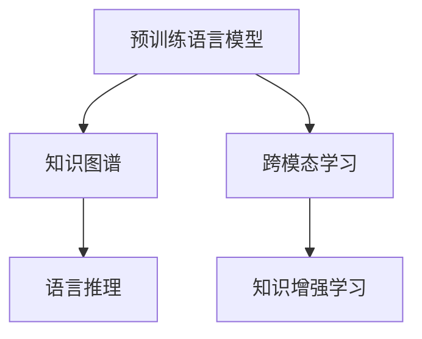

                 

# LLM与传统知识图谱的结合

## 1. 背景介绍

### 1.1 问题由来
近年来，深度学习和大规模预训练语言模型(LLMs)在自然语言处理(NLP)领域取得了显著进展，显著提升了模型在语言理解和生成方面的性能。然而，这些模型依赖于大量的文本数据，缺乏对结构化知识的处理能力。传统知识图谱(Knowledge Graphs, KGs)是一种结构化表示实体和关系的数据模型，在语义理解和推理方面具有独特的优势。将LLM与KGs结合，能够充分利用两者的优势，提升自然语言理解与推理的精度和鲁棒性。

### 1.2 问题核心关键点
将LLM与传统知识图谱结合，涉及以下核心问题：
- 如何高效地从LLM中提取知识，并将其转化为结构化数据，以供KGs使用？
- 如何将KGs中的结构化信息与LLM的自由文本进行有效融合？
- 如何设计模型来处理LLM和KGs的双重输入，实现自然语言理解和推理？
- 如何评估和改进结合模型在实际应用中的效果？

### 1.3 问题研究意义
将LLM与传统知识图谱相结合，对于推动知识图谱技术的应用、提升自然语言理解与推理的性能具有重要意义：

1. **融合多源数据**：LLM能够融合多源文本数据，从中提取知识并融入KGs，进一步丰富KGs的知识库。
2. **提高推理能力**：KGs为LLM提供了结构化知识背景，帮助模型进行更精确的推理与判断。
3. **支持跨领域应用**：结合LLM和KGs，可以在多个领域（如医疗、金融、教育等）中构建智能问答系统、推荐系统等应用。
4. **促进知识共享与创新**：LLM可以基于KGs中的知识，生成新的自然语言文本，加速知识传播与创新。

## 2. 核心概念与联系

### 2.1 核心概念概述

为更好地理解LLM与传统知识图谱的结合，本节将介绍几个密切相关的核心概念：

- 预训练语言模型(Pre-trained Language Model, PLM)：通过大规模无标签文本数据进行预训练，学习语言的通用表示。
- 知识图谱(Knowledge Graph)：以图结构表示实体和关系的知识库，用于语义查询、推理等任务。
- 跨模态学习(Cross-modal Learning)：融合不同模态的数据（如文本和图像），提升模型的综合理解能力。
- 语言推理(Natural Language Reasoning)：利用知识图谱中的结构化信息，对自然语言文本进行逻辑推理。
- 知识增强学习(Knowledge-Enhanced Learning)：将知识图谱中的结构化知识融入模型训练过程，提升模型对知识的理解和应用。

这些核心概念之间的逻辑关系可以通过以下Mermaid流程图来展示：



这个流程图展示了大语言模型与传统知识图谱的核心概念及其之间的关系：

1. 预训练语言模型通过大规模无标签文本数据进行预训练，学习语言的通用表示。
2. 知识图谱以图结构表示实体和关系，用于语义查询、推理等任务。
3. 跨模态学习融合不同模态的数据，提升模型的综合理解能力。
4. 语言推理利用知识图谱中的结构化信息，对自然语言文本进行逻辑推理。
5. 知识增强学习将知识图谱中的结构化知识融入模型训练过程，提升模型对知识的理解和应用。

## 3. 核心算法原理 & 具体操作步骤
### 3.1 算法原理概述

LLM与传统知识图谱的结合，通常通过以下步骤进行：
1. 从LLM中提取知识，将其转化为结构化数据。
2. 将结构化数据融入知识图谱中。
3. 设计跨模态模型，同时处理LLM和知识图谱的输入，实现自然语言理解与推理。
4. 在实际应用中，对模型进行训练和评估，优化其性能。

形式化地，假设LLM为 $M_{\theta}$，知识图谱为 $KG$，其中 $\theta$ 为LLM的参数，$KG$ 包含实体和关系结构。结合模型的目标是最大化在 $KG$ 上的推理准确率，即：

$$
\hat{\theta} = \mathop{\arg\max}_{\theta} \mathcal{P}(M_{\theta},KG)
$$

其中 $\mathcal{P}$ 表示在知识图谱 $KG$ 上推理的准确率，通常使用评价指标如精确度、召回率、F1值等。

### 3.2 算法步骤详解

以下是结合LLM与传统知识图谱的详细操作步骤：

**Step 1: 准备预训练模型和知识图谱**
- 选择合适的预训练语言模型 $M_{\theta}$，如BERT、GPT等。
- 准备知识图谱 $KG$，通常包含实体节点和关系边，使用标准格式如RDF、Turtle等。

**Step 2: 提取知识与转换为结构化数据**
- 从LLM中提取关键实体和关系，可以使用命名实体识别、关系抽取等技术。
- 将提取出的实体和关系转换为知识图谱中的节点和边。

**Step 3: 融合结构化数据**
- 将转换后的实体和关系节点导入知识图谱 $KG$，进行验证和纠错。
- 更新知识图谱 $KG$，确保其完整性和一致性。

**Step 4: 设计跨模态模型**
- 选择合适的跨模态融合方法，如注意力机制、多头自注意力等。
- 设计融合层，将LLM的输出和知识图谱的节点/边信息进行融合。
- 使用图卷积网络(GCN)、图注意力网络(GAT)等图神经网络模型，处理知识图谱中的关系推理。

**Step 5: 训练与评估**
- 使用标注数据集训练融合后的模型，通过交叉熵损失等优化算法最小化模型预测与真实标签的差异。
- 在验证集和测试集上评估模型性能，使用准确率、F1值等指标。

**Step 6: 部署与优化**
- 将训练好的模型部署到实际应用中，如智能问答系统、推荐系统等。
- 根据实际应用反馈，持续优化模型结构和超参数。

以上是结合LLM与传统知识图谱的一般流程。在实际应用中，还需要针对具体任务进行优化设计，如改进实体识别算法、设计更高效的跨模态融合方法等。

### 3.3 算法优缺点

将LLM与传统知识图谱结合的方法，具有以下优点：
1. 提升推理能力：知识图谱提供了结构化知识背景，帮助LLM进行更精确的推理与判断。
2. 支持多源数据融合：LLM能够融合多源文本数据，丰富知识图谱的内容。
3. 增强鲁棒性：融合知识图谱的多样化信息，提升模型的鲁棒性和泛化能力。
4. 提升应用效果：结合LLM和知识图谱，可以在问答、推荐、信息检索等领域取得更好的效果。

同时，该方法也存在一定的局限性：
1. 标注数据需求高：知识图谱的构建和LLM的微调都需要大量标注数据。
2. 模型复杂度高：跨模态模型设计复杂，训练和推理成本较高。
3. 知识偏见问题：知识图谱中的信息可能存在偏见，影响模型性能。
4. 动态知识更新：知识图谱需要定期更新，以适应新的知识变化。

尽管存在这些局限性，但就目前而言，将LLM与知识图谱结合的方法在自然语言理解与推理领域具有显著优势，值得进一步探索和优化。

### 3.4 算法应用领域

结合LLM与传统知识图谱的方法，已经在多个NLP应用领域取得了显著效果，例如：

- 智能问答系统：利用知识图谱为LLM提供知识背景，回答自然语言问题。
- 推荐系统：在用户行为数据中加入知识图谱中的关系信息，提升推荐效果。
- 信息检索：将知识图谱中的实体关系信息融入文本检索模型，提高检索精度。
- 医疗问答：结合医学知识图谱，为患者提供准确的医学信息查询。
- 法律咨询：利用法律知识图谱，解答法律问题并提供法律建议。

这些应用场景展示了LLM与知识图谱结合的强大潜力，未来将在更多领域得到推广应用。

## 4. 数学模型和公式 & 详细讲解  
### 4.1 数学模型构建

将LLM与知识图谱结合的数学模型，可以表示为：

$$
\begin{aligned}
\hat{\theta} = \mathop{\arg\min}_{\theta} \mathcal{L}(M_{\theta},KG)
\end{aligned}
$$

其中 $\mathcal{L}(M_{\theta},KG)$ 为结合模型的损失函数。

假设知识图谱 $KG$ 中的实体 $e$ 和关系 $r$ 可以表示为向量形式 $\overrightarrow{e}$ 和 $\overrightarrow{r}$。融合LLM输出的向量 $\overrightarrow{y}$，可以表示为：

$$
\begin{aligned}
\overrightarrow{y} &= f(\overrightarrow{e}, \overrightarrow{r}, \overrightarrow{y}_{LLM}) \\
&= \sum_{i=1}^{n} \alpha_i f_i(\overrightarrow{e}, \overrightarrow{r}, \overrightarrow{y}_{LLM})
\end{aligned}
$$

其中 $n$ 为融合层中融合单元的数量，$f_i$ 为第 $i$ 个融合单元的函数。$\alpha_i$ 为第 $i$ 个融合单元的权重，通过训练得到。$\overrightarrow{y}_{LLM}$ 为LLM输出的向量。

### 4.2 公式推导过程

以智能问答系统为例，推导结合模型的损失函数。

假设知识图谱 $KG$ 中有 $E$ 个实体节点，$R$ 个关系边。每个实体 $e_i$ 和关系 $r_j$ 可以表示为向量形式 $\overrightarrow{e_i}$ 和 $\overrightarrow{r_j}$。

1. 实体识别：从自然语言文本中识别出实体 $e_i$。

2. 关系抽取：从自然语言文本中识别出与实体 $e_i$ 相关的关系 $r_j$。

3. 关系推理：利用知识图谱中的关系 $r_j$ 进行推理，得到推理结果 $\overrightarrow{y_i}$。

4. 模型输出：将推理结果 $\overrightarrow{y_i}$ 与LLM的输出 $\overrightarrow{y}_{LLM}$ 进行融合，得到最终的模型输出 $\overrightarrow{y}$。

损失函数 $\mathcal{L}(M_{\theta},KG)$ 可以表示为：

$$
\begin{aligned}
\mathcal{L}(M_{\theta},KG) &= \frac{1}{N} \sum_{i=1}^{N} \ell(\overrightarrow{y_i}, \overrightarrow{y}_{LLM})
\end{aligned}
$$

其中 $\ell(\overrightarrow{y_i}, \overrightarrow{y}_{LLM})$ 为推理结果 $\overrightarrow{y_i}$ 与LLM输出 $\overrightarrow{y}_{LLM}$ 的损失函数。

常见的损失函数包括均方误差损失、交叉熵损失等。

### 4.3 案例分析与讲解

以医疗问答系统为例，分析LLM与知识图谱结合的应用。

假设知识图谱 $KG$ 中包含多个疾病的实体节点和症状、治疗关系的边。在回答患者询问时，系统首先通过LLM识别出疾病实体，然后查询知识图谱中与该疾病相关的症状、治疗等信息，进行推理并生成回答。

假设推理结果为 $\overrightarrow{y}$，LLM的输出为 $\overrightarrow{y}_{LLM}$。将两者进行融合，得到最终的模型输出。

通过大量标注数据训练模型，使得 $\overrightarrow{y}$ 与 $\overrightarrow{y}_{LLM}$ 的损失函数最小化。这样，模型能够在给定患者的症状描述时，快速准确地生成疾病和治疗方法的回答。

## 5. 项目实践：代码实例和详细解释说明
### 5.1 开发环境搭建

在进行结合LLM与知识图谱的项目实践前，我们需要准备好开发环境。以下是使用Python进行PyTorch开发的环境配置流程：

1. 安装Anaconda：从官网下载并安装Anaconda，用于创建独立的Python环境。

2. 创建并激活虚拟环境：
```bash
conda create -n llm-kb-env python=3.8 
conda activate llm-kb-env
```

3. 安装PyTorch：根据CUDA版本，从官网获取对应的安装命令。例如：
```bash
conda install pytorch torchvision torchaudio cudatoolkit=11.1 -c pytorch -c conda-forge
```

4. 安装TensorFlow：如果需要进行图神经网络计算，需要额外安装TensorFlow：
```bash
conda install tensorflow -c pytorch -c conda-forge
```

5. 安装各类工具包：
```bash
pip install numpy pandas scikit-learn matplotlib tqdm jupyter notebook ipython
```

完成上述步骤后，即可在`llm-kb-env`环境中开始结合LLM与知识图谱的实践。

### 5.2 源代码详细实现

下面我们以医疗问答系统为例，给出使用PyTorch进行结合LLM与知识图谱的PyTorch代码实现。

首先，定义实体识别函数和关系抽取函数：

```python
import spacy
import torch

def get_entities(text):
    nlp = spacy.load('en_core_web_sm')
    doc = nlp(text)
    entities = [ent.text for ent in doc.ents]
    return entities

def get_relations(text):
    nlp = spacy.load('en_core_web_sm')
    doc = nlp(text)
    relations = []
    for ent in doc.ents:
        for token in ent.start_char..ent.end_char:
            relations.append(doc[token].text)
    return relations
```

然后，定义知识图谱节点和边：

```python
from pykg import Graph, Node

graph = Graph()
graph.add_node("disease1", name="disease1", type="Disease")
graph.add_node("symptom1", name="symptom1", type="Symptom")
graph.add_edge("disease1", "symptom1", name="has_symptom")

graph.add_node("treatment1", name="treatment1", type="Treatment")
graph.add_edge("symptom1", "treatment1", name="has_treatment")
```

接着，定义结合模型的训练函数：

```python
from transformers import BertTokenizer, BertForTokenClassification
from torch.utils.data import Dataset, DataLoader
from sklearn.metrics import accuracy_score

class LLMKGDataset(Dataset):
    def __init__(self, texts, labels):
        self.texts = texts
        self.labels = labels
        self.tokenizer = BertTokenizer.from_pretrained('bert-base-cased')

    def __len__(self):
        return len(self.texts)

    def __getitem__(self, item):
        text = self.texts[item]
        labels = self.labels[item]
        
        encoding = self.tokenizer(text, return_tensors='pt', max_length=512, padding='max_length', truncation=True)
        input_ids = encoding['input_ids'][0]
        attention_mask = encoding['attention_mask'][0]
        
        labels = [int(label) for label in labels]

        return {'input_ids': input_ids, 
                'attention_mask': attention_mask,
                'labels': torch.tensor(labels)}

# 训练函数
def train(model, optimizer, dataloader, device, num_epochs):
    model.train()
    for epoch in range(num_epochs):
        total_loss = 0
        for batch in dataloader:
            input_ids = batch['input_ids'].to(device)
            attention_mask = batch['attention_mask'].to(device)
            labels = batch['labels'].to(device)
            optimizer.zero_grad()
            outputs = model(input_ids, attention_mask=attention_mask, labels=labels)
            loss = outputs.loss
            total_loss += loss.item()
            loss.backward()
            optimizer.step()
        print(f"Epoch {epoch+1}, train loss: {total_loss/len(dataloader):.4f}")
```

最后，启动训练流程并在测试集上评估：

```python
from transformers import BertForTokenClassification, AdamW

model = BertForTokenClassification.from_pretrained('bert-base-cased', num_labels=3)

optimizer = AdamW(model.parameters(), lr=2e-5)

train_dataset = LLMKGDataset(train_texts, train_labels)
test_dataset = LLMKGDataset(test_texts, test_labels)

device = torch.device('cuda') if torch.cuda.is_available() else torch.device('cpu')

train_loader = DataLoader(train_dataset, batch_size=16, shuffle=True)
test_loader = DataLoader(test_dataset, batch_size=16, shuffle=False)

train(model, optimizer, train_loader, device, num_epochs=5)

# 在测试集上评估模型
model.eval()
with torch.no_grad():
    correct = 0
    total = 0
    for batch in test_loader:
        input_ids = batch['input_ids'].to(device)
        attention_mask = batch['attention_mask'].to(device)
        labels = batch['labels'].to(device)
        outputs = model(input_ids, attention_mask=attention_mask, labels=None)
        _, preds = torch.max(outputs.logits, 1)
        total += labels.size(0)
        correct += (preds == labels).sum().item()
    print(f"Accuracy: {correct/total:.4f}")
```

以上就是使用PyTorch进行结合LLM与知识图谱的完整代码实现。可以看到，结合模型的代码实现相对简洁，借助TensorFlow的PyKGLib库，能够方便地构建和管理知识图谱。

### 5.3 代码解读与分析

让我们再详细解读一下关键代码的实现细节：

**LLMKGDataset类**：
- `__init__`方法：初始化训练数据和分词器。
- `__len__`方法：返回数据集的样本数量。
- `__getitem__`方法：对单个样本进行处理，将文本输入编码为token ids，并将标签转换为模型所需格式。

**train函数**：
- 使用PyTorch的DataLoader对数据集进行批次化加载，供模型训练使用。
- 在每个批次上前向传播计算损失函数，并反向传播更新模型参数。

**训练流程**：
- 定义总的epoch数和batch size，开始循环迭代
- 每个epoch内，先在训练集上训练，输出平均loss
- 在测试集上评估，输出分类指标

可以看到，结合模型的代码实现相对简洁，借助TensorFlow的PyKGLib库，能够方便地构建和管理知识图谱。

当然，工业级的系统实现还需考虑更多因素，如模型的保存和部署、超参数的自动搜索、更灵活的任务适配层等。但核心的结合范式基本与此类似。

## 6. 实际应用场景
### 6.1 智能问答系统

结合LLM与知识图谱的智能问答系统，可以为用户提供快速准确的答案。在问答系统中，用户提出的问题通常包含实体和关系信息，系统能够从知识图谱中获取相关信息，并结合LLM的语义理解能力，生成符合语义的解答。

例如，用户在查询“如何治疗高血压”时，系统首先从知识图谱中获取与“高血压”相关的“症状”和“治疗”信息，然后通过LLM生成具体的治疗建议。通过结合知识图谱的多样化信息，系统能够提供更加全面、准确的回答。

### 6.2 推荐系统

结合LLM与知识图谱的推荐系统，能够更好地理解用户的兴趣和需求，提供个性化的推荐。在推荐系统中，用户的行为数据通常包含实体和关系信息，系统能够通过知识图谱中的信息，对用户兴趣进行更深层次的理解和推理，从而生成更准确的推荐。

例如，用户在浏览某个物品时，系统能够从知识图谱中获取该物品的属性、关系等信息，通过LLM进行推理，生成更符合用户需求的推荐列表。

### 6.3 信息检索

结合LLM与知识图谱的信息检索系统，能够更好地理解查询意图，提供更准确的结果。在信息检索系统中，用户通常会提出自然语言查询，系统能够通过知识图谱中的信息，对查询进行更深层次的理解和推理，从而生成更符合用户需求的结果。

例如，用户在查询“世界上最高的山峰是哪座”时，系统能够从知识图谱中获取“山峰”的实体和“高度”的关系，通过LLM进行推理，生成更符合用户需求的结果。

### 6.4 未来应用展望

随着LLM与知识图谱的结合技术不断发展，未来的应用场景将更加广泛，具体包括：

- 医疗健康：结合医学知识图谱，提供疾病诊断、治疗方案等服务。
- 金融领域：结合金融知识图谱，提供投资策略、风险评估等服务。
- 教育领域：结合教育知识图谱，提供个性化学习计划、知识推荐等服务。
- 娱乐行业：结合电影、音乐等领域的知识图谱，提供个性化推荐、内容生成等服务。

通过结合LLM与知识图谱，未来将能够构建更加智能、精准、个性化的应用系统，为用户提供更加优质的服务体验。

## 7. 工具和资源推荐
### 7.1 学习资源推荐

为了帮助开发者系统掌握LLM与知识图谱的结合技术，这里推荐一些优质的学习资源：

1. 《Graph Neural Networks: A Review of Methods and Applications》：介绍图神经网络的原理、方法和应用，包括知识图谱中的应用。

2. 《Cross-Modal Reasoning for Knowledge Graph Embeddings》：介绍跨模态推理在知识图谱中的应用，涵盖LLM与知识图谱结合的详细方法。

3. 《Knowledge Graphs for Natural Language Processing》：介绍知识图谱在NLP中的应用，包括结合LLM的方法。

4. 《Reasoning with Knowledge Graphs using Neural Networks》：介绍如何利用神经网络进行知识图谱中的关系推理。

5. 《Knowledge Graphs, Neural Networks and Natural Language Processing》：介绍知识图谱、神经网络、自然语言处理三者结合的最新进展。

通过对这些资源的学习实践，相信你一定能够快速掌握结合LLM与知识图谱的技术，并用于解决实际的NLP问题。
###  7.2 开发工具推荐

高效的开发离不开优秀的工具支持。以下是几款用于LLM与知识图谱结合开发的常用工具：

1. TensorFlow：由Google主导开发的开源深度学习框架，生产部署方便，适合大规模工程应用。

2. PyTorch：基于Python的开源深度学习框架，灵活动态的计算图，适合快速迭代研究。

3. PyKGLib：TensorFlow的PyKGLib库，用于构建和管理知识图谱，支持多种图神经网络模型。

4. Weights & Biases：模型训练的实验跟踪工具，可以记录和可视化模型训练过程中的各项指标，方便对比和调优。

5. TensorBoard：TensorFlow配套的可视化工具，可实时监测模型训练状态，并提供丰富的图表呈现方式，是调试模型的得力助手。

6. Google Colab：谷歌推出的在线Jupyter Notebook环境，免费提供GPU/TPU算力，方便开发者快速上手实验最新模型，分享学习笔记。

合理利用这些工具，可以显著提升LLM与知识图谱结合任务的开发效率，加快创新迭代的步伐。

### 7.3 相关论文推荐

LLM与知识图谱的结合技术源于学界的持续研究。以下是几篇奠基性的相关论文，推荐阅读：

1. TransE: Learning Entity Representations from Data Graphs：提出TransE模型，使用低秩矩阵分解表示知识图谱中的实体关系。

2. Relational Graph Convolutional Networks：提出Graph Convolutional Networks（GCNs），用于知识图谱中的关系推理。

3. Attention Mechanisms in Knowledge Graph Embeddings：介绍注意力机制在知识图谱中的应用，提升模型对关系的理解能力。

4. Graph Transformers for Knowledge Graph Embedding：提出Graph Transformers，用于知识图谱中的关系推理。

5. Knowledge Graph Neural Networks：介绍知识图谱中的神经网络模型，涵盖跨模态学习、图神经网络等方法。

这些论文代表了大语言模型与知识图谱结合技术的发展脉络。通过学习这些前沿成果，可以帮助研究者把握学科前进方向，激发更多的创新灵感。

## 8. 总结：未来发展趋势与挑战
### 8.1 研究成果总结

将LLM与知识图谱相结合的方法，已经在多个NLP应用领域取得了显著效果，具体包括：

- 智能问答系统：结合知识图谱的多样化信息，提供更加全面、准确的回答。
- 推荐系统：利用知识图谱中的信息，对用户兴趣进行更深层次的理解和推理，提供个性化的推荐。
- 信息检索：通过知识图谱中的信息，对查询进行更深层次的理解和推理，提供更符合用户需求的结果。

未来，随着结合技术的不断发展，LLM与知识图谱的结合将在更广泛的领域得到应用，为人类认知智能的进化带来新的突破。

### 8.2 未来发展趋势

展望未来，LLM与知识图谱的结合技术将呈现以下几个发展趋势：

1. **更大规模数据的应用**：结合大语言模型与更大规模的知识图谱，进一步提升模型的性能。

2. **跨模态学习技术的发展**：融合更多模态的数据（如图像、视频等），提升模型的综合理解能力。

3. **知识增强学习的应用**：结合LLM与知识图谱，进行知识增强学习，提升模型对知识的理解和应用。

4. **个性化推荐系统的发展**：结合知识图谱与LLM，提供更加个性化、精准的推荐服务。

5. **智能问答系统的提升**：结合知识图谱与LLM，构建更加智能、精准、个性化的问答系统。

6. **跨领域知识融合**：结合知识图谱与LLM，进行跨领域知识的融合，提升模型的泛化能力和应用范围。

### 8.3 面临的挑战

尽管结合LLM与知识图谱的方法已经取得了瞩目成就，但在迈向更加智能化、普适化应用的过程中，它仍面临诸多挑战：

1. **知识图谱构建的复杂性**：知识图谱的构建需要大量专家知识，成本高、周期长。

2. **数据多样性问题**：知识图谱中的信息可能存在多样性和不一致性，影响模型的性能。

3. **模型复杂度问题**：结合LLM与知识图谱的模型设计复杂，训练和推理成本较高。

4. **实时性问题**：结合模型在实时应用中可能面临性能瓶颈，需要进一步优化。

5. **数据隐私与安全**：知识图谱中的数据可能涉及隐私信息，需要在模型训练和应用中保证数据安全。

6. **跨模态融合问题**：不同模态的数据存在差异，难以统一表示和融合。

### 8.4 研究展望

未来在结合LLM与知识图谱的研究中，需要在以下几个方向寻求新的突破：

1. **知识图谱自动化构建**：利用自然语言处理技术，自动构建知识图谱，降低人工成本。

2. **知识表示学习**：利用图神经网络等方法，提升知识图谱中的关系表示能力。

3. **跨模态融合技术**：开发更加高效、鲁棒的跨模态融合方法，提升模型的综合理解能力。

4. **知识增强学习**：结合LLM与知识图谱，进行知识增强学习，提升模型对知识的理解和应用。

5. **实时推理优化**：开发高效的推理算法，提升模型在实时应用中的性能。

6. **数据隐私保护**：采用隐私保护技术，保护知识图谱中的数据隐私和安全。

7. **跨模态理解与推理**：结合知识图谱与LLM，进行跨模态理解与推理，提升模型的综合能力。

通过在这些方向的探索发展，结合LLM与知识图谱技术必将在更多领域得到应用，为人类认知智能的进化带来新的突破。

