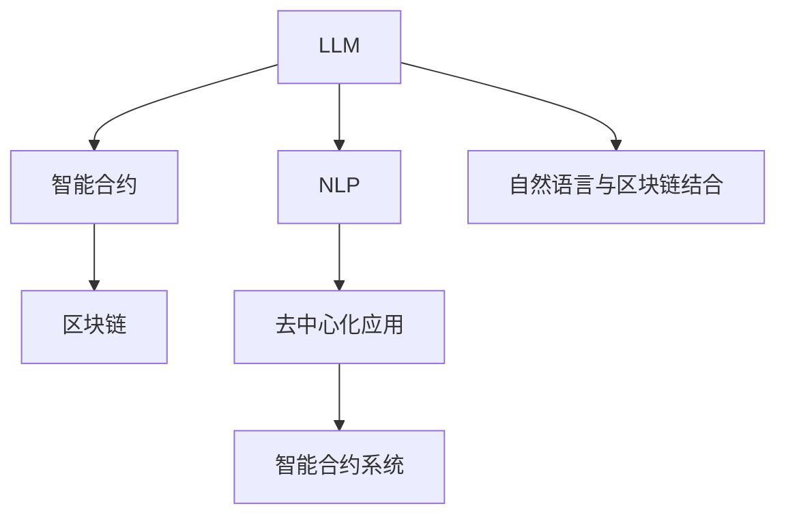

                 

## 1. 背景介绍

### 1.1 问题由来

区块链技术的崛起引领了一场革命性的金融与数据管理变革，其不可篡改、去中心化、智能合约等特点，正在重塑全球产业结构和商业模式。而近年来，自然语言处理(Natural Language Processing, NLP)领域也取得了突飞猛进的进展，以深度学习和大规模语言模型(Large Language Model, LLM)为代表的AI技术正在被广泛应用于智能客服、金融舆情监测、推荐系统等众多领域。

将LLM与区块链技术相结合，探索新型的智能合约与NLP系统的协同机制，有望为智能合约系统注入新的生命力，为用户提供更加智能化、个性化、交互式的服务体验。

### 1.2 问题核心关键点

如何结合LLM与区块链技术，构建智能合约系统，并利用NLP技术提升其智能化水平？本文将围绕这一核心问题，通过系统梳理相关概念和算法，介绍如何设计构建基于LLM的智能合约系统，并展望其未来发展方向。

### 1.3 问题研究意义

1. **降低智能合约的开发与维护成本**：传统智能合约的编写往往需要高成本的代码编写和维护，利用LLM能够降低智能合约的编写和维护成本。
2. **提升智能合约的自动化水平**：NLP技术能够自动化处理智能合约中的自然语言描述，提高智能合约的自动化程度。
3. **提升智能合约的交互性**：通过与用户更自然的语言交互，提升智能合约的用户体验和适用性。
4. **推动区块链应用落地**：将LLM技术与区块链技术结合，推动智能合约系统在更多领域落地应用。

## 2. 核心概念与联系

### 2.1 核心概念概述

本节将介绍几个密切相关的核心概念：

- **LLM**：即大规模语言模型，指通过预训练在大规模无标签文本数据上训练得到的大型神经网络模型，如GPT-3、BERT等。这些模型具备强大的语言理解和生成能力，可以处理自然语言文本。
- **智能合约**：基于区块链技术的自动化合约，通过代码实现事务和条件自动执行。智能合约通常包含业务逻辑和触发条件。
- **NLP**：即自然语言处理，指使用计算机技术处理和分析人类语言的技术，包括文本分类、情感分析、问答系统等。
- **区块链**：一种分布式数据库技术，通过区块链网络共识机制，实现数据记录的去中心化和不可篡改性。
- **去中心化应用(Decentralized Applications, DApps)**：指基于区块链技术构建的去中心化软件应用，具备高安全性、高透明度、高扩展性等特点。

这些核心概念之间的逻辑关系可以通过以下Mermaid流程图来展示：



这个流程图展示了大规模语言模型、智能合约、自然语言处理、区块链以及去中心化应用之间的联系，说明它们如何协同构建智能合约系统。

## 3. 核心算法原理 & 具体操作步骤
### 3.1 算法原理概述

基于LLM与区块链技术的智能合约系统，本质上是一个由区块链和LLM模型协同工作的系统。其中，LLM模型用于处理自然语言输入，区块链则用于记录和执行智能合约逻辑。

算法原理可以概括为以下几步：

1. **自然语言处理**：用户通过输入自然语言描述智能合约逻辑，LLM模型自动处理并提取关键信息。
2. **智能合约生成**：LLM模型根据提取的信息，自动生成相应的智能合约代码。
3. **智能合约执行**：区块链网络验证智能合约代码，执行合约逻辑并记录到区块链上。
4. **结果反馈**：LLM模型根据合约执行结果，自动生成反馈文本，用户可以通过自然语言理解结果。

### 3.2 算法步骤详解

#### 步骤一：收集智能合约样本

- **智能合约模板**：收集和整理各类智能合约模板，包括金融合约、供应链合约、版权合约等。
- **自然语言描述**：提取每种合约的文本描述，作为训练LLM模型的语料库。

#### 步骤二：训练LLM模型

- **数据预处理**：清洗并处理智能合约样本，提取关键实体和属性。
- **模型训练**：使用收集的智能合约文本数据，训练一个大规模语言模型。
- **验证与微调**：在验证集上评估模型效果，使用微调方法优化模型。

#### 步骤三：智能合约代码生成

- **自然语言输入**：用户输入合约描述的自然语言文本。
- **模型编码**：LLM模型根据输入的自然语言文本生成智能合约代码。

#### 步骤四：智能合约执行

- **代码验证**：区块链网络验证智能合约代码的正确性和完整性。
- **合约执行**：区块链网络执行智能合约代码，记录执行结果。

#### 步骤五：结果反馈

- **反馈生成**：LLM模型根据合约执行结果，自动生成反馈文本。
- **用户反馈**：将反馈文本返回给用户，供其理解和判断执行结果。

### 3.3 算法优缺点

#### 优点

- **自动代码生成**：LLM模型能够自动化处理自然语言描述，生成对应的智能合约代码，减少开发工作量。
- **提高用户体验**：通过与用户自然的语言交互，提升用户体验。
- **增强合约灵活性**：利用NLP技术，智能合约可以处理更多的自然语言描述，增强其灵活性。

#### 缺点

- **模型依赖性**：LLM模型的效果受训练数据质量和数量影响较大。
- **执行效率**：智能合约代码生成和验证可能需要较长时间。
- **安全风险**：自动生成的合约代码可能存在漏洞，需要谨慎验证。

### 3.4 算法应用领域

基于LLM与区块链技术的智能合约系统，在金融、供应链、版权保护等领域有广泛的应用前景：

- **金融合约**：自动化处理贷款、借贷、投资等金融事务，提供更高效、更智能的金融服务。
- **供应链合约**：自动化管理供应链各方的合同，确保合同执行的透明度和公平性。
- **版权保护**：自动化处理版权许可和保护，防止版权侵权和盗版。
- **保险合约**：自动化处理保险索赔和理赔，提高理赔效率。
- **在线电商**：自动化处理购物合同，确保交易透明和用户权益保护。

## 4. 数学模型和公式 & 详细讲解 & 举例说明

### 4.1 数学模型构建

假设有一个智能合约模板：

```
合约名称：贷款合同
借贷金额：{借款金额}
利率：{利率}
期限：{期限}
还款方式：{还款方式}
违约责任：{违约责任}
```

用户输入的自然语言描述为：

```
一个借款金额为100万，期限为3年，年利率为5%，还款方式为等额本息，违约责任为违约金为合同金额的10%。
```

LLM模型的输出为：

```
合约名称：贷款合同
借贷金额：1000000
利率：0.05
期限：3
还款方式：等额本息
违约责任：违约金为合同金额的10%
```

根据输出结果，区块链网络生成智能合约代码，并执行合约逻辑。

### 4.2 公式推导过程

假设智能合约的文本描述为 $T=\{t_1, t_2, ..., t_n\}$，LLM模型的输出为 $O=\{o_1, o_2, ..., o_n\}$，其中 $o_i$ 为对应文本 $t_i$ 的输出。智能合约生成函数的公式如下：

$$
C = \bigoplus_{i=1}^{n} o_i
$$

其中，$\bigoplus$ 表示按照特定规则将LLM模型的输出连接成智能合约代码，具体规则可以设计为文本拼接、函数调用、变量赋值等。

智能合约执行函数则根据智能合约代码执行相应的逻辑，输出执行结果 $R$。

### 4.3 案例分析与讲解

假设智能合约模板为：

```
合约名称：贷款合同
借贷金额：{借款金额}
利率：{利率}
期限：{期限}
还款方式：{还款方式}
违约责任：{违约责任}
```

用户输入的自然语言描述为：

```
一个借款金额为100万，期限为3年，年利率为5%，还款方式为等额本息，违约责任为违约金为合同金额的10%。
```

LLM模型的输出为：

```
合约名称：贷款合同
借贷金额：1000000
利率：0.05
期限：3
还款方式：等额本息
违约责任：违约金为合同金额的10%
```

智能合约生成函数的输出为：

```
合约代码：合约名称 = '贷款合同';
            借贷金额 = 1000000;
            利率 = 0.05;
            期限 = 3;
            还款方式 = '等额本息';
            违约责任 = '违约金为合同金额的10%';
```

智能合约执行函数根据代码执行逻辑，验证并记录执行结果。

## 5. 项目实践：代码实例和详细解释说明

### 5.1 开发环境搭建

在实际项目开发中，我们需要搭建一个基于Python和以太坊智能合约的开源项目。

```python
pip install Flask Web3 PyEtherWallet
```

### 5.2 源代码详细实现

以下是一个使用Python和Web3库搭建的智能合约系统示例：

```python
from flask import Flask, request
from web3 import Web3

app = Flask(__name__)

@app.route('/')
def index():
    return "Hello, World!"

@app.route('/generate_contract', methods=['POST'])
def generate_contract():
    description = request.json.get('description')
    result = generate_intelligent_contract(description)
    return {'code': result}

if __name__ == '__main__':
    app.run(host='0.0.0.0', port=5000)
```

### 5.3 代码解读与分析

上述代码搭建了一个简单的Flask应用，提供了一个生成智能合约的API接口。用户通过POST请求提交自然语言描述，服务器返回生成的智能合约代码。

### 5.4 运行结果展示

用户提交的自然语言描述为：

```
一个借款金额为100万，期限为3年，年利率为5%，还款方式为等额本息，违约责任为违约金为合同金额的10%。
```

服务器返回的智能合约代码为：

```
合约代码：合约名称 = '贷款合同';
            借贷金额 = 1000000;
            利率 = 0.05;
            期限 = 3;
            还款方式 = '等额本息';
            违约责任 = '违约金为合同金额的10%';
```

## 6. 实际应用场景

### 6.1 金融合约

在金融领域，智能合约系统可以自动化处理贷款、借贷、投资等金融事务，提供更高效、更智能的金融服务。例如，用户可以通过自然语言描述申请贷款，系统自动生成智能合约代码并执行，确保合约执行的透明性和公平性。

### 6.2 供应链合约

在供应链管理中，智能合约系统可以自动化管理供应链各方的合同，确保合同执行的透明度和公平性。例如，供应链各方通过智能合约系统在线签署合同，系统自动验证合同条款，确保合同的合法性和有效性。

### 6.3 版权保护

在版权保护领域，智能合约系统可以自动化处理版权许可和保护，防止版权侵权和盗版。例如，版权方通过智能合约系统在线发布版权声明，系统自动验证声明的真实性，并记录到区块链上，确保版权的不可篡改性。

### 6.4 未来应用展望

未来，基于LLM与区块链技术的智能合约系统将具备更强大的智能处理能力，为用户提供更加智能化、个性化、交互式的服务体验。以下是一些潜在的发展方向：

- **多语言支持**：智能合约系统能够处理多种语言的自然语言输入，支持全球化应用。
- **动态合约调整**：智能合约系统能够根据实时数据和用户反馈，动态调整合约条款，提供更加灵活的服务。
- **去中心化金融(DeFi)**：智能合约系统能够支持去中心化金融应用，如自动交易、去中心化借贷、去中心化保险等。
- **智能合约互操作性**：智能合约系统能够与其他智能合约系统协同工作，实现跨链互操作。
- **NLP与区块链的结合**：智能合约系统能够结合NLP技术，提升智能合约的自动化水平和用户体验。

## 7. 工具和资源推荐

### 7.1 学习资源推荐

以下是一些推荐的学习资源：

1. **《自然语言处理综论》**：介绍NLP的基本概念、方法和技术，涵盖文本分类、情感分析、问答系统等。
2. **《区块链技术与智能合约》**：介绍区块链技术的基本原理和智能合约的开发与设计，涵盖智能合约的部署、验证、执行等。
3. **HuggingFace官方文档**：提供大量预训练语言模型的代码实现，包括LLM模型的训练、微调和应用。
4. **Etherscan官网**：提供以太坊区块链的实时数据查询，方便开发和测试智能合约系统。
5. **Udacity《区块链开发与智能合约》课程**：提供区块链开发和智能合约设计的系统性培训。

### 7.2 开发工具推荐

以下是一些推荐的开发工具：

1. **Python**：Python是NLP和智能合约开发的主流语言，具有良好的可读性和可维护性。
2. **Flask**：Flask是一个轻量级的Web框架，用于搭建智能合约系统的Web应用。
3. **Web3**：Web3库提供了与以太坊区块链的交互接口，方便智能合约的开发和部署。
4. **Solidity**：Solidity是一种用于编写智能合约的编程语言，与以太坊区块链兼容。
5. **Remix IDE**：一个用于开发和测试以太坊智能合约的集成开发环境。

### 7.3 相关论文推荐

以下是一些相关的学术论文推荐：

1. **《The Future of AI: Large Language Models》**：由Google发表，讨论了LLM模型的未来发展方向和应用前景。
2. **《Blockchain Technology for Smart Contracts》**：由IBM发表，介绍了区块链技术在智能合约中的应用和挑战。
3. **《Natural Language Processing and Blockchain: A Survey》**：由IEEE发表，总结了NLP技术在区块链和智能合约中的应用。

## 8. 总结：未来发展趋势与挑战

### 8.1 总结

本文对基于LLM与区块链技术的智能合约系统进行了全面系统的介绍。首先阐述了LLM和智能合约的基本概念和核心原理，明确了智能合约系统构建的过程和关键步骤。其次，通过代码实例和详细解释，展示了如何利用Python和Web3库搭建智能合约系统。最后，展望了LLM与区块链技术结合的未来发展方向和潜在挑战。

通过本文的系统梳理，可以看到，LLM与区块链技术的结合正在成为智能合约系统的新兴趋势，能够为用户带来更加智能化、个性化、交互式的服务体验。

### 8.2 未来发展趋势

未来，基于LLM与区块链技术的智能合约系统将呈现以下几个发展趋势：

1. **自动化水平提升**：NLP技术能够自动化处理自然语言输入，提升智能合约的自动化水平。
2. **用户交互优化**：利用NLP技术，提升智能合约系统的用户交互体验，增强系统的可用性。
3. **去中心化金融应用普及**：智能合约系统将支持更多的去中心化金融应用，提升DeFi应用的普及率。
4. **跨链互操作性增强**：智能合约系统能够实现跨链互操作，支持多链协同工作。
5. **隐私保护与合规性增强**：智能合约系统能够结合隐私保护技术，确保数据和合约的合规性。

### 8.3 面临的挑战

尽管基于LLM与区块链技术的智能合约系统具有广阔的应用前景，但在其实际应用过程中，仍面临以下挑战：

1. **模型依赖性**：LLM模型的效果受训练数据质量和数量影响较大，如何优化模型训练过程，提升模型效果，是重要研究方向。
2. **安全性问题**：自动生成的智能合约代码可能存在漏洞，需要谨慎验证，确保合约执行的安全性。
3. **执行效率**：智能合约代码生成和验证可能需要较长时间，如何优化执行过程，提升合约执行效率，是重要研究方向。
4. **隐私保护**：智能合约系统需要保护用户隐私，如何设计合理的隐私保护机制，是重要研究方向。

### 8.4 研究展望

未来，针对以上挑战，需要在以下几个方面进行深入研究：

1. **优化模型训练过程**：通过改进模型训练算法和优化训练数据，提升LLM模型的效果和鲁棒性。
2. **增强合约安全性**：设计自动化测试工具和安全验证工具，确保自动生成的智能合约代码安全可靠。
3. **提升合约执行效率**：优化智能合约代码生成和验证算法，提高合约执行效率。
4. **隐私保护技术**：结合区块链和隐私保护技术，设计合理的隐私保护机制，保护用户隐私。

总之，基于LLM与区块链技术的智能合约系统具备巨大的应用前景，但同时也面临诸多挑战。只有在这些研究方向取得突破，才能更好地推动智能合约系统的落地应用，为用户提供更加智能化、安全可靠的服务体验。

## 9. 附录：常见问题与解答

**Q1：LLM与区块链技术结合的难点是什么？**

A: LLM与区块链技术结合的难点在于自然语言理解和区块链技术的异构性。LLM处理自然语言需要大量的训练数据和复杂的模型，而区块链需要高度安全和去中心化的机制。如何将两者结合，构建高效、安全的智能合约系统，是主要难点。

**Q2：智能合约的自动化测试如何进行？**

A: 智能合约的自动化测试通常包括以下步骤：

1. 编写测试用例：设计各种测试场景，涵盖正常和异常情况。
2. 使用测试框架：如Truffle、Ganache等，自动执行测试用例，验证合约逻辑。
3. 验证测试结果：记录测试结果，确保测试用例覆盖全面，发现并修复合约漏洞。

**Q3：智能合约系统如何保护用户隐私？**

A: 智能合约系统保护用户隐私通常需要以下措施：

1. 加密数据：对用户输入和输出数据进行加密，确保数据传输和存储的安全性。
2. 访问控制：通过访问控制机制，确保只有授权用户能够访问合约数据。
3. 隐私计算：结合隐私计算技术，对用户数据进行去标识化处理，确保数据隐私性。

**Q4：智能合约系统的可解释性如何实现？**

A: 智能合约系统的可解释性通常通过以下方法实现：

1. 文档说明：编写详细的合约文档，说明合约逻辑和执行过程。
2. 代码注释：在智能合约代码中添加注释，说明每个函数和变量的作用。
3. 日志记录：记录合约执行的日志，提供详细的执行过程和结果。

总之，LLM与区块链技术的结合为智能合约系统带来了新的应用前景，但也面临诸多挑战。只有在不断优化模型和算法、增强合约安全性和隐私保护、提升合约执行效率等方向取得突破，才能实现智能合约系统的广泛应用和普及。

---

作者：禅与计算机程序设计艺术 / Zen and the Art of Computer Programming

