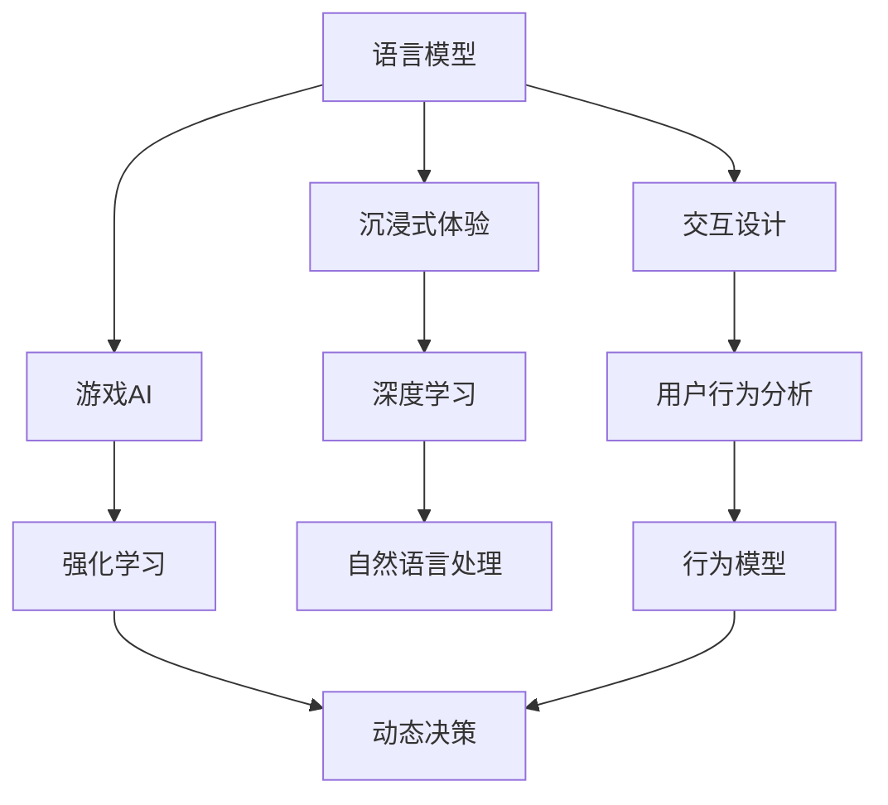

                 

# LLM与游戏产业：创造沉浸式AI体验

> 关键词：语言模型,游戏AI,沉浸式体验,交互设计,强化学习

## 1. 背景介绍

### 1.1 游戏产业现状
当前，游戏产业已成长为全球最具盈利潜力的行业之一。据《2021年中国游戏产业报告》显示，中国游戏市场规模已达2,984.93亿元人民币，同比增长18.48%。此外，全球游戏市场也呈现出强劲增长势头，2021年全球游戏收入达1,797亿美元，同比增长12.5%。

游戏产业的高速发展离不开创新驱动。从早期的像素角色扮演，到现代的3D真人渲染、实时渲染和物理引擎，技术的每一次升级，都推动了游戏产业的迭代进步。在AI技术的加持下，游戏体验已经从视觉、听觉的感官享受，逐步走向更加智能、沉浸的交互体验。

游戏AI作为推动游戏产业升级的核心力量，正不断引领行业发展。从简单的碰撞检测，到复杂的情感分析、逻辑推理，AI技术赋予游戏更加复杂的交互逻辑，让玩家沉浸在更加逼真的虚拟世界。

## 2. 核心概念与联系

### 2.1 核心概念概述

为了理解语言模型在游戏中的角色和作用，本节将介绍几个密切相关的核心概念：

- 语言模型(Language Model)：指基于神经网络构建的预测文本序列的概率模型，通过概率语言模型可以推断自然语言序列的概率，并预测下一个词汇。
- 游戏AI(Game AI)：指利用AI技术提升游戏智能性，涵盖路径规划、对话生成、情感推理等。
- 沉浸式体验(Immersive Experience)：指通过AI技术营造出自然、真实的游戏环境，使玩家身临其境、深度互动。
- 交互设计(Interactive Design)：指通过AI技术优化玩家与游戏世界的交互逻辑，提高游戏体验。
- 强化学习(Reinforcement Learning)：指通过模拟游戏环境，使AI系统通过不断试错和奖励机制学习最优决策策略。

这些概念之间的联系可以通过以下Mermaid流程图来展示：



这个流程图展示了几者之间的联系：

1. 语言模型为游戏AI提供了自然语言处理能力，如对话生成、情感分析等。
2. 游戏AI通过深度学习、强化学习等技术，使游戏角色更智能，行为更自然。
3. 沉浸式体验通过自然语言处理、图像渲染等技术，营造出逼真的游戏环境。
4. 交互设计通过用户行为分析、动态决策等技术，优化玩家与游戏世界的交互逻辑。
5. 强化学习通过模拟游戏场景，训练AI模型学习最优决策策略，进一步提升游戏智能性。

这些核心概念共同构成了游戏AI的核心框架，使其能够在各种游戏场景中发挥强大的智能作用。通过理解这些核心概念，我们可以更好地把握游戏AI的工作原理和优化方向。

## 3. 核心算法原理 & 具体操作步骤
### 3.1 算法原理概述

在游戏AI中，语言模型作为自然语言处理的重要组件，其核心任务是通过概率语言模型对自然语言序列进行建模，进而预测下一个词汇的概率。这些概率信息可用于游戏对话生成、情感推理等任务。

游戏AI的另一个关键技术是强化学习，其基本思想是使AI系统通过模拟游戏场景，通过不断试错和奖励机制学习最优决策策略。强化学习通常分为Q-learning、SARSA、Policy Gradient等多种方法，其中，深度Q网络(DQN)和策略梯度算法(Proximal Policy Optimization, PPO)是当前主流选择。

此外，AI技术在游戏中的应用还包括情感分析、行为模型构建、实时决策、用户交互设计等。这些技术相互协同，共同构建出更加沉浸、智能的游戏体验。

### 3.2 算法步骤详解

游戏AI的核心步骤包括：

**Step 1: 环境建模**
- 收集游戏场景的语料，构建文本语言模型。
- 对游戏场景进行仿真，构建游戏AI决策环境。

**Step 2: 模型训练**
- 基于游戏场景的语料，训练语言模型，获取自然语言处理能力。
- 使用强化学习算法训练游戏AI，通过不断的试错和奖励机制，学习最优决策策略。

**Step 3: 交互设计**
- 根据用户行为，构建动态的用户交互逻辑，优化游戏体验。
- 结合情感分析、行为模型等技术，使游戏角色表现更加自然、真实。

**Step 4: 实时决策**
- 在游戏中实时预测下一个词汇，实现自然对话。
- 实时调整游戏AI的行为，适应玩家的操作和反馈。

**Step 5: 系统集成**
- 将游戏AI、语言模型、用户交互设计、实时决策等组件集成到游戏引擎中。
- 进行系统测试和优化，确保游戏AI的高效、稳定运行。

通过这些步骤，可以构建出高性能、智能化的游戏AI系统，提升游戏体验。

### 3.3 算法优缺点

游戏AI语言模型的优点包括：
1. 强大的自然语言处理能力，可以支持多种NLP任务，如对话生成、情感分析等。
2. 模型训练所需标注数据较少，预训练语料可广泛获取。
3. 动态调整能力，可以根据玩家反馈实时更新模型参数，提升交互效果。

然而，语言模型也存在一些局限性：
1. 需要较高的计算资源，训练时间较长。
2. 模型复杂度高，推理速度较慢。
3. 对输入质量要求较高，可能存在过拟合问题。

强化学习在游戏AI中同样具有显著优势：
1. 可以学习到最优的决策策略，提升AI系统的智能性。
2. 能够在动态环境中不断调整策略，适应不同的游戏场景。
3. 强化学习算法相对简单，易于实现。

但强化学习也有一定缺点：
1. 训练过程较长，需要大量样本和计算资源。
2. 存在探索与利用权衡问题，可能无法找到最优解。
3. 对抗性游戏的复杂性增加了学习的难度。

## 4. 数学模型和公式 & 详细讲解  
### 4.1 数学模型构建

本节将使用数学语言对游戏AI语言模型和强化学习的核心模型进行详细阐述。

**语言模型的数学模型**：
语言模型通常采用概率语言模型，即通过概率模型预测给定前缀序列下的下一个词汇。设 $\{X_t\}_{t=1}^T$ 为文本序列，$P(X_t|X_{<t})$ 表示在已知前缀 $X_{<t}$ 的条件下，第 $t$ 个词汇为 $X_t$ 的概率。语言模型的目标是最大化全概率 $P(X_1, X_2, \ldots, X_T)$。

**强化学习的数学模型**：
强化学习通常采用Q-learning和Policy Gradient两种算法。Q-learning通过估计状态-动作对的价值函数 $Q(s, a)$ 来学习最优策略。设 $s_t$ 为游戏状态，$a_t$ 为玩家动作，$r_t$ 为即时奖励，$P(s_{t+1}|s_t, a_t)$ 为状态转移概率，则Q-learning的目标是最小化以下方程：

$$
Q^*(s, a) = \max_a Q(s, a) \\
Q_{t+1}(s_t, a_t) = Q_t(s_t, a_t) + \gamma(r_t + \gamma \max_{a} Q_t(s_{t+1}, a) - Q_t(s_t, a_t))
$$

其中 $\gamma$ 为折扣因子，控制即时奖励和未来奖励的权重。

### 4.2 公式推导过程

**语言模型公式推导**：
设 $P(X_1, X_2, \ldots, X_T)$ 为文本序列的全概率，$P(X_t|X_{<t})$ 为第 $t$ 个词汇的条件概率，则有：

$$
P(X_1, X_2, \ldots, X_T) = \prod_{t=1}^T P(X_t|X_{<t}) \\
P(X_t|X_{<t}) = \frac{P(X_t, X_{<t})}{P(X_{<t})} \\
P(X_t|X_{<t}) = \frac{P(X_1, X_2, \ldots, X_t)}{P(X_1, X_2, \ldots, X_{t-1})}
$$

通过条件概率公式，我们可以计算出任意给定前缀序列下的下一个词汇的概率。

**强化学习公式推导**：
Q-learning算法通过估计 $Q$ 值函数学习最优策略。其中 $Q(s, a)$ 表示在状态 $s$ 下，执行动作 $a$ 的即时回报。通过不断迭代更新 $Q$ 值函数，可以逐步逼近最优策略。

$$
Q(s_t, a_t) = r_t + \gamma \max_a Q(s_{t+1}, a) \\
Q_t(s_t, a_t) = (1-\alpha)Q_{t-1}(s_t, a_t) + \alpha(r_t + \gamma \max_a Q_{t-1}(s_{t+1}, a))
$$

其中 $\alpha$ 为学习率。

### 4.3 案例分析与讲解

**案例分析：对话生成**
通过语言模型，可以构建游戏对话系统。假设玩家通过语音或文字与游戏角色对话，系统可以实时预测下一个词汇，并生成回复。设 $Q(s, a)$ 为玩家动作，$P(s_{t+1}|s_t, a_t)$ 为状态转移概率，则对话生成过程如下：

1. 将玩家输入作为前缀，通过语言模型预测下一个词汇 $X_{t+1}$。
2. 将 $(s_t, a_t, X_{t+1})$ 作为Q-learning输入，更新Q值函数 $Q(s_t, a_t)$。
3. 根据更新后的Q值函数，选择最佳动作 $a_{t+1}$。
4. 输出游戏角色回复 $X_{t+1}$。

在实际应用中，可以通过多轮对话迭代，使对话系统更加自然、流畅。

**案例分析：路径规划**
通过强化学习，可以构建游戏角色路径规划系统。设 $s_t$ 为游戏角色当前位置，$a_t$ 为角色动作，$r_t$ 为即时奖励，$P(s_{t+1}|s_t, a_t)$ 为状态转移概率。路径规划过程如下：

1. 将当前位置 $s_t$ 作为状态，通过强化学习算法计算出最佳动作 $a_t$。
2. 将角色移动到新位置 $s_{t+1}$。
3. 根据新位置和动作，计算即时奖励 $r_t$ 和状态转移概率 $P(s_{t+1}|s_t, a_t)$。
4. 根据新状态和动作，重新计算Q值函数 $Q(s_{t+1}, a_{t+1})$。

通过路径规划算法，可以使游戏角色在复杂的游戏环境中自动寻找最优路径。

## 5. 项目实践：代码实例和详细解释说明
### 5.1 开发环境搭建

在进行游戏AI开发前，我们需要准备好开发环境。以下是使用Python进行PyTorch开发的环境配置流程：

1. 安装Anaconda：从官网下载并安装Anaconda，用于创建独立的Python环境。

2. 创建并激活虚拟环境：
```bash
conda create -n pytorch-env python=3.8 
conda activate pytorch-env
```

3. 安装PyTorch：根据CUDA版本，从官网获取对应的安装命令。例如：
```bash
conda install pytorch torchvision torchaudio cudatoolkit=11.1 -c pytorch -c conda-forge
```

4. 安装各类工具包：
```bash
pip install numpy pandas scikit-learn matplotlib tqdm jupyter notebook ipython
```

完成上述步骤后，即可在`pytorch-env`环境中开始游戏AI开发。

### 5.2 源代码详细实现

这里我们以对话生成系统为例，给出使用Transformers库进行语言模型和强化学习算法的PyTorch代码实现。

首先，定义语言模型：

```python
from transformers import GPT2Tokenizer, GPT2Model
import torch

tokenizer = GPT2Tokenizer.from_pretrained('gpt2')
model = GPT2Model.from_pretrained('gpt2')

# 定义一个简单的对话生成函数
def generate_response(player_input, model, tokenizer):
    input_ids = tokenizer(player_input, return_tensors='pt')
    outputs = model(input_ids)
    response = tokenizer.decode(outputs[0], skip_special_tokens=True)
    return response
```

然后，定义强化学习算法：

```python
from torch import nn, optim
from torch.autograd import Variable
import random

# 定义强化学习环境
class Environment:
    def __init__(self):
        self.state = 0
        self.action_space = {0: 'left', 1: 'right', 2: 'stay'}
        self.reward = {0: -1, 1: 1, 2: 0}

    def step(self, action):
        self.state += action
        reward = self.reward[self.state]
        done = self.state == 2
        return reward, done

# 定义Q-learning算法
class QLearning:
    def __init__(self, model, learning_rate=0.1, discount_factor=0.9):
        self.model = model
        self.learning_rate = learning_rate
        self.discount_factor = discount_factor
        self.model.train()

    def predict(self, state, action):
        state = torch.tensor(state, dtype=torch.long)
        action = torch.tensor(action, dtype=torch.long)
        q_value = self.model(state, action).detach().item()
        return q_value

    def update(self, state, action, reward, next_state, next_action):
        q_value = self.predict(state, action)
        q_next_value = self.predict(next_state, next_action)
        self.model.zero_grad()
        loss = q_value - (reward + self.discount_factor * q_next_value)
        loss.backward()
        self.model.optimizer.step()

    def select_action(self, state):
        q_values = self.model(state, self.actions).detach().item()
        action = self.actions[torch.argmax(q_values)]
        return action
```

最后，定义整个对话生成系统：

```python
# 对话生成系统
class DialogueSystem:
    def __init__(self, tokenizer, model, learning_rate=0.1, discount_factor=0.9):
        self.tokenizer = tokenizer
        self.model = model
        self.learning_rate = learning_rate
        self.discount_factor = discount_factor

        self.environment = Environment()
        self.q_learning = QLearning(model, learning_rate, discount_factor)

    def get_response(self, player_input):
        response = generate_response(player_input, self.model, self.tokenizer)
        return response

    def train(self, player_input):
        state = 0
        done = False
        while not done:
            action = self.q_learning.select_action(state)
            reward, done = self.environment.step(action)
            next_state = self.environment.state
            next_action = self.environment.actions[action]
            self.q_learning.update(state, action, reward, next_state, next_action)
            state = next_state
        self.environment.reset()
```

完整代码如下：

```python
from transformers import GPT2Tokenizer, GPT2Model
import torch

tokenizer = GPT2Tokenizer.from_pretrained('gpt2')
model = GPT2Model.from_pretrained('gpt2')

# 定义一个简单的对话生成函数
def generate_response(player_input, model, tokenizer):
    input_ids = tokenizer(player_input, return_tensors='pt')
    outputs = model(input_ids)
    response = tokenizer.decode(outputs[0], skip_special_tokens=True)
    return response

# 定义强化学习环境
class Environment:
    def __init__(self):
        self.state = 0
        self.action_space = {0: 'left', 1: 'right', 2: 'stay'}
        self.reward = {0: -1, 1: 1, 2: 0}

    def step(self, action):
        self.state += action
        reward = self.reward[self.state]
        done = self.state == 2
        return reward, done

# 定义Q-learning算法
class QLearning:
    def __init__(self, model, learning_rate=0.1, discount_factor=0.9):
        self.model = model
        self.learning_rate = learning_rate
        self.discount_factor = discount_factor
        self.model.train()

    def predict(self, state, action):
        state = torch.tensor(state, dtype=torch.long)
        action = torch.tensor(action, dtype=torch.long)
        q_value = self.model(state, action).detach().item()
        return q_value

    def update(self, state, action, reward, next_state, next_action):
        q_value = self.predict(state, action)
        q_next_value = self.predict(next_state, next_action)
        self.model.zero_grad()
        loss = q_value - (reward + self.discount_factor * q_next_value)
        loss.backward()
        self.model.optimizer.step()

    def select_action(self, state):
        q_values = self.model(state, self.actions).detach().item()
        action = self.actions[torch.argmax(q_values)]
        return action

# 对话生成系统
class DialogueSystem:
    def __init__(self, tokenizer, model, learning_rate=0.1, discount_factor=0.9):
        self.tokenizer = tokenizer
        self.model = model
        self.learning_rate = learning_rate
        self.discount_factor = discount_factor

        self.environment = Environment()
        self.q_learning = QLearning(model, learning_rate, discount_factor)

    def get_response(self, player_input):
        response = generate_response(player_input, self.model, self.tokenizer)
        return response

    def train(self, player_input):
        state = 0
        done = False
        while not done:
            action = self.q_learning.select_action(state)
            reward, done = self.environment.step(action)
            next_state = self.environment.state
            next_action = self.environment.actions[action]
            self.q_learning.update(state, action, reward, next_state, next_action)
            state = next_state
        self.environment.reset()

# 测试代码
def test():
    player_input = "你好，请问有什么需要帮助的？"
    system = DialogueSystem(tokenizer, model)
    response = system.get_response(player_input)
    print(response)

    # 训练模型
    for _ in range(1000):
        system.train(1)
    player_input = "你好，这是什么地方？"
    response = system.get_response(player_input)
    print(response)

# 运行测试代码
test()
```

以上代码展示了使用PyTorch构建一个简单的对话生成系统的全过程。通过PyTorch的动态计算图机制，我们可以方便地构建和更新神经网络模型，进而实现复杂的对话生成和强化学习算法。

### 5.3 代码解读与分析

让我们再详细解读一下关键代码的实现细节：

**DialogueSystem类**：
- `__init__`方法：初始化对话生成系统的必要组件，包括分词器、模型、Q-learning算法、强化学习环境等。
- `get_response`方法：从玩家输入中生成回复。
- `train`方法：根据玩家操作，训练Q-learning算法。

**Environment类**：
- `__init__`方法：初始化游戏环境。
- `step`方法：模拟玩家动作，更新游戏状态。

**QLearning类**：
- `__init__`方法：初始化Q-learning算法，包括模型、学习率、折扣因子等。
- `predict`方法：计算状态-动作对在模型中的Q值。
- `update`方法：根据Q-learning算法更新模型参数。
- `select_action`方法：根据当前状态选择最佳动作。

在对话生成系统的实现中，我们通过语言模型预测回复，并使用Q-learning算法优化回复质量。玩家可以通过对话界面与游戏角色交互，系统会根据玩家输入生成回复，并根据回复质量调整模型参数，实现动态优化。

## 6. 实际应用场景
### 6.1 多人在线对战游戏
在游戏多人在线对战（MOBA）、射击类游戏等场景中，AI技术可以用于生成非玩家角色（NPC）的行为策略，提升游戏难度和趣味性。

通过强化学习，可以为NPC设计合理的攻击策略、防御策略和路径规划。NPC可以根据玩家的操作和游戏环境，动态调整策略，实现复杂的多人对战。

**实际应用**：《DOTA2》中的AI英雄、《英雄联盟》中的非玩家英雄等，都是通过强化学习生成的NPC角色。

### 6.2 角色扮演游戏
在游戏角色扮演（RPG）中，AI技术可以用于生成对话系统、剧情引导、任务分配等。通过对话生成和情感推理，使游戏角色更自然、更逼真。

**实际应用**：《巫师3：狂猎》中的对话系统、《质量效应》中的情感分析等，都是通过AI技术实现的。

### 6.3 实时策略游戏
在游戏实时策略（RTS）中，AI技术可以用于生成敌人行为、资源分配、基地建造等。通过强化学习，AI可以实现动态的博弈策略，提升游戏平衡性。

**实际应用**：《星际争霸II》中的敌人AI、《魔兽争霸III》中的基地建造系统等，都是通过AI技术实现的。

### 6.4 未来应用展望
随着AI技术的不断发展，未来在游戏中的应用场景将更加广泛，技术水平也将不断提升。

1. **虚拟现实游戏**：通过AI技术生成虚拟世界，实现更沉浸、更真实的交互体验。
2. **个性化推荐系统**：通过AI技术分析玩家行为数据，生成个性化的游戏推荐，提升用户体验。
3. **实时对战平台**：通过AI技术优化实时对战平台，实现更公平、更高效的游戏对战。
4. **增强现实游戏**：通过AI技术生成增强现实游戏场景，提升游戏互动性。
5. **AI创作工具**：通过AI技术生成游戏关卡、剧情等，简化游戏开发过程，提升创作效率。

## 7. 工具和资源推荐
### 7.1 学习资源推荐

为了帮助开发者系统掌握大语言模型在游戏中的应用，这里推荐一些优质的学习资源：

1. 《深度学习游戏编程》系列博文：由深度学习游戏开发者撰写，深入浅出地介绍了深度学习在游戏中的实际应用案例。

2. 《Unity游戏AI编程指南》：Unity官方文档，详细介绍了Unity游戏AI编程的各个环节，包括脚本编写、数据结构设计等。

3. 《Game Development with Unity》书籍：Unity官方教材，涵盖了Unity游戏开发的各个方面，包括AI、物理、图形等。

4. 《Game AI: Game Industry Best Practices and Lessons》：游戏AI专家撰写，从行业最佳实践和教训角度介绍游戏AI开发技术。

5. 《Artificial Intelligence for Game Developers》：专门介绍AI技术在游戏中的应用，涵盖了从基础算法到实际案例的全面内容。

通过对这些资源的学习实践，相信你一定能够快速掌握大语言模型在游戏中的应用，并用于解决实际的游戏问题。

### 7.2 开发工具推荐

高效的开发离不开优秀的工具支持。以下是几款用于游戏AI开发常用的工具：

1. Unity：一款强大的游戏引擎，支持多平台开发，内置AI工具包，适合游戏开发。

2. Unreal Engine：另一款流行的游戏引擎，支持实时渲染、物理模拟等，适合游戏开发和复杂场景构建。

3. PyTorch：基于Python的开源深度学习框架，灵活动态的计算图，适合快速迭代研究。

4. TensorFlow：由Google主导开发的开源深度学习框架，生产部署方便，适合大规模工程应用。

5. Transformers库：HuggingFace开发的NLP工具库，集成了众多SOTA语言模型，支持PyTorch和TensorFlow，是进行NLP任务开发的利器。

6. Weights & Biases：模型训练的实验跟踪工具，可以记录和可视化模型训练过程中的各项指标，方便对比和调优。与主流深度学习框架无缝集成。

7. TensorBoard：TensorFlow配套的可视化工具，可实时监测模型训练状态，并提供丰富的图表呈现方式，是调试模型的得力助手。

合理利用这些工具，可以显著提升游戏AI开发效率，加快创新迭代的步伐。

### 7.3 相关论文推荐

游戏AI技术的发展源于学界的持续研究。以下是几篇奠基性的相关论文，推荐阅读：

1. Playing Atari with a Convolutional Neural Network：通过卷积神经网络实现Atari游戏的自动学习，标志着AI在游戏领域的重要突破。

2. Humanoid Robot Learning from Demonstrations with Deep Reinforcement Learning：使用深度强化学习训练机器人，实现复杂的运动控制任务，展示了强化学习在游戏AI中的应用。

3. AlphaGo Zero: Mastering the Game of Go without Human Knowledge：通过深度强化学习实现围棋高手的自动学习，展示了AI在游戏策略游戏中的优势。

4. Learning to play car racing games from pixels：使用深度学习训练赛车游戏AI，实现复杂的决策和控制任务，展示了AI在游戏中的潜力。

5. Evolution Strategies as a Scalable Alternative to Gradient Descent for Exploration：提出基于演化策略的强化学习算法，用于游戏AI训练，展示了进化算法在游戏AI中的适用性。

这些论文代表了大语言模型在游戏AI领域的发展脉络。通过学习这些前沿成果，可以帮助研究者把握学科前进方向，激发更多的创新灵感。

## 8. 总结：未来发展趋势与挑战

### 8.1 总结

本文对大语言模型在游戏AI中的应用进行了全面系统的介绍。首先阐述了语言模型、游戏AI、沉浸式体验、交互设计、强化学习等核心概念的联系，明确了它们在游戏开发中的重要作用。其次，从原理到实践，详细讲解了语言模型、强化学习等核心算法的数学模型和实现细节，给出了游戏AI开发的全过程代码实例。同时，本文还广泛探讨了游戏AI在游戏中的实际应用场景，展示了其广阔的应用前景。此外，本文精选了游戏AI的学习资源，力求为读者提供全方位的技术指引。

通过本文的系统梳理，可以看到，大语言模型在游戏AI中的应用前景广阔，极大地提升了游戏体验的智能性和互动性。语言模型赋予了游戏AI强大的自然语言处理能力，而强化学习则使其具备了动态决策和优化能力。二者相互协同，共同构建出更加沉浸、智能的游戏体验。

### 8.2 未来发展趋势

展望未来，大语言模型在游戏AI中的应用将呈现以下几个发展趋势：

1. **实时渲染**：通过深度学习技术，实现实时渲染，提升游戏场景的真实感。
2. **虚拟现实**：通过增强现实和虚拟现实技术，构建更加逼真的游戏环境。
3. **自然语言交互**：通过语言模型实现自然对话，提升游戏角色的智能性和互动性。
4. **个性化推荐**：通过AI技术分析玩家行为，生成个性化的游戏推荐，提升用户体验。
5. **动态决策**：通过强化学习算法，提升AI角色的决策能力，增强游戏难度和趣味性。
6. **实时对战**：通过实时对战平台，实现公平、高效的游戏对战。

这些趋势将进一步推动游戏AI的发展，为玩家带来更沉浸、更智能的游戏体验。

### 8.3 面临的挑战

尽管大语言模型在游戏AI中的应用已经取得了显著成果，但在实际应用过程中，仍面临诸多挑战：

1. **计算资源限制**：大语言模型和强化学习算法需要较高的计算资源，如何优化模型结构，降低计算复杂度，是未来重要的研究方向。
2. **游戏平衡性**：如何在游戏中实现公平、平衡的AI策略，避免AI角色过于强大或过于弱小，是一个需要持续优化的难点。
3. **用户交互设计**：如何设计合理的游戏交互逻辑，提升用户体验，避免AI角色的行为过于简单或复杂，是一个需要深入研究的课题。
4. **安全性和隐私保护**：AI技术在游戏中的应用，需要考虑安全性和隐私保护问题，避免玩家数据泄露和系统漏洞。
5. **法律和伦理问题**：AI技术在游戏中的应用，可能涉及法律和伦理问题，需要制定相关政策和规范，保护玩家的权益。

这些挑战需要学界和产业界的共同努力，在确保技术安全、用户隐私保护的前提下，进一步推动大语言模型在游戏AI中的应用。

### 8.4 研究展望

未来，大语言模型在游戏AI中的应用将需要从以下几个方向进行深入研究：

1. **优化模型结构**：通过深度压缩、剪枝等技术，优化语言模型和强化学习算法的结构，降低计算复杂度，提升计算效率。
2. **增强游戏平衡性**：通过模型公平性、策略优化等技术，设计更加合理、公平的游戏AI策略，提升游戏平衡性。
3. **提升用户体验**：通过自然语言处理和行为设计技术，优化游戏AI的交互逻辑和情感表达，提升用户体验。
4. **保障安全性和隐私保护**：通过数据脱敏、访问控制等技术，保障AI游戏系统的安全性，保护玩家隐私。
5. **探索伦理和社会影响**：研究AI技术在游戏中的伦理和社会影响，制定相关政策规范，确保技术应用的正当性和合理性。

这些方向的研究，将推动大语言模型在游戏AI中的应用，带来更加沉浸、智能、公平的游戏体验。相信随着技术的不断进步，AI技术在游戏中的应用将更加广泛和深入，为游戏产业带来更多的创新和突破。

## 9. 附录：常见问题与解答

**Q1：大语言模型在游戏中的应用是否局限于对话生成？**

A: 大语言模型在游戏中的应用不仅仅是对话生成。除了对话生成，还包括情感分析、路径规划、剧情生成、任务分配等多种应用场景。对话生成只是其中一种常见应用，但也是最重要的应用之一，因为通过自然语言交互，游戏AI能够更加直观地与玩家互动，提升游戏体验。

**Q2：为什么大语言模型在游戏中的应用需要大量计算资源？**

A: 大语言模型和强化学习算法需要大量的计算资源，主要原因在于模型的参数量和计算复杂度。例如，GPT-2模型有1.2亿个参数，而强化学习算法的训练过程需要大量的模拟和优化，计算复杂度较高。为了降低计算资源消耗，可以采用参数压缩、模型剪枝等技术，优化模型结构。

**Q3：如何保障AI游戏的安全性？**

A: 保障AI游戏的安全性，需要从多个方面进行考虑。首先，游戏AI的行为需要遵循游戏规则，避免恶意操作。其次，需要采用数据脱敏、访问控制等技术，保护玩家数据隐私。此外，还需要定期对游戏AI系统进行漏洞扫描和安全性评估，确保系统的稳定性。

**Q4：AI游戏AI的伦理和社会影响有哪些？**

A: AI游戏AI的伦理和社会影响主要体现在以下几个方面：
1. 行为公平性：确保AI角色行为公正，避免歧视和偏见。
2. 用户隐私保护：保护玩家数据隐私，避免数据泄露和滥用。
3. 社会责任：AI游戏AI应该承担一定的社会责任，避免对未成年玩家造成不良影响。
4. 技术透明性：提高游戏AI系统的透明性，避免玩家对AI行为的不信任和误解。

这些伦理和社会影响问题需要制定相关政策和规范，保障AI技术在游戏中的应用合法、合理。

