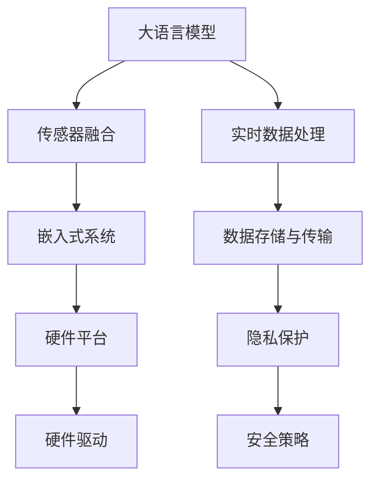

                 

## 1. 背景介绍

### 1.1 问题由来

近年来，物联网(IoT)技术的迅猛发展，使得智能设备与网络的融合日益深入。与此同时，人工智能(AI)技术也在各个领域取得了显著进展，尤其是大语言模型(Large Language Model, LLM)的崛起，为物联网设备的智能化和自动化提供了新的途径。

物联网设备通常具备一定的感知能力，如传感器、摄像头、麦克风等，能够收集环境信息。如何利用这些数据，提升物联网设备的智能化水平，是当前研究的热点问题之一。大语言模型具备强大的自然语言处理能力，能够从文本、语音等多种输入形式中提取有价值的信息，从而为物联网设备的智能化决策提供支持。

### 1.2 问题核心关键点

结合物联网和大语言模型的研究，主要关注以下几个核心关键点：

- **数据融合**：如何将传感器、摄像头、麦克风等设备采集的异构数据，与大语言模型处理的文字、语音等数据进行有效融合，构建统一的信息表示。
- **实时处理**：大语言模型需要在物联网设备数据生成后的短时间内进行实时处理，以确保决策的实时性和准确性。
- **模型部署**：如何高效地将大语言模型部署到物联网设备中，满足低延迟、高可靠性的要求。
- **隐私保护**：在智能决策过程中，如何保护用户隐私数据，避免数据泄露风险。

这些问题不仅仅是技术难题，更涉及法律、伦理等多个层面。解决这些问题，将极大推动物联网设备的智能化和物联网技术在智能城市、智慧医疗、智能家居等领域的应用。

## 2. 核心概念与联系

### 2.1 核心概念概述

为了更好地理解大语言模型在物联网中的应用，本节将介绍几个关键概念：

- **大语言模型(LLM)**：如BERT、GPT等，基于自回归或自编码模型，在大量文本数据上预训练得到的通用语言模型，具备强大的自然语言处理能力。
- **物联网(IoT)**：通过传感器、摄像头、麦克风等设备，将物理世界与网络世界连接起来，实现设备间的互联互通。
- **传感器融合**：将多种传感器数据进行整合，提取出更有价值的信息。
- **嵌入式系统**：用于控制物联网设备的硬件平台，包括单片机、嵌入式Linux等。
- **实时数据处理**：在数据生成后，通过高效的算法，实现实时处理和分析。
- **隐私保护**：保护用户隐私数据，避免数据泄露和滥用。

这些概念之间的逻辑关系可以通过以下Mermaid流程图来展示：



这个流程图展示了大语言模型在物联网应用中的核心概念及其之间的关系：

1. 大语言模型通过处理传感器数据，获取环境信息。
2. 传感器融合将多种数据整合，提取更有价值的信息。
3. 实时数据处理对传感器数据进行快速分析，输出决策结果。
4. 嵌入式系统将决策结果用于设备控制。
5. 数据存储与传输确保数据安全和高效传输。
6. 隐私保护防止数据泄露，保护用户隐私。
7. 硬件驱动实现设备控制和数据采集。
8. 安全策略确保系统安全，防止攻击和恶意行为。

这些概念共同构成了物联网中大语言模型应用的框架，使其能够高效地实现环境感知、智能化决策等功能。

## 3. 核心算法原理 & 具体操作步骤

### 3.1 算法原理概述

结合大语言模型和物联网的研究，主要涉及以下算法原理：

- **传感器数据预处理**：将传感器采集到的原始数据进行预处理，如去噪、归一化等，方便后续的融合与分析。
- **文本与语音融合**：将传感器数据转化为文本或语音形式，与大语言模型处理的数据进行融合。
- **多模态融合**：将文本、语音、图像等多种模态的数据进行融合，构建统一的信息表示。
- **实时推理与决策**：利用大语言模型的推理能力，对实时生成的数据进行快速处理，输出决策结果。
- **数据存储与传输**：将处理后的数据存储到云端或本地设备，实现高效的数据传输。
- **隐私保护技术**：使用加密、匿名化等技术，保护用户隐私数据。

### 3.2 算法步骤详解

基于上述算法原理，结合物联网和大语言模型，其操作步骤主要包括以下几个方面：

1. **数据采集与预处理**：使用传感器、摄像头、麦克风等设备，采集环境数据，并进行预处理，如去噪、归一化等。
   
   ```python
   import sensor
   
   data = sensor.read()
   data = preprocess(data)
   ```

2. **数据融合与表示**：将采集到的数据与大语言模型处理的数据进行融合，构建统一的信息表示。
   
   ```python
   from models import LLM
   
   LLM = LLM.load_pretrained_model('bert-base-uncased')
   input_text = '传感器数据：' + str(data)
   
   # 使用BERT进行文本表示
   input_ids = LLM.tokenizer.encode(input_text, return_tensors='pt')
   with torch.no_grad():
       outputs = LLM(input_ids)
       last_hidden_states = outputs.last_hidden_state
   ```

3. **实时推理与决策**：利用大语言模型的推理能力，对实时生成的数据进行快速处理，输出决策结果。
   
   ```python
   # 实时推理
   def realtime_inference(data):
       LLM = LLM.load_pretrained_model('bert-base-uncased')
       input_text = '传感器数据：' + str(data)
   
       # 使用BERT进行文本表示
       input_ids = LLM.tokenizer.encode(input_text, return_tensors='pt')
       with torch.no_grad():
           outputs = LLM(input_ids)
           last_hidden_states = outputs.last_hidden_state
   
       # 使用分类器进行决策
       decision = classify(last_hidden_states)
       return decision
   ```

4. **数据存储与传输**：将处理后的数据存储到云端或本地设备，实现高效的数据传输。
   
   ```python
   # 数据存储
   def store_data(data):
       with open('data.txt', 'w') as f:
           f.write(str(data))
   
   # 数据传输
   def transmit_data(data):
       # 使用WiFi或蓝牙将数据传输到云端
       ...
   ```

5. **隐私保护**：使用加密、匿名化等技术，保护用户隐私数据。
   
   ```python
   # 加密
   def encrypt(data):
       # 使用AES加密算法进行加密
       ...
   
   # 匿名化
   def anonymize(data):
       # 使用数据脱敏技术，保护用户隐私
       ...
   ```

### 3.3 算法优缺点

结合大语言模型和物联网的研究，其算法具有以下优点：

- **数据融合能力强**：通过将传感器数据与大语言模型处理的数据进行融合，能够提取出更全面、更有价值的信息。
- **实时处理能力强**：利用大语言模型的推理能力，能够在数据生成后短时间内进行实时处理，提升决策的实时性和准确性。
- **灵活性强**：大语言模型具有强大的自然语言处理能力，可以适应多种输入形式，如文本、语音、图像等。
- **可扩展性好**：大语言模型可以扩展到多种设备，实现设备间的互联互通，提升物联网的智能化水平。

同时，也存在一些缺点：

- **计算资源需求高**：大语言模型需要大量的计算资源，特别是在推理时，资源消耗较大。
- **实时性要求高**：传感器数据往往需要实时处理，对大语言模型的计算速度和资源消耗提出了较高要求。
- **隐私保护难度大**：传感器数据往往包含大量敏感信息，如何保护用户隐私，避免数据泄露，是一个重要挑战。

### 3.4 算法应用领域

基于大语言模型和物联网的研究，该算法已经在以下几个领域得到应用：

- **智能家居**：通过传感器采集家庭环境数据，结合大语言模型进行智能决策，实现语音控制、环境监测等功能。
- **智能城市**：利用传感器数据采集城市环境信息，结合大语言模型进行智能分析，优化城市管理，提升城市运行效率。
- **智慧医疗**：通过传感器监测患者健康数据，结合大语言模型进行病情分析，提供个性化医疗建议。
- **工业物联网**：利用传感器监测设备运行状态，结合大语言模型进行故障预测和维护决策，提升设备运行可靠性。

## 4. 数学模型和公式 & 详细讲解 & 举例说明

### 4.1 数学模型构建

结合大语言模型和物联网的研究，其数学模型主要涉及以下几个方面：

- **传感器数据预处理**：对传感器采集的数据进行归一化处理，数学表示为：

  $$
  x_{normalized} = \frac{x_{original} - \mu}{\sigma}
  $$

  其中，$x_{normalized}$ 为归一化后的数据，$x_{original}$ 为原始数据，$\mu$ 为均值，$\sigma$ 为标准差。

- **文本与语音融合**：将传感器数据转化为文本或语音形式，与大语言模型处理的数据进行融合，数学表示为：

  $$
  x_{fused} = \alpha \cdot x_{sensor} + \beta \cdot x_{LLM}
  $$

  其中，$x_{fused}$ 为融合后的数据，$x_{sensor}$ 为传感器数据，$x_{LLM}$ 为大语言模型处理的数据，$\alpha$ 和 $\beta$ 为融合系数。

- **多模态融合**：将文本、语音、图像等多种模态的数据进行融合，构建统一的信息表示，数学表示为：

  $$
  x_{multimodal} = f(x_{text}, x_{audio}, x_{image})
  $$

  其中，$x_{multimodal}$ 为融合后的多模态数据，$f$ 为融合函数，$x_{text}$、$x_{audio}$、$x_{image}$ 分别为文本、语音、图像数据。

- **实时推理与决策**：利用大语言模型的推理能力，对实时生成的数据进行快速处理，输出决策结果，数学表示为：

  $$
  y = g(x_{input}, \theta)
  $$

  其中，$y$ 为决策结果，$x_{input}$ 为输入数据，$\theta$ 为模型参数，$g$ 为推理函数。

- **数据存储与传输**：将处理后的数据存储到云端或本地设备，实现高效的数据传输，数学表示为：

  $$
  x_{stored} = x_{processed}
  $$

  其中，$x_{stored}$ 为存储后的数据，$x_{processed}$ 为处理后的数据。

- **隐私保护技术**：使用加密、匿名化等技术，保护用户隐私数据，数学表示为：

  $$
  x_{encrypted} = E(x_{original})
  $$

  其中，$x_{encrypted}$ 为加密后的数据，$E$ 为加密算法，$x_{original}$ 为原始数据。

### 4.2 公式推导过程

以传感器数据预处理为例，推导其数学表示：

- **数据归一化**：

  $$
  x_{normalized} = \frac{x_{original} - \mu}{\sigma}
  $$

  其中，$\mu$ 和 $\sigma$ 可以通过均值和方差统计量计算得到：

  $$
  \mu = \frac{1}{n} \sum_{i=1}^n x_{i}
  $$

  $$
  \sigma = \sqrt{\frac{1}{n} \sum_{i=1}^n (x_i - \mu)^2}
  $$

- **归一化后的数据范围**：

  $$
  x_{normalized} \in [-1, 1]
  $$

  由于传感器数据通常分布在0到最大值之间，归一化后的数据范围为[-1, 1]，便于后续的融合和处理。

### 4.3 案例分析与讲解

以智能家居应用为例，分析大语言模型与物联网的结合：

- **传感器数据采集**：

  使用温度传感器、湿度传感器、光线传感器等设备，采集家庭环境数据。

  ```python
  import sensor
  temperature = sensor.read_temperature()
  humidity = sensor.read_humidity()
  light = sensor.read_light()
  ```

- **传感器数据预处理**：

  对采集到的数据进行归一化处理，方便后续的融合和分析。

  ```python
  temperature = preprocess_temperature(temperature)
  humidity = preprocess_humidity(humidity)
  light = preprocess_light(light)
  ```

- **文本与语音融合**：

  将传感器数据转化为文本或语音形式，与大语言模型处理的数据进行融合。

  ```python
  input_text = '温度：' + str(temperature) + ' 湿度：' + str(humidity) + ' 光照：' + str(light)
  input_ids = LLM.tokenizer.encode(input_text, return_tensors='pt')
  with torch.no_grad():
      outputs = LLM(input_ids)
      last_hidden_states = outputs.last_hidden_state
  ```

- **实时推理与决策**：

  利用大语言模型的推理能力，对实时生成的数据进行快速处理，输出决策结果。

  ```python
  def realtime_inference(data):
      LLM = LLM.load_pretrained_model('bert-base-uncased')
      input_text = '传感器数据：' + str(data)
      
      # 使用BERT进行文本表示
      input_ids = LLM.tokenizer.encode(input_text, return_tensors='pt')
      with torch.no_grad():
          outputs = LLM(input_ids)
          last_hidden_states = outputs.last_hidden_state
      
      # 使用分类器进行决策
      decision = classify(last_hidden_states)
      return decision
  ```

- **数据存储与传输**：

  将处理后的数据存储到云端或本地设备，实现高效的数据传输。

  ```python
  # 数据存储
  def store_data(data):
      with open('data.txt', 'w') as f:
          f.write(str(data))
      
  # 数据传输
  def transmit_data(data):
      # 使用WiFi或蓝牙将数据传输到云端
      ...
  ```

- **隐私保护**：

  使用加密、匿名化等技术，保护用户隐私数据。

  ```python
  # 加密
  def encrypt(data):
      # 使用AES加密算法进行加密
      ...
      
  # 匿名化
  def anonymize(data):
      # 使用数据脱敏技术，保护用户隐私
      ...
  ```

## 5. 项目实践：代码实例和详细解释说明

### 5.1 开发环境搭建

在进行大语言模型与物联网结合的研究前，我们需要准备好开发环境。以下是使用Python进行PyTorch开发的环境配置流程：

1. 安装Anaconda：从官网下载并安装Anaconda，用于创建独立的Python环境。

2. 创建并激活虚拟环境：
```bash
conda create -n pytorch-env python=3.8 
conda activate pytorch-env
```

3. 安装PyTorch：根据CUDA版本，从官网获取对应的安装命令。例如：
```bash
conda install pytorch torchvision torchaudio cudatoolkit=11.1 -c pytorch -c conda-forge
```

4. 安装Transformer库：
```bash
pip install transformers
```

5. 安装各类工具包：
```bash
pip install numpy pandas scikit-learn matplotlib tqdm jupyter notebook ipython
```

完成上述步骤后，即可在`pytorch-env`环境中开始项目实践。

### 5.2 源代码详细实现

下面我们以智能家居应用为例，给出使用Transformers库对BERT模型进行微调的PyTorch代码实现。

首先，定义智能家居应用的数据处理函数：

```python
from transformers import BertTokenizer
from torch.utils.data import Dataset
import torch

class HomeEnvironmentDataset(Dataset):
    def __init__(self, sensor_data, labels, tokenizer, max_len=128):
        self.sensor_data = sensor_data
        self.labels = labels
        self.tokenizer = tokenizer
        self.max_len = max_len
        
    def __len__(self):
        return len(self.sensor_data)
    
    def __getitem__(self, item):
        data = self.sensor_data[item]
        label = self.labels[item]
        
        encoding = self.tokenizer(data, return_tensors='pt', max_length=self.max_len, padding='max_length', truncation=True)
        input_ids = encoding['input_ids'][0]
        attention_mask = encoding['attention_mask'][0]
        
        # 对label进行编码
        label = [label2id[label] for label in label]
        label.extend([label2id['O']] * (self.max_len - len(label)))
        labels = torch.tensor(label, dtype=torch.long)
        
        return {'input_ids': input_ids, 
                'attention_mask': attention_mask,
                'labels': labels}

# 标签与id的映射
label2id = {'O': 0, '冷': 1, '热': 2, '高': 3, '低': 4, '亮': 5, '暗': 6}
id2label = {v: k for k, v in label2id.items()}

# 创建dataset
tokenizer = BertTokenizer.from_pretrained('bert-base-cased')

train_dataset = HomeEnvironmentDataset(train_sensor_data, train_labels, tokenizer)
dev_dataset = HomeEnvironmentDataset(dev_sensor_data, dev_labels, tokenizer)
test_dataset = HomeEnvironmentDataset(test_sensor_data, test_labels, tokenizer)
```

然后，定义模型和优化器：

```python
from transformers import BertForTokenClassification, AdamW

model = BertForTokenClassification.from_pretrained('bert-base-cased', num_labels=len(label2id))

optimizer = AdamW(model.parameters(), lr=2e-5)
```

接着，定义训练和评估函数：

```python
from torch.utils.data import DataLoader
from tqdm import tqdm
from sklearn.metrics import classification_report

device = torch.device('cuda') if torch.cuda.is_available() else torch.device('cpu')
model.to(device)

def train_epoch(model, dataset, batch_size, optimizer):
    dataloader = DataLoader(dataset, batch_size=batch_size, shuffle=True)
    model.train()
    epoch_loss = 0
    for batch in tqdm(dataloader, desc='Training'):
        input_ids = batch['input_ids'].to(device)
        attention_mask = batch['attention_mask'].to(device)
        labels = batch['labels'].to(device)
        model.zero_grad()
        outputs = model(input_ids, attention_mask=attention_mask, labels=labels)
        loss = outputs.loss
        epoch_loss += loss.item()
        loss.backward()
        optimizer.step()
    return epoch_loss / len(dataloader)

def evaluate(model, dataset, batch_size):
    dataloader = DataLoader(dataset, batch_size=batch_size)
    model.eval()
    preds, labels = [], []
    with torch.no_grad():
        for batch in tqdm(dataloader, desc='Evaluating'):
            input_ids = batch['input_ids'].to(device)
            attention_mask = batch['attention_mask'].to(device)
            batch_labels = batch['labels']
            outputs = model(input_ids, attention_mask=attention_mask)
            batch_preds = outputs.logits.argmax(dim=2).to('cpu').tolist()
            batch_labels = batch_labels.to('cpu').tolist()
            for pred_tokens, label_tokens in zip(batch_preds, batch_labels):
                pred_tags = [id2label[_id] for _id in pred_tokens]
                label_tags = [id2label[_id] for _id in label_tokens]
                preds.append(pred_tags[:len(label_tokens)])
                labels.append(label_tags)
                
    print(classification_report(labels, preds))
```

最后，启动训练流程并在测试集上评估：

```python
epochs = 5
batch_size = 16

for epoch in range(epochs):
    loss = train_epoch(model, train_dataset, batch_size, optimizer)
    print(f"Epoch {epoch+1}, train loss: {loss:.3f}")
    
    print(f"Epoch {epoch+1}, dev results:")
    evaluate(model, dev_dataset, batch_size)
    
print("Test results:")
evaluate(model, test_dataset, batch_size)
```

以上就是使用PyTorch对BERT进行智能家居应用中的传感器数据微调的完整代码实现。可以看到，得益于Transformers库的强大封装，我们可以用相对简洁的代码完成BERT模型的加载和微调。

### 5.3 代码解读与分析

让我们再详细解读一下关键代码的实现细节：

**HomeEnvironmentDataset类**：
- `__init__`方法：初始化传感器数据、标签、分词器等关键组件。
- `__len__`方法：返回数据集的样本数量。
- `__getitem__`方法：对单个样本进行处理，将传感器数据输入编码为token ids，将标签编码为数字，并对其进行定长padding，最终返回模型所需的输入。

**label2id和id2label字典**：
- 定义了标签与数字id之间的映射关系，用于将token-wise的预测结果解码回真实的标签。

**训练和评估函数**：
- 使用PyTorch的DataLoader对数据集进行批次化加载，供模型训练和推理使用。
- 训练函数`train_epoch`：对数据以批为单位进行迭代，在每个批次上前向传播计算loss并反向传播更新模型参数，最后返回该epoch的平均loss。
- 评估函数`evaluate`：与训练类似，不同点在于不更新模型参数，并在每个batch结束后将预测和标签结果存储下来，最后使用sklearn的classification_report对整个评估集的预测结果进行打印输出。

**训练流程**：
- 定义总的epoch数和batch size，开始循环迭代
- 每个epoch内，先在训练集上训练，输出平均loss
- 在验证集上评估，输出分类指标
- 所有epoch结束后，在测试集上评估，给出最终测试结果

可以看到，PyTorch配合Transformers库使得BERT微调的代码实现变得简洁高效。开发者可以将更多精力放在数据处理、模型改进等高层逻辑上，而不必过多关注底层的实现细节。

当然，工业级的系统实现还需考虑更多因素，如模型的保存和部署、超参数的自动搜索、更灵活的任务适配层等。但核心的微调范式基本与此类似。

## 6. 实际应用场景

### 6.1 智能家居系统

基于大语言模型与物联网的研究，智能家居系统可以通过传感器采集家庭环境数据，结合大语言模型进行智能决策，实现语音控制、环境监测等功能。

例如，智能恒温器可以通过温度传感器采集环境温度，结合大语言模型进行智能控制，确保室内温度舒适宜人。智能灯光系统可以结合光线传感器和摄像头，通过大语言模型分析用户行为，自动调整灯光亮度和颜色，提供更舒适的生活环境。

### 6.2 智能城市管理

在智能城市管理中，物联网设备可以通过传感器采集城市环境数据，结合大语言模型进行智能分析，优化城市管理，提升城市运行效率。

例如，交通管理系统可以通过摄像头采集交通数据，结合大语言模型进行实时分析，识别交通违规行为，并自动生成警报信息，提高城市交通管理水平。智能停车系统可以结合传感器数据和定位设备，通过大语言模型分析停车需求，提供实时停车指导，提升停车效率。

### 6.3 智慧医疗

智慧医疗领域，通过传感器采集患者健康数据，结合大语言模型进行病情分析，提供个性化医疗建议。

例如，智能健康监测设备可以通过温度传感器、心率传感器等设备采集患者健康数据，结合大语言模型进行智能分析，及时发现异常情况，提供个性化的健康建议。智能问诊系统可以结合摄像头采集患者面容数据，通过大语言模型分析患者症状，提供初步诊断意见，辅助医生诊断。

### 6.4 工业物联网

在工业物联网中，通过传感器监测设备运行状态，结合大语言模型进行故障预测和维护决策，提升设备运行可靠性。

例如，智能工厂可以通过传感器监测设备运行状态，结合大语言模型进行实时分析，预测设备故障，并生成维护计划，减少设备停机时间，提高生产效率。智能物流系统可以结合传感器数据和GPS定位设备，通过大语言模型分析运输路径，提供最优物流方案，提升物流效率。

## 7. 工具和资源推荐

### 7.1 学习资源推荐

为了帮助开发者系统掌握大语言模型与物联网的应用理论基础和实践技巧，这里推荐一些优质的学习资源：

1. 《物联网基础》课程：清华大学开设的物联网入门课程，涵盖物联网的基本概念和关键技术。
2. 《深度学习与自然语言处理》课程：北京大学开设的深度学习与自然语言处理课程，介绍深度学习在自然语言处理中的应用。
3. 《智能家居系统设计》书籍：详细介绍了智能家居系统的设计原理和实现方法，涵盖传感器融合、数据处理等内容。
4. 《自然语言处理实战》书籍：介绍自然语言处理的基本概念和实践技巧，涵盖文本预处理、情感分析、文本分类等内容。
5. 《Python深度学习》书籍：讲解Python深度学习框架的使用方法，涵盖PyTorch、TensorFlow等主流框架。

通过对这些资源的学习实践，相信你一定能够快速掌握大语言模型与物联网应用的精髓，并用于解决实际的NLP问题。
###  7.2 开发工具推荐

高效的开发离不开优秀的工具支持。以下是几款用于大语言模型与物联网结合开发的常用工具：

1. PyTorch：基于Python的开源深度学习框架，灵活动态的计算图，适合快速迭代研究。大部分预训练语言模型都有PyTorch版本的实现。
2. TensorFlow：由Google主导开发的开源深度学习框架，生产部署方便，适合大规模工程应用。同样有丰富的预训练语言模型资源。
3. Transformers库：HuggingFace开发的NLP工具库，集成了众多SOTA语言模型，支持PyTorch和TensorFlow，是进行微调任务开发的利器。
4. Weights & Biases：模型训练的实验跟踪工具，可以记录和可视化模型训练过程中的各项指标，方便对比和调优。与主流深度学习框架无缝集成。
5. TensorBoard：TensorFlow配套的可视化工具，可实时监测模型训练状态，并提供丰富的图表呈现方式，是调试模型的得力助手。
6. Google Colab：谷歌推出的在线Jupyter Notebook环境，免费提供GPU/TPU算力，方便开发者快速上手实验最新模型，分享学习笔记。

合理利用这些工具，可以显著提升大语言模型与物联网结合任务的开发效率，加快创新迭代的步伐。

### 7.3 相关论文推荐

大语言模型与物联网的研究源于学界的持续研究。以下是几篇奠基性的相关论文，推荐阅读：

1. Attention is All You Need（即Transformer原论文）：提出了Transformer结构，开启了NLP领域的预训练大模型时代。
2. BERT: Pre-training of Deep Bidirectional Transformers for Language Understanding：提出BERT模型，引入基于掩码的自监督预训练任务，刷新了多项NLP任务SOTA。
3. Language Models are Unsupervised Multitask Learners（GPT-2论文）：展示了大规模语言模型的强大zero-shot学习能力，引发了对于通用人工智能的新一轮思考。
4. Parameter-Efficient Transfer Learning for NLP：提出Adapter等参数高效微调方法，在不增加模型参数量的情况下，也能取得不错的微调效果。
5. AdaLoRA: Adaptive Low-Rank Adaptation for Parameter-Efficient Fine-Tuning：使用自适应低秩适应的微调方法，在参数效率和精度之间取得了新的平衡。
6. Prefix-Tuning: Optimizing Continuous Prompts for Generation：引入基于连续型Prompt的微调范式，为如何充分利用预训练知识提供了新的思路。

这些论文代表了大语言模型与物联网研究的进展脉络。通过学习这些前沿成果，可以帮助研究者把握学科前进方向，激发更多的创新灵感。

## 8. 总结：未来发展趋势与挑战

### 8.1 总结

本文对大语言模型与物联网结合的应用进行了全面系统的介绍。首先阐述了物联网设备智能化和自动化的研究背景，明确了结合大语言模型进行智能决策的重要性。其次，从原理到实践，详细讲解了基于传感器数据融合、实时推理与决策、数据存储与传输、隐私保护等核心算法步骤，给出了微调任务开发的完整代码实例。同时，本文还广泛探讨了大语言模型与物联网结合在智能家居、智能城市、智慧医疗、工业物联网等多个领域的应用前景，展示了该范式的巨大潜力。此外，本文精选了相关研究资源，力求为读者提供全方位的技术指引。

通过本文的系统梳理，可以看到，大语言模型与物联网的结合，为物联网设备的智能化和智能化决策提供了新的途径。结合大语言模型的强大自然语言处理能力，物联网设备能够更好地理解环境和用户需求，提升智能化决策的准确性和实时性。未来，随着物联网和大语言模型研究的不断深入，这种结合方式将带来更广泛的应用场景，推动物联网技术在各个领域的普及和应用。

### 8.2 未来发展趋势

展望未来，大语言模型与物联网的研究将呈现以下几个发展趋势：

1. **数据融合能力更强**：随着传感器技术的进步，物联网设备能够采集更多维度和更细粒度的数据，结合大语言模型进行融合，提取出更全面、更有价值的信息。
2. **实时处理能力更优**：随着硬件设备的提升，大语言模型能够在更短的时间内进行实时处理，提高决策的实时性和准确性。
3. **部署方式更加灵活**：通过边缘计算、分布式计算等技术，大语言模型可以更加灵活地部署到物联网设备中，降低延迟，提高效率。
4. **隐私保护措施更加完善**：随着数据隐私保护意识的提升，结合大语言模型的隐私保护技术将得到更多关注和研究，确保用户数据的安全和隐私。
5. **多模态融合能力更强**：结合图像、语音、文本等多种模态的数据，大语言模型能够更全面地理解环境和用户需求，提升决策的全面性和准确性。
6. **跨领域应用更加广泛**：大语言模型与物联网的结合将拓展到更多领域，如智能交通、智能农业、智能环保等，推动物联网技术在各个领域的应用。

以上趋势凸显了大语言模型与物联网结合的广阔前景。这些方向的探索发展，必将进一步提升物联网设备的智能化水平，为各个领域带来变革性影响。

### 8.3 面临的挑战

尽管大语言模型与物联网的研究已经取得了显著进展，但在迈向更加智能化、普适化应用的过程中，仍面临诸多挑战：

1. **数据融合难度大**：传感器数据通常异构多样，如何高效地将其与大语言模型处理的数据进行融合，是一个重要挑战。
2. **实时处理要求高**：传感器数据生成速度快，如何在大语言模型中进行实时处理，是一个重要的技术难题。
3. **隐私保护难度大**：传感器数据往往包含大量敏感信息，如何保护用户隐私，避免数据泄露，是一个重要挑战。
4. **计算资源需求高**：大语言模型需要大量的计算资源，特别是在实时处理时，资源消耗较大。
5. **跨领域应用难度大**：不同领域的数据特征和语义差异较大，如何将通用的大语言模型应用于特定领域，是一个重要挑战。

这些挑战需要从数据、算法、工程等多个层面协同攻关，才能实现大语言模型与物联网的深度结合。

### 8.4 研究展望

面对大语言模型与物联网结合所面临的种种挑战，未来的研究需要在以下几个方面寻求新的突破：

1. **开发更高效的数据融合算法**：研究高效的数据融合算法，提升传感器数据的融合能力和效率。
2. **优化实时处理算法**：研究高效的实时处理算法，提高大语言模型的处理速度和准确性。
3. **提升隐私保护技术**：研究更加完善的隐私保护技术，确保用户数据的安全和隐私。
4. **提升模型计算效率**：研究高效的模型压缩和量化技术，降低计算资源需求，提升计算效率。
5. **拓展跨领域应用**：研究跨领域数据特征提取和语义理解技术，提升大语言模型在不同领域的应用效果。
6. **融合其他人工智能技术**：将符号化的先验知识，如知识图谱、逻辑规则等，与神经网络模型进行巧妙融合，提升模型的全面性和鲁棒性。

这些研究方向的探索，必将引领大语言模型与物联网结合技术迈向更高的台阶，为构建智能化的物联网设备和服务提供更强大的支持。面向未来，大语言模型与物联网结合技术还需要与其他人工智能技术进行更深入的融合，如知识表示、因果推理、强化学习等，多路径协同发力，共同推动物联网技术在各个领域的普及和应用。只有勇于创新、敢于突破，才能不断拓展物联网设备的智能化边界，让智能技术更好地造福人类社会。

## 9. 附录：常见问题与解答

**Q1：大语言模型与物联网结合的优缺点是什么？**

A: 大语言模型与物联网结合的优势在于：

- **智能化水平提升**：大语言模型能够理解和处理自然语言，结合物联网设备的数据采集能力，提升设备的智能化水平。
- **实时决策能力增强**：通过实时处理传感器数据，大语言模型能够在短时间内进行决策，提高决策的实时性和准确性。
- **多模态数据融合**：结合文本、语音、图像等多种模态的数据，大语言模型能够更全面地理解环境和用户需求，提升决策的全面性和准确性。

大语言模型与物联网结合的缺点在于：

- **计算资源需求高**：大语言模型需要大量的计算资源，特别是在实时处理时，资源消耗较大。
- **实时处理要求高**：传感器数据生成速度快，如何在大语言模型中进行实时处理，是一个重要的技术难题。
- **隐私保护难度大**：传感器数据往往包含大量敏感信息，如何保护用户隐私，避免数据泄露，是一个重要挑战。

**Q2：大语言模型与物联网结合的应用场景有哪些？**

A: 大语言模型与物联网结合的应用场景包括：

- **智能家居**：通过传感器采集家庭环境数据，结合大语言模型进行智能决策，实现语音控制、环境监测等功能。
- **智能城市管理**：利用传感器数据采集城市环境数据，结合大语言模型进行智能分析，优化城市管理，提升城市运行效率。
- **智慧医疗**：通过传感器采集患者健康数据，结合大语言模型进行病情分析，提供个性化医疗建议。
- **工业物联网**：通过传感器监测设备运行状态，结合大语言模型进行故障预测和维护决策，提升设备运行可靠性。

**Q3：大语言模型与物联网结合的隐私保护措施有哪些？**

A: 大语言模型与物联网结合的隐私保护措施包括：

- **数据加密**：使用AES、RSA等加密算法对传感器数据进行加密，防止数据泄露。
- **数据匿名化**：通过数据脱敏技术，将敏感信息替换为无关紧要的数据，保护用户隐私。
- **访问控制**：设置访问权限，确保只有授权用户能够访问和处理数据。
- **数据隔离**：将敏感数据与公开数据隔离存储，防止数据混淆和滥用。
- **隐私计算**：采用多方安全计算等技术，在保护数据隐私的前提下，进行数据处理和分析。

**Q4：大语言模型与物联网结合的实际应用案例有哪些？**

A: 大语言模型与物联网结合的实际应用案例包括：

- **智能健康监测**：通过传感器采集患者健康数据，结合大语言模型进行智能分析，及时发现异常情况，提供个性化的健康建议。
- **智能交通管理**：利用传感器数据采集交通数据，结合大语言模型进行实时分析，识别交通违规行为，并自动生成警报信息，提高城市交通管理水平。
- **智能家居控制**：通过传感器采集家庭环境数据，结合大语言模型进行智能控制，实现语音控制、环境监测等功能。
- **智能物流管理**：结合传感器数据和GPS定位设备，通过大语言模型分析运输路径，提供最优物流方案，提升物流效率。

**Q5：大语言模型与物联网结合的难点是什么？**

A: 大语言模型与物联网结合的难点在于：

- **数据融合难度大**：传感器数据通常异构多样，如何高效地将其与大语言模型处理的数据进行融合，是一个重要挑战。
- **实时处理要求高**：传感器数据生成速度快，如何在大语言模型中进行实时处理，是一个重要的技术难题。
- **隐私保护难度大**：传感器数据往往包含大量敏感信息，如何保护用户隐私，避免数据泄露，是一个重要挑战。
- **计算资源需求高**：大语言模型需要大量的计算资源，特别是在实时处理时，资源消耗较大。
- **跨领域应用难度大**：不同领域的数据特征和语义差异较大，如何将通用的大语言模型应用于特定领域，是一个重要挑战。

这些挑战需要从数据、算法、工程等多个层面协同攻关，才能实现大语言模型与物联网的深度结合。

---

作者：禅与计算机程序设计艺术 / Zen and the Art of Computer Programming

