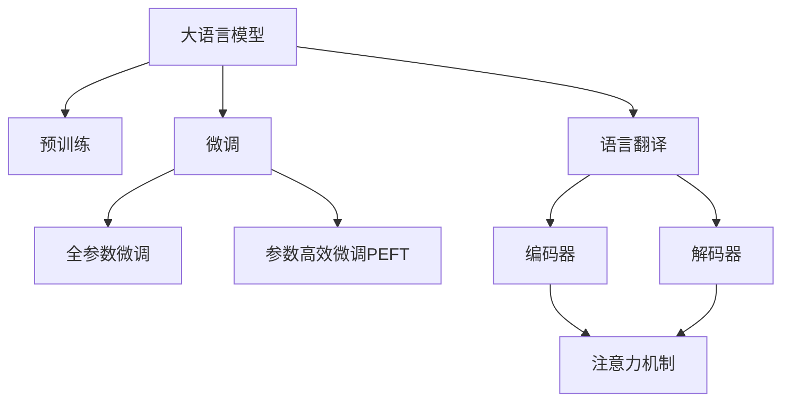

                 

# LLM与语言翻译：跨越语言障碍的桥梁

> 关键词：大语言模型(LLM)，语言翻译，自然语言处理(NLP)，神经机器翻译(NMT)，注意力机制(Attention)，Transformer模型

## 1. 背景介绍

在全球化日益加速的今天，语言翻译作为连接不同文化、不同国家的重要桥梁，其需求愈发迫切。随着计算机技术和自然语言处理(NLP)技术的不断进步，语言翻译已经从传统的基于规则的机器翻译系统发展到了现代基于神经网络的机器翻译(NMT)系统。在这一过程中，大语言模型(Large Language Models, LLMs)的崛起，极大地推动了语言翻译技术的革新，使翻译更加高效、流畅和准确。

### 1.1 问题由来

早期的机器翻译系统多基于统计机器翻译(SMT)，通过统计语言模型和词对齐技术进行翻译。尽管这种方法在一定程度上取得了成功，但其翻译质量仍受限于有限的数据量，难以捕捉复杂的语言结构和语义。随着神经网络技术的发展，深度学习成为了机器翻译领域的新宠。特别是Transformer模型的出现，推动了基于深度学习的神经机器翻译(Neural Machine Translation, NMT)技术的发展。

当前，神经机器翻译系统多采用Transformer模型进行构建，通过大规模语料进行自监督预训练，进而通过微调适应特定翻译任务，从而取得良好的翻译效果。大语言模型作为预训练语言模型的一种，其广泛的语料覆盖和强大的语言理解能力，使得其在翻译任务中的应用效果愈发显著。

### 1.2 问题核心关键点

大语言模型在语言翻译中的应用主要基于其强大的语言理解和生成能力。相比于传统机器翻译系统，大语言模型具有以下优势：

1. **语义理解**：大语言模型能够从上下文和语境中理解复杂的语言结构，捕捉语义关系，从而生成更加流畅和准确的翻译。
2. **多样性生成**：大语言模型在训练过程中，学习了多种语言的语法和词汇，能够生成多种语言之间的自然语言对，适用于不同语言之间的翻译。
3. **跨语言迁移**：大语言模型具有跨领域的迁移学习能力，可以通过简单的微调快速适应特定的翻译任务。

然而，大语言模型在应用过程中也存在一些挑战：

1. **资源消耗**：大语言模型往往具有亿级别的参数量，训练和推理所需资源巨大，可能面临资源限制。
2. **生成质量**：尽管大语言模型的生成质量很高，但在特定领域或长句翻译时，仍可能出现一些错误。
3. **泛化能力**：大语言模型在处理未见过的语料时，可能存在泛化能力不足的问题。

## 2. 核心概念与联系

### 2.1 核心概念概述

为更好地理解大语言模型在语言翻译中的应用，本节将介绍几个核心概念：

- **大语言模型(Large Language Model, LLM)**：以自回归(如GPT)或自编码(如BERT)模型为代表的大规模预训练语言模型。通过在大规模无标签文本数据上进行预训练，学习通用的语言表示，具备强大的语言理解和生成能力。
- **预训练(Pre-training)**：指在大规模无标签文本语料上，通过自监督学习任务训练通用语言模型的过程。常见的预训练任务包括言语建模、掩码语言模型等。
- **微调(Fine-tuning)**：指在预训练模型的基础上，使用下游任务的少量标注数据，通过有监督地训练来优化模型在该任务上的性能。通常只需要调整顶层分类器或解码器，并以较小的学习率更新全部或部分的模型参数。
- **语言翻译(Translation)**：指将一种语言转换为另一种语言的过程。翻译系统通常包括编码器(Encoder)和解码器(Decoder)两部分，编码器将源语言文本转换为中间语义表示，解码器根据该表示生成目标语言文本。
- **注意力机制(Attention)**：一种用于捕捉序列数据中长距离依赖关系的机制，常用于Transformer模型中，用于动态计算序列中各个位置的注意力权重。
- **Transformer模型**：一种基于自注意力机制的神经网络模型，用于处理序列数据。Transformer模型广泛应用于NMT、语音识别、文本生成等领域，以其高效的并行计算能力和强大的表达能力著称。

这些核心概念之间的逻辑关系可以通过以下Mermaid流程图来展示：



这个流程图展示了大语言模型的核心概念及其之间的关系：

1. 大语言模型通过预训练获得基础能力。
2. 微调是对预训练模型进行任务特定的优化，可以分为全参数微调和参数高效微调（PEFT）。
3. 语言翻译包括编码器和解码器两部分，其中解码器常使用Transformer模型。
4. 注意力机制用于动态计算序列中各个位置的注意力权重。
5. 大语言模型在语言翻译中主要应用于解码器部分，用于生成翻译结果。

这些概念共同构成了大语言模型在语言翻译中的应用框架，使其能够在各种场景下发挥强大的语言理解和生成能力。通过理解这些核心概念，我们可以更好地把握大语言模型的工作原理和优化方向。

## 3. 核心算法原理 & 具体操作步骤
### 3.1 算法原理概述

大语言模型在语言翻译中的应用，本质上是一个自监督学习的预训练过程和有监督学习的微调过程的结合。其核心思想是：通过大规模无标签语料进行预训练，获得通用语言知识，然后在特定翻译任务上进行微调，优化模型在该任务上的性能。

形式化地，假设预训练语言模型为 $M_{\theta}$，其中 $\theta$ 为预训练得到的模型参数。给定一对源语言文本和目标语言文本 $(x_s, x_t)$，微调的目标是找到新的模型参数 $\hat{\theta}$，使得：

$$
\hat{\theta}=\mathop{\arg\min}_{\theta} \mathcal{L}(M_{\theta}(x_s),x_t)
$$

其中 $\mathcal{L}$ 为针对翻译任务设计的损失函数，用于衡量模型生成的翻译文本与真实翻译文本之间的差异。常见的损失函数包括BLEU、ROUGE等。

通过梯度下降等优化算法，微调过程不断更新模型参数 $\theta$，最小化损失函数 $\mathcal{L}$，使得模型生成的翻译文本逼近真实翻译文本。由于 $\theta$ 已经通过预训练获得了较好的初始化，因此即便在特定任务上的训练数据量较小，也能较快收敛到理想的模型参数 $\hat{\theta}$。

### 3.2 算法步骤详解

基于大语言模型在语言翻译中的应用，本节将详细介绍具体的微调过程。

**Step 1: 准备预训练模型和数据集**
- 选择合适的预训练语言模型 $M_{\theta}$ 作为初始化参数，如 BERT、GPT等。
- 准备源语言和目标语言的翻译数据集 $D=\{(x_s, x_t)\}_{i=1}^N$，确保数据集的翻译质量。

**Step 2: 添加任务适配层**
- 根据翻译任务类型，在预训练模型顶层设计合适的输出层和损失函数。
- 对于常见的翻译任务，通常使用BLEU作为损失函数，表示模型生成的翻译文本与参考翻译文本之间的相似度。
- 对于序列到序列的翻译任务，可以使用Transformer模型，在编码器和解码器之间加入自注意力机制和编码器-解码器注意力机制。

**Step 3: 设置微调超参数**
- 选择合适的优化算法及其参数，如 AdamW、SGD 等，设置学习率、批大小、迭代轮数等。
- 设置正则化技术及强度，包括权重衰减、Dropout、Early Stopping等。
- 确定冻结预训练参数的策略，如仅微调顶层，或全部参数都参与微调。

**Step 4: 执行梯度训练**
- 将源语言文本 $x_s$ 和目标语言文本 $x_t$ 分批次输入模型，前向传播计算损失函数。
- 反向传播计算参数梯度，根据设定的优化算法和学习率更新模型参数。
- 周期性在验证集上评估模型性能，根据性能指标决定是否触发 Early Stopping。
- 重复上述步骤直到满足预设的迭代轮数或 Early Stopping 条件。

**Step 5: 测试和部署**
- 在测试集上评估微调后模型 $M_{\hat{\theta}}$ 的性能，对比微调前后的BLEU等指标。
- 使用微调后的模型对新样本进行推理预测，集成到实际的应用系统中。
- 持续收集新的翻译样本，定期重新微调模型，以适应数据分布的变化。

以上是基于大语言模型进行语言翻译微调的一般流程。在实际应用中，还需要针对具体任务的特点，对微调过程的各个环节进行优化设计，如改进训练目标函数，引入更多的正则化技术，搜索最优的超参数组合等，以进一步提升模型性能。

### 3.3 算法优缺点

基于大语言模型在语言翻译中的应用，其优缺点如下：

**优点**：

1. **通用适用**：大语言模型在各类翻译任务上均能取得不错的效果，适应性强。
2. **可迁移性**：预训练模型在多种语言之间的迁移能力较强，可以在较短的时间内适应新的翻译任务。
3. **高效生成**：大语言模型生成的翻译文本质量高，流畅性较好，减少了人工翻译的需求。

**缺点**：

1. **资源消耗大**：大语言模型参数量大，训练和推理所需资源较多，可能面临资源限制。
2. **泛化能力有限**：对于长尾翻译任务，大语言模型的泛化能力可能不足，需要进一步优化。
3. **公平性问题**：大语言模型在翻译过程中可能存在偏见，需要进一步改进以确保翻译质量。

尽管存在这些局限性，但就目前而言，基于大语言模型的翻译方法仍然是大规模应用的主流范式。未来相关研究的重点在于如何进一步降低资源消耗，提高泛化能力，确保翻译的公平性。

### 3.4 算法应用领域

大语言模型在语言翻译中的应用已经相当广泛，涵盖了各种语言对之间的翻译，包括但不限于：

- **英中翻译**：将英文翻译成中文。在学术论文、技术文档、新闻报道等场景中使用广泛。
- **中英文对照翻译**：将中文文本翻译成英文，常用于文学翻译、专业术语翻译等领域。
- **多语言翻译**：将一种语言翻译成多种语言。如将英文翻译成法语、德语、西班牙语等。
- **翻译记忆库**：在翻译过程中，利用大语言模型快速检索翻译记忆库中的已有翻译，提升翻译效率。

除了以上应用场景外，大语言模型还被创新性地应用于多种跨语言应用中，如文档对比、信息检索、摘要生成等，为语言翻译提供了更广阔的可能性。随着预训练模型和微调方法的不断进步，语言翻译技术将不断革新，助力全球化的深入发展。

## 4. 数学模型和公式 & 详细讲解 & 举例说明

### 4.1 数学模型构建

本节将使用数学语言对大语言模型在语言翻译中的应用进行更加严格的刻画。

假设预训练语言模型为 $M_{\theta}:\mathcal{X} \rightarrow \mathcal{Y}$，其中 $\mathcal{X}$ 为源语言文本，$\mathcal{Y}$ 为目标语言文本，$\theta \in \mathbb{R}^d$ 为模型参数。假设翻译数据集为 $D=\{(x_s, x_t)\}_{i=1}^N$，其中 $x_s \in \mathcal{X}, x_t \in \mathcal{Y}$。

定义模型 $M_{\theta}$ 在源语言文本 $x_s$ 上的输出为 $\hat{x_t}=M_{\theta}(x_s) \in \mathcal{Y}$，表示模型生成的目标语言文本。根据BLEU损失函数，翻译任务的目标是最小化翻译质量与参考翻译之间的差异：

$$
\ell(M_{\theta}(x_s),x_t) = \frac{1}{N} \sum_{i=1}^N \ell(x_t, \hat{x_t})
$$

其中，$\ell(x_t, \hat{x_t})$ 为BLEU损失函数，衡量模型生成的翻译文本与参考翻译之间的相似度。

通过梯度下降等优化算法，微调过程不断更新模型参数 $\theta$，最小化损失函数 $\ell$，使得模型生成的翻译文本逼近参考翻译。由于 $\theta$ 已经通过预训练获得了较好的初始化，因此即便在特定任务上的训练数据量较小，也能较快收敛到理想的模型参数 $\hat{\theta}$。

### 4.2 公式推导过程

以下我们以BLEU损失函数为例，推导大语言模型在语言翻译中的应用。

假设模型 $M_{\theta}$ 在源语言文本 $x_s$ 上的输出为 $\hat{x_t}=M_{\theta}(x_s) \in \mathcal{Y}$，表示模型生成的目标语言文本。真实参考翻译为 $x_t$。BLEU损失函数定义为：

$$
\ell(x_t, \hat{x_t}) = (1-b) \log \frac{p(x_t)}{p(\hat{x_t})}
$$

其中 $b$ 为BLEU的平滑因子，$p(x_t)$ 和 $p(\hat{x_t})$ 分别为参考翻译和生成翻译的概率分布。根据KL散度公式，可以得到：

$$
\ell(x_t, \hat{x_t}) = -\frac{1}{N} \sum_{i=1}^N \sum_{k=1}^K \alpha_k \log \frac{\sum_{j=1}^M \delta(j,x_t) \delta(j,\hat{x_t})}{\sum_{j=1}^M \delta(j,x_t) \delta(j,x_s)}
$$

其中，$\delta(j,x_t)$ 表示 $j$ 个单词在参考翻译中出现的次数，$\delta(j,\hat{x_t})$ 和 $\delta(j,x_s)$ 分别表示 $j$ 个单词在生成翻译和源语言文本中出现的次数，$K$ 和 $M$ 分别为最大候选单词数和最长句子的单词数。

在得到BLEU损失函数后，即可带入参数更新公式，完成模型的迭代优化。重复上述过程直至收敛，最终得到适应特定翻译任务的最优模型参数 $\hat{\theta}$。

## 5. 项目实践：代码实例和详细解释说明
### 5.1 开发环境搭建

在进行语言翻译微调实践前，我们需要准备好开发环境。以下是使用Python进行PyTorch开发的环境配置流程：

1. 安装Anaconda：从官网下载并安装Anaconda，用于创建独立的Python环境。

2. 创建并激活虚拟环境：
```bash
conda create -n pytorch-env python=3.8 
conda activate pytorch-env
```

3. 安装PyTorch：根据CUDA版本，从官网获取对应的安装命令。例如：
```bash
conda install pytorch torchvision torchaudio cudatoolkit=11.1 -c pytorch -c conda-forge
```

4. 安装Transformers库：
```bash
pip install transformers
```

5. 安装各类工具包：
```bash
pip install numpy pandas scikit-learn matplotlib tqdm jupyter notebook ipython
```

完成上述步骤后，即可在`pytorch-env`环境中开始语言翻译微调实践。

### 5.2 源代码详细实现

这里我们以英中翻译任务为例，给出使用Transformers库对BERT模型进行微调的PyTorch代码实现。

首先，定义翻译任务的数据处理函数：

```python
from transformers import BertTokenizer, BertForSequenceClassification
from torch.utils.data import Dataset
import torch

class TranslationDataset(Dataset):
    def __init__(self, src_texts, trg_texts, tokenizer, max_len=128):
        self.src_texts = src_texts
        self.trg_texts = trg_texts
        self.tokenizer = tokenizer
        self.max_len = max_len
        
    def __len__(self):
        return len(self.src_texts)
    
    def __getitem__(self, item):
        src_text = self.src_texts[item]
        trg_text = self.trg_texts[item]
        
        encoding = self.tokenizer(src_text, trg_text, return_tensors='pt', max_length=self.max_len, padding='max_length', truncation=True)
        input_ids = encoding['input_ids']
        attention_mask = encoding['attention_mask']
        labels = encoding['labels']
        
        return {'input_ids': input_ids, 
                'attention_mask': attention_mask,
                'labels': labels}

# 定义标签与id的映射
tag2id = {'[PAD]': 0, '[CLS]': 1, '[SEP]': 2}
id2tag = {v: k for k, v in tag2id.items()}

# 创建dataset
tokenizer = BertTokenizer.from_pretrained('bert-base-cased')

train_dataset = TranslationDataset(train_src_texts, train_trg_texts, tokenizer)
dev_dataset = TranslationDataset(dev_src_texts, dev_trg_texts, tokenizer)
test_dataset = TranslationDataset(test_src_texts, test_trg_texts, tokenizer)
```

然后，定义模型和优化器：

```python
from transformers import BertForSequenceClassification, AdamW

model = BertForSequenceClassification.from_pretrained('bert-base-cased', num_labels=len(tag2id))

optimizer = AdamW(model.parameters(), lr=2e-5)
```

接着，定义训练和评估函数：

```python
from torch.utils.data import DataLoader
from tqdm import tqdm
from sklearn.metrics import classification_report

device = torch.device('cuda') if torch.cuda.is_available() else torch.device('cpu')
model.to(device)

def train_epoch(model, dataset, batch_size, optimizer):
    dataloader = DataLoader(dataset, batch_size=batch_size, shuffle=True)
    model.train()
    epoch_loss = 0
    for batch in tqdm(dataloader, desc='Training'):
        src_texts, trg_texts = batch['input_ids'].to(device), batch['attention_mask'].to(device)
        labels = batch['labels'].to(device)
        model.zero_grad()
        outputs = model(src_texts, trg_texts)
        loss = outputs.loss
        epoch_loss += loss.item()
        loss.backward()
        optimizer.step()
    return epoch_loss / len(dataloader)

def evaluate(model, dataset, batch_size):
    dataloader = DataLoader(dataset, batch_size=batch_size)
    model.eval()
    preds, labels = [], []
    with torch.no_grad():
        for batch in tqdm(dataloader, desc='Evaluating'):
            src_texts, trg_texts = batch['input_ids'].to(device), batch['attention_mask'].to(device)
            batch_labels = batch['labels']
            outputs = model(src_texts, trg_texts)
            batch_preds = outputs.logits.argmax(dim=2).to('cpu').tolist()
            batch_labels = batch_labels.to('cpu').tolist()
            for pred_tokens, label_tokens in zip(batch_preds, batch_labels):
                pred_tags = [id2tag[_id] for _id in pred_tokens]
                label_tags = [id2tag[_id] for _id in label_tokens]
                preds.append(pred_tags[:len(label_tokens)])
                labels.append(label_tags)
                
    print(classification_report(labels, preds))
```

最后，启动训练流程并在测试集上评估：

```python
epochs = 5
batch_size = 16

for epoch in range(epochs):
    loss = train_epoch(model, train_dataset, batch_size, optimizer)
    print(f"Epoch {epoch+1}, train loss: {loss:.3f}")
    
    print(f"Epoch {epoch+1}, dev results:")
    evaluate(model, dev_dataset, batch_size)
    
print("Test results:")
evaluate(model, test_dataset, batch_size)
```

以上就是使用PyTorch对BERT进行英中翻译任务微调的完整代码实现。可以看到，得益于Transformers库的强大封装，我们可以用相对简洁的代码完成BERT模型的加载和微调。

### 5.3 代码解读与分析

让我们再详细解读一下关键代码的实现细节：

**TranslationDataset类**：
- `__init__`方法：初始化源语言文本、目标语言文本、分词器等关键组件。
- `__len__`方法：返回数据集的样本数量。
- `__getitem__`方法：对单个样本进行处理，将源语言文本和目标语言文本输入编码为token ids，同时将标签编码为数字，并进行定长padding，最终返回模型所需的输入。

**tag2id和id2tag字典**：
- 定义了标签与数字id之间的映射关系，用于将token-wise的预测结果解码回真实的标签。

**训练和评估函数**：
- 使用PyTorch的DataLoader对数据集进行批次化加载，供模型训练和推理使用。
- 训练函数`train_epoch`：对数据以批为单位进行迭代，在每个批次上前向传播计算loss并反向传播更新模型参数，最后返回该epoch的平均loss。
- 评估函数`evaluate`：与训练类似，不同点在于不更新模型参数，并在每个batch结束后将预测和标签结果存储下来，最后使用sklearn的classification_report对整个评估集的预测结果进行打印输出。

**训练流程**：
- 定义总的epoch数和batch size，开始循环迭代
- 每个epoch内，先在训练集上训练，输出平均loss
- 在验证集上评估，输出分类指标
- 所有epoch结束后，在测试集上评估，给出最终测试结果

可以看到，PyTorch配合Transformers库使得BERT微调的代码实现变得简洁高效。开发者可以将更多精力放在数据处理、模型改进等高层逻辑上，而不必过多关注底层的实现细节。

当然，工业级的系统实现还需考虑更多因素，如模型的保存和部署、超参数的自动搜索、更灵活的任务适配层等。但核心的微调范式基本与此类似。

## 6. 实际应用场景
### 6.1 智能翻译系统

大语言模型在智能翻译系统中的应用已经相当广泛。传统的机器翻译系统多基于统计模型，难以处理复杂的语言结构，且对领域知识和语料质量依赖较高。而基于大语言模型的翻译系统，具有更强的语言理解能力，能够处理更复杂的语言结构，且对领域知识和语料的质量依赖较低。

在技术实现上，可以收集翻译领域的语料，将源语言文本和目标语言文本构建成监督数据，在此基础上对预训练语言模型进行微调。微调后的语言模型能够自动理解源语言文本的语义，生成目标语言文本。对于未见过的文本，模型可以通过类似推理的方式进行翻译。如此构建的智能翻译系统，能大幅提升翻译质量和效率，助力语言交流的便捷化。

### 6.2 多语言文档翻译

在跨语言协作的场景中，多语言文档翻译是必不可少的一环。传统的方法需要多人手工翻译，成本高且效率低。使用大语言模型进行文档翻译，可以大幅降低翻译成本，提升翻译速度。

具体而言，可以使用大语言模型对文档中的每个句子进行翻译，生成多语言版本。对于多文档翻译任务，可以使用文档分割技术将文档划分为多个句子，对每个句子进行单独翻译，再将翻译结果合并生成完整的文档翻译。通过这种方式，可以快速实现多语言文档的翻译，提升文档共享和协作的效率。

### 6.3 语音翻译

大语言模型在语音翻译中的应用同样值得关注。传统的语音翻译系统多基于ASR和MTS的串行方式，难以实时处理语音流。而使用大语言模型进行语音翻译，可以通过端到端的训练方式，直接在语音流中进行实时翻译。

在实际应用中，可以采用端到端的语音识别模型和语言翻译模型进行联合训练，构建语音翻译系统。具体而言，可以将语音信号转化为文本，再使用语言翻译模型进行翻译，最终生成目标语言的语音输出。这种端到端的方式可以大大提升翻译效率和实时性，使得语音翻译在实时应用中变得可行。

### 6.4 未来应用展望

随着大语言模型和微调方法的不断发展，语言翻译技术将呈现以下几个发展趋势：

1. **多模态翻译**：将文本、图像、语音等多种模态的数据融合在一起，进行联合翻译。这种多模态翻译可以提升翻译系统的准确性和鲁棒性，适用于更多实际场景。
2. **持续学习**：翻译系统需要不断学习新的语言知识，以保持其性能和适应性。通过在线学习或增量学习，翻译系统可以实时更新语言模型，更好地应对语言变化和噪声干扰。
3. **个性化翻译**：根据用户的历史行为和偏好，提供个性化的翻译服务。这种个性化翻译可以提升用户体验，满足用户的多样化需求。
4. **交互式翻译**：使用大语言模型进行交互式翻译，用户可以实时反馈翻译结果，系统可以动态调整翻译策略，提升翻译质量。

这些趋势展示了语言翻译技术的发展方向，大语言模型和微调方法在其中将发挥关键作用。随着技术的发展，语言翻译系统将变得更加智能化、高效化和个性化，为全球化交流提供更强的支持。

## 7. 工具和资源推荐
### 7.1 学习资源推荐

为了帮助开发者系统掌握大语言模型在语言翻译中的应用，这里推荐一些优质的学习资源：

1. 《Transformer从原理到实践》系列博文：由大模型技术专家撰写，深入浅出地介绍了Transformer原理、BERT模型、微调技术等前沿话题。

2. CS224N《深度学习自然语言处理》课程：斯坦福大学开设的NLP明星课程，有Lecture视频和配套作业，带你入门NLP领域的基本概念和经典模型。

3. 《Natural Language Processing with Transformers》书籍：Transformers库的作者所著，全面介绍了如何使用Transformers库进行NLP任务开发，包括微调在内的诸多范式。

4. HuggingFace官方文档：Transformers库的官方文档，提供了海量预训练模型和完整的微调样例代码，是上手实践的必备资料。

5. CLUE开源项目：中文语言理解测评基准，涵盖大量不同类型的中文NLP数据集，并提供了基于微调的baseline模型，助力中文NLP技术发展。

通过对这些资源的学习实践，相信你一定能够快速掌握大语言模型在语言翻译中的应用精髓，并用于解决实际的NLP问题。
### 7.2 开发工具推荐

高效的开发离不开优秀的工具支持。以下是几款用于大语言模型在语言翻译中应用开发的常用工具：

1. PyTorch：基于Python的开源深度学习框架，灵活动态的计算图，适合快速迭代研究。大部分预训练语言模型都有PyTorch版本的实现。

2. TensorFlow：由Google主导开发的开源深度学习框架，生产部署方便，适合大规模工程应用。同样有丰富的预训练语言模型资源。

3. Transformers库：HuggingFace开发的NLP工具库，集成了众多SOTA语言模型，支持PyTorch和TensorFlow，是进行语言翻译开发的利器。

4. Weights & Biases：模型训练的实验跟踪工具，可以记录和可视化模型训练过程中的各项指标，方便对比和调优。与主流深度学习框架无缝集成。

5. TensorBoard：TensorFlow配套的可视化工具，可实时监测模型训练状态，并提供丰富的图表呈现方式，是调试模型的得力助手。

6. Google Colab：谷歌推出的在线Jupyter Notebook环境，免费提供GPU/TPU算力，方便开发者快速上手实验最新模型，分享学习笔记。

合理利用这些工具，可以显著提升大语言模型在语言翻译中应用开发的效率，加快创新迭代的步伐。

### 7.3 相关论文推荐

大语言模型和微调技术的发展源于学界的持续研究。以下是几篇奠基性的相关论文，推荐阅读：

1. Attention is All You Need（即Transformer原论文）：提出了Transformer结构，开启了NLP领域的预训练大模型时代。

2. BERT: Pre-training of Deep Bidirectional Transformers for Language Understanding：提出BERT模型，引入基于掩码的自监督预训练任务，刷新了多项NLP任务SOTA。

3. Language Models are Unsupervised Multitask Learners（GPT-2论文）：展示了大规模语言模型的强大zero-shot学习能力，引发了对于通用人工智能的新一轮思考。

4. Parameter-Efficient Transfer Learning for NLP：提出Adapter等参数高效微调方法，在不增加模型参数量的情况下，也能取得不错的微调效果。

5. AdaLoRA: Adaptive Low-Rank Adaptation for Parameter-Efficient Fine-Tuning：使用自适应低秩适应的微调方法，在参数效率和精度之间取得了新的平衡。

这些论文代表了大语言模型在语言翻译中的应用的发展脉络。通过学习这些前沿成果，可以帮助研究者把握学科前进方向，激发更多的创新灵感。

## 8. 总结：未来发展趋势与挑战

### 8.1 总结

本文对大语言模型在语言翻译中的应用进行了全面系统的介绍。首先阐述了大语言模型和微调技术的研究背景和意义，明确了大语言模型在翻译任务中的独特价值。其次，从原理到实践，详细讲解了大语言模型在翻译任务中的应用过程，给出了微调任务开发的完整代码实例。同时，本文还广泛探讨了大语言模型在智能翻译、多语言文档翻译、语音翻译等多个领域的应用前景，展示了大语言模型在语言翻译中的强大能力。此外，本文精选了微调技术的各类学习资源，力求为开发者提供全方位的技术指引。

通过本文的系统梳理，可以看到，基于大语言模型的翻译方法已经成为语言翻译技术的主流范式，极大地提升了翻译质量和效率，助力语言交流的便捷化。未来，伴随大语言模型和微调方法的持续演进，翻译技术将不断革新，助力全球化的深入发展。

### 8.2 未来发展趋势

展望未来，大语言模型在语言翻译中的应用将呈现以下几个发展趋势：

1. **翻译质量提升**：随着大语言模型预训练语料和微调技术的不断进步，翻译质量将进一步提升，输出更加流畅、准确的翻译文本。
2. **多语言支持**：大语言模型将支持更多语言之间的翻译，提供更加多样化的翻译服务。
3. **实时翻译**：基于大语言模型的实时翻译系统将得到更广泛的应用，如在线聊天、语音转写等场景。
4. **多模态翻译**：将文本、图像、语音等多种模态的数据融合在一起，进行联合翻译，提升翻译系统的准确性和鲁棒性。
5. **个性化翻译**：根据用户的历史行为和偏好，提供个性化的翻译服务，提升用户体验。
6. **交互式翻译**：使用大语言模型进行交互式翻译，用户可以实时反馈翻译结果，系统可以动态调整翻译策略，提升翻译质量。

这些趋势展示了大语言模型在语言翻译中的应用前景，大语言模型和微调方法在其中将发挥关键作用。随着技术的发展，语言翻译系统将变得更加智能化、高效化和个性化，为全球化交流提供更强的支持。

### 8.3 面临的挑战

尽管大语言模型在语言翻译中的应用已经取得了显著进展，但在迈向更加智能化、普适化应用的过程中，它仍面临诸多挑战：

1. **数据依赖**：大语言模型的性能很大程度上依赖于训练数据的质量和数量。对于小语种或特定领域的翻译任务，可能面临数据不足的问题。
2. **计算资源**：大语言模型参数量大，训练和推理所需资源较多，可能面临资源限制。
3. **泛化能力**：大语言模型在处理长尾翻译任务或新出现的语言时，可能存在泛化能力不足的问题。
4. **公平性问题**：大语言模型在翻译过程中可能存在偏见，需要进一步改进以确保翻译质量。
5. **交互式翻译**：交互式翻译系统需要具备实时反馈和动态调整的能力，当前技术仍需进一步提升。
6. **模型维护**：大规模翻译模型的维护和更新需要持续的技术支持和人力资源投入。

尽管存在这些挑战，但通过研究者的不断努力，这些问题终将逐一被克服。相信随着大语言模型和微调方法的持续演进，语言翻译技术将不断革新，为全球化交流提供更强的支持。

### 8.4 研究展望

面向未来，大语言模型在语言翻译中的应用需要从以下几个方面寻求新的突破：

1. **无监督和半监督学习**：探索无监督和半监督学习技术，降低对大规模标注数据的依赖，利用未标注数据进行微调。
2. **多模态融合**：将文本、图像、语音等多种模态的数据融合在一起，进行联合翻译，提升翻译系统的准确性和鲁棒性。
3. **持续学习和增量学习**：通过在线学习和增量学习，实时更新语言模型，保持其性能和适应性。
4. **个性化翻译**：根据用户的历史行为和偏好，提供个性化的翻译服务，提升用户体验。
5. **交互式翻译**：使用大语言模型进行交互式翻译，用户可以实时反馈翻译结果，系统可以动态调整翻译策略，提升翻译质量。
6. **多语言支持**：支持更多语言之间的翻译，提供更加多样化的翻译服务。

这些研究方向将引领大语言模型在语言翻译中的应用迈向更高的台阶，为构建安全、可靠、可解释、可控的智能系统铺平道路。面向未来，大语言模型和微调技术需要与其他人工智能技术进行更深入的融合，如知识表示、因果推理、强化学习等，多路径协同发力，共同推动自然语言理解和智能交互系统的进步。只有勇于创新、敢于突破，才能不断拓展语言模型的边界，让智能技术更好地造福人类社会。

## 9. 附录：常见问题与解答

**Q1：大语言模型在翻译中如何处理长句？**

A: 大语言模型在处理长句时，可能存在性能下降的问题。为解决这一问题，可以采用以下策略：
1. 分句处理：将长句分割为多个短句，分别进行翻译。
2. 分段编码：使用分段编码技术，对长句进行编码，以减少模型计算量。
3. 使用多级编码器：使用多级编码器，逐步处理长句，提升翻译效果。
4. 引入注意力机制：使用注意力机制，动态选择长句中重要的部分进行翻译，提高翻译准确性。

**Q2：大语言模型在翻译中如何处理语义歧义？**

A: 大语言模型在翻译过程中，可能会遇到语义歧义的问题，导致翻译结果不正确。为解决这一问题，可以采用以下策略：
1. 引入上下文信息：使用上下文信息，帮助模型更好地理解语义。
2. 使用多模态信息：引入视觉、语音等多模态信息，增强模型的语义理解能力。
3. 使用多轮交互：使用多轮交互，逐步消除语义歧义，得到更准确的翻译结果。
4. 使用多视角翻译：引入多视角翻译技术，从不同角度理解语义，得到更准确的翻译结果。

**Q3：大语言模型在翻译中如何处理多义词？**

A: 大语言模型在翻译多义词时，可能存在翻译错误的问题。为解决这一问题，可以采用以下策略：
1. 使用上下文信息：使用上下文信息，帮助模型更好地理解多义词的含义。
2. 引入多义词词典：使用多义词词典，提供多义词的多种翻译选择。
3. 使用多轮交互：使用多轮交互，逐步消除多义词的歧义，得到更准确的翻译结果。
4. 使用多视角翻译：引入多视角翻译技术，从不同角度理解多义词，得到更准确的翻译结果。

**Q4：大语言模型在翻译中如何处理领域专业术语？**

A: 大语言模型在翻译领域专业术语时，可能存在翻译错误的问题。为解决这一问题，可以采用以下策略：
1. 引入领域知识库：使用领域知识库，提供专业术语的准确翻译。
2. 使用领域预训练模型：使用领域预训练模型，提升模型对专业术语的翻译能力。
3. 引入多模态信息：引入视觉、语音等多模态信息，增强模型的专业术语理解能力。
4. 使用多轮交互：使用多轮交互，逐步消除专业术语的歧义，得到更准确的翻译结果。

**Q5：大语言模型在翻译中如何处理文化差异？**

A: 大语言模型在翻译过程中，可能会遇到文化差异的问题，导致翻译结果不正确。为解决这一问题，可以采用以下策略：
1. 引入文化背景知识：使用文化背景知识，帮助模型更好地理解文化差异。
2. 使用多模态信息：引入视觉、语音等多模态信息，增强模型的文化理解能力。
3. 使用多视角翻译：引入多视角翻译技术，从不同角度理解文化背景，得到更准确的翻译结果。
4. 使用多轮交互：使用多轮交互，逐步消除文化差异的歧义，得到更准确的翻译结果。

这些策略可以帮助大语言模型更好地应对翻译中的各种挑战，提升翻译质量和效率。通过不断优化和改进，大语言模型在翻译中的应用将越来越广泛，为全球化交流提供更强的支持。

---

作者：禅与计算机程序设计艺术 / Zen and the Art of Computer Programming

