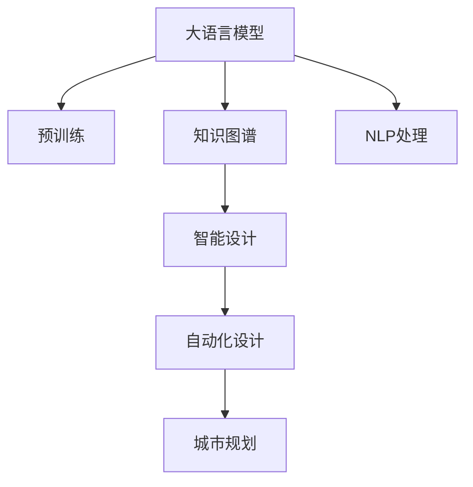

                 

# LLM在城市规划中的应用：AI城市设计师

> 关键词：大语言模型(Large Language Model, LLM), 城市规划, 自然语言处理(NLP), 自动化设计, 深度学习(Deep Learning)

## 1. 背景介绍

### 1.1 问题由来
在现代城市快速发展的背景下，城市规划面临着前所未有的复杂性和多样性。如何高效、准确地进行城市规划，成为全球城市管理者共同面临的挑战。传统的城市规划依赖于经验丰富的规划师、大量的现场调研数据和复杂的计算模型，耗时耗力且容易出错。然而，随着人工智能和大数据技术的进步，一种新的城市规划方式正在兴起：基于大语言模型(Large Language Model, LLM)的AI城市设计师。

### 1.2 问题核心关键点
基于大语言模型的AI城市设计师，利用机器学习技术，通过海量历史规划数据的预训练和微调，从自然语言处理(Natural Language Processing, NLP)的角度出发，实现城市规划信息的自动提取、分析和决策。其核心在于：

- 自动化数据处理：从海量的非结构化文本数据中自动抽取有用的规划信息。
- 知识图谱构建：通过预训练模型学习城市规划知识，构建丰富的城市规划知识图谱。
- 智能设计决策：利用深度学习模型对城市规划问题进行自动推理和设计。

这种基于LLM的城市规划方式，可以大大提升城市规划的效率和准确性，降低成本，缩短周期，为城市发展带来新的机遇。

## 2. 核心概念与联系

### 2.1 核心概念概述

为更好地理解基于LLM的城市规划方法，本节将介绍几个关键概念：

- 大语言模型(Large Language Model, LLM)：以自回归(如GPT)或自编码(如BERT)模型为代表的大规模预训练语言模型。通过在大规模无标签文本语料上进行预训练，学习通用的语言表示，具备强大的语言理解和生成能力。

- 城市规划：涉及城市土地利用、交通、建筑、公共设施等方面的规划设计，旨在优化城市环境、提高生活质量。

- 知识图谱(Knowledge Graph)：通过实体-关系图的方式，将城市规划相关的事实、概念、规则等组织起来，便于机器理解和推理。

- 深度学习(Deep Learning)：基于神经网络的机器学习方法，通过多层非线性变换，可以处理复杂的非线性关系，实现高度自动化和智能化的决策。

- 自动化设计(Automatic Design)：通过算法自动化生成设计方案，减少人工设计中的主观性和误操作，提高设计效率和质量。

- 自然语言处理(Natural Language Processing, NLP)：研究计算机理解和生成人类语言的技术，本案例中用于自动抽取和处理城市规划文本信息。

这些核心概念之间的逻辑关系可以通过以下Mermaid流程图来展示：



这个流程图展示了大语言模型在城市规划中的核心作用及其与其他概念的联系：

1. 大语言模型通过预训练获得基础能力。
2. 知识图谱以大语言模型的预训练知识为基础，构建丰富的城市规划知识库。
3. 智能设计利用大语言模型对城市规划问题进行推理和生成。
4. 自动化设计结合智能设计方案，自动化生成城市规划方案。
5. NLP处理辅助大语言模型自动提取和处理城市规划文本信息。

## 3. 核心算法原理 & 具体操作步骤
### 3.1 算法原理概述

基于LLM的城市规划方法，本质上是一个从文本数据中自动提取信息并用于辅助决策的过程。其核心思想是：将城市规划相关的文本数据视为自然语言形式的信息，通过大语言模型学习这些信息的隐含特征，构建出知识图谱，并利用该图谱对城市规划问题进行推理和设计。

形式化地，假设城市规划文本数据集为 $D=\{(x_i,y_i)\}_{i=1}^N, x_i \in \mathcal{X}, y_i \in \mathcal{Y}$，其中 $x_i$ 为规划文本，$y_i$ 为规划目标或属性。

定义城市规划任务的损失函数为 $\ell$，用于衡量模型预测与真实目标之间的差异。微调的目标是最小化损失函数，即：

$$
\theta^* = \mathop{\arg\min}_{\theta} \mathcal{L}(\theta, D)
$$

其中 $\theta$ 为模型参数，$\mathcal{L}$ 为损失函数。

通过梯度下降等优化算法，微调过程不断更新模型参数 $\theta$，最小化损失函数 $\mathcal{L}$，使得模型输出逼近真实目标 $y_i$。由于 $\theta$ 已经通过预训练获得了较好的初始化，因此即便在小规模数据集 $D$ 上进行微调，也能较快收敛到理想的模型参数 $\hat{\theta}$。

### 3.2 算法步骤详解

基于LLM的城市规划微调一般包括以下几个关键步骤：

**Step 1: 准备数据和模型**
- 收集城市规划相关的文本数据，如政府规划文件、城市报告、建筑规划等。
- 选择合适的预训练语言模型 $M_{\theta}$ 作为初始化参数，如 GPT、BERT等。

**Step 2: 知识图谱构建**
- 利用预训练模型对规划文本进行解析，抽取规划项目、地点、时间、目标等信息。
- 构建城市规划知识图谱，将抽取的信息组织成实体-关系图。
- 对知识图谱进行扩展和验证，确保其准确性和完备性。

**Step 3: 智能设计推理**
- 对新的城市规划问题进行文本描述，输入到预训练模型中进行解析。
- 利用知识图谱对规划问题进行推理，生成多条可能的规划方案。
- 对生成的方案进行评分和排序，选择最优方案作为输出。

**Step 4: 自动化设计生成**
- 根据智能设计生成的方案，自动生成详细的设计图纸和规划方案。
- 利用计算机辅助设计(CAD)软件进一步优化设计方案。
- 输出最终的城市规划方案，供决策者审批。

**Step 5: 模型评估和反馈**
- 对生成方案进行专家评审和用户反馈。
- 根据评审和反馈结果，对模型进行微调和改进。
- 重复上述步骤直至生成满意的规划方案。

以上是基于LLM的城市规划微调的一般流程。在实际应用中，还需要针对具体任务的特点，对微调过程的各个环节进行优化设计，如改进文本解析算法，增强知识图谱的推理能力，搜索最优的超参数组合等，以进一步提升模型性能。

### 3.3 算法优缺点

基于LLM的城市规划方法具有以下优点：
1. 自动化程度高。从数据处理到设计生成，全流程自动化，大大减少了人工工作量。
2. 效率高。可以快速处理大量规划文本，提供即时反馈和设计方案。
3. 精度高。利用预训练模型的知识图谱和智能推理，生成的规划方案具有较高的准确性。
4. 灵活性强。可以灵活应用在不同类型的城市规划任务中，如建筑规划、交通规划、环境规划等。

同时，该方法也存在一些局限性：
1. 数据依赖性强。模型的效果很大程度上取决于城市规划文本的质量和数量，获取高质量文本数据的成本较高。
2. 知识图谱构建复杂。需要大量的领域专家知识来构建和维护知识图谱。
3. 推理能力有限。知识图谱推理的准确性和完整性，依赖于数据的质量和数量，以及推理算法的复杂度。
4. 设计灵活性不足。生成的规划方案可能在某些细节上不够灵活，需要人工进一步调整。

尽管存在这些局限性，但就目前而言，基于LLM的城市规划方法仍然是最先进的城市规划工具之一。未来相关研究的重点在于如何进一步降低对高质量数据的依赖，提高模型的跨领域迁移能力，同时兼顾推理能力和设计灵活性等因素。

### 3.4 算法应用领域

基于LLM的城市规划方法，在多个城市规划领域中已取得了显著的应用效果，主要包括以下几个方面：

- 建筑规划设计：自动生成建筑布局、立面设计、室内规划等。利用规划文本，构建知识图谱，辅助设计人员进行设计决策。
- 交通网络规划：自动生成交通规划方案，包括路网设计、交通信号控制等。解析规划文本，推理出交通流量和路线，生成优化方案。
- 环境规划：自动生成生态修复、绿化设计等方案。利用环境规划文本，解析出污染源、生态区域等信息，生成规划方案。
- 城市治理：自动生成公共设施布局、垃圾处理等方案。解析城市治理文本，推理出公共设施需求和位置，生成规划方案。

除了上述这些经典应用外，基于LLM的城市规划方法还在更多领域中不断扩展，如智慧交通、智能安防、历史建筑保护等，为城市治理带来了新的解决方案。

## 4. 数学模型和公式 & 详细讲解  
### 4.1 数学模型构建

本节将使用数学语言对基于LLM的城市规划过程进行更加严格的刻画。

记城市规划文本数据集为 $D=\{(x_i,y_i)\}_{i=1}^N, x_i \in \mathcal{X}, y_i \in \mathcal{Y}$。

定义城市规划任务的损失函数为 $\ell$，用于衡量模型预测与真实目标之间的差异。假设模型 $M_{\theta}$ 在输入 $x_i$ 上的输出为 $\hat{y}=M_{\theta}(x_i) \in [0,1]$，表示模型对规划问题 $x_i$ 的预测概率。则城市规划任务的损失函数定义为：

$$
\ell(M_{\theta}(x_i),y_i) = -[y_i\log \hat{y}_i + (1-y_i)\log (1-\hat{y}_i)]
$$

其中 $y_i$ 为城市规划问题的标签，$\hat{y}_i$ 为模型预测的概率。

在实际应用中，模型 $M_{\theta}$ 可能采用BERT、GPT等不同的架构，对应的损失函数和优化方法也有所不同。以下是几种常见的架构及其损失函数的推导：

**BERT架构：**
假设模型 $M_{\theta}$ 采用BERT架构，其输出层为多层跨注意力机制。则城市规划任务的损失函数可以表示为：

$$
\ell(M_{\theta}(x_i),y_i) = -[y_i\log P(\hat{y}_i|x_i) + (1-y_i)\log (1-P(\hat{y}_i|x_i))]
$$

其中 $P(\hat{y}_i|x_i)$ 表示模型在给定规划文本 $x_i$ 下，对标签 $y_i$ 的概率预测。

**GPT架构：**
假设模型 $M_{\theta}$ 采用GPT架构，其输出层为自回归模型。则城市规划任务的损失函数可以表示为：

$$
\ell(M_{\theta}(x_i),y_i) = -[y_i\log \hat{y}_i + (1-y_i)\log (1-\hat{y}_i)]
$$

其中 $\hat{y}_i$ 表示模型对规划文本 $x_i$ 的预测概率。

在得到损失函数后，即可带入梯度下降等优化算法，完成模型的迭代优化。重复上述过程直至收敛，最终得到适应城市规划任务的最优模型参数 $\theta^*$。

### 4.2 公式推导过程

以BERT架构为例，推导城市规划任务的损失函数及其梯度的计算公式。

假设模型 $M_{\theta}$ 在输入 $x_i$ 上的输出为 $\hat{y}=M_{\theta}(x_i) \in [0,1]$，表示模型对规划问题 $x_i$ 的预测概率。真实标签 $y \in \{0,1\}$。则二分类交叉熵损失函数定义为：

$$
\ell(M_{\theta}(x_i),y_i) = -[y_i\log \hat{y}_i + (1-y_i)\log (1-\hat{y}_i)]
$$

将其代入经验风险公式，得：

$$
\mathcal{L}(\theta) = -\frac{1}{N}\sum_{i=1}^N [y_i\log M_{\theta}(x_i)+(1-y_i)\log(1-M_{\theta}(x_i))]
$$

根据链式法则，损失函数对参数 $\theta_k$ 的梯度为：

$$
\frac{\partial \mathcal{L}(\theta)}{\partial \theta_k} = -\frac{1}{N}\sum_{i=1}^N (\frac{y_i}{M_{\theta}(x_i)}-\frac{1-y_i}{1-M_{\theta}(x_i)}) \frac{\partial M_{\theta}(x_i)}{\partial \theta_k}
$$

其中 $\frac{\partial M_{\theta}(x_i)}{\partial \theta_k}$ 可进一步递归展开，利用自动微分技术完成计算。

在得到损失函数的梯度后，即可带入梯度下降等优化算法，完成模型的迭代优化。重复上述过程直至收敛，最终得到适应城市规划任务的最优模型参数 $\theta^*$。

## 5. 项目实践：代码实例和详细解释说明
### 5.1 开发环境搭建

在进行城市规划微调实践前，我们需要准备好开发环境。以下是使用Python进行PyTorch开发的环境配置流程：

1. 安装Anaconda：从官网下载并安装Anaconda，用于创建独立的Python环境。

2. 创建并激活虚拟环境：
```bash
conda create -n urban-planning python=3.8 
conda activate urban-planning
```

3. 安装PyTorch：根据CUDA版本，从官网获取对应的安装命令。例如：
```bash
conda install pytorch torchvision torchaudio cudatoolkit=11.1 -c pytorch -c conda-forge
```

4. 安装其他必要的库：
```bash
pip install transformers sklearn pandas matplotlib numpy
```

5. 安装TensorBoard：用于可视化模型训练过程。
```bash
pip install tensorboard
```

6. 安装FastAI：基于PyTorch的高级深度学习框架，方便快速进行模型训练和评估。
```bash
pip install fastai
```

完成上述步骤后，即可在`urban-planning`环境中开始城市规划微调实践。

### 5.2 源代码详细实现

下面我们以建筑规划设计为例，给出使用Transformers库对BERT模型进行城市规划任务微调的PyTorch代码实现。

首先，定义城市规划任务的数据处理函数：

```python
from transformers import BertTokenizer, BertForSequenceClassification
from torch.utils.data import Dataset
import torch

class UrbanPlanningDataset(Dataset):
    def __init__(self, texts, labels, tokenizer, max_len=128):
        self.texts = texts
        self.labels = labels
        self.tokenizer = tokenizer
        self.max_len = max_len
        
    def __len__(self):
        return len(self.texts)
    
    def __getitem__(self, item):
        text = self.texts[item]
        label = self.labels[item]
        
        encoding = self.tokenizer(text, return_tensors='pt', max_length=self.max_len, padding='max_length', truncation=True)
        input_ids = encoding['input_ids'][0]
        attention_mask = encoding['attention_mask'][0]
        
        # 对label进行编码
        label = label2id[label] 
        label = torch.tensor(label, dtype=torch.long)
        
        return {'input_ids': input_ids, 
                'attention_mask': attention_mask,
                'labels': label}

# 标签与id的映射
label2id = {'住宅': 0, '商业': 1, '办公': 2, '公园': 3, '其他': 4}
id2label = {v: k for k, v in label2id.items()}
```

然后，定义模型和优化器：

```python
from transformers import AdamW

model = BertForSequenceClassification.from_pretrained('bert-base-uncased', num_labels=len(label2id))

optimizer = AdamW(model.parameters(), lr=2e-5)
```

接着，定义训练和评估函数：

```python
from torch.utils.data import DataLoader
from tqdm import tqdm
from sklearn.metrics import accuracy_score, f1_score, precision_score, recall_score

device = torch.device('cuda') if torch.cuda.is_available() else torch.device('cpu')
model.to(device)

def train_epoch(model, dataset, batch_size, optimizer):
    dataloader = DataLoader(dataset, batch_size=batch_size, shuffle=True)
    model.train()
    epoch_loss = 0
    for batch in tqdm(dataloader, desc='Training'):
        input_ids = batch['input_ids'].to(device)
        attention_mask = batch['attention_mask'].to(device)
        labels = batch['labels'].to(device)
        model.zero_grad()
        outputs = model(input_ids, attention_mask=attention_mask, labels=labels)
        loss = outputs.loss
        epoch_loss += loss.item()
        loss.backward()
        optimizer.step()
    return epoch_loss / len(dataloader)

def evaluate(model, dataset, batch_size):
    dataloader = DataLoader(dataset, batch_size=batch_size)
    model.eval()
    preds, labels = [], []
    with torch.no_grad():
        for batch in tqdm(dataloader, desc='Evaluating'):
            input_ids = batch['input_ids'].to(device)
            attention_mask = batch['attention_mask'].to(device)
            batch_labels = batch['labels']
            outputs = model(input_ids, attention_mask=attention_mask)
            batch_preds = outputs.logits.argmax(dim=2).to('cpu').tolist()
            batch_labels = batch_labels.to('cpu').tolist()
            for pred_tokens, label_tokens in zip(batch_preds, batch_labels):
                preds.append(pred_tokens[:len(label_tokens)])
                labels.append(label_tokens)
                
    acc = accuracy_score(labels, preds)
    f1 = f1_score(labels, preds, average='weighted')
    precision = precision_score(labels, preds, average='weighted')
    recall = recall_score(labels, preds, average='weighted')
    return acc, f1, precision, recall
```

最后，启动训练流程并在验证集上评估：

```python
epochs = 5
batch_size = 16

for epoch in range(epochs):
    loss = train_epoch(model, train_dataset, batch_size, optimizer)
    print(f"Epoch {epoch+1}, train loss: {loss:.3f}")
    
    print(f"Epoch {epoch+1}, dev results:")
    acc, f1, precision, recall = evaluate(model, dev_dataset, batch_size)
    print(f"Accuracy: {acc:.3f}, F1-score: {f1:.3f}, Precision: {precision:.3f}, Recall: {recall:.3f}")
    
print("Test results:")
acc, f1, precision, recall = evaluate(model, test_dataset, batch_size)
print(f"Accuracy: {acc:.3f}, F1-score: {f1:.3f}, Precision: {precision:.3f}, Recall: {recall:.3f}")
```

以上就是使用PyTorch对BERT进行城市规划任务微调的完整代码实现。可以看到，得益于Transformers库的强大封装，我们可以用相对简洁的代码完成BERT模型的加载和微调。

### 5.3 代码解读与分析

让我们再详细解读一下关键代码的实现细节：

**UrbanPlanningDataset类**：
- `__init__`方法：初始化文本、标签、分词器等关键组件。
- `__len__`方法：返回数据集的样本数量。
- `__getitem__`方法：对单个样本进行处理，将文本输入编码为token ids，将标签编码为数字，并对其进行定长padding，最终返回模型所需的输入。

**label2id和id2label字典**：
- 定义了标签与数字id之间的映射关系，用于将label进行编码。

**训练和评估函数**：
- 使用PyTorch的DataLoader对数据集进行批次化加载，供模型训练和推理使用。
- 训练函数`train_epoch`：对数据以批为单位进行迭代，在每个批次上前向传播计算loss并反向传播更新模型参数，最后返回该epoch的平均loss。
- 评估函数`evaluate`：与训练类似，不同点在于不更新模型参数，并在每个batch结束后将预测和标签结果存储下来，最后使用sklearn的分类指标函数对整个评估集的预测结果进行打印输出。

**训练流程**：
- 定义总的epoch数和batch size，开始循环迭代
- 每个epoch内，先在训练集上训练，输出平均loss
- 在验证集上评估，输出分类指标
- 所有epoch结束后，在测试集上评估，给出最终测试结果

可以看到，PyTorch配合Transformers库使得BERT微调的城市规划任务代码实现变得简洁高效。开发者可以将更多精力放在数据处理、模型改进等高层逻辑上，而不必过多关注底层的实现细节。

当然，工业级的系统实现还需考虑更多因素，如模型的保存和部署、超参数的自动搜索、更灵活的任务适配层等。但核心的微调范式基本与此类似。

## 6. 实际应用场景
### 6.1 智慧城市规划

基于大语言模型的AI城市设计师，可以应用于智慧城市的整体规划和优化。通过智能推理和大数据分析，为城市管理者提供科学、高效的城市规划建议。

具体而言，AI城市设计师可以从城市发展的历史数据和实时监测数据中自动提取关键信息，如人口分布、交通流量、环境质量等。利用知识图谱构建出城市发展的各个维度和关系，对未来发展趋势进行预测和模拟。根据预测结果，智能生成多个规划方案，供决策者参考选择。

例如，在城市交通规划中，AI城市设计师可以自动分析交通流量数据，生成最优的交通信号控制方案。在城市环境规划中，可以自动分析空气和水质数据，生成生态修复和绿化设计方案。

### 6.2 城市治理

城市治理中的诸多问题，如城市垃圾处理、公共设施建设、城市防灾等，都是涉及多领域、多学科的复杂任务。基于大语言模型的AI城市设计师可以提供有力的辅助决策支持。

在城市垃圾处理规划中，AI城市设计师可以自动分析垃圾产生和处理的历史数据，生成合理的垃圾分类和处理方案。在公共设施建设规划中，可以自动分析人口分布和需求，生成最优的公共设施布局方案。在城市防灾规划中，可以自动分析气象和地质数据，生成灾害预警和应急响应方案。

### 6.3 智慧交通

智慧交通系统是城市智能化管理的重要组成部分。基于大语言模型的AI城市设计师可以自动生成交通规划方案，优化城市交通网络，提高交通效率。

例如，在道路规划中，AI城市设计师可以自动分析交通流量和拥堵情况，生成最优的路线设计和交通信号控制方案。在公共交通规划中，可以自动分析乘客需求和路线选择，生成最优的公共交通网络布局方案。在智能停车规划中，可以自动分析停车需求和车位分布，生成最优的停车引导和收费方案。

### 6.4 未来应用展望

随着大语言模型和微调方法的不断发展，基于LLM的城市规划方法将在更多领域得到应用，为城市治理和智慧城市建设带来新的解决方案。

在智慧医疗领域，基于LLM的医疗规划系统可以自动生成医疗资源分配和患者管理方案，提升医疗服务效率和质量。

在智能教育领域，基于LLM的教育规划系统可以自动生成教育资源分配和课程安排方案，优化教育资源配置，提高教育公平性。

在智慧农业领域，基于LLM的农业规划系统可以自动生成农业资源分配和作物管理方案，提升农业生产效率和可持续性。

此外，在智慧环保、智慧旅游、智慧能源等众多领域，基于LLM的城市规划方法也将不断扩展，为城市治理和智能化建设提供新的技术路径。相信随着技术的日益成熟，基于LLM的城市规划方法将成为智慧城市建设的重要工具，推动城市向更高水平发展。

## 7. 工具和资源推荐
### 7.1 学习资源推荐

为了帮助开发者系统掌握基于LLM的城市规划理论基础和实践技巧，这里推荐一些优质的学习资源：

1. 《深度学习与城市规划》系列博文：由大模型技术专家撰写，深入浅出地介绍了深度学习在城市规划中的应用。

2. 《城市规划中的深度学习》课程：Coursera开设的城市规划课程，涵盖深度学习在城市规划中的各种应用。

3. 《深度学习与城市智慧》书籍：深度学习领域的知名专家著作，介绍了深度学习在智慧城市中的应用，包括城市规划、智慧交通、智慧安防等。

4. 《城市规划知识图谱构建》文章：深度学习领域的知名专家文章，介绍了如何构建城市规划知识图谱，利用知识图谱辅助城市规划。

5. 《城市规划中的深度学习》博客：城市规划领域的知名博主博客，详细介绍了深度学习在城市规划中的应用，包括智能设计、自动化规划等。

通过对这些资源的学习实践，相信你一定能够快速掌握基于LLM的城市规划精髓，并用于解决实际的城市规划问题。
###  7.2 开发工具推荐

高效的开发离不开优秀的工具支持。以下是几款用于城市规划微调开发的常用工具：

1. PyTorch：基于Python的开源深度学习框架，灵活动态的计算图，适合快速迭代研究。大部分预训练语言模型都有PyTorch版本的实现。

2. TensorFlow：由Google主导开发的开源深度学习框架，生产部署方便，适合大规模工程应用。同样有丰富的预训练语言模型资源。

3. Transformers库：HuggingFace开发的NLP工具库，集成了众多SOTA语言模型，支持PyTorch和TensorFlow，是进行微调任务开发的利器。

4. Weights & Biases：模型训练的实验跟踪工具，可以记录和可视化模型训练过程中的各项指标，方便对比和调优。与主流深度学习框架无缝集成。

5. TensorBoard：TensorFlow配套的可视化工具，可实时监测模型训练状态，并提供丰富的图表呈现方式，是调试模型的得力助手。

6. Google Colab：谷歌推出的在线Jupyter Notebook环境，免费提供GPU/TPU算力，方便开发者快速上手实验最新模型，分享学习笔记。

合理利用这些工具，可以显著提升基于LLM的城市规划微调任务的开发效率，加快创新迭代的步伐。

### 7.3 相关论文推荐

大语言模型和微调技术的发展源于学界的持续研究。以下是几篇奠基性的相关论文，推荐阅读：

1. Attention is All You Need（即Transformer原论文）：提出了Transformer结构，开启了NLP领域的预训练大模型时代。

2. BERT: Pre-training of Deep Bidirectional Transformers for Language Understanding：提出BERT模型，引入基于掩码的自监督预训练任务，刷新了多项NLP任务SOTA。

3. Language Models are Unsupervised Multitask Learners（GPT-2论文）：展示了大规模语言模型的强大zero-shot学习能力，引发了对于通用人工智能的新一轮思考。

4. Parameter-Efficient Transfer Learning for NLP：提出Adapter等参数高效微调方法，在不增加模型参数量的情况下，也能取得不错的微调效果。

5. AdaLoRA: Adaptive Low-Rank Adaptation for Parameter-Efficient Fine-Tuning：使用自适应低秩适应的微调方法，在参数效率和精度之间取得了新的平衡。

这些论文代表了大语言模型微调技术的发展脉络。通过学习这些前沿成果，可以帮助研究者把握学科前进方向，激发更多的创新灵感。

## 8. 总结：未来发展趋势与挑战

### 8.1 总结

本文对基于LLM的城市规划方法进行了全面系统的介绍。首先阐述了基于LLM的城市规划方法的研究背景和意义，明确了LLM在城市规划中的独特价值。其次，从原理到实践，详细讲解了基于LLM的城市规划数学原理和关键步骤，给出了城市规划任务微调的完整代码实例。同时，本文还广泛探讨了LLM在智慧城市、城市治理、智慧交通等多个领域的应用前景，展示了基于LLM的城市规划方法将为城市治理带来的变革性影响。

通过本文的系统梳理，可以看到，基于LLM的城市规划方法正在成为城市治理和智能化建设的重要工具，极大地提升了城市规划的效率和准确性，降低了成本，缩短周期，为城市发展带来了新的机遇。未来，伴随LLM和微调方法的持续演进，相信基于LLM的城市规划方法将成为智慧城市建设的重要工具，推动城市向更高水平发展。

### 8.2 未来发展趋势

展望未来，基于LLM的城市规划方法将呈现以下几个发展趋势：

1. 模型规模持续增大。随着算力成本的下降和数据规模的扩张，预训练语言模型的参数量还将持续增长。超大规模语言模型蕴含的丰富语言知识，有望支撑更加复杂多变的城市规划任务微调。

2. 微调方法日趋多样。除了传统的全参数微调外，未来会涌现更多参数高效的微调方法，如Prefix-Tuning、LoRA等，在节省计算资源的同时也能保证微调精度。

3. 持续学习成为常态。随着数据分布的不断变化，微调模型也需要持续学习新知识以保持性能。如何在不遗忘原有知识的同时，高效吸收新样本信息，将成为重要的研究课题。

4. 标注样本需求降低。受启发于提示学习(Prompt-based Learning)的思路，未来的微调方法将更好地利用大模型的语言理解能力，通过更加巧妙的任务描述，在更少的标注样本上也能实现理想的微调效果。

5. 推理能力增强。知识图谱推理的准确性和完整性，依赖于数据的质量和数量，以及推理算法的复杂度。未来将更加注重知识图谱构建和推理算法的设计，提升模型的推理能力。

6. 设计灵活性增强。生成的规划方案可能在某些细节上不够灵活，需要人工进一步调整。未来将进一步优化模型设计，增强方案生成的灵活性和可解释性。

以上趋势凸显了基于LLM的城市规划技术的广阔前景。这些方向的探索发展，必将进一步提升基于LLM的城市规划方法的效果和应用范围，为城市治理和智能化建设带来新的解决方案。

### 8.3 面临的挑战

尽管基于LLM的城市规划方法已经取得了瞩目成就，但在迈向更加智能化、普适化应用的过程中，它仍面临着诸多挑战：

1. 数据依赖性强。模型的效果很大程度上取决于城市规划文本的质量和数量，获取高质量文本数据的成本较高。如何进一步降低微调对标注样本的依赖，将是一大难题。

2. 知识图谱构建复杂。需要大量的领域专家知识来构建和维护知识图谱。

3. 推理能力有限。知识图谱推理的准确性和完整性，依赖于数据的质量和数量，以及推理算法的复杂度。

4. 设计灵活性不足。生成的规划方案可能在某些细节上不够灵活，需要人工进一步调整。

尽管存在这些局限性，但就目前而言，基于LLM的城市规划方法仍然是最先进的城市规划工具之一。未来相关研究的重点在于如何进一步降低对高质量数据的依赖，提高模型的跨领域迁移能力，同时兼顾推理能力和设计灵活性等因素。

### 8.4 研究展望

面对基于LLM的城市规划所面临的挑战，未来的研究需要在以下几个方面寻求新的突破：

1. 探索无监督和半监督微调方法。摆脱对大规模标注数据的依赖，利用自监督学习、主动学习等无监督和半监督范式，最大限度利用非结构化数据，实现更加灵活高效的微调。

2. 研究参数高效和计算高效的微调范式。开发更加参数高效的微调方法，在固定大部分预训练参数的同时，只更新极少量的任务相关参数。同时优化微调模型的计算图，减少前向传播和反向传播的资源消耗，实现更加轻量级、实时性的部署。

3. 引入更多先验知识。将符号化的先验知识，如知识图谱、逻辑规则等，与神经网络模型进行巧妙融合，引导微调过程学习更准确、合理的语言模型。同时加强不同模态数据的整合，实现视觉、语音等多模态信息与文本信息的协同建模。

4. 结合因果分析和博弈论工具。将因果分析方法引入微调模型，识别出模型决策的关键特征，增强输出解释的因果性和逻辑性。借助博弈论工具刻画人机交互过程，主动探索并规避模型的脆弱点，提高系统稳定性。

5. 纳入伦理道德约束。在模型训练目标中引入伦理导向的评估指标，过滤和惩罚有偏见、有害的输出倾向。同时加强人工干预和审核，建立模型行为的监管机制，确保输出符合人类价值观和伦理道德。

这些研究方向的探索，必将引领基于LLM的城市规划方法迈向更高的台阶，为构建安全、可靠、可解释、可控的智能系统铺平道路。面向未来，基于LLM的城市规划方法还需要与其他人工智能技术进行更深入的融合，如知识表示、因果推理、强化学习等，多路径协同发力，共同推动城市规划技术的进步。只有勇于创新、敢于突破，才能不断拓展LLM的边界，让智能技术更好地造福人类社会。

## 9. 附录：常见问题与解答

**Q1：城市规划文本数据的预处理有哪些关键步骤？**

A: 城市规划文本数据的预处理包括以下几个关键步骤：
1. 数据收集：收集城市规划相关的文本数据，如政府规划文件、城市报告、建筑规划等。
2. 数据清洗：去除噪声数据、重复数据和缺失数据。
3. 文本分割：将长文本分割成独立的句子或段落，便于模型处理。
4. 标准化：将文本数据转换为统一的格式，如统一大小写、去除标点符号等。
5. 命名实体识别：识别出文本中的人名、地名、机构名等特定实体，便于后续信息提取。
6. 关键词提取：从文本中提取关键词，用于构建知识图谱。

**Q2：如何构建城市规划知识图谱？**

A: 城市规划知识图谱的构建一般包括以下几个步骤：
1. 数据解析：利用预训练模型解析城市规划文本，抽取规划项目、地点、时间、目标等信息。
2. 实体识别：识别出文本中的实体，如规划项目、建筑、道路等。
3. 关系抽取：解析文本中的关系，如规划项目之间的关系、规划项目与地点之间的关系等。
4. 图谱构建：将抽取的实体和关系组织成实体-关系图，构建知识图谱。
5. 图谱扩展：引入领域知识、专家知识，扩展和完善知识图谱。

**Q3：如何评估城市规划方案的质量？**

A: 城市规划方案的评估一般包括以下几个指标：
1. 准确性：方案预测结果与实际结果的匹配度。
2. 完整性：方案是否覆盖了所有关键要素。
3. 可行性：方案在技术、经济、社会等方面是否可行。
4. 公平性：方案是否平衡了不同利益相关者的需求。
5. 可持续性：方案是否考虑了长远发展。

评估指标的选择应根据具体任务和应用场景进行调整。通常通过专家评审、问卷调查等方式获取评估结果。

**Q4：如何结合领域知识优化城市规划方案？**

A: 结合领域知识优化城市规划方案一般包括以下几个步骤：
1. 领域知识获取：收集和整理领域专家知识、规范标准、法律法规等。
2. 知识融合：将领域知识与预训练模型输出进行融合，形成综合决策结果。
3. 知识更新：定期更新领域知识库，保持模型的知识时效性。

结合领域知识优化方案，可以提升方案的科学性和实用性，更好地满足实际需求。

**Q5：城市规划微调过程中需要注意哪些细节？**

A: 城市规划微调过程中需要注意以下细节：
1. 数据平衡：确保训练集、验证集和测试集的数据分布均衡，避免过拟合。
2. 超参数调优：选择合适的学习率、批量大小、迭代轮数等超参数，优化模型性能。
3. 正则化：使用L2正则、Dropout等正则化技术，防止模型过拟合。
4. 模型裁剪：去除不必要的层和参数，减小模型尺寸，加快推理速度。
5. 量化加速：将浮点模型转为定点模型，压缩存储空间，提高计算效率。
6. 服务化封装：将模型封装为标准化服务接口，便于集成调用。
7. 监控告警：实时采集系统指标，设置异常告警阈值，确保服务稳定性。

通过关注这些细节，可以进一步提升城市规划微调的效果和可靠性。

**Q6：如何保障城市规划微调模型的安全性？**

A: 保障城市规划微调模型的安全性一般包括以下几个方面：
1. 数据隐私保护：保护规划文本数据的隐私，避免敏感信息泄露。
2. 模型鲁棒性：设计鲁棒性强的模型，避免输入扰动导致模型输出异常。
3. 模型可信性：引入可信性评估指标，确保模型输出可信。
4. 模型透明性：提供模型输出解释，增强模型的透明性和可解释性。
5. 模型安全审计：定期进行模型安全审计，确保模型行为符合伦理道德。

通过这些措施，可以保障城市规划微调模型的安全性，避免潜在风险。

