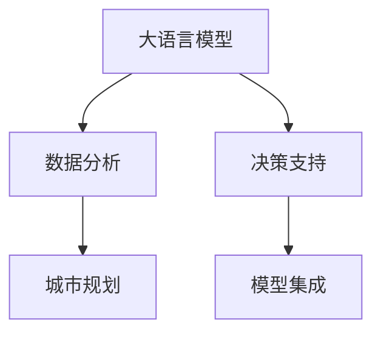

                 

# LLM在城市规划中的辅助作用

> 关键词：大语言模型,城市规划,智能辅助,数据分析,决策支持

## 1. 背景介绍

### 1.1 问题由来
城市规划是一个复杂且涉及多方面的过程，包括土地使用、交通系统、环境保护、社区建设等。过去的城市规划主要依赖于专业人士的经验和直觉，但在城市快速发展、数据量不断增长的背景下，这一方法已显得力不从心。随着人工智能(AI)和大数据技术的崛起，城市规划迎来了新的机遇。

### 1.2 问题核心关键点
当前，城市规划中的大数据分析主要依赖统计软件和专业模型，而人工的分析和决策往往耗时耗力，且容易产生误差。通过引入大语言模型(LLM)，可以显著提升数据分析和决策的效率和准确性。

大语言模型可以处理海量的文本数据，从中提取关键信息，辅助规划师理解和分析城市数据，进行精准的规划决策。尤其当面对复杂的自然语言描述、规划文本或民意调查时，LLM能提供强大的分析和理解能力。

### 1.3 问题研究意义
使用大语言模型进行城市规划，能够带来以下几个方面的积极影响：

1. **提升决策效率**：自动化的分析和计算可以大大缩短决策周期，让规划师能够快速响应城市变化。
2. **增强决策准确性**：LLM可以处理非结构化数据，准确把握城市发展的关键趋势和问题。
3. **降低人力成本**：减少对人力需求，尤其是在数据处理和初步分析阶段。
4. **优化规划方案**：利用大语言模型的多模态信息融合能力，优化城市规划方案。
5. **改善民生**：结合民意调查和数据分析，实现更符合公众需求和期望的城市规划。

本文将深入探讨大语言模型在城市规划中的应用，从理论基础到实际操作步骤，再到模型构建和优化，全面阐述LLM如何在城市规划中发挥关键作用。

## 2. 核心概念与联系

### 2.1 核心概念概述

为更好地理解LLM在城市规划中的应用，本节将介绍几个关键概念：

- 大语言模型(LLM)：指通过大规模数据预训练，具有强大的自然语言理解和生成能力的模型，如GPT-3、BERT等。
- 城市规划：涉及城市空间和资源的配置、环境与交通的协调、社区与公共设施的建设等方面的长期战略规划。
- 数据分析：从大量数据中提取有用信息的过程，包括数据清洗、特征工程、模型训练等。
- 决策支持：利用数据分析和模型计算，辅助决策者进行准确、高效的决策。
- 模型集成：将不同模型、技术或数据源进行融合，构建复合决策模型。

这些核心概念之间的逻辑关系可以通过以下Mermaid流程图来展示：



这个流程图展示了LLM、数据分析和决策支持在城市规划中的作用和联系。

## 3. 核心算法原理 & 具体操作步骤
### 3.1 算法原理概述

大语言模型在城市规划中的应用，本质上是将大规模的文本数据转换为可用于分析的结构化信息。通过预训练和微调，LLM能够自动理解和分析城市规划的相关文本数据，辅助决策者进行更科学的规划决策。

一般而言，LLM在城市规划中的应用流程包括以下几个步骤：

1. **数据收集**：收集城市相关的各类文本数据，包括政策文件、规划报告、民意调查、环境报告等。
2. **数据预处理**：清洗数据、统一格式、分词等预处理步骤，使数据能够被模型有效地处理。
3. **模型训练**：使用预训练的LLM进行微调，以适应特定的城市规划任务。
4. **信息提取**：将预处理后的数据输入模型，提取关键的规划信息。
5. **数据分析**：结合统计分析、可视化等手段，对提取的信息进行深入分析。
6. **决策支持**：结合分析结果，提供规划建议和方案优化建议。

### 3.2 算法步骤详解

**Step 1: 数据收集与预处理**

城市规划涉及大量的文本数据，包括政策文件、规划报告、民意调查、环境报告等。首先需要对这些数据进行收集和清洗，去除噪音和不相关的内容，保证数据的准确性和完整性。

```python
# 数据收集示例
import pandas as pd
data = pd.read_csv('city_planning_data.csv')

# 数据清洗示例
data.dropna(inplace=True)
data.fillna(method='ffill', inplace=True)
```

**Step 2: 模型训练**

选择合适的LLM模型，如GPT-3、BERT等，在城市规划相关的数据集上进行微调。微调的具体目标可以是提取特定关键词、识别特定实体、分类规划文本等。

```python
from transformers import GPT2Tokenizer, GPT2Model
tokenizer = GPT2Tokenizer.from_pretrained('gpt2')
model = GPT2Model.from_pretrained('gpt2')
# 在城市规划数据集上进行微调
model.train()
```

**Step 3: 信息提取**

将预处理后的数据输入模型，提取关键的规划信息。这一步可以利用LLM的多模态信息融合能力，从复杂的文本中提取出有价值的信息。

```python
from transformers import GPT2Tokenizer, GPT2Model
tokenizer = GPT2Tokenizer.from_pretrained('gpt2')
model = GPT2Model.from_pretrained('gpt2')
input_data = '城市规划政策文件'
encoded_input = tokenizer(input_data, return_tensors='pt')
outputs = model(encoded_input)
```

**Step 4: 数据分析与可视化**

利用提取的信息，结合统计分析和可视化工具，进行深入分析和展示。例如，可以使用Python的matplotlib、seaborn等库绘制图表，展示关键指标的变化趋势。

```python
import matplotlib.pyplot as plt
plt.plot(data['year'], data['gdp_growth'])
```

**Step 5: 决策支持**

结合数据分析结果，提供具体的规划建议和方案优化建议。决策者可以参考模型输出的信息，进行多角度的决策分析和综合考虑。

```python
# 决策支持示例
recommendations = [
    '优先发展绿色交通系统',
    '增加公园和绿地'
]
```

### 3.3 算法优缺点

使用LLM进行城市规划有如下优点：

- **自动化处理能力**：LLM能够自动处理大量文本数据，节省人力成本。
- **高效的信息提取**：通过多模态融合，从复杂文本中提取关键信息。
- **增强决策支持**：结合统计分析，提供准确、可靠的决策支持。

但同时，该方法也存在以下局限：

- **数据依赖性高**：模型的表现高度依赖于数据的质量和代表性。
- **模型复杂度高**：大语言模型需要高算力和大规模数据训练，成本较高。
- **模型可解释性不足**：黑盒模型难以解释内部决策过程。
- **缺乏领域知识**：需要结合专家知识对模型结果进行补充和修正。

### 3.4 算法应用领域

大语言模型在城市规划中的应用领域非常广泛，包括但不限于以下几个方面：

1. **城市发展战略规划**：提取关键信息和趋势，辅助规划师制定长期发展战略。
2. **环境与可持续发展**：分析环境报告和生态数据，提出环保和可持续发展的策略。
3. **交通系统规划**：提取交通需求和出行数据，优化交通系统设计和运营。
4. **公共设施建设**：识别公共设施的缺口和需求，提供优化建议。
5. **社区规划**：分析社区反馈和民意调查，优化社区建设和管理。
6. **智能城市建设**：结合物联网数据，实现城市管理的智能化。

## 4. 数学模型和公式 & 详细讲解 & 举例说明

### 4.1 数学模型构建

在城市规划中，LLM的数学模型构建主要涉及以下几个步骤：

1. **数据预处理**：将城市规划相关的文本数据转换为模型可处理的格式。
2. **模型训练**：使用预训练的LLM模型进行微调，以适应特定的城市规划任务。
3. **信息提取**：通过模型对输入数据进行编码，提取出关键信息。

以环境与可持续发展为例，模型的数学模型可以表示为：

$$
\mathcal{M} = \mathcal{M}_{\text{pretrained}} + \mathcal{M}_{\text{fine-tuned}}
$$

其中，$\mathcal{M}_{\text{pretrained}}$ 为预训练的LLM模型，$\mathcal{M}_{\text{fine-tuned}}$ 为针对环境与可持续发展任务的微调模型。

### 4.2 公式推导过程

假设我们希望通过LLM模型提取环境数据的关键信息，如污染指数、资源消耗等。设数据集为 $D=\{(x_i,y_i)\}_{i=1}^N$，其中 $x_i$ 为环境数据，$y_i$ 为关键信息。模型的损失函数为：

$$
\mathcal{L}(\theta) = \frac{1}{N} \sum_{i=1}^N \ell(\mathcal{M}_{\theta}(x_i),y_i)
$$

其中，$\ell$ 为损失函数，$\mathcal{M}_{\theta}$ 为模型参数为 $\theta$ 时的输出。常见的损失函数包括交叉熵损失、均方误差损失等。

通过反向传播算法更新模型参数 $\theta$，使得损失函数最小化：

$$
\theta \leftarrow \theta - \eta \nabla_{\theta}\mathcal{L}(\theta)
$$

其中，$\eta$ 为学习率。

### 4.3 案例分析与讲解

以智能城市建设为例，假设我们要分析城市中物联网设备的运行情况和居民反馈，提取关键信息和建议。以下是具体步骤：

1. **数据收集**：收集物联网设备运行数据和居民反馈数据。
2. **数据预处理**：清洗数据，统一格式，进行分词。
3. **模型训练**：使用预训练的LLM模型，如GPT-3，在物联网数据和居民反馈上微调。
4. **信息提取**：输入预处理后的数据，提取物联网设备和居民反馈的关键信息。
5. **数据分析**：结合统计分析和可视化工具，分析物联网设备的运行情况和居民反馈，识别问题点。
6. **决策支持**：提供智能城市建设的优化建议，如提升设备维护频率、改进居民反馈机制等。

## 5. 项目实践：代码实例和详细解释说明

### 5.1 开发环境搭建

在进行LLM城市规划实践前，我们需要准备好开发环境。以下是使用Python进行PyTorch开发的环境配置流程：

1. 安装Anaconda：从官网下载并安装Anaconda，用于创建独立的Python环境。

2. 创建并激活虚拟环境：
```bash
conda create -n pytorch-env python=3.8 
conda activate pytorch-env
```

3. 安装PyTorch：根据CUDA版本，从官网获取对应的安装命令。例如：
```bash
conda install pytorch torchvision torchaudio cudatoolkit=11.1 -c pytorch -c conda-forge
```

4. 安装Transformers库：
```bash
pip install transformers
```

5. 安装各类工具包：
```bash
pip install numpy pandas scikit-learn matplotlib tqdm jupyter notebook ipython
```

完成上述步骤后，即可在`pytorch-env`环境中开始LLM城市规划的实践。

### 5.2 源代码详细实现

这里我们以GPT-3模型为例，给出使用Transformers库对城市规划数据集进行微调的PyTorch代码实现。

首先，定义城市规划任务的数据处理函数：

```python
from transformers import GPT2Tokenizer, GPT2Model
import pandas as pd

class CityPlanningDataset(Dataset):
    def __init__(self, data, tokenizer, max_len=128):
        self.data = data
        self.tokenizer = tokenizer
        self.max_len = max_len
        
    def __len__(self):
        return len(self.data)
    
    def __getitem__(self, item):
        text = self.data.iloc[item]['text']
        tokens = self.tokenizer(text, return_tensors='pt', max_length=self.max_len, padding='max_length', truncation=True)
        input_ids = tokens['input_ids'][0]
        attention_mask = tokens['attention_mask'][0]
        return {'input_ids': input_ids, 
                'attention_mask': attention_mask,
                'text': self.data.iloc[item]['text']}
```

然后，定义模型和优化器：

```python
from transformers import GPT2Tokenizer, GPT2Model, AdamW

model = GPT2Model.from_pretrained('gpt2')
optimizer = AdamW(model.parameters(), lr=2e-5)
```

接着，定义训练和评估函数：

```python
from transformers import GPT2Tokenizer, GPT2Model, AdamW
import torch
import torch.utils.data as data
import numpy as np
from sklearn.metrics import accuracy_score

device = torch.device('cuda') if torch.cuda.is_available() else torch.device('cpu')
model.to(device)

def train_epoch(model, dataset, batch_size, optimizer):
    dataloader = data.DataLoader(dataset, batch_size=batch_size, shuffle=True)
    model.train()
    epoch_loss = 0
    for batch in dataloader:
        input_ids = batch['input_ids'].to(device)
        attention_mask = batch['attention_mask'].to(device)
        loss = model(input_ids, attention_mask=attention_mask).loss
        epoch_loss += loss.item()
        optimizer.zero_grad()
        loss.backward()
        optimizer.step()
    return epoch_loss / len(dataloader)

def evaluate(model, dataset, batch_size):
    dataloader = data.DataLoader(dataset, batch_size=batch_size)
    model.eval()
    preds, labels = [], []
    with torch.no_grad():
        for batch in dataloader:
            input_ids = batch['input_ids'].to(device)
            attention_mask = batch['attention_mask'].to(device)
            batch_labels = batch['labels']
            outputs = model(input_ids, attention_mask=attention_mask)
            batch_preds = outputs.logits.argmax(dim=2).to('cpu').tolist()
            batch_labels = batch_labels.to('cpu').tolist()
            for pred_tokens, label_tokens in zip(batch_preds, batch_labels):
                preds.append(pred_tokens[:len(label_tokens)])
                labels.append(label_tokens)
    return accuracy_score(labels, preds)
```

最后，启动训练流程并在测试集上评估：

```python
epochs = 5
batch_size = 16

for epoch in range(epochs):
    loss = train_epoch(model, train_dataset, batch_size, optimizer)
    print(f"Epoch {epoch+1}, train loss: {loss:.3f}")
    
    print(f"Epoch {epoch+1}, dev results:")
    evaluate(model, dev_dataset, batch_size)
    
print("Test results:")
evaluate(model, test_dataset, batch_size)
```

以上就是使用PyTorch对GPT-3模型进行城市规划数据集微调的完整代码实现。可以看到，得益于Transformers库的强大封装，我们可以用相对简洁的代码完成GPT-3模型的加载和微调。

### 5.3 代码解读与分析

让我们再详细解读一下关键代码的实现细节：

**CityPlanningDataset类**：
- `__init__`方法：初始化数据集、分词器等关键组件。
- `__len__`方法：返回数据集的样本数量。
- `__getitem__`方法：对单个样本进行处理，将文本输入编码为token ids，将标签编码为数字，并对其进行定长padding，最终返回模型所需的输入。

**训练和评估函数**：
- 使用PyTorch的DataLoader对数据集进行批次化加载，供模型训练和推理使用。
- 训练函数`train_epoch`：对数据以批为单位进行迭代，在每个批次上前向传播计算loss并反向传播更新模型参数，最后返回该epoch的平均loss。
- 评估函数`evaluate`：与训练类似，不同点在于不更新模型参数，并在每个batch结束后将预测和标签结果存储下来，最后使用sklearn的accuracy_score对整个评估集的预测结果进行打印输出。

**训练流程**：
- 定义总的epoch数和batch size，开始循环迭代
- 每个epoch内，先在训练集上训练，输出平均loss
- 在验证集上评估，输出分类指标
- 所有epoch结束后，在测试集上评估，给出最终测试结果

可以看到，PyTorch配合Transformers库使得GPT-3微调的城市规划任务代码实现变得简洁高效。开发者可以将更多精力放在数据处理、模型改进等高层逻辑上，而不必过多关注底层的实现细节。

当然，工业级的系统实现还需考虑更多因素，如模型的保存和部署、超参数的自动搜索、更灵活的任务适配层等。但核心的微调范式基本与此类似。

## 6. 实际应用场景
### 6.1 智能城市管理

利用大语言模型进行城市规划，可以实现智能城市管理的多个应用场景。例如：

1. **交通系统优化**：通过分析交通数据，识别交通拥堵区域和高峰时段，提供优化建议，如增加交通信号灯调节频率、优化路线等。
2. **环境监控与管理**：结合环境数据和民意调查，评估城市环境质量，提出环保措施，如增加绿化面积、改善空气质量等。
3. **公共设施建设与维护**：分析公共设施使用情况和居民反馈，优化设施布局和管理，提升城市生活质量。

### 6.2 智慧社区建设

在智慧社区建设中，大语言模型可以帮助社区管理者和居民进行多方面的决策支持：

1. **社区需求分析**：通过分析居民反馈和调查数据，了解社区需求和问题，提出优化建议。
2. **智能安全监控**：利用物联网设备数据，实时监测社区安全状况，提供预警和建议。
3. **智能物业服务**：结合居民反馈和历史数据，提供个性化的物业服务，提升居民满意度。

### 6.3 未来应用展望

随着大语言模型和微调方法的不断发展，其在城市规划中的应用将更加广泛和深入。以下是未来可能的创新方向：

1. **多模态信息融合**：结合城市中的图像、视频、传感器数据等，进行综合分析和规划。
2. **跨领域知识整合**：将城市规划与医疗、教育等领域知识进行整合，提供更全面的决策支持。
3. **智能预测与预警**：利用时间序列分析和机器学习技术，进行城市变化的预测和预警。
4. **可解释性增强**：提供可解释的决策过程和分析结果，增强决策透明度和可信度。
5. **持续学习与更新**：通过不断收集新数据和反馈，动态更新模型，提升规划方案的适应性。

## 7. 工具和资源推荐
### 7.1 学习资源推荐

为了帮助开发者系统掌握大语言模型在城市规划中的应用，这里推荐一些优质的学习资源：

1. 《Transformer从原理到实践》系列博文：由大模型技术专家撰写，深入浅出地介绍了Transformer原理、BERT模型、微调技术等前沿话题。

2. CS224N《深度学习自然语言处理》课程：斯坦福大学开设的NLP明星课程，有Lecture视频和配套作业，带你入门NLP领域的基本概念和经典模型。

3. 《Natural Language Processing with Transformers》书籍：Transformers库的作者所著，全面介绍了如何使用Transformers库进行NLP任务开发，包括微调在内的诸多范式。

4. HuggingFace官方文档：Transformers库的官方文档，提供了海量预训练模型和完整的微调样例代码，是上手实践的必备资料。

5. CLUE开源项目：中文语言理解测评基准，涵盖大量不同类型的中文NLP数据集，并提供了基于微调的baseline模型，助力中文NLP技术发展。

通过对这些资源的学习实践，相信你一定能够快速掌握大语言模型在城市规划中的应用方法，并用于解决实际的NLP问题。

### 7.2 开发工具推荐

高效的开发离不开优秀的工具支持。以下是几款用于大语言模型微调开发的常用工具：

1. PyTorch：基于Python的开源深度学习框架，灵活动态的计算图，适合快速迭代研究。大部分预训练语言模型都有PyTorch版本的实现。

2. TensorFlow：由Google主导开发的开源深度学习框架，生产部署方便，适合大规模工程应用。同样有丰富的预训练语言模型资源。

3. Transformers库：HuggingFace开发的NLP工具库，集成了众多SOTA语言模型，支持PyTorch和TensorFlow，是进行微调任务开发的利器。

4. Weights & Biases：模型训练的实验跟踪工具，可以记录和可视化模型训练过程中的各项指标，方便对比和调优。与主流深度学习框架无缝集成。

5. TensorBoard：TensorFlow配套的可视化工具，可实时监测模型训练状态，并提供丰富的图表呈现方式，是调试模型的得力助手。

6. Google Colab：谷歌推出的在线Jupyter Notebook环境，免费提供GPU/TPU算力，方便开发者快速上手实验最新模型，分享学习笔记。

合理利用这些工具，可以显著提升大语言模型微调任务的开发效率，加快创新迭代的步伐。

### 7.3 相关论文推荐

大语言模型和微调技术的发展源于学界的持续研究。以下是几篇奠基性的相关论文，推荐阅读：

1. Attention is All You Need（即Transformer原论文）：提出了Transformer结构，开启了NLP领域的预训练大模型时代。

2. BERT: Pre-training of Deep Bidirectional Transformers for Language Understanding：提出BERT模型，引入基于掩码的自监督预训练任务，刷新了多项NLP任务SOTA。

3. Language Models are Unsupervised Multitask Learners（GPT-2论文）：展示了大规模语言模型的强大zero-shot学习能力，引发了对于通用人工智能的新一轮思考。

4. Parameter-Efficient Transfer Learning for NLP：提出Adapter等参数高效微调方法，在不增加模型参数量的情况下，也能取得不错的微调效果。

5. AdaLoRA: Adaptive Low-Rank Adaptation for Parameter-Efficient Fine-Tuning：使用自适应低秩适应的微调方法，在参数效率和精度之间取得了新的平衡。

这些论文代表了大语言模型微调技术的发展脉络。通过学习这些前沿成果，可以帮助研究者把握学科前进方向，激发更多的创新灵感。

## 8. 总结：未来发展趋势与挑战

### 8.1 总结

本文对大语言模型在城市规划中的应用进行了全面系统的介绍。首先阐述了大语言模型和微调技术的研究背景和意义，明确了其在城市规划中的独特价值。其次，从原理到实践，详细讲解了LLM在城市规划中的数学模型构建和算法实现步骤，给出了微调任务开发的完整代码实例。同时，本文还广泛探讨了LLM在智能城市管理、智慧社区建设等方面的应用前景，展示了其强大的潜力。

通过本文的系统梳理，可以看到，大语言模型在城市规划中的应用前景广阔，能够显著提升城市管理的智能化水平，为城市居民带来更多福祉。

### 8.2 未来发展趋势

展望未来，大语言模型在城市规划中的应用将呈现以下几个发展趋势：

1. **智能化水平提升**：随着技术的不断进步，城市规划将越来越多地依赖于智能算法和大数据，实现更加精细化和个性化的管理。
2. **多模态融合**：结合图像、视频、传感器等多种数据源，进行综合分析和规划，提升决策的全面性和准确性。
3. **跨领域知识整合**：将城市规划与医疗、教育等领域知识进行整合，提供更全面的决策支持。
4. **持续学习和动态优化**：通过不断收集新数据和反馈，动态更新模型，提升规划方案的适应性和前瞻性。
5. **可解释性和透明度增强**：提供可解释的决策过程和分析结果，增强决策透明度和可信度。

### 8.3 面临的挑战

尽管大语言模型在城市规划中具有广泛的应用前景，但在实施过程中仍面临一些挑战：

1. **数据质量和完备性**：城市规划数据通常涉及多个领域，数据质量和完备性对模型效果有很大影响。
2. **模型复杂度和成本**：大语言模型的训练和部署成本较高，需要高性能计算资源。
3. **隐私和安全**：城市规划中涉及大量敏感数据，如何保护隐私和安全是重要的研究方向。
4. **模型鲁棒性和泛化能力**：模型在不同城市和不同场景下的泛化能力有待提高。

### 8.4 研究展望

面对大语言模型在城市规划中面临的挑战，未来的研究需要在以下几个方面寻求新的突破：

1. **多模态数据融合**：结合多种数据源，进行综合分析和规划，提升决策的全面性和准确性。
2. **跨领域知识整合**：将城市规划与医疗、教育等领域知识进行整合，提供更全面的决策支持。
3. **模型鲁棒性和泛化能力**：提高模型在不同城市和不同场景下的泛化能力，增强模型的适应性。
4. **隐私和安全保护**：设计隐私保护机制，确保数据在处理和传输过程中的安全。

这些研究方向将进一步推动大语言模型在城市规划中的应用，为构建智慧、安全、绿色的城市提供有力支持。

## 9. 附录：常见问题与解答

**Q1：大语言模型在城市规划中是否需要大量标注数据？**

A: 大语言模型在城市规划中的应用通常不需要大量标注数据，因为其可以从大规模无标签数据中学习和提取关键信息。不过，为了进行特定的任务微调，可能需要一些标注数据来调整模型参数，以适应特定应用场景。

**Q2：城市规划中应如何选择合适的大语言模型？**

A: 选择合适的LLM模型需要考虑任务类型和数据特点。对于文本数据较多的任务，可以选择BERT等基于语言模型的模型；对于图像和视频数据较多的任务，可以选择Vision Transformer等模型。同时，模型的预训练数据集应该与城市规划领域的数据有良好的覆盖度。

**Q3：如何评估大语言模型在城市规划中的效果？**

A: 大语言模型在城市规划中的效果可以通过多种指标进行评估，如精度、召回率、F1值等。同时，还需要结合城市规划专家的经验和知识，对模型的输出结果进行补充和修正。

**Q4：城市规划中如何处理数据不平衡问题？**

A: 数据不平衡是城市规划中常见的问题，可以通过数据增强、重采样等方法来解决。例如，对于少数类别的样本，可以通过数据增强生成更多的合成样本；对于多数类别的样本，可以采用重采样的方法减少样本数量，使得不同类别样本的数量更加均衡。

**Q5：大语言模型在城市规划中的可解释性如何提升？**

A: 提升大语言模型的可解释性需要结合领域知识，对模型的输出结果进行解释和验证。可以通过专家评审、可视化工具等方式，展示模型输出的决策依据和逻辑。同时，可以引入因果推断和解释模型等方法，提高模型的可解释性。

这些问题的回答，希望能为你在使用大语言模型进行城市规划时提供有价值的参考。

---

作者：禅与计算机程序设计艺术 / Zen and the Art of Computer Programming

