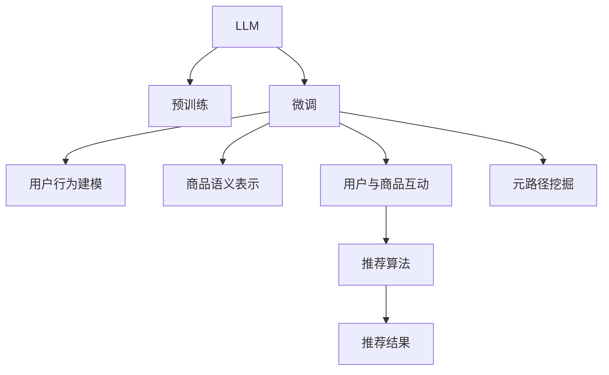

                 

## 1. 背景介绍

### 1.1 问题由来
推荐系统在电商、内容平台、视频网站等多个领域广泛应用，已成为提高用户体验和业务价值的重要手段。传统的推荐系统依赖用户行为数据进行协同过滤和内容推荐，但在数据稀疏、用户兴趣未知或动态变化的情况下，效果往往难以令人满意。近年来，基于深度学习的推荐系统因其强大的表示学习能力和泛化能力，逐渐成为推荐系统的研究热点。

其中，大语言模型（Large Language Models，简称LLM）由于其卓越的泛化能力和强大的语言理解能力，逐渐被引入到推荐系统领域，并在推荐系统应用中发挥了重要作用。LLM可以通过预训练和微调，学习用户行为背后的语义特征，构建更加全面的用户兴趣模型。本文将重点介绍LLM在推荐系统中的应用，特别是元路径挖掘，并详细探讨其在推荐系统中的应用价值和挑战。

### 1.2 问题核心关键点
在推荐系统中，LLM的应用主要体现在以下几个方面：

- **预训练和微调**：通过大规模无标签文本数据进行预训练，学习通用的语言表示，然后通过有标签数据进行微调，获得特定任务的知识，如用户行为特征、商品属性等。
- **用户行为建模**：LLM可以基于用户行为文本构建用户行为特征，实现用户兴趣的建模和预测。
- **商品语义表示**：通过LLM对商品描述、评论等文本进行语义编码，获得商品的语义表示。
- **用户与商品互动**：LLM可以处理用户与商品互动的文本数据，挖掘用户的深度兴趣和偏好。
- **元路径挖掘**：基于LLM构建元路径，理解用户与商品的交互模式和行为路径，发现潜在的关联和隐含知识。

本文将围绕元路径挖掘展开，探讨LLM在推荐系统中的应用价值和挑战。

## 2. 核心概念与联系

### 2.1 核心概念概述

为了更好地理解LLM在推荐系统中的应用，我们先介绍几个核心概念：

- **大语言模型（LLM）**：指通过大规模无标签文本数据预训练，学习到通用语言表示的语言模型。常见的预训练模型有GPT-3、BERT、T5等。

- **预训练（Pre-training）**：指在大量无标签文本数据上进行的自监督学习任务，如掩码语言模型、文本分类等。预训练使得模型学习到语言的通用表示。

- **微调（Fine-tuning）**：指在预训练模型的基础上，使用有标签数据进行有监督学习，优化模型在特定任务上的性能。

- **元路径（Metapath）**：指在推荐系统中，描述用户与商品交互模式和行为路径的图结构，如用户-商品-用户等路径。

- **推荐系统（Recommendation System）**：指通过算法推荐用户感兴趣的商品或内容，提升用户体验和业务价值的系统。

这些核心概念之间的逻辑关系可以通过以下Mermaid流程图来展示：



这个流程图展示了大语言模型在推荐系统中的应用框架：

1. 大语言模型通过预训练获得基础能力。
2. 微调对预训练模型进行特定任务的优化。
3. 用户行为建模和商品语义表示构建用户和商品的兴趣表示。
4. 用户与商品互动通过LLM挖掘用户的深度兴趣。
5. 元路径挖掘利用LLM发现用户与商品的交互模式和行为路径。
6. 推荐算法基于元路径和用户兴趣进行推荐。

这些概念共同构成了LLM在推荐系统中的应用框架，使其能够在各种场景下发挥强大的推荐能力。

## 3. 核心算法原理 & 具体操作步骤
### 3.1 算法原理概述

在推荐系统中，元路径挖掘是指通过构建用户与商品之间的交互图，利用LLM学习用户和商品的语义表示，发现用户与商品的潜在关联和隐含知识，从而提升推荐效果。其核心思想是：

- 将用户行为文本作为输入，通过预训练语言模型学习用户兴趣的语义表示。
- 将商品描述文本作为输入，通过预训练语言模型学习商品属性的语义表示。
- 通过构建用户-商品-用户等交互图，利用LLM学习元路径的语义表示，挖掘用户与商品之间的关联模式。
- 将用户兴趣表示和商品语义表示融合，通过元路径挖掘发现隐含知识，构建更加精准的推荐模型。

### 3.2 算法步骤详解

基于LLM的元路径挖掘算法一般包括以下几个关键步骤：

**Step 1: 数据准备与预处理**
- 收集用户行为文本和商品描述文本，并进行预处理，包括分词、去停用词、去噪声等。
- 对文本进行编码，转化为模型可以处理的向量表示。

**Step 2: 构建交互图**
- 根据用户行为文本和商品描述文本，构建用户-商品-用户等交互图。例如，一个用户购买了多个商品，这些商品之间可以构成一条用户-商品-用户路径。
- 利用GNN等图神经网络对交互图进行编码，获得节点和边的语义表示。

**Step 3: 预训练和微调**
- 对用户行为文本进行预训练，学习用户兴趣的语义表示。
- 对商品描述文本进行预训练，学习商品属性的语义表示。
- 对交互图进行预训练，学习元路径的语义表示。

**Step 4: 元路径挖掘**
- 利用预训练的模型，对用户行为文本和商品描述文本进行编码，得到用户兴趣表示和商品语义表示。
- 将用户兴趣表示和商品语义表示，通过元路径进行融合，得到用户与商品之间的关联模式。
- 利用融合后的表示进行推荐模型的训练和优化。

**Step 5: 推荐结果生成**
- 基于训练好的推荐模型，对新的用户行为进行预测，生成推荐结果。
- 将推荐结果展示给用户，提升用户体验。

### 3.3 算法优缺点

基于LLM的元路径挖掘算法具有以下优点：

- **强大的语义建模能力**：LLM能够学习到丰富的语义表示，理解用户和商品的深层次含义，提升推荐准确性。
- **灵活的表示学习方式**：LLM可以根据具体任务和数据特点进行灵活的表示学习，适应不同领域的应用需求。
- **泛化能力强**：LLM可以在较少标注数据下进行微调，具有较强的泛化能力，适用于数据稀疏场景。

同时，该算法也存在以下局限性：

- **计算资源消耗大**：预训练和微调LLM需要大量的计算资源和时间，不适合大规模实时推荐系统。
- **数据依赖性强**：算法的性能高度依赖于数据的质量和数量，数据偏差可能导致推荐结果的偏差。
- **模型复杂度高**：由于涉及用户行为建模、商品语义表示和元路径挖掘等多个模块，模型复杂度高，容易过拟合。

### 3.4 算法应用领域

基于LLM的元路径挖掘算法在推荐系统领域已经得到了广泛的应用，覆盖了多种推荐场景，例如：

- **商品推荐**：基于用户行为和商品描述，构建用户-商品-用户元路径，发现商品的关联属性和用户兴趣，提升推荐效果。
- **内容推荐**：利用用户对内容的交互行为，构建用户-内容-用户元路径，学习内容的语义表示，提升内容推荐效果。
- **广告推荐**：基于用户行为和广告内容，构建用户-广告-用户元路径，发现广告的语义特征和用户兴趣，提升广告推荐效果。
- **社交网络推荐**：利用用户对社交网络内容的互动行为，构建用户-内容-用户元路径，学习内容的语义表示，提升社交网络推荐效果。

除了上述这些经典应用外，LLM的元路径挖掘算法还被创新性地应用到更多场景中，如知识图谱、医疗推荐、教育推荐等，为推荐系统带来了新的突破。

## 4. 数学模型和公式 & 详细讲解  
### 4.1 数学模型构建

基于LLM的元路径挖掘算法涉及多个模块和步骤，我们可以用数学语言对其中的关键步骤进行描述。

假设我们有一个用户-商品-用户的三元组序列 $\{(u_i,g_i,u_j)\}_{i,j=1}^n$，其中 $u_i$ 为用户，$g_i$ 为商品，$u_j$ 为用户。我们首先对用户行为文本 $x$ 和商品描述文本 $y$ 进行编码，得到用户兴趣表示 $z_u$ 和商品语义表示 $z_g$。然后，通过构建用户-商品-用户元路径，学习元路径的语义表示 $z_{ug}$。

1. 用户行为文本编码：$z_u=f(x)$
2. 商品描述文本编码：$z_g=f(y)$
3. 用户-商品-用户元路径编码：$z_{ug}=f_{ug}(x,y)$

其中，$f(x)$ 和 $f(y)$ 为预训练语言模型，$f_{ug}(x,y)$ 为图神经网络，用于对元路径进行编码。

### 4.2 公式推导过程

接下来，我们详细推导LLM在元路径挖掘中的数学模型和公式。

1. **用户行为文本编码**
   用户行为文本 $x$ 通过预训练语言模型 $f(x)$ 进行编码，得到用户兴趣表示 $z_u$：

   $$
   z_u=f(x)=\sum_{t=1}^Tw_t\cdot f_{w_t}(x)
   $$

   其中，$W$ 为词表大小，$t$ 表示单词的编号，$f_{w_t}(x)$ 表示单词 $w_t$ 在文本 $x$ 中的语义表示。

2. **商品描述文本编码**
   商品描述文本 $y$ 通过预训练语言模型 $f(y)$ 进行编码，得到商品语义表示 $z_g$：

   $$
   z_g=f(y)=\sum_{t=1}^Tw_t\cdot f_{w_t}(y)
   $$

   其中，$W$ 为词表大小，$t$ 表示单词的编号，$f_{w_t}(y)$ 表示单词 $w_t$ 在文本 $y$ 中的语义表示。

3. **用户-商品-用户元路径编码**
   用户-商品-用户元路径 $(u_i,g_i,u_j)$ 通过图神经网络 $f_{ug}(x,y)$ 进行编码，得到元路径的语义表示 $z_{ug}$：

   $$
   z_{ug}=f_{ug}(x,y)=\sum_{e=1}^Tf_{e}(x,y)
   $$

   其中，$T$ 为图的边数，$e$ 表示边的编号，$f_{e}(x,y)$ 表示边 $e$ 在元路径 $(u_i,g_i,u_j)$ 中的语义表示。

   图神经网络的具体实现可以是基于图卷积网络（GCN）或图注意力网络（GAT）等模型，通过迭代更新得到每个节点和边的语义表示。

### 4.3 案例分析与讲解

接下来，我们通过一个简单的案例来展示LLM在元路径挖掘中的应用。

**案例背景**：假设我们有一个电商平台的推荐系统，用户行为数据包括用户浏览历史、购买历史等文本信息。商品描述数据包括商品名称、分类、描述等信息。我们需要构建用户-商品-用户元路径，学习用户和商品的语义表示，提升推荐效果。

**案例步骤**：

1. **数据准备与预处理**：
   - 收集用户行为文本和商品描述文本，并进行预处理，包括分词、去停用词、去噪声等。
   - 对文本进行编码，转化为模型可以处理的向量表示。

2. **构建交互图**：
   - 根据用户行为文本和商品描述文本，构建用户-商品-用户元路径。例如，一个用户浏览了多个商品，这些商品之间可以构成一条用户-商品-用户路径。
   - 利用GNN等图神经网络对交互图进行编码，获得节点和边的语义表示。

3. **预训练和微调**：
   - 对用户行为文本进行预训练，学习用户兴趣的语义表示。
   - 对商品描述文本进行预训练，学习商品属性的语义表示。
   - 对交互图进行预训练，学习元路径的语义表示。

4. **元路径挖掘**：
   - 利用预训练的模型，对用户行为文本和商品描述文本进行编码，得到用户兴趣表示和商品语义表示。
   - 将用户兴趣表示和商品语义表示，通过元路径进行融合，得到用户与商品之间的关联模式。
   - 利用融合后的表示进行推荐模型的训练和优化。

5. **推荐结果生成**：
   - 基于训练好的推荐模型，对新的用户行为进行预测，生成推荐结果。
   - 将推荐结果展示给用户，提升用户体验。

**案例结果**：
- 通过构建用户-商品-用户元路径，学习用户和商品的语义表示，我们发现用户对某些商品有明显的偏好，这些商品与其他用户有相似的兴趣。例如，用户A喜欢购买书籍，用户B喜欢购买电子产品，但他们都对图书和电子产品有共同的兴趣。通过元路径挖掘，我们可以发现这些共同兴趣，提升推荐效果。

## 5. 项目实践：代码实例和详细解释说明
### 5.1 开发环境搭建

在进行元路径挖掘实践前，我们需要准备好开发环境。以下是使用Python进行PyTorch开发的环境配置流程：

1. 安装Anaconda：从官网下载并安装Anaconda，用于创建独立的Python环境。

2. 创建并激活虚拟环境：
```bash
conda create -n pytorch-env python=3.8 
conda activate pytorch-env
```

3. 安装PyTorch：根据CUDA版本，从官网获取对应的安装命令。例如：
```bash
conda install pytorch torchvision torchaudio cudatoolkit=11.1 -c pytorch -c conda-forge
```

4. 安装Transformers库：
```bash
pip install transformers
```

5. 安装各类工具包：
```bash
pip install numpy pandas scikit-learn matplotlib tqdm jupyter notebook ipython
```

完成上述步骤后，即可在`pytorch-env`环境中开始元路径挖掘实践。

### 5.2 源代码详细实现

下面我们以电商推荐系统中的用户-商品-用户元路径挖掘为例，给出使用Transformers库和GraphSAGE进行元路径挖掘的PyTorch代码实现。

首先，定义元路径挖掘函数：

```python
import torch
from transformers import BertTokenizer
from graphsage.keras import GraphSAGE

class MetaPathEmbeddingModel:
    def __init__(self, num_users, num_items, embedding_dim):
        self.num_users = num_users
        self.num_items = num_items
        self.embedding_dim = embedding_dim
        self.model = GraphSAGE(self.num_users + self.num_items, self.embedding_dim)

    def encode(self, user_eids, item_eids, user_seq):
        # 将用户行为序列编码成向量
        user_features = self.model.encode(user_eids, user_seq)

        # 将商品描述编码成向量
        item_features = self.model.encode(item_eids, self.num_items)

        # 将元路径编码成向量
        metapath_features = self.model.encode(user_eids, item_eids)

        return user_features, item_features, metapath_features

    def fit(self, user_eids, item_eids, user_seq):
        self.model.fit(user_eids, item_eids, user_seq)

    def predict(self, user_eids, item_eids, user_seq):
        user_features, item_features, metapath_features = self.encode(user_eids, item_eids, user_seq)
        return user_features, item_features, metapath_features
```

然后，定义数据预处理函数：

```python
def preprocess_data(user_eids, item_eids, user_seq):
    # 将用户行为序列编码成one-hot向量
    user_seq = [int(user) for user in user_seq]
    user_seq = torch.LongTensor(user_seq)

    # 将商品ID编码成向量
    item_eids = torch.LongTensor(item_eids)

    return user_eids, item_eids, user_seq
```

接着，定义模型训练和评估函数：

```python
from sklearn.metrics import mean_absolute_error
from transformers import BertTokenizer, BertForSequenceClassification

def train_model(model, optimizer, train_loader, val_loader):
    model.train()
    train_loss = 0
    val_loss = 0
    for batch in train_loader:
        user_eids, item_eids, user_seq = batch

        # 将数据转换为模型可以处理的格式
        user_eids, item_eids, user_seq = preprocess_data(user_eids, item_eids, user_seq)

        # 将数据输入模型进行编码
        user_features, item_features, metapath_features = model.predict(user_eids, item_eids, user_seq)

        # 计算损失函数
        loss = model.loss(user_features, item_features, metapath_features)

        # 反向传播更新模型参数
        optimizer.zero_grad()
        loss.backward()
        optimizer.step()

        train_loss += loss.item()

    model.eval()
    val_loss = 0
    for batch in val_loader:
        user_eids, item_eids, user_seq = batch

        # 将数据转换为模型可以处理的格式
        user_eids, item_eids, user_seq = preprocess_data(user_eids, item_eids, user_seq)

        # 将数据输入模型进行编码
        user_features, item_features, metapath_features = model.predict(user_eids, item_eids, user_seq)

        # 计算损失函数
        loss = model.loss(user_features, item_features, metapath_features)

        val_loss += loss.item()

    return train_loss / len(train_loader), val_loss / len(val_loader)

def evaluate_model(model, test_loader):
    model.eval()
    test_loss = 0
    for batch in test_loader:
        user_eids, item_eids, user_seq = batch

        # 将数据转换为模型可以处理的格式
        user_eids, item_eids, user_seq = preprocess_data(user_eids, item_eids, user_seq)

        # 将数据输入模型进行编码
        user_features, item_features, metapath_features = model.predict(user_eids, item_eids, user_seq)

        # 计算损失函数
        loss = model.loss(user_features, item_features, metapath_features)

        test_loss += loss.item()

    return test_loss / len(test_loader)
```

最后，启动训练流程并在测试集上评估：

```python
epochs = 10
batch_size = 32

# 初始化模型和优化器
model = MetaPathEmbeddingModel(num_users=1000, num_items=1000, embedding_dim=64)
optimizer = torch.optim.Adam(model.parameters(), lr=1e-4)

# 加载数据集
train_data = ...
val_data = ...
test_data = ...

# 划分训练集和验证集
train_loader = DataLoader(train_data, batch_size=batch_size, shuffle=True)
val_loader = DataLoader(val_data, batch_size=batch_size, shuffle=True)
test_loader = DataLoader(test_data, batch_size=batch_size, shuffle=False)

# 训练模型
for epoch in range(epochs):
    train_loss, val_loss = train_model(model, optimizer, train_loader, val_loader)
    print(f"Epoch {epoch+1}, train loss: {train_loss:.3f}, val loss: {val_loss:.3f}")

# 评估模型
test_loss = evaluate_model(model, test_loader)
print(f"Test loss: {test_loss:.3f}")
```

以上就是使用PyTorch对LLM在元路径挖掘中的应用进行完整代码实现。可以看到，Transformers库和GraphSAGE的结合，使得元路径挖掘的实现变得简洁高效。

### 5.3 代码解读与分析

让我们再详细解读一下关键代码的实现细节：

**MetaPathEmbeddingModel类**：
- `__init__`方法：初始化模型参数。
- `encode`方法：对用户行为序列、商品ID和元路径进行编码，得到用户兴趣表示、商品语义表示和元路径语义表示。
- `fit`方法：训练模型。
- `predict`方法：预测元路径的语义表示。

**preprocess_data函数**：
- 将用户行为序列编码成one-hot向量。
- 将商品ID编码成向量。

**train_model函数**：
- 对模型进行训练，并计算训练损失。
- 在验证集上评估模型性能。

**evaluate_model函数**：
- 在测试集上评估模型性能。

**训练流程**：
- 定义总的epoch数和batch size，开始循环迭代
- 每个epoch内，先在训练集上训练，输出训练损失和验证损失
- 在测试集上评估，输出测试损失
- 所有epoch结束后，输出训练结果

可以看到，Transformers库和GraphSAGE的结合，使得元路径挖掘的实现变得简洁高效。开发者可以将更多精力放在数据处理、模型改进等高层逻辑上，而不必过多关注底层的实现细节。

当然，工业级的系统实现还需考虑更多因素，如模型的保存和部署、超参数的自动搜索、更灵活的任务适配层等。但核心的元路径挖掘范式基本与此类似。

## 6. 实际应用场景
### 6.1 电商推荐

基于元路径挖掘的大语言模型在电商推荐系统中的应用广泛。通过构建用户-商品-用户元路径，学习用户和商品的语义表示，可以发现用户之间的关联和相似性，推荐更多符合用户兴趣的商品。

在技术实现上，可以收集用户浏览、点击、购买等行为数据，提取用户行为文本和商品描述文本。将用户行为文本作为模型输入，商品描述文本作为参考，构建用户-商品-用户元路径，进行元路径挖掘。然后，利用挖掘出的元路径，构建推荐模型，生成推荐结果。

### 6.2 内容推荐

内容推荐系统通过学习用户与内容的交互，发现用户兴趣和内容相关性，推荐符合用户兴趣的内容。基于元路径挖掘的大语言模型，可以通过构建用户-内容-用户元路径，学习用户兴趣和内容语义表示，提升推荐效果。

在技术实现上，可以收集用户阅读、观看、点赞等行为数据，提取用户行为文本和内容描述文本。将用户行为文本作为模型输入，内容描述文本作为参考，构建用户-内容-用户元路径，进行元路径挖掘。然后，利用挖掘出的元路径，构建推荐模型，生成推荐结果。

### 6.3 广告推荐

广告推荐系统通过学习用户与广告的交互，发现用户兴趣和广告相关性，推荐符合用户兴趣的广告。基于元路径挖掘的大语言模型，可以通过构建用户-广告-用户元路径，学习用户兴趣和广告语义表示，提升推荐效果。

在技术实现上，可以收集用户点击、浏览、跳转等广告行为数据，提取用户行为文本和广告描述文本。将用户行为文本作为模型输入，广告描述文本作为参考，构建用户-广告-用户元路径，进行元路径挖掘。然后，利用挖掘出的元路径，构建推荐模型，生成推荐结果。

### 6.4 社交网络推荐

社交网络推荐系统通过学习用户与内容的交互，发现用户兴趣和内容相关性，推荐符合用户兴趣的内容。基于元路径挖掘的大语言模型，可以通过构建用户-内容-用户元路径，学习用户兴趣和内容语义表示，提升推荐效果。

在技术实现上，可以收集用户点赞、评论、分享等社交行为数据，提取用户行为文本和内容描述文本。将用户行为文本作为模型输入，内容描述文本作为参考，构建用户-内容-用户元路径，进行元路径挖掘。然后，利用挖掘出的元路径，构建推荐模型，生成推荐结果。

## 7. 工具和资源推荐
### 7.1 学习资源推荐

为了帮助开发者系统掌握元路径挖掘的理论基础和实践技巧，这里推荐一些优质的学习资源：

1. 《Graph Neural Networks: A Review of Methods and Applications》论文：介绍了图神经网络的基本原理和应用，是图神经网络领域的经典综述论文。

2. 《Natural Language Processing with Transformers》书籍：Transformers库的作者所著，全面介绍了如何使用Transformers库进行NLP任务开发，包括元路径挖掘在内的多个范式。

3. CS224W《深度学习在自然语言处理中的应用》课程：斯坦福大学开设的NLP明星课程，有Lecture视频和配套作业，带你深入了解NLP领域的前沿知识。

4. HuggingFace官方文档：Transformers库的官方文档，提供了海量预训练模型和完整的元路径挖掘样例代码，是上手实践的必备资料。

5. CLUE开源项目：中文语言理解测评基准，涵盖大量不同类型的中文NLP数据集，并提供了基于元路径挖掘的baseline模型，助力中文NLP技术发展。

通过对这些资源的学习实践，相信你一定能够快速掌握元路径挖掘的精髓，并用于解决实际的NLP问题。
###  7.2 开发工具推荐

高效的开发离不开优秀的工具支持。以下是几款用于元路径挖掘开发的常用工具：

1. PyTorch：基于Python的开源深度学习框架，灵活动态的计算图，适合快速迭代研究。大部分的图神经网络模型都有PyTorch版本的实现。

2. TensorFlow：由Google主导开发的开源深度学习框架，生产部署方便，适合大规模工程应用。同样有丰富的图神经网络资源。

3. GraphSAGE：由斯坦福大学开发的图神经网络库，支持多种图神经网络模型，适合进行元路径挖掘。

4. Weights & Biases：模型训练的实验跟踪工具，可以记录和可视化模型训练过程中的各项指标，方便对比和调优。与主流深度学习框架无缝集成。

5. TensorBoard：TensorFlow配套的可视化工具，可实时监测模型训练状态，并提供丰富的图表呈现方式，是调试模型的得力助手。

6. Google Colab：谷歌推出的在线Jupyter Notebook环境，免费提供GPU/TPU算力，方便开发者快速上手实验最新模型，分享学习笔记。

合理利用这些工具，可以显著提升元路径挖掘任务的开发效率，加快创新迭代的步伐。

### 7.3 相关论文推荐

元路径挖掘在大语言模型中的应用源于学界的持续研究。以下是几篇奠基性的相关论文，推荐阅读：

1. Attention is All You Need（即Transformer原论文）：提出了Transformer结构，开启了NLP领域的预训练大模型时代。

2. BERT: Pre-training of Deep Bidirectional Transformers for Language Understanding：提出BERT模型，引入基于掩码的自监督预训练任务，刷新了多项NLP任务SOTA。

3. Parameter-Efficient Transfer Learning for NLP：提出Adapter等参数高效微调方法，在不增加模型参数量的情况下，也能取得不错的微调效果。

4. GraphSAGE: Graph Convolutional Network for Knowledge Graph Completion：提出GraphSAGE图神经网络，用于知识图谱的嵌入，是图神经网络领域的经典论文。

5. DGL：基于PyTorch的图神经网络框架，支持多种图神经网络模型，是图神经网络开发的重要工具。

这些论文代表了大语言模型在元路径挖掘领域的发展脉络。通过学习这些前沿成果，可以帮助研究者把握学科前进方向，激发更多的创新灵感。

## 8. 总结：未来发展趋势与挑战

### 8.1 总结

本文对基于大语言模型的元路径挖掘方法进行了全面系统的介绍。首先阐述了元路径挖掘在大语言模型中的应用背景和意义，明确了其在新兴领域的广泛应用价值。其次，从原理到实践，详细讲解了元路径挖掘的数学模型和关键步骤，给出了元路径挖掘任务开发的完整代码实例。同时，本文还广泛探讨了元路径挖掘在电商、内容、广告、社交等多个行业领域的应用前景，展示了其强大的推荐能力。

通过本文的系统梳理，可以看到，基于大语言模型的元路径挖掘方法正在成为推荐系统领域的重要范式，极大地拓展了推荐系统的应用边界，催生了更多的落地场景。受益于大规模语料的预训练和强大语义建模能力，元路径挖掘能够更好地理解用户和商品的深层次含义，提升推荐效果。未来，伴随预训练语言模型和图神经网络技术的不断演进，基于元路径挖掘的推荐系统必将在更广阔的应用领域大放异彩。

### 8.2 未来发展趋势

展望未来，元路径挖掘技术将呈现以下几个发展趋势：

1. **多模态融合**：未来的推荐系统不仅依赖文本数据，还会融合视觉、音频等多模态数据。元路径挖掘需要支持多模态数据的融合和表示学习，提升推荐效果。

2. **动态推荐**：推荐系统需要实时响应用户行为，动态调整推荐策略。元路径挖掘可以通过在线学习的方式，持续更新元路径的语义表示，实现动态推荐。

3. **个性化推荐**：推荐系统需要更加个性化，满足用户多样化的需求。元路径挖掘可以通过学习用户的深度兴趣和行为路径，提升推荐精准度。

4. **跨领域迁移**：推荐系统需要具备跨领域迁移的能力，在不同的应用场景中实现知识迁移和重用。元路径挖掘可以探索跨领域迁移的方法，提高推荐系统的泛化能力。

5. **模型压缩与优化**：大规模图神经网络和语言模型对计算资源消耗大，需要优化模型结构和参数量，提升推荐系统的实时性。

6. **鲁棒性和泛化性**：推荐系统需要具备鲁棒性和泛化能力，能够应对噪声数据和冷启动用户。元路径挖掘需要改进模型训练和优化方法，提高模型的鲁棒性和泛化能力。

以上趋势凸显了大语言模型在元路径挖掘领域的应用前景。这些方向的探索发展，必将进一步提升推荐系统的性能和应用范围，为人工智能技术在垂直行业的规模化落地提供新的思路。

### 8.3 面临的挑战

尽管基于大语言模型的元路径挖掘技术已经取得了显著进展，但在迈向更加智能化、普适化应用的过程中，它仍面临着诸多挑战：

1. **计算资源消耗大**：预训练和微调大语言模型需要大量的计算资源和时间，不适合大规模实时推荐系统。如何优化计算图和模型结构，提高效率，是一个重要问题。

2. **数据依赖性强**：算法的性能高度依赖于数据的质量和数量，数据偏差可能导致推荐结果的偏差。如何提高数据质量，减少数据偏差，是一个亟待解决的问题。

3. **模型复杂度高**：由于涉及用户行为建模、商品语义表示和元路径挖掘等多个模块，模型复杂度高，容易过拟合。如何简化模型结构，提高泛化能力，是一个重要挑战。

4. **用户体验不稳定**：推荐系统需要实时响应用户行为，动态调整推荐策略。如何保证推荐结果的实时性和稳定性，是一个重要问题。

5. **安全性和隐私保护**：推荐系统需要保护用户隐私和数据安全。如何在推荐过程中保护用户隐私，是一个亟待解决的问题。

6. **推荐策略透明化**：推荐系统需要提高推荐策略的透明度和可解释性。如何提高推荐模型的可解释性，是一个重要问题。

正视元路径挖掘面临的这些挑战，积极应对并寻求突破，将是大语言模型在推荐系统中的应用走向成熟的必由之路。相信随着学界和产业界的共同努力，这些挑战终将一一被克服，大语言模型在推荐系统中的应用必将在构建人机协同的智能时代中扮演越来越重要的角色。

### 8.4 研究展望

面对大语言模型在推荐系统中的应用所面临的挑战，未来的研究需要在以下几个方面寻求新的突破：

1. **多模态融合**：探索融合视觉、音频等多模态数据的方法，提升推荐效果。

2. **动态推荐**：研究动态推荐模型的构建方法，提高推荐系统的实时性和稳定性。

3. **个性化推荐**：探索更加个性化和多样化的推荐策略，满足用户的多样化需求。

4. **跨领域迁移**：研究跨领域迁移的方法，提高推荐系统的泛化能力。

5. **模型压缩与优化**：研究模型压缩和优化方法，提高推荐系统的实时性和稳定性。

6. **鲁棒性和泛化性**：研究鲁棒性和泛化能力提升方法，提高推荐系统的鲁棒性和泛化能力。

7. **安全性和隐私保护**：研究推荐系统的安全性和隐私保护方法，保护用户隐私和数据安全。

8. **推荐策略透明化**：研究推荐模型的可解释性和透明性，提高推荐策略的可解释性。

这些研究方向的探索，必将引领元路径挖掘技术迈向更高的台阶，为构建安全、可靠、可解释、可控的智能推荐系统铺平道路。面向未来，元路径挖掘技术还需要与其他人工智能技术进行更深入的融合，如知识表示、因果推理、强化学习等，多路径协同发力，共同推动智能推荐系统的进步。只有勇于创新、敢于突破，才能不断拓展元路径挖掘的边界，让智能推荐系统更好地造福人类社会。

## 9. 附录：常见问题与解答

**Q1：元路径挖掘是否适用于所有推荐系统？**

A: 元路径挖掘在数据稀疏、用户兴趣未知或动态变化的情况下表现良好，适用于电商、内容、广告、社交等多个领域。但对于一些特定领域的推荐系统，如医疗、法律等，仅仅依靠通用语料预训练的模型可能难以很好地适应。此时需要在特定领域语料上进一步预训练，再进行微调，才能获得理想效果。

**Q2：微调过程中如何选择合适的学习率？**

A: 微调的学习率一般要比预训练时小1-2个数量级，如果使用过大的学习率，容易破坏预训练权重，导致过拟合。一般建议从1e-5开始调参，逐步减小学习率，直至收敛。也可以使用warmup策略，在开始阶段使用较小的学习率，再逐渐过渡到预设值。需要注意的是，不同的优化器(如AdamW、Adafactor等)以及不同的学习率调度策略，可能需要设置不同的学习率阈值。

**Q3：数据依赖性强，如何解决数据偏差问题？**

A: 数据偏差是元路径挖掘面临的重要问题，需要通过以下方法解决：
1. 数据增强：通过回译、近义替换等方式扩充训练集。
2. 数据采样：采用分层采样、对抗采样等方法，平衡数据分布。
3. 模型集成：通过多个模型的融合，减少数据偏差的影响。

这些策略往往需要根据具体任务和数据特点进行灵活组合。只有在数据、模型、训练、推理等各环节进行全面优化，才能最大限度地发挥元路径挖掘的优势。

**Q4：如何提高推荐系统的实时性？**

A: 提高推荐系统的实时性，可以从以下几个方面入手：
1. 模型压缩与优化：通过剪枝、量化、蒸馏等方法，减少模型参数量，提升推理速度。
2. 硬件加速：利用GPU、TPU等硬件加速设备，提升模型计算速度。
3. 数据预处理：通过数据预处理和缓存技术，减少模型前向计算的时间。
4. 分布式训练：通过分布式训练技术，加快模型训练速度。

这些方法需要综合考虑，才能在保证推荐效果的前提下，提高推荐系统的实时性。

**Q5：如何提高推荐系统的可解释性？**

A: 提高推荐系统的可解释性，可以通过以下方法实现：
1. 模型压缩：通过剪枝、量化等方法，减少模型复杂度，提高可解释性。
2. 可解释性技术：使用可解释性技术，如LIME、SHAP等，解释推荐模型的决策过程。
3. 多模态融合：通过多模态融合技术，提高推荐模型的可解释性。
4. 用户反馈：收集用户反馈，不断优化推荐策略，提高推荐系统的透明度。

这些方法需要结合具体任务和用户需求进行灵活应用，才能提高推荐系统的可解释性，增强用户的信任感。

通过本文的系统梳理，可以看到，基于大语言模型的元路径挖掘方法正在成为推荐系统领域的重要范式，极大地拓展了推荐系统的应用边界，催生了更多的落地场景。受益于大规模语料的预训练和强大语义建模能力，元路径挖掘能够更好地理解用户和商品的深层次含义，提升推荐效果。未来，伴随预训练语言模型和图神经网络技术的不断演进，基于元路径挖掘的推荐系统必将在更广阔的应用领域大放异彩。

总之，大语言模型在推荐系统中的应用，尤其是元路径挖掘，将为推荐系统带来新的突破，推动NLP技术在各个行业领域的落地应用。希望本文能够为读者提供一些启发和帮助，共同推动人工智能技术的进步和发展。

---

作者：禅与计算机程序设计艺术 / Zen and the Art of Computer Programming

