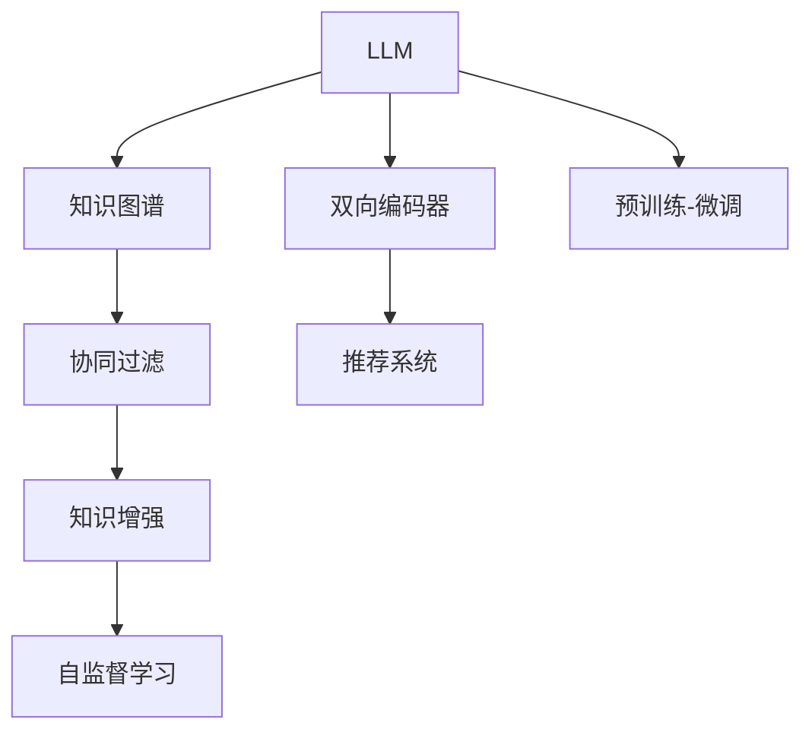

                 

# LLM在推荐系统中的知识图谱应用

> 关键词：知识图谱,推荐系统,大语言模型(LLM),协同过滤,知识增强

## 1. 背景介绍

在推荐系统的广泛应用中，如何更好地理解用户兴趣，提升推荐结果的相关性和多样性，一直是核心挑战。传统协同过滤方法基于用户行为数据的隐式关联，往往难以有效刻画用户的多维度兴趣和长尾偏好。为了解决这一问题，越来越多的研究者将目光投向了外部知识源的融合利用。

大语言模型(LLM)以其强大的语言理解和生成能力，成为当前知识增强推荐系统的重要手段。LLM可以通过大规模语料预训练，学习到丰富的语言知识和常识。将知识图谱作为语言模型的外设知识源，将知识图谱中的实体和关系映射到语言模型中，借助语言模型强大的表征能力，可以有效提升推荐系统的性能和鲁棒性。

本文聚焦于LLM在推荐系统中的应用，特别是通过知识图谱增强推荐效果的研究。文章首先介绍知识图谱和LLM的基本概念，然后详细讲解LLM在推荐系统中的工作原理和应用场景。接着，从算法角度探讨LLM在推荐系统中的具体实现方法，包括如何将知识图谱与LLM进行有效融合。最后，总结知识图谱在推荐系统中的应用前景和面临的挑战，提出未来的研究方向。

## 2. 核心概念与联系

### 2.1 核心概念概述

为更好地理解LLM在推荐系统中的应用，本节将介绍几个密切相关的核心概念：

- 大语言模型(LLM)：指以自回归或自编码模型为代表的大规模预训练语言模型。通过在大规模无标签文本语料上进行预训练，学习到丰富的语言知识和常识。

- 知识图谱(Knowledge Graph)：指由实体、关系和属性组成的有向图结构，用于描述实体之间的语义关系，通常用于机器学习模型的知识增强。

- 协同过滤(Collaborative Filtering)：指基于用户-物品关联矩阵，通过相似度计算推荐新物品的推荐算法，是推荐系统的主流技术。

- 知识增强推荐系统(Knowledge-enhanced Recommendation System)：指将外部知识源，如知识图谱，与推荐算法进行融合，以提升推荐系统的效果和鲁棒性。

- 自监督学习(Self-supervised Learning)：指在无标签数据上进行模型预训练，利用数据自身结构特点学习知识的方法。

- 双向编码器(Bidirectional Encoder)：指在序列模型中使用双向循环神经网络，同时考虑上下文信息的编码器。

- 预训练-微调(Fine-tuning)：指在预训练模型基础上，利用下游任务数据微调模型，使其更适合特定任务的方法。

- 推荐系统(Recommendation System)：指根据用户的历史行为数据，推荐用户可能感兴趣的物品的智能系统。

这些核心概念之间的逻辑关系可以通过以下Mermaid流程图来展示：



这个流程图展示了大语言模型在推荐系统中的核心概念及其之间的关系：

1. LLM通过大规模预训练获得基础能力。
2. 知识图谱作为外部知识源，增强LLM的知识储备。
3. 协同过滤算法是推荐系统的主流方法，可以与知识增强技术相结合。
4. 自监督学习与双向编码器技术，辅助提升LLM的推荐能力。
5. 预训练-微调范式，使得LLM在推荐任务中更高效地利用知识图谱。
6. 推荐系统作为最终应用场景，依赖于预训练模型和知识增强技术。

这些概念共同构成了LLM在推荐系统中的学习和应用框架，使其能够在推荐任务中发挥强大的能力。通过理解这些核心概念，我们可以更好地把握LLM的工作原理和优化方向。

## 3. 核心算法原理 & 具体操作步骤
### 3.1 算法原理概述

基于LLM的知识增强推荐系统，通过将知识图谱与语言模型进行融合，利用语言模型的强大表征能力，提升推荐系统的性能。其核心思想是：将知识图谱中的实体和关系映射到语言模型中，作为模型训练的一部分，增强模型的上下文理解和推理能力，从而提高推荐结果的相关性和多样性。

形式化地，假设知识图谱中的实体集合为 $E$，关系集合为 $R$。将每个实体表示为一个向量 $e \in \mathbb{R}^d$，每个关系表示为一个矩阵 $r \in \mathbb{R}^{d \times d}$。设用户 $u$ 的兴趣向量为 $u \in \mathbb{R}^d$，物品 $i$ 的属性向量为 $i \in \mathbb{R}^d$。推荐系统的目标是通过语义推理，计算物品与用户兴趣的相关度，推荐最相关的物品。

具体地，设 $u$ 对物品 $i$ 的评分向量为 $v_i$，通过以下过程计算：

1. 将实体向量 $e$ 映射到语言模型中，得到 $u$ 和物品 $i$ 的语义表示 $e_u$ 和 $e_i$。
2. 将语义表示 $e_u$ 和 $e_i$ 拼接，通过双向编码器生成向量 $z$。
3. 将 $z$ 输入到LLM中，生成一个关于用户 $u$ 对物品 $i$ 的评分预测 $p(u, i)$。
4. 根据评分预测 $p(u, i)$，推荐物品 $i$。

通过上述过程，知识图谱中的语义信息被充分融入LLM的推理过程，提高了推荐的准确性和多样性。

### 3.2 算法步骤详解

基于LLM的知识增强推荐系统，通常包括以下关键步骤：

**Step 1: 构建知识图谱**
- 收集领域内的实体、关系和属性信息，构建知识图谱。可以使用已有的知识图谱，如DBpedia、Wikipedia等，也可以结合业务需求自建知识图谱。

**Step 2: 实体和关系嵌入**
- 将知识图谱中的实体和关系，通过向量表示嵌入到低维空间中。常用的方法包括TransE、DistMult、ComplEx等关系嵌入方法，以及Presto、LANE等实体嵌入方法。

**Step 3: 语义向量计算**
- 利用知识图谱中的实体和关系，计算用户兴趣向量 $u$ 和物品属性向量 $i$ 的语义表示。常用的方法包括TransE+MaxR、SANSO等。

**Step 4: 双向编码器处理**
- 将用户兴趣向量 $u$ 和物品属性向量 $i$ 拼接，通过双向编码器生成向量 $z$。常用的双向编码器包括GRU、LSTM、Transformer等。

**Step 5: LLM推理**
- 将向量 $z$ 输入到预训练的LLM模型中，通过自回归或自编码器生成评分预测 $p(u, i)$。常用的LLM包括BERT、GPT、T5等。

**Step 6: 推荐结果排序**
- 将评分预测 $p(u, i)$ 排序，推荐评分最高的物品。可以采用冷启动策略，如基于用户兴趣向量和物品语义向量的推荐方法。

**Step 7: 模型评估与迭代**
- 在测试集上评估推荐模型的性能，包括准确率、召回率、F1-score等指标。根据评估结果，迭代优化知识图谱、向量表示、双向编码器和LLM模型，进一步提升推荐效果。

以上是基于LLM的知识增强推荐系统的一般流程。在实际应用中，还需要针对具体任务的特点，对各环节进行优化设计，如改进知识图谱构建方法，引入更多的双向编码器，搜索最优的向量表示和LLM模型等，以进一步提升推荐系统的性能。

### 3.3 算法优缺点

基于LLM的知识增强推荐系统具有以下优点：

1. 可以充分利用知识图谱中的语义信息，提升推荐结果的相关性和多样性。
2. 利用LLM强大的语言理解和生成能力，可以应对复杂的多维度用户兴趣和长尾偏好。
3. 可以利用自监督学习和双向编码器技术，提升模型的上下文理解和推理能力。
4. 可以结合多种知识源，进行多角度融合，提高推荐的准确性。

同时，该方法也存在一定的局限性：

1. 知识图谱的构建和维护成本较高，尤其是对于小规模知识源，获取高质量的实体、关系和属性信息较为困难。
2. 知识图谱中的语义表示和学习方法多样，存在数据不一致和冗余的问题。
3. LLM的推理计算量较大，需要消耗大量算力资源。
4. 结合知识图谱的推荐方法较为复杂，对开发者要求较高。
5. 知识图谱和LLM之间的映射和融合方法尚未完全成熟，存在一定的不确定性。

尽管存在这些局限性，但就目前而言，基于LLM的知识增强推荐方法已经在大规模推荐系统中得到了广泛应用，并取得了显著的效果。未来相关研究的重点在于如何进一步降低知识图谱的构建和维护成本，提高知识表示的一致性，并简化融合方法，以更好地发挥LLM在推荐系统中的潜力。

### 3.4 算法应用领域

基于LLM的知识增强推荐系统，已经在多个推荐领域得到了应用，例如：

- 电商推荐：根据用户浏览、购买历史，推荐相关商品。结合知识图谱，可以推荐新品、关联商品等。
- 音乐推荐：根据用户听歌历史，推荐相似歌曲。利用知识图谱，可以推荐音乐人、专辑、流派等相关信息。
- 视频推荐：根据用户观看历史，推荐相关视频。结合知识图谱，可以推荐导演、演员、电影类型等。
- 新闻推荐：根据用户阅读历史，推荐相关新闻。利用知识图谱，可以推荐新闻来源、作者、话题等。
- 图书推荐：根据用户阅读历史，推荐相关书籍。结合知识图谱，可以推荐作者、出版社、主题等。

除了上述这些经典任务外，知识增强推荐方法也被创新性地应用到更多场景中，如社交网络推荐、广告推荐、旅游推荐等，为推荐系统带来了全新的突破。随着预训练模型和知识增强技术的不断进步，相信基于LLM的知识增强推荐系统必将在更多领域得到应用，为推荐技术带来新的机遇。

## 4. 数学模型和公式 & 详细讲解 & 举例说明
### 4.1 数学模型构建

本节将使用数学语言对基于LLM的知识增强推荐系统进行更加严格的刻画。

设知识图谱中的实体集合为 $E$，关系集合为 $R$。将每个实体 $e$ 表示为一个向量 $e \in \mathbb{R}^d$，每个关系 $r$ 表示为一个矩阵 $r \in \mathbb{R}^{d \times d}$。设用户 $u$ 的兴趣向量为 $u \in \mathbb{R}^d$，物品 $i$ 的属性向量为 $i \in \mathbb{R}^d$。推荐系统的目标是通过语义推理，计算物品与用户兴趣的相关度，推荐最相关的物品。

### 4.2 公式推导过程

以下我们以知识图谱增强的协同过滤方法为例，推导推荐系统的评分预测公式。

设用户 $u$ 对物品 $i$ 的评分向量为 $v_i$，知识图谱中 $u$ 和物品 $i$ 的语义表示分别为 $e_u$ 和 $e_i$。根据双向编码器得到向量 $z$，将 $z$ 输入到LLM中，得到评分预测 $p(u, i)$。推荐系统的评分预测公式为：

$$
p(u, i) = \text{Softmax}(W_L \cdot [e_u \cdot e_i]^T + b_L)
$$

其中 $W_L$ 和 $b_L$ 是LLM模型的参数，$\cdot$ 表示向量点乘，$\text{Softmax}$ 表示softmax函数。

根据评分预测 $p(u, i)$，推荐物品 $i$。

### 4.3 案例分析与讲解

为了更好地理解知识图谱在推荐系统中的应用，以下是几个典型案例的分析：

**案例1: 电商推荐**

假设一个电商网站需要为用户推荐相关商品。首先，将商品名称、类别等信息构建为知识图谱，使用TransE等方法进行实体和关系嵌入。然后，根据用户浏览、购买历史，计算用户兴趣向量 $u$ 和物品属性向量 $i$ 的语义表示。接着，将语义表示拼接，通过双向编码器生成向量 $z$，输入到BERT模型中，得到评分预测 $p(u, i)$。最后，根据评分预测 $p(u, i)$ 排序，推荐评分最高的物品。

**案例2: 音乐推荐**

假设一个音乐平台需要为用户推荐相似歌曲。首先，将歌曲名称、歌手、专辑等信息构建为知识图谱，使用Presto等方法进行实体和关系嵌入。然后，根据用户听歌历史，计算用户兴趣向量 $u$ 和歌曲属性向量 $i$ 的语义表示。接着，将语义表示拼接，通过双向编码器生成向量 $z$，输入到T5模型中，得到评分预测 $p(u, i)$。最后，根据评分预测 $p(u, i)$ 排序，推荐评分最高的歌曲。

**案例3: 视频推荐**

假设一个视频平台需要为用户推荐相关视频。首先，将视频名称、导演、演员等信息构建为知识图谱，使用LANE等方法进行实体和关系嵌入。然后，根据用户观看历史，计算用户兴趣向量 $u$ 和视频属性向量 $i$ 的语义表示。接着，将语义表示拼接，通过双向编码器生成向量 $z$，输入到GPT模型中，得到评分预测 $p(u, i)$。最后，根据评分预测 $p(u, i)$ 排序，推荐评分最高的视频。

## 5. 项目实践：代码实例和详细解释说明
### 5.1 开发环境搭建

在进行知识增强推荐系统实践前，我们需要准备好开发环境。以下是使用Python进行PyTorch开发的环境配置流程：

1. 安装Anaconda：从官网下载并安装Anaconda，用于创建独立的Python环境。

2. 创建并激活虚拟环境：
```bash
conda create -n pytorch-env python=3.8 
conda activate pytorch-env
```

3. 安装PyTorch：根据CUDA版本，从官网获取对应的安装命令。例如：
```bash
conda install pytorch torchvision torchaudio cudatoolkit=11.1 -c pytorch -c conda-forge
```

4. 安装相关库：
```bash
pip install pandas numpy joblib torchtext transformers tqdm sklearn jupyter notebook ipython
```

完成上述步骤后，即可在`pytorch-env`环境中开始推荐系统开发。

### 5.2 源代码详细实现

下面以电商推荐系统为例，给出使用Transformers库对BERT模型进行知识增强的PyTorch代码实现。

首先，定义推荐系统的数据处理函数：

```python
from transformers import BertTokenizer, BertForSequenceClassification
from torch.utils.data import Dataset
import torch
import pandas as pd

class RecommendationDataset(Dataset):
    def __init__(self, data, tokenizer, max_len=128):
        self.data = data
        self.tokenizer = tokenizer
        self.max_len = max_len
        
    def __len__(self):
        return len(self.data)
    
    def __getitem__(self, item):
        item = self.data.iloc[item]
        title = item['title']
        text = title + " " + item['description']
        
        encoding = self.tokenizer(title, return_tensors='pt', max_length=self.max_len, padding='max_length', truncation=True)
        item['input_ids'] = encoding['input_ids'][0]
        item['attention_mask'] = encoding['attention_mask'][0]
        
        item['labels'] = item['category_id']
        
        return item
```

然后，定义模型和优化器：

```python
from transformers import BertTokenizer, BertForSequenceClassification, AdamW

tokenizer = BertTokenizer.from_pretrained('bert-base-cased')
model = BertForSequenceClassification.from_pretrained('bert-base-cased', num_labels=7)

optimizer = AdamW(model.parameters(), lr=2e-5)
```

接着，定义训练和评估函数：

```python
from torch.utils.data import DataLoader
from tqdm import tqdm
from sklearn.metrics import classification_report

device = torch.device('cuda') if torch.cuda.is_available() else torch.device('cpu')
model.to(device)

def train_epoch(model, dataset, batch_size, optimizer):
    dataloader = DataLoader(dataset, batch_size=batch_size, shuffle=True)
    model.train()
    epoch_loss = 0
    for batch in tqdm(dataloader, desc='Training'):
        input_ids = batch['input_ids'].to(device)
        attention_mask = batch['attention_mask'].to(device)
        labels = batch['labels'].to(device)
        model.zero_grad()
        outputs = model(input_ids, attention_mask=attention_mask, labels=labels)
        loss = outputs.loss
        epoch_loss += loss.item()
        loss.backward()
        optimizer.step()
    return epoch_loss / len(dataloader)

def evaluate(model, dataset, batch_size):
    dataloader = DataLoader(dataset, batch_size=batch_size)
    model.eval()
    preds, labels = [], []
    with torch.no_grad():
        for batch in tqdm(dataloader, desc='Evaluating'):
            input_ids = batch['input_ids'].to(device)
            attention_mask = batch['attention_mask'].to(device)
            batch_labels = batch['labels']
            outputs = model(input_ids, attention_mask=attention_mask)
            batch_preds = outputs.logits.argmax(dim=2).to('cpu').tolist()
            batch_labels = batch_labels.to('cpu').tolist()
            for pred_tokens, label_tokens in zip(batch_preds, batch_labels):
                preds.append(pred_tokens[:len(label_tokens)])
                labels.append(label_tokens)
                
    print(classification_report(labels, preds))
```

最后，启动训练流程并在测试集上评估：

```python
epochs = 5
batch_size = 16

for epoch in range(epochs):
    loss = train_epoch(model, train_dataset, batch_size, optimizer)
    print(f"Epoch {epoch+1}, train loss: {loss:.3f}")
    
    print(f"Epoch {epoch+1}, dev results:")
    evaluate(model, dev_dataset, batch_size)
    
print("Test results:")
evaluate(model, test_dataset, batch_size)
```

以上就是使用PyTorch对BERT进行电商推荐系统的知识增强的完整代码实现。可以看到，得益于Transformers库的强大封装，我们可以用相对简洁的代码完成BERT模型的加载和微调。

### 5.3 代码解读与分析

让我们再详细解读一下关键代码的实现细节：

**RecommendationDataset类**：
- `__init__`方法：初始化数据、分词器等关键组件。
- `__len__`方法：返回数据集的样本数量。
- `__getitem__`方法：对单个样本进行处理，将标题和描述输入编码为token ids，将类别标签转化为数字，并对其进行定长padding，最终返回模型所需的输入。

**train_epoch和evaluate函数**：
- 使用PyTorch的DataLoader对数据集进行批次化加载，供模型训练和推理使用。
- 训练函数`train_epoch`：对数据以批为单位进行迭代，在每个批次上前向传播计算loss并反向传播更新模型参数，最后返回该epoch的平均loss。
- 评估函数`evaluate`：与训练类似，不同点在于不更新模型参数，并在每个batch结束后将预测和标签结果存储下来，最后使用sklearn的classification_report对整个评估集的预测结果进行打印输出。

**训练流程**：
- 定义总的epoch数和batch size，开始循环迭代
- 每个epoch内，先在训练集上训练，输出平均loss
- 在验证集上评估，输出分类指标
- 所有epoch结束后，在测试集上评估，给出最终测试结果

可以看到，PyTorch配合Transformers库使得BERT微调的代码实现变得简洁高效。开发者可以将更多精力放在数据处理、模型改进等高层逻辑上，而不必过多关注底层的实现细节。

当然，工业级的系统实现还需考虑更多因素，如模型的保存和部署、超参数的自动搜索、更灵活的任务适配层等。但核心的知识增强范式基本与此类似。

## 6. 实际应用场景
### 6.1 电商推荐

电商推荐系统是知识增强推荐系统的重要应用场景之一。传统电商推荐主要基于用户的浏览和购买行为数据，但这些数据往往难以捕捉到用户的长期兴趣和多样性偏好。通过知识图谱增强，可以引入外部知识源，提升推荐系统的效果。

在技术实现上，可以收集电商网站的历史商品信息，构建知识图谱，将商品名称、类别、价格等信息进行实体和关系嵌入。结合用户的历史浏览、购买数据，计算用户兴趣向量 $u$ 和物品属性向量 $i$ 的语义表示。将语义表示拼接，通过双向编码器生成向量 $z$，输入到BERT模型中，得到评分预测 $p(u, i)$。最后，根据评分预测 $p(u, i)$ 排序，推荐评分最高的物品。

### 6.2 音乐推荐

音乐推荐系统通过用户听歌历史，推荐相似歌曲。传统方法主要基于协同过滤和用户-物品关联矩阵，难以捕捉到用户的多维度兴趣和长尾偏好。通过知识图谱增强，可以利用音乐人、专辑、流派等知识信息，提升推荐的准确性和多样性。

在技术实现上，可以收集音乐平台的历史听歌数据，构建知识图谱，将歌曲名称、歌手、专辑等信息进行实体和关系嵌入。结合用户的听歌历史，计算用户兴趣向量 $u$ 和歌曲属性向量 $i$ 的语义表示。将语义表示拼接，通过双向编码器生成向量 $z$，输入到T5模型中，得到评分预测 $p(u, i)$。最后，根据评分预测 $p(u, i)$ 排序，推荐评分最高的歌曲。

### 6.3 视频推荐

视频推荐系统通过用户观看历史，推荐相关视频。传统方法主要基于协同过滤和用户-物品关联矩阵，难以捕捉到用户的长期兴趣和多样性偏好。通过知识图谱增强，可以利用导演、演员、电影类型等知识信息，提升推荐的准确性和多样性。

在技术实现上，可以收集视频平台的历史观看数据，构建知识图谱，将视频名称、导演、演员等信息进行实体和关系嵌入。结合用户的观看历史，计算用户兴趣向量 $u$ 和视频属性向量 $i$ 的语义表示。将语义表示拼接，通过双向编码器生成向量 $z$，输入到GPT模型中，得到评分预测 $p(u, i)$。最后，根据评分预测 $p(u, i)$ 排序，推荐评分最高的视频。

### 6.4 未来应用展望

随着知识图谱和LLM技术的不断进步，基于知识增强的推荐系统必将在更多领域得到应用，为推荐技术带来新的机遇。

在智慧医疗领域，知识图谱增强的推荐系统可以辅助医生诊疗，推荐相关药品、病例、文献等，提升医疗服务的智能化水平。

在智能教育领域，知识图谱增强的推荐系统可以推荐个性化的学习资源、作业、课程等，因材施教，促进教育公平，提高教学质量。

在智慧城市治理中，知识图谱增强的推荐系统可以推荐实时事件、舆情、安全警报等，提高城市管理的自动化和智能化水平，构建更安全、高效的未来城市。

此外，在企业生产、社会治理、文娱传媒等众多领域，基于知识增强的推荐系统也将不断涌现，为推荐技术带来新的突破。相信随着技术的日益成熟，知识增强范式将成为推荐系统的核心方向，推动推荐技术向更加智能化、普适化应用迈进。

## 7. 工具和资源推荐
### 7.1 学习资源推荐

为了帮助开发者系统掌握知识增强推荐系统的工作原理和实现技巧，这里推荐一些优质的学习资源：

1. 《推荐系统实战》书籍：详细讲解推荐系统的工作原理和算法，结合具体案例，提供可行的开发实践。

2. 《Deep Learning for Recommender Systems》书籍：深度学习在推荐系统中的应用，从数据处理、模型训练到评估等环节进行全面讲解。

3. Coursera《推荐系统》课程：由斯坦福大学开设的课程，涵盖推荐系统的基础知识、最新进展和实际案例，适合初学者和进阶开发者。

4. Kaggle推荐系统竞赛：通过实际项目实践，掌握推荐系统开发的流程和技巧，积累实战经验。

5. HuggingFace官方文档：提供丰富的知识图谱构建、向量嵌入、双向编码器等预训练模型和微调样例代码，是推荐系统开发的重要工具。

通过对这些资源的学习实践，相信你一定能够快速掌握知识增强推荐系统的工作原理，并用于解决实际的推荐问题。
### 7.2 开发工具推荐

高效的开发离不开优秀的工具支持。以下是几款用于知识增强推荐系统开发的常用工具：

1. PyTorch：基于Python的开源深度学习框架，灵活的计算图，适合快速迭代研究。

2. TensorFlow：由Google主导开发的开源深度学习框架，生产部署方便，适合大规模工程应用。

3. Transformers库：HuggingFace开发的NLP工具库，集成了众多SOTA语言模型，支持PyTorch和TensorFlow，是知识增强推荐系统开发的利器。

4. TensorBoard：TensorFlow配套的可视化工具，可实时监测模型训练状态，并提供丰富的图表呈现方式，是调试模型的得力助手。

5. Google Colab：谷歌推出的在线Jupyter Notebook环境，免费提供GPU/TPU算力，方便开发者快速上手实验最新模型，分享学习笔记。

合理利用这些工具，可以显著提升知识增强推荐系统的开发效率，加快创新迭代的步伐。

### 7.3 相关论文推荐

知识增强推荐系统的研究源于学界的持续研究。以下是几篇奠基性的相关论文，推荐阅读：

1. Knowledge Graphs for Recommendation Systems: A Survey and Taxonomy：综述了知识图谱在推荐系统中的应用现状和挑战，提供了丰富的知识图谱构建和融合方法。

2. Tailoring Knowledge Graph Embeddings for Recommendation：讨论了知识图谱嵌入在推荐系统中的应用，包括TransE、DistMult等经典方法。

3. Learning to Rank with Knowledge Graphs：提出了将知识图谱嵌入与排序模型相结合的方法，提升了推荐系统的效果。

4. Graph Neural Networks for Recommendation Systems：利用图神经网络，将知识图谱与推荐系统相结合，提高了推荐的准确性和多样性。

5. Knowledge Graph-Centric Recommender Systems: A Survey：综述了知识图谱在推荐系统中的应用，提供了多角度的知识增强推荐方法。

这些论文代表了大语言模型在推荐系统中的应用发展脉络。通过学习这些前沿成果，可以帮助研究者把握学科前进方向，激发更多的创新灵感。

## 8. 总结：未来发展趋势与挑战
### 8.1 总结

本文对基于知识增强的大语言模型推荐系统进行了全面系统的介绍。首先介绍知识图谱和LLM的基本概念，明确了知识增强在推荐系统中的应用价值。其次，从算法角度详细讲解了知识增强推荐系统的实现方法，包括如何将知识图谱与LLM进行有效融合。最后，总结知识图谱在推荐系统中的应用前景和面临的挑战，提出未来的研究方向。

通过本文的系统梳理，可以看到，知识增强推荐系统在大语言模型的帮助下，正在成为推荐系统的重要范式，极大地拓展了推荐算法的应用边界，催生了更多的落地场景。得益于知识图谱和LLM的协同作用，推荐系统能够更好地理解用户的多维度兴趣和长尾偏好，提升了推荐的准确性和多样性。未来，随着知识图谱和LLM技术的不断进步，知识增强推荐系统必将在更多领域得到应用，为推荐技术带来新的机遇。

### 8.2 未来发展趋势

展望未来，知识增强推荐系统将呈现以下几个发展趋势：

1. 知识图谱的构建和维护将更加便捷和高效。基于预训练模型和自监督学习方法，可以自动学习知识图谱中的实体和关系，提高数据一致性和覆盖面。

2. 知识增强推荐系统将更加灵活和多样化。结合不同的知识源，如知识图谱、用户行为数据、文本数据等，进行多角度融合，提升推荐系统的效果。

3. 知识增强推荐系统将更加高效和可解释。结合知识图谱的推理能力，进行更加高效的推荐推理，同时赋予模型更强的可解释性，增强用户信任。

4. 知识增强推荐系统将更加个性化和实时化。结合用户的实时行为数据和上下文信息，进行个性化的实时推荐，提升用户体验和系统响应速度。

5. 知识增强推荐系统将更加安全和可控。建立模型行为的监管机制，避免有偏见、有害的推荐输出，确保系统的公平性和安全性。

以上趋势凸显了知识增强推荐系统的广阔前景。这些方向的探索发展，必将进一步提升推荐系统的性能和应用范围，为推荐技术带来新的突破。

### 8.3 面临的挑战

尽管知识增强推荐系统已经取得了一定的成果，但在迈向更加智能化、普适化应用的过程中，它仍面临着诸多挑战：

1. 知识图谱的构建和维护成本较高，尤其是对于小规模知识源，获取高质量的实体、关系和属性信息较为困难。

2. 知识图谱中的语义表示和学习方法多样，存在数据不一致和冗余的问题。

3. LLM的推理计算量较大，需要消耗大量算力资源。

4. 结合知识图谱的推荐方法较为复杂，对开发者要求较高。

5. 知识图谱和LLM之间的映射和融合方法尚未完全成熟，存在一定的不确定性。

尽管存在这些局限性，但就目前而言，基于知识增强的大语言模型推荐系统已经在大规模推荐系统中得到了广泛应用，并取得了显著的效果。未来相关研究的重点在于如何进一步降低知识图谱的构建和维护成本，提高知识表示的一致性，并简化融合方法，以更好地发挥LLM在推荐系统中的潜力。

### 8.4 研究展望

面对知识增强推荐系统所面临的挑战，未来的研究需要在以下几个方面寻求新的突破：

1. 探索高效的知识图谱构建和维护方法。结合预训练模型和自监督学习，自动学习知识图谱中的实体和关系，提高数据一致性和覆盖面。

2. 研究更加高效和可解释的知识增强方法。利用知识图谱的推理能力，进行更加高效的推荐推理，同时赋予模型更强的可解释性，增强用户信任。

3. 探索结合多种知识源的多角度融合方法。结合知识图谱、用户行为数据、文本数据等，进行多角度融合，提升推荐系统的效果。

4. 研究更加个性化和实时化的推荐算法。结合用户的实时行为数据和上下文信息，进行个性化的实时推荐，提升用户体验和系统响应速度。

5. 建立模型行为的监管机制，避免有偏见、有害的推荐输出，确保系统的公平性和安全性。

这些研究方向的探索，必将引领知识增强推荐系统向更加智能化、普适化应用迈进，为推荐技术带来新的机遇。面向未来，知识增强推荐系统还需要与其他人工智能技术进行更深入的融合，如知识表示、因果推理、强化学习等，多路径协同发力，共同推动推荐技术的进步。只有勇于创新、敢于突破，才能不断拓展推荐系统的边界，让推荐技术更好地服务于人类社会。

## 9. 附录：常见问题与解答

**Q1：知识增强推荐系统是否可以用于所有推荐场景？**

A: 知识增强推荐系统主要适用于数据量较小，但领域知识丰富的推荐场景。对于数据量较大、用户行为多样化的场景，传统协同过滤算法仍然具有较强的适应性。但对于需要引入领域知识，如医学、金融等，知识增强推荐系统可以显著提升推荐效果。

**Q2：知识图谱中的实体和关系嵌入方法有哪些？**

A: 常见的知识图谱实体和关系嵌入方法包括：

1. TransE：基于点乘模型，通过最小化(hat(x), r, hat(y)) ≈ (x, r, y) 的损失函数，学习实体和关系嵌入。

2. DistMult：基于矩阵分解模型，通过最小化 ||\(\hat{x} \times \hat{y}\) - x \times y||^2 的损失函数，学习实体和关系嵌入。

3. ComplEx：基于复杂数模型，通过最小化 ||\(\hat{x} \times \hat{y}\) - x \times y||^2 的损失函数，学习实体和关系嵌入。

4. Stanza：基于向量空间模型，通过最小化(hat(x), r, hat(y)) ≈ (x, r, y) 的损失函数，学习实体和关系嵌入。

这些方法通过不同的模型结构，学习实体和关系的语义表示，适用于不同的知识图谱和推荐场景。

**Q3：知识增强推荐系统中如何选择双向编码器？**

A: 双向编码器主要分为RNN、LSTM和Transformer。

1. RNN：适合处理序列长度较短的数据，但对于长序列，容易引入梯度消失问题。

2. LSTM：相比于RNN，能够处理长序列数据，但参数量较大。

3. Transformer：相比于RNN和LSTM，能够更好地处理长序列数据，且并行计算效率高。

因此，对于长序列数据，建议使用Transformer作为双向编码器。

**Q4：知识增强推荐系统中如何避免知识图谱中的噪声影响？**

A: 知识图谱中可能存在错误、冗余和噪声信息，对推荐结果产生影响。为避免噪声影响，可以采取以下方法：

1. 预处理：通过去除孤立点、修正错误信息等方式，预处理知识图谱。

2. 特征选择：选择质量较高的实体和关系进行嵌入，避免低质量信息的干扰。

3. 多路径融合：通过结合不同的知识源和融合方法，降低单一知识源的噪声影响。

4. 数据增强：通过随机扰动、数据扩充等方式，提高知识图谱的质量和多样性。

这些方法可以结合使用，提升知识图谱的质量和可靠性，确保推荐系统的准确性和鲁棒性。

**Q5：知识增强推荐系统在实际部署中需要注意哪些问题？**

A: 知识增强推荐系统在实际部署中需要注意以下问题：

1. 知识图谱的构建和维护成本较高，需要定期更新和维护。

2. 知识图谱中的语义表示和学习方法多样，需要选择合适的嵌入方法。

3. LLM的推理计算量较大，需要高效优化计算资源。

4. 结合知识图谱的推荐方法较为复杂，需要选择合适的推荐算法和参数。

5. 模型需要高效地加载和部署，避免计算延迟和内存占用过大。

合理利用这些工具，可以显著提升知识增强推荐系统的开发效率，加快创新迭代的步伐。

**Q6：知识增强推荐系统与传统协同过滤算法相比，有哪些优势？**

A: 知识增强推荐系统相比于传统协同过滤算法，具有以下优势：

1. 可以充分利用知识图谱中的语义信息，提升推荐结果的相关性和多样性。

2. 利用LLM强大的语言理解和生成能力，可以应对复杂的多维度用户兴趣和长尾偏好。

3. 可以利用自监督学习和双向编码器技术，提升模型的上下文理解和推理能力。

4. 可以结合多种知识源，进行多角度融合，提高推荐的准确性。

因此，知识增强推荐系统在处理特定领域的推荐问题时，能够提供更加智能化和多样化的推荐结果。

总之，知识增强推荐系统在大语言模型的帮助下，正在成为推荐系统的重要范式，极大地拓展了推荐算法的应用边界，催生了更多的落地场景。得益于知识图谱和LLM的协同作用，推荐系统能够更好地理解用户的多维度兴趣和长尾偏好，提升了推荐的准确性和多样性。未来，随着知识图谱和LLM技术的不断进步，知识增强推荐系统必将在更多领域得到应用，为推荐技术带来新的机遇。

