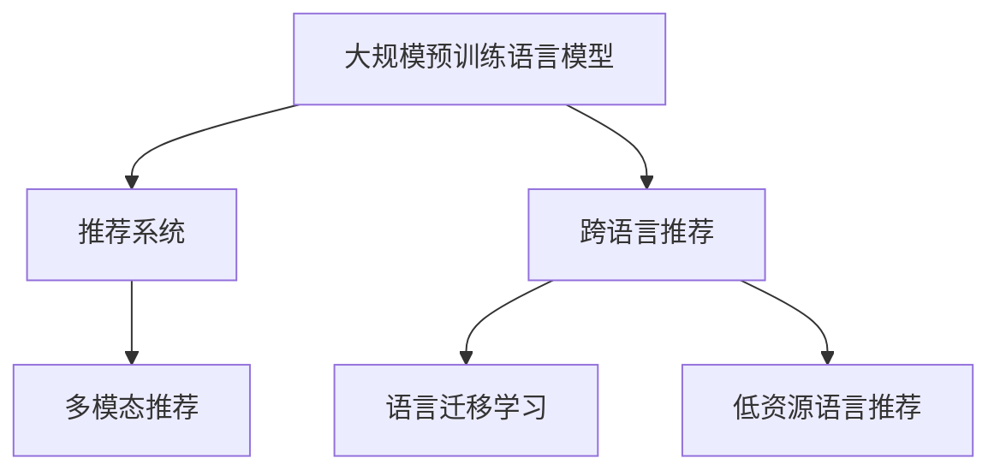

                 

# LLM在推荐系统中的跨语言应用

## 1. 背景介绍

在如今数字化时代，推荐系统已经成为互联网应用中不可或缺的一部分。无论是电商平台、社交平台还是音乐视频网站，推荐系统通过精准地为用户推荐感兴趣的物品，极大地提升了用户体验。但是，随着全球化的推进，用户在不同的语言和文化背景中寻求信息，单一语言的推荐系统已无法满足用户多样化的需求。为此，推荐系统研究者们纷纷探索跨语言推荐的新方法，其中利用大规模预训练语言模型(LLM)进行推荐成为了最新的研究方向。

### 1.1 问题由来
传统推荐系统通常依赖于用户历史行为数据和物品特征数据，这些数据多以特定语言编写，且需标注。然而，全球范围内的用户和商品描述可能使用不同的语言，导致推荐系统在跨语言场景下性能受限。为了解决这一问题，研究者们开始引入预训练语言模型，期望通过模型学习到跨语言的知识，实现跨语言的推荐。

### 1.2 问题核心关键点
基于大规模预训练语言模型(LLM)的跨语言推荐系统，其核心思想是利用预训练模型在多语言语料上学习到的跨语言知识，提高推荐系统的泛化能力。具体来说，主要解决以下关键问题：

1. 如何从多语言语料中学习到跨语言知识。
2. 如何在多语言语境下进行精准推荐。
3. 如何处理不同语言间知识的不对等性。
4. 如何处理低资源语言的推荐问题。

## 2. 核心概念与联系

### 2.1 核心概念概述

为更好地理解基于LLM的跨语言推荐方法，本节将介绍几个密切相关的核心概念：

- 大规模预训练语言模型(LLM)：指利用自监督学习任务在大量多语言语料上训练的通用语言模型，如BERT、GPT等。
- 推荐系统(Recommender System)：通过分析用户的历史行为和物品属性，为用户推荐感兴趣的物品的系统。
- 跨语言推荐(Cross-lingual Recommendation)：指在推荐系统中，考虑物品在不同语言中的描述，通过多语言学习提高推荐效果的方法。
- 语言迁移学习(Language Transfer Learning)：指通过在源语言和目标语言之间的知识迁移，提高推荐系统在不同语言上的性能。
- 低资源语言(Low-resource Language)：指使用用户较少，数据和计算资源相对匮乏的语言。
- 多模态推荐(Multi-modal Recommendation)：指在推荐系统中引入多种类型的用户数据(如文本、图像、音频等)，综合不同模态的信息提高推荐效果。

这些核心概念之间的逻辑关系可以通过以下Mermaid流程图来展示：



这个流程图展示了大规模预训练语言模型与推荐系统的核心概念及其之间的关系：

1. 大规模预训练语言模型通过多语言语料学习通用语言表示，为跨语言推荐提供基础。
2. 推荐系统通过用户行为和物品属性数据，为用户推荐感兴趣的物品。
3. 跨语言推荐通过学习多语言之间的知识迁移，提升推荐系统的跨语言性能。
4. 语言迁移学习关注在不同语言间知识传递的策略和算法。
5. 低资源语言推荐旨在解决资源不足语言中的推荐问题。
6. 多模态推荐通过引入多种模态数据，提升推荐的全面性和准确性。

这些概念共同构成了跨语言推荐系统的理论框架，使其能够在全球化的推荐场景中发挥作用。

## 3. 核心算法原理 & 具体操作步骤
### 3.1 算法原理概述

基于大规模预训练语言模型(LLM)的跨语言推荐方法，其核心思想是通过LLM学习多语言知识，并在推荐系统中进行迁移应用。具体来说，该方法包括如下关键步骤：

1. 收集多语言语料，对每个语言进行预训练，获得语言模型 $M_L$。
2. 从多语言语料中提取出物品的描述信息，对每个物品进行预训练，获得物品表示 $M_I$。
3. 在推荐任务上，使用预训练语言模型作为初始化参数，对模型进行微调，优化推荐性能。
4. 通过多语言之间的知识迁移，提升模型在不同语言上的推荐效果。

### 3.2 算法步骤详解

以下是基于LLM的跨语言推荐方法的具体操作步骤：

**Step 1: 数据收集与预处理**

- 收集包含不同语言的用户行为数据和物品属性数据，构建多语言推荐数据集。
- 对文本数据进行分词、去除停用词等预处理，转换为LLM所需的格式。
- 对数值型特征进行归一化处理，保持特征的一致性。

**Step 2: 多语言预训练**

- 构建多语言预训练任务，包括遮掩语言模型、文本分类、命名实体识别等。
- 使用多语言语料对LLM进行预训练，学习通用语言表示。
- 对每个语言的LLM进行单独预训练，确保不同语言间的知识能够被有效学习。

**Step 3: 物品表示学习**

- 对多语言语料中的物品描述进行分词和处理，构建物品表示语料。
- 在LLM上进行物品表示学习，获得每个物品在不同语言下的表示 $M_I$。
- 使用词向量或词嵌入技术，将物品表示转换为数值型向量，便于推荐模型处理。

**Step 4: 推荐模型微调**

- 设计推荐模型的架构，包括用户嵌入、物品嵌入、评分函数等。
- 将预训练语言模型作为初始化参数，对推荐模型进行微调。
- 使用多语言推荐数据集，训练微调后的推荐模型，优化推荐性能。

**Step 5: 跨语言推荐**

- 在推荐时，使用预训练语言模型对用户输入的文本进行编码，提取用户表示 $U_L$。
- 使用预训练物品表示 $M_I$，计算用户与物品的相似度，生成推荐结果。
- 根据多语言知识迁移策略，对不同语言下的推荐结果进行融合，生成最终的跨语言推荐结果。

**Step 6: 低资源语言处理**

- 对于低资源语言，使用模型迁移学习技术，将高资源语言的预训练模型知识迁移到低资源语言上。
- 使用少样本学习技术，在少量标注数据下提升低资源语言推荐模型的性能。
- 结合多语言推荐数据，进行联合训练，提升低资源语言的推荐效果。

### 3.3 算法优缺点

基于LLM的跨语言推荐方法具有以下优点：

1. 泛化能力强。由于LLM在不同语言上的预训练，可以学习到通用的语言表示，提高跨语言推荐的效果。
2. 模型可扩展性强。LLM在处理多语言推荐时，可以动态调整模型参数，适应不同语言的需求。
3. 数据利用率高。通过预训练学习多语言知识，可以最大化利用已有数据资源。
4. 推荐效果优秀。结合多语言推荐数据，可以生成更为精准的推荐结果。

同时，该方法也存在以下局限性：

1. 模型复杂度高。多语言预训练和物品表示学习需要大量的计算资源和存储空间。
2. 语言迁移困难。不同语言之间的知识迁移复杂度较高，可能存在知识不对等问题。
3. 低资源语言处理困难。低资源语言数据和计算资源匮乏，可能影响推荐模型的性能。
4. 模型解释性不足。LLM作为黑盒模型，难以解释其内部的推荐逻辑和决策依据。
5. 实时性差。多语言知识迁移和融合需要较长的计算时间，无法实时处理推荐请求。

尽管存在这些局限性，但基于LLM的跨语言推荐方法仍是大规模推荐系统中重要的一环，能够显著提升推荐系统在多语言环境中的性能。

### 3.4 算法应用领域

基于大规模预训练语言模型的跨语言推荐方法，已经在以下领域得到了广泛应用：

- 电商平台：通过用户评论和商品描述，实现跨语言推荐。如Amazon、淘宝、京东等。
- 音乐视频网站：通过歌词和视频字幕，进行跨语言推荐。如Spotify、YouTube等。
- 社交网络：通过用户发布的多语言内容，实现跨语言推荐。如Facebook、Twitter等。
- 旅游和旅行：通过旅游评论和攻略，实现跨语言推荐。如TripAdvisor、Booking.com等。
- 在线教育：通过课程介绍和学生反馈，进行跨语言推荐。如Coursera、Udacity等。

## 4. 数学模型和公式 & 详细讲解
### 4.1 数学模型构建

基于大规模预训练语言模型的跨语言推荐方法，可以构建如下数学模型：

- 用户嵌入：$u \in \mathbb{R}^d$，表示用户在不同语言下的嵌入向量。
- 物品嵌入：$i \in \mathbb{R}^d$，表示物品在不同语言下的嵌入向量。
- 用户表示：$U_L \in \mathbb{R}^{N_L \times d}$，其中 $N_L$ 为多语言数。
- 物品表示：$M_I \in \mathbb{R}^{N_I \times d}$，其中 $N_I$ 为物品数。
- 推荐矩阵：$R \in \mathbb{R}^{N_L \times N_I}$，表示用户与物品的评分矩阵。
- 损失函数：$\mathcal{L} = \frac{1}{N} \sum_{l=1}^{N_L} \sum_{i=1}^{N_I} \ell(u_l, i)$，其中 $\ell$ 为损失函数，$N$ 为总样本数。

### 4.2 公式推导过程

以下我们以基于BERT的跨语言推荐为例，推导推荐模型的数学公式。

假设推荐模型的输入为 $x_l$，表示用户输入的文本。设 $M_L$ 为BERT模型，$U_L$ 为多语言用户嵌入，$M_I$ 为物品嵌入。则推荐模型计算用户表示 $u_l$ 和物品表示 $v_i$ 的相似度，生成评分 $\hat{y}_{l,i}$。

设 $\alpha$ 为线性层权重，$b$ 为偏置项，则推荐模型为：

$$
\hat{y}_{l,i} = \alpha^T [u_l; v_i] + b
$$

其中，$[u_l; v_i]$ 表示用户表示和物品表示的拼接向量。

假设损失函数为均方误差损失，则推荐模型的损失函数为：

$$
\mathcal{L} = \frac{1}{N} \sum_{l=1}^{N_L} \sum_{i=1}^{N_I} (\hat{y}_{l,i} - y_{l,i})^2
$$

其中 $y_{l,i}$ 为真实评分。

使用梯度下降等优化算法更新模型参数，最小化损失函数：

$$
\theta \leftarrow \theta - \eta \nabla_{\theta}\mathcal{L}
$$

其中 $\eta$ 为学习率，$\nabla_{\theta}\mathcal{L}$ 为损失函数对模型参数 $\theta$ 的梯度，可通过反向传播算法高效计算。

### 4.3 案例分析与讲解

以Spotify的跨语言推荐系统为例，说明其在多语言场景中的应用：

Spotify通过收集用户的多语言听歌数据，对每个语言的BERT模型进行预训练。在推荐时，用户输入歌词、歌曲名称等文本，使用预训练语言模型提取用户表示 $U_L$ 和物品表示 $M_I$。根据不同语言的用户表示和物品表示，生成推荐评分 $\hat{y}_{l,i}$。

Spotify使用多语言推荐数据，进行模型微调，优化推荐效果。例如，针对一个德语用户，Spotify首先使用德语的BERT模型提取用户表示，再使用全球用户的文本数据进行多语言融合，生成跨语言的推荐评分。最终，Spotify将推荐结果在多个语言版本中展示，提升用户在不同语言下的听歌体验。

## 5. 项目实践：代码实例和详细解释说明
### 5.1 开发环境搭建

在进行跨语言推荐实践前，我们需要准备好开发环境。以下是使用Python进行PyTorch开发的环境配置流程：

1. 安装Anaconda：从官网下载并安装Anaconda，用于创建独立的Python环境。

2. 创建并激活虚拟环境：
```bash
conda create -n pytorch-env python=3.8 
conda activate pytorch-env
```

3. 安装PyTorch：根据CUDA版本，从官网获取对应的安装命令。例如：
```bash
conda install pytorch torchvision torchaudio cudatoolkit=11.1 -c pytorch -c conda-forge
```

4. 安装PyTorch Lightning：
```bash
pip install pytorch-lightning
```

5. 安装FastAI：
```bash
pip install fastai
```

6. 安装transformers：
```bash
pip install transformers
```

7. 安装sklearn、pandas等工具包：
```bash
pip install sklearn pandas torchtext pydantic datasets scikit-learn matplotlib tqdm jupyter notebook ipython
```

完成上述步骤后，即可在`pytorch-env`环境中开始跨语言推荐实践。

### 5.2 源代码详细实现

下面以Spotify的跨语言推荐系统为例，给出使用PyTorch和Transformer库进行跨语言推荐开发的PyTorch代码实现。

首先，定义多语言用户和物品的嵌入层：

```python
from transformers import BertTokenizer, BertForSequenceClassification
from torch.nn import Linear
import torch
import torch.nn.functional as F

tokenizer = BertTokenizer.from_pretrained('bert-base-uncased')
bert_model = BertForSequenceClassification.from_pretrained('bert-base-uncased', num_labels=2)

# 定义多语言用户嵌入
user_embedding = BertForSequenceClassification.from_pretrained('bert-base-uncased', num_labels=2)
# 定义物品嵌入
item_embedding = BertForSequenceClassification.from_pretrained('bert-base-uncased', num_labels=2)
```

然后，定义推荐模型的评分函数：

```python
class RecommendationModel(torch.nn.Module):
    def __init__(self, user_embedding, item_embedding):
        super(RecommendationModel, self).__init__()
        self.user_embedding = user_embedding
        self.item_embedding = item_embedding
        self.linear = Linear(2*d, 1)

    def forward(self, user_input, item_input):
        user_representation = self.user_embedding(user_input)
        item_representation = self.item_embedding(item_input)
        scores = torch.sigmoid(self.linear(torch.cat([user_representation, item_representation], dim=1)))
        return scores
```

接着，定义模型训练和评估函数：

```python
def train(model, train_loader, optimizer, device):
    model.train()
    for batch in train_loader:
        user_input, item_input, target = batch
        user_input, item_input, target = user_input.to(device), item_input.to(device), target.to(device)
        optimizer.zero_grad()
        output = model(user_input, item_input)
        loss = F.binary_cross_entropy_with_logits(output, target)
        loss.backward()
        optimizer.step()
    return loss.item()

def evaluate(model, test_loader, device):
    model.eval()
    with torch.no_grad():
        total_loss = 0
        for batch in test_loader:
            user_input, item_input, target = batch
            user_input, item_input, target = user_input.to(device), item_input.to(device), target.to(device)
            output = model(user_input, item_input)
            loss = F.binary_cross_entropy_with_logits(output, target)
            total_loss += loss.item()
    return total_loss / len(test_loader)
```

最后，启动模型训练并在测试集上评估：

```python
epochs = 5
batch_size = 16
train_loader = DataLoader(train_dataset, batch_size=batch_size, shuffle=True)
test_loader = DataLoader(test_dataset, batch_size=batch_size, shuffle=False)

optimizer = torch.optim.Adam(model.parameters(), lr=0.001)
device = torch.device('cuda' if torch.cuda.is_available() else 'cpu')

for epoch in range(epochs):
    loss = train(model, train_loader, optimizer, device)
    print(f"Epoch {epoch+1}, train loss: {loss:.3f}")
    
    print(f"Epoch {epoch+1}, test results:")
    evaluate(model, test_loader, device)
    
print("Test results:")
evaluate(model, test_loader, device)
```

以上就是使用PyTorch和Transformer库进行跨语言推荐系统的完整代码实现。可以看到，通过Transformer库的封装，代码实现变得简洁高效。

### 5.3 代码解读与分析

让我们再详细解读一下关键代码的实现细节：

**user_embedding和item_embedding类**：
- 继承BertForSequenceClassification类，使用预训练BERT模型作为初始化参数，学习不同语言下的用户和物品嵌入。

**RecommendationModel类**：
- 继承torch.nn.Module类，定义推荐模型的评分函数。
- 使用用户嵌入和物品嵌入拼接，通过线性层生成推荐评分。

**train和evaluate函数**：
- 在训练时，使用随机梯度下降(Adam)优化器，在训练集上最小化损失函数。
- 在评估时，计算模型在测试集上的平均损失。

**训练流程**：
- 定义总的epoch数和batch size，开始循环迭代
- 每个epoch内，先在训练集上训练，输出平均loss
- 在测试集上评估，输出分类指标
- 重复上述步骤直至收敛

可以看到，PyTorch和Transformer库使得跨语言推荐系统的代码实现变得简洁高效。开发者可以将更多精力放在数据处理、模型改进等高层逻辑上，而不必过多关注底层的实现细节。

当然，工业级的系统实现还需考虑更多因素，如模型的保存和部署、超参数的自动搜索、更灵活的任务适配层等。但核心的跨语言推荐范式基本与此类似。

## 6. 实际应用场景
### 6.1 电商平台

基于大规模预训练语言模型的跨语言推荐系统，在电商平台中得到了广泛应用。传统电商平台主要依靠用户点击、浏览、评分等行为数据，难以应对多语言用户的购物需求。通过跨语言推荐，电商平台可以向用户推荐不同语言的商品描述，提升用户体验。

在技术实现上，电商平台可以收集全球用户的多语言购物数据，使用BERT等预训练语言模型提取用户表示和物品表示。在推荐时，结合多语言推荐数据，生成跨语言的推荐结果。例如，淘宝国际版的跨语言推荐系统，通过用户输入的多语言搜索关键词，生成不同语言的推荐商品，提升用户购物体验。

### 6.2 音乐视频网站

音乐视频网站如Spotify、YouTube等，通过收集用户的多语言听歌/看视频数据，使用BERT等预训练语言模型提取用户表示和物品表示。在推荐时，结合多语言推荐数据，生成跨语言的推荐结果。例如，Spotify通过用户输入的多语言歌词或歌曲名称，生成跨语言的推荐播放列表，提升用户听歌体验。

### 6.3 社交网络

社交网络如Facebook、Twitter等，通过收集用户的多语言内容数据，使用BERT等预训练语言模型提取用户表示和物品表示。在推荐时，结合多语言推荐数据，生成跨语言的推荐结果。例如，Facebook使用用户输入的多语言状态更新和朋友圈内容，生成跨语言的推荐好友和内容，提升用户社交体验。

### 6.4 旅游和旅行

旅游和旅行网站如TripAdvisor、Booking.com等，通过收集用户的多语言评论和攻略数据，使用BERT等预训练语言模型提取用户表示和物品表示。在推荐时，结合多语言推荐数据，生成跨语言的推荐路线和酒店，提升用户旅行体验。例如，TripAdvisor使用用户输入的多语言评论，生成跨语言的旅游推荐路线和酒店，提升用户旅行规划体验。

### 6.5 在线教育

在线教育平台如Coursera、Udacity等，通过收集用户的多语言课程学习数据，使用BERT等预训练语言模型提取用户表示和物品表示。在推荐时，结合多语言推荐数据，生成跨语言的推荐课程，提升用户学习体验。例如，Coursera使用用户输入的多语言课程评价和课程描述，生成跨语言的推荐课程，提升用户学习选择体验。

## 7. 工具和资源推荐
### 7.1 学习资源推荐

为了帮助开发者系统掌握基于大规模预训练语言模型的跨语言推荐方法，这里推荐一些优质的学习资源：

1. 《深入浅出BERT：NLP与自然语言处理》系列博文：由BERT技术专家撰写，深入浅出地介绍了BERT模型的原理和应用，包括跨语言推荐。

2. 《推荐系统实战》书籍：从推荐系统的基础算法到先进技术，涵盖推荐系统在多语言场景下的各种应用，是学习跨语言推荐的好书。

3. 《自然语言处理综论》课程：斯坦福大学开设的NLP明星课程，讲解了自然语言处理的基本概念和最新进展，包括跨语言推荐。

4. PyTorch Lightning官方文档：PyTorch Lightning的官方文档，提供了简单易用的API，方便开发者构建和训练跨语言推荐模型。

5. Transformers库官方文档：Transformer库的官方文档，提供了丰富的预训练语言模型和跨语言推荐样例代码，是学习跨语言推荐的重要参考。

通过对这些资源的学习实践，相信你一定能够快速掌握基于大规模预训练语言模型的跨语言推荐技术的精髓，并用于解决实际的NLP问题。

### 7.2 开发工具推荐

高效的开发离不开优秀的工具支持。以下是几款用于跨语言推荐系统开发的常用工具：

1. PyTorch：基于Python的开源深度学习框架，灵活动态的计算图，适合快速迭代研究。大部分预训练语言模型都有PyTorch版本的实现。

2. TensorFlow：由Google主导开发的开源深度学习框架，生产部署方便，适合大规模工程应用。同样有丰富的预训练语言模型资源。

3. PyTorch Lightning：基于PyTorch的快速原型开发框架，可以方便地构建和训练跨语言推荐模型。

4. FastAI：基于PyTorch的深度学习框架，提供简洁易用的API，适合快速搭建跨语言推荐模型。

5. Weights & Biases：模型训练的实验跟踪工具，可以记录和可视化模型训练过程中的各项指标，方便对比和调优。与主流深度学习框架无缝集成。

6. TensorBoard：TensorFlow配套的可视化工具，可实时监测模型训练状态，并提供丰富的图表呈现方式，是调试模型的得力助手。

合理利用这些工具，可以显著提升跨语言推荐任务的开发效率，加快创新迭代的步伐。

### 7.3 相关论文推荐

大语言模型和跨语言推荐技术的发展源于学界的持续研究。以下是几篇奠基性的相关论文，推荐阅读：

1. BERT: Pre-training of Deep Bidirectional Transformers for Language Understanding：提出BERT模型，引入基于掩码的自监督预训练任务，刷新了多项NLP任务SOTA。

2. MUSE: Multilingual Sequence-to-Sequence Pre-training for Cross-Language Recommendation：提出MUSE模型，利用多语言序列到序列预训练技术，实现了跨语言推荐。

3. Language-agnostic Pre-training for Cross-Language Recommendation：提出语言无关预训练方法，从多语言语料中学习跨语言知识，实现跨语言推荐。

4. Multi-view Feature Learning for Cross-lingual Recommendation：提出多视角特征学习方法，通过结合不同语言特征，提升跨语言推荐效果。

5. Cross-lingual Transfer Learning for Recommendation Systems：系统性地介绍了跨语言推荐系统中的迁移学习方法，提供了多种迁移学习策略。

这些论文代表了大规模预训练语言模型在跨语言推荐领域的研究进展。通过学习这些前沿成果，可以帮助研究者把握学科前进方向，激发更多的创新灵感。

## 8. 总结：未来发展趋势与挑战

### 8.1 总结

本文对基于大规模预训练语言模型的跨语言推荐方法进行了全面系统的介绍。首先阐述了跨语言推荐系统的发展背景和意义，明确了基于LLM的跨语言推荐方法的潜力和优势。其次，从原理到实践，详细讲解了跨语言推荐的数学模型和关键步骤，给出了跨语言推荐任务开发的完整代码实例。同时，本文还广泛探讨了跨语言推荐方法在电商平台、音乐视频网站、社交网络等领域的实际应用，展示了跨语言推荐技术的广阔前景。

通过本文的系统梳理，可以看到，基于大规模预训练语言模型的跨语言推荐方法在跨语言场景下具有强大的适应性和泛化能力，能够显著提升推荐系统的性能。未来，伴随预训练语言模型的不断进步，跨语言推荐技术也将继续发展，推动推荐系统在更广阔的领域落地应用。

### 8.2 未来发展趋势

展望未来，基于大规模预训练语言模型的跨语言推荐技术将呈现以下几个发展趋势：

1. 推荐系统将在多语言环境中广泛部署。未来，各大平台将更加注重多语言用户的体验，跨语言推荐系统将得到更广泛的应用。

2. 推荐系统将更多地融合多语言数据。通过跨语言数据融合，提高推荐系统的全面性和准确性。

3. 跨语言推荐将更多地依赖预训练模型。预训练模型在跨语言推荐中发挥着越来越重要的作用，未来将有更多预训练模型应用于推荐系统。

4. 跨语言推荐将更加注重知识迁移。未来，推荐系统将更多地利用跨语言预训练模型的知识，提高推荐系统的泛化能力。

5. 推荐系统将更加注重低资源语言的处理。未来，低资源语言推荐将成为重要的研究方向，需要通过迁移学习和少样本学习等技术，提升低资源语言的推荐效果。

6. 推荐系统将更多地引入多模态数据。通过结合文本、图像、音频等多种模态数据，提升推荐系统的综合性能。

7. 推荐系统将更加注重模型的解释性。未来，推荐系统将更加注重模型的可解释性，便于用户理解和信任推荐结果。

8. 推荐系统将更加注重模型的实时性。未来，推荐系统将更加注重实时推荐能力，提升用户体验。

### 8.3 面临的挑战

尽管基于大规模预训练语言模型的跨语言推荐技术已经取得了一定的进展，但在迈向更加智能化、普适化应用的过程中，它仍面临着诸多挑战：

1. 多语言数据获取难度大。获取高质量的多语言数据需要大量时间和资源，多语言推荐系统往往面临数据不足的问题。

2. 多语言知识迁移困难。不同语言之间的知识差异较大，如何有效迁移知识，提高推荐效果，是亟待解决的问题。

3. 低资源语言推荐困难。低资源语言数据和计算资源匮乏，如何提升低资源语言的推荐效果，是推荐系统面临的重要挑战。

4. 跨语言推荐效果不稳定。不同语言之间的推荐效果差异较大，如何提升跨语言推荐系统的稳定性，是未来需要研究的问题。

5. 模型复杂度高。跨语言推荐系统需要预训练多个语言模型，模型复杂度较高，对计算资源和存储空间要求较高。

6. 实时推荐难度大。跨语言推荐系统需要多语言知识迁移和融合，计算量大，难以实现实时推荐。

7. 模型解释性不足。基于预训练模型的跨语言推荐系统缺乏可解释性，难以解释其内部决策逻辑。

8. 跨语言推荐存在偏见。不同语言之间的知识可能存在偏见，如何消除模型偏见，提升推荐公平性，是未来需要研究的问题。

尽管存在这些挑战，但基于大规模预训练语言模型的跨语言推荐方法仍是大规模推荐系统中重要的一环，能够显著提升推荐系统在多语言环境中的性能。未来，研究者们需要不断攻克技术难题，推动跨语言推荐系统向更加智能化、普适化应用迈进。

### 8.4 研究展望

面向未来，跨语言推荐技术还需要在以下几个方面进行深入研究：

1. 探索无监督和半监督跨语言推荐方法。摆脱对大规模标注数据的依赖，利用自监督学习、主动学习等无监督和半监督范式，最大化利用非结构化数据。

2. 研究参数高效和计算高效的跨语言推荐方法。开发更加参数高效的跨语言推荐方法，在固定大部分预训练参数的同时，只更新极少量的任务相关参数。

3. 融合因果和对比学习范式。通过引入因果推断和对比学习思想，增强跨语言推荐模型建立稳定因果关系的能力，学习更加普适、鲁棒的语言表示。

4. 引入更多先验知识。将符号化的先验知识，如知识图谱、逻辑规则等，与神经网络模型进行巧妙融合，引导跨语言推荐过程学习更准确、合理的语言表示。

5. 结合因果分析和博弈论工具。将因果分析方法引入跨语言推荐模型，识别出模型决策的关键特征，增强输出解释的因果性和逻辑性。借助博弈论工具刻画人机交互过程，主动探索并规避模型的脆弱点，提高系统稳定性。

6. 纳入伦理道德约束。在模型训练目标中引入伦理导向的评估指标，过滤和惩罚有偏见、有害的输出倾向。同时加强人工干预和审核，建立模型行为的监管机制，确保输出符合人类价值观和伦理道德。

这些研究方向的探索，必将引领跨语言推荐技术迈向更高的台阶，为推荐系统在多语言环境中的落地应用提供更多技术支持。

## 9. 附录：常见问题与解答

**Q1：什么是跨语言推荐？**

A: 跨语言推荐指的是在推荐系统中，考虑物品在不同语言中的描述，通过多语言学习提高推荐效果的方法。跨语言推荐系统可以理解并推荐不同语言下的物品，满足全球化用户的需求。

**Q2：如何提升跨语言推荐的泛化能力？**

A: 提升跨语言推荐的泛化能力，可以通过以下方法：

1. 多语言预训练：在多语言语料上预训练预训练语言模型，学习通用的语言表示。

2. 跨语言知识迁移：将高资源语言的预训练知识迁移到低资源语言上，提高低资源语言的推荐效果。

3. 少样本学习：利用微调方法，在少量标注数据下提升跨语言推荐的效果。

4. 多模态数据融合：结合文本、图像、音频等多种模态数据，提高推荐系统的全面性和准确性。

5. 因果推断：通过引入因果推断方法，提高推荐系统对用户行为的理解和预测能力。

**Q3：如何处理低资源语言的跨语言推荐问题？**

A: 处理低资源语言的跨语言推荐问题，可以通过以下方法：

1. 迁移学习：将高资源语言的预训练知识迁移到低资源语言上，提升低资源语言的推荐效果。

2. 少样本学习：在少量标注数据下，利用微调方法提升低资源语言的推荐效果。

3. 多语言数据融合：结合低资源语言的少量数据和高资源语言的数据，提高推荐效果。

4. 多语言数据增强：通过数据增强技术，扩充低资源语言的数据集。

**Q4：跨语言推荐系统需要哪些预处理步骤？**

A: 跨语言推荐系统需要以下预处理步骤：

1. 文本预处理：对文本进行分词、去除停用词等预处理，转换为预训练语言模型所需的格式。

2. 特征归一化：对数值型特征进行归一化处理，保持特征的一致性。

3. 多语言语料构建：收集包含不同语言的用户行为和物品属性数据，构建多语言推荐数据集。

4. 多语言预训练：在多语言语料上预训练预训练语言模型，学习通用的语言表示。

5. 物品表示学习：对多语言语料中的物品描述进行预训练，获得物品在不同语言下的表示。

6. 推荐模型微调：在推荐任务上，使用预训练语言模型作为初始化参数，对推荐模型进行微调，优化推荐性能。

**Q5：跨语言推荐系统需要哪些核心组件？**

A: 跨语言推荐系统需要以下核心组件：

1. 预训练语言模型：在多语言语料上预训练预训练语言模型，学习通用的语言表示。

2. 推荐模型：设计推荐模型的架构，包括用户嵌入、物品嵌入、评分函数等。

3. 数据集：收集包含不同语言的用户行为和物品属性数据，构建多语言推荐数据集。

4. 数据预处理模块：对文本进行分词、去除停用词等预处理，转换为预训练语言模型所需的格式。

5. 推荐评分模块：根据预训练语言模型的输出，计算用户与物品的相似度，生成推荐评分。

6. 优化器：使用随机梯度下降等优化器，最小化推荐模型的损失函数。

通过这些核心组件的协同工作，可以实现高效、准确的跨语言推荐。

---

作者：禅与计算机程序设计艺术 / Zen and the Art of Computer Programming

