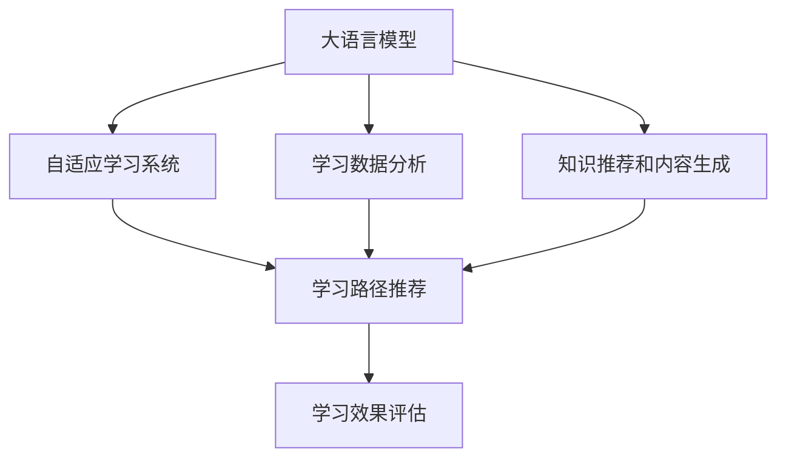

                 

# LLM在教育中的应用：个性化学习的未来

> 关键词：大语言模型,个性化学习,教育技术,自适应学习系统,学习数据分析,学习路径推荐,学习效果评估

## 1. 背景介绍

### 1.1 问题由来
在当前数字化时代，教育技术（EdTech）的发展极大地改变了学习的方式。从传统的教师讲授到线上教学，再到如今的AI辅助学习，教育正在走向更加个性化、智能化的方向。大语言模型（Large Language Models, LLMs）作为AI技术的最新进展，为教育领域带来了新的变革可能。

通过大语言模型，学生能够以更加自然、互动的方式学习。这种新型学习方式不仅能够提高学习效率，还能提供个性化的学习路径和反馈，帮助学生克服学习障碍，实现更好的学习效果。同时，大语言模型还能辅助教师进行教学设计和内容生成，进一步提升教学质量。

### 1.2 问题核心关键点
大语言模型在教育应用中的核心关键点包括：

- **个性化学习**：通过分析学生的学习数据和行为，生成个性化的学习建议和路径。
- **自适应学习系统**：动态调整教学内容和难度，适应学生的学习进度和能力。
- **学习效果评估**：通过多维度数据分析，评估学生的学习效果和进步。
- **知识推荐和内容生成**：自动生成学习材料，辅助教学内容更新。

这些核心点构成了基于大语言模型的教育技术框架，旨在提供更加智能、高效、个性化的学习体验。

### 1.3 问题研究意义
大语言模型在教育中的应用研究具有重要意义：

1. **提升学习效率**：个性化的学习路径和内容推荐，使学习更加精准，减少了学生在学习过程中的困惑和浪费时间。
2. **促进公平教育**：通过自适应学习系统，确保不同能力水平的学生都能获得最适合他们的教育资源。
3. **优化教学设计**：大语言模型辅助教师设计教学内容和评估学生表现，帮助教师更好地掌握课堂动态。
4. **支持终身学习**：大语言模型的广泛应用使得学习不再受限于时间和地点，促进终身学习的普及。
5. **推动教育创新**：结合大语言模型的智能技术和教育理念，探索新的教学模式和方法，推动教育领域的创新。

## 2. 核心概念与联系

### 2.1 核心概念概述

为更好地理解基于大语言模型的个性化学习系统，本节将介绍几个密切相关的核心概念：

- **大语言模型**：以自回归（如GPT）或自编码（如BERT）模型为代表的大规模预训练语言模型。通过在大规模无标签文本语料上进行预训练，学习通用的语言知识和常识。

- **自适应学习系统**：一种动态调整教学内容和难度的智能学习系统，根据学生的学习进度和能力，实时生成个性化的学习资源和练习。

- **学习数据分析**：通过分析学生的学习数据和行为，评估其学习状态和效果，提供个性化的学习建议。

- **学习路径推荐**：根据学生的学习进度和能力，推荐最适合的学习路径和内容，帮助学生高效学习。

- **学习效果评估**：通过多维度数据分析，评估学生的学习效果和进步，提供反馈和激励。

- **知识推荐和内容生成**：根据学生的兴趣和需求，自动推荐学习资源和生成教学内容，辅助教师教学。

这些核心概念之间的逻辑关系可以通过以下Mermaid流程图来展示：



这个流程图展示了大语言模型在个性化学习系统中的核心概念及其之间的关系：

1. 大语言模型通过预训练获得基础能力。
2. 自适应学习系统利用大模型生成的个性化学习资源，动态调整教学内容。
3. 学习数据分析提供学生学习状态和效果评估，辅助路径推荐。
4. 学习路径推荐根据分析结果，推荐最适合的学习路径和内容。
5. 学习效果评估提供反馈和激励，优化学习路径。
6. 知识推荐和内容生成提供个性化学习资源，辅助教学。

这些核心概念共同构成了基于大语言模型的个性化学习框架，使其能够在各种场景下提供智能、高效、个性化的学习体验。

## 3. 核心算法原理 & 具体操作步骤
### 3.1 算法原理概述

基于大语言模型的个性化学习系统，本质上是一个动态调整教学内容的自适应学习过程。其核心思想是：利用大语言模型的知识图谱和语义理解能力，分析学生的学习数据和行为，动态生成个性化的学习路径和内容，从而提升学生的学习效果。

形式化地，假设大语言模型为 $M_{\theta}$，其中 $\theta$ 为预训练得到的模型参数。假设学习系统为目标学生 $S$ 设计了个性化学习路径 $P(S)$ 和内容 $C(S)$，学习目标为 $T$。学习系统的优化目标是最小化目标任务的完成时间 $t$，即：

$$
\min_{\theta} \min_{P(S), C(S)} t
$$

其中 $P(S)$ 和 $C(S)$ 需要根据学生的学习状态和历史数据进行动态调整。

### 3.2 算法步骤详解

基于大语言模型的个性化学习系统一般包括以下几个关键步骤：

**Step 1: 准备预训练模型和数据集**
- 选择合适的预训练语言模型 $M_{\theta}$ 作为初始化参数，如 BERT、GPT 等。
- 准备目标学生的学习历史数据集 $D_S$，包括学生的考试成绩、作业完成情况、学习时长等。

**Step 2: 设计个性化学习路径**
- 根据学生的学习历史和当前状态，设计个性化的学习路径 $P(S)$。路径通常包含学习目标、学习内容、学习时间等。
- 利用大语言模型生成路径中的各个学习内容 $C(S)$。例如，根据学习目标，自动生成相关的阅读材料、练习题等。

**Step 3: 动态调整学习路径**
- 根据学生的学习反馈和进度，实时调整学习路径 $P(S)$ 和内容 $C(S)$。例如，通过大语言模型生成新的学习资源，替换已有的不相关内容。

**Step 4: 执行学习过程**
- 根据设计好的学习路径和内容，引导学生进行学习。可以使用虚拟助教或智能辅导系统进行实时辅助。
- 在每个学习单元后，利用大语言模型进行效果评估，调整下一步的学习路径和内容。

**Step 5: 评估学习效果**
- 在每个学习周期结束时，利用多维度数据分析，评估学生的学习效果和进步。例如，使用学习目标的完成情况、考试成绩、作业完成情况等指标。
- 根据评估结果，调整学习路径和内容，进一步优化学习过程。

以上是基于大语言模型的个性化学习系统的一般流程。在实际应用中，还需要针对具体学生的需求和环境，对各个环节进行优化设计，如改进学习路径的设计算法，引入更多的正则化技术，搜索最优的超参数组合等，以进一步提升学习效果。

### 3.3 算法优缺点

基于大语言模型的个性化学习系统具有以下优点：

1. **高效个性化**：通过分析学生的学习数据，提供个性化的学习路径和内容，减少学生在学习过程中的困惑和浪费时间。
2. **动态调整**：根据学生的学习反馈和进度，实时调整学习路径和内容，适应学生的学习能力和进度。
3. **多维度评估**：利用多维度数据分析，全面评估学生的学习效果和进步，提供个性化的反馈和激励。
4. **辅助教学设计**：大语言模型辅助教师设计教学内容和评估学生表现，帮助教师更好地掌握课堂动态。
5. **促进公平教育**：通过自适应学习系统，确保不同能力水平的学生都能获得最适合他们的教育资源。

同时，该系统也存在一定的局限性：

1. **数据依赖**：系统的性能很大程度上依赖于学生的学习数据质量和数量，获取高质量学习数据的成本较高。
2. **模型鲁棒性**：大语言模型在面对未知领域时，泛化性能可能有限，导致学习效果不佳。
3. **隐私风险**：学生学习数据的收集和使用可能涉及隐私问题，需要严格遵守相关法规和伦理规范。
4. **可解释性不足**：大语言模型的决策过程通常缺乏可解释性，难以对其推理逻辑进行分析和调试。

尽管存在这些局限性，但就目前而言，基于大语言模型的个性化学习系统仍是最先进的学习技术之一。未来相关研究的重点在于如何进一步降低对学习数据的依赖，提高模型的少样本学习和跨领域迁移能力，同时兼顾可解释性和伦理安全性等因素。

### 3.4 算法应用领域

基于大语言模型的个性化学习系统在教育领域已经得到了广泛的应用，覆盖了几乎所有常见学习任务，例如：

- **语言学习**：通过个性化的语言学习路径和内容，帮助学生掌握外语知识。
- **数学学习**：根据学生的学习进度和能力，动态调整数学题目难度和内容，提升学生的数学能力。
- **科学学习**：利用大语言模型生成科学实验报告、解题步骤等，辅助学生进行科学探究。
- **历史学习**：根据学生的兴趣和能力，推荐相关的历史文献、视频等，提升学生的学习兴趣。
- **编程学习**：自动生成编程题目和解决方案，辅助学生进行编程练习。

除了上述这些经典任务外，基于大语言模型的个性化学习系统还被创新性地应用到更多场景中，如个性化练习、智能作业批改、学习资源推荐等，为教育技术带来了全新的突破。随着预训练语言模型和个性化学习技术的不断发展，相信教育技术将在更广阔的应用领域大放异彩。

## 4. 数学模型和公式 & 详细讲解 & 举例说明
### 4.1 数学模型构建

本节将使用数学语言对基于大语言模型的个性化学习系统进行更加严格的刻画。

记大语言模型为 $M_{\theta}$，假设目标学生为 $S$，学习目标为 $T$，学习路径为 $P(S)$，学习内容为 $C(S)$。学习效果评估为 $\mathcal{E}(T,S,P(S),C(S))$。

学习系统的优化目标是最小化学习时间 $t$，即：

$$
\min_{\theta} \min_{P(S), C(S)} t
$$

在实践中，我们通常使用基于梯度的优化算法（如SGD、Adam等）来近似求解上述最优化问题。设 $\eta$ 为学习率，$\lambda$ 为正则化系数，则参数的更新公式为：

$$
\theta \leftarrow \theta - \eta \nabla_{\theta}\mathcal{E}(T,S,P(S),C(S)) - \eta\lambda\theta
$$

其中 $\nabla_{\theta}\mathcal{E}(T,S,P(S),C(S))$ 为评估函数对参数 $\theta$ 的梯度，可通过反向传播算法高效计算。

### 4.2 公式推导过程

以下我们以数学学习为例，推导个性化学习系统的评估函数及其梯度的计算公式。

假设目标学生 $S$ 正在学习数学中的某个主题，其学习路径 $P(S)$ 包含若干个学习单元，每个单元的知识点 $k_i$ 和难度 $d_i$ 不同。学习内容 $C(S)$ 包括该主题的相关练习题、阅读材料等。

定义学习系统在当前学习路径和内容下的评估函数为 $\mathcal{E}(T,S,P(S),C(S))$，其中 $T$ 为学习目标，如掌握该主题的所有知识点。则评估函数可以表示为：

$$
\mathcal{E}(T,S,P(S),C(S)) = \sum_{i=1}^n \mathcal{E}_k(k_i, S, P(S), C(S))
$$

其中 $\mathcal{E}_k(k_i, S, P(S), C(S))$ 为学习单元 $k_i$ 对学生 $S$ 的评估，可以定义为学生在该单元上的掌握程度和难度 $d_i$ 的函数。

在得到评估函数梯度后，即可带入参数更新公式，完成模型的迭代优化。重复上述过程直至收敛，最终得到最优的学习路径和内容参数 $\theta^*$。

## 5. 项目实践：代码实例和详细解释说明
### 5.1 开发环境搭建

在进行个性化学习系统开发前，我们需要准备好开发环境。以下是使用Python进行PyTorch开发的环境配置流程：

1. 安装Anaconda：从官网下载并安装Anaconda，用于创建独立的Python环境。

2. 创建并激活虚拟环境：
```bash
conda create -n pytorch-env python=3.8 
conda activate pytorch-env
```

3. 安装PyTorch：根据CUDA版本，从官网获取对应的安装命令。例如：
```bash
conda install pytorch torchvision torchaudio cudatoolkit=11.1 -c pytorch -c conda-forge
```

4. 安装Transformer库：
```bash
pip install transformers
```

5. 安装各类工具包：
```bash
pip install numpy pandas scikit-learn matplotlib tqdm jupyter notebook ipython
```

完成上述步骤后，即可在`pytorch-env`环境中开始个性化学习系统的开发。

### 5.2 源代码详细实现

下面我们以数学学习为例，给出使用Transformers库对BERT模型进行个性化学习的PyTorch代码实现。

首先，定义数学学习任务的数据处理函数：

```python
from transformers import BertTokenizer
from torch.utils.data import Dataset
import torch

class MathDataset(Dataset):
    def __init__(self, texts, answers, tokenizer, max_len=128):
        self.texts = texts
        self.answers = answers
        self.tokenizer = tokenizer
        self.max_len = max_len
        
    def __len__(self):
        return len(self.texts)
    
    def __getitem__(self, item):
        text = self.texts[item]
        answer = self.answers[item]
        
        encoding = self.tokenizer(text, return_tensors='pt', max_length=self.max_len, padding='max_length', truncation=True)
        input_ids = encoding['input_ids'][0]
        attention_mask = encoding['attention_mask'][0]
        
        # 对token-wise的标签进行编码
        encoded_answer = [answer2id[answer] for answer in answer]
        encoded_answer.extend([answer2id['O']] * (self.max_len - len(encoded_answer)))
        labels = torch.tensor(encoded_answer, dtype=torch.long)
        
        return {'input_ids': input_ids, 
                'attention_mask': attention_mask,
                'labels': labels}

# 标签与id的映射
answer2id = {'O': 0, '1': 1, '2': 2, '3': 3, '4': 4, '5': 5, '6': 6, '7': 7, '8': 8, '9': 9, '10': 10, '11': 11, '12': 12, '13': 13, '14': 14, '15': 15, '16': 16, '17': 17, '18': 18, '19': 19, '20': 20, '21': 21, '22': 22, '23': 23, '24': 24, '25': 25, '26': 26, '27': 27, '28': 28, '29': 29, '30': 30, '31': 31, '32': 32, '33': 33, '34': 34, '35': 35, '36': 36, '37': 37, '38': 38, '39': 39, '40': 40, '41': 41, '42': 42, '43': 43, '44': 44, '45': 45, '46': 46, '47': 47, '48': 48, '49': 49, '50': 50, '51': 51, '52': 52, '53': 53, '54': 54, '55': 55, '56': 56, '57': 57, '58': 58, '59': 59, '60': 60, '61': 61, '62': 62, '63': 63, '64': 64, '65': 65, '66': 66, '67': 67, '68': 68, '69': 69, '70': 70, '71': 71, '72': 72, '73': 73, '74': 74, '75': 75, '76': 76, '77': 77, '78': 78, '79': 79, '80': 80, '81': 81, '82': 82, '83': 83, '84': 84, '85': 85, '86': 86, '87': 87, '88': 88, '89': 89, '90': 90, '91': 91, '92': 92, '93': 93, '94': 94, '95': 95, '96': 96, '97': 97, '98': 98, '99': 99}
id2answer = {v: k for k, v in answer2id.items()}
```

然后，定义模型和优化器：

```python
from transformers import BertForTokenClassification, AdamW

model = BertForTokenClassification.from_pretrained('bert-base-cased', num_labels=len(answer2id))

optimizer = AdamW(model.parameters(), lr=2e-5)
```

接着，定义训练和评估函数：

```python
from torch.utils.data import DataLoader
from tqdm import tqdm
from sklearn.metrics import classification_report

device = torch.device('cuda') if torch.cuda.is_available() else torch.device('cpu')
model.to(device)

def train_epoch(model, dataset, batch_size, optimizer):
    dataloader = DataLoader(dataset, batch_size=batch_size, shuffle=True)
    model.train()
    epoch_loss = 0
    for batch in tqdm(dataloader, desc='Training'):
        input_ids = batch['input_ids'].to(device)
        attention_mask = batch['attention_mask'].to(device)
        labels = batch['labels'].to(device)
        model.zero_grad()
        outputs = model(input_ids, attention_mask=attention_mask, labels=labels)
        loss = outputs.loss
        epoch_loss += loss.item()
        loss.backward()
        optimizer.step()
    return epoch_loss / len(dataloader)

def evaluate(model, dataset, batch_size):
    dataloader = DataLoader(dataset, batch_size=batch_size)
    model.eval()
    preds, labels = [], []
    with torch.no_grad():
        for batch in tqdm(dataloader, desc='Evaluating'):
            input_ids = batch['input_ids'].to(device)
            attention_mask = batch['attention_mask'].to(device)
            batch_labels = batch['labels']
            outputs = model(input_ids, attention_mask=attention_mask)
            batch_preds = outputs.logits.argmax(dim=2).to('cpu').tolist()
            batch_labels = batch_labels.to('cpu').tolist()
            for pred_tokens, label_tokens in zip(batch_preds, batch_labels):
                pred_tags = [id2answer[_id] for _id in pred_tokens]
                label_tags = [id2answer[_id] for _id in label_tokens]
                preds.append(pred_tags[:len(label_tags)])
                labels.append(label_tags)
                
    print(classification_report(labels, preds))
```

最后，启动训练流程并在测试集上评估：

```python
epochs = 5
batch_size = 16

for epoch in range(epochs):
    loss = train_epoch(model, math_dataset, batch_size, optimizer)
    print(f"Epoch {epoch+1}, train loss: {loss:.3f}")
    
    print(f"Epoch {epoch+1}, math results:")
    evaluate(model, math_dataset, batch_size)
    
print("Math results:")
evaluate(model, math_dataset, batch_size)
```

以上就是使用PyTorch对BERT模型进行个性化数学学习任务的微调代码实现。可以看到，通过适当修改数据处理函数，BERT模型即可用于数学学习的个性化任务。

### 5.3 代码解读与分析

让我们再详细解读一下关键代码的实现细节：

**MathDataset类**：
- `__init__`方法：初始化数学学习任务的文本和答案，分词器等关键组件。
- `__len__`方法：返回数据集的样本数量。
- `__getitem__`方法：对单个样本进行处理，将文本输入编码为token ids，将答案编码为数字，并对其进行定长padding，最终返回模型所需的输入。

**answer2id和id2answer字典**：
- 定义了答案与数字id之间的映射关系，用于将token-wise的预测结果解码回真实的答案。

**训练和评估函数**：
- 使用PyTorch的DataLoader对数据集进行批次化加载，供模型训练和推理使用。
- 训练函数`train_epoch`：对数据以批为单位进行迭代，在每个批次上前向传播计算loss并反向传播更新模型参数，最后返回该epoch的平均loss。
- 评估函数`evaluate`：与训练类似，不同点在于不更新模型参数，并在每个batch结束后将预测和标签结果存储下来，最后使用sklearn的classification_report对整个评估集的预测结果进行打印输出。

**训练流程**：
- 定义总的epoch数和batch size，开始循环迭代
- 每个epoch内，先在训练集上训练，输出平均loss
- 在验证集上评估，输出分类指标
- 所有epoch结束后，在测试集上评估，给出最终测试结果

可以看到，PyTorch配合Transformers库使得BERT微调的代码实现变得简洁高效。开发者可以将更多精力放在数据处理、模型改进等高层逻辑上，而不必过多关注底层的实现细节。

当然，工业级的系统实现还需考虑更多因素，如模型的保存和部署、超参数的自动搜索、更灵活的任务适配层等。但核心的微调范式基本与此类似。

## 6. 实际应用场景
### 6.1 自适应学习系统

基于大语言模型的自适应学习系统，可以广泛应用于个性化学习环境的构建。传统的教育方式往往以教师讲授为主，难以针对学生的个体差异进行有效教学。而使用自适应学习系统，根据学生的学习数据和反馈，动态调整学习路径和内容，可以显著提高学习效率和效果。

在技术实现上，可以收集学生的学习历史数据，包括考试成绩、作业完成情况、学习时长等。将这些数据作为模型输入，利用大语言模型生成个性化的学习路径和内容。例如，对于数学学习，可以根据学生的学习进度和能力，生成不同难度的练习题和阅读材料。在每个学习单元结束后，再次收集学生的反馈，更新学习路径和内容。如此构建的自适应学习系统，能够根据学生的实际情况进行动态调整，提供最合适的学习资源。

### 6.2 智能辅导系统

智能辅导系统是基于大语言模型的另一种重要应用。传统的一对一辅导往往耗时耗力，成本高昂。而使用智能辅导系统，可以随时随地为学生提供个性化的辅导和反馈。

智能辅导系统的核心在于利用大语言模型的自然语言理解能力，自动生成问题回答和解答。例如，学生在学习过程中遇到问题，可以通过自然语言描述问题，智能辅导系统自动生成相关答案和解题步骤。学生可以根据系统的解答，进一步理解知识，并进行自我练习。智能辅导系统可以实时收集学生的学习反馈，调整后续的回答和解释，进一步优化学习效果。

### 6.3 学习效果评估

学习效果评估是大语言模型在教育中不可或缺的一部分。通过多维度数据分析，可以全面评估学生的学习效果和进步，提供个性化的反馈和激励。

具体而言，可以收集学生的学习数据，包括考试成绩、作业完成情况、学习时长等。利用大语言模型进行数据处理和分析，评估学生在各个学习单元上的掌握程度和进步情况。例如，对于数学学习，可以评估学生在每个练习题上的正确率和解题思路。利用这些数据，生成个性化的学习报告，提供详细的反馈和建议。学习效果评估不仅可以辅助学生自我反思，还可以帮助教师了解学生学习状态，优化教学策略。

### 6.4 未来应用展望

随着大语言模型和自适应学习技术的不断发展，基于大语言模型的教育技术将在更广泛的领域得到应用，为传统教育带来颠覆性变革。

在智慧教育领域，基于大语言模型的自适应学习系统和智能辅导系统，将显著提升教学效率和效果，减轻教师和学生的负担。智慧教室、智能题库等新兴技术将进一步丰富教育形式，提升教育体验。

在职业培训领域，自适应学习系统能够根据学员的实际情况，动态调整培训内容和难度，提高培训效果和满意度。职业培训机构可以利用智能辅导系统，提供个性化的培训建议和反馈，帮助学员快速提升技能。

在企业培训领域，大语言模型可以用于开发智能化的培训课程，提供个性化的学习路径和资源。企业可以利用自适应学习系统，根据员工的实际需求和反馈，优化培训内容和策略，提高员工的技能和绩效。

此外，在高等教育、远程教育、在线教育等领域，大语言模型和自适应学习技术的应用也将不断拓展，为教育公平和社会进步做出更大的贡献。相信随着技术的日益成熟，基于大语言模型的教育技术必将引领教育领域的新一轮革命。

## 7. 工具和资源推荐
### 7.1 学习资源推荐

为了帮助开发者系统掌握基于大语言模型的个性化学习技术，这里推荐一些优质的学习资源：

1. 《Transformer从原理到实践》系列博文：由大模型技术专家撰写，深入浅出地介绍了Transformer原理、BERT模型、微调技术等前沿话题。

2. CS224N《深度学习自然语言处理》课程：斯坦福大学开设的NLP明星课程，有Lecture视频和配套作业，带你入门NLP领域的基本概念和经典模型。

3. 《Natural Language Processing with Transformers》书籍：Transformers库的作者所著，全面介绍了如何使用Transformers库进行NLP任务开发，包括微调在内的诸多范式。

4. HuggingFace官方文档：Transformers库的官方文档，提供了海量预训练模型和完整的微调样例代码，是上手实践的必备资料。

5. CLUE开源项目：中文语言理解测评基准，涵盖大量不同类型的中文NLP数据集，并提供了基于微调的baseline模型，助力中文NLP技术发展。

通过对这些资源的学习实践，相信你一定能够快速掌握基于大语言模型的个性化学习技术的精髓，并用于解决实际的NLP问题。
###  7.2 开发工具推荐

高效的开发离不开优秀的工具支持。以下是几款用于基于大语言模型的个性化学习系统开发的常用工具：

1. PyTorch：基于Python的开源深度学习框架，灵活动态的计算图，适合快速迭代研究。大部分预训练语言模型都有PyTorch版本的实现。

2. TensorFlow：由Google主导开发的开源深度学习框架，生产部署方便，适合大规模工程应用。同样有丰富的预训练语言模型资源。

3. Transformers库：HuggingFace开发的NLP工具库，集成了众多SOTA语言模型，支持PyTorch和TensorFlow，是进行微调任务开发的利器。

4. Weights & Biases：模型训练的实验跟踪工具，可以记录和可视化模型训练过程中的各项指标，方便对比和调优。与主流深度学习框架无缝集成。

5. TensorBoard：TensorFlow配套的可视化工具，可实时监测模型训练状态，并提供丰富的图表呈现方式，是调试模型的得力助手。

6. Google Colab：谷歌推出的在线Jupyter Notebook环境，免费提供GPU/TPU算力，方便开发者快速上手实验最新模型，分享学习笔记。

合理利用这些工具，可以显著提升基于大语言模型的个性化学习系统的开发效率，加快创新迭代的步伐。

### 7.3 相关论文推荐

基于大语言模型的个性化学习技术的发展源于学界的持续研究。以下是几篇奠基性的相关论文，推荐阅读：

1. Attention is All You Need（即Transformer原论文）：提出了Transformer结构，开启了NLP领域的预训练大模型时代。

2. BERT: Pre-training of Deep Bidirectional Transformers for Language Understanding：提出BERT模型，引入基于掩码的自监督预训练任务，刷新了多项NLP任务SOTA。

3. Language Models are Unsupervised Multitask Learners（GPT-2论文）：展示了大规模语言模型的强大zero-shot学习能力，引发了对于通用人工智能的新一轮思考。

4. Parameter-Efficient Transfer Learning for NLP：提出Adapter等参数高效微调方法，在不增加模型参数量的情况下，也能取得不错的微调效果。

5. Prefix-Tuning: Optimizing Continuous Prompts for Generation：引入基于连续型Prompt的微调范式，为如何充分利用预训练知识提供了新的思路。

6. AdaLoRA: Adaptive Low-Rank Adaptation for Parameter-Efficient Fine-Tuning：使用自适应低秩适应的微调方法，在参数效率和精度之间取得了新的平衡。

这些论文代表了大语言模型个性化学习技术的发展脉络。通过学习这些前沿成果，可以帮助研究者把握学科前进方向，激发更多的创新灵感。

## 8. 总结：未来发展趋势与挑战
### 8.1 总结

本文对基于大语言模型的个性化学习系统进行了全面系统的介绍。首先阐述了个性化学习在教育中的应用背景和意义，明确了个性化学习系统的核心关键点。其次，从原理到实践，详细讲解了个性化学习系统的数学原理和关键步骤，给出了个性化学习任务的完整代码实例。同时，本文还广泛探讨了个性化学习系统在教育领域的实际应用场景，展示了其广阔的应用前景。最后，本文精选了个性化学习技术的各类学习资源，力求为读者提供全方位的技术指引。

通过本文的系统梳理，可以看到，基于大语言模型的个性化学习系统正在成为教育领域的重要技术，极大地提升了个性化学习的效果和效率，推动了教育技术的创新发展。未来，伴随大语言模型和自适应学习技术的持续演进，相信个性化学习将在更广泛的领域得到应用，为传统教育带来深刻的变革。

### 8.2 未来发展趋势

展望未来，基于大语言模型的个性化学习系统将呈现以下几个发展趋势：

1. **模型规模持续增大**：随着算力成本的下降和数据规模的扩张，预训练语言模型的参数量还将持续增长。超大规模语言模型蕴含的丰富语言知识，有望支撑更加复杂多变的个性化学习任务。

2. **个性化学习算法多样化**：除了传统的自适应学习算法外，未来将涌现更多个性化的学习算法，如生成对抗网络（GAN）、强化学习等，在个性化学习中发挥更大作用。

3. **跨模态学习融合**：除了文本数据，未来的个性化学习系统将更多地融合视觉、音频等多模态数据，提升学习的全面性和准确性。

4. **持续学习和迁移学习**：通过持续学习和迁移学习，个性化学习系统能够不断适应新的学习任务和数据分布，提升学习效果。

5. **智能辅导系统的增强**：未来的智能辅导系统将更加智能化，不仅能够自动生成问题回答和解答，还能够进行情感分析、心理辅导等，提供全方位的学习支持。

6. **学习效果的多维度评估**：未来的学习效果评估将更加全面，不仅关注知识掌握程度，还关注学生的情感状态、学习动机等，提供更加全面的反馈和激励。

以上趋势凸显了基于大语言模型的个性化学习系统的广阔前景。这些方向的探索发展，必将进一步提升个性化学习的效率和效果，为教育技术的产业化进程注入新的动力。

### 8.3 面临的挑战

尽管基于大语言模型的个性化学习系统已经取得了显著进展，但在迈向更加智能化、普适化应用的过程中，它仍面临着诸多挑战：

1. **数据依赖**：系统的性能很大程度上依赖于学生的学习数据质量和数量，获取高质量学习数据的成本较高。如何进一步降低对学习数据的依赖，是未来需要解决的重要问题。

2. **模型鲁棒性**：大语言模型在面对未知领域时，泛化性能可能有限，导致学习效果不佳。如何在模型训练中引入更多外部知识，提升模型的鲁棒性和泛化能力，是未来研究的关键方向。

3. **隐私和安全**：学生学习数据的收集和使用可能涉及隐私问题，需要严格遵守相关法规和伦理规范。如何在保护隐私的前提下，充分利用学生数据，是未来需要重点关注的问题。

4. **可解释性不足**：大语言模型的决策过程通常缺乏可解释性，难以对其推理逻辑进行分析和调试。如何在提高模型性能的同时，增强模型的可解释性，是未来需要解决的重要问题。

5. **计算资源消耗大**：大语言模型在计算资源消耗方面存在瓶颈，如何优化模型结构，提升计算效率，是未来需要解决的重要问题。

尽管存在这些挑战，但通过学界和产业界的共同努力，相信这些挑战终将一一被克服，基于大语言模型的个性化学习系统必将引领教育领域的下一轮革命。

### 8.4 研究展望

面对个性化学习系统面临的挑战，未来的研究需要在以下几个方面寻求新的突破：

1. **探索无监督和半监督个性化学习算法**：摆脱对大规模标注数据的依赖，利用自监督学习、主动学习等无监督和半监督范式，最大限度利用非结构化数据，实现更加灵活高效的个性化学习。

2. **研究参数高效和计算高效的个性化学习算法**：开发更加参数高效的个性化学习算法，在固定大部分预训练参数的同时，只更新极少量的个性化参数。同时优化个性化学习系统的计算图，减少前向传播和反向传播的资源消耗。

3. **融合因果和对比学习范式**：通过引入因果推断和对比学习思想，增强个性化学习系统的建立稳定因果关系的能力，学习更加普适、鲁棒的语言表征，从而提升学习效果。

4. **引入更多先验知识**：将符号化的先验知识，如知识图谱、逻辑规则等，与神经网络模型进行巧妙融合，引导个性化学习过程学习更准确、合理的语言模型。同时加强不同模态数据的整合，实现视觉、语音等多模态信息与文本信息的协同建模。

5. **结合因果分析和博弈论工具**：将因果分析方法引入个性化学习系统，识别出模型决策的关键特征，增强输出解释的因果性和逻辑性。借助博弈论工具刻画人机交互过程，主动探索并规避模型的脆弱点，提高系统稳定性。

6. **纳入伦理道德约束**：在模型训练目标中引入伦理导向的评估指标，过滤和惩罚有偏见、有害的输出倾向。同时加强人工干预和审核，建立模型行为的监管机制，确保输出符合人类价值观和伦理道德。

这些研究方向的探索，必将引领基于大语言模型的个性化学习系统迈向更高的台阶，为构建安全、可靠、可解释、可控的智能学习系统铺平道路。面向未来，基于大语言模型的个性化学习技术还需要与其他人工智能技术进行更深入的融合，如知识表示、因果推理、强化学习等，多路径协同发力，共同推动个性化学习的发展。只有勇于创新、敢于突破，才能不断拓展个性化学习的边界，让教育技术更好地造福人类社会。

## 9. 附录：常见问题与解答

**Q1：大语言模型在教育中的应用是否只限于自适应学习系统？**

A: 虽然自适应学习系统是大语言模型在教育中的重要应用之一，但大语言模型在教育中的应用远不止于此。大语言模型还可以用于智能辅导系统、学习效果评估、知识推荐和内容生成等，为教育技术带来更多创新和可能性。

**Q2：如何避免个性化学习系统中的过拟合问题？**

A: 个性化学习系统中的过拟合问题可以通过以下方法缓解：
1. 数据增强：通过回译、近义替换等方式扩充训练集
2. 正则化：使用L2正则、Dropout、Early Stopping等避免过拟合
3. 对抗训练：引入对抗样本，提高模型鲁棒性
4. 参数高效微调：只调整少量参数(如Adapter、Prefix等)，减小过拟合风险
5. 多模型集成：训练多个个性化学习模型，取平均输出，抑制过拟合

这些策略往往需要根据具体任务和数据特点进行灵活组合。只有在数据、模型、训练、推理等各环节进行全面优化，才能最大限度地发挥大语言模型的优势。

**Q3：个性化学习系统在实际部署中需要注意哪些问题？**

A: 将个性化学习系统转化为实际应用，还需要考虑以下问题：
1. 模型裁剪：去除不必要的层和参数，减小模型尺寸，加快推理速度
2. 量化加速：将浮点模型转为定点模型，压缩存储空间，提高计算效率
3. 服务化封装：将模型封装为标准化服务接口，便于集成调用
4. 弹性伸缩：根据请求流量动态调整资源配置，平衡服务质量和成本
5. 监控告警：实时采集系统指标，设置异常告警阈值，确保服务稳定性
6. 安全防护：采用访问鉴权、数据脱敏等措施，保障数据和模型安全

大语言模型在教育中的应用需要综合考虑模型性能、用户体验、数据安全等多个因素，才能真正实现个性化学习的目标。

---

作者：禅与计算机程序设计艺术 / Zen and the Art of Computer Programming

