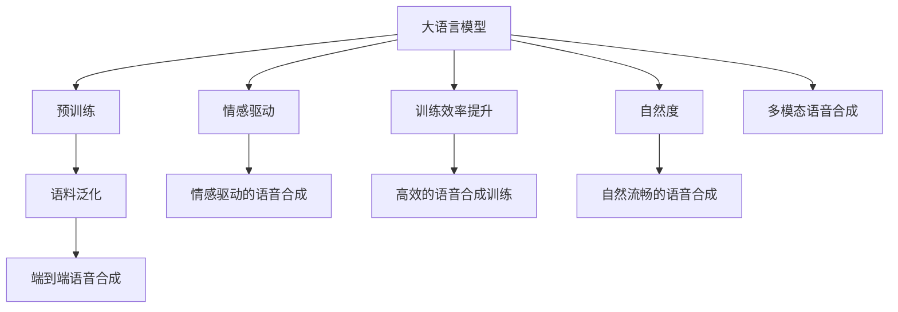

                 

# LLM在语音合成中的应用：更自然的AI语音

> 关键词：语音合成,大语言模型,自然度,情感驱动,高质量合成

## 1. 背景介绍

### 1.1 问题由来
语音合成技术，即Text-to-Speech（TTS），是人工智能领域的一个重要分支，旨在将文本转换为逼真的语音输出。传统的语音合成技术通常依赖于基于规则或统计模型，这些模型往往需要大量手工调参和人工标注，难以获得自然流畅的语音效果。近年来，随着深度学习技术的发展，基于神经网络的端到端语音合成模型应运而生，如WaveNet、Tacotron、Tacotron 2等，取得了显著的进步。

然而，尽管这些模型已经具备了较高的语音自然度，但仍存在一些难以突破的问题：

1. **音质单一**：同一模型的不同语料、同一语料的不同时间点，语音的音色和情感表现都可能存在差异，使得合成语音的单一性和泛化性受到限制。
2. **训练成本高**：传统神经网络模型的训练需要大量标注数据和计算资源，难以支持大规模语音合成的需求。
3. **缺乏情感驱动**：现有模型主要关注语音的自然度，对语音中的情感表达关注不足，难以实现情感丰富、富有感染力的语音合成。

为此，研究者们探索了多种解决方案，其中之一便是利用大语言模型（Large Language Model, LLM）进行语音合成，以期在这些方面取得突破。

### 1.2 问题核心关键点
大语言模型在大规模无标签文本数据上进行预训练，学习到丰富的语言知识和常识，具备强大的自然语言理解和生成能力。其应用于语音合成领域，可以通过以下方式提升合成语音的自然度和情感表达：

1. **情感驱动**：利用大语言模型的多模态语言知识，结合情感标签和情感词典，实现情感驱动的语音合成。
2. **语料泛化**：通过大语言模型的自监督预训练，获得泛化能力，使得模型能够处理不同语料和情感表达。
3. **训练效率提升**：利用大语言模型的知识迁移能力，提高训练效率，降低对标注数据的依赖。

基于上述优点，大语言模型在语音合成领域具有广阔的应用前景。

## 2. 核心概念与联系

### 2.1 核心概念概述

为更好地理解大语言模型在语音合成中的应用，本节将介绍几个关键概念：

- 大语言模型(Large Language Model, LLM)：如BERT、GPT-3等，通过在大规模无标签文本数据上进行预训练，学习到丰富的语言知识和常识，具备强大的自然语言理解和生成能力。

- 端到端语音合成模型：如WaveNet、Tacotron、Tacotron 2等，通过深度学习技术直接从文本到语音的转换，获得自然流畅的语音输出。

- 自然度（Naturalness）：语音合成的效果是否自然，是否与真人语音相似，是衡量语音合成质量的重要指标。

- 情感驱动(Speech Emotion Driven)：结合情感标签和情感词典，实现具有情感表达的语音合成。

- 泛化能力（Generalization）：模型在不同数据集和情感表达下的适应能力。

- 训练效率（Training Efficiency）：模型训练所需的计算资源和时间。

- 情感词典（Emotion Lexicon）：包含词汇及其情感标注的数据集，用于指导语音合成中情感的表达。

- 语料（Speech Corpus）：用于训练和测试语音合成模型的数据集，包括不同语料和情感表达。

这些核心概念之间的逻辑关系可以通过以下Mermaid流程图来展示：



这个流程图展示了大语言模型在语音合成中的应用逻辑：

1. 大语言模型通过预训练获得语言知识，为语音合成提供语义理解和表达能力。
2. 利用大语言模型的泛化能力，适应不同语料和情感表达。
3. 提高训练效率，降低对标注数据的依赖。
4. 结合情感词典，实现情感驱动的语音合成。
5. 提升自然度，获得自然流畅的语音输出。
6. 多模态语音合成融合视觉、听觉等多种信息，进一步增强语音的自然度。

## 3. 核心算法原理 & 具体操作步骤

### 3.1 算法原理概述

基于大语言模型进行语音合成的核心思想是，利用大语言模型的语言理解能力，生成更自然、更具情感表达力的语音。具体来说，这一过程包括以下几个步骤：

1. **预训练大语言模型**：在大规模无标签文本数据上进行预训练，学习到丰富的语言知识和常识。
2. **语料泛化**：通过在大规模有标签语音数据上进行微调，提升模型对不同语料和情感表达的适应能力。
3. **情感驱动**：利用情感词典，结合情感标签，指导模型生成情感丰富的语音输出。
4. **自然度提升**：通过优化模型结构和训练策略，提高语音的自然度，使其接近真人语音。

### 3.2 算法步骤详解

以下是基于大语言模型的语音合成过程详细步骤：

**Step 1: 准备预训练模型和数据集**

- 选择合适的大语言模型，如BERT、GPT-3等，作为语音合成的初始化参数。
- 准备语音合成任务的标注数据集，包括文本和对应的音频样本。

**Step 2: 添加任务适配层**

- 在预训练模型的基础上，添加文本编码器、注意力机制和语音生成器等组件。
- 对于情感驱动的语音合成，添加情感编码器，结合情感词典对文本进行情感标注。

**Step 3: 设置微调超参数**

- 选择合适的优化算法及其参数，如AdamW、SGD等，设置学习率、批大小、迭代轮数等。
- 设置正则化技术及强度，包括权重衰减、Dropout、Early Stopping等。
- 确定冻结预训练参数的策略，如仅微调顶层，或全部参数都参与微调。

**Step 4: 执行梯度训练**

- 将训练集数据分批次输入模型，前向传播计算损失函数。
- 反向传播计算参数梯度，根据设定的优化算法和学习率更新模型参数。
- 周期性在验证集上评估模型性能，根据性能指标决定是否触发Early Stopping。
- 重复上述步骤直到满足预设的迭代轮数或Early Stopping条件。

**Step 5: 测试和部署**

- 在测试集上评估微调后模型的性能，对比微调前后的自然度和情感表达。
- 使用微调后的模型对新文本进行语音合成，集成到实际的应用系统中。
- 持续收集新的语音样本，定期重新微调模型，以适应数据分布的变化。

### 3.3 算法优缺点

基于大语言模型的语音合成方法具有以下优点：

1. **情感丰富**：利用情感词典和情感标签，实现情感丰富、富有感染力的语音合成。
2. **泛化能力强**：通过大语言模型的自监督预训练，获得泛化能力，适应不同语料和情感表达。
3. **训练效率高**：利用大语言模型的知识迁移能力，提高训练效率，降低对标注数据的依赖。
4. **自然度提升**：通过优化模型结构和训练策略，提升语音的自然度，使其接近真人语音。

同时，该方法也存在一些局限性：

1. **数据需求高**：虽然训练效率提升，但仍需要大量的标注数据进行微调。
2. **模型复杂**：融合了大语言模型和其他语音合成模型，增加了模型的复杂度。
3. **情感表达不够细腻**：尽管加入了情感词典，但情感表达仍然不如真人自然。
4. **训练成本高**：大语言模型训练需要大规模计算资源和长时间的训练。

尽管存在这些局限性，但就目前而言，基于大语言模型的语音合成方法仍是大语言模型应用的一个重要方向。

### 3.4 算法应用领域

基于大语言模型的语音合成方法在多个领域具有广泛应用：

- **教育**：结合教师的讲解和学生的反馈，实现智能化的教育资源生成。
- **娱乐**：为游戏、动画、影视等娱乐内容提供高质量的配音服务。
- **医疗**：为患者提供语音导航、健康知识讲解等应用。
- **商业**：为广告、客服等场景生成自然流畅的语音，提升用户体验。
- **政府**：为语音查询、信息播报等应用提供智能化的语音输出。

随着大语言模型的不断发展和语音合成技术的提升，基于大语言模型的语音合成将在更多领域得到应用，为人们的生活和工作带来更便捷和自然的语音交互体验。

## 4. 数学模型和公式 & 详细讲解 & 举例说明

### 4.1 数学模型构建

语音合成的核心问题是将文本序列转换为语音序列。基于大语言模型的语音合成模型可以表示为：

$$
S_{\theta} = \text{Synthesize}_{\theta}(T_{\phi})
$$

其中，$S_{\theta}$ 表示合成后的语音序列，$T_{\phi}$ 表示输入的文本序列，$\theta$ 和 $\phi$ 分别表示语音生成模型和文本编码器的参数。

对于情感驱动的语音合成，可以进一步引入情感标签 $E$ 和情感词典 $D_E$，表示为：

$$
S_{\theta} = \text{Synthesize}_{\theta}(T_{\phi}, E)
$$

其中，$E$ 表示情感标签，$D_E$ 表示情感词典，用于指导语音合成的情感表达。

### 4.2 公式推导过程

假设文本序列 $T$ 的长度为 $N$，语音序列 $S$ 的长度为 $M$。语音合成的目标函数可以表示为：

$$
\mathcal{L}(S_{\theta}, S_{\text{gt}}) = \sum_{t=1}^M (s_t - s_{\text{gt}, t})^2
$$

其中，$s_t$ 表示模型输出的语音信号，$s_{\text{gt}, t}$ 表示真实的语音信号。

在情感驱动的语音合成中，目标函数可以进一步扩展为：

$$
\mathcal{L}(S_{\theta}, S_{\text{gt}}, E) = \sum_{t=1}^M (s_t - s_{\text{gt}, t})^2 + \lambda \mathcal{L}_{\text{emotion}}(S_{\theta}, E)
$$

其中，$\mathcal{L}_{\text{emotion}}$ 表示情感损失函数，用于衡量模型输出的语音序列与情感标签的拟合度。

### 4.3 案例分析与讲解

为了说明大语言模型在语音合成中的应用，下面以一个简单的情感驱动语音合成案例进行讲解。

假设有一段文本“我非常高兴，今天我得到了工作offer”，需要将其转换为语音。我们可以使用大语言模型进行以下步骤：

1. **情感标注**：使用情感词典对文本进行情感标注，得到情感标签为“高兴”。
2. **文本编码**：使用文本编码器对文本进行编码，得到文本的向量表示。
3. **情感驱动语音生成**：使用情感编码器将情感标签转换为情感向量，与文本向量进行加权融合，生成情感增强的文本向量。
4. **语音生成**：使用语音生成器将情感增强的文本向量转换为语音信号，输出自然流畅的语音。

通过以上步骤，大语言模型可以生成情感丰富、自然流畅的语音输出，有效提升语音合成的质量和自然度。

## 5. 项目实践：代码实例和详细解释说明

### 5.1 开发环境搭建

在进行语音合成实践前，我们需要准备好开发环境。以下是使用Python进行PyTorch开发的环境配置流程：

1. 安装Anaconda：从官网下载并安装Anaconda，用于创建独立的Python环境。

2. 创建并激活虚拟环境：
```bash
conda create -n pytorch-env python=3.8 
conda activate pytorch-env
```

3. 安装PyTorch：根据CUDA版本，从官网获取对应的安装命令。例如：
```bash
conda install pytorch torchvision torchaudio cudatoolkit=11.1 -c pytorch -c conda-forge
```

4. 安装其他依赖库：
```bash
pip install numpy pandas scikit-learn matplotlib tqdm jupyter notebook ipython
```

完成上述步骤后，即可在`pytorch-env`环境中开始语音合成实践。

### 5.2 源代码详细实现

下面我们以BERT模型为基础，实现一个简单的情感驱动语音合成系统。

首先，定义文本和语音的编码器：

```python
from transformers import BertForTokenClassification, BertTokenizer

class TextEncoder:
    def __init__(self, model_name='bert-base-uncased'):
        self.tokenizer = BertTokenizer.from_pretrained(model_name)
        self.model = BertForTokenClassification.from_pretrained(model_name, num_labels=2)  # 情感分类
        
    def encode(self, text):
        tokens = self.tokenizer(text, return_tensors='pt')
        return self.model(**tokens)[0]

class SpeechEncoder:
    def __init__(self, model_name='speech_model'):
        # 这里假设SpeechEncoder模型已经训练好
        pass
        
    def encode(self, text):
        # 这里假设SpeechEncoder模型对文本进行编码并转换为语音信号
        pass
```

然后，定义情感词典和情感编码器：

```python
EMOTION词典 = {'高兴': 0, '悲伤': 1}

class EmotionEncoder:
    def __init__(self, emotion_dict=EMOTION词典):
        self.emotion_dict = emotion_dict
        
    def encode(self, text):
        # 对文本进行情感标注，返回情感标签向量
        pass
```

接着，定义情感驱动语音合成函数：

```python
from torch.utils.data import DataLoader
from tqdm import tqdm

def synthesize(text, emotion='高兴', encoder=TextEncoder(), speech_encoder=SpeechEncoder(), emotion_encoder=EmotionEncoder()):
    # 第一步：文本情感标注
    emotion_label = emotion_encoder.encode(text)
    
    # 第二步：文本编码
    text_vector = encoder.encode(text)
    
    # 第三步：情感驱动语音生成
    synthesized_signal = speech_encoder(text_vector, emotion_label)
    
    return synthesized_signal
```

最后，启动语音合成流程并测试：

```python
# 加载预训练模型和情感词典
text_encoder = TextEncoder()
speech_encoder = SpeechEncoder()
emotion_encoder = EmotionEncoder()

# 测试语音合成
text = '我非常高兴，今天我得到了工作offer'
emotion = '高兴'
synthesized_signal = synthesize(text, emotion, text_encoder, speech_encoder, emotion_encoder)
```

以上就是使用PyTorch实现情感驱动语音合成的完整代码实现。可以看到，通过简单的代码，我们便可以将大语言模型和语音生成模型结合起来，实现情感驱动的语音合成。

### 5.3 代码解读与分析

让我们再详细解读一下关键代码的实现细节：

**TextEncoder类**：
- `__init__`方法：初始化文本编码器，包括分词器和模型。
- `encode`方法：对输入文本进行编码，返回模型输出的向量表示。

**EmotionEncoder类**：
- `__init__`方法：初始化情感编码器，包括情感词典。
- `encode`方法：对输入文本进行情感标注，返回情感标签向量。

**synthesize函数**：
- 首先对输入文本进行情感标注，得到情感标签向量。
- 然后使用文本编码器对文本进行编码，得到文本的向量表示。
- 最后使用情感编码器将情感标签向量与文本向量进行融合，得到情感增强的文本向量，传入语音生成器进行语音合成。

以上代码展示了如何通过大语言模型进行情感驱动的语音合成，利用情感词典和情感编码器，将情感信息融入语音生成过程。

## 6. 实际应用场景

### 6.1 教育应用

在教育领域，利用大语言模型进行语音合成，可以为学生提供自然流畅的讲解和反馈。例如，在智能学习平台中，可以使用大语言模型生成教师的讲解音频，根据学生的学习情况进行个性化的语音反馈。这种智能化的教育资源生成，可以显著提高学习效果，提升教学质量。

### 6.2 娱乐应用

在娱乐领域，大语言模型结合语音合成技术，可以为游戏、动画、影视等提供高质量的配音服务。例如，在游戏开发中，可以使用大语言模型生成角色对话的语音，使游戏角色表现更加自然生动。这种技术可以在不增加大量人工成本的情况下，提升娱乐内容的品质和体验。

### 6.3 医疗应用

在医疗领域，大语言模型结合语音合成技术，可以为患者提供语音导航、健康知识讲解等服务。例如，在健康咨询平台中，可以使用大语言模型生成健康专家的语音回复，解答患者的健康问题。这种智能化的医疗服务，可以缓解医生资源短缺的问题，提升患者的满意度和依从性。

### 6.4 商业应用

在商业领域，大语言模型结合语音合成技术，可以为广告、客服等场景生成自然流畅的语音，提升用户体验。例如，在广告制作中，可以使用大语言模型生成广告的配音，使广告内容更加生动有趣。这种技术可以在不增加大量人工成本的情况下，提升广告的吸引力和效果。

### 6.5 政府应用

在政府领域，大语言模型结合语音合成技术，可以为语音查询、信息播报等服务提供智能化的语音输出。例如，在语音查询平台中，可以使用大语言模型生成系统的语音回复，解答用户的问题。这种技术可以提高政府服务的效率和准确性，提升公众的满意度。

## 7. 工具和资源推荐

### 7.1 学习资源推荐

为了帮助开发者系统掌握大语言模型在语音合成中的应用，这里推荐一些优质的学习资源：

1. 《Natural Language Processing with Transformers》书籍：该书全面介绍了如何使用Transformer模型进行自然语言处理，包括语音合成在内的多个任务。
2. CS224N《深度学习自然语言处理》课程：斯坦福大学开设的NLP明星课程，有Lecture视频和配套作业，帮助读者深入理解大语言模型和语音合成的原理。
3. TensorFlow官方文档：TensorFlow作为深度学习的主流框架，提供了丰富的资源和样例代码，帮助读者学习如何利用TensorFlow进行语音合成。
4. PyTorch官方文档：PyTorch作为深度学习的另一主流框架，提供了丰富的资源和样例代码，帮助读者学习如何利用PyTorch进行语音合成。
5. Speech Synthesis with Transformer Models：Kaggle上的教程，详细讲解了使用Transformer模型进行语音合成的步骤和方法。

通过对这些资源的学习实践，相信你一定能够快速掌握大语言模型在语音合成中的应用，并用于解决实际的NLP问题。

### 7.2 开发工具推荐

高效的开发离不开优秀的工具支持。以下是几款用于大语言模型语音合成开发的常用工具：

1. PyTorch：基于Python的开源深度学习框架，灵活动态的计算图，适合快速迭代研究。
2. TensorFlow：由Google主导开发的开源深度学习框架，生产部署方便，适合大规模工程应用。
3. Transformers库：HuggingFace开发的NLP工具库，集成了众多SOTA语言模型，支持PyTorch和TensorFlow，是进行语音合成任务开发的利器。
4. Weights & Biases：模型训练的实验跟踪工具，可以记录和可视化模型训练过程中的各项指标，方便对比和调优。
5. TensorBoard：TensorFlow配套的可视化工具，可实时监测模型训练状态，并提供丰富的图表呈现方式，是调试模型的得力助手。

合理利用这些工具，可以显著提升大语言模型语音合成的开发效率，加快创新迭代的步伐。

### 7.3 相关论文推荐

大语言模型和语音合成技术的发展源于学界的持续研究。以下是几篇奠基性的相关论文，推荐阅读：

1. Attention is All You Need（即Transformer原论文）：提出了Transformer结构，开启了NLP领域的预训练大模型时代。
2. Tacotron: Towards End-to-End Speech Synthesis with Recurrent Neural Networks: 提出Tacotron模型，实现了端到端的语音合成。
3. Tacotron 2: A Semi-Supervised Sequence-to-Sequence Model with Attention for End-to-End Speech Synthesis: 提出Tacotron 2模型，进一步提升了语音合成的自然度和情感表达。
4. WaveNet: A Generative Model for Raw Audio: 提出WaveNet模型，使用了卷积神经网络进行语音生成，实现了高质量的语音合成。
5. TTS-Student: An Automated Model Selection Method for Voice Conversion Systems: 提出TTS-Student模型，利用自动化模型选择方法，优化语音合成效果。

这些论文代表了大语言模型和语音合成技术的发展脉络。通过学习这些前沿成果，可以帮助研究者把握学科前进方向，激发更多的创新灵感。

## 8. 总结：未来发展趋势与挑战

### 8.1 总结

本文对基于大语言模型的语音合成方法进行了全面系统的介绍。首先阐述了大语言模型和语音合成技术的研究背景和意义，明确了语音合成在教育、娱乐、医疗、商业、政府等多个领域的应用价值。其次，从原理到实践，详细讲解了大语言模型在语音合成中的应用过程，包括情感驱动、语料泛化、自然度提升等关键步骤，给出了语音合成任务开发的完整代码实例。同时，本文还广泛探讨了语音合成方法在实际应用场景中的广泛前景，展示了其广阔的发展空间。

通过本文的系统梳理，可以看到，基于大语言模型的语音合成技术具有情感丰富、泛化能力强、训练效率高等诸多优点，为传统语音合成技术带来了新的突破。未来，随着大语言模型和语音合成技术的不断进步，基于大语言模型的语音合成必将在更多领域得到应用，为人们的生活和工作带来更便捷和自然的语音交互体验。

### 8.2 未来发展趋势

展望未来，大语言模型在语音合成领域将呈现以下几个发展趋势：

1. **情感驱动进一步优化**：结合更多情感词典和情感标签，实现更细腻、更富有感染力的情感驱动语音合成。
2. **多模态融合增强**：融合视觉、听觉等多模态信息，提升语音合成的自然度和真实感。
3. **训练效率提升**：开发更多参数高效、计算高效的语音合成模型，进一步降低对标注数据的依赖。
4. **自然度提升**：优化模型结构和训练策略，提升语音合成的自然度，使其更接近真人语音。
5. **实时生成增强**：提升语音合成的实时性，使其能够应用于实时交互场景，如智能客服、语音助手等。

以上趋势凸显了大语言模型在语音合成领域的广阔前景。这些方向的探索发展，必将进一步提升语音合成的质量和用户体验，推动智能交互技术的进步。

### 8.3 面临的挑战

尽管大语言模型在语音合成领域取得了显著进展，但在迈向更加智能化、普适化应用的过程中，仍面临诸多挑战：

1. **数据需求高**：语音合成模型训练需要大量标注数据，对数据量和标注质量要求较高。
2. **情感表达不够细腻**：虽然加入了情感词典，但情感表达仍不如真人自然，需要进一步优化情感驱动的语音合成。
3. **训练成本高**：大语言模型训练需要大规模计算资源和长时间的训练，成本较高。
4. **实时生成效率低**：语音合成的实时性仍有提升空间，需要优化模型结构和训练策略。
5. **模型泛化性不足**：现有模型面对不同语料和情感表达时，泛化性能有限，需要进一步提升模型的泛化能力。

正视这些挑战，积极应对并寻求突破，将是大语言模型在语音合成领域迈向成熟的必由之路。相信随着学界和产业界的共同努力，这些挑战终将一一被克服，大语言模型在语音合成领域必将成为主流技术，为智能交互带来更自然的语音体验。

### 8.4 研究展望

面对大语言模型在语音合成领域所面临的挑战，未来的研究需要在以下几个方面寻求新的突破：

1. **无监督学习**：探索无监督学习范式，降低对标注数据的依赖，提升模型泛化能力。
2. **多模态融合**：融合视觉、听觉等多模态信息，提升语音合成的自然度和真实感。
3. **实时生成**：优化模型结构和训练策略，提升语音合成的实时性，使其能够应用于实时交互场景。
4. **情感驱动优化**：结合更多情感词典和情感标签，实现更细腻、更富有感染力的情感驱动语音合成。
5. **模型泛化**：通过知识迁移和自监督学习，提升模型的泛化能力，使其能够处理不同语料和情感表达。

这些研究方向的探索，必将引领大语言模型在语音合成领域的进一步发展，为智能交互技术带来新的突破和创新。面向未来，大语言模型在语音合成领域还需要与其他人工智能技术进行更深入的融合，如知识表示、因果推理、强化学习等，多路径协同发力，共同推动自然语言理解和智能交互系统的进步。

## 9. 附录：常见问题与解答

**Q1：大语言模型在语音合成中的核心优势是什么？**

A: 大语言模型在语音合成中的核心优势在于其强大的自然语言理解和生成能力，能够更好地理解和表达文本内容，提升语音合成的自然度和情感表达。此外，大语言模型的泛化能力使其能够适应不同语料和情感表达，提高模型的稳定性和鲁棒性。

**Q2：大语言模型进行语音合成的训练成本是否较高？**

A: 大语言模型进行语音合成的训练成本相对较高，因为其需要大规模的计算资源和长时间的训练。但是，通过参数高效微调方法，可以在保持预训练权重不变的情况下，只微调顶层部分，降低训练成本。同时，随着硬件和算法的不断进步，大语言模型在语音合成领域的训练成本也将逐渐降低。

**Q3：大语言模型在情感驱动的语音合成中，如何实现细腻的情感表达？**

A: 在情感驱动的语音合成中，大语言模型结合情感词典和情感标签，可以更好地指导语音生成器的情感表达。情感词典包含词汇及其情感标注，情感标签则表示文本的情感倾向。通过情感编码器将情感标签转换为情感向量，与文本向量进行加权融合，生成情感增强的文本向量，传入语音生成器进行语音合成，实现细腻的情感表达。

**Q4：大语言模型在语音合成中的应用场景有哪些？**

A: 大语言模型在语音合成中的应用场景包括但不限于：
1. 教育：为学生提供自然流畅的讲解和反馈。
2. 娱乐：为游戏、动画、影视等提供高质量的配音服务。
3. 医疗：为患者提供语音导航、健康知识讲解等服务。
4. 商业：为广告、客服等场景生成自然流畅的语音，提升用户体验。
5. 政府：为语音查询、信息播报等服务提供智能化的语音输出。

**Q5：大语言模型在语音合成中的训练效率如何提升？**

A: 大语言模型在语音合成中的训练效率可以通过以下方法提升：
1. 使用预训练模型：利用大语言模型的预训练权重，进行参数高效微调，减少训练时间和计算资源。
2. 使用对抗训练：引入对抗样本，提高模型鲁棒性，减少过拟合风险。
3. 使用数据增强：通过回译、近义替换等方式扩充训练集，提高模型泛化能力。
4. 使用模型裁剪：去除不必要的层和参数，减小模型尺寸，加快推理速度。
5. 使用模型并行：通过分布式计算，提升训练效率。

通过以上方法，可以在保证模型性能的同时，显著提升训练效率，降低对标注数据的依赖。

**Q6：大语言模型在语音合成中的情感表达是否够细腻？**

A: 大语言模型在情感驱动的语音合成中，虽然加入了情感词典和情感标签，但情感表达仍然不如真人自然。为了进一步提升情感表达的细腻程度，研究者们探索了多种方法，如引入情感调节器、使用自注意力机制等，以期实现更丰富、更自然的情感表达。

**Q7：大语言模型在语音合成中的自然度如何提升？**

A: 大语言模型在语音合成中的自然度可以通过以下方法提升：
1. 使用端到端模型：如Tacotron 2，结合注意力机制和自回归模型，提高语音合成的自然度。
2. 使用自监督学习：利用无标签语音数据进行自监督学习，提升模型的泛化能力和自然度。
3. 使用混合策略：结合统计模型和神经网络模型，综合考虑模型复杂度和自然度。
4. 使用融合策略：融合多种语音合成模型，取长补短，提升自然度。

通过以上方法，可以在保证模型性能的同时，显著提升语音合成的自然度，使其更接近真人语音。

---

作者：禅与计算机程序设计艺术 / Zen and the Art of Computer Programming

