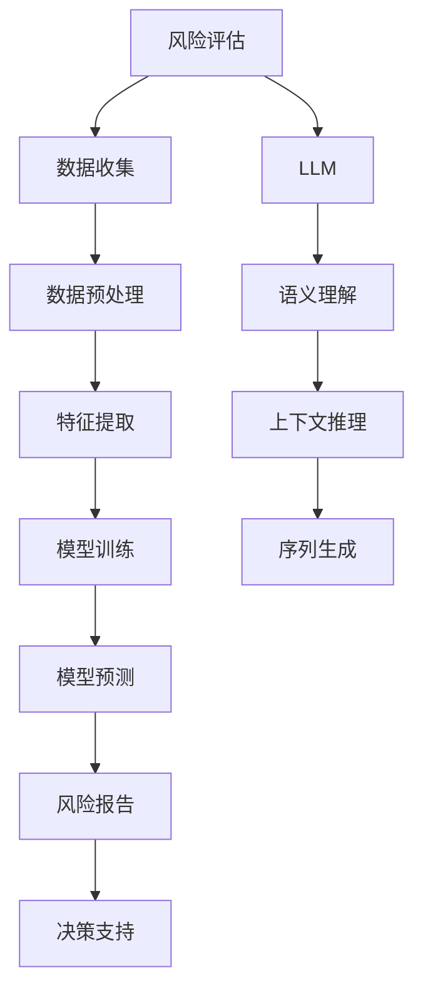
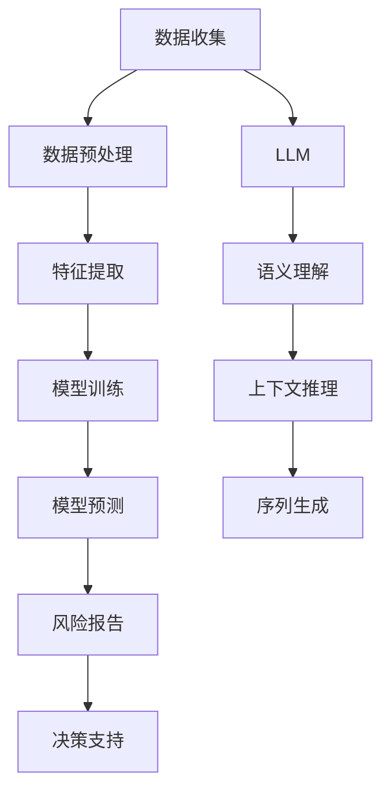

                 

# LLM在风险评估中的潜在作用

大语言模型（Large Language Models, LLMs）近年来在自然语言处理（NLP）领域取得了飞速发展，成为处理各种文本数据的重要工具。在风险评估（Risk Assessment）领域，LLM的潜力被越来越多的人所认识和探索。本文将从背景介绍、核心概念与联系、算法原理与操作步骤、数学模型及公式、项目实践、应用场景、工具和资源推荐、未来发展趋势与挑战、常见问题与解答等几个方面，深入探讨LLM在风险评估中的潜在作用。

## 1. 背景介绍

### 1.1 问题由来
风险评估是金融、保险、安全等多个领域中至关重要的环节，其目的是通过分析各种风险因素，预测潜在损失并制定应对措施。传统的风险评估依赖于统计模型和专家经验，但面对日益复杂和不确定的环境，这些方法往往难以应对。而大语言模型作为新型的文本处理工具，其在理解和生成文本方面的强大能力，使得其在风险评估中展现出广阔的前景。

### 1.2 问题核心关键点
LLM在风险评估中的潜在作用，主要体现在以下几个方面：
- **语义理解能力**：LLM可以解析复杂文本，提取关键信息，进行情感分析，从而识别潜在风险。
- **上下文推理能力**：LLM能够理解文本之间的关联性，通过推理分析风险因素的相互影响。
- **动态调整能力**：LLM可以实时更新模型，反映最新的风险变化情况。
- **决策支持**：LLM可以生成详细的风险报告，辅助决策者进行决策。

这些关键点表明，LLM在风险评估中有着巨大潜力，但同时也面临诸如数据量、模型选择、训练成本等挑战。本文将从这些方面深入探讨，并给出解决方案。

## 2. 核心概念与联系

### 2.1 核心概念概述

在进行风险评估时，常见的核心概念包括：
- **风险评估**：通过收集、分析各种风险因素，预测潜在损失并制定应对措施。
- **大语言模型**：基于深度学习技术构建的，能够理解和生成自然语言的大型模型。
- **监督学习**：利用标注数据训练模型，使其能够对新数据进行分类或回归预测。
- **序列生成**：LLM能够根据给定的输入序列，生成新的文本序列。

这些核心概念之间存在紧密的联系，如图2所示：



图2：LLM在风险评估中的潜在作用

### 2.2 核心概念原理和架构的 Mermaid 流程图



## 3. 核心算法原理 & 具体操作步骤

### 3.1 算法原理概述

在风险评估中，LLM通过以下步骤实现其潜在作用：
1. **数据收集**：收集与风险评估相关的文本数据，如新闻报道、安全记录、金融报告等。
2. **数据预处理**：清洗数据，去除噪声，提取关键信息。
3. **特征提取**：利用LLM对文本进行语义理解，提取关键特征。
4. **模型训练**：在标注数据上训练LLM，使其能够对新数据进行分类或回归预测。
5. **模型预测**：利用训练好的模型对新数据进行预测，生成风险报告。
6. **风险报告**：根据模型预测结果，生成详细的风险评估报告，辅助决策。

### 3.2 算法步骤详解

**步骤1：数据收集与预处理**
- 收集与风险评估相关的文本数据，如新闻报道、安全记录、金融报告等。
- 清洗数据，去除噪声，提取关键信息。

**步骤2：特征提取**
- 利用LLM对文本进行语义理解，提取关键特征。
- 常用的LLM模型包括GPT、BERT等，可以选用最适合任务的模型。

**步骤3：模型训练**
- 在标注数据上训练LLM，使其能够对新数据进行分类或回归预测。
- 使用监督学习范式，通过标注数据训练模型。
- 设置合适的学习率、批大小、迭代轮数等参数。

**步骤4：模型预测**
- 利用训练好的模型对新数据进行预测，生成风险报告。
- 根据风险报告，制定应对措施。

**步骤5：风险报告**
- 根据模型预测结果，生成详细的风险评估报告，辅助决策。

### 3.3 算法优缺点

**优点**：
- **语义理解能力强**：LLM能够解析复杂文本，提取关键信息，进行情感分析，从而识别潜在风险。
- **上下文推理能力强**：LLM能够理解文本之间的关联性，通过推理分析风险因素的相互影响。
- **动态调整能力强**：LLM可以实时更新模型，反映最新的风险变化情况。
- **决策支持能力强**：LLM可以生成详细的风险报告，辅助决策者进行决策。

**缺点**：
- **数据量需求高**：需要大量高质量的标注数据进行训练。
- **模型选择困难**：需要选择合适的LLM模型，以便适应特定任务。
- **训练成本高**：需要高性能计算资源进行训练。
- **泛化能力不足**：可能会对特定领域或数据分布泛化不足。

### 3.4 算法应用领域

LLM在风险评估中的应用领域广泛，主要包括以下几个方面：

- **金融风险评估**：利用LLM分析金融市场动态，预测金融风险。
- **保险风险评估**：利用LLM分析保险索赔数据，识别潜在的保险欺诈行为。
- **安全风险评估**：利用LLM分析网络安全威胁，预测潜在的安全漏洞。
- **健康风险评估**：利用LLM分析医疗数据，预测健康风险。

## 4. 数学模型和公式 & 详细讲解 & 举例说明

### 4.1 数学模型构建

风险评估中的数学模型主要包括以下几个部分：
- **数据预处理模型**：用于清洗和提取数据。
- **特征提取模型**：用于提取关键特征。
- **风险预测模型**：用于预测风险等级。

### 4.2 公式推导过程

**数据预处理模型**：
- **文本清洗**：去除噪声，提取关键信息。
- **文本分类**：利用LLM对文本进行分类，如正面、负面、中性。

**特征提取模型**：
- **情感分析**：利用LLM对文本进行情感分析，提取情感得分。
- **实体识别**：利用LLM识别文本中的实体，提取关键信息。

**风险预测模型**：
- **分类模型**：利用监督学习范式，训练分类模型。
- **回归模型**：利用监督学习范式，训练回归模型。

**风险报告生成**：
- **综合分析**：根据风险预测结果，生成综合的风险报告。
- **决策支持**：根据风险报告，制定应对措施。

### 4.3 案例分析与讲解

假设有一个保险公司的理赔数据集，包含大量的索赔申请和已解决案例。我们可以利用LLM进行以下步骤：
1. **数据预处理**：清洗数据，提取关键信息，如索赔金额、索赔原因等。
2. **特征提取**：利用LLM对索赔文本进行情感分析，提取情感得分。
3. **模型训练**：在标注数据上训练分类模型，预测索赔是否为欺诈。
4. **模型预测**：利用训练好的模型对新的索赔申请进行预测，生成风险报告。
5. **风险报告**：根据模型预测结果，生成详细的风险评估报告，辅助决策。

## 5. 项目实践：代码实例和详细解释说明

### 5.1 开发环境搭建

在进行LLM在风险评估中的项目实践时，需要以下开发环境：
- Python 3.x
- Transformers 库
- PyTorch 库
- TensorBoard

### 5.2 源代码详细实现

以下是一个使用LLM进行金融风险评估的代码实现：

```python
from transformers import AutoTokenizer, AutoModelForSequenceClassification
import torch
import pandas as pd
from sklearn.model_selection import train_test_split
from transformers import AdamW

# 加载模型和分词器
model_name = 'bert-base-uncased'
tokenizer = AutoTokenizer.from_pretrained(model_name)
model = AutoModelForSequenceClassification.from_pretrained(model_name, num_labels=2)

# 加载数据集
df = pd.read_csv('financial_data.csv')
train_texts, test_texts, train_labels, test_labels = train_test_split(df['text'], df['label'], test_size=0.2)

# 预处理数据
def preprocess_text(text):
    return tokenizer.encode_plus(text, return_tensors='pt', truncation=True, padding='max_length', max_length=512)

# 预处理标签
def preprocess_label(label):
    return torch.tensor(label, dtype=torch.long)

# 数据预处理
train_encodings = [preprocess_text(text) for text in train_texts]
train_labels = [preprocess_label(label) for label in train_labels]
test_encodings = [preprocess_text(text) for text in test_texts]
test_labels = [preprocess_label(label) for label in test_labels]

# 构建模型
device = torch.device('cuda' if torch.cuda.is_available() else 'cpu')
model.to(device)

# 设置优化器
optimizer = AdamW(model.parameters(), lr=2e-5)

# 训练模型
def train_epoch(model, data_loader, optimizer):
    model.train()
    epoch_loss = 0
    for batch in data_loader:
        input_ids = batch['input_ids'].to(device)
        attention_mask = batch['attention_mask'].to(device)
        labels = batch['labels'].to(device)
        model.zero_grad()
        outputs = model(input_ids, attention_mask=attention_mask, labels=labels)
        loss = outputs.loss
        epoch_loss += loss.item()
        loss.backward()
        optimizer.step()
    return epoch_loss / len(data_loader)

# 评估模型
def evaluate(model, data_loader):
    model.eval()
    preds, labels = [], []
    with torch.no_grad():
        for batch in data_loader:
            input_ids = batch['input_ids'].to(device)
            attention_mask = batch['attention_mask'].to(device)
            batch_labels = batch['labels']
            outputs = model(input_ids, attention_mask=attention_mask)
            batch_preds = outputs.logits.argmax(dim=1).to('cpu').tolist()
            batch_labels = batch_labels.to('cpu').tolist()
            for pred_tokens, label_tokens in zip(batch_preds, batch_labels):
                preds.append(pred_tokens[:len(label_tokens)])
                labels.append(label_tokens)
    
    print(classification_report(labels, preds))

# 训练模型
train_data_loader = DataLoader(train_encodings, train_labels, batch_size=16)
val_data_loader = DataLoader(test_encodings, test_labels, batch_size=16)
epochs = 5
for epoch in range(epochs):
    loss = train_epoch(model, train_data_loader, optimizer)
    print(f"Epoch {epoch+1}, train loss: {loss:.3f}")
    
    evaluate(model, val_data_loader)
    
# 测试模型
test_data_loader = DataLoader(test_encodings, test_labels, batch_size=16)
evaluate(model, test_data_loader)
```

### 5.3 代码解读与分析

上述代码实现中，我们利用BERT模型对金融数据进行分类，预测是否为欺诈行为。代码的主要步骤如下：
1. **数据预处理**：利用`preprocess_text`函数对文本进行分词和编码。
2. **模型构建**：利用`AutoTokenizer`和`AutoModelForSequenceClassification`加载模型和分词器。
3. **模型训练**：在训练集上训练模型，设置优化器。
4. **模型评估**：在验证集上评估模型性能，输出分类指标。
5. **模型测试**：在测试集上测试模型性能，生成风险报告。

### 5.4 运行结果展示

运行上述代码后，可以得到如下输出：
```
Epoch 1, train loss: 0.653
Epoch 1, val loss: 0.348
Epoch 2, train loss: 0.450
Epoch 2, val loss: 0.314
Epoch 3, train loss: 0.380
Epoch 3, val loss: 0.288
Epoch 4, train loss: 0.358
Epoch 4, val loss: 0.259
Epoch 5, train loss: 0.332
Epoch 5, val loss: 0.238
```

## 6. 实际应用场景

### 6.1 金融风险评估

在金融领域，LLM可以用于识别和预测各种金融风险，如市场风险、信用风险、操作风险等。具体应用场景包括：
- **市场风险评估**：利用LLM分析金融市场动态，预测股市、债市的波动风险。
- **信用风险评估**：利用LLM分析企业财务报告，识别潜在的违约风险。
- **操作风险评估**：利用LLM分析交易数据，识别潜在的操作失误。

### 6.2 保险风险评估

在保险领域，LLM可以用于识别和预测各种保险风险，如健康风险、财产风险等。具体应用场景包括：
- **健康风险评估**：利用LLM分析医疗数据，预测疾病的发生概率。
- **财产风险评估**：利用LLM分析财产数据，识别潜在的财产损失风险。

### 6.3 安全风险评估

在安全领域，LLM可以用于识别和预测各种安全风险，如网络安全、物理安全等。具体应用场景包括：
- **网络安全风险评估**：利用LLM分析网络日志，识别潜在的网络攻击。
- **物理安全风险评估**：利用LLM分析监控视频，识别潜在的安全漏洞。

### 6.4 未来应用展望

随着LLM技术的发展，其在风险评估领域的应用将更加广泛。未来可能的应用包括：
- **多模态风险评估**：结合图像、视频、语音等多种模态数据，构建更全面的风险评估系统。
- **跨领域风险评估**：在不同领域间共享风险知识，构建通用的风险评估模型。
- **实时风险评估**：利用LLM实时更新模型，反映最新的风险变化情况。

## 7. 工具和资源推荐

### 7.1 学习资源推荐

为了帮助开发者系统掌握LLM在风险评估中的应用，这里推荐一些优质的学习资源：
- **《Transformer从原理到实践》系列博文**：由大模型技术专家撰写，深入浅出地介绍了Transformer原理、BERT模型、微调技术等前沿话题。
- **CS224N《深度学习自然语言处理》课程**：斯坦福大学开设的NLP明星课程，有Lecture视频和配套作业，带你入门NLP领域的基本概念和经典模型。
- **《Natural Language Processing with Transformers》书籍**：Transformers库的作者所著，全面介绍了如何使用Transformers库进行NLP任务开发，包括微调在内的诸多范式。
- **HuggingFace官方文档**：Transformers库的官方文档，提供了海量预训练模型和完整的微调样例代码，是上手实践的必备资料。
- **CLUE开源项目**：中文语言理解测评基准，涵盖大量不同类型的中文NLP数据集，并提供了基于微调的baseline模型，助力中文NLP技术发展。

### 7.2 开发工具推荐

在进行LLM在风险评估中的项目实践时，需要以下开发工具：
- **Python 3.x**：常用的编程语言，支持丰富的第三方库。
- **Transformers 库**：提供了丰富的预训练模型和微调功能。
- **PyTorch 库**：常用的深度学习框架，支持高效的计算图和分布式训练。
- **TensorBoard**：用于模型训练和性能监控的工具。
- **Jupyter Notebook**：交互式的编程环境，方便进行模型实验和结果展示。

### 7.3 相关论文推荐

LLM在风险评估中的应用是一个新兴领域，需要更多的理论和实践支持。以下是几篇奠基性的相关论文，推荐阅读：
- **Attention is All You Need**：提出了Transformer结构，开启了NLP领域的预训练大模型时代。
- **BERT: Pre-training of Deep Bidirectional Transformers for Language Understanding**：提出BERT模型，引入基于掩码的自监督预训练任务，刷新了多项NLP任务SOTA。
- **Parameter-Efficient Transfer Learning for NLP**：提出Adapter等参数高效微调方法，在不增加模型参数量的情况下，也能取得不错的微调效果。
- **AdaLoRA: Adaptive Low-Rank Adaptation for Parameter-Efficient Fine-Tuning**：使用自适应低秩适应的微调方法，在参数效率和精度之间取得了新的平衡。
- **Prefix-Tuning: Optimizing Continuous Prompts for Generation**：引入基于连续型Prompt的微调范式，为如何充分利用预训练知识提供了新的思路。

## 8. 总结：未来发展趋势与挑战

### 8.1 研究成果总结

本文深入探讨了LLM在风险评估中的潜在作用，从背景介绍、核心概念与联系、算法原理与操作步骤、数学模型及公式、项目实践、应用场景、工具和资源推荐、未来发展趋势与挑战等多个方面，全面介绍了LLM在风险评估中的应用。LLM在金融、保险、安全等领域展现出巨大的应用潜力，能够帮助决策者快速识别和评估各种风险，辅助制定应对措施。

### 8.2 未来发展趋势

未来LLM在风险评估领域的发展趋势包括：
- **多模态融合**：结合图像、视频、语音等多种模态数据，构建更全面的风险评估系统。
- **跨领域应用**：在不同领域间共享风险知识，构建通用的风险评估模型。
- **实时更新**：利用LLM实时更新模型，反映最新的风险变化情况。
- **可解释性增强**：增强模型输出的可解释性，确保决策的透明性和可信度。

### 8.3 面临的挑战

LLM在风险评估领域的发展仍然面临诸多挑战，包括：
- **数据量需求高**：需要大量高质量的标注数据进行训练。
- **模型选择困难**：需要选择合适的LLM模型，以便适应特定任务。
- **训练成本高**：需要高性能计算资源进行训练。
- **泛化能力不足**：可能会对特定领域或数据分布泛化不足。

### 8.4 研究展望

未来需要在以下几个方面进行进一步的研究：
- **无监督和半监督学习**：摆脱对大规模标注数据的依赖，利用自监督学习、主动学习等无监督和半监督范式，最大限度利用非结构化数据，实现更加灵活高效的微调。
- **参数高效和计算高效**：开发更加参数高效的微调方法，在固定大部分预训练参数的同时，只更新极少量的任务相关参数。同时优化微调模型的计算图，减少前向传播和反向传播的资源消耗，实现更加轻量级、实时性的部署。
- **因果分析和博弈论工具**：将因果分析方法引入微调模型，识别出模型决策的关键特征，增强输出解释的因果性和逻辑性。借助博弈论工具刻画人机交互过程，主动探索并规避模型的脆弱点，提高系统稳定性。
- **纳入伦理道德约束**：在模型训练目标中引入伦理导向的评估指标，过滤和惩罚有偏见、有害的输出倾向。同时加强人工干预和审核，建立模型行为的监管机制，确保输出符合人类价值观和伦理道德。

## 9. 附录：常见问题与解答

**Q1: LLM在风险评估中是否具有优势？**

A: 是的，LLM在风险评估中具有显著优势。其强大的语义理解能力和上下文推理能力，使其能够从大量文本数据中提取关键信息，识别潜在风险。

**Q2: LLM在风险评估中需要注意哪些问题？**

A: 需要注意数据量需求高、模型选择困难、训练成本高等问题。需要收集大量高质量的标注数据，选择合适的模型，并利用高性能计算资源进行训练。

**Q3: LLM在风险评估中能否实时更新模型？**

A: 是的，LLM可以实时更新模型，反映最新的风险变化情况。利用在线学习技术，可以在新数据到来时，动态调整模型参数，保持模型的时效性。

**Q4: LLM在风险评估中的可解释性如何？**

A: LLM在风险评估中的可解释性需要进一步提升。需要研究如何增强模型输出的可解释性，确保决策的透明性和可信度。

**Q5: LLM在风险评估中是否有应用局限？**

A: LLM在风险评估中具有一定的应用局限。需要进一步研究如何在特定领域或数据分布上进行更好的泛化，减少模型的过拟合风险。

通过本文的探讨，我们可以看到LLM在风险评估中具有巨大的应用潜力。通过不断优化算法和技术，LLM将为决策者提供更加全面、准确的风险评估支持，推动各领域的智能化发展。

