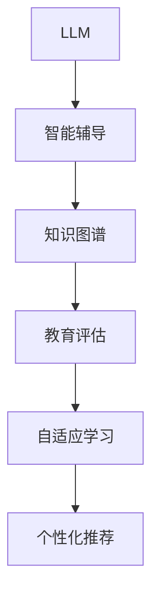

                 

# LLM对传统教学方法的革新与补充

> 关键词：
  - 语言学习
  - 人工智能
  - 智能辅导
  - 自适应学习
  - 知识图谱
  - 教育评估
  - 学习路径优化

## 1. 背景介绍

### 1.1 问题由来

随着人工智能（AI）技术的飞速发展，大语言模型（LLM）以其强大的自然语言处理能力，逐步展现出在教育领域巨大潜力。传统教学方法往往以教师为中心，对学生个性化需求的关注不足。而基于大语言模型的教育技术则能通过智能辅导、个性化推荐等手段，有效提升教学效果。

### 1.2 问题核心关键点

大语言模型在教育中的应用主要体现在以下几个方面：

- **智能辅导**：利用LLM对学生问题进行即时回答，解答学习中遇到的疑惑，提供针对性的学习建议。
- **个性化推荐**：根据学生的学习进度和兴趣，推送适合的课程、习题和资料。
- **自适应学习**：根据学生在不同学习阶段的反馈，调整教学策略和课程难度。
- **教育评估**：利用LLM自动评估学生作业和考试，提供详细的分析报告，指导后续学习。
- **学习路径优化**：通过LLM建立知识图谱，分析学习者知识结构，优化学习路径，提升学习效率。

大语言模型在这些应用场景中的表现，证明了其在教育领域广阔的前景。本文将从理论到实践，深入剖析大语言模型在教育中的应用，探讨其对传统教学方法的革新与补充。

### 1.3 问题研究意义

大语言模型对传统教学方法的革新，在于它突破了传统教育的瓶颈，提供了一种更高效、更个性化的教学模式。其研究意义体现在：

- **提升教学效果**：通过智能辅导和个性化推荐，帮助学生更好地理解和掌握知识，提高学习效率。
- **拓宽教学资源**：LLM能够提供广泛的知识库，辅助教师拓展教学内容和形式。
- **增强教育公平**：在资源匮乏的地区，通过智能教学系统，提供优质教育资源，缩小城乡教育差距。
- **促进终身学习**：LLM具备终身学习的特性，支持不同年龄段、不同知识背景的学习者。
- **优化教学策略**：通过学习者行为数据的分析，优化教学策略，提升教学质量。

## 2. 核心概念与联系

### 2.1 核心概念概述

为了更好地理解大语言模型在教育中的作用，我们先回顾一些关键概念：

- **大语言模型（LLM）**：以Transformer、GPT-3等为代表的预训练语言模型，通过大规模无标签数据训练，具备强大的语言理解和生成能力。
- **智能辅导**：利用自然语言处理技术，通过对话系统对学生进行实时辅导，解决学习中遇到的疑难问题。
- **自适应学习**：根据学习者的反馈，动态调整学习内容和难度，满足个性化学习需求。
- **教育评估**：利用自然语言处理和知识图谱技术，自动评估学习成果，提供数据驱动的反馈和改进建议。
- **知识图谱**：通过图结构存储和关联知识，支持知识点的层级关系和语义联系，提供更加系统和完整的知识体系。

这些概念之间存在密切的联系，构成了一个基于大语言模型的教育技术生态系统。

### 2.2 核心概念原理和架构的 Mermaid 流程图



这个流程图展示了大语言模型在教育应用中的关键组件及其相互作用。

- **LLM** 作为核心组件，提供强大的自然语言处理能力。
- **智能辅导** 利用对话系统和LLM，实时解答学生的疑问，提供即时反馈。
- **知识图谱** 通过结构化知识存储，支持知识点间的关联和推理，辅助教学设计。
- **教育评估** 基于LLM和知识图谱，自动分析学习成果，提供个性化反馈。
- **自适应学习** 通过学生行为数据和知识图谱，动态调整教学策略，提升学习效率。
- **个性化推荐** 根据学生特点，推荐适合的课程和资源，丰富学习资源。

## 3. 核心算法原理 & 具体操作步骤
### 3.1 算法原理概述

基于大语言模型的教育技术，其核心算法原理在于：通过将自然语言处理和机器学习的技术融合，构建智能辅导系统、知识图谱和教育评估平台，实现对传统教学方法的革新与补充。

大语言模型在教育中主要应用以下几个算法：

- **知识图谱构建与推理**：利用语言模型将知识结构化，支持逻辑推理和关系查询。
- **教育评估算法**：通过自然语言处理技术，自动评估学习者的作业和考试，提供反馈和改进建议。
- **自适应学习算法**：根据学习者的反馈和行为数据，动态调整课程内容和难度。
- **个性化推荐算法**：通过分析学生特点，推荐适合的课程和资源，支持个性化学习。

### 3.2 算法步骤详解

以下是基于大语言模型的教育技术的主要操作步骤：

**Step 1: 数据准备与预处理**

- 收集教学数据，包括课程内容、习题、学生反馈等，进行清洗和预处理，确保数据质量。
- 构建知识图谱，将知识节点和关系结构化，便于机器学习模型使用。

**Step 2: 模型选择与训练**

- 选择合适的语言模型，如BERT、GPT等，作为教育技术的基础组件。
- 在大规模语料库上进行预训练，获得语言表示能力。
- 根据具体教育任务，对预训练模型进行微调，适应特定应用场景。

**Step 3: 知识图谱构建**

- 将教学内容转换为知识图谱形式，存储知识节点和关系。
- 利用自然语言处理技术，自动抽取和标注知识图谱，支持逻辑推理和关系查询。

**Step 4: 智能辅导与教育评估**

- 开发对话系统，利用自然语言处理技术，实现与学生的即时互动。
- 根据学生提问，调用知识图谱进行推理，生成回答。
- 通过分析学生作业和考试，自动评估学习成果，提供个性化反馈。

**Step 5: 自适应学习与个性化推荐**

- 利用学习者的行为数据和知识图谱，动态调整课程内容和难度。
- 根据学生特点，推荐适合的课程和资源，支持个性化学习。

### 3.3 算法优缺点

大语言模型在教育中的应用，其优点和缺点如下：

**优点**

- **高效性**：大语言模型能够快速处理和理解自然语言，实现即时互动和个性化推荐。
- **自适应性**：通过分析学生反馈和行为数据，动态调整教学策略，满足个性化需求。
- **丰富性**：通过知识图谱构建，提供丰富的知识结构和关联，支持更深入的学习。
- **便捷性**：无需教师手动输入和修改，自动生成学习资源和评估报告，减轻教师负担。

**缺点**

- **数据依赖**：教育数据的收集和处理需要大量时间和成本，数据质量直接影响系统性能。
- **知识图谱构建复杂**：知识图谱的构建和维护需要专业知识，难以快速构建和更新。
- **效果评估困难**：自动评估系统的准确性和公正性需要进一步验证，可能存在误差。
- **安全与隐私**：涉及学生的个人隐私和数据安全，需要严格保护。

### 3.4 算法应用领域

大语言模型在教育中的应用领域广泛，涵盖以下几个方面：

- **课堂教学辅助**：利用智能辅导和知识图谱，辅助教师设计课程和教学。
- **在线教育平台**：开发智能辅导系统和个性化推荐引擎，支持在线学习。
- **教育内容创作**：通过自然语言生成技术，自动创作教育内容和习题。
- **考试与评估系统**：利用自然语言处理和知识图谱，自动评估学生成绩，提供改进建议。
- **学术研究支持**：提供知识检索和关联，支持科研人员的研究工作。

## 4. 数学模型和公式 & 详细讲解 & 举例说明

### 4.1 数学模型构建

基于大语言模型的教育技术，其数学模型可以描述为：

- **知识图谱模型**：用于表示知识节点的关系和层次，支持逻辑推理和关系查询。
- **评估模型**：用于自动评估学生的学习成果，提供反馈和改进建议。
- **自适应模型**：用于根据学生反馈和行为数据，动态调整教学策略。
- **推荐模型**：用于分析学生特点，推荐适合的课程和资源。

### 4.2 公式推导过程

以知识图谱的构建为例，进行详细的公式推导。

假设知识图谱由节点和边组成，节点表示知识，边表示节点间的关系。设知识节点集合为 $K=\{k_1,k_2,\cdots,k_n\}$，关系集合为 $R=\{r_1,r_2,\cdots,r_m\}$。

知识图谱的构建过程如下：

1. **节点抽取**：通过自然语言处理技术，从文本中抽取知识节点。
2. **关系抽取**：识别知识节点之间的关系，生成边。

对于节点抽取，可以采用基于TF-IDF和语义分析的方法，计算文本中每个词的重要性，筛选出有意义的节点。

对于关系抽取，可以采用基于规则和机器学习的方法，识别知识节点之间的关系。例如，通过分析句子结构，抽取“是”、“有”、“属于”等词汇，判断知识节点之间的关系。

知识图谱的表示可以采用图结构，例如使用有向图 $G=(V,E)$ 表示，其中 $V$ 为节点集合，$E$ 为边集合。

**知识推理**：利用知识图谱进行逻辑推理，例如根据已知条件，推导出新的知识。可以使用规则推理或基于神经网络的方法。

### 4.3 案例分析与讲解

以智能辅导系统为例，分析其实际应用案例。

假设某学生在学习数学时遇到一个问题：“如何证明三角形内角和为180度？”

智能辅导系统的操作步骤如下：

1. **问题输入**：学生输入问题“如何证明三角形内角和为180度？”。
2. **对话系统交互**：对话系统通过自然语言理解技术，理解学生问题。
3. **知识图谱查询**：对话系统调用知识图谱，查找与三角形内角和相关的知识节点。
4. **答案生成**：利用知识图谱推理，生成证明过程。
5. **答案反馈**：对话系统生成答案，并提供反馈。

**实例分析**：

- **问题理解**：对话系统通过自然语言理解技术，将学生问题转化为机器可以理解的形式。
- **知识图谱查询**：从知识图谱中查找三角形内角和相关的知识点，如“三角形”、“内角和”等。
- **推理生成**：利用知识图谱进行逻辑推理，生成证明过程，如“三角形内角和=180度”等。
- **答案反馈**：生成证明过程，并给出详细解释，帮助学生理解。

## 5. 项目实践：代码实例和详细解释说明
### 5.1 开发环境搭建

进行大语言模型在教育中的应用开发，需要搭建以下开发环境：

1. 安装Python：从官网下载并安装Python，作为开发语言。
2. 安装Jupyter Notebook：安装Jupyter Notebook，支持代码编辑和交互式环境。
3. 安装TensorFlow或PyTorch：安装TensorFlow或PyTorch深度学习框架，用于模型训练。
4. 安装Natural Language Toolkit（NLTK）和SpaCy：安装自然语言处理工具库，用于文本处理和语言分析。
5. 安装知识图谱构建工具：如Stanford CoreNLP、SPARQL等，用于构建和查询知识图谱。

### 5.2 源代码详细实现

以下是基于PyTorch实现智能辅导系统的代码示例：

```python
import torch
import torch.nn as nn
from transformers import BertForSequenceClassification

class QuestionAnswerer(nn.Module):
    def __init__(self, num_classes):
        super(QuestionAnswerer, self).__init__()
        self.bert = BertForSequenceClassification.from_pretrained('bert-base-cased', num_labels=num_classes)
        self.fc = nn.Linear(768, num_classes)
    
    def forward(self, input_ids, attention_mask):
        outputs = self.bert(input_ids, attention_mask=attention_mask)
        logits = self.fc(outputs.pooler_output)
        return logits

# 加载预训练模型
question_answerer = QuestionAnswerer(num_classes=2)

# 训练模型
def train_epoch(model, dataset, batch_size, optimizer):
    model.train()
    for batch in dataset:
        input_ids = batch['input_ids']
        attention_mask = batch['attention_mask']
        optimizer.zero_grad()
        logits = model(input_ids, attention_mask=attention_mask)
        loss = nn.CrossEntropyLoss()(logits, batch['labels'])
        loss.backward()
        optimizer.step()
    return loss.item()

# 加载数据集
train_dataset = ...
dev_dataset = ...
test_dataset = ...

# 训练模型
epochs = 10
batch_size = 32
optimizer = torch.optim.Adam(question_answerer.parameters(), lr=0.001)
for epoch in range(epochs):
    train_loss = train_epoch(question_answerer, train_dataset, batch_size, optimizer)
    print(f'Epoch {epoch+1}, train loss: {train_loss:.3f}')
    evaluate(question_answerer, dev_dataset, batch_size)
    evaluate(question_answerer, test_dataset, batch_size)

# 评估模型
def evaluate(model, dataset, batch_size):
    model.eval()
    correct = 0
    total = 0
    for batch in dataset:
        input_ids = batch['input_ids']
        attention_mask = batch['attention_mask']
        logits = model(input_ids, attention_mask=attention_mask)
        _, predicted = torch.max(logits, dim=1)
        total += batch['size']
        correct += (predicted == batch['labels']).sum().item()
    print(f'Accuracy: {correct/total:.3f}')
```

### 5.3 代码解读与分析

以下是代码实现中的关键点：

- **模型结构**：利用BERT模型作为核心组件，通过线性层输出最终答案。
- **训练流程**：定义训练函数，通过计算损失函数和反向传播更新模型参数。
- **数据集处理**：定义数据集，处理输入和标签。
- **模型评估**：定义评估函数，计算模型准确率。

## 6. 实际应用场景

### 6.1 课堂教学辅助

基于大语言模型的课堂教学辅助系统，能够提供智能辅导、知识图谱和个性化推荐等功能。

**应用场景**：

- **智能辅导**：课堂上教师可以通过智能辅导系统实时回答学生问题，辅助教学。
- **知识图谱**：通过知识图谱构建，教师可以快速获取相关知识，辅助教学设计。
- **个性化推荐**：根据学生反馈和行为数据，教师可以动态调整教学策略，提升教学效果。

**实例分析**：

某教师在讲授“三角形内角和”这一内容时，一名学生提出了问题：“如何证明三角形内角和为180度？”

教师可以：

1. **智能辅导**：调用智能辅导系统，系统自动回答“证明过程如下：设三角形为ABC，根据三角形内角和定理，角A+角B+角C=180度。”
2. **知识图谱**：教师可以在知识图谱中查找相关知识，找到“三角形内角和定理”，进一步理解证明过程。
3. **个性化推荐**：教师可以根据学生反馈，调整教学策略，提供更多相关的证明和例子。

### 6.2 在线教育平台

在线教育平台利用大语言模型，可以提供智能辅导、知识图谱和个性化推荐等功能，支持远程学习。

**应用场景**：

- **智能辅导**：在线平台上，学生可以通过智能辅导系统随时提出问题，获得即时回答。
- **知识图谱**：平台提供知识图谱查询功能，学生可以快速获取相关知识。
- **个性化推荐**：根据学生学习数据，平台自动推荐适合的课程和资源。

**实例分析**：

某学生在学习“线性代数”时遇到了困难，在线上平台上输入问题“如何理解矩阵的逆矩阵？”

平台可以：

1. **智能辅导**：系统自动回答“矩阵的逆矩阵是指其乘积为单位矩阵的矩阵。”
2. **知识图谱**：平台调用知识图谱，找到“矩阵的逆矩阵”节点，提供相关知识。
3. **个性化推荐**：根据学生学习数据，平台推荐相关视频、习题和资料，辅助学习。

### 6.3 教育内容创作

大语言模型可以用于教育内容的创作，自动生成教育习题和资料，提升教学资源的多样性和丰富性。

**应用场景**：

- **自动生成习题**：根据教学目标和知识点，自动生成不同难度和类型的习题。
- **自动生成资料**：根据知识点，自动生成相关资料和阅读材料。

**实例分析**：

某教师在讲授“化学反应”时，需要生成长篇的化学方程式和描述。

教师可以：

1. **自动生成习题**：利用大语言模型，自动生成多道化学方程式和描述，作为习题布置给学生。
2. **自动生成资料**：利用大语言模型，自动生成化学反应机理和实验注意事项，作为补充材料。

### 6.4 考试与评估系统

利用大语言模型，可以构建自动评估系统，自动评估学生的作业和考试，提供反馈和改进建议。

**应用场景**：

- **自动评分**：自动评分系统可以快速评估学生的答案，提高评分的效率和公平性。
- **评估报告**：自动生成评估报告，提供详细的分析，指导后续学习。

**实例分析**：

某学生在期末考试中提交了数学作业，自动评分系统自动评估并给出以下反馈：

1. **正确性评估**：评估学生答案的正确性，标记错误。
2. **详细分析**：针对每个错误，提供详细的分析报告，指出错误原因和解决方法。
3. **改进建议**：根据学生的学习情况，提供个性化的改进建议。

### 6.5 学术研究支持

大语言模型可以用于学术研究，提供知识检索和关联，支持科研人员的研究工作。

**应用场景**：

- **知识检索**：自动检索相关文献和资料，提供快速的信息获取。
- **关联分析**：利用知识图谱，分析知识节点之间的关联，支持学术研究。

**实例分析**：

某科研人员在研究“量子计算”时，需要查找相关的研究文献和资料。

科研人员可以：

1. **知识检索**：利用大语言模型，自动检索相关的文献和资料，快速获取研究信息。
2. **关联分析**：利用知识图谱，分析量子计算的相关节点，理解研究背景和进展。

## 7. 工具和资源推荐

### 7.1 学习资源推荐

为了帮助开发者系统掌握大语言模型在教育中的应用，推荐以下学习资源：

1. **《自然语言处理入门》系列教程**：由大语言模型技术专家撰写，涵盖自然语言处理基础和深度学习模型的开发。
2. **《教育技术应用》课程**：斯坦福大学开设的教育技术课程，涵盖教育技术和人工智能在教育中的应用。
3. **《深度学习教育技术》书籍**：介绍深度学习在教育技术中的应用，包括智能辅导、自适应学习等。
4. **教育技术论文集**：收集教育技术领域的最新研究成果，涵盖智能辅导、知识图谱、个性化推荐等。
5. **教育技术开源项目**：如Clue等，提供开放的教育技术平台和资源，支持教育和科研。

### 7.2 开发工具推荐

高效的大语言模型教育应用开发，需要以下开发工具：

1. **Jupyter Notebook**：支持代码编辑和交互式环境，方便模型训练和调试。
2. **TensorFlow或PyTorch**：深度学习框架，提供高效的模型训练和推理能力。
3. **Natural Language Toolkit（NLTK）和SpaCy**：自然语言处理工具库，用于文本处理和语言分析。
4. **Stanford CoreNLP和SPARQL**：知识图谱构建和查询工具，支持知识图谱的构建和查询。
5. **GitHub**：代码托管平台，方便协作和版本控制。

### 7.3 相关论文推荐

大语言模型在教育技术中的研究，涉及自然语言处理、人工智能、教育技术等多个领域。以下是几篇奠基性的相关论文：

1. **《基于深度学习的教育技术》**：介绍深度学习在教育技术中的应用，涵盖智能辅导、自适应学习等。
2. **《知识图谱在教育中的应用》**：探讨知识图谱在教育中的构建和应用，支持智能教学。
3. **《教育技术中的自然语言处理》**：涵盖自然语言处理在教育中的技术应用，包括知识图谱构建和评估系统。
4. **《智能辅导系统》**：介绍智能辅导系统的设计和实现，提升课堂教学效果。
5. **《个性化推荐在教育中的应用》**：探讨个性化推荐技术在教育中的实际应用，提升学习效率。

## 8. 总结：未来发展趋势与挑战

### 8.1 研究成果总结

本文系统分析了大语言模型在教育中的应用，涵盖智能辅导、自适应学习、教育评估和个性化推荐等多个方面。通过理论到实践的详细阐述，展示了大语言模型对传统教学方法的革新与补充。

### 8.2 未来发展趋势

大语言模型在教育技术中的未来发展趋势如下：

1. **深度融合**：教育技术将与AI、自然语言处理等技术深度融合，提供更全面、智能的教育体验。
2. **自适应学习**：基于机器学习，动态调整教学策略，提升个性化学习效果。
3. **知识图谱构建**：利用大语言模型构建更丰富、系统的知识图谱，支持更深入的学习。
4. **智能评估**：通过自然语言处理和知识图谱，提供更准确、公正的教育评估。
5. **跨学科应用**：大语言模型在教育中的应用将扩展到更多学科，提升跨学科教育水平。

### 8.3 面临的挑战

尽管大语言模型在教育中的应用前景广阔，但仍面临以下挑战：

1. **数据质量**：教育数据的质量直接影响系统的性能，需要持续优化和更新。
2. **隐私保护**：涉及学生的个人隐私，需要严格保护数据安全。
3. **知识图谱构建**：知识图谱的构建和维护需要专业知识，需要系统化的支持。
4. **公平性**：自动评估系统的公平性和公正性需要进一步验证，避免误差。

### 8.4 研究展望

未来大语言模型在教育技术中的研究展望如下：

1. **多模态学习**：结合视觉、语音等多模态数据，提升教育技术的多样性和丰富性。
2. **元学习**：通过元学习，增强教育技术的迁移能力和泛化性能。
3. **伦理道德**：在教育技术中引入伦理道德，保障教育技术的公正性和安全性。
4. **交互式学习**：通过交互式学习，提升学生的主动性和参与度。

## 9. 附录：常见问题与解答

**Q1: 大语言模型在教育中应用的优势和劣势是什么？**

A: 大语言模型在教育中应用的优势包括：

- **高效性**：可以实时回答学生问题，提升教学效果。
- **自适应性**：根据学生反馈，动态调整教学策略，满足个性化需求。
- **丰富性**：提供丰富的知识图谱和资源，支持深入学习。
- **便捷性**：自动生成评估报告，减轻教师负担。

劣势包括：

- **数据依赖**：需要大量高质量的教育数据，数据质量直接影响系统性能。
- **知识图谱构建复杂**：知识图谱的构建和维护需要专业知识，难以快速构建和更新。
- **效果评估困难**：自动评估系统的准确性和公正性需要进一步验证，可能存在误差。
- **安全与隐私**：涉及学生隐私，需要严格保护。

**Q2: 如何构建知识图谱？**

A: 知识图谱的构建通常包括以下步骤：

1. **知识抽取**：通过自然语言处理技术，从文本中抽取知识节点。
2. **关系抽取**：识别知识节点之间的关系，生成边。
3. **图结构构建**：将知识节点和关系构成图结构，支持逻辑推理和关系查询。
4. **知识推理**：利用知识图谱进行逻辑推理，生成新知识。

可以使用Stanford CoreNLP、SPARQL等工具辅助构建知识图谱。

**Q3: 自动评分系统的准确性和公正性如何保证？**

A: 自动评分系统的准确性和公正性主要依赖于以下几个方面：

1. **数据质量**：使用高质量的教育数据进行训练和测试。
2. **模型优化**：通过反复训练和调优，提升评分模型的准确性和公正性。
3. **人工干预**：引入人工干预和审核机制，确保评分的公正性和准确性。
4. **公平性评估**：使用公平性评估指标，如Bias Fairness等，评估评分系统的公平性。

通过以上措施，可以提升自动评分系统的准确性和公正性，保障教育评估的可靠性。

**Q4: 自适应学习如何实现？**

A: 自适应学习主要依赖于以下几个步骤：

1. **数据收集**：收集学生的学习数据，如答题情况、学习时间等。
2. **学习路径分析**：利用机器学习算法，分析学生的学习路径和行为，识别知识漏洞。
3. **教学策略调整**：根据学习分析结果，动态调整教学策略，如调整课程难度、推荐相关资源等。
4. **个性化推荐**：根据学生的特点和需求，推荐适合的课程和资源。

自适应学习系统通常结合自然语言处理、知识图谱、机器学习等技术，实现动态教学。

**Q5: 大语言模型在教育中应用需要注意哪些问题？**

A: 大语言模型在教育中应用需要注意以下几个问题：

1. **数据隐私**：涉及学生隐私，需要严格保护数据安全。
2. **知识图谱构建**：知识图谱的构建和维护需要专业知识，需要系统化的支持。
3. **公平性**：自动评估系统的公平性和公正性需要进一步验证，避免误差。
4. **效果评估**：自动评估系统的准确性和公正性需要进一步验证，避免误差。
5. **教学策略**：需要根据学生的特点和需求，合理调整教学策略，提升教学效果。

通过合理应对这些问题，可以充分发挥大语言模型在教育中的潜力，提升教育质量和效果。

---

作者：禅与计算机程序设计艺术 / Zen and the Art of Computer Programming

