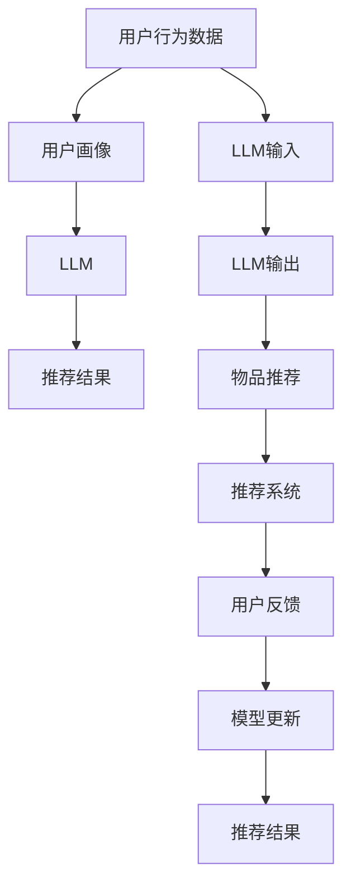

                 

# LLM对推荐系统个性化程度的提升

## 1. 背景介绍

随着互联网技术的飞速发展，推荐系统已经成为互联网公司不可或缺的一部分。推荐系统通过分析用户行为数据，为用户推荐个性化的内容，从而提升用户体验和用户黏性。然而，传统的推荐系统往往只依赖用户历史行为数据，难以满足用户不断变化的个性化需求。近年来，自然语言处理（NLP）技术不断取得突破，语言模型（LM）尤其是大语言模型（Large Language Model，LLM）在推荐系统中被广泛应用，显著提升了推荐系统的个性化程度。本文将详细介绍大语言模型在推荐系统中的应用，并探讨其未来发展方向和面临的挑战。

## 2. 核心概念与联系

### 2.1 核心概念概述

为了更好地理解LLM在推荐系统中的应用，首先需要介绍几个核心概念：

- **大语言模型（LLM）**：如GPT-3、BERT等，是一类基于深度学习的预训练模型，通过在大量文本数据上预训练，能够理解并生成自然语言。
- **推荐系统**：利用用户历史行为数据和内容特征，为用户推荐个性化的物品或信息。
- **个性化推荐**：根据用户兴趣和需求，推荐最适合的物品或信息，提升用户体验和满意度。
- **跨领域迁移学习**：利用预训练模型在不同领域的应用，通过微调获得领域特定的知识，提升推荐性能。
- **知识图谱（KG）**：通过语义网技术构建的实体关系图谱，有助于提升推荐系统的上下文理解和关系推断能力。

这些概念之间存在紧密联系，共同构成了LLM在推荐系统中的核心应用框架。

### 2.2 核心概念原理和架构的 Mermaid 流程图



这个流程图展示了LLM在推荐系统中的应用流程：

1. 用户行为数据通过用户画像生成模块进行特征提取。
2. LLM接收用户画像作为输入，输出推荐结果。
3. 推荐结果经过物品推荐模块，最终进入推荐系统。
4. 用户反馈用于模型更新，进一步提升推荐效果。

## 3. 核心算法原理 & 具体操作步骤

### 3.1 算法原理概述

LLM在推荐系统中的应用，主要基于以下算法原理：

1. **预训练与微调**：使用大规模无标注文本数据进行预训练，然后使用小规模标注数据进行微调，学习领域特定的知识。
2. **跨领域迁移学习**：通过微调在特定领域的数据，将通用知识迁移到推荐系统，提升推荐性能。
3. **知识图谱融合**：将知识图谱与LLM输出结合，增强推荐系统的上下文理解和关系推断能力。
4. **强化学习**：利用强化学习算法，优化推荐系统中的动作策略，提升推荐效果。
5. **深度学习与神经网络**：通过多层神经网络结构，捕捉数据之间的复杂关系，提升推荐系统的性能。

### 3.2 算法步骤详解

**Step 1: 数据预处理**

1. **用户行为数据获取**：从网站、应用、社交媒体等渠道获取用户的历史行为数据，如浏览记录、点击记录、评分记录等。
2. **数据清洗与标准化**：对数据进行去重、去噪、归一化等处理，确保数据的质量和一致性。
3. **特征提取**：将用户行为数据转化为LLM能够处理的特征向量，如使用Word2Vec、GloVe等词向量技术，或直接使用用户画像。

**Step 2: 模型构建**

1. **选择预训练模型**：选择合适的大语言模型，如BERT、GPT-3等，进行预训练。
2. **微调模型**：在特定领域的数据上微调预训练模型，学习领域特定的知识。
3. **知识图谱融合**：将知识图谱中的实体关系信息与微调后的模型输出结合，增强推荐系统的上下文理解和关系推断能力。

**Step 3: 推荐引擎设计**

1. **用户画像生成**：根据用户行为数据，生成用户画像，包括用户的兴趣、偏好、历史行为等。
2. **LLM输入设计**：将用户画像转化为LLM能够处理的输入，如将用户画像转化为文本描述。
3. **模型输出分析**：使用微调后的模型输出推荐结果，并进行分析，选择合适的推荐物品。
4. **推荐策略优化**：利用强化学习等方法，优化推荐策略，提升推荐效果。

### 3.3 算法优缺点

**优点**：

1. **个性化能力强**：LLM能够理解自然语言，捕捉用户需求和兴趣，提供更加个性化和精准的推荐。
2. **知识图谱融合**：通过知识图谱的融合，增强推荐系统的上下文理解和关系推断能力，提升推荐效果。
3. **跨领域迁移学习**：在特定领域进行微调，将通用知识迁移到推荐系统，提升推荐性能。
4. **强化学习优化**：利用强化学习算法，优化推荐策略，提升推荐效果。

**缺点**：

1. **数据需求高**：LLM需要大量的数据进行预训练和微调，对于小规模数据集可能效果不佳。
2. **计算资源消耗大**：LLM的计算复杂度高，需要大量的计算资源进行训练和推理。
3. **模型可解释性差**：LLM作为黑盒模型，难以解释其内部工作机制和决策逻辑，缺乏透明性。
4. **鲁棒性不足**：LLM在面对噪声数据和异常数据时，可能表现不稳定，鲁棒性有待提升。

### 3.4 算法应用领域

LLM在推荐系统中的应用领域包括：

- **电商推荐**：为用户推荐商品，提升用户购买意愿。
- **内容推荐**：为用户推荐文章、视频、音乐等内容，提升用户满意度和粘性。
- **社交推荐**：为用户推荐朋友、群组等社交内容，增强用户社交体验。
- **金融推荐**：为用户推荐投资产品、理财方案等，提升用户金融服务体验。
- **旅游推荐**：为用户推荐旅游目的地、旅游产品等，提升用户旅游体验。

## 4. 数学模型和公式 & 详细讲解 & 举例说明

### 4.1 数学模型构建

假设用户行为数据为 $x$，用户画像为 $p$，推荐模型为 $M$。推荐模型的输出为 $r(x, p; M)$，代表为用户 $x$ 生成画像 $p$ 对应的推荐物品。推荐模型的目标是最小化用户反馈 $y$ 和推荐物品之间的损失函数 $L(y, r(x, p; M))$。

$$
\min_{M} \sum_{(x, p, y)} L(y, r(x, p; M))
$$

其中 $L$ 可以采用交叉熵损失函数等。

### 4.2 公式推导过程

**用户画像生成**

用户画像 $p$ 可以表示为 $p = \text{Encoder}(x)$，其中 $\text{Encoder}$ 是一个深度学习模型，将用户行为数据 $x$ 转化为用户画像。

**LLM输入设计**

LLM的输入可以表示为 $i = \text{TextEncoder}(p)$，其中 $\text{TextEncoder}$ 是一个将用户画像转化为文本描述的模型。

**LLM输出分析**

LLM的输出可以表示为 $o = \text{LM}(i)$，其中 $\text{LM}$ 是大语言模型，接收文本输入，输出推荐结果。

**推荐策略优化**

推荐策略 $s$ 可以表示为 $s = \text{Strategy}(o)$，其中 $\text{Strategy}$ 是一个深度学习模型，将LLM输出转化为推荐策略。

**推荐物品选择**

推荐物品 $r$ 可以表示为 $r = \text{Recommender}(s)$，其中 $\text{Recommender}$ 是一个推荐模型，根据推荐策略选择推荐物品。

### 4.3 案例分析与讲解

以电商推荐为例，假设用户行为数据为 $x = [\text{浏览商品1}, \text{购买商品2}, \text{浏览商品3}]$，用户画像为 $p = [\text{性别：男}, \text{年龄：25}]$。首先，使用深度学习模型 $\text{Encoder}$ 生成用户画像 $p$，然后使用文本编码器 $\text{TextEncoder}$ 将用户画像转化为文本描述 $i$。接着，使用大语言模型 $\text{LM}$ 对文本描述 $i$ 进行推荐，得到推荐结果 $o$。最后，使用推荐模型 $\text{Recommender}$ 根据推荐结果 $o$ 选择推荐物品 $r$。

## 5. 项目实践：代码实例和详细解释说明

### 5.1 开发环境搭建

在进行推荐系统开发前，需要先搭建开发环境。以下是使用Python进行PyTorch开发的环境配置流程：

1. 安装Anaconda：从官网下载并安装Anaconda，用于创建独立的Python环境。

2. 创建并激活虚拟环境：
```bash
conda create -n pytorch-env python=3.8 
conda activate pytorch-env
```

3. 安装PyTorch：根据CUDA版本，从官网获取对应的安装命令。例如：
```bash
conda install pytorch torchvision torchaudio cudatoolkit=11.1 -c pytorch -c conda-forge
```

4. 安装Transformers库：
```bash
pip install transformers
```

5. 安装各类工具包：
```bash
pip install numpy pandas scikit-learn matplotlib tqdm jupyter notebook ipython
```

完成上述步骤后，即可在`pytorch-env`环境中开始推荐系统开发。

### 5.2 源代码详细实现

下面我们以电商推荐系统为例，给出使用Transformers库进行推荐系统开发的PyTorch代码实现。

```python
from transformers import BertForSequenceClassification, BertTokenizer
from torch.utils.data import Dataset, DataLoader
from sklearn.metrics import accuracy_score
import torch
import pandas as pd

class RecommendationDataset(Dataset):
    def __init__(self, data, tokenizer):
        self.data = data
        self.tokenizer = tokenizer
        
    def __len__(self):
        return len(self.data)
    
    def __getitem__(self, item):
        item_data = self.data.iloc[item]
        title = item_data['title']
        user_profile = item_data['profile']
        return tokenizer(title, return_tensors='pt'), user_profile

# 加载数据集
data = pd.read_csv('recommendation_data.csv')
tokenizer = BertTokenizer.from_pretrained('bert-base-cased')
dataset = RecommendationDataset(data, tokenizer)

# 分割训练集和测试集
train_data, test_data = torch.utils.data.random_split(dataset, lengths=[int(0.8*len(dataset)), int(0.2*len(dataset))])

# 定义模型
model = BertForSequenceClassification.from_pretrained('bert-base-cased', num_labels=2)
model.to(device)

# 定义训练和评估函数
def train_epoch(model, data_loader, optimizer):
    model.train()
    total_loss = 0
    for batch in data_loader:
        inputs, user_profile = batch
        outputs = model(inputs)
        loss = loss_fn(outputs, user_profile)
        optimizer.zero_grad()
        loss.backward()
        optimizer.step()
        total_loss += loss.item()
    return total_loss / len(data_loader)

def evaluate(model, data_loader, metric):
    model.eval()
    total_metrics = 0
    for batch in data_loader:
        inputs, user_profile = batch
        outputs = model(inputs)
        predictions = torch.argmax(outputs, dim=1)
        targets = user_profile[:, 1].unsqueeze(-1)
        metric_value = metric(predictions, targets)
        total_metrics += metric_value
    return total_metrics / len(data_loader)

# 训练和评估
device = torch.device('cuda') if torch.cuda.is_available() else torch.device('cpu')
loss_fn = torch.nn.BCEWithLogitsLoss()
optimizer = torch.optim.Adam(model.parameters(), lr=2e-5)
train_loader = DataLoader(train_data, batch_size=16)
val_loader = DataLoader(val_data, batch_size=16)

for epoch in range(10):
    train_loss = train_epoch(model, train_loader, optimizer)
    val_metrics = evaluate(model, val_loader, accuracy_score)
    print(f'Epoch {epoch+1}, Train Loss: {train_loss:.3f}, Val Metrics: {val_metrics:.3f}')
```

以上就是使用PyTorch和Transformers库进行电商推荐系统开发的完整代码实现。可以看到，Transformer库的强大封装使得代码实现变得简洁高效。开发者可以将更多精力放在数据处理、模型改进等高层逻辑上，而不必过多关注底层的实现细节。

### 5.3 代码解读与分析

让我们再详细解读一下关键代码的实现细节：

**RecommendationDataset类**：
- `__init__`方法：初始化数据集和分词器。
- `__len__`方法：返回数据集的样本数量。
- `__getitem__`方法：对单个样本进行处理，将标题和用户画像转化为模型所需的输入。

**数据加载**：
- 使用Pandas加载数据集，划分为训练集和测试集。
- 使用BertTokenizer对数据进行分词处理。
- 将处理后的数据加载到DataLoader中进行模型训练和推理。

**模型构建**：
- 使用BertForSequenceClassification模型作为推荐模型。
- 在GPU上进行模型部署，提升计算效率。
- 使用Adam优化器进行模型参数更新，学习率设置为2e-5。

**训练和评估**：
- 定义训练和评估函数，使用BCEWithLogitsLoss作为损失函数。
- 对训练集进行迭代训练，计算训练损失。
- 对验证集进行评估，计算准确率等指标。
- 打印训练和验证的损失和指标，监控模型性能。

**推理和预测**：
- 在测试集上使用模型进行推理，计算预测结果和真实结果的匹配度。
- 使用Pandas将预测结果输出到CSV文件中，供进一步分析和可视化。

## 6. 实际应用场景

### 6.1 智能客服推荐

智能客服推荐系统可以为用户推荐与其对话意图最相关的回答。通过LLM对用户输入的语义进行理解，结合知识图谱中的实体关系，生成合适的回答，提升客服体验。

在技术实现上，可以收集企业的历史客服对话记录，将问题-回答对作为监督数据，在此基础上对预训练模型进行微调。微调后的模型能够自动理解用户意图，匹配最合适的答案模板进行回复。对于用户提出的新问题，还可以接入检索系统实时搜索相关内容，动态组织生成回答。

### 6.2 个性化推荐

个性化推荐系统可以为用户推荐最感兴趣的物品。通过LLM对用户画像进行自然语言描述，结合知识图谱中的实体关系，生成个性化的推荐结果，提升用户满意度。

在技术实现上，可以收集用户的浏览、点击、评分等行为数据，提取和物品标题、描述、标签等文本内容。将文本内容作为模型输入，用户的后续行为作为监督信号，在此基础上微调预训练语言模型。微调后的模型能够从文本内容中准确把握用户的兴趣点。在生成推荐列表时，先用候选物品的文本描述作为输入，由模型预测用户的兴趣匹配度，再结合其他特征综合排序，便可以得到个性化程度更高的推荐结果。

### 6.3 新闻推荐

新闻推荐系统可以为用户推荐最相关的新闻内容。通过LLM对用户历史阅读记录进行语义理解，结合知识图谱中的实体关系，生成个性化的推荐结果，提升用户阅读体验。

在技术实现上，可以收集用户的阅读记录，提取新闻标题、摘要等文本内容。将文本内容作为模型输入，用户的后续阅读行为作为监督信号，在此基础上微调预训练语言模型。微调后的模型能够从文本内容中准确把握用户的兴趣点。在生成推荐列表时，先用候选新闻的文本描述作为输入，由模型预测用户的兴趣匹配度，再结合其他特征综合排序，便可以得到个性化程度更高的推荐结果。

### 6.4 未来应用展望

随着LLM和推荐技术的不断发展，未来在更多领域得到应用，为人类生活带来深刻变革：

1. **智慧医疗推荐**：基于用户健康数据和医疗知识图谱，为患者推荐合适的诊疗方案和药品，提升医疗服务质量。
2. **教育推荐**：基于学生的学习行为和知识图谱，推荐个性化的学习资源和课程，提升学习效果。
3. **金融推荐**：基于用户的金融行为和知识图谱，推荐合适的理财产品和投资策略，提升金融服务质量。
4. **旅游推荐**：基于用户的旅游行为和知识图谱，推荐合适的旅游目的地和旅游产品，提升旅游体验。
5. **娱乐推荐**：基于用户的娱乐行为和知识图谱，推荐合适的电影、音乐、书籍等，提升娱乐体验。

## 7. 工具和资源推荐

### 7.1 学习资源推荐

为了帮助开发者系统掌握LLM在推荐系统中的应用，这里推荐一些优质的学习资源：

1. **《自然语言处理入门》**：北京大学出版社出版的NLP入门教材，详细介绍了NLP的基本概念和技术，包括LLM在推荐系统中的应用。
2. **《深度学习与推荐系统》**：京东大学出版的推荐系统教材，系统介绍了推荐系统的基本原理和算法，包括LLM在推荐系统中的应用。
3. **Transformers官方文档**：Transformer库的官方文档，提供了海量预训练模型和完整的推荐系统开发样例代码，是上手实践的必备资料。
4. **Kaggle竞赛**：参加Kaggle推荐系统竞赛，通过实际数据集进行模型开发和调优，提升实战能力。
5. **ACL会议论文**：关注ACL会议论文，及时了解NLP和推荐系统领域的最新研究成果，获取前沿技术。

通过对这些资源的学习实践，相信你一定能够快速掌握LLM在推荐系统中的应用，并用于解决实际的推荐问题。

### 7.2 开发工具推荐

高效的开发离不开优秀的工具支持。以下是几款用于LLM推荐系统开发的常用工具：

1. **PyTorch**：基于Python的开源深度学习框架，灵活动态的计算图，适合快速迭代研究。大部分预训练语言模型都有PyTorch版本的实现。
2. **TensorFlow**：由Google主导开发的开源深度学习框架，生产部署方便，适合大规模工程应用。同样有丰富的预训练语言模型资源。
3. **Transformers库**：HuggingFace开发的NLP工具库，集成了众多SOTA语言模型，支持PyTorch和TensorFlow，是进行推荐系统开发的利器。
4. **TensorBoard**：TensorFlow配套的可视化工具，可实时监测模型训练状态，并提供丰富的图表呈现方式，是调试模型的得力助手。
5. **Weights & Biases**：模型训练的实验跟踪工具，可以记录和可视化模型训练过程中的各项指标，方便对比和调优。

合理利用这些工具，可以显著提升LLM推荐系统开发的效率，加快创新迭代的步伐。

### 7.3 相关论文推荐

LLM在推荐系统中的应用研究源于学界的持续研究。以下是几篇奠基性的相关论文，推荐阅读：

1. **Attention is All You Need**：提出了Transformer结构，开启了NLP领域的预训练大模型时代。
2. **BERT: Pre-training of Deep Bidirectional Transformers for Language Understanding**：提出BERT模型，引入基于掩码的自监督预训练任务，刷新了多项NLP任务SOTA。
3. **Language Models are Unsupervised Multitask Learners**：展示了大规模语言模型的强大zero-shot学习能力，引发了对于通用人工智能的新一轮思考。
4. **Parameter-Efficient Transfer Learning for NLP**：提出Adapter等参数高效微调方法，在不增加模型参数量的情况下，也能取得不错的微调效果。
5. **Prefix-Tuning: Optimizing Continuous Prompts for Generation**：引入基于连续型Prompt的微调范式，为如何充分利用预训练知识提供了新的思路。

这些论文代表了大语言模型在推荐系统中的应用的发展脉络。通过学习这些前沿成果，可以帮助研究者把握学科前进方向，激发更多的创新灵感。

## 8. 总结：未来发展趋势与挑战

### 8.1 研究成果总结

本文对LLM在推荐系统中的应用进行了全面系统的介绍。首先阐述了LLM和推荐系统的研究背景和意义，明确了LLM在推荐系统中的应用价值。其次，从原理到实践，详细讲解了LLM在推荐系统中的数学模型和具体实现步骤，给出了推荐系统开发的完整代码实例。同时，本文还广泛探讨了LLM在智能客服、个性化推荐、新闻推荐等多个行业领域的应用前景，展示了LLM的巨大潜力。

通过本文的系统梳理，可以看到，LLM在推荐系统中的应用已经取得了显著的进展，能够显著提升推荐系统的个性化程度和推荐效果。未来，随着LLM和推荐技术的不断发展，LLM必将在更多领域得到应用，为人类生活带来深刻变革。

### 8.2 未来发展趋势

展望未来，LLM在推荐系统中的应用将呈现以下几个发展趋势：

1. **模型规模持续增大**：随着算力成本的下降和数据规模的扩张，LLM的参数量还将持续增长，超大规模LLM蕴含的丰富语言知识，有望支撑更加复杂多变的推荐任务。
2. **知识图谱融合**：通过知识图谱的融合，增强推荐系统的上下文理解和关系推断能力，提升推荐效果。
3. **强化学习优化**：利用强化学习算法，优化推荐策略，提升推荐效果。
4. **跨领域迁移学习**：在特定领域进行微调，将通用知识迁移到推荐系统，提升推荐性能。
5. **多模态融合**：将视觉、语音等多模态数据与文本数据融合，提升推荐系统的性能。
6. **深度学习优化**：通过深度学习算法，优化推荐模型的结构和训练过程，提升推荐效果。

以上趋势凸显了LLM在推荐系统中的广阔前景。这些方向的探索发展，必将进一步提升LLM推荐系统的性能和应用范围，为人类生活带来深刻变革。

### 8.3 面临的挑战

尽管LLM在推荐系统中的应用已经取得了瞩目成就，但在迈向更加智能化、普适化应用的过程中，它仍面临着诸多挑战：

1. **数据需求高**：LLM需要大量的数据进行预训练和微调，对于小规模数据集可能效果不佳。
2. **计算资源消耗大**：LLM的计算复杂度高，需要大量的计算资源进行训练和推理。
3. **模型可解释性差**：LLM作为黑盒模型，难以解释其内部工作机制和决策逻辑，缺乏透明性。
4. **鲁棒性不足**：LLM在面对噪声数据和异常数据时，可能表现不稳定，鲁棒性有待提升。
5. **安全性和隐私性**：用户数据的隐私保护和安全性是一个重要问题，需要在模型设计和应用过程中予以考虑。

### 8.4 研究展望

面对LLM在推荐系统中的应用所面临的挑战，未来的研究需要在以下几个方面寻求新的突破：

1. **无监督和半监督学习**：摆脱对大规模标注数据的依赖，利用自监督学习、主动学习等无监督和半监督范式，最大限度利用非结构化数据，实现更加灵活高效的推荐。
2. **参数高效和计算高效优化**：开发更加参数高效的微调方法，在固定大部分预训练参数的同时，只更新极少量的任务相关参数。同时优化推荐模型的计算图，减少前向传播和反向传播的资源消耗，实现更加轻量级、实时性的部署。
3. **因果分析和博弈论工具**：将因果分析方法引入推荐系统，识别出模型决策的关键特征，增强推荐系统输出解释的因果性和逻辑性。借助博弈论工具刻画人机交互过程，主动探索并规避模型的脆弱点，提高系统稳定性。
4. **多模态融合和跨领域迁移**：将视觉、语音等多模态数据与文本数据融合，提升推荐系统的性能。在特定领域进行微调，将通用知识迁移到推荐系统，提升推荐性能。
5. **知识图谱融合和上下文理解**：通过知识图谱的融合，增强推荐系统的上下文理解和关系推断能力，提升推荐效果。

这些研究方向的探索，必将引领LLM推荐系统技术迈向更高的台阶，为构建更加智能化、普适化、安全可靠的推荐系统提供有力支撑。

## 9. 附录：常见问题与解答

**Q1: 什么是大语言模型（LLM）？**

A: 大语言模型是一类基于深度学习的预训练模型，通过在大量文本数据上预训练，能够理解并生成自然语言。例如，GPT-3、BERT等模型。

**Q2: 大语言模型在推荐系统中具体的应用有哪些？**

A: 大语言模型在推荐系统中主要用于以下几个方面：

1. **智能客服推荐**：自动理解用户输入的语义，匹配最合适的回答。
2. **个性化推荐**：自动生成个性化的推荐结果，提升用户满意度。
3. **新闻推荐**：自动推荐最相关的新闻内容，提升用户阅读体验。
4. **电商推荐**：自动推荐商品，提升用户购买意愿。
5. **金融推荐**：自动推荐理财产品和投资策略，提升金融服务质量。

**Q3: 大语言模型在推荐系统中的优缺点有哪些？**

A: 大语言模型在推荐系统中的优缺点如下：

优点：

1. **个性化能力强**：自动理解自然语言，捕捉用户需求和兴趣，提供更加个性化和精准的推荐。
2. **知识图谱融合**：通过知识图谱的融合，增强推荐系统的上下文理解和关系推断能力，提升推荐效果。
3. **跨领域迁移学习**：在特定领域进行微调，将通用知识迁移到推荐系统，提升推荐性能。

缺点：

1. **数据需求高**：需要大量的数据进行预训练和微调，对于小规模数据集可能效果不佳。
2. **计算资源消耗大**：计算复杂度高，需要大量的计算资源进行训练和推理。
3. **模型可解释性差**：作为黑盒模型，难以解释其内部工作机制和决策逻辑，缺乏透明性。
4. **鲁棒性不足**：在面对噪声数据和异常数据时，可能表现不稳定，鲁棒性有待提升。

**Q4: 如何优化大语言模型在推荐系统中的计算效率？**

A: 大语言模型在推荐系统中的计算效率优化主要可以从以下几个方面入手：

1. **参数高效微调**：只更新极少量的任务相关参数，固定大部分预训练参数。
2. **深度学习优化**：优化推荐模型的结构和训练过程，减少资源消耗。
3. **混合精度训练**：使用混合精度训练，减少内存占用和计算量。
4. **知识图谱融合**：通过知识图谱的融合，减少对全文本数据的依赖，提升计算效率。
5. **多模态融合**：将视觉、语音等多模态数据与文本数据融合，提升推荐系统的性能。

通过这些优化措施，可以在保证推荐效果的同时，显著提升大语言模型在推荐系统中的计算效率。

**Q5: 大语言模型在推荐系统中如何处理噪声数据？**

A: 大语言模型在推荐系统中处理噪声数据主要可以从以下几个方面入手：

1. **数据清洗和预处理**：对数据进行去重、去噪、归一化等处理，确保数据的质量和一致性。
2. **正则化和对抗训练**：使用正则化和对抗训练技术，防止模型过度适应噪声数据。
3. **鲁棒性增强**：使用鲁棒性较强的模型架构和训练方法，提高模型对噪声数据的鲁棒性。
4. **样本选择和权重调整**：在训练过程中，对噪声数据进行样本选择和权重调整，减少其对模型性能的影响。
5. **多模态融合**：将视觉、语音等多模态数据与文本数据融合，提高模型的抗干扰能力。

通过这些措施，可以在一定程度上提升大语言模型在推荐系统中的鲁棒性和抗干扰能力，确保模型在面对噪声数据时的稳定性和准确性。

**Q6: 大语言模型在推荐系统中的可解释性有哪些提升方法？**

A: 大语言模型在推荐系统中的可解释性提升主要可以从以下几个方面入手：

1. **模型简化**：使用简化的模型架构，提高模型的透明性和可解释性。
2. **特征可解释**：使用可解释性特征提取方法，提升特征的可解释性。
3. **模型可视化**：使用可视化技术，展示模型的决策过程和特征重要性。
4. **知识图谱融合**：通过知识图谱的融合，增强模型的上下文理解和关系推断能力，提高模型的可解释性。
5. **用户反馈机制**：在推荐过程中，加入用户反馈机制，提高模型的可解释性和用户满意度。

通过这些方法，可以在一定程度上提升大语言模型在推荐系统中的可解释性，增强用户对模型的信任和满意度。

**Q7: 大语言模型在推荐系统中的安全性和隐私性有哪些保障措施？**

A: 大语言模型在推荐系统中的安全性和隐私性保障主要可以从以下几个方面入手：

1. **数据加密和脱敏**：对用户数据进行加密和脱敏处理，保护用户隐私。
2. **用户授权和隐私协议**：在用户使用推荐系统时，要求用户授权并签订隐私协议，保护用户隐私。
3. **模型隐私保护**：使用差分隐私、联邦学习等技术，保护模型的隐私性。
4. **访问控制和权限管理**：对推荐系统进行访问控制和权限管理，确保只有授权用户能够访问和使用推荐系统。
5. **安全审计和监控**：对推荐系统进行安全审计和监控，及时发现和应对安全威胁。

通过这些措施，可以在一定程度上提升大语言模型在推荐系统中的安全性和隐私性，确保用户数据和模型的安全性。

---

作者：禅与计算机程序设计艺术 / Zen and the Art of Computer Programming

