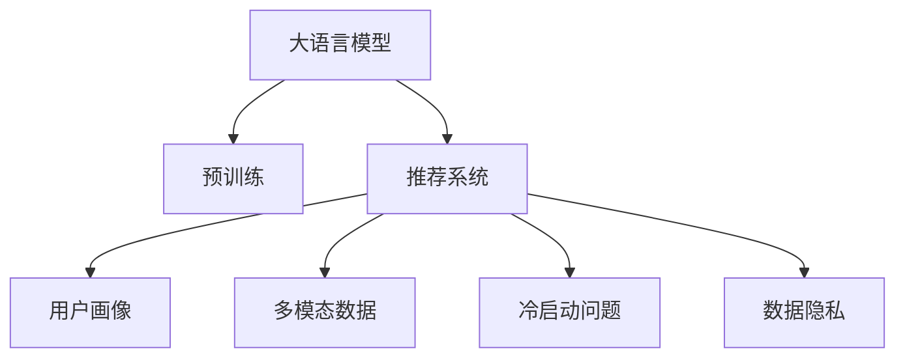

                 

# LLM对推荐系统用户体验的提升

## 1. 背景介绍

### 1.1 问题由来

随着互联网信息爆炸，用户在海量信息中发现有用信息变得愈发困难。推荐系统便应运而生，通过分析用户行为，推荐符合用户兴趣的内容，极大提升了用户体验。然而，现有的推荐系统仍然存在诸多瓶颈，难以完全满足用户个性化需求，如推荐结果多样性不足、冷启动问题、数据隐私等。近年来，语言模型在NLP领域取得了突破，将其应用于推荐系统中，有望解决这些挑战，进一步提升用户体验。

### 1.2 问题核心关键点

1. **用户兴趣理解：** 推荐系统通过分析用户历史行为，如浏览、点击、购买记录，构建用户画像。如何准确理解用户的多样化兴趣，成为推荐系统的核心难题。
2. **推荐结果多样性：** 用户常常希望在推荐中看到多样的内容，避免陷入信息茧房。推荐系统如何高效生成多样化的推荐结果，是提升用户体验的关键。
3. **冷启动问题：** 新用户或新物品往往缺乏足够的历史数据，难以进行精准推荐。如何通过多模态数据和预训练语言模型解决冷启动问题，成为推荐系统的另一大挑战。
4. **数据隐私：** 推荐系统需要收集用户行为数据，如何保护用户隐私、遵循数据合规原则，是推荐系统走向商业化应用的重要保障。

## 2. 核心概念与联系

### 2.1 核心概念概述

为更好地理解基于大语言模型的推荐系统优化，本节将介绍几个关键概念：

- 大语言模型(Large Language Model, LLM)：以自回归(如GPT)或自编码(如BERT)模型为代表的大规模预训练语言模型。通过在大规模无标签文本语料上进行预训练，学习通用的语言表示，具备强大的语言理解和生成能力。

- 预训练(Pre-training)：指在大规模无标签文本语料上，通过自监督学习任务训练通用语言模型的过程。常见的预训练任务包括言语建模、遮挡语言模型等。预训练使得模型学习到语言的通用表示。

- 推荐系统(Recommendation System)：通过分析用户历史行为，预测用户兴趣并推荐符合其喜好的内容。推荐系统分为基于内容的推荐、协同过滤推荐、混合推荐等多种类型。

- 用户画像(User Profile)：通过用户历史行为数据构建的用户兴趣特征表示，用于推荐系统中的个性化推荐。

- 多模态数据(Multimodal Data)：结合文本、图像、音频等多类型数据，提升推荐系统的全面性和准确性。

- 冷启动问题(Cold-Start Problem)：新用户或新物品缺乏足够的历史数据，推荐系统难以进行精准推荐。

- 数据隐私(Data Privacy)：推荐系统需要收集用户行为数据，如何保护用户隐私、遵循数据合规原则，是推荐系统走向商业化应用的重要保障。

这些概念之间的逻辑关系可以通过以下Mermaid流程图来展示：



这个流程图展示了大语言模型与推荐系统的核心概念及其关系：

1. 大语言模型通过预训练获得基础能力。
2. 推荐系统利用预训练模型进行个性化推荐。
3. 用户画像和冷启动问题通过多模态数据和语言模型进行优化。
4. 数据隐私问题通过技术手段加以保障。

## 3. 核心算法原理 & 具体操作步骤
### 3.1 算法原理概述

基于大语言模型的推荐系统优化，本质上是一个有监督的细粒度迁移学习过程。其核心思想是：将预训练的大语言模型视作一个强大的"特征提取器"，通过在推荐系统数据集上进行有监督学习，使得模型输出更符合推荐任务的要求。

形式化地，假设预训练模型为 $M_{\theta}$，其中 $\theta$ 为预训练得到的模型参数。给定推荐系统用户-物品交互数据集 $D=\{(x_i,y_i)\}_{i=1}^N, x_i \in \mathbb{R}^d, y_i \in \{0,1\}$，推荐系统的目标是最小化交叉熵损失，即找到新的模型参数 $\hat{\theta}$，使得：

$$
\hat{\theta}=\mathop{\arg\min}_{\theta} -\frac{1}{N}\sum_{i=1}^N [y_i\log M_{\theta}(x_i)+(1-y_i)\log (1-M_{\theta}(x_i))]
$$

其中 $y_i$ 为推荐结果，$M_{\theta}(x_i)$ 为模型在输入 $x_i$ 上的输出。通过梯度下降等优化算法，微调过程不断更新模型参数 $\theta$，最小化损失函数，使得模型输出逼近理想推荐结果。由于 $\theta$ 已经通过预训练获得了较好的初始化，因此即便在较小规模数据集 $D$ 上进行微调，也能较快收敛到理想的模型参数 $\hat{\theta}$。

### 3.2 算法步骤详解

基于大语言模型的推荐系统优化一般包括以下几个关键步骤：

**Step 1: 准备预训练模型和数据集**
- 选择合适的预训练语言模型 $M_{\theta}$ 作为初始化参数，如 BERT、GPT等。
- 准备推荐系统用户-物品交互数据集 $D$，划分为训练集、验证集和测试集。一般要求数据分布与预训练数据的分布不要差异过大。

**Step 2: 添加推荐适配层**
- 根据推荐任务类型，在预训练模型顶层设计合适的输出层和损失函数。
- 对于评分推荐，通常在顶层添加线性回归器或MLP分类器，使用均方误差损失或交叉熵损失。
- 对于序列推荐，使用语言模型的解码器输出概率分布，并以负对数似然为损失函数。

**Step 3: 设置微调超参数**
- 选择合适的优化算法及其参数，如 AdamW、SGD 等，设置学习率、批大小、迭代轮数等。
- 设置正则化技术及强度，包括权重衰减、Dropout、Early Stopping等。
- 确定冻结预训练参数的策略，如仅微调顶层，或全部参数都参与微调。

**Step 4: 执行梯度训练**
- 将训练集数据分批次输入模型，前向传播计算损失函数。
- 反向传播计算参数梯度，根据设定的优化算法和学习率更新模型参数。
- 周期性在验证集上评估模型性能，根据性能指标决定是否触发 Early Stopping。
- 重复上述步骤直到满足预设的迭代轮数或 Early Stopping 条件。

**Step 5: 测试和部署**
- 在测试集上评估微调后模型 $M_{\hat{\theta}}$ 的性能，对比微调前后的推荐效果。
- 使用微调后的模型对新用户或新物品进行推荐，集成到实际的应用系统中。
- 持续收集新的数据，定期重新微调模型，以适应数据分布的变化。

以上是基于大语言模型优化推荐系统的通用流程。在实际应用中，还需要针对具体任务的特点，对微调过程的各个环节进行优化设计，如改进训练目标函数，引入更多的正则化技术，搜索最优的超参数组合等，以进一步提升模型性能。

### 3.3 算法优缺点

基于大语言模型的推荐系统优化方法具有以下优点：
1. 简单高效。只需准备少量推荐数据，即可对预训练模型进行快速适配，获得较大的推荐效果提升。
2. 通用适用。适用于各种推荐系统类型，包括评分推荐、序列推荐、多目标推荐等，设计简单的任务适配层即可实现。
3. 参数高效。利用参数高效微调技术，在固定大部分预训练权重不变的情况下，仍可取得不错的推荐效果。
4. 效果显著。在学术界和工业界的诸多推荐系统任务上，基于微调的方法已经刷新了多项性能指标。

同时，该方法也存在一定的局限性：
1. 依赖推荐数据。推荐系统的效果很大程度上取决于推荐数据的质量和数量，获取高质量推荐数据的成本较高。
2. 迁移能力有限。当推荐任务与预训练数据的分布差异较大时，推荐系统的性能提升有限。
3. 负面效果传递。预训练模型的固有偏见、有害信息等，可能通过推荐系统传递到用户，造成负面影响。
4. 可解释性不足。推荐系统的决策过程通常缺乏可解释性，难以对其推理逻辑进行分析和调试。

尽管存在这些局限性，但就目前而言，基于大语言模型的推荐系统优化方法仍是目前推荐系统的主流范式。未来相关研究的重点在于如何进一步降低推荐对标注数据的依赖，提高模型的少样本学习和跨领域迁移能力，同时兼顾可解释性和伦理安全性等因素。

### 3.4 算法应用领域

基于大语言模型的推荐系统优化方法，在电商、新闻、视频等多个领域已经得到了广泛的应用，覆盖了推荐系统的主流任务，例如：

- 商品推荐：如淘宝、亚马逊等电商平台，通过分析用户行为数据，推荐符合用户喜好的商品。
- 新闻推荐：如今日头条、网易新闻等，通过分析用户阅读行为，推荐相关的新闻内容。
- 视频推荐：如Netflix、YouTube等，通过分析用户观看历史，推荐符合用户喜好的视频内容。
- 音乐推荐：如Spotify、网易云音乐等，通过分析用户听歌历史，推荐符合用户喜好的音乐。
- 社交推荐：如微信、微博等，通过分析用户互动行为，推荐符合用户兴趣的朋友、文章等。

除了上述这些经典任务外，大语言模型优化推荐系统的方法也被创新性地应用到更多场景中，如个性化视频生成、智能客服、广告推荐等，为推荐技术带来了全新的突破。随着预训练模型和优化方法的不断进步，相信推荐系统将在更广阔的应用领域大放异彩。

## 4. 数学模型和公式 & 详细讲解  
### 4.1 数学模型构建

本节将使用数学语言对基于大语言模型的推荐系统优化过程进行更加严格的刻画。

记预训练语言模型为 $M_{\theta}$，其中 $\theta$ 为预训练得到的模型参数。假设推荐系统用户-物品交互数据集为 $D=\{(x_i,y_i)\}_{i=1}^N, x_i \in \mathbb{R}^d, y_i \in \{0,1\}$。

定义模型 $M_{\theta}$ 在输入 $x_i$ 上的输出为 $y_i'$，即推荐结果。推荐系统的损失函数定义为交叉熵损失，即：

$$
\ell(y_i',y_i) = -[y_i\log y_i'+(1-y_i)\log (1-y_i')]
$$

则在数据集 $D$ 上的经验风险为：

$$
\mathcal{L}(\theta) = -\frac{1}{N}\sum_{i=1}^N [y_i\log y_i'+(1-y_i)\log (1-y_i')]
$$

通过梯度下降等优化算法，微调过程不断更新模型参数 $\theta$，最小化损失函数 $\mathcal{L}$，使得模型输出逼近真实推荐结果。由于 $\theta$ 已经通过预训练获得了较好的初始化，因此即便在较小规模数据集 $D$ 上进行微调，也能较快收敛到理想的模型参数 $\hat{\theta}$。

### 4.2 公式推导过程

以下我们以评分推荐任务为例，推导交叉熵损失函数及其梯度的计算公式。

假设模型 $M_{\theta}$ 在输入 $x_i$ 上的输出为 $y_i'$，表示推荐结果，则评分推荐任务的交叉熵损失函数定义为：

$$
\ell(y_i',y_i) = -[y_i\log y_i'+(1-y_i)\log (1-y_i')]
$$

将其代入经验风险公式，得：

$$
\mathcal{L}(\theta) = -\frac{1}{N}\sum_{i=1}^N [y_i\log y_i'+(1-y_i)\log (1-y_i')]
$$

根据链式法则，损失函数对参数 $\theta_k$ 的梯度为：

$$
\frac{\partial \mathcal{L}(\theta)}{\partial \theta_k} = -\frac{1}{N}\sum_{i=1}^N (\frac{y_i}{y_i'}-\frac{1-y_i}{1-y_i'}) \frac{\partial y_i'}{\partial \theta_k}
$$

其中 $\frac{\partial y_i'}{\partial \theta_k}$ 可进一步递归展开，利用自动微分技术完成计算。

在得到损失函数的梯度后，即可带入参数更新公式，完成模型的迭代优化。重复上述过程直至收敛，最终得到适应推荐系统任务的最优模型参数 $\hat{\theta}$。

## 5. 项目实践：代码实例和详细解释说明
### 5.1 开发环境搭建

在进行推荐系统优化实践前，我们需要准备好开发环境。以下是使用Python进行PyTorch开发的环境配置流程：

1. 安装Anaconda：从官网下载并安装Anaconda，用于创建独立的Python环境。

2. 创建并激活虚拟环境：
```bash
conda create -n recommendation-env python=3.8 
conda activate recommendation-env
```

3. 安装PyTorch：根据CUDA版本，从官网获取对应的安装命令。例如：
```bash
conda install pytorch torchvision torchaudio cudatoolkit=11.1 -c pytorch -c conda-forge
```

4. 安装Transformers库：
```bash
pip install transformers
```

5. 安装各类工具包：
```bash
pip install numpy pandas scikit-learn matplotlib tqdm jupyter notebook ipython
```

完成上述步骤后，即可在`recommendation-env`环境中开始推荐系统优化实践。

### 5.2 源代码详细实现

下面我们以电商推荐系统为例，给出使用Transformers库对BERT模型进行优化推荐模型的PyTorch代码实现。

首先，定义推荐任务的数据处理函数：

```python
from transformers import BertTokenizer
from torch.utils.data import Dataset
import torch

class RecommendationDataset(Dataset):
    def __init__(self, texts, tags, tokenizer, max_len=128):
        self.texts = texts
        self.tags = tags
        self.tokenizer = tokenizer
        self.max_len = max_len
        
    def __len__(self):
        return len(self.texts)
    
    def __getitem__(self, item):
        text = self.texts[item]
        tag = self.tags[item]
        
        encoding = self.tokenizer(text, return_tensors='pt', max_length=self.max_len, padding='max_length', truncation=True)
        input_ids = encoding['input_ids'][0]
        attention_mask = encoding['attention_mask'][0]
        
        # 对label进行编码
        encoded_tags = [tag2id[tag] for tag in tag] 
        encoded_tags.extend([tag2id['O']] * (self.max_len - len(encoded_tags)))
        labels = torch.tensor(encoded_tags, dtype=torch.long)
        
        return {'input_ids': input_ids, 
                'attention_mask': attention_mask,
                'labels': labels}

# 标签与id的映射
tag2id = {'O': 0, 'buy': 1, 'read': 2, 'watch': 3, 'listen': 4}
id2tag = {v: k for k, v in tag2id.items()}

# 创建dataset
tokenizer = BertTokenizer.from_pretrained('bert-base-cased')

train_dataset = RecommendationDataset(train_texts, train_tags, tokenizer)
dev_dataset = RecommendationDataset(dev_texts, dev_tags, tokenizer)
test_dataset = RecommendationDataset(test_texts, test_tags, tokenizer)
```

然后，定义模型和优化器：

```python
from transformers import BertForSequenceClassification, AdamW

model = BertForSequenceClassification.from_pretrained('bert-base-cased', num_labels=len(tag2id))

optimizer = AdamW(model.parameters(), lr=2e-5)
```

接着，定义训练和评估函数：

```python
from torch.utils.data import DataLoader
from tqdm import tqdm
from sklearn.metrics import classification_report

device = torch.device('cuda') if torch.cuda.is_available() else torch.device('cpu')
model.to(device)

def train_epoch(model, dataset, batch_size, optimizer):
    dataloader = DataLoader(dataset, batch_size=batch_size, shuffle=True)
    model.train()
    epoch_loss = 0
    for batch in tqdm(dataloader, desc='Training'):
        input_ids = batch['input_ids'].to(device)
        attention_mask = batch['attention_mask'].to(device)
        labels = batch['labels'].to(device)
        model.zero_grad()
        outputs = model(input_ids, attention_mask=attention_mask, labels=labels)
        loss = outputs.loss
        epoch_loss += loss.item()
        loss.backward()
        optimizer.step()
    return epoch_loss / len(dataloader)

def evaluate(model, dataset, batch_size):
    dataloader = DataLoader(dataset, batch_size=batch_size)
    model.eval()
    preds, labels = [], []
    with torch.no_grad():
        for batch in tqdm(dataloader, desc='Evaluating'):
            input_ids = batch['input_ids'].to(device)
            attention_mask = batch['attention_mask'].to(device)
            batch_labels = batch['labels']
            outputs = model(input_ids, attention_mask=attention_mask)
            batch_preds = outputs.logits.argmax(dim=2).to('cpu').tolist()
            batch_labels = batch_labels.to('cpu').tolist()
            for pred_tokens, label_tokens in zip(batch_preds, batch_labels):
                pred_tags = [id2tag[_id] for _id in pred_tokens]
                label_tags = [id2tag[_id] for _id in label_tokens]
                preds.append(pred_tags[:len(label_tags)])
                labels.append(label_tags)
                
    print(classification_report(labels, preds))
```

最后，启动训练流程并在测试集上评估：

```python
epochs = 5
batch_size = 16

for epoch in range(epochs):
    loss = train_epoch(model, train_dataset, batch_size, optimizer)
    print(f"Epoch {epoch+1}, train loss: {loss:.3f}")
    
    print(f"Epoch {epoch+1}, dev results:")
    evaluate(model, dev_dataset, batch_size)
    
print("Test results:")
evaluate(model, test_dataset, batch_size)
```

以上就是使用PyTorch对BERT进行电商推荐系统优化任务的完整代码实现。可以看到，得益于Transformers库的强大封装，我们可以用相对简洁的代码完成BERT模型的加载和优化。

### 5.3 代码解读与分析

让我们再详细解读一下关键代码的实现细节：

**RecommendationDataset类**：
- `__init__`方法：初始化文本、标签、分词器等关键组件。
- `__len__`方法：返回数据集的样本数量。
- `__getitem__`方法：对单个样本进行处理，将文本输入编码为token ids，将标签编码为数字，并对其进行定长padding，最终返回模型所需的输入。

**tag2id和id2tag字典**：
- 定义了标签与数字id之间的映射关系，用于将token-wise的预测结果解码回真实的标签。

**训练和评估函数**：
- 使用PyTorch的DataLoader对数据集进行批次化加载，供模型训练和推理使用。
- 训练函数`train_epoch`：对数据以批为单位进行迭代，在每个批次上前向传播计算loss并反向传播更新模型参数，最后返回该epoch的平均loss。
- 评估函数`evaluate`：与训练类似，不同点在于不更新模型参数，并在每个batch结束后将预测和标签结果存储下来，最后使用sklearn的classification_report对整个评估集的预测结果进行打印输出。

**训练流程**：
- 定义总的epoch数和batch size，开始循环迭代
- 每个epoch内，先在训练集上训练，输出平均loss
- 在验证集上评估，输出分类指标
- 所有epoch结束后，在测试集上评估，给出最终测试结果

可以看到，PyTorch配合Transformers库使得BERT优化推荐系统的代码实现变得简洁高效。开发者可以将更多精力放在数据处理、模型改进等高层逻辑上，而不必过多关注底层的实现细节。

当然，工业级的系统实现还需考虑更多因素，如模型的保存和部署、超参数的自动搜索、更灵活的任务适配层等。但核心的优化范式基本与此类似。

## 6. 实际应用场景
### 6.1 智能推荐系统

基于大语言模型的推荐系统优化方法，可以广泛应用于智能推荐系统的构建。传统推荐系统往往依赖用户的历史行为数据进行推荐，难以捕捉用户的多样化兴趣。而使用微调后的推荐模型，可以更好地理解用户的隐式偏好，推荐更符合用户期望的内容。

在技术实现上，可以收集用户浏览、点击、购买等行为数据，将行为转化为推荐模型输入。利用预训练语言模型对推荐结果进行优化，使得模型输出更符合用户兴趣。对于新用户或新物品，也可以利用多模态数据进行联合推荐，提高推荐效果。如此构建的智能推荐系统，能大幅提升用户推荐体验，增加用户粘性。

### 6.2 个性化广告推荐

广告推荐系统需要精准识别目标用户，并推荐符合其兴趣的广告内容。传统广告推荐系统往往基于用户的明示行为进行推荐，如点击记录、搜索记录等，难以充分捕捉用户的隐性兴趣。基于大语言模型的推荐系统优化方法，可以进一步挖掘用户的隐性行为特征，如搜索关键词、社交互动等，提升广告推荐的精准度。

在实践中，可以利用多模态数据，结合文本、图像、音频等多种信息，构建更全面的用户画像。通过优化推荐模型，使得广告推荐更加个性化、精准化，提升广告效果和用户体验。

### 6.3 智能视频推荐

视频推荐系统需要处理海量视频内容，推荐符合用户兴趣的视频。传统视频推荐系统往往基于用户的视频观看历史进行推荐，难以考虑用户的隐性兴趣和多样性需求。基于大语言模型的推荐系统优化方法，可以进一步挖掘用户的隐性兴趣和行为特征，推荐更丰富、多样的视频内容。

在实践中，可以结合用户的历史观看记录、评分记录、社交互动等，构建用户画像。通过优化推荐模型，使得视频推荐更加精准、个性化，提升用户观看体验和满意度。

### 6.4 未来应用展望

随着大语言模型和推荐系统优化方法的不断发展，基于微调范式将在更多领域得到应用，为智能推荐系统带来变革性影响。

在智慧医疗领域，基于微调的医疗推荐系统，可以根据患者的健康数据和历史记录，推荐适合的医疗服务，提升医疗服务的个性化和精准化。

在智能教育领域，微调技术可应用于个性化推荐、学习路径设计等，因材施教，促进教育公平，提高教学质量。

在智慧城市治理中，微调模型可应用于智能推荐、城市事件监测、舆情分析等环节，提高城市管理的自动化和智能化水平，构建更安全、高效的未来城市。

此外，在企业生产、社会治理、文娱传媒等众多领域，基于大语言模型的推荐系统优化方法也将不断涌现，为人工智能技术带来新的突破。相信随着技术的日益成熟，推荐系统将在更广阔的应用领域大放异彩。

## 7. 工具和资源推荐
### 7.1 学习资源推荐

为了帮助开发者系统掌握大语言模型优化推荐系统的方法，这里推荐一些优质的学习资源：

1. 《Transformer从原理到实践》系列博文：由大模型技术专家撰写，深入浅出地介绍了Transformer原理、BERT模型、优化方法等前沿话题。

2. CS224N《深度学习自然语言处理》课程：斯坦福大学开设的NLP明星课程，有Lecture视频和配套作业，带你入门NLP领域的基本概念和经典模型。

3. 《Natural Language Processing with Transformers》书籍：Transformers库的作者所著，全面介绍了如何使用Transformers库进行NLP任务开发，包括优化推荐系统在内的诸多范式。

4. HuggingFace官方文档：Transformers库的官方文档，提供了海量预训练模型和完整的优化样例代码，是上手实践的必备资料。

5. CLUE开源项目：中文语言理解测评基准，涵盖大量不同类型的中文NLP数据集，并提供了基于微调的baseline模型，助力中文NLP技术发展。

通过对这些资源的学习实践，相信你一定能够快速掌握大语言模型优化推荐系统的精髓，并用于解决实际的推荐系统问题。
### 7.2 开发工具推荐

高效的开发离不开优秀的工具支持。以下是几款用于大语言模型优化推荐系统开发的常用工具：

1. PyTorch：基于Python的开源深度学习框架，灵活动态的计算图，适合快速迭代研究。大部分预训练语言模型都有PyTorch版本的实现。

2. TensorFlow：由Google主导开发的开源深度学习框架，生产部署方便，适合大规模工程应用。同样有丰富的预训练语言模型资源。

3. Transformers库：HuggingFace开发的NLP工具库，集成了众多SOTA语言模型，支持PyTorch和TensorFlow，是进行优化推荐系统开发的利器。

4. Weights & Biases：模型训练的实验跟踪工具，可以记录和可视化模型训练过程中的各项指标，方便对比和调优。与主流深度学习框架无缝集成。

5. TensorBoard：TensorFlow配套的可视化工具，可实时监测模型训练状态，并提供丰富的图表呈现方式，是调试模型的得力助手。

6. Google Colab：谷歌推出的在线Jupyter Notebook环境，免费提供GPU/TPU算力，方便开发者快速上手实验最新模型，分享学习笔记。

合理利用这些工具，可以显著提升大语言模型优化推荐系统的开发效率，加快创新迭代的步伐。

### 7.3 相关论文推荐

大语言模型和推荐系统优化技术的发展源于学界的持续研究。以下是几篇奠基性的相关论文，推荐阅读：

1. Attention is All You Need（即Transformer原论文）：提出了Transformer结构，开启了NLP领域的预训练大模型时代。

2. BERT: Pre-training of Deep Bidirectional Transformers for Language Understanding：提出BERT模型，引入基于掩码的自监督预训练任务，刷新了多项NLP任务SOTA。

3. Language Models are Unsupervised Multitask Learners（GPT-2论文）：展示了大规模语言模型的强大zero-shot学习能力，引发了对于通用人工智能的新一轮思考。

4. Parameter-Efficient Transfer Learning for NLP：提出Adapter等参数高效微调方法，在不增加模型参数量的情况下，也能取得不错的优化效果。

5. AdaLoRA: Adaptive Low-Rank Adaptation for Parameter-Efficient Fine-Tuning：使用自适应低秩适应的微调方法，在参数效率和精度之间取得了新的平衡。

6. Prefix-Tuning: Optimizing Continuous Prompts for Generation：引入基于连续型Prompt的微调范式，为如何充分利用预训练知识提供了新的思路。

这些论文代表了大语言模型和推荐系统优化技术的发展脉络。通过学习这些前沿成果，可以帮助研究者把握学科前进方向，激发更多的创新灵感。

## 8. 总结：未来发展趋势与挑战

### 8.1 总结

本文对基于大语言模型的推荐系统优化方法进行了全面系统的介绍。首先阐述了推荐系统和大语言模型的研究背景和意义，明确了优化方法在提升推荐系统性能、用户满意度方面的独特价值。其次，从原理到实践，详细讲解了基于大语言模型的推荐系统优化数学原理和关键步骤，给出了推荐系统优化任务的完整代码实例。同时，本文还广泛探讨了优化方法在智能推荐、个性化广告推荐、视频推荐等多个领域的应用前景，展示了优化方法带来的巨大潜力。此外，本文精选了推荐系统优化技术的各类学习资源，力求为开发者提供全方位的技术指引。

通过本文的系统梳理，可以看到，基于大语言模型的推荐系统优化方法正在成为推荐系统的重要范式，极大地拓展了推荐系统的应用边界，催生了更多的落地场景。受益于大规模语料的预训练，优化后的推荐系统以更低的时间和标注成本，在推荐效果上取得了显著的提升，有力推动了推荐技术产业化进程。未来，伴随预训练语言模型和优化方法的持续演进，相信推荐系统将在更广阔的应用领域大放异彩，深刻影响人类的生产生活方式。

### 8.2 未来发展趋势

展望未来，大语言模型优化推荐系统将呈现以下几个发展趋势：

1. 模型规模持续增大。随着算力成本的下降和数据规模的扩张，预训练语言模型的参数量还将持续增长。超大规模语言模型蕴含的丰富语言知识，有望支撑更加复杂多变的推荐系统优化。

2. 优化方法日趋多样。除了传统的全参数优化外，未来会涌现更多参数高效的优化方法，如Prefix-Tuning、LoRA等，在节省计算资源的同时也能保证优化效果。

3. 持续学习成为常态。随着数据分布的不断变化，优化后的推荐系统也需要持续学习新知识以保持性能。如何在不遗忘原有知识的同时，高效吸收新样本信息，将成为重要的研究课题。

4. 标注样本需求降低。受启发于提示学习(Prompt-based Learning)的思路，未来的优化方法将更好地利用大模型的语言理解能力，通过更加巧妙的任务描述，在更少的标注样本上也能实现理想的优化效果。

5. 多模态优化崛起。当前的推荐系统往往局限于文本数据，未来会进一步拓展到图像、视频、音频等多类型数据优化。多模态信息的融合，将显著提升推荐系统的全面性和准确性。

6. 知识融合能力增强。现有的推荐系统往往局限于任务内数据，难以灵活吸收和运用更广泛的先验知识。如何让优化过程更好地与外部知识库、规则库等专家知识结合，形成更加全面、准确的信息整合能力，还有很大的想象空间。

以上趋势凸显了大语言模型优化推荐系统的广阔前景。这些方向的探索发展，必将进一步提升推荐系统的性能和应用范围，为人类生产生活方式带来深远影响。

### 8.3 面临的挑战

尽管大语言模型优化推荐系统取得了显著成果，但在迈向更加智能化、普适化应用的过程中，它仍面临诸多挑战：

1. 标注成本瓶颈。虽然优化方法大大降低了标注数据的需求，但对于长尾应用场景，难以获得充足的高质量标注数据，成为制约优化效果的瓶颈。如何进一步降低优化对标注样本的依赖，将是一大难题。

2. 推荐结果多样性不足。优化后的推荐系统可能仍存在过拟合于历史数据的问题，导致推荐结果多样性不足。如何在保证推荐结果精度的同时，提高推荐结果的多样性，是优化的重要方向。

3. 计算资源消耗大。优化后的推荐系统往往需要更大的计算资源，尤其是在大规模数据集上进行训练和推理。如何在保证性能的前提下，优化计算资源消耗，是优化过程需要不断优化的环节。

4. 推荐结果一致性问题。优化后的推荐系统可能存在算法漂移现象，即在训练和推理过程中模型输出不一致。如何在优化过程中避免算法漂移，保证推荐结果的一致性，也是优化过程中的重要挑战。

5. 冷启动问题未完全解决。虽然优化方法在一定程度上缓解了冷启动问题，但对于新用户或新物品，仍存在推荐效果不佳的问题。如何进一步解决冷启动问题，提升新用户的推荐体验，是优化过程的重要目标。

6. 数据隐私保护。优化后的推荐系统需要收集用户行为数据，如何保护用户隐私、遵循数据合规原则，是推荐系统走向商业化应用的重要保障。如何在优化过程中保障用户数据隐私，避免数据滥用，是优化过程需要持续关注的问题。

正视优化面临的这些挑战，积极应对并寻求突破，将是大语言模型优化推荐系统走向成熟的必由之路。相信随着学界和产业界的共同努力，这些挑战终将一一被克服，大语言模型优化推荐系统必将在构建人机协同的智能推荐系统中扮演越来越重要的角色。

### 8.4 研究展望

面向未来，大语言模型优化推荐系统需要在以下几个方面寻求新的突破：

1. 探索无监督和半监督优化方法。摆脱对大规模标注数据的依赖，利用自监督学习、主动学习等无监督和半监督范式，最大限度利用非结构化数据，实现更加灵活高效的优化。

2. 研究参数高效和计算高效的优化范式。开发更加参数高效的优化方法，在固定大部分预训练参数的同时，只更新极少量的任务相关参数。同时优化优化过程的计算图，减少前向传播和反向传播的资源消耗，实现更加轻量级、实时性的部署。

3. 融合因果和对比学习范式。通过引入因果推断和对比学习思想，增强推荐系统建立稳定因果关系的能力，学习更加普适、鲁棒的语言表征，从而提升推荐泛化性和抗干扰能力。

4. 引入更多先验知识。将符号化的先验知识，如知识图谱、逻辑规则等，与神经网络模型进行巧妙融合，引导优化过程学习更准确、合理的语言模型。同时加强不同模态数据的整合，实现视觉、语音等多模态信息与文本信息的协同建模。

5. 结合因果分析和博弈论工具。将因果分析方法引入推荐系统，识别出推荐决策的关键特征，增强推荐结果的因果性和逻辑性。借助博弈论工具刻画人机交互过程，主动探索并规避推荐系统的脆弱点，提高系统稳定性。

6. 纳入伦理道德约束。在推荐系统优化目标中引入伦理导向的评估指标，过滤和惩罚有害的推荐结果。同时加强人工干预和审核，建立推荐系统的监管机制，确保推荐结果符合人类价值观和伦理道德。

这些研究方向的探索，必将引领大语言模型优化推荐系统迈向更高的台阶，为构建安全、可靠、可解释、可控的智能推荐系统铺平道路。面向未来，大语言模型优化推荐系统还需要与其他人工智能技术进行更深入的融合，如知识表示、因果推理、强化学习等，多路径协同发力，共同推动自然语言理解和智能交互系统的进步。只有勇于创新、敢于突破，才能不断拓展推荐系统的边界，让智能技术更好地造福人类社会。

## 9. 附录：常见问题与解答

**Q1：大语言模型优化推荐系统是否适用于所有推荐任务？**

A: 大语言模型优化推荐系统在大多数推荐系统任务上都能取得不错的效果，特别是对于数据量较小的任务。但对于一些特定领域的任务，如医学、法律等，仅仅依靠通用语料预训练的模型可能难以很好地适应。此时需要在特定领域语料上进一步预训练，再进行优化，才能获得理想效果。此外，对于一些需要时效性、个性化很强的任务，如对话、推荐等，优化方法也需要针对性的改进优化。

**Q2：优化过程中如何选择合适的学习率？**

A: 优化学习率一般要比预训练时小1-2个数量级，如果使用过大的学习率，容易破坏预训练权重，导致过拟合。一般建议从1e-5开始调参，逐步减小学习率，直至收敛。也可以使用warmup策略，在开始阶段使用较小的学习率，再逐渐过渡到预设值。需要注意的是，不同的优化器(如AdamW、Adafactor等)以及不同的学习率调度策略，可能需要设置不同的学习率阈值。

**Q3：优化过程中如何缓解过拟合问题？**

A: 过拟合是优化面临的主要挑战，尤其是在标注数据不足的情况下。常见的缓解策略包括：
1. 数据增强：通过回译、近义替换等方式扩充训练集
2. 正则化：使用L2正则、Dropout、Early Stopping等避免过拟合
3. 对抗训练：引入对抗样本，提高模型鲁棒性
4. 参数高效优化：只调整少量参数(如Adapter、Prefix等)，减小过拟合风险
5. 多模型集成：训练多个优化模型，取平均输出，抑制过拟合

这些策略往往需要根据具体任务和数据特点进行灵活组合。只有在数据、模型、训练、推理等各环节进行全面优化，才能最大限度地发挥大语言模型优化推荐系统的威力。

**Q4：优化推荐系统如何保护用户隐私？**

A: 优化推荐系统需要收集用户行为数据，如何保护用户隐私、遵循数据合规原则，是推荐系统走向商业化应用的重要保障。以下是一些常用的隐私保护方法：
1. 匿名化：对用户数据进行匿名化处理，确保用户无法被识别。
2. 差分隐私：在数据收集和处理过程中加入噪声，确保个人数据的隐私性。
3. 数据脱敏：对敏感信息进行脱敏处理，确保用户隐私不被泄露。
4. 访问控制：对推荐系统进行访问控制，确保只有授权人员能够访问用户数据。

这些方法需要根据具体应用场景进行合理选择，并在整个推荐系统设计和实现过程中进行全面考虑，以确保用户隐私得到有效保护。

**Q5：优化推荐系统如何提升冷启动问题？**

A: 冷启动问题是指新用户或新物品缺乏足够的历史数据，推荐系统难以进行精准推荐。以下是一些常用的冷启动解决方案：
1. 基于内容的推荐：利用物品的元数据信息，如标签、描述等，推荐与物品相似的物品。
2. 基于协同过滤的推荐：利用用户的历史行为数据，推荐用户可能感兴趣的其他物品。
3. 基于多模态数据的推荐：结合文本、图像、音频等多种信息，构建更全面的用户画像。
4. 基于用户画像的推荐：利用用户画像中的信息，推荐符合用户喜好的物品。

这些方法需要根据具体应用场景进行合理选择，并在推荐系统的设计和实现过程中进行全面考虑，以提升冷启动问题的解决效果。

总之，大语言模型优化推荐系统在提升用户体验、推动推荐系统发展方面具有重要意义。通过不断优化和创新，相信大语言模型优化推荐系统将在更广阔的应用领域大放异彩，为人类生产生活方式带来深远影响。

---

作者：禅与计算机程序设计艺术 / Zen and the Art of Computer Programming

