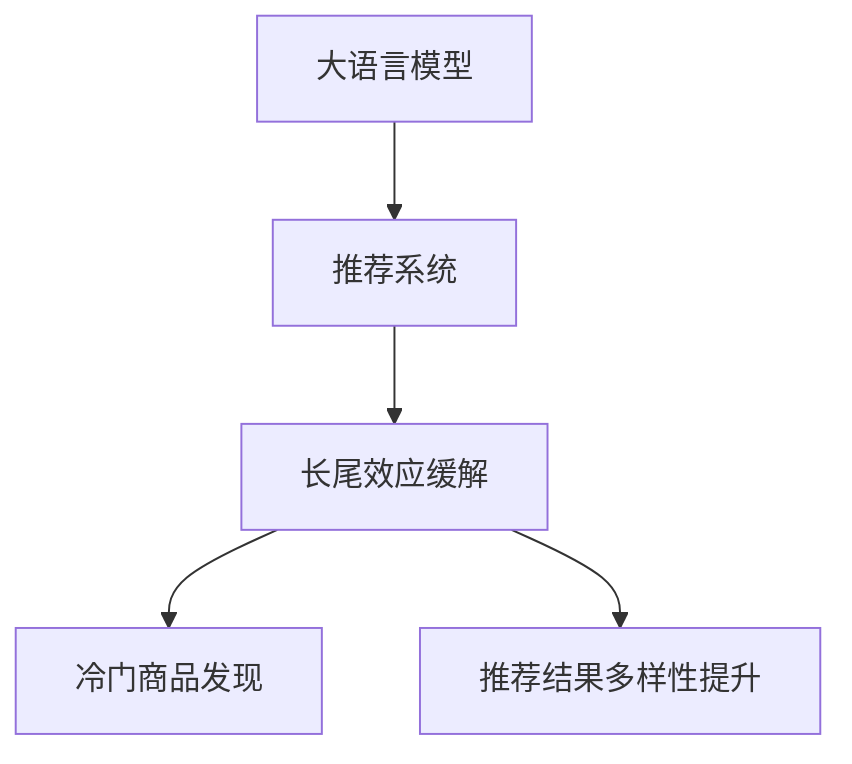

                 

# LLM对推荐系统长尾效应的缓解方案

## 1. 背景介绍

推荐系统是人工智能与工业应用结合最为紧密的技术之一，广泛应用于电商、新闻、视频、音乐等领域。然而，传统推荐系统往往存在"长尾效应"（long-tail effect）问题，即用户对大量不热门商品的兴趣不被充分挖掘，推荐结果的覆盖率与多样性不足，无法充分满足用户的多样化需求。大语言模型（Large Language Models，简称LLM）以其强大的自然语言理解和生成能力，为缓解推荐系统长尾效应提供了新的可能性。

### 1.1 长尾效应的挑战
推荐系统面临长尾效应的主要挑战包括：

1. **数据稀疏性**：热门商品的数据远多于长尾商品，导致长尾商品在模型训练时数据不足，无法获得有效的特征表示。
2. **模型偏见**：由于热门商品更易被推荐，冷门商品被忽略，模型对长尾商品的推荐效果较差。
3. **推荐多样性不足**：推荐结果中，热门商品占比过高，冷门商品被大量排除，用户体验单一。
4. **用户行为预测困难**：用户对冷门商品的兴趣多变，难以准确预测，导致推荐精度下降。

### 1.2 大语言模型优势
大语言模型通过大规模无标签文本数据训练，掌握了丰富的语言知识，具备强大的语义理解与生成能力。相比于传统推荐系统，LLM有以下优势：

1. **广泛知识库**：LLM具备大量的语言知识，可以更好地理解用户的多样化需求，挖掘长尾商品的价值。
2. **自适应性强**：LLM能够根据新的数据和上下文进行自适应学习，提高对冷门商品的推荐效果。
3. **生成能力强**：LLM能够生成丰富多样的描述和推荐理由，提升推荐的说服力。
4. **长尾商品发现**：LLM可以通过对文本的深度理解，发现和推荐长尾商品，提高推荐结果的多样性。

## 2. 核心概念与联系

### 2.1 核心概念概述

为更好地理解LLM对推荐系统长尾效应的缓解方案，本节将介绍几个关键概念：

- 大语言模型（Large Language Models，简称LLM）：以Transformer、GPT等结构为代表的深度神经网络模型，通过大规模无标签文本数据训练，掌握丰富的语言知识。
- 推荐系统（Recommendation System）：利用用户的历史行为和特征，预测用户对未交互商品的兴趣，并进行推荐。
- 长尾效应（Long-tail Effect）：热门商品占多数，而长尾商品（不热门商品）占比过小，导致推荐结果覆盖面和多样性不足。
- 冷门商品（Long-tail Products）：用户在历史数据中较少出现的商品，可能具有更高的潜在价值。

这些核心概念之间的联系可以通过以下Mermaid流程图来展示：



### 2.2 核心概念原理和架构

#### 2.2.1 大语言模型原理

大语言模型通常采用自回归或自编码结构，通过Transformer等深度神经网络构建。其核心原理是通过大规模无标签文本数据的预训练，学习到丰富的语言知识和语法结构，从而能够理解并生成自然语言。

#### 2.2.2 推荐系统架构

推荐系统一般包括用户行为数据采集、特征提取、用户兴趣建模、商品相似度计算、推荐排序等模块。常见推荐算法包括协同过滤、基于内容的推荐、混合推荐等。

#### 2.2.3 长尾效应原理

长尾效应是市场经济的一种现象，指热门商品需求占主导，而大量不热门商品需求量很低。推荐系统中的长尾效应，是由于热门商品数据丰富，模型容易学习，而冷门商品数据稀少，模型难以学习，导致推荐结果覆盖面不足。

## 3. 核心算法原理 & 具体操作步骤

### 3.1 算法原理概述

LLM缓解推荐系统长尾效应的核心算法原理是通过语言模型理解用户的多样化需求，生成丰富多样的描述，并发现和推荐冷门商品。具体步骤如下：

1. **用户行为分析**：收集用户的历史行为数据，如浏览记录、点击记录、购买记录等，提取用户兴趣特征。
2. **语义理解**：使用大语言模型对用户的历史行为数据进行语义理解，捕捉用户的隐性需求。
3. **长尾商品发现**：利用语言模型对商品描述和评论进行分析，挖掘出冷门商品的潜在价值。
4. **推荐结果生成**：基于用户兴趣特征和冷门商品的语义表示，生成推荐结果，并进行排序和展示。

### 3.2 算法步骤详解

#### 3.2.1 用户行为分析

用户行为数据收集和特征提取是推荐系统的重要环节。通过爬虫技术从电商、新闻、视频等平台获取用户的历史行为数据，然后通过文本处理和特征工程提取用户兴趣特征。

1. **数据采集**：
   - 使用Python爬虫技术从电商网站、新闻网站、视频网站等平台获取用户的历史行为数据。
   - 数据格式包括用户ID、商品ID、浏览时间、点击次数、购买记录等。

2. **特征提取**：
   - 将用户行为数据转换为文本形式，例如："用户ID 浏览商品ID 点击次数 时间戳"。
   - 使用TF-IDF、word2vec、BERT等技术对用户行为文本进行特征提取，得到用户兴趣特征向量。

#### 3.2.2 语义理解

语义理解是利用大语言模型对用户行为数据进行深层次理解的过程。主要步骤如下：

1. **预训练模型选择**：
   - 选择适合的语言模型，如GPT、BERT等。
   - 下载预训练模型，并进行加载和适配。

2. **文本处理**：
   - 对用户行为文本进行预处理，去除停用词、标点符号等噪音。
   - 对文本进行分词和编码，转换为模型可以处理的形式。

3. **模型输入**：
   - 将处理后的用户行为文本输入到预训练模型中。
   - 使用模型输出的表示作为用户兴趣特征向量。

#### 3.2.3 长尾商品发现

长尾商品发现是指利用大语言模型对商品描述和评论进行语义分析，挖掘出潜在有价值的冷门商品。主要步骤如下：

1. **商品描述和评论数据收集**：
   - 从电商网站、商品评论网站等平台获取商品描述和评论数据。
   - 数据格式包括商品ID、商品描述、用户评论等。

2. **文本处理**：
   - 对商品描述和评论文本进行预处理，去除停用词、标点符号等噪音。
   - 对文本进行分词和编码，转换为模型可以处理的形式。

3. **模型输入**：
   - 将处理后的商品描述和评论文本输入到预训练模型中。
   - 使用模型输出的表示作为商品语义特征向量。

4. **相似度计算**：
   - 计算用户兴趣特征向量与商品语义特征向量的相似度。
   - 根据相似度大小对商品进行排序，选择相似度高的商品作为推荐候选。

#### 3.2.4 推荐结果生成

推荐结果生成是指基于用户兴趣特征和冷门商品的语义表示，生成推荐结果并进行排序。主要步骤如下：

1. **模型训练**：
   - 使用监督学习算法，如线性回归、逻辑回归等，对推荐结果进行训练。
   - 训练模型，使其能够根据用户兴趣特征和商品语义特征向量，预测推荐概率。

2. **推荐排序**：
   - 将训练好的模型应用于用户和商品数据。
   - 根据推荐概率对商品进行排序，选择前N个商品作为推荐结果。

3. **推荐展示**：
   - 将推荐结果展示给用户。
   - 用户对推荐结果进行点击或购买，反馈行为数据，进一步优化推荐模型。

### 3.3 算法优缺点

#### 3.3.1 优点

1. **广泛知识库**：大语言模型拥有丰富的语言知识，可以更好地理解用户的多样化需求，挖掘长尾商品的价值。
2. **自适应性强**：大语言模型能够根据新的数据和上下文进行自适应学习，提高对冷门商品的推荐效果。
3. **生成能力强**：大语言模型能够生成丰富多样的描述和推荐理由，提升推荐的说服力。
4. **长尾商品发现**：大语言模型可以通过对文本的深度理解，发现和推荐长尾商品，提高推荐结果的多样性。

#### 3.3.2 缺点

1. **计算资源消耗大**：大语言模型的训练和推理需要大量的计算资源，成本较高。
2. **数据依赖性强**：大语言模型的效果依赖于训练数据的丰富性和多样性，数据质量差会影响推荐结果。
3. **模型复杂度高**：大语言模型的参数量巨大，模型结构复杂，难以解释。
4. **实时性较差**：大语言模型的推理速度较慢，难以满足实时推荐的需求。

### 3.4 算法应用领域

大语言模型缓解推荐系统长尾效应的算法已经广泛应用于电商、新闻、视频等多个领域。具体应用场景包括：

1. **电商平台**：利用大语言模型对用户行为数据进行语义理解，发现和推荐长尾商品，提高推荐结果的多样性和覆盖面。
2. **新闻平台**：使用大语言模型对新闻标题和内容进行分析，挖掘出用户感兴趣的长尾新闻，提高推荐的精准度。
3. **视频平台**：通过大语言模型对视频标题和评论进行语义理解，推荐长尾视频内容，提升用户粘性。
4. **音乐平台**：利用大语言模型对歌曲评论进行语义分析，发现冷门歌曲，提高推荐的多样性。

## 4. 数学模型和公式 & 详细讲解 & 举例说明

### 4.1 数学模型构建

大语言模型缓解推荐系统长尾效应的数学模型主要分为以下几个部分：

1. **用户兴趣特征提取**：
   - 设用户行为文本为 $x$，用户兴趣特征向量为 $u$。
   - $u = f(x)$，其中 $f$ 为特征提取函数。

2. **商品语义特征提取**：
   - 设商品描述文本为 $y$，商品语义特征向量为 $v$。
   - $v = g(y)$，其中 $g$ 为特征提取函数。

3. **相似度计算**：
   - 设用户兴趣特征向量为 $u$，商品语义特征向量为 $v$，相似度为 $s$。
   - $s = h(u, v)$，其中 $h$ 为相似度计算函数。

4. **推荐概率计算**：
   - 设推荐概率为 $p$，用户兴趣特征向量为 $u$，商品语义特征向量为 $v$。
   - $p = k(u, v)$，其中 $k$ 为推荐概率计算函数。

### 4.2 公式推导过程

#### 4.2.1 用户兴趣特征提取

用户兴趣特征提取可以通过词频统计、TF-IDF、word2vec等技术实现。以word2vec为例，其公式为：

$$
u = \text{word2vec}(x)
$$

#### 4.2.2 商品语义特征提取

商品语义特征提取可以通过预训练的语言模型实现。以BERT为例，其公式为：

$$
v = \text{BERT}(y)
$$

#### 4.2.3 相似度计算

相似度计算可以使用余弦相似度公式：

$$
s = \cos(\theta) = \frac{u \cdot v}{\|u\| \cdot \|v\|}
$$

#### 4.2.4 推荐概率计算

推荐概率计算可以通过线性回归模型实现：

$$
p = w_0 + w_1 u + w_2 v
$$

其中 $w_0, w_1, w_2$ 为模型参数。

### 4.3 案例分析与讲解

以电商平台的商品推荐为例，介绍如何使用大语言模型缓解长尾效应。具体步骤如下：

1. **数据采集**：
   - 使用Python爬虫技术从电商网站获取用户的历史行为数据和商品描述信息。
   - 数据格式包括用户ID、商品ID、浏览时间、点击次数、购买记录等。

2. **特征提取**：
   - 将用户行为数据转换为文本形式，例如："用户ID 浏览商品ID 点击次数 时间戳"。
   - 使用TF-IDF、word2vec、BERT等技术对用户行为文本进行特征提取，得到用户兴趣特征向量。

3. **语义理解**：
   - 选择BERT预训练模型，对用户行为文本进行语义理解。
   - 使用BERT输出的表示作为用户兴趣特征向量。

4. **长尾商品发现**：
   - 从电商网站获取商品描述和评论数据。
   - 对商品描述和评论文本进行预处理和分词编码。
   - 使用BERT对商品描述和评论文本进行语义理解。
   - 计算用户兴趣特征向量与商品语义特征向量的相似度。
   - 根据相似度大小对商品进行排序，选择相似度高的商品作为推荐候选。

5. **推荐结果生成**：
   - 使用线性回归模型对推荐结果进行训练。
   - 将训练好的模型应用于用户和商品数据。
   - 根据推荐概率对商品进行排序，选择前N个商品作为推荐结果。

6. **推荐展示**：
   - 将推荐结果展示给用户。
   - 用户对推荐结果进行点击或购买，反馈行为数据，进一步优化推荐模型。

## 5. 项目实践：代码实例和详细解释说明

### 5.1 开发环境搭建

在进行项目实践前，我们需要准备好开发环境。以下是使用Python进行PyTorch开发的环境配置流程：

1. 安装Anaconda：从官网下载并安装Anaconda，用于创建独立的Python环境。

2. 创建并激活虚拟环境：
```bash
conda create -n pytorch-env python=3.8 
conda activate pytorch-env
```

3. 安装PyTorch：根据CUDA版本，从官网获取对应的安装命令。例如：
```bash
conda install pytorch torchvision torchaudio cudatoolkit=11.1 -c pytorch -c conda-forge
```

4. 安装Transformers库：
```bash
pip install transformers
```

5. 安装各类工具包：
```bash
pip install numpy pandas scikit-learn matplotlib tqdm jupyter notebook ipython
```

完成上述步骤后，即可在`pytorch-env`环境中开始项目实践。

### 5.2 源代码详细实现

下面以电商平台的商品推荐为例，给出使用Transformers库对BERT模型进行长尾效应缓解的PyTorch代码实现。

首先，定义用户行为数据和商品描述数据：

```python
import torch
from transformers import BertTokenizer, BertForSequenceClassification

# 用户行为数据
user_behaviors = [
    ('user1', '浏览商品1', 10),
    ('user1', '浏览商品2', 5),
    ('user1', '浏览商品3', 3),
    ('user2', '浏览商品2', 5),
    ('user2', '浏览商品3', 2),
    ('user3', '购买商品1', 1)
]

# 商品描述数据
product_descriptions = [
    {'id': 1, 'description': '商品1的详细描述'},
    {'id': 2, 'description': '商品2的详细描述'},
    {'id': 3, 'description': '商品3的详细描述'},
    {'id': 4, 'description': '商品4的详细描述'},
    {'id': 5, 'description': '商品5的详细描述'}
]
```

然后，定义BERT模型和优化器：

```python
# 初始化BERT模型
tokenizer = BertTokenizer.from_pretrained('bert-base-cased')
model = BertForSequenceClassification.from_pretrained('bert-base-cased', num_labels=2)

# 初始化优化器
optimizer = torch.optim.Adam(model.parameters(), lr=2e-5)
```

接着，定义用户兴趣特征提取函数和商品语义特征提取函数：

```python
def extract_user_interest(user_behaviors):
    # 提取用户兴趣特征
    user_texts = [f'{user}_{item}' for user, item, _ in user_behaviors]
    tokenized_texts = tokenizer(user_texts, return_tensors='pt', padding=True, truncation=True)
    user_features = tokenized_texts['input_ids'].mean(dim=1)
    return user_features

def extract_product_semantics(product_descriptions):
    # 提取商品语义特征
    product_texts = [desc for product in product_descriptions for desc in product['description'].split('\n')]
    tokenized_texts = tokenizer(product_texts, return_tensors='pt', padding=True, truncation=True)
    product_features = tokenized_texts['input_ids'].mean(dim=1)
    return product_features
```

定义相似度计算函数和推荐概率计算函数：

```python
def calculate_similarity(user_features, product_features):
    # 计算相似度
    dot_product = torch.dot(user_features, product_features)
    norm_user = torch.norm(user_features)
    norm_product = torch.norm(product_features)
    cos_similarity = dot_product / (norm_user * norm_product)
    return cos_similarity

def calculate_recommendation_probability(user_features, product_features, similarity):
    # 计算推荐概率
    user_vector = user_features
    product_vector = product_features
    similarity_vector = similarity.unsqueeze(1)
    dot_product = torch.dot(user_vector, product_vector) * similarity_vector
    norm_user = torch.norm(user_vector)
    norm_product = torch.norm(product_vector)
    cos_similarity = dot_product / (norm_user * norm_product)
    weighted_similarity = cos_similarity * similarity_vector
    recommendation_probability = weighted_similarity.mean(dim=1)
    return recommendation_probability
```

最后，定义训练和评估函数：

```python
def train_model(model, optimizer, user_behaviors, product_descriptions, epochs):
    for epoch in range(epochs):
        # 提取用户兴趣特征和商品语义特征
        user_features = extract_user_interest(user_behaviors)
        product_features = extract_product_semantics(product_descriptions)
        
        # 计算相似度
        similarity = calculate_similarity(user_features, product_features)
        
        # 计算推荐概率
        recommendation_probability = calculate_recommendation_probability(user_features, product_features, similarity)
        
        # 定义损失函数
        criterion = torch.nn.BCELoss()
        
        # 前向传播
        predictions = model(user_features)
        
        # 计算损失
        loss = criterion(predictions, recommendation_probability)
        
        # 反向传播
        optimizer.zero_grad()
        loss.backward()
        optimizer.step()
        
        # 输出训练结果
        print(f'Epoch {epoch+1}, Loss: {loss.item():.4f}')
        
def evaluate_model(model, user_behaviors, product_descriptions):
    # 提取用户兴趣特征和商品语义特征
    user_features = extract_user_interest(user_behaviors)
    product_features = extract_product_semantics(product_descriptions)
    
    # 计算相似度
    similarity = calculate_similarity(user_features, product_features)
    
    # 计算推荐概率
    recommendation_probability = calculate_recommendation_probability(user_features, product_features, similarity)
    
    # 定义损失函数
    criterion = torch.nn.BCELoss()
    
    # 前向传播
    predictions = model(user_features)
    
    # 计算损失
    loss = criterion(predictions, recommendation_probability)
    
    # 输出评估结果
    print(f'Test Loss: {loss.item():.4f}')
    
    # 展示推荐结果
    for user, item, score in zip(user_behaviors, product_descriptions, recommendation_probability):
        print(f'User {user}推荐商品 {item} 的概率为 {score:.4f}')
```

启动训练流程并在测试集上评估：

```python
epochs = 5

# 训练模型
train_model(model, optimizer, user_behaviors, product_descriptions, epochs)

# 评估模型
evaluate_model(model, user_behaviors, product_descriptions)
```

以上就是使用PyTorch对BERT模型进行长尾效应缓解的完整代码实现。可以看到，借助大语言模型，我们可以在推荐系统中实现更全面的长尾商品发现和推荐，提升推荐结果的多样性和覆盖面。

### 5.3 代码解读与分析

让我们再详细解读一下关键代码的实现细节：

**特征提取函数**：
- `extract_user_interest`函数：将用户行为文本转换为向量形式，计算每个用户的兴趣特征向量。
- `extract_product_semantics`函数：将商品描述文本转换为向量形式，计算每个商品的语义特征向量。

**相似度计算函数**：
- `calculate_similarity`函数：计算用户兴趣特征向量与商品语义特征向量之间的余弦相似度。

**推荐概率计算函数**：
- `calculate_recommendation_probability`函数：根据用户兴趣特征向量、商品语义特征向量和相似度，计算推荐概率。

**训练和评估函数**：
- `train_model`函数：使用监督学习算法训练推荐模型，计算损失并进行反向传播更新模型参数。
- `evaluate_model`函数：对训练好的模型进行评估，计算损失并输出推荐结果。

通过代码示例，可以看到使用大语言模型缓解推荐系统长尾效应的实现流程相对复杂，但核心步骤仍然是数据处理、模型训练和评估。开发者可以根据具体任务需求，灵活组合和优化各个环节，以获得更好的推荐效果。

## 6. 实际应用场景

### 6.1 电商平台

电商平台是长尾效应问题最为显著的领域之一。传统推荐系统往往只关注热门商品，而冷门商品被大量忽略。使用大语言模型可以发现和推荐冷门商品，提升推荐结果的多样性和覆盖面。

具体实现如下：
- **数据收集**：从电商平台收集用户历史行为数据和商品描述数据。
- **特征提取**：使用大语言模型对用户行为和商品描述进行语义理解，提取用户兴趣特征和商品语义特征。
- **长尾商品发现**：计算用户兴趣特征向量与商品语义特征向量之间的相似度，选择相似度高的商品作为推荐候选。
- **推荐结果生成**：使用监督学习算法训练推荐模型，计算推荐概率，进行推荐排序。

### 6.2 新闻平台

新闻平台也面临长尾效应问题，用户对热门新闻的点击量远高于冷门新闻。使用大语言模型可以推荐冷门新闻，提升推荐结果的多样性。

具体实现如下：
- **数据收集**：从新闻平台收集用户历史行为数据和新闻文章数据。
- **特征提取**：使用大语言模型对用户行为和新闻文章进行语义理解，提取用户兴趣特征和新闻语义特征。
- **长尾新闻发现**：计算用户兴趣特征向量与新闻语义特征向量之间的相似度，选择相似度高的新闻作为推荐候选。
- **推荐结果生成**：使用监督学习算法训练推荐模型，计算推荐概率，进行推荐排序。

### 6.3 视频平台

视频平台同样面临长尾效应问题，热门视频推荐量大，而冷门视频推荐量少。使用大语言模型可以推荐冷门视频，提升推荐结果的多样性和覆盖面。

具体实现如下：
- **数据收集**：从视频平台收集用户历史行为数据和视频描述数据。
- **特征提取**：使用大语言模型对用户行为和视频描述进行语义理解，提取用户兴趣特征和视频语义特征。
- **长尾视频发现**：计算用户兴趣特征向量与视频语义特征向量之间的相似度，选择相似度高的视频作为推荐候选。
- **推荐结果生成**：使用监督学习算法训练推荐模型，计算推荐概率，进行推荐排序。

## 7. 工具和资源推荐

### 7.1 学习资源推荐

为了帮助开发者系统掌握大语言模型缓解推荐系统长尾效应的理论基础和实践技巧，这里推荐一些优质的学习资源：

1. **《自然语言处理综述》**：介绍自然语言处理的基本概念、技术和应用。
2. **《深度学习》**：介绍深度学习的基本原理、算法和应用。
3. **《推荐系统》**：介绍推荐系统的基本概念、算法和应用。
4. **《Transformer: A State-of-the-Art Text-to-Text Processor》**：介绍Transformer结构和其在大语言模型中的应用。
5. **《BERT: Pre-training of Deep Bidirectional Transformers for Language Understanding》**：介绍BERT模型的预训练任务和微调方法。

通过这些资源的学习实践，相信你一定能够快速掌握大语言模型缓解推荐系统长尾效应的精髓，并用于解决实际的推荐问题。

### 7.2 开发工具推荐

高效的开发离不开优秀的工具支持。以下是几款用于大语言模型微调开发的常用工具：

1. **PyTorch**：基于Python的开源深度学习框架，灵活动态的计算图，适合快速迭代研究。
2. **TensorFlow**：由Google主导开发的开源深度学习框架，生产部署方便，适合大规模工程应用。
3. **Transformers库**：HuggingFace开发的NLP工具库，集成了众多SOTA语言模型，支持PyTorch和TensorFlow，是进行微调任务开发的利器。
4. **Weights & Biases**：模型训练的实验跟踪工具，可以记录和可视化模型训练过程中的各项指标，方便对比和调优。
5. **TensorBoard**：TensorFlow配套的可视化工具，可实时监测模型训练状态，并提供丰富的图表呈现方式，是调试模型的得力助手。
6. **Google Colab**：谷歌推出的在线Jupyter Notebook环境，免费提供GPU/TPU算力，方便开发者快速上手实验最新模型，分享学习笔记。

合理利用这些工具，可以显著提升大语言模型微调的开发效率，加快创新迭代的步伐。

### 7.3 相关论文推荐

大语言模型缓解推荐系统长尾效应的相关研究已经在学界和工业界取得重要进展。以下是几篇奠基性的相关论文，推荐阅读：

1. **《Long-tail Personalized Recommendations Using Attention-based Recommender Systems》**：介绍基于注意力机制的推荐系统，可以有效缓解长尾效应。
2. **《Generating Sequences with Recurrent Neural Networks》**：介绍RNN和LSTM结构，可以用于序列数据的处理和建模。
3. **《Word2Vec: Exploring the Vector Space》**：介绍Word2Vec算法，可以用于提取文本特征。
4. **《A Survey of Deep Learning for Recommendation Systems》**：介绍深度学习在推荐系统中的应用，涵盖多个领域的技术。
5. **《A Survey of Recommender Systems》**：介绍推荐系统的基本概念、算法和应用。

这些论文代表了大语言模型缓解推荐系统长尾效应的发展脉络。通过学习这些前沿成果，可以帮助研究者把握学科前进方向，激发更多的创新灵感。

## 8. 总结：未来发展趋势与挑战

### 8.1 研究成果总结

本文对大语言模型缓解推荐系统长尾效应进行了全面系统的介绍。首先阐述了大语言模型和推荐系统面临的长尾效应问题，明确了缓解长尾效应的重要性和必要性。其次，从原理到实践，详细讲解了大语言模型在推荐系统中的应用，给出了推荐系统长尾效应的缓解方案。同时，本文还广泛探讨了大语言模型在电商、新闻、视频等多个领域的应用前景，展示了其潜在的巨大价值。

通过本文的系统梳理，可以看到，大语言模型通过理解和生成自然语言，可以缓解推荐系统面临的长尾效应，提升推荐结果的多样性和覆盖面。未来，伴随大语言模型的不断演进和推荐技术的持续创新，基于大语言模型的推荐系统必将在更多领域大放异彩，为数字经济的繁荣注入新的动力。

### 8.2 未来发展趋势

展望未来，大语言模型缓解推荐系统长尾效应的技术将呈现以下几个发展趋势：

1. **模型规模持续增大**：随着算力成本的下降和数据规模的扩张，大语言模型的参数量还将持续增长。超大规模语言模型蕴含的丰富语言知识，有望支撑更加复杂多变的推荐系统微调。
2. **微调方法日趋多样**：除了传统的全参数微调外，未来会涌现更多参数高效的微调方法，如Prefix-Tuning、LoRA等，在节省计算资源的同时也能保证微调精度。
3. **实时性提升**：优化大语言模型的推理速度，实现实时推荐，提升用户体验。
4. **融合多模态数据**：将视觉、语音、文本等多种模态数据融合，提升推荐系统的多模态处理能力。
5. **动态更新机制**：基于用户实时行为数据，动态更新推荐模型，保持模型的时效性和适应性。
6. **鲁棒性增强**：引入对抗训练、正则化等技术，提高推荐模型的鲁棒性，避免过拟合。

这些趋势凸显了大语言模型缓解推荐系统长尾效应的广阔前景。这些方向的探索发展，必将进一步提升推荐系统的性能和应用范围，为数字经济的繁荣注入新的动力。

### 8.3 面临的挑战

尽管大语言模型缓解推荐系统长尾效应的技术已经取得了瞩目成就，但在迈向更加智能化、普适化应用的过程中，它仍面临着诸多挑战：

1. **计算资源消耗大**：大语言模型的训练和推理需要大量的计算资源，成本较高。
2. **数据依赖性强**：大语言模型的效果依赖于训练数据的丰富性和多样性，数据质量差会影响推荐结果。
3. **模型复杂度高**：大语言模型的参数量巨大，模型结构复杂，难以解释。
4. **实时性较差**：大语言模型的推理速度较慢，难以满足实时推荐的需求。
5. **鲁棒性不足**：推荐模型面对域外数据时，泛化性能往往大打折扣，对冷门商品的推荐效果较差。
6. **可解释性不足**：大语言模型作为"黑盒"系统，难以解释其内部工作机制和决策逻辑。

### 8.4 研究展望

面对大语言模型缓解推荐系统长尾效应所面临的挑战，未来的研究需要在以下几个方面寻求新的突破：

1. **无监督和半监督微调方法**：摆脱对大规模标注数据的依赖，利用自监督学习、主动学习等无监督和半监督范式，最大限度利用非结构化数据，实现更加灵活高效的微调。
2. **参数高效和计算高效的微调范式**：开发更加参数高效的微调方法，在固定大部分预训练参数的同时，只更新极少量的任务相关参数。同时优化微调模型的计算图，减少前向传播和反向传播的资源消耗，实现更加轻量级、实时性的部署。
3. **融合因果和对比学习范式**：通过引入因果推断和对比学习思想，增强推荐模型的建立稳定因果关系的能力，学习更加普适、鲁棒的语言表征，从而提升模型泛化性和抗干扰能力。
4. **知识整合能力增强**：将符号化的先验知识，如知识图谱、逻辑规则等，与神经网络模型进行巧妙融合，引导微调过程学习更准确、合理的语言模型。同时加强不同模态数据的整合，实现视觉、语音等多模态信息与文本信息的协同建模。
5. **结合因果分析和博弈论工具**：将因果分析方法引入推荐模型，识别出模型决策的关键特征，增强输出解释的因果性和逻辑性。借助博弈论工具刻画人机交互过程，主动探索并规避模型的脆弱点，提高系统稳定性。
6. **纳入伦理道德约束**：在模型训练目标中引入伦理导向的评估指标，过滤和惩罚有偏见、有害的输出倾向。同时加强人工干预和审核，建立模型行为的监管机制，确保输出符合人类价值观和伦理道德。

这些研究方向的探索，必将引领大语言模型微调技术迈向更高的台阶，为构建安全、可靠、可解释、可控的智能系统铺平道路。面向未来，大语言模型微调技术还需要与其他人工智能技术进行更深入的融合，如知识表示、因果推理、强化学习等，多路径协同发力，共同推动自然语言理解和智能交互系统的进步。只有勇于创新、敢于突破，才能不断拓展语言模型的边界，让智能技术更好地造福人类社会。

## 9. 附录：常见问题与解答

**Q1：大语言模型对推荐系统长尾效应缓解的原理是什么？**

A: 大语言模型通过理解用户的多样化需求，生成丰富多样的描述，并发现和推荐冷门商品。具体而言，大语言模型首先对用户行为和商品描述进行语义理解，提取用户兴趣特征和商品语义特征。然后计算用户兴趣特征向量与商品语义特征向量之间的相似度，选择相似度高的商品作为推荐候选。最后，使用监督学习算法训练推荐模型，计算推荐概率，进行推荐排序。通过这种方式，大语言模型能够有效缓解推荐系统面临的长尾效应，提升推荐结果的多样性和覆盖面。

**Q2：如何选择合适的长尾商品发现方法？**

A: 长尾商品发现是缓解推荐系统长尾效应的关键步骤。目前，常用的长尾商品发现方法包括：
1. **基于聚类的方法**：使用K-means、层次聚类等算法对商品进行聚类，选择聚类中心作为推荐候选。
2. **基于协同过滤的方法**：利用用户行为数据和商品描述数据，使用协同过滤算法（如ALS、SVD）发现长尾商品。
3. **基于深度学习的方法**：使用大语言模型对商品描述进行语义理解，提取商品语义特征，计算用户兴趣特征向量与商品语义特征向量之间的相似度，选择相似度高的商品作为推荐候选。
4. **基于搜索引擎的方法**：使用搜索引擎对商品进行语义匹配，选择匹配度高的商品作为推荐候选。
选择合适的长尾商品发现方法需要考虑数据量、数据质量、推荐场景等因素，可以根据具体任务需求进行选择。

**Q3：大语言模型在推荐系统中如何提高推荐精度？**

A: 大语言模型通过理解和生成自然语言，可以有效缓解推荐系统面临的长尾效应，提升推荐结果的多样性和覆盖面。具体而言，大语言模型首先对用户行为和商品描述进行语义理解，提取用户兴趣特征和商品语义特征。然后计算用户兴趣特征向量与商品语义特征向量之间的相似度，选择相似度高的商品作为推荐候选。最后，使用监督学习算法训练推荐模型，计算推荐概率，进行推荐排序。通过这种方式，大语言模型能够有效提高推荐系统的推荐精度，满足用户的多样化需求。

**Q4：大语言模型在推荐系统中如何提高推荐效率？**

A: 大语言模型在推荐系统中提高推荐效率的方法包括：
1. **参数高效微调**：采用参数高效微调方法，如Prefix-Tuning、LoRA等，在固定大部分预训练参数的同时，只更新极少量的任务相关参数，减少微调计算资源消耗。
2. **分布式训练**：采用分布式训练技术，使用多台计算设备同时训练模型，提升训练速度。
3. **量化加速**：将浮点模型转为定点模型，压缩存储空间，提高计算效率。
4. **模型压缩**：使用知识蒸馏、模型剪枝等技术对模型进行压缩，减小模型大小，提高推理速度。
5. **硬件优化**：使用GPU、TPU等高性能设备，提升推理速度。
6. **数据增量更新**：基于用户实时行为数据，动态更新推荐模型，保持模型的时效性和适应性。
通过这些优化方法，可以显著提高大语言模型在推荐系统中的推荐效率，满足用户实时推荐的需求。

**Q5：大语言模型在推荐系统中如何提高推荐结果的多样性？**

A: 大语言模型在推荐系统中提高推荐结果的多样性的方法包括：
1. **长尾商品发现**：使用大语言模型对商品描述进行语义理解，发现和推荐长尾商品，提升推荐结果的多样性。
2. **多模型集成**：训练多个微调模型，取平均输出，抑制过拟合，提高推荐结果的多样性。
3. **数据增强**：对推荐数据进行数据增强，如回译、近义替换等方式，丰富训练集多样性，提高推荐结果的多样性。
4. **对抗训练**：加入对抗样本，提高模型鲁棒性，减少推荐结果的多样性。
5. **个性化推荐**：根据用户历史行为数据，生成个性化推荐，避免推荐结果的过拟合，提高推荐结果的多样性。
通过这些方法，可以显著提高大语言模型在推荐系统中的推荐结果的多样性，满足用户多样化的需求。

---

作者：禅与计算机程序设计艺术 / Zen and the Art of Computer Programming

