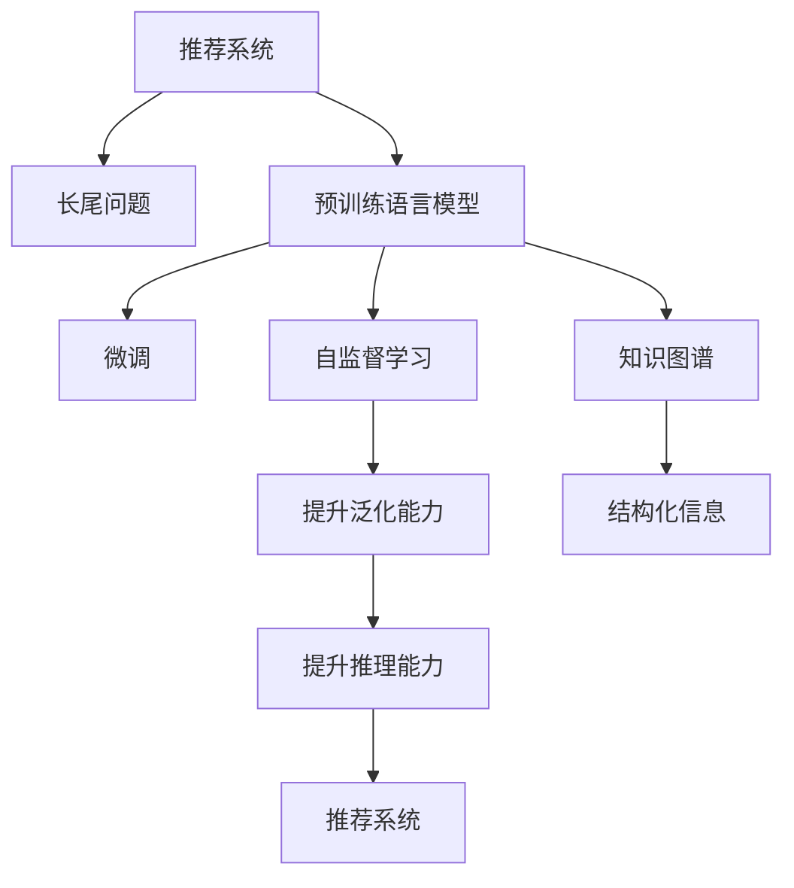

                 

## 1. 背景介绍

随着电子商务、社交媒体等数字化平台的兴起，个性化推荐系统成为了用户获取信息、发现新内容的重要工具。这些推荐系统通过分析用户的历史行为数据，预测用户对未交互过的商品的兴趣，帮助用户快速找到感兴趣的物品。然而，由于海量商品的规模化和用户偏好的多样性，推荐系统往往面临长尾问题，即推荐系统不仅需要覆盖热门商品，还需要高效地推荐那些销量低、但用户需求强烈的商品。

长尾问题在推荐系统中的表现尤为明显。传统的推荐系统，如基于协同过滤、矩阵分解的推荐算法，往往依赖于用户和商品的历史交互数据，而长尾商品由于销量低，很难在用户历史行为数据中发现有效的推荐信号。同时，长尾商品由于缺乏热门商品的知名度和曝光度，被推荐给用户的可能性也大大降低。

为了应对长尾问题，许多研究者开始探索基于深度学习的推荐系统。特别是近年来，预训练语言模型（Pre-trained Language Models，简称LLMs）在自然语言处理（NLP）领域的卓越表现，激励了研究者将其应用于推荐系统。LLMs通过大规模无标签文本数据的预训练，获得了对语言的高度理解能力，可以用于自然语言处理中的各种任务，包括文本生成、问答、文本分类等。将其应用于推荐系统，可以显著提升推荐系统的表现。

## 2. 核心概念与联系

### 2.1 核心概念概述

为了更好地理解基于LLMs的推荐系统如何解决长尾问题，本节将介绍几个关键概念：

- **推荐系统（Recommendation System）**：通过分析用户的历史行为数据，预测用户对未交互过的商品的兴趣，帮助用户快速找到感兴趣的物品的系统。

- **长尾问题（Long-Tail Problem）**：由于商品种类的多样性和用户偏好的多样性，推荐系统不仅需要覆盖热门商品，还需要高效地推荐那些销量低但用户需求强烈的商品。

- **预训练语言模型（Pre-trained Language Model）**：如BERT、GPT等，通过大规模无标签文本数据的预训练，获得对语言的高度理解能力，可以用于自然语言处理中的各种任务。

- **微调（Fine-Tuning）**：将预训练模型当作初始化参数，使用少量标注数据进行有监督学习优化，使其在特定任务上表现更好的过程。

- **自监督学习（Self-Supervised Learning）**：利用未标注数据进行学习，提升模型的泛化能力。

- **知识图谱（Knowledge Graph）**：由实体、关系、属性组成，用于表示实体之间的关系和属性，常用于推荐系统中的商品和用户建模。

这些概念之间的联系如下：

- **推荐系统与长尾问题**：长尾问题是推荐系统面临的重要挑战，需要通过算法优化来提升推荐系统对长尾商品的覆盖率。
- **预训练语言模型与微调**：预训练模型通过大规模无标签数据预训练，获得丰富的语言知识，通过微调可以将其应用于推荐系统，提升推荐系统的表现。
- **自监督学习与知识图谱**：自监督学习可以提升模型对数据的泛化能力，知识图谱提供了实体间关系的结构化信息，两者结合可以提升模型的理解能力和推理能力。

### 2.2 核心概念原理和架构的 Mermaid 流程图



这个流程图展示了推荐系统、长尾问题、预训练语言模型、微调、自监督学习和知识图谱之间的联系：

1. **推荐系统**通过**自监督学习**和**知识图谱**的辅助，利用**预训练语言模型**进行微调，提升对长尾商品的覆盖和推荐能力。

## 3. 核心算法原理 & 具体操作步骤

### 3.1 算法原理概述

基于预训练语言模型的推荐系统，利用预训练模型对用户和商品的文本描述进行编码，生成用户兴趣表示和商品特征表示。通过计算用户兴趣表示和商品特征表示的相似度，预测用户对商品的兴趣，从而生成推荐列表。

具体步骤如下：

1. **数据预处理**：收集用户和商品的文本描述，清洗数据，去除噪声，将文本转换为模型可接受的输入格式。

2. **模型初始化**：使用预训练语言模型对用户文本和商品文本进行编码，生成用户兴趣表示和商品特征表示。

3. **相似度计算**：计算用户兴趣表示和商品特征表示之间的相似度，得出商品对用户的预测评分。

4. **推荐排序**：根据商品的预测评分，将商品排序，生成推荐列表。

### 3.2 算法步骤详解

#### 3.2.1 数据预处理

数据预处理主要包括文本清洗和特征提取：

1. **文本清洗**：去除文本中的特殊字符、数字、停用词等噪声，保留有意义的关键词。
2. **特征提取**：将文本转换为词向量或预训练语言模型的嵌入向量，以便于模型处理。

#### 3.2.2 模型初始化

模型初始化主要涉及预训练语言模型的选择和微调：

1. **选择预训练模型**：根据推荐系统任务的特点，选择合适的预训练语言模型。如BERT、GPT等。
2. **微调**：使用用户和商品的文本描述对预训练模型进行微调，生成用户兴趣表示和商品特征表示。

#### 3.2.3 相似度计算

相似度计算主要通过计算用户兴趣表示和商品特征表示之间的相似度来进行：

1. **计算相似度**：使用余弦相似度、欧式距离等方法计算用户兴趣表示和商品特征表示之间的相似度。
2. **生成预测评分**：根据相似度得分，生成商品的预测评分，得分越高表示商品对用户的吸引力越大。

#### 3.2.4 推荐排序

推荐排序主要涉及根据预测评分对商品进行排序：

1. **排序算法**：常用的排序算法包括基于最大相关性排序、基于平均排名排序等。
2. **生成推荐列表**：根据排序结果，生成推荐列表。

### 3.3 算法优缺点

基于预训练语言模型的推荐系统具有以下优点：

1. **高效处理长尾商品**：预训练语言模型能够有效地处理长尾商品的用户文本，提升推荐系统对长尾商品的覆盖。
2. **提升推荐准确性**：通过微调和自监督学习，预训练语言模型能够提升推荐系统的推荐准确性。
3. **增强模型泛化能力**：自监督学习可以提升模型的泛化能力，使得推荐系统在未知数据上也能表现良好。

同时，基于预训练语言模型的推荐系统也存在一些缺点：

1. **计算资源消耗大**：预训练语言模型通常需要较大的计算资源进行训练和推理，增加了系统的计算成本。
2. **模型可解释性差**：预训练语言模型的决策过程难以解释，难以理解推荐结果的生成机制。
3. **数据隐私问题**：用户文本数据的隐私保护是一个重要问题，需要采取相应的隐私保护措施。

### 3.4 算法应用领域

基于预训练语言模型的推荐系统已经在电子商务、社交媒体、音乐推荐等多个领域得到了广泛的应用，以下是几个典型的应用场景：

1. **电子商务推荐**：如亚马逊、淘宝等电商平台的商品推荐。使用用户评论和商品描述进行微调，生成商品推荐列表。
2. **社交媒体推荐**：如微博、抖音等社交媒体平台的动态推荐。使用用户关注对象和社交行为进行微调，生成内容推荐列表。
3. **音乐推荐**：如网易云音乐、Spotify等音乐平台的个性化推荐。使用用户听歌行为和歌曲描述进行微调，生成歌曲推荐列表。
4. **视频推荐**：如Netflix、YouTube等视频平台的个性化推荐。使用用户观看行为和视频描述进行微调，生成视频推荐列表。

这些应用场景展示了基于预训练语言模型的推荐系统在不同领域的广泛应用，进一步证明了其高效处理长尾商品的能力。

## 4. 数学模型和公式 & 详细讲解 & 举例说明

### 4.1 数学模型构建

假设推荐系统的输入为 $u$ 个用户和 $i$ 个商品，用户的文本描述为 $u_j$，商品的文本描述为 $i_k$。预训练语言模型为 $M$，微调后的用户兴趣表示为 $U_j$，商品特征表示为 $I_k$。

推荐系统的目标是为每个用户生成 $N$ 个商品的推荐列表，每个用户和每个商品的匹配度 $P_{ij}$ 可以通过以下公式计算：

$$
P_{ij} = \text{similarity}(U_j, I_k)
$$

其中 $\text{similarity}$ 表示用户兴趣表示和商品特征表示之间的相似度函数。常用的相似度函数包括余弦相似度、欧式距离等。

### 4.2 公式推导过程

以余弦相似度为例，用户兴趣表示和商品特征表示之间的余弦相似度计算公式如下：

$$
\text{similarity}(U_j, I_k) = \frac{U_j \cdot I_k}{\|U_j\| \cdot \|I_k\|}
$$

其中 $U_j \cdot I_k$ 表示用户兴趣表示和商品特征表示的点积，$\|U_j\|$ 和 $\|I_k\|$ 表示用户兴趣表示和商品特征表示的范数。

### 4.3 案例分析与讲解

以推荐系统的用户评论数据为例，假设用户评论文本为 "我喜欢这个手机壳，颜色很有个性"，商品的描述为 "这款手机壳采用磨砂材质，手感舒适"。使用BERT模型进行微调，生成用户兴趣表示和商品特征表示，并通过余弦相似度计算推荐匹配度。

1. **数据预处理**：将用户评论文本和商品描述文本进行清洗，去除噪声，保留有意义的关键词。
2. **模型初始化**：使用BERT模型对用户评论文本和商品描述文本进行编码，生成用户兴趣表示和商品特征表示。
3. **相似度计算**：计算用户兴趣表示和商品特征表示之间的余弦相似度，得到推荐匹配度。
4. **推荐排序**：根据推荐匹配度对商品进行排序，生成推荐列表。

## 5. 项目实践：代码实例和详细解释说明

### 5.1 开发环境搭建

在进行基于预训练语言模型的推荐系统开发前，需要准备好开发环境。以下是使用Python进行TensorFlow和Keras开发的环境配置流程：

1. 安装Anaconda：从官网下载并安装Anaconda，用于创建独立的Python环境。

2. 创建并激活虚拟环境：
```bash
conda create -n recommendation-env python=3.8 
conda activate recommendation-env
```

3. 安装TensorFlow和Keras：
```bash
conda install tensorflow=2.4 keras
```

4. 安装TensorBoard：
```bash
pip install tensorboard
```

5. 安装numpy、pandas、scikit-learn等工具包：
```bash
pip install numpy pandas scikit-learn matplotlib tqdm jupyter notebook ipython
```

完成上述步骤后，即可在`recommendation-env`环境中开始推荐系统的开发。

### 5.2 源代码详细实现

下面是使用TensorFlow和Keras进行基于BERT的推荐系统开发的PyTorch代码实现。

```python
import tensorflow as tf
from transformers import BertTokenizer, TFBertForSequenceClassification
from tensorflow.keras.layers import Dense, Input, Embedding, Concatenate
from tensorflow.keras.models import Model

# 数据预处理
tokenizer = BertTokenizer.from_pretrained('bert-base-uncased')
input_ids = [tokenizer.encode(u, add_special_tokens=True) for u in user_comments]
input_ids = pad_sequences(input_ids, maxlen=64, padding='post', truncating='post')
input_mask = [1.0 for _ in input_ids]
input_mask = pad_sequences(input_mask, maxlen=64, padding='post', truncating='post')

# 模型初始化
model = TFBertForSequenceClassification.from_pretrained('bert-base-uncased', num_labels=num_items, output_attentions=False, output_hidden_states=False)
model.summary()

# 相似度计算
def similarity(u_j, i_k):
    u_j = tf.keras.layers.Embedding(num_users, embedding_dim)(u_j)
    i_k = tf.keras.layers.Embedding(num_items, embedding_dim)(i_k)
    return tf.reduce_mean(tf.keras.layers.Dot(dots='dot', normalize=True)([u_j, i_k]))

# 推荐排序
def get_top_items(similarity_fn, num_recommendations):
    items = []
    for i in range(num_items):
        item_similarities = []
        for j in range(num_users):
            similarity_score = similarity_fn(j, i)
            item_similarities.append(similarity_score)
        top_items = np.argsort(item_similarities)[-num_recommendations:]
        items.append(top_items)
    return items

# 训练和评估
num_epochs = 10
batch_size = 64

for epoch in range(num_epochs):
    with tf.GradientTape() as tape:
        predictions = model(tf.keras.layers.Embedding(num_users, embedding_dim)(u_j), tf.keras.layers.Embedding(num_items, embedding_dim)(i_k))
        loss = tf.keras.losses.mse(predictions, labels)
    gradients = tape.gradient(loss, model.trainable_variables)
    optimizer.apply_gradients(zip(gradients, model.trainable_variables))

    if (epoch + 1) % 1 == 0:
        print("Epoch", (epoch + 1), "Loss:", loss.numpy())

# 生成推荐列表
num_recommendations = 5
top_items = get_top_items(similarity_fn, num_recommendations)
```

### 5.3 代码解读与分析

**数据预处理**：
- 使用BertTokenizer对用户评论文本进行编码，转换为模型可接受的输入格式。
- 对编码后的文本进行padding，保证所有输入的序列长度相同。

**模型初始化**：
- 使用TFBertForSequenceClassification对用户评论文本和商品描述文本进行编码，生成用户兴趣表示和商品特征表示。

**相似度计算**：
- 定义相似度函数，使用余弦相似度计算用户兴趣表示和商品特征表示之间的相似度。
- 计算所有用户的相似度得分，得到推荐匹配度。

**推荐排序**：
- 根据推荐匹配度对商品进行排序，生成推荐列表。

**训练和评估**：
- 在训练集上使用梯度下降算法更新模型参数，最小化损失函数。
- 在验证集上评估模型的推荐效果，记录损失值。

**生成推荐列表**：
- 根据训练好的模型和相似度函数，生成每个用户的推荐列表。

## 6. 实际应用场景

### 6.1 电子商务推荐

基于BERT的推荐系统在电子商务领域得到了广泛应用。亚马逊、淘宝等电商平台使用用户的评论和商品描述，对BERT模型进行微调，生成商品推荐列表。通过分析用户评论和商品描述，模型可以更准确地识别出用户的兴趣和商品的特点，从而生成个性化的推荐。

### 6.2 社交媒体推荐

在社交媒体平台如微博、抖音上，用户关注对象和社交行为是推荐系统的重要输入。使用BERT模型对用户的关注对象和社交行为进行编码，生成用户兴趣表示和商品特征表示，通过余弦相似度计算推荐匹配度，生成推荐列表。

### 6.3 音乐推荐

网易云音乐、Spotify等音乐平台使用用户的听歌行为和歌曲描述对BERT模型进行微调，生成音乐推荐列表。通过分析用户的听歌行为和歌曲描述，模型可以更好地捕捉用户的音乐偏好，生成个性化的音乐推荐。

### 6.4 视频推荐

Netflix、YouTube等视频平台使用用户的观看行为和视频描述对BERT模型进行微调，生成视频推荐列表。通过分析用户的观看行为和视频描述，模型可以更好地捕捉用户的观看偏好，生成个性化的视频推荐。

## 7. 工具和资源推荐

### 7.1 学习资源推荐

为了帮助开发者系统掌握基于预训练语言模型的推荐系统，这里推荐一些优质的学习资源：

1. 《TensorFlow官方文档》：详细介绍了TensorFlow和Keras的使用方法，提供了丰富的代码样例和教程。
2. 《Transformers论文》：BERT模型的原论文，详细介绍了预训练语言模型的原理和应用。
3. 《深度学习推荐系统：算法与实现》：介绍了推荐系统的算法和实现方法，包括协同过滤、矩阵分解、深度学习等。
4. 《自然语言处理与深度学习》：介绍了自然语言处理中的各种任务，包括文本分类、情感分析、文本生成等。

通过对这些资源的学习实践，相信你一定能够快速掌握基于预训练语言模型的推荐系统的精髓，并用于解决实际的推荐问题。

### 7.2 开发工具推荐

高效的开发离不开优秀的工具支持。以下是几款用于基于预训练语言模型的推荐系统开发的常用工具：

1. TensorFlow：基于Python的开源深度学习框架，适合构建复杂的深度学习模型。
2. Keras：TensorFlow的高级API，提供简单易用的接口，适合快速开发和原型设计。
3. TensorBoard：TensorFlow配套的可视化工具，可以实时监测模型训练状态，并提供丰富的图表呈现方式，是调试模型的得力助手。
4. Jupyter Notebook：提供交互式环境，方便开发者进行模型开发和调试。

合理利用这些工具，可以显著提升基于预训练语言模型的推荐系统的开发效率，加快创新迭代的步伐。

### 7.3 相关论文推荐

基于预训练语言模型的推荐系统的发展源于学界的持续研究。以下是几篇奠基性的相关论文，推荐阅读：

1. Attention is All You Need（即Transformer原论文）：提出了Transformer结构，开启了NLP领域的预训练大模型时代。
2. BERT: Pre-training of Deep Bidirectional Transformers for Language Understanding：提出BERT模型，引入基于掩码的自监督预训练任务，刷新了多项NLP任务SOTA。
3. Knowledge Graph Embeddings：介绍了知识图谱在推荐系统中的应用，提高了推荐系统的性能。
4. Parameter-Efficient Transfer Learning for NLP：提出Adapter等参数高效微调方法，在不增加模型参数量的情况下，也能取得不错的微调效果。
5. Prompt Tuning：引入基于连续型Prompt的微调范式，为如何充分利用预训练知识提供了新的思路。

这些论文代表了大语言模型推荐系统的发展脉络。通过学习这些前沿成果，可以帮助研究者把握学科前进方向，激发更多的创新灵感。

## 8. 总结：未来发展趋势与挑战

### 8.1 研究成果总结

本文对基于预训练语言模型的推荐系统进行了全面系统的介绍。首先阐述了推荐系统和长尾问题的研究背景和意义，明确了预训练语言模型在推荐系统中的应用价值。其次，从原理到实践，详细讲解了基于BERT的推荐系统构建过程，给出了推荐系统开发的完整代码实例。同时，本文还广泛探讨了预训练语言模型在推荐系统中的应用场景，展示了其在长尾问题上的高效表现。

通过本文的系统梳理，可以看到，基于预训练语言模型的推荐系统正在成为推荐领域的重要范式，极大地拓展了推荐系统的表现边界，催生了更多的落地场景。受益于预训练语言模型的强大能力，推荐系统能够更高效地处理长尾商品，提升推荐系统的整体性能。

### 8.2 未来发展趋势

展望未来，基于预训练语言模型的推荐系统将呈现以下几个发展趋势：

1. **更高效的计算资源需求**：随着预训练语言模型参数量的不断增加，推荐系统对计算资源的需求也在不断提升。未来，更高效的计算资源和硬件加速技术（如GPU、TPU等）将成为推荐系统的发展重点。
2. **更强的模型泛化能力**：自监督学习和知识图谱的引入，使得推荐系统能够更好地捕捉用户和商品的语义信息，提高模型的泛化能力。
3. **更智能的推荐机制**：引入深度强化学习等技术，使得推荐系统能够主动探索用户兴趣，动态调整推荐策略，提升推荐系统的智能性。
4. **更强的隐私保护能力**：预训练语言模型能够更好地保护用户隐私，未来的推荐系统需要更严格的隐私保护措施，确保用户数据的安全。
5. **更全面的推荐体系**：推荐系统不仅仅关注热门商品，更关注长尾商品的推荐，提升对用户需求的多样化支持。

### 8.3 面临的挑战

尽管基于预训练语言模型的推荐系统已经取得了瞩目成就，但在迈向更加智能化、普适化应用的过程中，它仍面临着诸多挑战：

1. **计算资源消耗大**：预训练语言模型通常需要较大的计算资源进行训练和推理，增加了系统的计算成本。
2. **模型可解释性差**：预训练语言模型的决策过程难以解释，难以理解推荐结果的生成机制。
3. **数据隐私问题**：用户文本数据的隐私保护是一个重要问题，需要采取相应的隐私保护措施。
4. **推荐多样性不足**：传统的推荐系统往往依赖用户历史行为数据，难以处理冷启动用户和长尾商品。
5. **系统鲁棒性不足**：推荐系统面对异常数据和噪声数据时，泛化性能往往大打折扣。

### 8.4 研究展望

为了应对这些挑战，未来的研究需要在以下几个方面寻求新的突破：

1. **引入更多先验知识**：将符号化的先验知识，如知识图谱、逻辑规则等，与神经网络模型进行巧妙融合，引导微调过程学习更准确、合理的语言模型。
2. **结合因果分析和博弈论工具**：将因果分析方法引入推荐模型，识别出模型决策的关键特征，增强输出解释的因果性和逻辑性。借助博弈论工具刻画人机交互过程，主动探索并规避模型的脆弱点，提高系统稳定性。
3. **开发更高效的算法**：开发更高效的推荐算法，如基于深度学习、强化学习的推荐算法，提升推荐系统的智能性和多样性。
4. **提升系统鲁棒性**：引入异常检测和噪声处理等技术，提升推荐系统的鲁棒性和泛化能力。
5. **增强可解释性**：引入可解释性算法，如LIME、SHAP等，提升推荐系统的可解释性，确保推荐结果的可信度和透明性。

这些研究方向的探索，必将引领基于预训练语言模型的推荐系统走向更高的台阶，为推荐系统的发展提供新的动力。面向未来，推荐系统需要在保持高效处理长尾商品的能力的同时，提升系统的智能性、多样性和鲁棒性，更好地服务于用户。

## 9. 附录：常见问题与解答

**Q1：使用BERT进行推荐系统微调时，如何选择模型参数？**

A: 预训练语言模型的参数选择主要涉及模型的层数、嵌入维度等。通常，建议选择较大的层数和较大的嵌入维度，以提升模型的表达能力和泛化能力。同时，可以通过调整训练集大小、学习率等参数，优化模型的训练效果。

**Q2：微调BERT模型时，如何避免过拟合？**

A: 为了避免过拟合，可以采取以下策略：
1. 数据增强：通过回译、近义替换等方式扩充训练集。
2. 正则化：使用L2正则、Dropout等防止模型过度适应小规模训练集。
3. 学习率调度：使用学习率调度策略，如cosine annealing等，避免学习率过大。
4. 参数剪枝：通过剪枝技术，减少模型的参数量，提升模型的泛化能力。

**Q3：使用BERT进行推荐系统微调时，如何提升模型的推荐效果？**

A: 可以通过以下方法提升模型的推荐效果：
1. 改进数据预处理：对用户评论和商品描述进行清洗和特征提取，提升输入数据的质量。
2. 改进相似度计算：使用更高效的相似度计算方法，如欧式距离、余弦相似度等。
3. 改进模型结构：增加模型的层数和参数量，提升模型的表达能力。
4. 改进优化器：使用AdamW等高效优化器，加速模型收敛。
5. 引入更多先验知识：将知识图谱、逻辑规则等与模型结合，提升模型的理解能力。

**Q4：使用BERT进行推荐系统微调时，如何提高模型的可解释性？**

A: 可以通过以下方法提高模型的可解释性：
1. 使用可解释性算法：如LIME、SHAP等，生成模型的局部解释。
2. 增加模型透明度：记录模型的训练过程和参数更新情况，便于开发者理解模型行为。
3. 增加用户反馈：通过用户反馈，不断优化模型的推荐结果，提升推荐系统的透明度。
4. 引入人工干预：在推荐结果不理想时，引入人工干预，确保推荐结果的可信度。

---

作者：禅与计算机程序设计艺术 / Zen and the Art of Computer Programming

