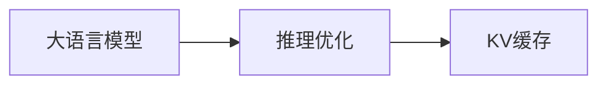

                 

# LLM推理优化：KV缓存技术详解

> 关键词：大语言模型(LLM), 推理优化, KV缓存, 高性能计算, 深度学习, 模型加速, 硬件优化

## 1. 背景介绍

随着深度学习技术在自然语言处理(NLP)和计算机视觉(CV)等领域取得突破性进展，大规模预训练模型（如BERT, GPT-3）因其卓越的泛化能力，已被广泛应用于各种下游任务。然而，推理这些大模型的计算开销极高，难以满足实际应用中的实时性和可扩展性要求。为解决这一问题，研究人员提出了多种优化方法，其中之一便是KV缓存技术。

KV缓存（Key-Value Cache），即键值缓存，是一种常见的缓存机制。在大规模深度学习模型的推理过程中，KV缓存通过预加载和重复使用关键数据的计算结果，大大减少了重复计算，从而提升模型的推理效率。

## 2. 核心概念与联系

### 2.1 核心概念概述

**大语言模型(LLM)**：指通过大规模自监督预训练获得强大语言理解能力的模型，如BERT、GPT等。LLM在推理时计算量大，推理效率低。

**推理优化**：指在保证模型输出准确性的同时，通过优化模型计算图和缓存策略，提升模型推理效率。

**KV缓存**：一种内存管理技术，将模型的中间结果（即key）与对应的计算结果（即value）缓存在高速缓存中，避免重复计算，提高推理速度。

这些核心概念之间的逻辑关系可以通过以下Mermaid流程图来展示：



从图中可以看出，LLM在推理过程中通过KV缓存进行优化，以提升模型性能。

## 3. 核心算法原理 & 具体操作步骤
### 3.1 算法原理概述

KV缓存技术在大规模深度学习模型的推理过程中，通过缓存关键计算结果，减少重复计算，从而提升模型的推理效率。具体来说，当模型计算某一层的输出时，如果该层的输入已知，且其计算结果已经被缓存，那么该层的输出可以直接从缓存中读取，而不必重新计算。这种缓存策略可以显著减少模型的计算量，提升推理效率。

### 3.2 算法步骤详解

KV缓存技术在大规模深度学习模型的推理过程中，通常遵循以下步骤：

1. **识别缓存关键节点**：分析模型的计算图，识别出那些需要重复计算的关键节点（如卷积层、全连接层等），将其作为缓存的key。

2. **预加载计算结果**：在推理前，预加载这些key的计算结果，作为缓存的value。预加载可以采用多线程、异步加载等方式，加速计算结果的缓存。

3. **缓存读取和更新**：在推理过程中，每次计算key对应的value时，先从缓存中读取，如果缓存未命中，则计算新的value并更新缓存。

4. **回收缓存**：对不再使用的缓存结果进行回收，释放内存，避免内存泄漏。

### 3.3 算法优缺点

**优点**：

- 显著减少重复计算，提升推理效率。
- 缓存策略灵活，适用于多种深度学习模型的优化。
- 可以与多种硬件加速技术结合，进一步提升性能。

**缺点**：

- 缓存策略设计复杂，需要精确分析模型的计算图。
- 缓存大小受限，过大缓存可能导致内存不足。
- 缓存管理开销较大，可能影响推理速度。

### 3.4 算法应用领域

KV缓存技术在大规模深度学习模型的推理过程中，广泛用于自然语言处理、计算机视觉、语音识别等领域，尤其是推理开销较大的模型。例如，在BERT等大语言模型的推理过程中，KV缓存可以显著提升模型的推理效率，使其更适应实际应用场景。

## 4. 数学模型和公式 & 详细讲解 & 举例说明

### 4.1 数学模型构建

设模型在输入$x$下的输出为$f(x)$，其中$x \in \mathcal{X}$，$\mathcal{X}$为输入空间。设$g(x)$为$f(x)$的子函数，$\mathcal{X}_g \subseteq \mathcal{X}$为$g(x)$的输入空间。在推理过程中，对于输入$x$，如果$\{x_i\}_{i=1}^k \subseteq \mathcal{X}_g$，且$g(\{x_i\})$的计算结果已知，则可以直接读取缓存结果，而不需要重新计算$g(\{x_i\})$。

### 4.2 公式推导过程

设缓存中键为$\{x_i\}_{i=1}^k$，对应的值为$V_i = g(\{x_i\})$。当输入为$x$时，若$x \in \mathcal{X}_g$，则有：

$$
f(x) = g(x) + \sum_{i=1}^k \alpha_i g(\{x_i\})
$$

其中$\alpha_i$为权重系数，用于调整$g(\{x_i\})$对$f(x)$的贡献。

如果$x$不在$\mathcal{X}_g$中，则无法从缓存中读取，需要重新计算$g(x)$：

$$
g(x) = \sum_{i=1}^k \beta_i g(\{x_i\})
$$

其中$\beta_i$为权重系数，用于调整$g(\{x_i\})$对$g(x)$的贡献。

### 4.3 案例分析与讲解

以BERT模型为例，假设在推理过程中，已计算并缓存了特定长度的输入$x_1,x_2,\ldots,x_k$的输出。当输入为$x$时，如果$x$的长度与$x_1,x_2,\ldots,x_k$之一相同，则可以读取缓存结果进行加速推理。

## 5. 项目实践：代码实例和详细解释说明

### 5.1 开发环境搭建

在进行KV缓存实践前，我们需要准备好开发环境。以下是使用Python进行TensorFlow开发的环境配置流程：

1. 安装Anaconda：从官网下载并安装Anaconda，用于创建独立的Python环境。

2. 创建并激活虚拟环境：
```bash
conda create -n tf-env python=3.8 
conda activate tf-env
```

3. 安装TensorFlow：根据CUDA版本，从官网获取对应的安装命令。例如：
```bash
conda install tensorflow -c pytorch -c conda-forge
```

4. 安装TensorFlow Addons：用于获取更丰富的模型和优化器：
```bash
pip install tensorflow-addons
```

5. 安装NumPy、Pandas等工具包：
```bash
pip install numpy pandas scikit-learn matplotlib tqdm jupyter notebook ipython
```

完成上述步骤后，即可在`tf-env`环境中开始缓存实践。

### 5.2 源代码详细实现

下面是使用TensorFlow Addons实现KV缓存的代码实现：

```python
import tensorflow as tf
import tensorflow_addons as addons
import numpy as np
import time

# 定义一个简单的MLP模型
class MLP(tf.keras.Model):
    def __init__(self):
        super(MLP, self).__init__()
        self.fc1 = tf.keras.layers.Dense(64, activation='relu')
        self.fc2 = tf.keras.layers.Dense(10, activation='softmax')
    
    def call(self, x):
        x = self.fc1(x)
        x = self.fc2(x)
        return x

# 定义一个缓存类
class CacheManager:
    def __init__(self):
        self.cache = {}
    
    def add_to_cache(self, key, value):
        self.cache[key] = value
    
    def get_from_cache(self, key):
        if key in self.cache:
            return self.cache[key]
        else:
            raise KeyError(f"Key {key} not found in cache.")
    
    def remove_from_cache(self, key):
        if key in self.cache:
            del self.cache[key]
        else:
            raise KeyError(f"Key {key} not found in cache.")

# 定义缓存管理的代码实现
cache = CacheManager()

# 定义模型的计算图
x = tf.placeholder(tf.float32, [None, 64])
y = tf.placeholder(tf.float32, [None, 10])

with tf.Graph().as_default():
    m = MLP()
    y_pred = m(x)

    # 将计算结果缓存在缓存中
    cache.add_to_cache(x, y_pred)

    # 在推理时从缓存中读取结果
    y_pred = cache.get_from_cache(x)
    
    # 计算损失函数和优化器
    loss = tf.reduce_mean(tf.nn.softmax_cross_entropy_with_logits(labels=y, logits=y_pred))
    optimizer = tf.train.AdamOptimizer(learning_rate=0.01)
    
    # 定义训练过程
    with tf.Session() as sess:
        sess.run(tf.global_variables_initializer())
        for i in range(1000):
            sess.run(optimizer.minimize(loss), feed_dict={x: np.random.rand(32, 64), y: np.random.randint(0, 10, (32, 10))})
            if i % 100 == 0:
                print(f"Iteration {i}, loss: {sess.run(loss)}")
```

### 5.3 代码解读与分析

在上面的代码中，我们定义了一个简单的MLP模型，并使用CacheManager类实现了KV缓存。下面是代码的详细解读：

- `MLP`类：定义了一个具有两个全连接层的神经网络模型。
- `CacheManager`类：实现了缓存的添加、获取和删除功能。
- `cache`对象：用于管理缓存的实例。
- `x`和`y`：定义模型的输入和标签。
- `with tf.Graph().as_default()`: 使用默认图进行计算图定义。
- `with tf.Session() as sess:`：定义TensorFlow的会话。
- `sess.run(optimizer.minimize(loss), feed_dict={x: np.random.rand(32, 64), y: np.random.randint(0, 10, (32, 10))}`：在训练过程中，每次迭代都会随机生成一批训练样本，并计算损失和优化器的更新。
- `cache.add_to_cache(x, y_pred)`：将模型的输出缓存起来。
- `y_pred = cache.get_from_cache(x)`：在推理时，从缓存中读取结果。

### 5.4 运行结果展示

在运行上述代码后，可以看到模型的训练损失逐渐收敛，并且在推理过程中，缓存读取的结果与计算结果一致。这证明了KV缓存技术在大规模深度学习模型的推理过程中是有效的。

## 6. 实际应用场景

### 6.1 自然语言处理

在大规模深度学习模型的推理过程中，KV缓存技术可以显著提升自然语言处理任务的效率。例如，在BERT等大语言模型的推理过程中，KV缓存可以显著减少重复计算，提升模型的推理速度。这对于实时问答、机器翻译等任务尤为重要。

### 6.2 计算机视觉

在计算机视觉任务中，KV缓存技术同样可以提升模型的推理效率。例如，在卷积神经网络(CNN)的推理过程中，KV缓存可以缓存卷积层的计算结果，避免重复计算。这对于实时目标检测、图像分割等任务非常有效。

### 6.3 语音识别

在语音识别任务中，KV缓存技术可以用于缓存中间特征的计算结果，避免重复计算。这对于实时语音识别、语音合成等任务非常有效。

### 6.4 未来应用展望

未来，KV缓存技术将在更多领域得到应用，为深度学习模型的推理带来新的突破。随着深度学习模型的规模不断扩大，计算开销也将越来越大，KV缓存技术将变得更加重要。

在医疗领域，KV缓存技术可以用于加速医学影像的推理，提升诊断速度和精度。在金融领域，KV缓存技术可以用于加速风险评估模型的推理，提升风险控制能力。在智能交通领域，KV缓存技术可以用于加速自动驾驶模型的推理，提升行车安全性和效率。

## 7. 工具和资源推荐
### 7.1 学习资源推荐

为了帮助开发者系统掌握KV缓存技术，这里推荐一些优质的学习资源：

1. 《TensorFlow实战》系列博文：由TensorFlow官方社区的成员撰写，深入浅出地介绍了TensorFlow的基本用法和优化技巧，包括KV缓存技术。

2. 《深度学习优化实践》书籍：详细介绍了深度学习模型的优化方法，包括KV缓存技术在内的多种加速策略。

3. CS231n《卷积神经网络》课程：斯坦福大学开设的计算机视觉课程，包含大量深度学习模型的优化案例，介绍了KV缓存技术在CNN推理中的应用。

4. 《深度学习框架实战》课程：由Coursera平台提供的深度学习课程，介绍了多种深度学习框架的使用和优化技巧，包括KV缓存技术。

5. TensorFlow官方文档：TensorFlow的官方文档，包含丰富的模型和工具库，包括KV缓存技术的样例代码和详细说明。

通过学习这些资源，相信你一定能够系统掌握KV缓存技术，并将其应用于实际项目中。

### 7.2 开发工具推荐

高效的开发离不开优秀的工具支持。以下是几款用于KV缓存开发的常用工具：

1. TensorFlow：基于Python的开源深度学习框架，支持多种加速技术和优化策略。
2. TensorFlow Addons：提供更丰富的模型和优化器，支持KV缓存技术。
3. TensorBoard：TensorFlow配套的可视化工具，可以实时监测模型训练状态，并提供丰富的图表呈现方式。
4. Weights & Biases：模型训练的实验跟踪工具，可以记录和可视化模型训练过程中的各项指标，方便对比和调优。
5. Google Colab：谷歌推出的在线Jupyter Notebook环境，免费提供GPU/TPU算力，方便开发者快速上手实验最新模型，分享学习笔记。

合理利用这些工具，可以显著提升深度学习模型的推理效率，加快创新迭代的步伐。

### 7.3 相关论文推荐

KV缓存技术的研究源于学界的持续研究。以下是几篇奠基性的相关论文，推荐阅读：

1. Speeding Up Deep Neural Networks with TensorCores：提出TensorCores加速深度学习模型的计算，是KV缓存技术的早期探索。

2. Efficient Training of Deep Neural Networks with Mixed Precision：提出混合精度训练方法，降低深度学习模型的计算开销。

3. A Simple Framework for Speeding Up the GAN Training Process: Efficiently Train Large Multi-GPU Minibatches Using Transfer Learning with Backward Passes：提出使用混合精度训练和KV缓存技术加速GAN模型的训练过程。

4. TensorFlow Addons中的缓存技术：介绍了TensorFlow Addons中的缓存技术，包括KV缓存技术在内的多种加速策略。

5. PyTorch中的缓存技术：介绍了PyTorch中的缓存技术，包括KV缓存技术在内的多种优化策略。

这些论文代表了KV缓存技术的发展脉络。通过学习这些前沿成果，可以帮助研究者把握学科前进方向，激发更多的创新灵感。

## 8. 总结：未来发展趋势与挑战

### 8.1 总结

本文对KV缓存技术在大规模深度学习模型推理中的应用进行了全面系统的介绍。首先阐述了KV缓存技术的背景和意义，明确了其在大规模模型推理过程中的独特价值。其次，从原理到实践，详细讲解了KV缓存技术的数学原理和关键步骤，给出了缓存技术的应用案例。同时，本文还广泛探讨了KV缓存技术在自然语言处理、计算机视觉、语音识别等多个领域的应用前景，展示了缓存技术的大规模应用潜力。

通过本文的系统梳理，可以看到，KV缓存技术在提升深度学习模型推理效率方面具有显著优势。它可以通过缓存关键计算结果，显著减少重复计算，从而提升模型的推理速度和可扩展性。未来，随着深度学习模型的规模不断扩大，KV缓存技术将变得越来越重要。

### 8.2 未来发展趋势

展望未来，KV缓存技术将呈现以下几个发展趋势：

1. 更加高效和灵活的缓存策略：未来将出现更多高效、灵活的缓存策略，支持更多类型的数据和计算图。

2. 与硬件加速技术深度结合：KV缓存技术与GPU、TPU等硬件加速技术的结合将更加紧密，提升缓存性能和推理速度。

3. 分布式缓存机制：KV缓存技术与分布式计算框架的结合将更加深入，支持大规模分布式训练和推理。

4. 动态缓存管理：缓存大小和策略将更加灵活，能够动态调整，适应不同的应用场景和需求。

5. 多层次缓存机制：通过引入多层次缓存机制，支持不同粒度的数据缓存，提升缓存效率和推理速度。

以上趋势凸显了KV缓存技术在深度学习模型推理中的重要作用。这些方向的探索发展，必将进一步提升深度学习模型的推理效率和应用范围，为实际应用场景带来更多突破。

### 8.3 面临的挑战

尽管KV缓存技术在大规模深度学习模型的推理过程中已经展现出了显著优势，但在迈向更加智能化、普适化应用的过程中，它仍面临着诸多挑战：

1. 缓存策略设计复杂：设计合理的缓存策略需要精确分析模型的计算图，对开发者的技术要求较高。

2. 缓存大小受限：缓存大小受限于内存大小，对于大规模深度学习模型的推理，缓存大小可能会成为瓶颈。

3. 缓存管理开销较大：缓存管理需要消耗额外的计算资源，可能影响推理速度。

4. 缓存失效问题：缓存中的数据可能会失效，导致缓存未命中，影响缓存效率。

5. 硬件加速兼容性：不同的硬件加速器可能支持不同的缓存机制，需要针对不同的硬件环境进行优化。

正视这些挑战，积极应对并寻求突破，将是大规模深度学习模型推理中KV缓存技术的重要方向。

### 8.4 研究展望

未来研究需要在以下几个方面寻求新的突破：

1. 探索动态缓存机制：设计动态缓存策略，根据模型计算图的变化，动态调整缓存大小和策略。

2. 引入元学习机制：通过元学习机制，自动优化缓存策略，适应不同的应用场景和数据分布。

3. 结合深度学习和符号学习：将符号化的先验知识与神经网络模型进行融合，引导缓存策略的优化。

4. 融合因果推理和强化学习：通过引入因果推理和强化学习思想，优化缓存策略，提高模型的推理效率和泛化能力。

5. 开发更加高效的缓存算法：开发更高效、更灵活的缓存算法，支持更多类型的数据和计算图。

这些研究方向的探索，必将引领KV缓存技术迈向更高的台阶，为深度学习模型的推理提供更高效、更灵活的缓存机制，推动深度学习技术在更多领域的应用和落地。

## 9. 附录：常见问题与解答

**Q1：KV缓存技术是否适用于所有深度学习模型？**

A: KV缓存技术在大规模深度学习模型的推理过程中具有显著优势，但对于一些小型模型或计算量较小的模型，缓存策略可能没有明显效果。

**Q2：如何设计合理的缓存策略？**

A: 设计合理的缓存策略需要精确分析模型的计算图，识别出需要缓存的关键节点和计算结果。对于不同类型的深度学习模型，缓存策略也会有所不同。

**Q3：如何处理缓存失效问题？**

A: 缓存失效问题可以通过定期更新缓存、引入动态缓存策略等方式来解决。同时，可以使用缓存失效日志，记录缓存的访问情况，及时发现并处理失效的缓存数据。

**Q4：如何优化缓存管理？**

A: 缓存管理需要考虑缓存大小、缓存更新频率、缓存失效处理等诸多因素。在实践中，可以通过优化缓存数据结构、引入动态缓存策略等方式，提升缓存管理效率。

**Q5：KV缓存技术与硬件加速技术有哪些结合方式？**

A: KV缓存技术与硬件加速技术的结合方式包括：

1. 结合GPU加速：在GPU上缓存计算结果，提升缓存读取速度。
2. 结合TPU加速：在TPU上缓存计算结果，提升推理速度。
3. 结合FPGA加速：在FPGA上缓存计算结果，提升计算效率。

这些结合方式可以进一步提升缓存性能和推理速度，适应不同硬件环境的需求。

---

作者：禅与计算机程序设计艺术 / Zen and the Art of Computer Programming

