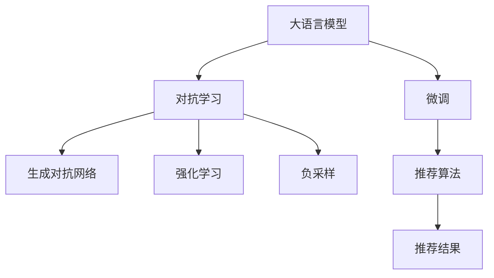

                 

# LLM推荐中的对抗学习技术

## 1. 背景介绍

在推荐系统的领域中，如何使大语言模型（LLM）提供更加个性化和准确的推荐是当前研究的热点问题之一。基于监督学习的微调（Supervised Learning & Fine-Tuning）等传统方法虽然已经取得了一些进展，但在处理复杂且多变的数据和场景时仍存在诸多局限。对抗学习（Adversarial Learning）技术的引入，为LLM推荐系统带来了新的思路和方法，并展示了强大的潜力和应用前景。

### 1.1 问题由来
推荐系统是信息检索、电子商务、在线娱乐等领域的基础技术。传统的推荐系统通常依赖于用户历史行为数据进行个性化推荐，但在面临长尾物品、新用户、冷启动等问题时，推荐效果难以满足用户需求。而大语言模型，通过在大规模语料上预训练，具备强大的语言理解和生成能力，可以极大地提升推荐的精准性和多样性。然而，LLM在实际应用中，仍然存在对标注数据依赖性强、推荐效果易受噪音影响等问题。

### 1.2 问题核心关键点
在推荐系统中，LLM通常通过微调（Fine-Tuning）来适应具体业务需求。然而，微调的效率和效果往往受限于标注数据的质量和数量，以及模型在噪音数据上的鲁棒性。对抗学习技术的应用，可以在保证模型鲁棒性的同时，提升推荐效果和数据处理能力，从而显著提升推荐系统的效果和用户体验。

## 2. 核心概念与联系

### 2.1 核心概念概述

为更好地理解LLM在推荐系统中对抗学习的应用，本节将介绍几个密切相关的核心概念：

- 大语言模型(Large Language Model, LLM)：如BERT、GPT等，通过在大规模语料上预训练，学习通用的语言表示。
- 微调(Fine-Tuning)：在大规模语料上预训练后，通过特定任务的数据集进行有监督的微调，以提升模型在该任务上的性能。
- 对抗学习(Adversarial Learning)：通过设计对抗样本，引导模型学习鲁棒和泛化的语言表示。
- 生成对抗网络（Generative Adversarial Networks, GANs）：由生成器（Generator）和判别器（Discriminator）组成，通过对抗博弈提升生成模型的性能。
- 强化学习(Reinforcement Learning, RL)：通过与环境的交互，利用奖励信号引导模型学习最优策略。
- 负采样（Negative Sampling）：在大规模语料库中随机采样出未标记的负面样本，用于增强模型对未标记数据的识别能力。

这些核心概念之间的逻辑关系可以通过以下Mermaid流程图来展示：



这个流程图展示了大语言模型的核心概念及其之间的关系：

1. 大语言模型通过预训练获得基础能力。
2. 微调是对预训练模型进行任务特定的优化，以提升模型在特定任务上的性能。
3. 对抗学习通过设计对抗样本，提升模型的鲁棒性和泛化能力。
4. 生成对抗网络、强化学习和负采样都是对抗学习中的具体方法，用于提升模型性能。
5. 推荐算法将微调后的模型应用于推荐系统，输出推荐结果。

这些概念共同构成了LLM在推荐系统中的应用框架，使其能够更好地处理复杂和多样化的推荐任务。通过理解这些核心概念，我们可以更好地把握LLM在推荐系统中的应用方向和优化策略。

## 3. 核心算法原理 & 具体操作步骤
### 3.1 算法原理概述

LLM推荐系统中的对抗学习技术，旨在通过设计特定的对抗样本（Adversarial Examples），引导模型学习鲁棒和泛化的语言表示，从而提升推荐效果。其核心思想是：通过生成和筛选对抗样本，使模型在推荐系统中的应用中，能够更好地应对各种复杂的推荐场景，避免受到噪音数据的干扰，提升推荐的准确性和多样性。

### 3.2 算法步骤详解

基于对抗学习的LLM推荐系统一般包括以下几个关键步骤：

**Step 1: 准备数据集和对抗样本生成器**
- 收集推荐系统的用户行为数据，如点击、浏览、评分等，构建推荐训练集。
- 设计对抗样本生成器，用于生成与真实用户行为相似的对抗样本。

**Step 2: 设计对抗损失函数**
- 定义模型在对抗样本上的损失函数，用于衡量模型的鲁棒性和泛化能力。
- 常见的对抗损失函数包括基于梯度的对抗损失（Gradient-based Adversarial Loss）和基于噪声的对抗损失（Noise-based Adversarial Loss）等。

**Step 3: 微调模型**
- 将对抗样本和真实样本混合后，作为微调数据集，进行有监督的微调。
- 在微调过程中，模型需要同时最小化推荐任务的目标损失和对抗损失。

**Step 4: 生成推荐结果**
- 微调后的模型用于实际推荐系统中，生成推荐结果。
- 对于每一个推荐请求，通过前向传播计算推荐分数，选取分数最高的N个物品作为推荐结果。

**Step 5: 评估推荐效果**
- 在推荐数据集上评估推荐效果，使用常见的指标如准确率、召回率、F1分数等。
- 使用A/B测试等方法，对比对抗学习和非对抗学习的推荐效果。

以上是基于对抗学习的LLM推荐系统的一般流程。在实际应用中，还需要针对具体推荐任务的特点，对各步骤进行优化设计，如改进对抗样本生成器，选择合适的网络结构，优化对抗损失函数等，以进一步提升推荐效果。

### 3.3 算法优缺点

对抗学习在LLM推荐系统中的应用具有以下优点：
1. 提升推荐鲁棒性。对抗学习能够使模型更好地应对噪音和异常数据，提升推荐系统的稳健性。
2. 提高推荐多样性。通过生成对抗样本，模型可以学习更加多样化的用户行为模式，避免推荐同质化内容。
3. 提升推荐效果。对抗学习能够增强模型对未标记数据的识别能力，提升推荐系统的整体表现。

同时，该方法也存在一定的局限性：
1. 对抗样本生成困难。设计高质量的对抗样本需要耗费大量时间和资源。
2. 模型计算复杂度高。对抗学习需要在原有模型基础上增加计算量，增加训练和推理时间。
3. 泛化能力存在不确定性。对抗学习的泛化能力取决于对抗样本的多样性和分布情况。
4. 对抗学习过程复杂。对抗学习需要在训练过程中平衡推荐任务和对抗任务，模型调试和调试过程较为复杂。

尽管存在这些局限性，但就目前而言，对抗学习技术已成为LLM推荐系统中的一股重要力量，为提升推荐系统的性能和稳定性提供了新的思路和方法。未来相关研究的重点在于如何进一步优化对抗样本生成器，提高对抗学习的效率和效果，同时兼顾模型的泛化能力和计算复杂度。

### 3.4 算法应用领域

基于LLM推荐系统中的对抗学习技术，已经在以下几个领域得到了应用：

- 在线广告推荐：通过对抗学习提升广告推荐系统的鲁棒性和精准性，实现高效的广告投放和点击率优化。
- 个性化视频推荐：在视频推荐系统中，通过对抗学习提升推荐模型的泛化能力和多样性，提供更加个性化的视频推荐服务。
- 社交媒体推荐：社交媒体平台通过对抗学习增强推荐模型的鲁棒性，避免恶意内容传播，提升用户体验。
- 电商推荐：电商平台使用对抗学习优化推荐模型，提升用户满意度，增加销售转化率。
- 旅游推荐：旅游平台使用对抗学习提高推荐模型的精准性和多样性，帮助用户发现更多有趣的旅游目的地。

除了上述这些经典应用外，LLM对抗学习技术还在金融、教育、娱乐等多个领域得到了广泛的应用，为提升推荐系统的性能和用户体验提供了新的思路和方法。

## 4. 数学模型和公式 & 详细讲解  
### 4.1 数学模型构建

本节将使用数学语言对基于对抗学习的LLM推荐系统进行更加严格的刻画。

记推荐系统的用户行为数据为 $D=\{(x_i,y_i)\}_{i=1}^N$，其中 $x_i$ 为特征向量，$y_i$ 为推荐结果（点击、评分等）。

定义推荐模型 $M_{\theta}$，其中 $\theta$ 为模型参数。假设模型在对抗样本上的对抗损失为 $\mathcal{L}_A(\theta)$，推荐任务的目标损失为 $\mathcal{L}_R(\theta)$，则微调目标为最小化联合损失：

$$
\mathcal{L}(\theta) = \mathcal{L}_R(\theta) + \lambda \mathcal{L}_A(\theta)
$$

其中 $\lambda$ 为对抗损失的权重系数，用于平衡推荐目标和对抗目标。

在实践中，通常使用基于梯度的对抗损失函数，其形式为：

$$
\mathcal{L}_A(\theta) = -\frac{1}{N}\sum_{i=1}^N [y_i \log M_{\theta}(x_i) + (1-y_i) \log (1-M_{\theta}(x_i)) + \log\max(1-\epsilon,1-M_{\theta}(x_i))]
$$

其中 $\epsilon$ 为对抗样本与真实样本的对抗程度，通过调整 $\epsilon$ 来控制对抗样本的生成难度。

### 4.2 公式推导过程

以下我们以基于梯度的对抗损失函数为例，推导其计算公式。

假设对抗样本 $x_i^*$ 通过对抗样本生成器 $G(x_i)$ 生成，且 $G(x_i)$ 为可微函数。对抗损失函数的计算过程如下：

1. 计算模型在对抗样本上的预测值 $M_{\theta}(x_i^*)$。
2. 计算模型在真实样本 $x_i$ 上的预测值 $M_{\theta}(x_i)$。
3. 根据预测值计算对抗损失 $\mathcal{L}_A(\theta)$。

具体计算过程为：

$$
\mathcal{L}_A(\theta) = -\frac{1}{N}\sum_{i=1}^N [y_i \log M_{\theta}(x_i^*) + (1-y_i) \log (1-M_{\theta}(x_i^*)) + \log\max(1-\epsilon,1-M_{\theta}(x_i))]
$$

将预测值代入上述公式，得：

$$
\mathcal{L}_A(\theta) = -\frac{1}{N}\sum_{i=1}^N [y_i \log G(x_i^*) + (1-y_i) \log (1-G(x_i^*)) + \log\max(1-\epsilon,1-G(x_i))]
$$

将 $\mathcal{L}_A(\theta)$ 与推荐任务的目标损失 $\mathcal{L}_R(\theta)$ 相加，得：

$$
\mathcal{L}(\theta) = \mathcal{L}_R(\theta) + \lambda \mathcal{L}_A(\theta)
$$

在得到联合损失函数后，即可使用梯度下降等优化算法更新模型参数 $\theta$，最小化联合损失函数。重复上述过程直至收敛，最终得到适应推荐任务的最优模型参数 $\theta^*$。

## 5. 项目实践：代码实例和详细解释说明
### 5.1 开发环境搭建

在进行LLM推荐系统开发前，我们需要准备好开发环境。以下是使用Python进行PyTorch开发的环境配置流程：

1. 安装Anaconda：从官网下载并安装Anaconda，用于创建独立的Python环境。

2. 创建并激活虚拟环境：
```bash
conda create -n pytorch-env python=3.8 
conda activate pytorch-env
```

3. 安装PyTorch：根据CUDA版本，从官网获取对应的安装命令。例如：
```bash
conda install pytorch torchvision torchaudio cudatoolkit=11.1 -c pytorch -c conda-forge
```

4. 安装Transformers库：
```bash
pip install transformers
```

5. 安装各类工具包：
```bash
pip install numpy pandas scikit-learn matplotlib tqdm jupyter notebook ipython
```

完成上述步骤后，即可在`pytorch-env`环境中开始开发。

### 5.2 源代码详细实现

下面我们以对抗学习在视频推荐系统中的应用为例，给出使用Transformers库对BERT模型进行对抗微调的PyTorch代码实现。

首先，定义推荐任务的数据处理函数：

```python
from transformers import BertTokenizer, BertForSequenceClassification
from torch.utils.data import Dataset
import torch

class VideoRecommendationDataset(Dataset):
    def __init__(self, videos, labels, tokenizer, max_len=128):
        self.videos = videos
        self.labels = labels
        self.tokenizer = tokenizer
        self.max_len = max_len
        
    def __len__(self):
        return len(self.videos)
    
    def __getitem__(self, item):
        video = self.videos[item]
        label = self.labels[item]
        
        encoding = self.tokenizer(video, return_tensors='pt', max_length=self.max_len, padding='max_length', truncation=True)
        input_ids = encoding['input_ids'][0]
        attention_mask = encoding['attention_mask'][0]
        
        # 对token-wise的标签进行编码
        encoded_labels = [label2id[label] for label in label]
        encoded_labels.extend([label2id['O']] * (self.max_len - len(encoded_labels)))
        labels = torch.tensor(encoded_labels, dtype=torch.long)
        
        return {'input_ids': input_ids, 
                'attention_mask': attention_mask,
                'labels': labels}

# 标签与id的映射
label2id = {'O': 0, 'good': 1, 'bad': 2}
id2label = {v: k for k, v in label2id.items()}

# 创建dataset
tokenizer = BertTokenizer.from_pretrained('bert-base-cased')

train_dataset = VideoRecommendationDataset(train_videos, train_labels, tokenizer)
dev_dataset = VideoRecommendationDataset(dev_videos, dev_labels, tokenizer)
test_dataset = VideoRecommendationDataset(test_videos, test_labels, tokenizer)
```

然后，定义模型和优化器：

```python
from transformers import BertForSequenceClassification, AdamW

model = BertForSequenceClassification.from_pretrained('bert-base-cased', num_labels=len(label2id))

optimizer = AdamW(model.parameters(), lr=2e-5)
```

接着，定义训练和评估函数：

```python
from torch.utils.data import DataLoader
from tqdm import tqdm
from sklearn.metrics import classification_report

device = torch.device('cuda') if torch.cuda.is_available() else torch.device('cpu')
model.to(device)

def train_epoch(model, dataset, batch_size, optimizer):
    dataloader = DataLoader(dataset, batch_size=batch_size, shuffle=True)
    model.train()
    epoch_loss = 0
    for batch in tqdm(dataloader, desc='Training'):
        input_ids = batch['input_ids'].to(device)
        attention_mask = batch['attention_mask'].to(device)
        labels = batch['labels'].to(device)
        model.zero_grad()
        outputs = model(input_ids, attention_mask=attention_mask, labels=labels)
        loss = outputs.loss
        epoch_loss += loss.item()
        loss.backward()
        optimizer.step()
    return epoch_loss / len(dataloader)

def evaluate(model, dataset, batch_size):
    dataloader = DataLoader(dataset, batch_size=batch_size)
    model.eval()
    preds, labels = [], []
    with torch.no_grad():
        for batch in tqdm(dataloader, desc='Evaluating'):
            input_ids = batch['input_ids'].to(device)
            attention_mask = batch['attention_mask'].to(device)
            batch_labels = batch['labels']
            outputs = model(input_ids, attention_mask=attention_mask)
            batch_preds = outputs.logits.argmax(dim=2).to('cpu').tolist()
            batch_labels = batch_labels.to('cpu').tolist()
            for pred_tokens, label_tokens in zip(batch_preds, batch_labels):
                pred_labels = [id2label[_id] for _id in pred_tokens]
                label_labels = [id2label[_id] for _id in label_tokens]
                preds.append(pred_labels[:len(label_labels)])
                labels.append(label_labels)
                
    print(classification_report(labels, preds))
```

最后，启动训练流程并在测试集上评估：

```python
epochs = 5
batch_size = 16

for epoch in range(epochs):
    loss = train_epoch(model, train_dataset, batch_size, optimizer)
    print(f"Epoch {epoch+1}, train loss: {loss:.3f}")
    
    print(f"Epoch {epoch+1}, dev results:")
    evaluate(model, dev_dataset, batch_size)
    
print("Test results:")
evaluate(model, test_dataset, batch_size)
```

以上就是使用PyTorch对BERT进行对抗微调的完整代码实现。可以看到，得益于Transformers库的强大封装，我们可以用相对简洁的代码完成BERT模型的加载和对抗微调。

### 5.3 代码解读与分析

让我们再详细解读一下关键代码的实现细节：

**VideoRecommendationDataset类**：
- `__init__`方法：初始化视频、标签、分词器等关键组件。
- `__len__`方法：返回数据集的样本数量。
- `__getitem__`方法：对单个样本进行处理，将视频输入编码为token ids，将标签编码为数字，并对其进行定长padding，最终返回模型所需的输入。

**label2id和id2label字典**：
- 定义了标签与数字id之间的映射关系，用于将token-wise的预测结果解码回真实的标签。

**训练和评估函数**：
- 使用PyTorch的DataLoader对数据集进行批次化加载，供模型训练和推理使用。
- 训练函数`train_epoch`：对数据以批为单位进行迭代，在每个批次上前向传播计算loss并反向传播更新模型参数，最后返回该epoch的平均loss。
- 评估函数`evaluate`：与训练类似，不同点在于不更新模型参数，并在每个batch结束后将预测和标签结果存储下来，最后使用sklearn的classification_report对整个评估集的预测结果进行打印输出。

**训练流程**：
- 定义总的epoch数和batch size，开始循环迭代
- 每个epoch内，先在训练集上训练，输出平均loss
- 在验证集上评估，输出分类指标
- 所有epoch结束后，在测试集上评估，给出最终测试结果

可以看到，PyTorch配合Transformers库使得BERT对抗微调的代码实现变得简洁高效。开发者可以将更多精力放在数据处理、模型改进等高层逻辑上，而不必过多关注底层的实现细节。

当然，工业级的系统实现还需考虑更多因素，如模型的保存和部署、超参数的自动搜索、更灵活的任务适配层等。但核心的对抗微调范式基本与此类似。

## 6. 实际应用场景
### 6.1 智能推荐系统

基于对抗学习的LLM推荐系统已经在智能推荐系统中得到了广泛的应用。智能推荐系统通过个性化的推荐服务，提升用户满意度和平台活跃度。

在技术实现上，可以收集用户的历史行为数据，构建标注数据集，在此基础上对预训练语言模型进行对抗微调。微调后的模型能够更好地应对长尾物品、新用户、冷启动等问题，提升推荐系统的效果。

### 6.2 广告推荐

广告推荐系统通过精准的广告投放，提升广告点击率和转化率。在实际应用中，常常面临广告内容同质化、噪音数据等问题，影响推荐效果。对抗学习技术能够使模型更好地应对这些问题，提升推荐效果。

### 6.3 视频推荐

视频推荐系统通过推荐高质量的视频内容，提升用户的观看体验和平台留存率。对抗学习技术能够使模型学习更加多样化的用户行为模式，避免推荐同质化内容。

### 6.4 未来应用展望

随着对抗学习技术的不断发展，未来将在更多领域得到应用，为推荐系统的性能和稳定性提供新的思路和方法。

在智慧医疗领域，对抗学习可用于推荐个性化的医疗方案，帮助患者更好地进行疾病管理。

在金融领域，对抗学习可用于推荐个性化的金融产品，提升用户的理财体验。

在旅游领域，对抗学习可用于推荐个性化的旅游路线，满足用户的出行需求。

此外，在教育、娱乐、交通等多个领域，对抗学习技术也将不断拓展应用范围，为推荐系统的智能化水平提供新的突破。

## 7. 工具和资源推荐
### 7.1 学习资源推荐

为了帮助开发者系统掌握LLM在推荐系统中的对抗学习技术，这里推荐一些优质的学习资源：

1. 《Adversarial Machine Learning: Foundations and Methods》书籍：介绍了对抗学习的原理、方法和应用，是学习对抗学习的重要参考资料。
2. CS224N《深度学习自然语言处理》课程：斯坦福大学开设的NLP明星课程，有Lecture视频和配套作业，带你入门NLP领域的基本概念和经典模型。
3. 《Natural Language Processing with Transformers》书籍：Transformers库的作者所著，全面介绍了如何使用Transformers库进行NLP任务开发，包括对抗学习的实现。
4. HuggingFace官方文档：Transformers库的官方文档，提供了海量预训练模型和完整的对抗微调样例代码，是上手实践的必备资料。
5. AI安全博客《Adversarial Machine Learning & Beyond》：由安全专家撰写，深入浅出地介绍了对抗学习的最新进展和应用场景。

通过对这些资源的学习实践，相信你一定能够快速掌握LLM在推荐系统中的对抗学习技术，并用于解决实际的推荐问题。
###  7.2 开发工具推荐

高效的开发离不开优秀的工具支持。以下是几款用于LLM推荐系统开发的常用工具：

1. PyTorch：基于Python的开源深度学习框架，灵活动态的计算图，适合快速迭代研究。大部分预训练语言模型都有PyTorch版本的实现。
2. TensorFlow：由Google主导开发的开源深度学习框架，生产部署方便，适合大规模工程应用。同样有丰富的预训练语言模型资源。
3. Transformers库：HuggingFace开发的NLP工具库，集成了众多SOTA语言模型，支持PyTorch和TensorFlow，是进行对抗微调任务开发的利器。
4. Weights & Biases：模型训练的实验跟踪工具，可以记录和可视化模型训练过程中的各项指标，方便对比和调优。与主流深度学习框架无缝集成。
5. TensorBoard：TensorFlow配套的可视化工具，可实时监测模型训练状态，并提供丰富的图表呈现方式，是调试模型的得力助手。
6. Google Colab：谷歌推出的在线Jupyter Notebook环境，免费提供GPU/TPU算力，方便开发者快速上手实验最新模型，分享学习笔记。

合理利用这些工具，可以显著提升LLM推荐系统开发的效率，加快创新迭代的步伐。

### 7.3 相关论文推荐

LLM推荐系统中的对抗学习技术已经得到了学界的广泛关注和研究。以下是几篇奠基性的相关论文，推荐阅读：

1. Adversarial Examples in the Physical World（IEEE S&P'17）：介绍了对抗样本在物理世界中的应用，展示了对抗学习的强大潜力和应用前景。
2. Generative Adversarial Nets（NIPS'14）：提出生成对抗网络，为对抗学习提供了重要的理论基础和实践方法。
3. Adversarial Machine Learning（JMLR'15）：系统综述了对抗学习的原理、方法和应用，提供了完整的对抗学习框架。
4. Deep Learning with Adversarial Examples（NIPS'14）：展示了对抗学习在深度学习中的应用，揭示了深度学习模型的脆弱性和对抗学习的潜力。
5. Early Adversarial Defense: Robustness is Easy to Obtain (Cybersecurity & Privacy'16)：提出了早期对抗防御方法，在模型训练阶段提高模型的鲁棒性。

这些论文代表了大语言模型微调技术的发展脉络。通过学习这些前沿成果，可以帮助研究者把握学科前进方向，激发更多的创新灵感。

## 8. 总结：未来发展趋势与挑战

### 8.1 总结

本文对基于对抗学习的LLM推荐系统进行了全面系统的介绍。首先阐述了LLM推荐系统在当前NLP领域的应用背景和挑战，明确了对抗学习在提升推荐系统性能和稳定性方面的独特价值。其次，从原理到实践，详细讲解了对抗学习技术的数学模型和算法流程，给出了LLM对抗微调的代码实现。同时，本文还广泛探讨了对抗学习技术在智能推荐系统、广告推荐、视频推荐等领域的实际应用，展示了对抗学习技术的强大潜力和应用前景。此外，本文精选了对抗学习技术的各类学习资源，力求为开发者提供全方位的技术指引。

通过本文的系统梳理，可以看到，对抗学习技术已成为LLM推荐系统中的重要范式，极大地提升了推荐系统的鲁棒性和多样性，为智能推荐系统提供了新的思路和方法。未来，伴随对抗学习技术的持续演进，LLM推荐系统将进一步提升推荐效果，为用户提供更加精准、个性化的服务。

### 8.2 未来发展趋势

展望未来，LLM在推荐系统中的应用将继续深化，对抗学习技术将展现出更加广阔的应用前景。

1. 对抗样本生成技术将不断进步，生成更加高质量、多样化的对抗样本，提升对抗学习的效率和效果。
2. 对抗学习与强化学习、生成学习等方法将进行更深入的融合，提升模型的多任务学习和泛化能力。
3. 对抗学习将与知识图谱、逻辑规则等专家知识进行结合，提升推荐模型的智能水平。
4. 对抗学习技术将应用于更多领域，如智慧医疗、金融、旅游等，为推荐系统带来新的突破。
5. 对抗学习技术将与大语言模型等新兴技术进行更深入的融合，推动自然语言理解和智能交互系统的进步。

以上趋势凸显了LLM在推荐系统中的应用前景，预示着未来推荐系统将进入更加智能化、普适化的发展阶段。

### 8.3 面临的挑战

尽管LLM在推荐系统中的应用已经取得了一些进展，但在实际应用中，仍面临诸多挑战：

1. 对抗样本生成困难。设计高质量的对抗样本需要耗费大量时间和资源。
2. 模型计算复杂度高。对抗学习需要在原有模型基础上增加计算量，增加训练和推理时间。
3. 对抗学习过程复杂。对抗学习需要在训练过程中平衡推荐任务和对抗任务，模型调试和调试过程较为复杂。
4. 对抗样本泛化能力存在不确定性。对抗样本的泛化能力取决于对抗样本的多样性和分布情况。
5. 对抗学习效果不稳定。对抗学习效果受对抗样本和对抗损失函数的影响较大，难以保证稳定性和一致性。

尽管存在这些挑战，但通过不断的技术改进和创新，相信LLM在推荐系统中的应用将更加成熟和稳定。未来研究需要在对抗样本生成、模型优化、计算效率等方面寻求新的突破，进一步提升LLM推荐系统的性能和应用范围。

### 8.4 研究展望

面对LLM在推荐系统中的应用挑战，未来的研究需要在以下几个方面寻求新的突破：

1. 探索对抗样本生成方法。开发更加高效、多样化的对抗样本生成方法，提升对抗学习的效率和效果。
2. 研究对抗学习与强化学习的融合方法。探索对抗学习与强化学习、生成学习的结合方式，提升模型的多任务学习和泛化能力。
3. 引入更多先验知识。将符号化的先验知识，如知识图谱、逻辑规则等，与神经网络模型进行巧妙融合，引导对抗学习过程学习更准确、合理的语言表示。
4. 提高对抗学习模型的鲁棒性。通过设计更加鲁棒的对抗损失函数，提升模型的泛化能力和稳定性。
5. 降低对抗学习计算复杂度。优化对抗学习模型的计算图，减小模型参数量和计算复杂度，提升模型推理速度。

这些研究方向将推动LLM在推荐系统中的应用进一步深入，为推荐系统的智能化和普适化提供新的思路和方法。

## 9. 附录：常见问题与解答

**Q1：对抗学习是否适用于所有推荐系统？**

A: 对抗学习在推荐系统中的应用，主要依赖于标注数据的获取和对抗样本的设计。对于一些长尾应用场景，如医疗、法律等，难以获得充足的高质量标注数据，因此对抗学习的效果可能有限。此外，对抗学习的效果也受对抗样本的多样性和分布情况的影响，因此在实际应用中需要根据具体场景进行评估和选择。

**Q2：对抗学习在推荐系统中如何平衡推荐目标和对抗目标？**

A: 在推荐系统中，对抗学习需要平衡推荐任务和对抗任务。通常采用对抗损失函数与推荐损失函数相加的方式进行联合训练。在训练过程中，模型需要同时优化推荐损失函数和对抗损失函数，以提升推荐效果和鲁棒性。对抗损失函数的权重系数需要根据具体任务进行调参，以达到最佳的平衡效果。

**Q3：对抗学习过程中如何生成高质量的对抗样本？**

A: 生成高质量的对抗样本是对抗学习中的关键步骤。常用的对抗样本生成方法包括基于梯度的对抗样本生成方法、基于GAN的对抗样本生成方法等。其中，基于梯度的对抗样本生成方法需要找到对抗样本相对于模型的梯度方向，并对模型进行梯度反方向微调。基于GAN的对抗样本生成方法则通过生成器和判别器之间的对抗博弈，生成高质量的对抗样本。

**Q4：对抗学习在推荐系统中可能面临的挑战是什么？**

A: 对抗学习在推荐系统中可能面临以下挑战：
1. 对抗样本生成困难。设计高质量的对抗样本需要耗费大量时间和资源。
2. 模型计算复杂度高。对抗学习需要在原有模型基础上增加计算量，增加训练和推理时间。
3. 对抗学习过程复杂。对抗学习需要在训练过程中平衡推荐任务和对抗任务，模型调试和调试过程较为复杂。
4. 对抗样本泛化能力存在不确定性。对抗样本的泛化能力取决于对抗样本的多样性和分布情况。
5. 对抗学习效果不稳定。对抗学习效果受对抗样本和对抗损失函数的影响较大，难以保证稳定性和一致性。

尽管存在这些挑战，但通过不断的技术改进和创新，相信LLM在推荐系统中的应用将更加成熟和稳定。未来研究需要在对抗样本生成、模型优化、计算效率等方面寻求新的突破，进一步提升LLM推荐系统的性能和应用范围。

---

作者：禅与计算机程序设计艺术 / Zen and the Art of Computer Programming

