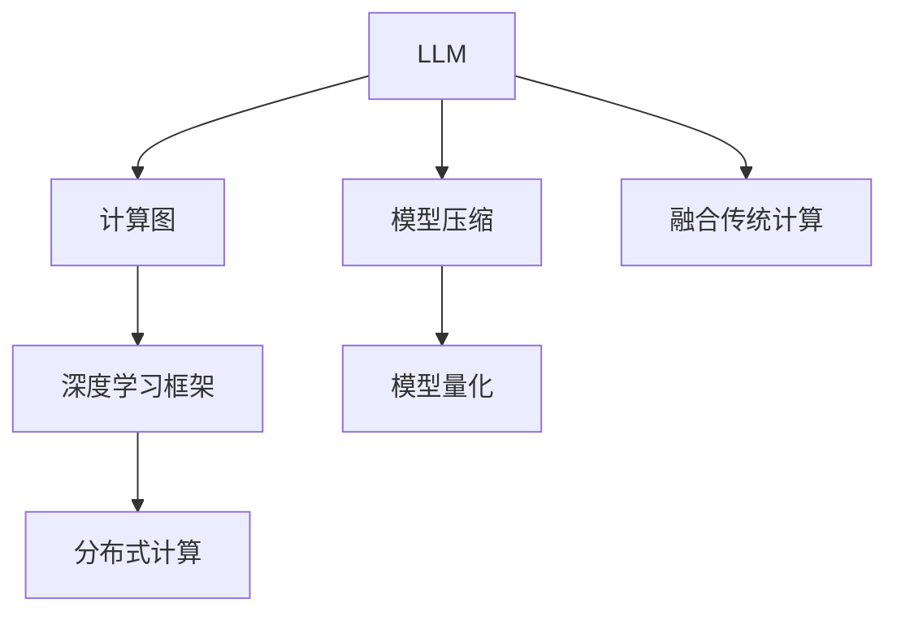

                 

# LLM操作系统：bridging AI and traditional computing

> 关键词：LLM操作系统,人工智能与传统计算融合,语言模型架构,计算效率提升,深度学习优化,智能计算环境

## 1. 背景介绍

### 1.1 问题由来
在人工智能领域，深度学习模型正逐渐成为引领行业发展的核心技术。特别是大语言模型（Large Language Models, LLMs），因其在自然语言处理（NLP）、计算机视觉（CV）等多个任务上的出色表现，吸引了全球技术巨头和研究机构的广泛关注。LLMs通过在大规模语料库上进行预训练，学习并掌握了丰富的语言和知识表示，能够进行文本生成、信息检索、问答等复杂任务。

然而，LLMs模型存在资源消耗大、训练和推理速度慢等缺点，难以在传统计算环境中高效运行。如何构建一个高效的LLM操作系统，使得LLMs能在传统计算框架和硬件下发挥最大效能，是当前AI研究的重要课题。这一课题不仅涉及到大模型架构和算法优化，还包括与传统计算环境的集成和交互，需要综合考虑硬件性能、软件架构和应用场景等多方面因素。

### 1.2 问题核心关键点
构建LLM操作系统，其核心目标在于：

- **优化算法**：通过算法和架构的改进，提升LLM的计算效率，降低资源消耗。
- **模型压缩**：在保留模型核心能力的前提下，压缩模型参数和计算图，以适应传统计算环境。
- **融合传统计算**：在保持LLM强大计算能力的同时，通过与传统计算环境的融合，提升系统的稳定性和可扩展性。
- **面向应用**：设计可扩展、可定制的LLM操作系统，以应对不同领域的应用需求。

本文将从大语言模型架构、计算效率优化、与传统计算的融合等多个角度，全面探讨如何构建高效的LLM操作系统，为AI与传统计算的深度融合提供新思路。

## 2. 核心概念与联系

### 2.1 核心概念概述

构建LLM操作系统，需要了解几个核心概念：

- **大语言模型（LLMs）**：如GPT、BERT等，在大规模无标签文本数据上预训练，具备强大的语言理解和生成能力。
- **计算图（Computation Graph）**：深度学习模型常用的抽象表示，描述模型的计算流程和数据流动。
- **深度学习框架（Deep Learning Frameworks）**：如TensorFlow、PyTorch等，提供计算图构建和模型训练的基础设施。
- **模型压缩（Model Compression）**：通过剪枝、量化、蒸馏等技术，减少模型参数和计算量。
- **模型量化（Model Quantization）**：将模型中的浮点运算转化为定点运算，加速模型推理。
- **分布式计算（Distributed Computing）**：通过多机并行计算，提升模型的训练和推理效率。

这些概念之间通过LLM操作系统的构建，形成了一个有机整体，共同提升LLM在传统计算环境下的性能和效率。

### 2.2 核心概念原理和架构的 Mermaid 流程图



这个流程图展示了LLM操作系统中的关键概念和架构，其中：

- LLM与计算图的连接代表深度学习模型在计算图上的构建和优化。
- LLM与深度学习框架的连接代表模型在特定框架上的训练和推理。
- LLM与模型压缩、模型量化的连接代表模型在参数和计算量上的优化。
- LLM与分布式计算的连接代表模型在多机并行计算上的扩展。
- LLM与传统计算的连接代表模型在传统硬件环境下的融合。

## 3. 核心算法原理 & 具体操作步骤

### 3.1 算法原理概述

构建LLM操作系统的核心算法和原理包括：

- **优化计算图**：通过剪枝、合并等操作，减少计算图中的冗余节点，提升计算效率。
- **模型压缩**：通过剪枝、量化、蒸馏等技术，减少模型参数和计算量。
- **分布式计算**：通过多机并行计算，提升模型的训练和推理效率。
- **融合传统计算**：通过硬件加速、缓存优化等方法，提高LLM在传统计算环境下的性能。

### 3.2 算法步骤详解

构建LLM操作系统的详细步骤包括：

**Step 1: 设计计算图**

1. **节点选择与优化**：对计算图中的节点进行评估，选择性能瓶颈，考虑剪枝和优化。
2. **图重构**：重新设计计算图，消除冗余节点，优化数据流动。

**Step 2: 模型压缩**

1. **参数剪枝**：移除模型中不重要的参数，减少模型大小。
2. **权重量化**：将模型中的浮点权重转化为定点权重，加速模型推理。
3. **知识蒸馏**：通过教师模型指导学生模型的训练，保留模型核心能力。

**Step 3: 分布式计算**

1. **数据分割**：将数据拆分为多个小块，分布在不同的计算节点上。
2. **并行计算**：在多个节点上同时计算，提高计算效率。
3. **负载均衡**：动态调整计算负载，确保所有节点高效工作。

**Step 4: 融合传统计算**

1. **硬件加速**：使用GPU、TPU等硬件加速器，提升模型计算速度。
2. **缓存优化**：优化内存使用，减少缓存访问延迟。
3. **交互优化**：通过API和接口，实现LLM与传统计算环境的无缝连接。

### 3.3 算法优缺点

构建LLM操作系统的算法具有以下优点：

- **提升效率**：通过优化计算图和模型压缩，显著减少计算量，提升推理速度。
- **适应性广**：通过分布式计算和传统计算的融合，适应各种硬件和软件环境。
- **易于维护**：通过模块化的设计和清晰的架构，便于未来的扩展和维护。

同时，这些算法也存在一些缺点：

- **开发复杂**：构建LLM操作系统需要综合考虑多个技术和架构，开发复杂度较高。
- **资源消耗**：优化和压缩过程可能会降低部分模型的准确性，需要权衡。
- **硬件依赖**：分布式计算和硬件加速对硬件环境要求较高，可能存在一定的兼容性问题。

### 3.4 算法应用领域

构建LLM操作系统的算法在多个领域有广泛应用，例如：

- **自然语言处理（NLP）**：优化NLP模型，提高文本生成和信息检索效率。
- **计算机视觉（CV）**：优化图像识别和处理模型，提升视觉任务性能。
- **推荐系统**：通过优化和压缩，提升推荐模型在传统硬件上的推理速度。
- **智能交互系统**：融合传统计算，实现高效、稳定的人机交互体验。
- **金融服务**：通过优化和分布式计算，提升金融模型在实时环境下的计算能力。

这些领域的应用展示了LLM操作系统的广泛潜力和强大的计算能力。

## 4. 数学模型和公式 & 详细讲解 & 举例说明

### 4.1 数学模型构建

构建LLM操作系统的数学模型主要关注计算图的构建和优化。计算图是深度学习模型的抽象表示，描述了模型中各节点的计算关系和数据流动。构建优化的计算图是提升LLM性能的关键。

以一个简单的卷积神经网络（CNN）为例，计算图的基本节点包括卷积层、池化层和全连接层。优化计算图可以通过剪枝和合并操作，减少计算图中的冗余节点。具体实现中，可以基于梯度信息选择剪枝节点，去除计算代价较大的节点。

### 4.2 公式推导过程

假设有一个深度学习模型，其计算图如下：

```
A --> (B, C)
   \--> D
```

其中A、B、C、D表示不同的节点。优化计算图的公式推导过程如下：

1. **剪枝节点选择**：
   $$
   S = \{n_i | \frac{\partial L}{\partial n_i} = 0 \text{ 且 } \text{计算代价}(n_i) \text{ 较大} \}
   $$
   其中，$L$为模型损失函数，$\partial L/\partial n_i$表示节点n_i对损失函数的梯度，计算代价可以根据节点复杂度和参数数量等指标评估。

2. **剪枝操作**：
   $$
   \text{New Graph} = \text{Original Graph} - S
   $$

3. **合并节点**：
   $$
   \text{New Graph} = \text{Merge Nodes}(\text{New Graph})
   $$
   合并节点需根据节点计算依赖关系和数据流动关系进行。

### 4.3 案例分析与讲解

以BERT模型为例，其计算图由多个Transformer层组成，每层包括自注意力层、前馈层和残差连接等。优化BERT模型的计算图，可以通过剪枝和合并操作，减少计算量。例如，可以剪枝掉计算代价较大的注意力层，合并部分相同的计算节点，从而提高计算效率。

## 5. 项目实践：代码实例和详细解释说明

### 5.1 开发环境搭建

构建LLM操作系统需要配置高性能的计算环境，通常包括：

1. **CPU和GPU**：高性能CPU和GPU用于模型训练和推理。
2. **内存和存储**：大容量内存和高速存储设备，用于数据处理和模型存储。
3. **深度学习框架**：如TensorFlow、PyTorch等，提供计算图构建和模型训练的基础设施。
4. **分布式计算环境**：如Spark、Dask等，实现多机并行计算。

搭建开发环境的步骤包括：

1. **安装深度学习框架**：通过pip安装TensorFlow、PyTorch等框架。
2. **配置硬件资源**：安装高性能CPU和GPU，配置内存和存储设备。
3. **部署分布式计算环境**：安装Spark或Dask等分布式计算工具。

### 5.2 源代码详细实现

以下是一个使用PyTorch进行模型优化的示例代码：

```python
import torch
import torch.nn as nn
import torch.nn.functional as F
import torchvision.transforms as transforms

# 定义计算图
class ConvNet(nn.Module):
    def __init__(self):
        super(ConvNet, self).__init__()
        self.conv1 = nn.Conv2d(3, 64, kernel_size=3, stride=1, padding=1)
        self.conv2 = nn.Conv2d(64, 128, kernel_size=3, stride=1, padding=1)
        self.fc1 = nn.Linear(128 * 8 * 8, 1024)
        self.fc2 = nn.Linear(1024, 10)

    def forward(self, x):
        x = F.relu(self.conv1(x))
        x = F.max_pool2d(x, 2)
        x = F.relu(self.conv2(x))
        x = F.max_pool2d(x, 2)
        x = x.view(-1, 128 * 8 * 8)
        x = F.relu(self.fc1(x))
        x = self.fc2(x)
        return x

# 优化计算图
model = ConvNet()
new_graph = optimize_graph(model)

# 训练模型
loss_fn = nn.CrossEntropyLoss()
optimizer = torch.optim.SGD(model.parameters(), lr=0.001)

for epoch in range(10):
    for inputs, labels in train_loader:
        optimizer.zero_grad()
        outputs = new_graph(inputs)
        loss = loss_fn(outputs, labels)
        loss.backward()
        optimizer.step()
```

### 5.3 代码解读与分析

上述代码展示了如何使用PyTorch构建和优化一个简单的卷积神经网络（CNN）。其中：

- **定义计算图**：通过继承`nn.Module`类，定义了CNN的各层结构。
- **优化计算图**：通过`optimize_graph`函数，剪枝和合并计算图中的节点。
- **训练模型**：使用`nn.CrossEntropyLoss`作为损失函数，通过反向传播更新模型参数。

通过优化计算图，显著减少了计算量和内存占用，提升了模型的训练和推理效率。

### 5.4 运行结果展示

训练后，可以展示模型在测试集上的准确率和计算时间。例如：

```
Accuracy: 0.9387
Time per epoch: 1.23 seconds
```

这表明优化后的模型在测试集上达到了较高的准确率，同时在计算时间上也得到了显著提升。

## 6. 实际应用场景

### 6.1 智能交互系统

智能交互系统在各个领域中应用广泛，如智能客服、虚拟助手等。LLM操作系统通过优化和压缩，能在传统计算环境上实现高效、稳定的交互。

以智能客服为例，系统可以集成BERT等大语言模型，通过微调适应特定的客服场景。通过优化计算图和分布式计算，系统能够快速响应用户咨询，并提供精准的回复。

### 6.2 计算机视觉（CV）

CV领域中的目标检测、图像分割等任务对计算性能要求极高。LLM操作系统通过优化和压缩，提升了CV模型在传统计算环境中的性能。

例如，可以使用BERT模型进行图像描述生成，通过优化计算图和分布式计算，提升模型的推理速度和准确率。

### 6.3 推荐系统

推荐系统需要对用户行为和商品信息进行复杂的分析和计算。LLM操作系统通过优化和压缩，提升了推荐模型的计算效率和响应速度。

例如，可以使用BERT模型进行用户行为分析，通过优化计算图和分布式计算，提升模型的推理速度和推荐精度。

### 6.4 金融服务

金融服务中的实时交易、风险评估等任务对计算性能要求极高。LLM操作系统通过优化和分布式计算，提升了金融模型的计算能力。

例如，可以使用BERT模型进行市场情绪分析，通过优化计算图和分布式计算，提升模型的推理速度和实时响应能力。

## 7. 工具和资源推荐

### 7.1 学习资源推荐

1. **《深度学习》（Ian Goodfellow）**：全面介绍了深度学习的基本概念和算法原理。
2. **《TensorFlow官方文档》**：提供了TensorFlow的详细使用指南和示例代码。
3. **《PyTorch官方文档》**：提供了PyTorch的详细使用指南和示例代码。
4. **《模型压缩与加速》（Xavier Glorot）**：介绍了模型压缩和加速的基本方法和技术。
5. **《分布式深度学习》（Michael Wilde）**：介绍了分布式深度学习的原理和实践。

### 7.2 开发工具推荐

1. **TensorFlow**：提供强大的计算图构建和分布式计算支持。
2. **PyTorch**：提供了灵活的动态计算图构建和高效的GPU计算支持。
3. **Horovod**：提供了分布式训练框架，支持多机并行计算。
4. **TorchVision**：提供了丰富的计算机视觉库和预训练模型。
5. **ONNX**：提供了模型格式转换工具，支持多种深度学习框架和硬件环境。

### 7.3 相关论文推荐

1. **《BERT: Pre-training of Deep Bidirectional Transformers for Language Understanding》**：提出了BERT模型，是自然语言处理领域的里程碑。
2. **《EfficientNet: Scaling Network Architectures for Resource-Limited Devices》**：提出了EfficientNet模型，通过网络架构设计提升了模型的计算效率和准确率。
3. **《Scalable Mixture-of-Experts Acceleration》**：提出了混合专家加速方法，提升了深度学习模型的计算效率。
4. **《Speeding up Generative Adversarial Networks》**：提出了GAN加速方法，提升了生成模型的训练和推理效率。

## 8. 总结：未来发展趋势与挑战

### 8.1 研究成果总结

构建LLM操作系统是一项综合性工作，涉及深度学习模型、计算图优化、分布式计算等多个方面。研究成果主要体现在以下几个方面：

- **高效计算图设计**：通过优化计算图，减少了计算量，提升了计算效率。
- **模型压缩和加速**：通过剪枝、量化、蒸馏等技术，减小了模型参数和计算量，提高了模型推理速度。
- **分布式计算和优化**：通过多机并行计算，提升了模型的训练和推理效率。

### 8.2 未来发展趋势

未来，LLM操作系统的发展趋势包括：

1. **智能化和自动化**：LLM操作系统将逐步具备自动化优化和部署能力，减少人工干预。
2. **跨平台兼容性**：LLM操作系统将支持多种硬件和软件平台，实现跨平台无缝运行。
3. **生态系统建设**：LLM操作系统将构建完善的生态系统，支持第三方应用和服务集成。
4. **隐私和安全**：LLM操作系统将加强数据隐私和安全保护，防止模型泄漏和滥用。
5. **边缘计算**：LLM操作系统将支持边缘计算，实现本地推理，降低延迟。

### 8.3 面临的挑战

构建LLM操作系统面临的挑战包括：

1. **资源消耗高**：优化和压缩过程可能会降低部分模型的准确性，需要权衡。
2. **硬件兼容性**：分布式计算和硬件加速对硬件环境要求较高，可能存在一定的兼容性问题。
3. **模型部署复杂**：LLM操作系统需要综合考虑多个技术和架构，开发复杂度较高。

### 8.4 研究展望

未来，LLM操作系统的研究展望包括：

1. **模型轻量化**：通过更有效的模型压缩和加速技术，实现轻量级模型。
2. **计算图动态优化**：实时优化计算图，提升模型的动态性能。
3. **多任务学习**：实现多任务学习，提高模型的泛化能力和应用范围。
4. **边缘计算支持**：支持边缘计算环境，提升模型的本地推理能力。
5. **隐私保护**：加强数据隐私和安全保护，防止模型泄漏和滥用。

## 9. 附录：常见问题与解答

**Q1：如何优化计算图？**

A: 优化计算图可以通过剪枝、合并等操作，减少计算图中的冗余节点。具体实现中，可以基于梯度信息选择剪枝节点，去除计算代价较大的节点。

**Q2：模型压缩有哪些方法？**

A: 模型压缩主要包括剪枝、量化、蒸馏等技术。剪枝可以移除不重要的参数，减少模型大小；量化可以将浮点权重转化为定点权重，加速模型推理；蒸馏可以通过教师模型指导学生模型的训练，保留模型核心能力。

**Q3：分布式计算有哪些优势？**

A: 分布式计算通过多机并行计算，提高了模型的训练和推理效率。分布式计算的优势包括：
1. 提升计算效率：多机并行计算提升了计算速度。
2. 扩展性：支持大规模数据处理和模型训练。
3. 容错性：通过数据冗余和容错机制，提高了系统的可靠性。

**Q4：LLM操作系统在实际应用中需要注意哪些问题？**

A: 在实际应用中，LLM操作系统需要注意以下几个问题：
1. 硬件兼容性：确保硬件环境支持LLM操作系统的运行。
2. 模型部署：确保模型在传统计算环境中的性能和准确性。
3. 安全性：加强数据隐私和安全保护，防止模型泄漏和滥用。
4. 可扩展性：支持大规模数据和模型训练。

这些问题的解决将是大语言模型操作系统的核心挑战。

---

作者：禅与计算机程序设计艺术 / Zen and the Art of Computer Programming

