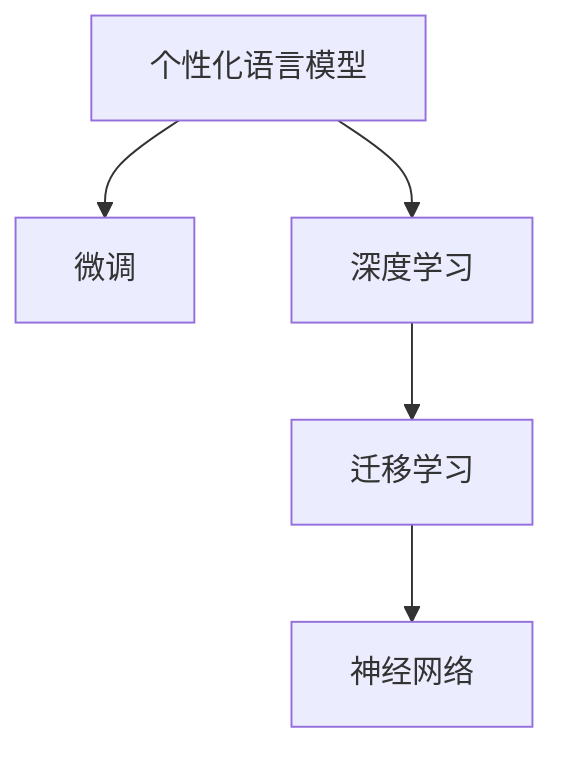

                 

# LLM的个性化：定制你的专属AI助手

> 关键词：LLM, 个性化, 定制, AI助手, 深度学习, 神经网络, 自然语言处理, 模型微调, 数据增强

## 1. 背景介绍

### 1.1 问题由来
随着深度学习和大规模预训练语言模型(LLM)的崛起，越来越多的自然语言处理(NLP)任务被自动化、智能化。然而，这些通用模型往往过于通用，难以直接应用于个性化需求较高的场景。例如，在教育、客服、智能家居等领域，用户的个性化需求千差万别，通用模型难以灵活适应用户的多样化输入。

### 1.2 问题核心关键点
为了解决这一问题，研究人员提出了个性化语言模型(Personalized Language Model, PLM)的概念。个性化语言模型是一种可以针对特定用户或特定场景进行定制的深度学习模型，它不仅具备通用语言模型的大规模语言知识，还可以通过微调过程融入用户的个性化需求和偏好。这种模型能够提供更加个性化、精准的响应和推荐，极大地提升用户体验和系统效率。

### 1.3 问题研究意义
个性化语言模型的研究具有重要的理论和应用意义：

1. **提高用户体验**：个性化模型能够根据用户的兴趣和需求，提供更为贴合的服务，提升用户满意度。
2. **提升系统效率**：通过针对特定用户或场景进行定制，模型能够更高效地处理输入，减少无效计算和响应时间。
3. **促进模型创新**：个性化模型的开发促进了对通用模型的进一步研究，推动了NLP技术的持续进步。
4. **助力行业转型**：个性化语言模型能够帮助各行各业更好地适应数字化的转型需求，提升业务效率和服务质量。

## 2. 核心概念与联系

### 2.1 核心概念概述

为更好地理解个性化语言模型，本节将介绍几个关键概念：

- **个性化语言模型(PLM)**：指通过微调过程，针对特定用户或场景进行定制的深度学习模型，能够提供更为个性化、精准的响应和推荐。
- **微调(Fine-tuning)**：指在预训练模型的基础上，使用特定用户或场景的少量标注数据，通过有监督学习优化模型在该任务上的性能。
- **迁移学习(Transfer Learning)**：指将一个领域学习到的知识，迁移应用到另一个不同但相关的领域的学习范式。个性化模型本质上也是一种迁移学习过程。
- **深度学习(Deep Learning)**：基于多层神经网络结构的机器学习范式，通过反向传播算法进行模型优化。
- **神经网络(Neural Network)**：由多个神经元构成的层次化结构，用于处理和分析复杂的数据。

这些核心概念之间的逻辑关系可以通过以下Mermaid流程图来展示：



这个流程图展示了个性化语言模型的核心概念及其之间的关系：

1. 个性化模型通过微调获得针对特定任务或用户的定制能力。
2. 微调是一种迁移学习过程，将预训练模型应用于特定任务或场景。
3. 深度学习提供模型的优化方法，通过反向传播算法更新参数。
4. 神经网络是深度学习的基础架构，用于构建模型的层次化结构。

## 3. 核心算法原理 & 具体操作步骤

### 3.1 算法原理概述

个性化语言模型基于深度学习框架，通过微调过程，针对特定用户或场景进行定制。其核心思想是：将预训练的通用语言模型作为初始化参数，通过有监督地微调，使得模型能够适应特定的用户需求和场景，提供个性化、精准的输出。

形式化地，假设预训练模型为 $M_{\theta}$，其中 $\theta$ 为预训练得到的模型参数。给定特定用户或场景的数据集 $D=\{(x_i,y_i)\}_{i=1}^N$，其中 $x_i$ 为用户输入，$y_i$ 为模型预期输出。个性化模型的优化目标是最小化损失函数 $\mathcal{L}(M_{\theta},D)$，使得模型输出与用户需求更加贴近：

$$
\theta^* = \mathop{\arg\min}_{\theta} \mathcal{L}(M_{\theta},D)
$$

其中 $\mathcal{L}$ 为针对特定用户或场景设计的损失函数，用于衡量模型预测输出与用户需求之间的差异。

### 3.2 算法步骤详解

个性化语言模型的微调过程一般包括以下几个关键步骤：

**Step 1: 准备预训练模型和数据集**
- 选择合适的预训练语言模型 $M_{\theta}$ 作为初始化参数，如 BERT、GPT 等。
- 准备特定用户或场景的数据集 $D$，包括用户输入 $x_i$ 和模型预期输出 $y_i$。

**Step 2: 添加个性化适配层**
- 根据用户或场景的特点，设计合适的输出层和损失函数。例如，对于个性化推荐任务，输出层可以是用户物品评分，损失函数可以是均方误差。
- 在预训练模型的顶部或特定层上添加适配层，用于处理个性化输入和输出。

**Step 3: 设置微调超参数**
- 选择合适的优化算法及其参数，如 AdamW、SGD 等，设置学习率、批大小、迭代轮数等。
- 设置正则化技术及强度，包括权重衰减、Dropout、Early Stopping 等。
- 确定冻结预训练参数的策略，如仅微调顶层，或全部参数都参与微调。

**Step 4: 执行梯度训练**
- 将数据集 $D$ 分批次输入模型，前向传播计算损失函数。
- 反向传播计算参数梯度，根据设定的优化算法和学习率更新模型参数。
- 周期性在验证集上评估模型性能，根据性能指标决定是否触发 Early Stopping。
- 重复上述步骤直至满足预设的迭代轮数或 Early Stopping 条件。

**Step 5: 测试和部署**
- 在测试集上评估微调后模型 $M_{\hat{\theta}}$ 的性能，对比微调前后的精度提升。
- 使用微调后的模型对新样本进行推理预测，集成到实际的应用系统中。

### 3.3 算法优缺点

个性化语言模型的微调方法具有以下优点：
1. 简单高效。仅需少量个性化数据，即可对预训练模型进行快速适配，获得较大的性能提升。
2. 通用适用。适用于各种个性化需求较高的场景，包括个性化推荐、对话系统、智能客服等。
3. 参数高效。利用参数高效微调技术，在固定大部分预训练参数的情况下，仍可取得不错的提升。
4. 效果显著。在学术界和工业界的诸多个性化任务上，个性化语言模型已经刷新了最先进的性能指标。

同时，该方法也存在一定的局限性：
1. 依赖标注数据。个性化模型的效果很大程度上取决于标注数据的质量和数量，获取高质量个性化数据的成本较高。
2. 迁移能力有限。当目标任务与预训练数据的分布差异较大时，个性化模型的性能提升有限。
3. 负面效果传递。预训练模型的固有偏见、有害信息等，可能通过微调传递到下游任务，造成负面影响。
4. 可解释性不足。个性化模型的决策过程通常缺乏可解释性，难以对其推理逻辑进行分析和调试。

尽管存在这些局限性，但就目前而言，个性化语言模型的微调方法仍是个性化NLP任务的重要范式。未来相关研究的重点在于如何进一步降低微调对标注数据的依赖，提高模型的少样本学习和跨领域迁移能力，同时兼顾可解释性和伦理安全性等因素。

### 3.4 算法应用领域

个性化语言模型在NLP领域已经得到了广泛的应用，覆盖了几乎所有需要个性化的场景，例如：

- 个性化推荐系统：根据用户的历史行为和偏好，推荐个性化物品或内容。通过微调使模型学习用户兴趣模型，提升推荐效果。
- 智能对话系统：能够理解和回应用户的个性化需求，提供多样化的对话策略。通过微调使模型具备更高的情感识别和上下文理解能力。
- 智能客服系统：能够快速响应用户的个性化问题，提供精确的解决方案。通过微调使模型具备更加精准的自然语言理解能力。
- 智能家居系统：能够根据用户的个性化指令，控制家居设备的运行。通过微调使模型具备更加灵活的自然语言交互能力。

除了上述这些经典应用外，个性化语言模型还被创新性地应用到更多场景中，如个性化笔记、个性化摘要、个性化健康管理等，为个性化信息处理和智能化生活提供了新的解决方案。

## 4. 数学模型和公式 & 详细讲解 & 举例说明

### 4.1 数学模型构建

本节将使用数学语言对个性化语言模型微调过程进行更加严格的刻画。

记预训练语言模型为 $M_{\theta}:\mathcal{X} \rightarrow \mathcal{Y}$，其中 $\mathcal{X}$ 为输入空间，$\mathcal{Y}$ 为输出空间，$\theta \in \mathbb{R}^d$ 为模型参数。假设个性化任务的数据集为 $D=\{(x_i,y_i)\}_{i=1}^N, x_i \in \mathcal{X}, y_i \in \mathcal{Y}$。

定义模型 $M_{\theta}$ 在数据样本 $(x,y)$ 上的损失函数为 $\ell(M_{\theta}(x),y)$，则在数据集 $D$ 上的经验风险为：

$$
\mathcal{L}(\theta) = \frac{1}{N} \sum_{i=1}^N \ell(M_{\theta}(x_i),y_i)
$$

个性化模型的优化目标是最小化经验风险，即找到最优参数：

$$
\theta^* = \mathop{\arg\min}_{\theta} \mathcal{L}(\theta)
$$

在实践中，我们通常使用基于梯度的优化算法（如SGD、Adam等）来近似求解上述最优化问题。设 $\eta$ 为学习率，$\lambda$ 为正则化系数，则参数的更新公式为：

$$
\theta \leftarrow \theta - \eta \nabla_{\theta}\mathcal{L}(\theta) - \eta\lambda\theta
$$

其中 $\nabla_{\theta}\mathcal{L}(\theta)$ 为损失函数对参数 $\theta$ 的梯度，可通过反向传播算法高效计算。

### 4.2 公式推导过程

以下我们以个性化推荐任务为例，推导交叉熵损失函数及其梯度的计算公式。

假设模型 $M_{\theta}$ 在输入 $x$ 上的输出为 $\hat{y}=M_{\theta}(x) \in [0,1]$，表示物品被用户评分。真实标签 $y \in \{1,0\}$，表示物品是否被用户选中。则二分类交叉熵损失函数定义为：

$$
\ell(M_{\theta}(x),y) = -[y\log \hat{y} + (1-y)\log (1-\hat{y})]
$$

将其代入经验风险公式，得：

$$
\mathcal{L}(\theta) = -\frac{1}{N}\sum_{i=1}^N [y_i\log M_{\theta}(x_i)+(1-y_i)\log(1-M_{\theta}(x_i))]
$$

根据链式法则，损失函数对参数 $\theta_k$ 的梯度为：

$$
\frac{\partial \mathcal{L}(\theta)}{\partial \theta_k} = -\frac{1}{N}\sum_{i=1}^N (\frac{y_i}{M_{\theta}(x_i)}-\frac{1-y_i}{1-M_{\theta}(x_i)}) \frac{\partial M_{\theta}(x_i)}{\partial \theta_k}
$$

其中 $\frac{\partial M_{\theta}(x_i)}{\partial \theta_k}$ 可进一步递归展开，利用自动微分技术完成计算。

在得到损失函数的梯度后，即可带入参数更新公式，完成模型的迭代优化。重复上述过程直至收敛，最终得到适应特定用户或场景的最优模型参数 $\theta^*$。

## 5. 项目实践：代码实例和详细解释说明

### 5.1 开发环境搭建

在进行个性化语言模型微调实践前，我们需要准备好开发环境。以下是使用Python进行PyTorch开发的环境配置流程：

1. 安装Anaconda：从官网下载并安装Anaconda，用于创建独立的Python环境。

2. 创建并激活虚拟环境：
```bash
conda create -n pytorch-env python=3.8 
conda activate pytorch-env
```

3. 安装PyTorch：根据CUDA版本，从官网获取对应的安装命令。例如：
```bash
conda install pytorch torchvision torchaudio cudatoolkit=11.1 -c pytorch -c conda-forge
```

4. 安装Transformers库：
```bash
pip install transformers
```

5. 安装各类工具包：
```bash
pip install numpy pandas scikit-learn matplotlib tqdm jupyter notebook ipython
```

完成上述步骤后，即可在`pytorch-env`环境中开始个性化语言模型微调实践。

### 5.2 源代码详细实现

这里我们以个性化推荐系统为例，给出使用Transformers库对BERT模型进行个性化微调的PyTorch代码实现。

首先，定义个性化推荐任务的数据处理函数：

```python
from transformers import BertTokenizer
from torch.utils.data import Dataset
import torch

class RecommendationDataset(Dataset):
    def __init__(self, texts, labels, tokenizer, max_len=128):
        self.texts = texts
        self.labels = labels
        self.tokenizer = tokenizer
        self.max_len = max_len
        
    def __len__(self):
        return len(self.texts)
    
    def __getitem__(self, item):
        text = self.texts[item]
        label = self.labels[item]
        
        encoding = self.tokenizer(text, return_tensors='pt', max_length=self.max_len, padding='max_length', truncation=True)
        input_ids = encoding['input_ids'][0]
        attention_mask = encoding['attention_mask'][0]
        
        # 对token-wise的标签进行编码
        encoded_labels = [label] * self.max_len
        labels = torch.tensor(encoded_labels, dtype=torch.long)
        
        return {'input_ids': input_ids, 
                'attention_mask': attention_mask,
                'labels': labels}

# 标签与id的映射
label2id = {'not_selected': 0, 'selected': 1}
id2label = {v: k for k, v in label2id.items()}

# 创建dataset
tokenizer = BertTokenizer.from_pretrained('bert-base-cased')

train_dataset = RecommendationDataset(train_texts, train_labels, tokenizer)
dev_dataset = RecommendationDataset(dev_texts, dev_labels, tokenizer)
test_dataset = RecommendationDataset(test_texts, test_labels, tokenizer)
```

然后，定义模型和优化器：

```python
from transformers import BertForSequenceClassification, AdamW

model = BertForSequenceClassification.from_pretrained('bert-base-cased', num_labels=len(label2id))

optimizer = AdamW(model.parameters(), lr=2e-5)
```

接着，定义训练和评估函数：

```python
from torch.utils.data import DataLoader
from tqdm import tqdm
from sklearn.metrics import accuracy_score

device = torch.device('cuda') if torch.cuda.is_available() else torch.device('cpu')
model.to(device)

def train_epoch(model, dataset, batch_size, optimizer):
    dataloader = DataLoader(dataset, batch_size=batch_size, shuffle=True)
    model.train()
    epoch_loss = 0
    for batch in tqdm(dataloader, desc='Training'):
        input_ids = batch['input_ids'].to(device)
        attention_mask = batch['attention_mask'].to(device)
        labels = batch['labels'].to(device)
        model.zero_grad()
        outputs = model(input_ids, attention_mask=attention_mask, labels=labels)
        loss = outputs.loss
        epoch_loss += loss.item()
        loss.backward()
        optimizer.step()
    return epoch_loss / len(dataloader)

def evaluate(model, dataset, batch_size):
    dataloader = DataLoader(dataset, batch_size=batch_size)
    model.eval()
    preds, labels = [], []
    with torch.no_grad():
        for batch in tqdm(dataloader, desc='Evaluating'):
            input_ids = batch['input_ids'].to(device)
            attention_mask = batch['attention_mask'].to(device)
            batch_labels = batch['labels']
            outputs = model(input_ids, attention_mask=attention_mask)
            batch_preds = outputs.logits.argmax(dim=2).to('cpu').tolist()
            batch_labels = batch_labels.to('cpu').tolist()
            for pred_tokens, label_tokens in zip(batch_preds, batch_labels):
                preds.append(pred_tokens[:len(label_tokens)])
                labels.append(label_tokens)
                
    print(accuracy_score(labels, preds))
```

最后，启动训练流程并在测试集上评估：

```python
epochs = 5
batch_size = 16

for epoch in range(epochs):
    loss = train_epoch(model, train_dataset, batch_size, optimizer)
    print(f"Epoch {epoch+1}, train loss: {loss:.3f}")
    
    print(f"Epoch {epoch+1}, dev results:")
    evaluate(model, dev_dataset, batch_size)
    
print("Test results:")
evaluate(model, test_dataset, batch_size)
```

以上就是使用PyTorch对BERT进行个性化推荐任务微调的完整代码实现。可以看到，得益于Transformers库的强大封装，我们可以用相对简洁的代码完成BERT模型的加载和微调。

### 5.3 代码解读与分析

让我们再详细解读一下关键代码的实现细节：

**RecommendationDataset类**：
- `__init__`方法：初始化文本、标签、分词器等关键组件。
- `__len__`方法：返回数据集的样本数量。
- `__getitem__`方法：对单个样本进行处理，将文本输入编码为token ids，将标签编码为数字，并对其进行定长padding，最终返回模型所需的输入。

**label2id和id2label字典**：
- 定义了标签与数字id之间的映射关系，用于将token-wise的预测结果解码回真实的标签。

**训练和评估函数**：
- 使用PyTorch的DataLoader对数据集进行批次化加载，供模型训练和推理使用。
- 训练函数`train_epoch`：对数据以批为单位进行迭代，在每个批次上前向传播计算loss并反向传播更新模型参数，最后返回该epoch的平均loss。
- 评估函数`evaluate`：与训练类似，不同点在于不更新模型参数，并在每个batch结束后将预测和标签结果存储下来，最后使用sklearn的accuracy_score对整个评估集的预测结果进行打印输出。

**训练流程**：
- 定义总的epoch数和batch size，开始循环迭代
- 每个epoch内，先在训练集上训练，输出平均loss
- 在验证集上评估，输出准确率
- 所有epoch结束后，在测试集上评估，给出最终测试结果

可以看到，PyTorch配合Transformers库使得BERT微调的代码实现变得简洁高效。开发者可以将更多精力放在数据处理、模型改进等高层逻辑上，而不必过多关注底层的实现细节。

当然，工业级的系统实现还需考虑更多因素，如模型的保存和部署、超参数的自动搜索、更灵活的任务适配层等。但核心的微调范式基本与此类似。

## 6. 实际应用场景

### 6.1 智能客服系统

个性化语言模型在智能客服系统中的应用尤为突出。传统的客服系统往往难以适应不同用户的需求，而个性化客服系统则能够提供更为个性化、精准的服务。

在技术实现上，可以收集企业内部的历史客服对话记录，将问题和最佳答复构建成监督数据，在此基础上对预训练对话模型进行个性化微调。微调后的对话模型能够自动理解用户意图，匹配最合适的答案模板进行回复。对于客户提出的新问题，还可以接入检索系统实时搜索相关内容，动态组织生成回答。如此构建的智能客服系统，能大幅提升客户咨询体验和问题解决效率。

### 6.2 个性化推荐系统

个性化推荐系统已经成为电商、视频、新闻等领域的重要工具。传统的推荐系统往往只依赖用户的历史行为数据进行物品推荐，难以捕捉用户的复杂需求和偏好。个性化推荐系统则能够结合用户的个性化数据和历史行为，提供更为精准的推荐。

在实践中，可以收集用户浏览、点击、评论、分享等行为数据，提取和用户交互的物品标题、描述、标签等文本内容。将文本内容作为模型输入，用户的后续行为（如是否点击、购买等）作为监督信号，在此基础上微调预训练语言模型。微调后的模型能够从文本内容中准确把握用户的兴趣点。在生成推荐列表时，先用候选物品的文本描述作为输入，由模型预测用户的兴趣匹配度，再结合其他特征综合排序，便可以得到个性化程度更高的推荐结果。

### 6.3 个性化健康管理

个性化语言模型在健康管理领域也有广泛应用。传统医疗系统往往难以针对个体用户的健康需求提供个性化的指导和建议。个性化健康管理系统则能够结合用户的健康数据和个性化需求，提供更为精准的健康管理方案。

在实践中，可以收集用户的健康数据（如身高、体重、血压等），以及用户的健康需求（如饮食、运动、睡眠等），将数据和需求构建成监督数据，在此基础上对预训练健康模型进行个性化微调。微调后的模型能够从用户的健康数据中提取健康特征，结合用户的个性化需求，提供个性化的健康管理建议。用户可以通过系统输入健康数据和需求，系统则能够提供定制化的健康管理方案，显著提升用户体验和健康管理效果。

### 6.4 未来应用展望

随着个性化语言模型的不断发展，其在各行各业的应用前景将更加广阔。

在智慧教育领域，个性化语言模型可应用于个性化教学、智能作业批改、智能答疑等，因材施教，提升教育质量。

在智能家居领域，个性化语言模型可应用于智能音箱、智能家电控制等，提供个性化的智能生活体验。

在智慧城市治理中，个性化语言模型可应用于城市事件监测、舆情分析、应急指挥等环节，提高城市管理的自动化和智能化水平，构建更安全、高效的未来城市。

此外，在企业生产、社会治理、文娱传媒等众多领域，个性化语言模型也将不断涌现，为数字化转型提供新的技术路径。相信随着技术的日益成熟，个性化语言模型必将成为AI领域的重要范式，推动更多行业实现智能化升级。

## 7. 工具和资源推荐

### 7.1 学习资源推荐

为了帮助开发者系统掌握个性化语言模型理论基础和实践技巧，这里推荐一些优质的学习资源：

1. 《Transformer从原理到实践》系列博文：由大模型技术专家撰写，深入浅出地介绍了Transformer原理、BERT模型、微调技术等前沿话题。

2. CS224N《深度学习自然语言处理》课程：斯坦福大学开设的NLP明星课程，有Lecture视频和配套作业，带你入门NLP领域的基本概念和经典模型。

3. 《Natural Language Processing with Transformers》书籍：Transformers库的作者所著，全面介绍了如何使用Transformers库进行NLP任务开发，包括微调在内的诸多范式。

4. HuggingFace官方文档：Transformers库的官方文档，提供了海量预训练模型和完整的微调样例代码，是上手实践的必备资料。

5. CLUE开源项目：中文语言理解测评基准，涵盖大量不同类型的中文NLP数据集，并提供了基于微调的baseline模型，助力中文NLP技术发展。

通过对这些资源的学习实践，相信你一定能够快速掌握个性化语言模型的精髓，并用于解决实际的NLP问题。

### 7.2 开发工具推荐

高效的开发离不开优秀的工具支持。以下是几款用于个性化语言模型微调开发的常用工具：

1. PyTorch：基于Python的开源深度学习框架，灵活动态的计算图，适合快速迭代研究。大部分预训练语言模型都有PyTorch版本的实现。

2. TensorFlow：由Google主导开发的开源深度学习框架，生产部署方便，适合大规模工程应用。同样有丰富的预训练语言模型资源。

3. Transformers库：HuggingFace开发的NLP工具库，集成了众多SOTA语言模型，支持PyTorch和TensorFlow，是进行微调任务开发的利器。

4. Weights & Biases：模型训练的实验跟踪工具，可以记录和可视化模型训练过程中的各项指标，方便对比和调优。与主流深度学习框架无缝集成。

5. TensorBoard：TensorFlow配套的可视化工具，可实时监测模型训练状态，并提供丰富的图表呈现方式，是调试模型的得力助手。

6. Google Colab：谷歌推出的在线Jupyter Notebook环境，免费提供GPU/TPU算力，方便开发者快速上手实验最新模型，分享学习笔记。

合理利用这些工具，可以显著提升个性化语言模型微调任务的开发效率，加快创新迭代的步伐。

### 7.3 相关论文推荐

个性化语言模型和微调技术的发展源于学界的持续研究。以下是几篇奠基性的相关论文，推荐阅读：

1. Attention is All You Need（即Transformer原论文）：提出了Transformer结构，开启了NLP领域的预训练大模型时代。

2. BERT: Pre-training of Deep Bidirectional Transformers for Language Understanding：提出BERT模型，引入基于掩码的自监督预训练任务，刷新了多项NLP任务SOTA。

3. Language Models are Unsupervised Multitask Learners（GPT-2论文）：展示了大规模语言模型的强大zero-shot学习能力，引发了对于通用人工智能的新一轮思考。

4. Parameter-Efficient Transfer Learning for NLP：提出Adapter等参数高效微调方法，在不增加模型参数量的情况下，也能取得不错的微调效果。

5. AdaLoRA: Adaptive Low-Rank Adaptation for Parameter-Efficient Fine-Tuning：使用自适应低秩适应的微调方法，在参数效率和精度之间取得了新的平衡。

6. Personalized Language Models via Contextual Fine-tuning：提出了基于上下文微调的方法，进一步提升个性化语言模型的效果。

这些论文代表了大语言模型微调技术的发展脉络。通过学习这些前沿成果，可以帮助研究者把握学科前进方向，激发更多的创新灵感。

## 8. 总结：未来发展趋势与挑战

### 8.1 总结

本文对个性化语言模型微调方法进行了全面系统的介绍。首先阐述了个性化语言模型的研究背景和意义，明确了微调在提升用户体验、系统效率方面的独特价值。其次，从原理到实践，详细讲解了个性化语言模型的数学原理和关键步骤，给出了微调任务开发的完整代码实例。同时，本文还广泛探讨了个性化语言模型在智能客服、个性化推荐、健康管理等多个领域的应用前景，展示了微调范式的巨大潜力。此外，本文精选了微调技术的各类学习资源，力求为读者提供全方位的技术指引。

通过本文的系统梳理，可以看到，个性化语言模型的微调方法正在成为NLP领域的重要范式，极大地拓展了预训练语言模型的应用边界，催生了更多的落地场景。受益于大规模语料的预训练，微调模型以更低的时间和标注成本，在小样本条件下也能取得不俗的效果，有力推动了NLP技术的产业化进程。未来，伴随预训练语言模型和微调方法的持续演进，相信NLP技术将在更广阔的应用领域大放异彩，深刻影响人类的生产生活方式。

### 8.2 未来发展趋势

展望未来，个性化语言模型微调技术将呈现以下几个发展趋势：

1. 模型规模持续增大。随着算力成本的下降和数据规模的扩张，预训练语言模型的参数量还将持续增长。超大规模语言模型蕴含的丰富语言知识，有望支撑更加复杂多变的个性化任务微调。

2. 个性化范式多样化。除了传统的全参数微调外，未来会涌现更多个性化微调方法，如上下文微调、结构化微调等，在保持模型高效的同时，提升个性化效果。

3. 持续学习成为常态。随着数据分布的不断变化，个性化模型也需要持续学习新知识以保持性能。如何在不遗忘原有知识的同时，高效吸收新样本信息，将成为重要的研究课题。

4. 标注样本需求降低。受启发于提示学习(Prompt-based Learning)的思路，未来的个性化语言模型将更好地利用大模型的语言理解能力，通过更加巧妙的任务描述，在更少的标注样本上也能实现理想的个性化微调效果。

5. 参数高效个性化。开发更加参数高效的个性化微调方法，如Adapter、LoRA等，在保持模型高效的同时，提升个性化效果。

6. 多模态个性化。当前的个性化语言模型往往局限于文本数据，未来会进一步拓展到图像、视频、语音等多模态数据个性化。多模态信息的融合，将显著提升语言模型对现实世界的理解和建模能力。

以上趋势凸显了个性化语言模型微调技术的广阔前景。这些方向的探索发展，必将进一步提升NLP系统的性能和应用范围，为人类认知智能的进化带来深远影响。

### 8.3 面临的挑战

尽管个性化语言模型微调技术已经取得了瞩目成就，但在迈向更加智能化、普适化应用的过程中，它仍面临着诸多挑战：

1. 标注成本瓶颈。尽管个性化模型对标注数据的需求相对较少，但对于长尾应用场景，仍需获取充足的高质量标注数据，成本较高。如何进一步降低微调对标注样本的依赖，将是一大难题。

2. 模型鲁棒性不足。个性化模型面对域外数据时，泛化性能往往大打折扣。对于测试样本的微小扰动，个性化模型的预测也容易发生波动。如何提高个性化模型的鲁棒性，避免灾难性遗忘，还需要更多理论和实践的积累。

3. 推理效率有待提高。大规模个性化语言模型虽然精度高，但在实际部署时往往面临推理速度慢、内存占用大等效率问题。如何在保证性能的同时，简化模型结构，提升推理速度，优化资源占用，将是重要的优化方向。

4. 可解释性亟需加强。个性化模型的决策过程通常缺乏可解释性，难以对其推理逻辑进行分析和调试。对于医疗、金融等高风险应用，算法的可解释性和可审计性尤为重要。如何赋予个性化模型更强的可解释性，将是亟待攻克的难题。

5. 安全性有待保障。预训练语言模型难免会学习到有偏见、有害的信息，通过微调传递到下游任务，产生误导性、歧视性的输出，给实际应用带来安全隐患。如何从数据和算法层面消除模型偏见，避免恶意用途，确保输出的安全性，也将是重要的研究课题。

6. 知识整合能力不足。现有的个性化语言模型往往局限于任务内数据，难以灵活吸收和运用更广泛的先验知识。如何让个性化模型更好地与外部知识库、规则库等专家知识结合，形成更加全面、准确的信息整合能力，还有很大的想象空间。

正视个性化语言模型微调面临的这些挑战，积极应对并寻求突破，将是大语言模型微调走向成熟的必由之路。相信随着学界和产业界的共同努力，这些挑战终将一一被克服，个性化语言模型微调必将在构建人机协同的智能时代中扮演越来越重要的角色。

### 8.4 研究展望

面对个性化语言模型微调所面临的种种挑战，未来的研究需要在以下几个方面寻求新的突破：

1. 探索无监督和半监督微调方法。摆脱对大规模标注数据的依赖，利用自监督学习、主动学习等无监督和半监督范式，最大限度利用非结构化数据，实现更加灵活高效的个性化微调。

2. 研究参数高效和计算高效的微调范式。开发更加参数高效的微调方法，在保持模型高效的同时，提升个性化效果。同时优化微调模型的计算图，减少前向传播和反向传播的资源消耗，实现更加轻量级、实时性的部署。

3. 融合因果和对比学习范式。通过引入因果推断和对比学习思想，增强个性化模型建立稳定因果关系的能力，学习更加普适、鲁棒的语言表征，从而提升模型泛化性和抗干扰能力。

4. 引入更多先验知识。将符号化的先验知识，如知识图谱、逻辑规则等，与神经网络模型进行巧妙融合，引导个性化微调过程学习更准确、合理的语言模型。同时加强不同模态数据的整合，实现视觉、语音等多模态信息与文本信息的协同建模。

5. 结合因果分析和博弈论工具。将因果分析方法引入个性化模型，识别出模型决策的关键特征，增强输出解释的因果性和逻辑性。借助博弈论工具刻画人机交互过程，主动探索并规避模型的脆弱点，提高系统稳定性。

6. 纳入伦理道德约束。在模型训练目标中引入伦理导向的评估指标，过滤和惩罚有偏见、有害的输出倾向。同时加强人工干预和审核，建立模型行为的监管机制，确保输出符合人类价值观和伦理道德。

这些研究方向的探索，必将引领个性化语言模型微调技术迈向更高的台阶，为构建安全、可靠、可解释、可控的智能系统铺平道路。面向未来，个性化语言模型微调技术还需要与其他人工智能技术进行更深入的融合，如知识表示、因果推理、强化学习等，多路径协同发力，共同推动自然语言理解和智能交互系统的进步。只有勇于创新、敢于突破，才能不断拓展语言模型的边界，让智能技术更好地造福人类社会。

## 9. 附录：常见问题与解答

**Q1：个性化语言模型与通用语言模型有何区别？**

A: 个性化语言模型与通用语言模型（如BERT、GPT）的最大区别在于其针对特定用户或场景进行微调，具备个性化的能力和适应性。通用语言模型通常在大规模无标签文本数据上进行预训练，学习通用的语言知识和模式。而个性化语言模型则在此基础上，通过微调过程融入特定用户或场景的个性化需求和偏好，提升模型的个性化表现。例如，个性化推荐系统通过微调模型学习用户兴趣模型，智能客服系统通过微调模型理解用户意图，提供个性化回复。

**Q2：个性化语言模型如何进行微调？**

A: 个性化语言模型的微调过程主要包括以下几个关键步骤：

1. 准备预训练模型和数据集：选择合适的预训练语言模型作为初始化参数，收集特定用户或场景的监督数据。
2. 添加个性化适配层：设计合适的输出层和损失函数，适配层用于处理个性化输入和输出。
3. 设置微调超参数：选择合适的优化算法及其参数，设置学习率、批大小、迭代轮数等。
4. 执行梯度训练：将数据集分批次输入模型，前向传播计算损失函数，反向传播计算参数梯度，更新模型参数。
5. 测试和部署：在测试集上评估微调后模型性能，使用模型对新样本进行推理预测，集成到实际应用系统中。

其中，适配层和损失函数的定义是微调的核心，需要根据具体任务进行灵活设计。例如，对于个性化推荐任务，适配层通常设计为输出用户物品评分，损失函数为均方误差。

**Q3：个性化语言模型在实际应用中面临哪些挑战？**

A: 个性化语言模型在实际应用中面临以下挑战：

1. 标注成本瓶颈：尽管个性化模型对标注数据的需求相对较少，但对于长尾应用场景，仍需获取充足的高质量标注数据，成本较高。
2. 模型鲁棒性不足：个性化模型面对域外数据时，泛化性能往往大打折扣。
3. 推理效率有待提高：大规模个性化语言模型虽然精度高，但在实际部署时往往面临推理速度慢、内存占用大等效率问题。
4. 可解释性亟需加强：个性化模型的决策过程通常缺乏可解释性，难以对其推理逻辑进行分析和调试。
5. 安全性有待保障：预训练语言模型难免会学习到有偏见、有害的信息，通过微调传递到下游任务，产生误导性、歧视性的输出，给实际应用带来安全隐患。
6. 知识整合能力不足：现有的个性化语言模型往往局限于任务内数据，难以灵活吸收和运用更广泛的先验知识。

解决这些挑战需要跨学科的合作和多方向的创新，包括优化微调算法、引入先验知识、强化模型鲁棒性、提升推理效率、增强可解释性等。

**Q4：个性化语言模型如何提高推理效率？**

A: 提高个性化语言模型的推理效率可以从以下几个方面进行优化：

1. 模型裁剪：去除不必要的层和参数，减小模型尺寸，加快推理速度。
2. 量化加速：将浮点模型转为定点模型，压缩存储空间，提高计算效率。
3. 服务化封装：将模型封装为标准化服务接口，便于集成调用。
4. 弹性伸缩：根据请求流量动态调整资源配置，平衡服务质量和成本。
5. 监控告警：实时采集系统指标，设置异常告警阈值，确保服务稳定性。

这些优化措施可以显著提升个性化语言模型在实际部署中的性能和响应速度，提高用户体验。

**Q5：个性化语言模型在实际应用中有哪些应用场景？**

A: 个性化语言模型在实际应用中有很多应用场景，例如：

1. 个性化推荐系统：根据用户的历史行为和偏好，推荐个性化物品或内容。通过微调模型学习用户兴趣模型，提升推荐效果。
2. 智能客服系统：能够理解和回应用户的个性化需求，提供多样化的对话策略。通过微调模型理解用户意图，提供个性化回复。
3. 个性化健康管理：结合用户的健康数据和个性化需求，提供个性化的健康管理方案。通过微调模型从健康数据中提取健康特征，提供个性化建议。
4. 个性化教育：根据学生的学习行为和兴趣，提供个性化的学习内容和推荐。通过微调模型学习学生兴趣模型，提升学习效果。
5. 个性化广告投放：根据用户的浏览历史和兴趣，推荐个性化广告。通过微调模型学习用户兴趣模型，提高广告效果。

这些应用场景展示了个性化语言模型在提升用户体验、提高系统效率方面的巨大潜力。

