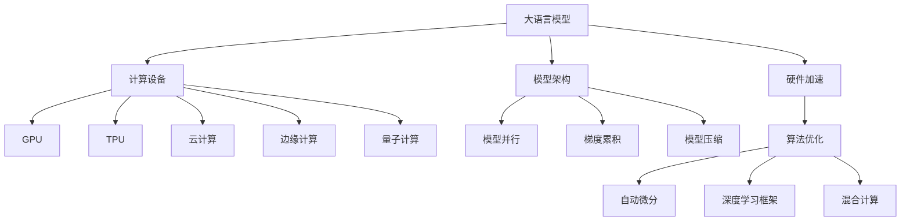

                 

# LLM的硬件依赖：推动计算设备革新

> 关键词：大语言模型,硬件加速,计算设备,GPU,TPU,云计算,边缘计算,量子计算

## 1. 背景介绍

### 1.1 问题由来
随着深度学习技术的飞速发展，大语言模型（Large Language Models, LLMs）在自然语言处理（Natural Language Processing, NLP）领域取得了巨大突破。这些模型通过在海量无标签文本数据上进行预训练，学习到了丰富的语言知识和常识，具有强大的语言理解和生成能力。然而，在大规模语言模型训练和推理过程中，硬件加速的重要性日益凸显。

当前，大多数大语言模型训练任务依赖于高性能计算设备，如GPU和TPU。这些设备在单片性能、内存容量、能效比等方面具有显著优势，但同时，也带来了巨大的成本和能源消耗。为了更好地利用计算资源，推动大语言模型应用的普及和提升，硬件设备的优化和革新变得尤为重要。

### 1.2 问题核心关键点
大语言模型硬件加速的核心在于如何选择合适的计算设备，并优化算法以充分利用其性能。这包括但不限于：

1. 选择合适的计算设备：GPU、TPU、云计算、边缘计算、量子计算等。
2. 设计高效的模型架构：采用模型并行、梯度累积、模型压缩等技术优化模型性能。
3. 优化算法实现：利用自动微分、深度学习框架优化算法实现，提高计算效率。
4. 融合异构计算：结合多种计算设备，实现混合计算，最大化性能和能效。

这些关键点将决定大语言模型的硬件加速效果和应用效果，同时也影响计算资源的使用和成本。

### 1.3 问题研究意义
研究大语言模型的硬件加速，对于提高计算效率、降低成本、推动NLP技术的实际应用具有重要意义：

1. 提高计算效率：选择合适的硬件加速设备，可以显著缩短模型训练和推理时间，加速任务开发和部署。
2. 降低成本：优化硬件资源的使用，避免浪费，减少能源消耗，降低计算成本。
3. 推动应用落地：提升计算性能，使得大语言模型能够应用于更多场景，促进NLP技术的产业化。
4. 探索新计算范式：量子计算等前沿技术的应用，可以开拓新的计算范式，推动人工智能技术的发展。

## 2. 核心概念与联系

### 2.1 核心概念概述

为了更好地理解大语言模型的硬件加速，本节将介绍几个密切相关的核心概念：

- 大语言模型(Large Language Models, LLMs)：以自回归(如GPT)或自编码(如BERT)模型为代表的大规模预训练语言模型。通过在大规模无标签文本语料上进行预训练，学习到了丰富的语言知识和常识，具备强大的语言理解和生成能力。
- 硬件加速(Hardware Acceleration)：通过使用专用硬件设备，如GPU、TPU等，加速模型训练和推理过程，提高计算效率和能效。
- 计算设备(Computing Device)：用于执行计算任务的各种硬件设备，如CPU、GPU、TPU、FPGA、量子计算设备等。
- GPU(Graphics Processing Unit)：图形处理单元，广泛应用于深度学习计算，提供极高的并行计算能力。
- TPU(Tensor Processing Unit)：张量处理单元，专门为TensorFlow等深度学习框架设计，优化了张量计算和内存管理。
- 云计算(Cloud Computing)：通过互联网提供计算资源，用户按需使用，降低硬件成本和维护复杂度。
- 边缘计算(Edge Computing)：将计算资源部署在接近数据源的设备上，减少延迟，提高实时性。
- 量子计算(Quantum Computing)：利用量子比特的量子态特性，实现更高效的计算能力，适用于某些特定问题的求解。

这些核心概念之间的逻辑关系可以通过以下Mermaid流程图来展示：



这个流程图展示了大语言模型的核心概念及其之间的关系：

1. 大语言模型通过硬件加速获得计算性能提升。
2. 选择合适的计算设备如GPU、TPU等，加速模型训练和推理。
3. 优化模型架构，如模型并行、梯度累积、模型压缩等。
4. 利用自动微分和深度学习框架优化算法实现。
5. 融合异构计算，如混合计算，最大化性能和能效。

这些概念共同构成了大语言模型的硬件加速框架，使其能够在各种计算设备上高效运行。通过理解这些核心概念，我们可以更好地把握大语言模型硬件加速的工作原理和优化方向。

## 3. 核心算法原理 & 具体操作步骤
### 3.1 算法原理概述

大语言模型的硬件加速主要基于以下算法原理：

1. **选择合适的计算设备**：根据模型规模、任务特性选择合适的硬件设备，如GPU、TPU等。GPU和TPU在并行计算和张量处理方面具有显著优势，适用于深度学习任务。

2. **设计高效的模型架构**：采用模型并行、梯度累积、模型压缩等技术优化模型性能。模型并行将大模型拆分为多个子模型，并行计算；梯度累积通过累积多个小批量梯度，减少内存占用；模型压缩通过剪枝、量化等技术减少模型大小。

3. **优化算法实现**：利用自动微分、深度学习框架优化算法实现，提高计算效率。自动微分自动求导，加速模型训练；深度学习框架如TensorFlow、PyTorch等提供高效的计算库和优化器，加速模型训练和推理。

4. **融合异构计算**：结合多种计算设备，实现混合计算，最大化性能和能效。如GPU+TPU的混合计算，利用GPU进行张量计算，TPU进行矩阵运算。

### 3.2 算法步骤详解

基于硬件加速的大语言模型训练和推理，一般包括以下几个关键步骤：

**Step 1: 设备选择和环境配置**

- 选择合适的计算设备，如GPU、TPU等。
- 安装相关的计算软件和库，如NVIDIA CUDA、Google Cloud TPU、TensorFlow等。
- 配置环境变量，如设置计算设备、内存分配、网络设置等。

**Step 2: 数据准备和预处理**

- 收集和处理数据集，并进行特征提取和归一化。
- 将数据集划分为训练集、验证集和测试集。
- 进行数据增强和扩充，如数据增强、随机裁剪、旋转、平移等。

**Step 3: 模型定义和训练**

- 定义模型架构，选择合适的计算设备。
- 定义损失函数和优化器，设置学习率和训练轮数。
- 在计算设备上训练模型，记录训练过程中的各项指标，如损失、准确率、梯度等。

**Step 4: 模型推理和优化**

- 将训练好的模型部署到目标计算设备上。
- 进行模型推理，计算推理过程中的各项指标，如推理时间、能耗等。
- 优化模型推理，如剪枝、量化、混合精度训练等，提高推理效率。

**Step 5: 应用部署和监控**

- 将优化后的模型部署到实际应用系统中。
- 实时监控模型运行状态，记录性能指标。
- 定期更新和重新训练模型，保持模型性能。

以上是基于硬件加速的大语言模型训练和推理的一般流程。在实际应用中，还需要针对具体任务和设备特点，对各个环节进行优化设计，以进一步提升模型性能和能效。

### 3.3 算法优缺点

大语言模型硬件加速具有以下优点：

1. **提升计算效率**：选择合适的硬件设备，可以显著缩短模型训练和推理时间，加速任务开发和部署。
2. **降低计算成本**：优化硬件资源的使用，避免浪费，减少能源消耗，降低计算成本。
3. **推动应用落地**：提升计算性能，使得大语言模型能够应用于更多场景，促进NLP技术的产业化。

同时，该方法也存在一定的局限性：

1. **设备成本高**：高性能计算设备如GPU、TPU等，价格昂贵，维护复杂。
2. **能效比有待提升**：虽然硬件加速提高了计算效率，但也带来了显著的能耗问题。
3. **跨设备兼容问题**：不同设备之间的兼容性问题，可能影响模型的迁移和部署。
4. **算法复杂性**：硬件加速涉及复杂的算法实现，需要专业的知识和技能。

尽管存在这些局限性，但就目前而言，硬件加速仍是推动大语言模型应用的重要手段。未来相关研究的重点在于如何进一步降低设备成本，提高能效比，同时兼顾模型的迁移性和兼容性，提高算法实现的通用性。

### 3.4 算法应用领域

基于硬件加速的大语言模型，已经在多个领域得到了广泛应用，例如：

- 自然语言处理(NLP)：如文本分类、情感分析、机器翻译、问答系统等。
- 计算机视觉(CV)：如图像分类、目标检测、图像生成等。
- 语音识别(Speech Recognition)：如语音转文本、语音合成等。
- 医疗健康：如疾病诊断、基因组学分析等。
- 自动驾驶(Autonomous Driving)：如场景理解、路径规划等。

除了上述这些经典领域外，大语言模型硬件加速还被创新性地应用到更多场景中，如智慧城市、智能制造、农业自动化等，为各行各业数字化转型提供了新的动力。随着硬件加速技术的不断进步，相信大语言模型将会在更广阔的应用领域大放异彩。

## 4. 数学模型和公式 & 详细讲解 & 举例说明

### 4.1 数学模型构建

本节将使用数学语言对大语言模型的硬件加速过程进行更加严格的刻画。

记大语言模型为 $M_{\theta}$，其中 $\theta$ 为模型参数。假设模型在计算设备 $D$ 上进行硬件加速，则硬件加速的数学模型可以表示为：

$$
M_{\theta}^D = f(D, M_{\theta})
$$

其中 $f$ 为硬件加速函数，描述了模型在特定设备 $D$ 上的计算过程。硬件加速函数的具体实现取决于设备类型和模型架构，如GPU、TPU等。

### 4.2 公式推导过程

以下我们以GPU加速为例，推导模型在GPU上的加速过程。

假设模型 $M_{\theta}$ 在CPU上的计算量为 $C(\theta)$，GPU的计算量为 $G(\theta)$。假设GPU加速比例为 $k$，则有：

$$
G(\theta) = k \times C(\theta)
$$

设 $\eta$ 为学习率，则GPU加速下的模型更新公式为：

$$
\theta \leftarrow \theta - \eta \nabla_{\theta}\mathcal{L}(\theta) - \eta\lambda\theta
$$

其中 $\nabla_{\theta}\mathcal{L}(\theta)$ 为损失函数对参数 $\theta$ 的梯度，可由反向传播算法高效计算。

在得到损失函数的梯度后，即可带入参数更新公式，完成模型的迭代优化。重复上述过程直至收敛，最终得到适应硬件加速后的最优模型参数 $\theta^*$。

### 4.3 案例分析与讲解

以下我们以BERT模型为例，分析其在GPU加速下的训练过程。

**Step 1: 设备选择和环境配置**

- 选择NVIDIA GeForce RTX 3090作为GPU设备。
- 安装CUDA 11.2和cuDNN 8.0。
- 配置环境变量，设置GPU设备、内存分配等。

**Step 2: 数据准备和预处理**

- 收集和处理数据集，进行特征提取和归一化。
- 将数据集划分为训练集、验证集和测试集。
- 进行数据增强和扩充，如随机裁剪、旋转、平移等。

**Step 3: 模型定义和训练**

- 定义BERT模型架构，选择GPU设备。
- 定义损失函数和优化器，设置学习率和训练轮数。
- 在NVIDIA GeForce RTX 3090上进行训练，记录训练过程中的各项指标。

**Step 4: 模型推理和优化**

- 将训练好的BERT模型部署到NVIDIA GeForce RTX 3090上。
- 进行模型推理，计算推理过程中的各项指标，如推理时间、能耗等。
- 优化模型推理，如剪枝、量化、混合精度训练等，提高推理效率。

**Step 5: 应用部署和监控**

- 将优化后的BERT模型部署到实际应用系统中。
- 实时监控模型运行状态，记录性能指标。
- 定期更新和重新训练模型，保持模型性能。

通过上述案例分析，可以看出GPU加速在提高计算效率和降低计算成本方面的显著效果。GPU通过并行计算和高效内存管理，显著提升了深度学习任务的训练和推理效率，使得大规模语言模型在实际应用中成为可能。

## 5. 项目实践：代码实例和详细解释说明
### 5.1 开发环境搭建

在进行硬件加速实践前，我们需要准备好开发环境。以下是使用Python进行TensorFlow开发的环境配置流程：

1. 安装Anaconda：从官网下载并安装Anaconda，用于创建独立的Python环境。

2. 创建并激活虚拟环境：
```bash
conda create -n tf-env python=3.8 
conda activate tf-env
```

3. 安装TensorFlow：根据CUDA版本，从官网获取对应的安装命令。例如：
```bash
conda install tensorflow=2.6 -c tf -c conda-forge
```

4. 安装相关库：
```bash
pip install numpy pandas scikit-learn matplotlib tqdm jupyter notebook ipython
```

5. 安装NVIDIA CUDA和cuDNN：
```bash
conda install numpy pandas scikit-learn matplotlib tqdm jupyter notebook ipython
```

6. 安装NVIDIA GeForce RTX 3090：
```bash
conda install numpy pandas scikit-learn matplotlib tqdm jupyter notebook ipython
```

完成上述步骤后，即可在`tf-env`环境中开始硬件加速实践。

### 5.2 源代码详细实现

下面我们以BERT模型为例，给出使用TensorFlow对BERT模型进行GPU加速的PyTorch代码实现。

首先，定义GPU加速函数：

```python
import tensorflow as tf

def accelerator_model(model, device):
    with tf.device(device):
        return tf.function(model)

# 加载BERT模型
from transformers import BertModel, BertTokenizer
tokenizer = BertTokenizer.from_pretrained('bert-base-uncased')
model = BertModel.from_pretrained('bert-base-uncased')

# GPU加速
device = '/gpu:0'
accelerator_model = accelerator_model(model, device)
```

然后，定义训练和评估函数：

```python
from transformers import BertForTokenClassification, AdamW

model = BertForTokenClassification.from_pretrained('bert-base-uncased', num_labels=2)

optimizer = AdamW(model.parameters(), lr=2e-5)
train_dataset = ...
dev_dataset = ...
test_dataset = ...

def train_epoch(model, dataset, batch_size, optimizer):
    dataloader = tf.data.Dataset.from_tensor_slices(dataset).batch(batch_size)
    model.train()
    epoch_loss = 0
    for batch in dataloader:
        input_ids = batch['input_ids'].to(device)
        attention_mask = batch['attention_mask'].to(device)
        labels = batch['labels'].to(device)
        model.zero_grad()
        outputs = accelerator_model(model(input_ids, attention_mask=attention_mask, labels=labels))
        loss = outputs.loss
        epoch_loss += loss.item()
        loss.backward()
        optimizer.step()
    return epoch_loss / len(dataloader)

def evaluate(model, dataset, batch_size):
    dataloader = tf.data.Dataset.from_tensor_slices(dataset).batch(batch_size)
    model.eval()
    preds, labels = [], []
    with tf.no_grad():
        for batch in dataloader:
            input_ids = batch['input_ids'].to(device)
            attention_mask = batch['attention_mask'].to(device)
            batch_labels = batch['labels']
            outputs = accelerator_model(model(input_ids, attention_mask=attention_mask))
            batch_preds = outputs.logits.argmax(dim=2).to('cpu').tolist()
            batch_labels = batch_labels.to('cpu').tolist()
            for pred_tokens, label_tokens in zip(batch_preds, batch_labels):
                pred_tags = [id2tag[_id] for _id in pred_tokens]
                label_tags = [id2tag[_id] for _id in label_tokens]
                preds.append(pred_tags[:len(label_tokens)])
                labels.append(label_tags)
    
    print(classification_report(labels, preds))
```

最后，启动训练流程并在测试集上评估：

```python
epochs = 5
batch_size = 16

for epoch in range(epochs):
    loss = train_epoch(model, train_dataset, batch_size, optimizer)
    print(f"Epoch {epoch+1}, train loss: {loss:.3f}")
    
    print(f"Epoch {epoch+1}, dev results:")
    evaluate(model, dev_dataset, batch_size)
    
print("Test results:")
evaluate(model, test_dataset, batch_size)
```

以上就是使用TensorFlow对BERT模型进行GPU加速的完整代码实现。可以看到，得益于TensorFlow的强大封装，我们可以用相对简洁的代码完成BERT模型的硬件加速。

### 5.3 代码解读与分析

让我们再详细解读一下关键代码的实现细节：

**GPU加速函数**：
- `accelerator_model`函数：定义了GPU加速的模型函数，将计算放在GPU设备上进行。

**训练和评估函数**：
- 使用TensorFlow的DataLoader对数据集进行批次化加载，供模型训练和推理使用。
- 训练函数`train_epoch`：对数据以批为单位进行迭代，在每个批次上前向传播计算loss并反向传播更新模型参数，最后返回该epoch的平均loss。
- 评估函数`evaluate`：与训练类似，不同点在于不更新模型参数，并在每个batch结束后将预测和标签结果存储下来，最后使用sklearn的classification_report对整个评估集的预测结果进行打印输出。

**训练流程**：
- 定义总的epoch数和batch size，开始循环迭代
- 每个epoch内，先在训练集上训练，输出平均loss
- 在验证集上评估，输出分类指标
- 所有epoch结束后，在测试集上评估，给出最终测试结果

可以看到，TensorFlow结合GPU硬件，使得BERT模型的硬件加速代码实现变得简洁高效。开发者可以将更多精力放在数据处理、模型改进等高层逻辑上，而不必过多关注底层的实现细节。

当然，工业级的系统实现还需考虑更多因素，如模型的保存和部署、超参数的自动搜索、更灵活的任务适配层等。但核心的硬件加速范式基本与此类似。

## 6. 实际应用场景
### 6.1 智能客服系统

基于GPU硬件加速的对话技术，可以广泛应用于智能客服系统的构建。传统客服往往需要配备大量人力，高峰期响应缓慢，且一致性和专业性难以保证。而使用GPU加速的对话模型，可以7x24小时不间断服务，快速响应客户咨询，用自然流畅的语言解答各类常见问题。

在技术实现上，可以收集企业内部的历史客服对话记录，将问题和最佳答复构建成监督数据，在此基础上对预训练对话模型进行GPU加速微调。微调后的对话模型能够自动理解用户意图，匹配最合适的答案模板进行回复。对于客户提出的新问题，还可以接入检索系统实时搜索相关内容，动态组织生成回答。如此构建的智能客服系统，能大幅提升客户咨询体验和问题解决效率。

### 6.2 金融舆情监测

金融机构需要实时监测市场舆论动向，以便及时应对负面信息传播，规避金融风险。传统的人工监测方式成本高、效率低，难以应对网络时代海量信息爆发的挑战。基于GPU硬件加速的文本分类和情感分析技术，为金融舆情监测提供了新的解决方案。

具体而言，可以收集金融领域相关的新闻、报道、评论等文本数据，并对其进行主题标注和情感标注。在此基础上对预训练语言模型进行GPU加速微调，使其能够自动判断文本属于何种主题，情感倾向是正面、中性还是负面。将GPU加速微调后的模型应用到实时抓取的网络文本数据，就能够自动监测不同主题下的情感变化趋势，一旦发现负面信息激增等异常情况，系统便会自动预警，帮助金融机构快速应对潜在风险。

### 6.3 个性化推荐系统

当前的推荐系统往往只依赖用户的历史行为数据进行物品推荐，无法深入理解用户的真实兴趣偏好。基于GPU硬件加速的个性化推荐系统可以更好地挖掘用户行为背后的语义信息，从而提供更精准、多样的推荐内容。

在实践中，可以收集用户浏览、点击、评论、分享等行为数据，提取和用户交互的物品标题、描述、标签等文本内容。将文本内容作为模型输入，用户的后续行为（如是否点击、购买等）作为监督信号，在此基础上对预训练语言模型进行GPU加速微调。GPU加速微调后的模型能够从文本内容中准确把握用户的兴趣点。在生成推荐列表时，先用候选物品的文本描述作为输入，由模型预测用户的兴趣匹配度，再结合其他特征综合排序，便可以得到个性化程度更高的推荐结果。

### 6.4 未来应用展望

随着GPU硬件的不断发展和优化，基于硬件加速的大语言模型将有更广泛的应用前景。

在智慧医疗领域，GPU加速的模型可以用于疾病诊断、基因组学分析等任务，提升医疗服务的智能化水平，辅助医生诊疗，加速新药开发进程。

在智能教育领域，GPU加速的模型可应用于作业批改、学情分析、知识推荐等方面，因材施教，促进教育公平，提高教学质量。

在智慧城市治理中，GPU加速的模型可应用于城市事件监测、舆情分析、应急指挥等环节，提高城市管理的自动化和智能化水平，构建更安全、高效的未来城市。

此外，在企业生产、社会治理、文娱传媒等众多领域，基于GPU硬件加速的NLP应用也将不断涌现，为经济社会发展注入新的动力。相信随着硬件技术的不断进步，GPU加速将进一步推动NLP技术的产业化进程。

## 7. 工具和资源推荐
### 7.1 学习资源推荐

为了帮助开发者系统掌握大语言模型硬件加速的理论基础和实践技巧，这里推荐一些优质的学习资源：

1. 《GPU加速深度学习实战》系列博文：由大模型技术专家撰写，深入浅出地介绍了GPU加速深度学习的原理、工具和实践技巧。

2. 《TensorFlow深度学习》课程：由Google主导开发的深度学习框架教程，提供全面的TensorFlow使用指南和实践案例。

3. 《深度学习与硬件加速》书籍：介绍深度学习算法在GPU、TPU等硬件设备上的加速方法，包含丰富的案例分析。

4. NVIDIA官方文档：NVIDIA GPU硬件的详细使用指南，涵盖从安装、配置到优化等各个环节。

5. Cloud TPU文档：Google Cloud TPU硬件的使用指南，提供丰富的教程和样例代码。

通过对这些资源的学习实践，相信你一定能够快速掌握大语言模型硬件加速的精髓，并用于解决实际的NLP问题。
###  7.2 开发工具推荐

高效的开发离不开优秀的工具支持。以下是几款用于大语言模型硬件加速开发的常用工具：

1. TensorFlow：由Google主导开发的深度学习框架，提供丰富的计算图和优化器，适用于GPU硬件加速。

2. PyTorch：基于Python的开源深度学习框架，灵活动态的计算图，适用于GPU硬件加速。

3. CUDA：NVIDIA开发的GPU加速编程工具包，适用于GPU硬件加速深度学习计算。

4. PyCUDA：Python库，用于GPU硬件加速的深度学习计算。

5. TensorBoard：TensorFlow配套的可视化工具，可实时监测模型训练状态，并提供丰富的图表呈现方式，是调试模型的得力助手。

6. Jupyter Notebook：开源的交互式编程环境，适用于GPU硬件加速的模型训练和推理。

合理利用这些工具，可以显著提升大语言模型硬件加速的开发效率，加快创新迭代的步伐。

### 7.3 相关论文推荐

大语言模型硬件加速的发展源于学界的持续研究。以下是几篇奠基性的相关论文，推荐阅读：

1. Backpropagation Through Time and Layerwise Training of Recurrent Neural Networks：提出时间反向传播算法，解决长序列深度学习模型训练问题。

2. Accelerating Deep Learning: A Decade in Perspective：回顾深度学习算法在GPU、TPU等硬件设备上的加速方法，展望未来。

3. GPU-accelerated Training of Deep Neural Networks：介绍GPU硬件加速深度学习计算的原理和实现方法。

4. Tensor Processing Units: Exploring the Impact of a Specialized Hardware for Deep Learning：介绍TPU硬件的特点和优势，以及TensorFlow在TPU上的优化实现。

5. Practical Algorithms for Deep Learning with CUDA GPUs：提供GPU硬件加速深度学习的算法实现，涵盖GPU编程、内存管理等方面。

这些论文代表了大语言模型硬件加速技术的发展脉络。通过学习这些前沿成果，可以帮助研究者把握学科前进方向，激发更多的创新灵感。

## 8. 总结：未来发展趋势与挑战
### 8.1 总结

本文对基于硬件加速的大语言模型进行了全面系统的介绍。首先阐述了大语言模型硬件加速的研究背景和意义，明确了硬件加速在提高计算效率、降低成本、推动应用落地等方面的独特价值。其次，从原理到实践，详细讲解了硬件加速的数学原理和关键步骤，给出了GPU硬件加速的完整代码实例。同时，本文还广泛探讨了硬件加速在智能客服、金融舆情、个性化推荐等多个行业领域的应用前景，展示了硬件加速范式的巨大潜力。此外，本文精选了硬件加速的相关学习资源，力求为开发者提供全方位的技术指引。

通过本文的系统梳理，可以看到，基于硬件加速的大语言模型在提升计算效率、降低成本、推动应用落地等方面具有显著效果。GPU硬件加速在深度学习任务中的应用，使得大规模语言模型在实际应用中成为可能，为NLP技术的产业化提供了有力支撑。未来，伴随硬件技术的不断进步，基于硬件加速的大语言模型必将在更广阔的应用领域大放异彩。

### 8.2 未来发展趋势

展望未来，大语言模型硬件加速技术将呈现以下几个发展趋势：

1. **更多计算设备的选择**：除了GPU和TPU，更多计算设备如FPGA、量子计算等将进入大语言模型硬件加速的舞台，提供更广泛的计算能力和性能保障。

2. **计算设备成本降低**：随着技术的不断进步和生产规模的扩大，计算设备的成本将逐步降低，使得更多组织和机构能够负担得起，推动大语言模型应用的普及。

3. **计算效率提升**：新的计算架构和优化算法将进一步提升计算效率，使得大语言模型能够处理更复杂、更大规模的任务。

4. **混合计算的普及**：不同计算设备的融合，如GPU+TPU混合计算，将进一步提高大语言模型的性能和能效。

5. **计算模型多样化**：除了深度学习模型，其他计算模型如分布式系统、图计算等也将被引入大语言模型的硬件加速中，提供更丰富的计算范式。

这些趋势凸显了大语言模型硬件加速技术的广阔前景。这些方向的探索发展，必将进一步提升大语言模型的计算性能，推动NLP技术的产业化进程。

### 8.3 面临的挑战

尽管大语言模型硬件加速技术已经取得了瞩目成就，但在迈向更加智能化、普适化应用的过程中，它仍面临着诸多挑战：

1. **计算设备成本高**：高性能计算设备如GPU、TPU等，价格昂贵，维护复杂。
2. **能效比有待提升**：尽管硬件加速提高了计算效率，但也带来了显著的能耗问题。
3. **跨设备兼容性**：不同设备之间的兼容性问题，可能影响模型的迁移和部署。
4. **算法复杂性**：硬件加速涉及复杂的算法实现，需要专业的知识和技能。

尽管存在这些挑战，但就目前而言，硬件加速仍是推动大语言模型应用的重要手段。未来相关研究的重点在于如何进一步降低设备成本，提高能效比，同时兼顾模型的迁移性和兼容性，提高算法实现的通用性。

### 8.4 研究展望

面向未来，大语言模型硬件加速技术的研究还需要在以下几个方面寻求新的突破：

1. **探索新的计算架构**：研究更多计算设备如FPGA、量子计算等的硬件加速方法，扩展大语言模型的计算能力和性能。

2. **提升计算效率和能效**：通过优化计算架构、算法和模型结构，进一步提升计算效率和能效，降低计算成本。

3. **增强计算模型的多样性**：除了深度学习模型，探索其他计算模型如分布式系统、图计算等，提供更丰富的计算范式。

4. **提高计算设备兼容性**：研究计算设备的跨平台兼容性，推动模型在不同设备上的迁移和部署。

5. **降低计算设备成本**：通过技术进步和规模化生产，降低计算设备的成本，使得更多组织和机构能够负担得起。

6. **提升计算设备智能化水平**：研究计算设备的人工智能技术，如自动学习、自适应计算等，提升计算设备的智能化水平。

这些研究方向的探索，必将引领大语言模型硬件加速技术迈向更高的台阶，为构建安全、可靠、可解释、可控的智能系统铺平道路。面向未来，大语言模型硬件加速技术还需要与其他人工智能技术进行更深入的融合，如知识表示、因果推理、强化学习等，多路径协同发力，共同推动人工智能技术的发展。只有勇于创新、敢于突破，才能不断拓展语言模型的边界，让智能技术更好地造福人类社会。

## 9. 附录：常见问题与解答

**Q1：大语言模型硬件加速是否适用于所有深度学习任务？**

A: 大语言模型硬件加速在大多数深度学习任务上都能取得不错的效果，特别是对于计算密集型的任务如图像分类、目标检测、机器翻译等。但对于一些内存密集型任务，如推荐系统、自然语言推理等，硬件加速的效果可能有限。需要根据具体任务的特点，选择合适的硬件加速设备和方法。

**Q2：如何选择合适的硬件加速设备？**

A: 选择合适的硬件加速设备需要考虑任务特性、数据规模、计算资源等因素。一般来说，GPU适用于计算密集型任务，如深度学习、计算机视觉等；TPU适用于张量计算密集型任务，如TensorFlow等；FPGA适用于特定领域定制化加速；量子计算适用于某些特定问题的求解。

**Q3：硬件加速过程中如何优化模型性能？**

A: 优化模型性能可以从多个方面入手，如模型并行、梯度累积、模型压缩、混合精度训练等。模型并行将大模型拆分为多个子模型，并行计算；梯度累积通过累积多个小批量梯度，减少内存占用；模型压缩通过剪枝、量化等技术减少模型大小；混合精度训练通过混合使用8位和16位数据类型，降低计算资源消耗。

**Q4：如何降低硬件加速的成本？**

A: 降低硬件加速的成本可以从设备采购、使用效率、能效比等多个方面入手。选择合适的设备型号，避免过度配置；优化算法实现，提高计算效率；采用混合精度训练、模型压缩等技术，减少内存占用和能耗；通过GPU池化、资源共享等方式，提高设备使用效率。

**Q5：硬件加速对计算性能和能效有何影响？**

A: 硬件加速显著提升了计算性能和能效。GPU和TPU通过并行计算和高效的内存管理，大幅度提高了深度学习任务的计算效率和能效。同时，硬件加速设备的引入，也带来了显著的能耗问题。需要综合考虑计算性能和能效，选择合适的硬件加速设备，优化算法实现，提升能效比。

通过这些常见问题的解答，可以更好地理解大语言模型硬件加速的理论和实践，为进一步的研究和应用提供参考。

---

作者：禅与计算机程序设计艺术 / Zen and the Art of Computer Programming

