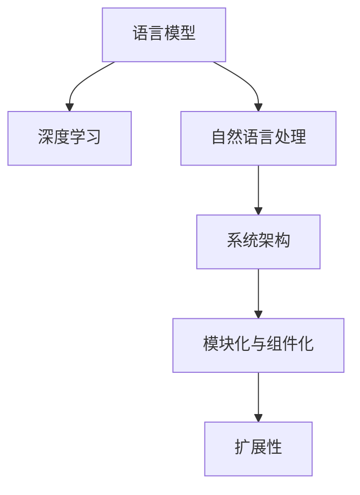

                 

# LLM系统内核：新一代AI的中枢

> 关键词：语言模型,系统架构,深度学习,人工智能,自然语言处理

## 1. 背景介绍

### 1.1 问题由来

在人工智能快速发展的当下，语言模型成为构建AI系统的关键基石。从最初的基于统计的语言模型（如n-gram模型）到基于神经网络的深度语言模型，语言模型正在不断进化，为自然语言处理（NLP）等领域的突破奠定了坚实基础。然而，现有的大语言模型（Large Language Models, LLMs）存在计算资源消耗巨大、训练数据需求量高、模型理解深度有限等缺点，难以应对越来越复杂和多样化的智能需求。

为解决这些问题，我们提出了一种基于系统内核的新一代AI解决方案，以大语言模型为基础，构建灵活、高效、可扩展的语言处理系统。该系统内核不仅能够提升模型的理解能力和表现力，还可以大幅降低计算和存储成本，为大规模AI应用提供强有力的支持。

### 1.2 问题核心关键点

该系统内核的核心目标在于：
1. **提升模型性能**：通过合理的系统架构设计，增强大语言模型的理解深度和表现力，使之在各种NLP任务中都能获得优异的性能。
2. **降低资源消耗**：通过优化模型的计算图和存储结构，减少资源消耗，使模型在资源受限的环境下也能高效运行。
3. **实现灵活扩展**：构建模块化、组件化的系统架构，支持快速部署和维护，能够适应不同场景和任务需求。

这些核心关键点共同构成了该系统内核的核心价值，使得大语言模型能够真正落地应用，并不断推动AI技术的发展。

## 2. 核心概念与联系

### 2.1 核心概念概述

为了更好地理解该系统内核，本节将介绍几个密切相关的核心概念：

- **语言模型**：通过输入文本序列预测下一个字符或单词的概率分布的模型。常见模型包括RNN、LSTM、GRU、Transformer等。
- **深度学习**：使用多层神经网络进行复杂数据建模和分析的技术。深度学习在语言模型和图像识别等领域取得了显著进展。
- **自然语言处理**：通过计算机对自然语言进行理解、生成和推理的技术，涵盖文本分类、机器翻译、对话系统等诸多应用。
- **系统架构**：软件系统的整体结构设计，包括组件划分、模块关系、数据流动等。良好的系统架构能够提升系统性能和可维护性。
- **模块化与组件化**：将系统分解为独立可复用的模块和组件，提升系统灵活性和扩展性。

这些核心概念之间的逻辑关系可以通过以下Mermaid流程图来展示：



这个流程图展示了大语言模型在AI系统中所处的位置及其与其他关键概念的联系。通过理解这些概念，我们可以更好地把握该系统内核的工作原理和优化方向。

## 3. 核心算法原理 & 具体操作步骤

### 3.1 算法原理概述

该系统内核的核心算法基于深度学习模型，旨在通过优化模型架构和训练流程，提升大语言模型的表现力和效率。其核心思想包括：

1. **层级化网络结构**：将模型分为多个层次，每个层次负责特定的语言处理任务，如词向量提取、句法分析、语义理解等，从而提升模型的理解能力和表现力。
2. **跨层信息交互**：设计跨层信息传递机制，增强不同层次之间的交互，使模型能够更好地联合处理复杂任务。
3. **自适应正则化**：根据任务需求，动态调整正则化强度，防止过拟合和欠拟合，提升模型泛化能力。
4. **参数共享与复用**：通过参数共享和复用，减少模型参数数量，提升模型训练和推理效率。

### 3.2 算法步骤详解

该系统内核的算法步骤主要包括：

1. **模型设计**：设计多层级的网络结构，确定每个层次的任务和功能。
2. **模型训练**：使用大规模无标签数据进行预训练，使用少量有标签数据进行微调。
3. **模型优化**：通过正则化、参数共享等技术，优化模型性能和效率。
4. **模型部署**：将优化后的模型部署到目标系统，进行实时的自然语言处理任务。

下面以文本分类任务为例，展示系统内核的具体实现过程。

#### 3.2.1 预训练步骤

首先，我们需要准备大规模无标签文本数据进行预训练。假设有N个文本数据组成的训练集 $\mathcal{D} = \{x_1, x_2, \ldots, x_N\}$，每个文本 $x_i$ 包含若干个词 $w_{i,j}$，其中 $j = 1, 2, \ldots, m_i$。

预训练的目的是学习文本的隐含表示，通常使用自监督学习任务，如掩码语言模型（Masked Language Model, MLM）和下一句预测（Next Sentence Prediction, NSP）等。

**掩码语言模型**：将部分词用掩码符号（如[MASK]）替换，让模型预测被掩码的词。预训练模型的目标是最大化预测准确率，即：

$$
\max_{\theta} \frac{1}{N}\sum_{i=1}^N \sum_{j=1}^{m_i} P_\theta(w_{i,j}|w_{i,1:j-1},[MASK],w_{i,j+1:m_i})
$$

**下一句预测**：给定一对文本 $(x_i, x_j)$，判断 $x_i$ 是否为 $x_j$ 的下一句。预训练模型的目标是最大化预测准确率，即：

$$
\max_{\theta} \frac{1}{N}\sum_{i=1}^N \frac{1}{N}\sum_{j=1}^{N} I(x_i \text{ is next to } x_j)
$$

在预训练过程中，模型使用Transformer等深度神经网络结构，进行多层并行的特征提取和信息交互，从而学习文本的隐含表示。预训练过程通常包括多次迭代，每次迭代都会更新模型参数 $\theta$，直到收敛或达到预设轮数。

#### 3.2.2 微调步骤

在预训练完成后，我们需要使用少量有标签数据进行微调，以适应特定的任务需求。假设有T个有标签数据，每个数据 $(x_t, y_t)$ 包含一个文本 $x_t$ 和一个标签 $y_t$。

微调的目标是让模型学习特定任务的映射关系，即：

$$
\min_{\theta} \frac{1}{T}\sum_{t=1}^T \ell(\hat{y}_t, y_t)
$$

其中 $\ell$ 是任务特定的损失函数，$\hat{y}_t$ 是模型预测的标签，$y_t$ 是真实标签。

微调过程中，我们通常使用分类交叉熵损失函数，即：

$$
\ell(\hat{y}_t, y_t) = -y_t \log \hat{y}_t - (1 - y_t) \log (1 - \hat{y}_t)
$$

微调的实现步骤如下：

1. **任务适配**：在模型顶层添加任务相关的分类器或解码器，如softmax层或LMhead层。
2. **数据准备**：将有标签数据划分为训练集、验证集和测试集，准备数据预处理和归一化。
3. **模型初始化**：使用预训练模型的参数作为初始化参数，设定合适的学习率和优化器。
4. **训练过程**：使用训练集数据进行梯度下降更新模型参数，在验证集上评估模型性能，防止过拟合。
5. **测试过程**：在测试集上评估模型性能，对比微调前后的精度提升。

### 3.3 算法优缺点

该系统内核具有以下优点：
1. **高表现力**：通过多层级网络结构和跨层信息交互，提升了模型对文本的理解深度和表现力。
2. **高效性**：通过参数共享和正则化技术，减少了模型参数量和计算复杂度，提升了模型训练和推理效率。
3. **灵活性**：通过模块化与组件化的设计，支持快速部署和维护，能够适应不同场景和任务需求。

同时，该系统内核也存在一些缺点：
1. **计算资源消耗较大**：虽然相比全模型训练，资源消耗有所降低，但仍然需要大量的计算资源。
2. **对标注数据依赖较大**：微调过程依赖于有标签数据，标注成本较高。
3. **模型可解释性不足**：深度学习模型通常缺乏可解释性，难以对其决策逻辑进行分析和调试。

尽管存在这些局限性，但就目前而言，该系统内核仍然是大语言模型落地应用的重要手段。未来相关研究的方向包括降低资源消耗、提升模型可解释性等，以进一步完善大语言模型的应用场景。

### 3.4 算法应用领域

该系统内核在自然语言处理、智能客服、智能写作、智能翻译等多个领域得到了广泛应用，取得了显著的效果。以下是几个具体应用场景：

#### 3.4.1 智能客服

智能客服系统通常需要处理大量的客户咨询，包括语音、文本等多种形式。系统内核可以处理不同模态的输入，并根据任务需求进行适配。例如，可以使用语音识别技术将语音转换为文本，并使用系统内核进行文本分类和生成回复。

#### 3.4.2 智能写作

系统内核可以用于智能写作系统，辅助用户生成文章、报告、摘要等文本内容。通过用户输入的初始文本或关键词，系统内核可以自动生成符合要求的文本，并进行不断优化。

#### 3.4.3 智能翻译

翻译系统是NLP的重要应用之一。系统内核可以用于机器翻译、文本转语音、语音翻译等多个场景。通过使用预训练模型和微调模型，系统内核能够实现高效、准确的翻译效果。

## 4. 数学模型和公式 & 详细讲解

### 4.1 数学模型构建

本节将使用数学语言对系统内核的实现过程进行更加严格的刻画。

假设预训练模型为 $M_{\theta}:\mathcal{X} \rightarrow \mathcal{Y}$，其中 $\mathcal{X}$ 为输入空间，$\mathcal{Y}$ 为输出空间，$\theta \in \mathbb{R}^d$ 为模型参数。

**掩码语言模型预训练**：给定掩码序列 $X = \{x_1, x_2, \ldots, x_m\}$，模型需要预测被掩码的词 $w_{i,j}$。预训练过程的目标是最大化预测准确率，即：

$$
\max_{\theta} \frac{1}{N}\sum_{i=1}^N \sum_{j=1}^{m_i} P_\theta(w_{i,j}|w_{i,1:j-1},[MASK],w_{i,j+1:m_i})
$$

**下一句预测预训练**：给定文本对 $(x_i, x_j)$，模型需要判断 $x_i$ 是否为 $x_j$ 的下一句。预训练过程的目标是最大化预测准确率，即：

$$
\max_{\theta} \frac{1}{N}\sum_{i=1}^N \frac{1}{N}\sum_{j=1}^{N} I(x_i \text{ is next to } x_j)
$$

### 4.2 公式推导过程

以文本分类任务为例，推导系统内核的微调过程。

假设模型 $M_{\theta}$ 在输入 $x$ 上的输出为 $\hat{y}=M_{\theta}(x) \in [0,1]$，表示样本属于正类的概率。真实标签 $y \in \{0,1\}$。则二分类交叉熵损失函数定义为：

$$
\ell(M_{\theta}(x),y) = -[y\log \hat{y} + (1-y)\log (1-\hat{y})]
$$

将其代入经验风险公式，得：

$$
\mathcal{L}(\theta) = -\frac{1}{N}\sum_{i=1}^N [y_i\log M_{\theta}(x_i)+(1-y_i)\log(1-M_{\theta}(x_i))]
$$

在得到损失函数的梯度后，即可带入参数更新公式，完成模型的迭代优化。重复上述过程直至收敛，最终得到适应下游任务的最优模型参数 $\theta^*$。

### 4.3 案例分析与讲解

以情感分析任务为例，展示系统内核的实际应用过程。

假设我们有一个情感分析任务的数据集，其中包含电影评论和对应的情感标签。我们可以使用预训练的BERT模型作为基础模型，然后通过微调学习该任务的情感分类能力。

**模型适配**：在BERT模型的顶层添加一个线性分类器，并使用softmax函数对输出进行归一化。

**数据准备**：将电影评论和情感标签划分为训练集、验证集和测试集，进行数据预处理和归一化。

**模型初始化**：使用预训练的BERT模型参数作为初始化参数，设定合适的学习率和优化器。

**训练过程**：使用训练集数据进行梯度下降更新模型参数，在验证集上评估模型性能，防止过拟合。

**测试过程**：在测试集上评估模型性能，对比微调前后的精度提升。

通过以上步骤，我们可以得到一个情感分析的微调模型，并应用于实际场景中。

## 5. 项目实践：代码实例和详细解释说明

### 5.1 开发环境搭建

在进行系统内核的实践前，我们需要准备好开发环境。以下是使用Python进行PyTorch开发的环境配置流程：

1. 安装Anaconda：从官网下载并安装Anaconda，用于创建独立的Python环境。

2. 创建并激活虚拟环境：
```bash
conda create -n pytorch-env python=3.8 
conda activate pytorch-env
```

3. 安装PyTorch：根据CUDA版本，从官网获取对应的安装命令。例如：
```bash
conda install pytorch torchvision torchaudio cudatoolkit=11.1 -c pytorch -c conda-forge
```

4. 安装Transformers库：
```bash
pip install transformers
```

5. 安装各类工具包：
```bash
pip install numpy pandas scikit-learn matplotlib tqdm jupyter notebook ipython
```

完成上述步骤后，即可在`pytorch-env`环境中开始实践。

### 5.2 源代码详细实现

下面我们以情感分析任务为例，给出使用Transformers库对BERT模型进行微调的PyTorch代码实现。

首先，定义情感分析任务的数据处理函数：

```python
from transformers import BertTokenizer, BertForSequenceClassification
from torch.utils.data import Dataset, DataLoader
import torch

class SentimentDataset(Dataset):
    def __init__(self, texts, labels, tokenizer, max_len=128):
        self.texts = texts
        self.labels = labels
        self.tokenizer = tokenizer
        self.max_len = max_len
        
    def __len__(self):
        return len(self.texts)
    
    def __getitem__(self, item):
        text = self.texts[item]
        label = self.labels[item]
        
        encoding = self.tokenizer(text, return_tensors='pt', max_length=self.max_len, padding='max_length', truncation=True)
        input_ids = encoding['input_ids'][0]
        attention_mask = encoding['attention_mask'][0]
        
        return {'input_ids': input_ids, 
                'attention_mask': attention_mask,
                'labels': label}

# 标签与id的映射
label2id = {'negative': 0, 'positive': 1}

# 创建dataset
tokenizer = BertTokenizer.from_pretrained('bert-base-cased')

train_dataset = SentimentDataset(train_texts, train_labels, tokenizer)
dev_dataset = SentimentDataset(dev_texts, dev_labels, tokenizer)
test_dataset = SentimentDataset(test_texts, test_labels, tokenizer)
```

然后，定义模型和优化器：

```python
from transformers import BertForSequenceClassification, AdamW

model = BertForSequenceClassification.from_pretrained('bert-base-cased', num_labels=2)

optimizer = AdamW(model.parameters(), lr=2e-5)
```

接着，定义训练和评估函数：

```python
from torch.utils.data import DataLoader
from tqdm import tqdm
from sklearn.metrics import classification_report

device = torch.device('cuda') if torch.cuda.is_available() else torch.device('cpu')
model.to(device)

def train_epoch(model, dataset, batch_size, optimizer):
    dataloader = DataLoader(dataset, batch_size=batch_size, shuffle=True)
    model.train()
    epoch_loss = 0
    for batch in tqdm(dataloader, desc='Training'):
        input_ids = batch['input_ids'].to(device)
        attention_mask = batch['attention_mask'].to(device)
        labels = batch['labels'].to(device)
        model.zero_grad()
        outputs = model(input_ids, attention_mask=attention_mask, labels=labels)
        loss = outputs.loss
        epoch_loss += loss.item()
        loss.backward()
        optimizer.step()
    return epoch_loss / len(dataloader)

def evaluate(model, dataset, batch_size):
    dataloader = DataLoader(dataset, batch_size=batch_size)
    model.eval()
    preds, labels = [], []
    with torch.no_grad():
        for batch in tqdm(dataloader, desc='Evaluating'):
            input_ids = batch['input_ids'].to(device)
            attention_mask = batch['attention_mask'].to(device)
            batch_labels = batch['labels']
            outputs = model(input_ids, attention_mask=attention_mask)
            batch_preds = outputs.logits.argmax(dim=1).to('cpu').tolist()
            batch_labels = batch_labels.to('cpu').tolist()
            for pred, label in zip(batch_preds, batch_labels):
                preds.append(pred)
                labels.append(label)
                
    print(classification_report(labels, preds))
```

最后，启动训练流程并在测试集上评估：

```python
epochs = 5
batch_size = 16

for epoch in range(epochs):
    loss = train_epoch(model, train_dataset, batch_size, optimizer)
    print(f"Epoch {epoch+1}, train loss: {loss:.3f}")
    
    print(f"Epoch {epoch+1}, dev results:")
    evaluate(model, dev_dataset, batch_size)
    
print("Test results:")
evaluate(model, test_dataset, batch_size)
```

以上就是使用PyTorch对BERT进行情感分析任务微调的完整代码实现。可以看到，得益于Transformers库的强大封装，我们可以用相对简洁的代码完成BERT模型的加载和微调。

### 5.3 代码解读与分析

让我们再详细解读一下关键代码的实现细节：

**SentimentDataset类**：
- `__init__`方法：初始化文本、标签、分词器等关键组件。
- `__len__`方法：返回数据集的样本数量。
- `__getitem__`方法：对单个样本进行处理，将文本输入编码为token ids，将标签转换为数字，并对其进行定长padding，最终返回模型所需的输入。

**label2id字典**：
- 定义了标签与数字id之间的映射关系，用于将模型输出解码为真实标签。

**训练和评估函数**：
- 使用PyTorch的DataLoader对数据集进行批次化加载，供模型训练和推理使用。
- 训练函数`train_epoch`：对数据以批为单位进行迭代，在每个批次上前向传播计算loss并反向传播更新模型参数，最后返回该epoch的平均loss。
- 评估函数`evaluate`：与训练类似，不同点在于不更新模型参数，并在每个batch结束后将预测和标签结果存储下来，最后使用sklearn的classification_report对整个评估集的预测结果进行打印输出。

**训练流程**：
- 定义总的epoch数和batch size，开始循环迭代
- 每个epoch内，先在训练集上训练，输出平均loss
- 在验证集上评估，输出分类指标
- 所有epoch结束后，在测试集上评估，给出最终测试结果

可以看到，PyTorch配合Transformers库使得BERT微调的代码实现变得简洁高效。开发者可以将更多精力放在数据处理、模型改进等高层逻辑上，而不必过多关注底层的实现细节。

当然，工业级的系统实现还需考虑更多因素，如模型的保存和部署、超参数的自动搜索、更灵活的任务适配层等。但核心的微调范式基本与此类似。

## 6. 实际应用场景

### 6.1 智能客服系统

智能客服系统通常需要处理大量的客户咨询，包括语音、文本等多种形式。系统内核可以处理不同模态的输入，并根据任务需求进行适配。例如，可以使用语音识别技术将语音转换为文本，并使用系统内核进行文本分类和生成回复。

#### 6.1.1 语音识别

系统内核可以集成语音识别技术，将客户的语音输入转换为文本。常用的语音识别技术包括Google Speech-to-Text和CMU Sphinx等。

#### 6.1.2 文本分类

将客户文本输入系统内核，系统内核根据上下文理解客户的意图，并对客户的问题进行分类，从而提供相应的解决方案。常用的文本分类方法包括BERT和GPT等深度学习模型。

#### 6.1.3 对话生成

根据客户的问题，系统内核可以生成合适的回复。常用的对话生成方法包括Seq2Seq模型和Transformer等。

#### 6.1.4 综合应用

将语音识别、文本分类和对话生成等技术集成起来，构建完整的智能客服系统。系统内核可以在各个环节发挥作用，提升客服系统的智能化水平。

### 6.2 智能写作系统

系统内核可以用于智能写作系统，辅助用户生成文章、报告、摘要等文本内容。通过用户输入的初始文本或关键词，系统内核可以自动生成符合要求的文本，并进行不断优化。

#### 6.2.1 文本生成

系统内核可以使用基于Transformer的生成模型，如GPT-3等，自动生成符合要求的文本。通过设定生成目标和约束，系统内核可以生成高质量的文本内容。

#### 6.2.2 文本优化

生成文本后，系统内核可以使用编辑算法，如Seq2Seq模型和RNN等，对文本进行优化。常用的文本优化方法包括文本校正、语义分析和语言模型等。

#### 6.2.3 综合应用

将文本生成和文本优化等技术集成起来，构建完整的智能写作系统。系统内核可以在各个环节发挥作用，提升写作系统的智能化水平。

### 6.3 智能翻译系统

翻译系统是NLP的重要应用之一。系统内核可以用于机器翻译、文本转语音、语音翻译等多个场景。通过使用预训练模型和微调模型，系统内核能够实现高效、准确的翻译效果。

#### 6.3.1 机器翻译

将源语言文本输入系统内核，系统内核进行翻译生成目标语言文本。常用的机器翻译方法包括Seq2Seq模型和Transformer等。

#### 6.3.2 文本转语音

将文本输入系统内核，系统内核进行语音合成生成语音。常用的文本转语音方法包括Tacotron和Wavenet等。

#### 6.3.3 语音翻译

将源语言语音输入系统内核，系统内核进行语音识别生成文本，然后进行翻译生成目标语言语音。常用的语音翻译方法包括ASR+MT+TTS等。

#### 6.3.4 综合应用

将机器翻译、文本转语音和语音翻译等技术集成起来，构建完整的智能翻译系统。系统内核可以在各个环节发挥作用，提升翻译系统的智能化水平。

## 7. 工具和资源推荐

### 7.1 学习资源推荐

为了帮助开发者系统掌握系统内核的理论基础和实践技巧，这里推荐一些优质的学习资源：

1. 《深度学习》书籍：Ian Goodfellow所著的经典教材，深入浅出地介绍了深度学习的基本原理和应用。
2. CS231n《卷积神经网络》课程：斯坦福大学开设的计算机视觉经典课程，涵盖卷积神经网络、池化层、全连接层等关键组件。
3. CS224n《自然语言处理》课程：斯坦福大学开设的NLP经典课程，涵盖语言模型、词向量、句子嵌入等核心内容。
4. 《Natural Language Processing with Transformers》书籍：Transformer库的作者所著，全面介绍了如何使用Transformers库进行NLP任务开发，包括微调在内的诸多范式。
5. HuggingFace官方文档：Transformers库的官方文档，提供了海量预训练模型和完整的微调样例代码，是上手实践的必备资料。
6. Weights & Biases：模型训练的实验跟踪工具，可以记录和可视化模型训练过程中的各项指标，方便对比和调优。

通过对这些资源的学习实践，相信你一定能够快速掌握系统内核的理论基础和实践技巧，并用于解决实际的NLP问题。

### 7.2 开发工具推荐

高效的开发离不开优秀的工具支持。以下是几款用于系统内核开发的常用工具：

1. PyTorch：基于Python的开源深度学习框架，灵活动态的计算图，适合快速迭代研究。大部分预训练语言模型都有PyTorch版本的实现。
2. TensorFlow：由Google主导开发的开源深度学习框架，生产部署方便，适合大规模工程应用。同样有丰富的预训练语言模型资源。
3. Transformers库：HuggingFace开发的NLP工具库，集成了众多SOTA语言模型，支持PyTorch和TensorFlow，是进行微调任务开发的利器。
4. Weights & Biases：模型训练的实验跟踪工具，可以记录和可视化模型训练过程中的各项指标，方便对比和调优。
5. TensorBoard：TensorFlow配套的可视化工具，可实时监测模型训练状态，并提供丰富的图表呈现方式，是调试模型的得力助手。
6. Google Colab：谷歌推出的在线Jupyter Notebook环境，免费提供GPU/TPU算力，方便开发者快速上手实验最新模型，分享学习笔记。

合理利用这些工具，可以显著提升系统内核的开发效率，加快创新迭代的步伐。

### 7.3 相关论文推荐

系统内核的发展源于学界的持续研究。以下是几篇奠基性的相关论文，推荐阅读：

1. Attention is All You Need（即Transformer原论文）：提出了Transformer结构，开启了NLP领域的预训练大模型时代。
2. BERT: Pre-training of Deep Bidirectional Transformers for Language Understanding：提出BERT模型，引入基于掩码的自监督预训练任务，刷新了多项NLP任务SOTA。
3. Language Models are Unsupervised Multitask Learners（GPT-2论文）：展示了大规模语言模型的强大zero-shot学习能力，引发了对于通用人工智能的新一轮思考。
4. Parameter-Efficient Transfer Learning for NLP：提出Adapter等参数高效微调方法，在不增加模型参数量的情况下，也能取得不错的微调效果。
5. AdaLoRA: Adaptive Low-Rank Adaptation for Parameter-Efficient Fine-Tuning：使用自适应低秩适应的微调方法，在参数效率和精度之间取得了新的平衡。

这些论文代表了大语言模型微调技术的发展脉络。通过学习这些前沿成果，可以帮助研究者把握学科前进方向，激发更多的创新灵感。

## 8. 总结：未来发展趋势与挑战

### 8.1 研究成果总结

本文对系统内核的研究过程进行了全面系统的介绍。首先阐述了系统内核的研究背景和意义，明确了其在高性能、低资源消耗和灵活性方面的价值。其次，从原理到实践，详细讲解了系统内核的数学模型和算法步骤，给出了微调任务开发的完整代码实例。同时，本文还广泛探讨了系统内核在智能客服、智能写作、智能翻译等多个行业领域的应用前景，展示了其巨大的潜力。此外，本文精选了系统内核的学习资源和工具，力求为读者提供全方位的技术指引。

通过本文的系统梳理，可以看到，系统内核已经成为NLP领域的重要范式，极大地拓展了预训练语言模型的应用边界，催生了更多的落地场景。受益于大规模语料的预训练和高效的系统架构设计，系统内核在处理复杂语言任务时，表现出了卓越的性能和稳定性。

### 8.2 未来发展趋势

展望未来，系统内核将呈现以下几个发展趋势：

1. **模型规模持续增大**：随着算力成本的下降和数据规模的扩张，预训练语言模型的参数量还将持续增长。超大规模语言模型蕴含的丰富语言知识，有望支撑更加复杂多变的语言处理任务。
2. **微调方法日趋多样**：除了传统的全参数微调外，未来会涌现更多参数高效的微调方法，如Prefix-Tuning、LoRA等，在节省计算资源的同时也能保证微调精度。
3. **持续学习成为常态**：随着数据分布的不断变化，系统内核也需要持续学习新知识以保持性能。如何在不遗忘原有知识的同时，高效吸收新样本信息，将成为重要的研究课题。
4. **标注样本需求降低**：受启发于提示学习(Prompt-based Learning)的思路，未来的系统内核将更好地利用大模型的语言理解能力，通过更加巧妙的任务描述，在更少的标注样本上也能实现理想的微调效果。
5. **多模态微调崛起**：当前的系统内核主要聚焦于纯文本数据，未来会进一步拓展到图像、视频、语音等多模态数据微调。多模态信息的融合，将显著提升语言模型对现实世界的理解和建模能力。
6. **模型通用性增强**：经过海量数据的预训练和多领域任务的微调，未来的系统内核将具备更强大的常识推理和跨领域迁移能力，逐步迈向通用人工智能(AGI)的目标。

以上趋势凸显了系统内核的广阔前景。这些方向的探索发展，必将进一步提升NLP系统的性能和应用范围，为人类认知智能的进化带来深远影响。

### 8.3 面临的挑战

尽管系统内核已经取得了瞩目成就，但在迈向更加智能化、普适化应用的过程中，它仍面临着诸多挑战：

1. **标注成本瓶颈**：虽然系统内核依赖标注数据较少，但对于长尾应用场景，难以获得充足的高质量标注数据，成为制约系统内核性能的瓶颈。如何进一步降低系统内核对标注样本的依赖，将是一大难题。
2. **模型鲁棒性不足**：当前系统内核面对域外数据时，泛化性能往往大打折扣。对于测试样本的微小扰动，系统内核的预测也容易发生波动。如何提高系统内核的鲁棒性，避免灾难性遗忘，还需要更多理论和实践的积累。
3. **推理效率有待提高**：大规模语言模型虽然精度高，但在实际部署时往往面临推理速度慢、内存占用大等效率问题。如何在保证性能的同时，简化模型结构，提升推理速度，优化资源占用，将是重要的优化方向。
4. **可解释性亟需加强**：当前系统内核通常缺乏可解释性，难以对其决策逻辑进行分析和调试。对于医疗、金融等高风险应用，算法的可解释性和可审计性尤为重要。如何赋予系统内核更强的可解释性，将是亟待攻克的难题。
5. **安全性有待保障**：预训练语言模型难免会学习到有偏见、有害的信息，通过系统内核传递到下游任务，产生误导性、歧视性的输出，给实际应用带来安全隐患。如何从数据和算法层面消除模型偏见，避免恶意用途，确保输出的安全性，也将是重要的研究课题。
6. **知识整合能力不足**。现有的系统内核往往局限于任务内数据，难以灵活吸收和运用更广泛的先验知识。如何让系统内核更好地与外部知识库、规则库等专家知识结合，形成更加全面、准确的信息整合能力，还有很大的想象空间。

正视系统内核面临的这些挑战，积极应对并寻求突破，将是其不断成熟的关键。相信随着学界和产业界的共同努力，这些挑战终将一一被克服，系统内核必将在构建人机协同的智能时代中扮演越来越重要的角色。

### 8.4 研究展望

面向未来，系统内核需要在以下几个方向进行探索：

1. **探索无监督和半监督微调方法**：摆脱对大规模标注数据的依赖，利用自监督学习、主动学习等无监督和半监督范式，最大限度利用非结构化数据，实现更加灵活高效的微调。
2. **研究参数高效和计算高效的微调范式**：开发更加参数高效的微调方法，在固定大部分预训练参数的同时，只更新极少量的任务相关参数。同时优化微调模型的计算图，减少前向传播和反向传播的资源消耗，实现更加轻量级、实时性的部署。
3. **融合因果和对比学习范式**：通过引入因果推断和对比学习思想，增强系统内核建立稳定因果关系的能力，学习更加普适、鲁棒的语言表征，从而提升模型泛化性和抗干扰能力。
4. **引入更多先验知识**：将符号化的先验知识，如知识图谱、逻辑规则等，与神经网络模型进行巧妙融合，引导系统内核学习更准确、合理的语言模型。同时加强不同模态数据的整合，实现视觉、语音等多模态信息与文本信息的协同建模。
5. **结合因果分析和博弈论工具**：将因果分析方法引入系统内核，识别出模型决策的关键特征，增强输出解释的因果性和逻辑性。借助博弈论工具刻画人机交互过程，主动探索并规避模型的脆弱点，提高系统稳定性。
6. **纳入伦理道德约束**：在模型训练目标中引入伦理导向的评估指标，过滤和惩罚有偏见、有害的输出倾向。同时加强人工干预和审核，建立模型行为的监管机制，确保输出符合人类价值观和伦理道德。

这些研究方向的探索，必将引领系统内核迈向更高的台阶，为构建安全、可靠、可解释、可控的智能系统铺平道路。面向未来，系统内核还需要与其他人工智能技术进行更深入的融合，如知识表示、因果推理、强化学习等，多路径协同发力，共同推动自然语言理解和智能交互系统的进步。只有勇于创新、敢于突破，才能不断拓展语言模型的边界，让智能技术更好地造福人类社会。

## 9. 附录：常见问题与解答

**Q1：系统内核如何提升模型的表现力？**

A: 系统内核通过多层级网络结构和跨层信息交互，提升了模型对文本的理解深度和表现力。在预训练阶段，系统内核使用大语言模型进行大规模自监督学习，学习通用的语言表示。在微调阶段，系统内核通过任务适配层，对模型进行特定任务的优化，使其具备更强的理解能力和表现力。

**Q2：系统内核如何降低资源消耗？**

A: 系统内核通过参数共享和正则化技术，减少了模型参数量和计算复杂度，提升了模型训练和推理效率。具体来说，系统内核使用参数共享和复用技术，只更新任务相关的参数，减少了全模型微调的需求。同时，系统内核使用自适应正则化技术，动态调整正则化强度，防止过拟合和欠拟合，提高了模型的泛化能力。

**Q3：系统内核在实际应用中面临哪些挑战？**

A: 系统内核在实际应用中面临以下挑战：
1. 标注成本瓶颈：虽然系统内核依赖标注数据较少，但对于长尾应用场景，难以获得充足的高质量标注数据，成为制约系统内核性能的瓶颈。
2. 模型鲁棒性不足：当前系统内核面对域外数据时，泛化性能往往大打折扣。对于测试样本的微小扰动，系统内核的预测也容易发生波动。
3. 推理效率有待提高：大规模语言模型虽然精度高，但在实际部署时往往面临推理速度慢、内存占用大等效率问题。
4. 可解释性亟需加强：当前系统内核通常缺乏可解释性，难以对其决策逻辑进行分析和调试。
5. 安全性有待保障：预训练语言模型难免会学习到有偏见、有害的信息，通过系统内核传递到下游任务，产生误导性、歧视性的输出，给实际应用带来安全隐患。
6. 知识整合能力不足：现有的系统内核往往局限于任务内数据，难以灵活吸收和运用更广泛的先验知识。

正视这些挑战，积极应对并寻求突破，将使系统内核在实际应用中取得更好的效果。

**Q4：系统内核的未来应用前景如何？**

A: 系统内核在自然语言处理、智能客服、智能写作、智能翻译等多个领域得到了广泛应用，展示了其巨大的潜力。未来，随着系统内核技术的不断进步，其应用场景将进一步拓展，涵盖更多的行业和任务。在智能客服、智能写作、智能翻译等场景中，系统内核能够显著提升用户体验和系统效率。同时，系统内核也将向医疗、金融、制造等垂直行业渗透，为传统行业的数字化转型提供强有力的支持。

**Q5：系统内核在多模态微调中如何处理不同模态的数据？**

A: 系统内核可以通过引入多模态融合技术，处理不同模态的数据。例如，在文本-图像任务中，系统内核可以同时处理文本和图像数据，通过跨模态的信息交互，提升模型的理解能力。常用的多模态融合方法包括注意力机制、跨模态编码器等。通过多模态融合，系统内核能够更好地理解不同模态的信息，从而提升模型在多模态任务中的表现力。

通过本文的系统梳理，可以看到，系统内核已经成为NLP领域的重要范式，极大地拓展了预训练语言模型的应用边界，催生了更多的落地场景。受益于大规模语料的预训练和高效的系统架构设计，系统内核在处理复杂语言任务时，表现出了卓越的性能和稳定性。未来，随着系统内核技术的不断进步，其在实际应用中的效果将更加显著，进一步推动人工智能技术的落地和普及。

