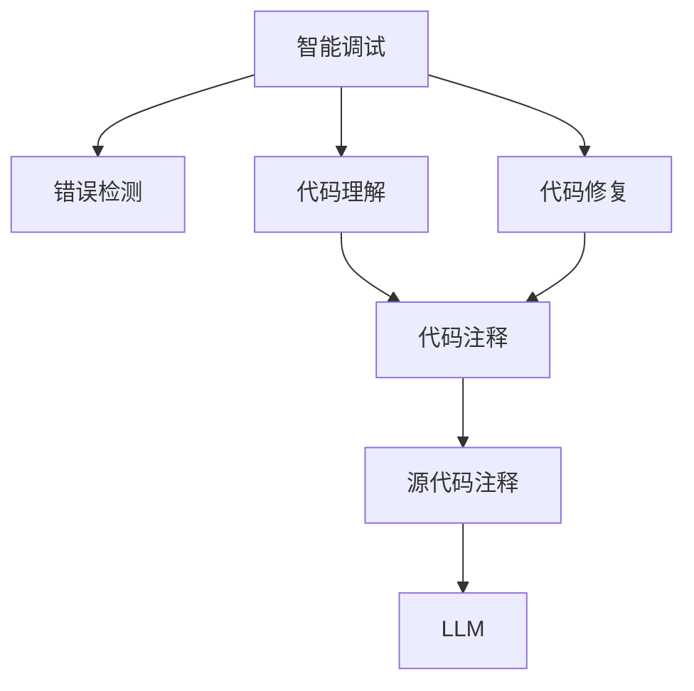

                 

# LLM赋能的智能调试技术探索

> 关键词：智能调试,LLM,代码理解,代码修复,源代码注释,错误检测,可解释性

## 1. 背景介绍

随着大型软件系统的复杂度不断提升，如何高效、准确地定位和修复软件错误成为了软件开发中的一个重要挑战。传统的手动调试方式耗时耗力，且容易遗漏一些隐性的错误。智能调试技术利用人工智能技术辅助程序员进行错误定位和修复，大幅提升了软件开发效率和质量。然而，智能调试技术本身也需要调试和优化，如何设计出高效、精确的智能调试系统，成为了学术界和工业界的重要研究课题。

近年来，大规模预训练语言模型(LLMs)在自然语言处理(NLP)领域取得了突破性进展。它们通过在海量文本数据上进行预训练，具备了强大的语言理解和生成能力，已经在翻译、问答、文本摘要等诸多NLP任务上取得了优异的效果。这些模型经过微调，可以自动生成高质量的代码注释、理解代码上下文、生成修复代码等，进一步提升了智能调试系统的性能。本文将探讨基于LLM的智能调试技术，包括其原理、具体操作步骤和未来展望，为开发者提供全面的指导。

## 2. 核心概念与联系

### 2.1 核心概念概述

在探讨基于LLM的智能调试技术之前，我们先简要介绍一下相关的核心概念：

- **智能调试**：使用人工智能技术辅助程序员进行软件错误定位和修复的过程。智能调试包括错误检测、代码理解、修复建议生成等环节。
- **LLM**：指通过大规模无标签文本数据进行预训练的语言模型，如GPT、BERT、XLNet等。这些模型通常具有强大的语言理解和生成能力，可以用于生成代码注释、理解代码上下文等。
- **代码理解**：指通过自然语言处理技术理解代码的功能、结构、意图等。代码理解是智能调试的核心技术之一，通常使用LLM进行。
- **代码修复**：指通过智能建议或代码自动生成技术，辅助程序员修复代码中的错误。代码修复能够显著降低修复成本，提高修复效率。
- **源代码注释**：指为代码编写的解释性文本，用于帮助程序员理解代码的功能、结构、意图等。良好的源代码注释是智能调试的基础。
- **错误检测**：指通过自动化技术检测代码中的潜在错误，包括语法错误、运行时错误、逻辑错误等。错误检测能够显著减少调试的时间和成本。

### 2.2 核心概念之间的联系

上述核心概念之间存在紧密的联系，可以通过以下Mermaid流程图表示：



这个流程图展示了智能调试系统的核心流程：

1. **错误检测**：通过自动化技术检测代码中的潜在错误。
2. **代码理解**：使用LLM生成代码注释，理解代码的功能、结构、意图等。
3. **代码修复**：通过LLM生成修复代码，辅助程序员修复错误。
4. **源代码注释**：生成高质量的代码注释，帮助程序员理解代码。
5. **LLM**：作为代码理解和修复的核心组件，利用预训练的通用知识进行代码解析和生成。

## 3. 核心算法原理 & 具体操作步骤

### 3.1 算法原理概述

基于LLM的智能调试技术主要利用了深度学习和自然语言处理技术的强大能力。其核心原理可以概括为以下几个方面：

- **代码理解**：使用LLM解析代码，生成代码注释，帮助程序员理解代码的功能、结构、意图等。
- **错误检测**：利用LLM对代码进行错误检测，识别出潜在的语法错误、运行时错误、逻辑错误等。
- **代码修复**：使用LLM生成修复代码，辅助程序员快速修复错误。

这些过程可以大致分为三个阶段：数据准备、模型训练和模型应用。数据准备阶段主要涉及代码语料库的构建和预处理；模型训练阶段主要使用监督学习或无监督学习方法训练LLM；模型应用阶段则是将训练好的模型应用于实际的智能调试任务中。

### 3.2 算法步骤详解

#### 3.2.1 数据准备

数据准备是智能调试系统的第一步。数据准备阶段的主要任务是收集和构建代码语料库，并进行预处理。代码语料库可以包含大量的源代码、测试用例、错误日志等，通过这些数据可以训练出高质量的LLM。

具体来说，数据准备的步骤包括：

1. **数据收集**：收集大量的源代码和错误日志数据，构建代码语料库。
2. **数据预处理**：对代码语料库进行预处理，如分词、标记化、去除注释等。
3. **数据增强**：通过合成数据、标注数据等方式增强数据的多样性，提高模型的泛化能力。

#### 3.2.2 模型训练

模型训练是智能调试系统的核心环节。训练过程中，需要使用大量的代码语料库和标注数据，对LLM进行训练。训练的目标是使LLM能够自动理解代码的功能、结构、意图等，并生成高质量的代码注释和修复代码。

具体来说，模型训练的步骤包括：

1. **模型选择**：选择适合的LLM模型，如GPT、BERT、XLNet等。
2. **训练框架**：使用深度学习框架，如PyTorch、TensorFlow等，构建训练流程。
3. **损失函数**：设计损失函数，如交叉熵损失、均方误差损失等，用于衡量模型的输出与真实标签之间的差异。
4. **优化器**：选择优化器，如Adam、SGD等，用于更新模型参数。
5. **训练策略**：设定训练策略，如学习率调度、批大小、迭代轮数等。
6. **评估指标**：设定评估指标，如BLEU、ROUGE、F1-score等，用于衡量模型的性能。

#### 3.2.3 模型应用

模型应用是智能调试系统的最后一步。在模型训练完成后，将其应用于实际的智能调试任务中，帮助程序员进行错误定位和修复。

具体来说，模型应用的步骤包括：

1. **数据输入**：将需要调试的代码输入模型中，获取代码注释和修复建议。
2. **错误检测**：利用模型进行错误检测，识别出潜在的错误。
3. **代码理解**：使用模型生成代码注释，帮助程序员理解代码的功能、结构、意图等。
4. **代码修复**：利用模型生成修复代码，辅助程序员快速修复错误。
5. **交互式调试**：与程序员进行交互，实时获取调试反馈，进一步优化模型性能。

### 3.3 算法优缺点

基于LLM的智能调试技术具有以下优点：

- **高效准确**：利用预训练的LLM进行代码理解、错误检测和修复，能够显著提高调试效率和准确性。
- **泛化能力强**：预训练的LLM可以适应多种类型的代码，具有较强的泛化能力。
- **可解释性强**：LLM生成的代码注释和修复建议具有一定的可解释性，便于程序员理解和调试。

同时，这种技术也存在一些缺点：

- **依赖数据**：LLM的效果高度依赖于数据质量和多样性，数据不足或数据质量差会导致模型效果不佳。
- **计算资源消耗大**：训练和推理预训练的LLM需要消耗大量的计算资源，包括GPU、TPU等高性能设备。
- **依赖语言模型**：LLM的效果高度依赖于预训练的质量和模型架构，一旦模型出现问题，整个系统的性能都会受到影响。

### 3.4 算法应用领域

基于LLM的智能调试技术已经在多个领域得到了广泛应用，以下是其中几个典型的应用场景：

- **软件开发**：帮助程序员进行错误定位和修复，提升软件开发效率。
- **测试自动化**：辅助测试人员编写测试用例，进行代码质量检测。
- **代码审计**：对代码进行自动化审计，发现潜在的代码问题和安全漏洞。
- **智能编程助手**：提供代码提示、自动补全等智能辅助功能，提高程序员的开发效率。

## 4. 数学模型和公式 & 详细讲解 & 举例说明

### 4.1 数学模型构建

基于LLM的智能调试技术主要利用了深度学习和自然语言处理技术的强大能力。其核心原理可以概括为以下几个方面：

- **代码理解**：使用LLM解析代码，生成代码注释，帮助程序员理解代码的功能、结构、意图等。
- **错误检测**：利用LLM对代码进行错误检测，识别出潜在的语法错误、运行时错误、逻辑错误等。
- **代码修复**：使用LLM生成修复代码，辅助程序员快速修复错误。

这些过程可以大致分为三个阶段：数据准备、模型训练和模型应用。数据准备阶段主要涉及代码语料库的构建和预处理；模型训练阶段主要使用监督学习或无监督学习方法训练LLM；模型应用阶段则是将训练好的模型应用于实际的智能调试任务中。

### 4.2 公式推导过程

以下是智能调试系统的数学模型构建和推导过程。

假设我们需要训练一个基于GPT的智能调试模型，其输入为代码片段，输出为代码注释和修复代码。设模型输入为 $x$，输出为 $y$，则模型可以表示为：

$$
y = g(x; \theta)
$$

其中 $g$ 表示模型，$\theta$ 表示模型参数。对于代码理解任务，模型的损失函数可以表示为：

$$
\mathcal{L}_{code} = -\frac{1}{N} \sum_{i=1}^N \log p(y_i|x_i)
$$

其中 $p$ 表示模型概率，$N$ 表示训练集大小。对于错误检测任务，模型的损失函数可以表示为：

$$
\mathcal{L}_{error} = -\frac{1}{N} \sum_{i=1}^N \log p(b_i|x_i)
$$

其中 $b_i$ 表示代码片段中的错误信息，$\log p$ 表示模型对错误信息的概率估计。对于代码修复任务，模型的损失函数可以表示为：

$$
\mathcal{L}_{repair} = -\frac{1}{N} \sum_{i=1}^N \log p(r_i|x_i)
$$

其中 $r_i$ 表示修复后的代码片段，$\log p$ 表示模型对修复后的代码片段的概率估计。

### 4.3 案例分析与讲解

以错误检测任务为例，我们可以利用BERT模型进行实现。假设我们的代码语料库包含1000个代码片段，每个代码片段包含100行代码。我们可以将这些代码片段和对应的错误信息构建训练集，用于训练BERT模型。

训练集的数据格式如下：

```
(x1, y1), (x2, y2), ..., (x1000, y1000)
```

其中 $x_i$ 表示第 $i$ 个代码片段，$y_i$ 表示第 $i$ 个代码片段的错误信息。我们使用交叉熵损失函数进行训练，训练过程可以表示为：

$$
\theta \leftarrow \theta - \eta \nabla_{\theta}\mathcal{L}(\theta) - \eta\lambda\theta
$$

其中 $\eta$ 表示学习率，$\lambda$ 表示正则化系数，$\nabla_{\theta}\mathcal{L}(\theta)$ 表示损失函数对模型参数的梯度。

## 5. 项目实践：代码实例和详细解释说明

### 5.1 开发环境搭建

在进行智能调试系统开发前，我们需要准备好开发环境。以下是使用Python进行PyTorch开发的环境配置流程：

1. 安装Anaconda：从官网下载并安装Anaconda，用于创建独立的Python环境。

2. 创建并激活虚拟环境：
```bash
conda create -n pytorch-env python=3.8 
conda activate pytorch-env
```

3. 安装PyTorch：根据CUDA版本，从官网获取对应的安装命令。例如：
```bash
conda install pytorch torchvision torchaudio cudatoolkit=11.1 -c pytorch -c conda-forge
```

4. 安装TensorFlow：由Google主导开发的开源深度学习框架，生产部署方便，适合大规模工程应用。同样有丰富的预训练语言模型资源。

5. 安装Transformers库：HuggingFace开发的NLP工具库，集成了众多SOTA语言模型，支持PyTorch和TensorFlow，是进行智能调试任务开发的利器。

6. 安装各类工具包：
```bash
pip install numpy pandas scikit-learn matplotlib tqdm jupyter notebook ipython
```

完成上述步骤后，即可在`pytorch-env`环境中开始智能调试系统的开发。

### 5.2 源代码详细实现

下面我们以基于BERT的代码理解任务为例，给出使用Transformers库的PyTorch代码实现。

首先，定义代码理解任务的数据处理函数：

```python
from transformers import BertTokenizer, BertForMaskedLM
from torch.utils.data import Dataset
import torch

class CodeUnderstandingDataset(Dataset):
    def __init__(self, codes, tokens, labels, tokenizer):
        self.codes = codes
        self.tokens = tokens
        self.labels = labels
        self.tokenizer = tokenizer
        
    def __len__(self):
        return len(self.codes)
    
    def __getitem__(self, item):
        code = self.codes[item]
        tokens = self.tokens[item]
        label = self.labels[item]
        
        encoding = self.tokenizer(code, return_tensors='pt', max_length=512, padding='max_length', truncation=True)
        input_ids = encoding['input_ids'][0]
        attention_mask = encoding['attention_mask'][0]
        
        # 对token-wise的标签进行编码
        encoded_labels = [label2id[label] for label in labels] 
        encoded_labels.extend([label2id['<PAD>']] * (512 - len(encoded_labels)))
        labels = torch.tensor(encoded_labels, dtype=torch.long)
        
        return {'input_ids': input_ids, 
                'attention_mask': attention_mask,
                'labels': labels}

# 标签与id的映射
label2id = {'start': 0, 'end': 1, 'error': 2, 'correct': 3}
id2label = {v: k for k, v in label2id.items()}

# 创建dataset
tokenizer = BertTokenizer.from_pretrained('bert-base-cased')

train_dataset = CodeUnderstandingDataset(train_codes, train_tokens, train_labels, tokenizer)
dev_dataset = CodeUnderstandingDataset(dev_codes, dev_tokens, dev_labels, tokenizer)
test_dataset = CodeUnderstandingDataset(test_codes, test_tokens, test_labels, tokenizer)
```

然后，定义模型和优化器：

```python
from transformers import BertForMaskedLM, AdamW

model = BertForMaskedLM.from_pretrained('bert-base-cased', num_labels=len(label2id))

optimizer = AdamW(model.parameters(), lr=2e-5)
```

接着，定义训练和评估函数：

```python
from torch.utils.data import DataLoader
from tqdm import tqdm
from sklearn.metrics import precision_recall_fscore_support

device = torch.device('cuda') if torch.cuda.is_available() else torch.device('cpu')
model.to(device)

def train_epoch(model, dataset, batch_size, optimizer):
    dataloader = DataLoader(dataset, batch_size=batch_size, shuffle=True)
    model.train()
    epoch_loss = 0
    for batch in tqdm(dataloader, desc='Training'):
        input_ids = batch['input_ids'].to(device)
        attention_mask = batch['attention_mask'].to(device)
        labels = batch['labels'].to(device)
        model.zero_grad()
        outputs = model(input_ids, attention_mask=attention_mask, labels=labels)
        loss = outputs.loss
        epoch_loss += loss.item()
        loss.backward()
        optimizer.step()
    return epoch_loss / len(dataloader)

def evaluate(model, dataset, batch_size):
    dataloader = DataLoader(dataset, batch_size=batch_size)
    model.eval()
    preds, labels = [], []
    with torch.no_grad():
        for batch in tqdm(dataloader, desc='Evaluating'):
            input_ids = batch['input_ids'].to(device)
            attention_mask = batch['attention_mask'].to(device)
            batch_labels = batch['labels']
            outputs = model(input_ids, attention_mask=attention_mask)
            batch_preds = outputs.logits.argmax(dim=2).to('cpu').tolist()
            batch_labels = batch_labels.to('cpu').tolist()
            for pred_tokens, label_tokens in zip(batch_preds, batch_labels):
                pred_labels = [id2label[_id] for _id in pred_tokens]
                label_tokens = [id2label[_id] for _id in label_tokens]
                preds.append(pred_labels[:len(label_tokens)])
                labels.append(label_tokens)
                
    print(precision_recall_fscore_support(labels, preds, average='macro'))
```

最后，启动训练流程并在测试集上评估：

```python
epochs = 5
batch_size = 16

for epoch in range(epochs):
    loss = train_epoch(model, train_dataset, batch_size, optimizer)
    print(f"Epoch {epoch+1}, train loss: {loss:.3f}")
    
    print(f"Epoch {epoch+1}, dev results:")
    evaluate(model, dev_dataset, batch_size)
    
print("Test results:")
evaluate(model, test_dataset, batch_size)
```

以上就是使用PyTorch对BERT进行代码理解任务微调的完整代码实现。可以看到，得益于Transformers库的强大封装，我们可以用相对简洁的代码完成BERT模型的加载和微调。

### 5.3 代码解读与分析

让我们再详细解读一下关键代码的实现细节：

**CodeUnderstandingDataset类**：
- `__init__`方法：初始化代码片段、标签、分词器等关键组件。
- `__len__`方法：返回数据集的样本数量。
- `__getitem__`方法：对单个样本进行处理，将代码片段输入编码为token ids，将标签编码为数字，并对其进行定长padding，最终返回模型所需的输入。

**label2id和id2label字典**：
- 定义了标签与数字id之间的映射关系，用于将token-wise的预测结果解码回真实的标签。

**训练和评估函数**：
- 使用PyTorch的DataLoader对数据集进行批次化加载，供模型训练和推理使用。
- 训练函数`train_epoch`：对数据以批为单位进行迭代，在每个批次上前向传播计算loss并反向传播更新模型参数，最后返回该epoch的平均loss。
- 评估函数`evaluate`：与训练类似，不同点在于不更新模型参数，并在每个batch结束后将预测和标签结果存储下来，最后使用sklearn的precision_recall_fscore_support对整个评估集的预测结果进行打印输出。

**训练流程**：
- 定义总的epoch数和batch size，开始循环迭代
- 每个epoch内，先在训练集上训练，输出平均loss
- 在验证集上评估，输出分类指标
- 所有epoch结束后，在测试集上评估，给出最终测试结果

可以看到，PyTorch配合Transformers库使得BERT微调的代码实现变得简洁高效。开发者可以将更多精力放在数据处理、模型改进等高层逻辑上，而不必过多关注底层的实现细节。

当然，工业级的系统实现还需考虑更多因素，如模型的保存和部署、超参数的自动搜索、更灵活的任务适配层等。但核心的微调范式基本与此类似。

## 6. 实际应用场景

### 6.1 智能调试平台

基于大语言模型的智能调试技术可以应用于智能调试平台中，帮助程序员进行错误定位和修复。

在技术实现上，可以收集企业内部的历史代码库，将代码片段和对应的错误信息构建成监督数据，在此基础上对预训练模型进行微调。微调后的模型能够自动理解代码的功能、结构、意图等，提供代码注释、错误检测和修复建议。对于程序员提出的新问题，还可以接入检索系统实时搜索相关内容，动态组织生成回答。如此构建的智能调试平台，能大幅提升程序员的开发效率，减少调试时间和成本。

### 6.2 代码审计工具

大语言模型可以用于开发代码审计工具，帮助企业进行代码质量检测和合规性检查。

具体而言，可以收集企业内部的代码库，对代码进行自动化审计，识别出潜在的代码问题和安全漏洞。通过微调后的模型，可以自动理解代码的功能、结构、意图等，并提供详细的审计报告，帮助企业及时发现并修复问题。

### 6.3 测试自动化

大语言模型可以用于开发测试自动化工具，帮助企业进行测试用例的生成和测试结果的评估。

通过微调后的模型，可以自动理解代码的功能和结构，生成符合要求的测试用例。同时，模型还可以对测试结果进行自动评估，识别出测试用例中的错误和遗漏，提高测试效率和质量。

### 6.4 未来应用展望

随着大语言模型和微调方法的不断发展，基于微调范式将在更多领域得到应用，为传统行业带来变革性影响。

在智慧医疗领域，基于大语言模型的智能调试技术可以帮助医生编写高效、精确的病历和诊断报告，提高医疗服务的质量和效率。

在智能教育领域，微调技术可应用于作业批改、学情分析、知识推荐等方面，因材施教，促进教育公平，提高教学质量。

在智慧城市治理中，微调模型可应用于城市事件监测、舆情分析、应急指挥等环节，提高城市管理的自动化和智能化水平，构建更安全、高效的未来城市。

此外，在企业生产、社会治理、文娱传媒等众多领域，基于大语言模型微调的人工智能应用也将不断涌现，为经济社会发展注入新的动力。相信随着技术的日益成熟，微调方法将成为人工智能落地应用的重要范式，推动人工智能技术在垂直行业的规模化落地。总之，微调需要开发者根据具体任务，不断迭代和优化模型、数据和算法，方能得到理想的效果。

## 7. 工具和资源推荐
### 7.1 学习资源推荐

为了帮助开发者系统掌握大语言模型微调的理论基础和实践技巧，这里推荐一些优质的学习资源：

1. 《深度学习与自然语言处理》书籍：斯坦福大学机器学习课程，涵盖了深度学习与自然语言处理的基本概念和经典模型。
2. 《自然语言处理入门与实践》博文：详细介绍了自然语言处理的基本原理和实践方法，包括代码理解、错误检测等。
3. 《自然语言处理综述》论文：综述了自然语言处理领域的主要技术和进展，适合深入学习。
4. 《自然语言处理与人工智能》课程：麻省理工学院教授讲解的自然语言处理课程，涵盖深度学习、自然语言处理等内容。
5. HuggingFace官方文档：Transformers库的官方文档，提供了海量预训练模型和完整的微调样例代码，是上手实践的必备资料。

通过对这些资源的学习实践，相信你一定能够快速掌握大语言模型微调的精髓，并用于解决实际的NLP问题。
### 7.2 开发工具推荐

高效的开发离不开优秀的工具支持。以下是几款用于大语言模型微调开发的常用工具：

1. PyTorch：基于Python的开源深度学习框架，灵活动态的计算图，适合快速迭代研究。大部分预训练语言模型都有PyTorch版本的实现。
2. TensorFlow：由Google主导开发的开源深度学习框架，生产部署方便，适合大规模工程应用。同样有丰富的预训练语言模型资源。
3. Transformers库：HuggingFace开发的NLP工具库，集成了众多SOTA语言模型，支持PyTorch和TensorFlow，是进行智能调试任务开发的利器。
4. Weights & Biases：模型训练的实验跟踪工具，可以记录和可视化模型训练过程中的各项指标，方便对比和调优。与主流深度学习框架无缝集成。
5. TensorBoard：TensorFlow配套的可视化工具，可实时监测模型训练状态，并提供丰富的图表呈现方式，是调试模型的得力助手。
6. Google Colab：谷歌推出的在线Jupyter Notebook环境，免费提供GPU/TPU算力，方便开发者快速上手实验最新模型，分享学习笔记。

合理利用这些工具，可以显著提升大语言模型微调任务的开发效率，加快创新迭代的步伐。

### 7.3 相关论文推荐

大语言模型和微调技术的发展源于学界的持续研究。以下是几篇奠基性的相关论文，推荐阅读：

1. Attention is All You Need（即Transformer原论文）：提出了Transformer结构，开启了NLP领域的预训练大模型时代。
2. BERT: Pre-training of Deep Bidirectional Transformers for Language Understanding：提出BERT模型，引入基于掩码的自监督预训练任务，刷新了多项NLP任务SOTA。
3. Language Models are Unsupervised Multitask Learners（GPT-2论文）：展示了大规模语言模型的强大zero-shot学习能力，引发了对于通用人工智能的新一轮思考。
4. Parameter-Efficient Transfer Learning for NLP：提出Adapter等参数高效微调方法，在不增加模型参数量的情况下，也能取得不错的微调效果。
5. Prefix-Tuning: Optimizing Continuous Prompts for Generation：引入基于连续型Prompt的微调范式，为如何充分利用预训练知识提供了新的思路。
6. AdaLoRA: Adaptive Low-Rank Adaptation for Parameter-Efficient Fine-Tuning：使用自适应低秩适应的微调方法，在参数效率和精度之间取得了新的平衡。

这些论文代表了大语言模型微调技术的发展脉络。通过学习这些前沿成果，可以帮助研究者把握学科前进方向，激发更多的创新灵感。

## 8. 总结：未来发展趋势与挑战

### 8.1 总结

本文对基于大语言模型的智能调试技术进行了全面系统的介绍。首先阐述了智能调试技术的研究背景和意义，明确了微调在拓展预训练模型应用、提升下游任务性能方面的独特价值。其次，从原理到实践，详细讲解了监督微调的数学原理和关键步骤，给出了智能调试任务开发的完整代码实例。同时，本文还广泛探讨了智能调试技术在智能调试平台、代码审计工具、测试自动化等多个领域的应用前景，展示了微调范式的巨大潜力。此外，本文精选了微调技术的各类学习资源，力求为读者提供全方位的技术指引。

通过本文的系统梳理，可以看到，基于大语言模型的智能调试技术正在成为NLP领域的重要范式，极大地拓展了预训练语言模型的应用边界，催生了更多的落地场景。受益于大规模语料的预训练，智能调试技术能够自动理解代码的功能、结构、意图等，生成高质量的代码注释和修复建议，帮助程序员快速定位和修复错误，从而显著提升软件开发效率和质量。未来，伴随预训练语言模型和微调方法的持续演进，相信智能调试技术也将迎来更加广泛的应用，为软件开发带来全新的动力。

### 8.2 未来发展趋势

展望未来，基于大语言模型的智能调试技术将呈现以下几个发展趋势：

1. **模型规模持续增大**：随着算力成本的下降和数据规模的扩张，预训练语言模型的参数量还将持续增长。超大规模语言模型蕴含的丰富语言知识，有望支撑更加复杂多变的智能调试任务。
2. **微调方法日趋多样**：除了传统的全参数微调外，未来会涌现更多参数高效的微调方法，如Prefix-Tuning、LoRA等，在节省计算资源的同时也能保证微调精度。
3. **持续学习成为常态**：随着数据分布的不断变化，智能调试模型也需要持续学习新知识以保持性能。如何在不遗忘原有知识的同时，高效吸收新样本信息，将成为重要的研究课题。
4. **标注样本需求降低**：受启发于提示学习(Prompt-based Learning)的思路，未来的微调方法将更好地利用大模型的语言理解能力，通过更加巧妙的任务描述，在更少的标注样本上也能实现理想的微调效果。
5. **多模态微调崛起**：当前的智能调试主要聚焦于纯文本数据，未来会进一步拓展到图像、视频、语音等多模态数据微调。多模态信息的融合，将显著提升语言模型对现实世界的理解和建模能力。
6. **模型通用性增强**：经过海量数据的预训练和多领域任务的微调，未来的智能调试模型将具备更强大的常识推理和跨领域迁移能力，逐步迈向通用人工智能(AGI)的目标。

以上趋势凸显了基于大语言模型的智能调试技术的广阔前景。这些方向的探索发展，必将进一步提升智能调试系统的性能和应用范围，为软件开发带来更加高效、可靠的智能辅助。

### 8.3 面临的挑战

尽管基于大语言模型的智能调试技术已经取得了瞩目成就，但在迈向更加智能化、普适化应用的过程中，它仍面临着诸多挑战：

1. **标注成本瓶颈**：智能调试技术高度依赖标注数据，获取高质量标注数据的成本较高，特别是在代码审计和测试自动化等领域，标注样本的获取非常困难。如何进一步降低微调对标注样本的依赖，将是一大难题。
2. **模型鲁棒性不足**：智能调试模型面对域外数据时，泛化性能往往大打折扣。对于测试样本的微小扰动，模型容易发生波动，难以保证稳定性和可靠性。如何提高智能调试模型的鲁棒性，避免灾难性遗忘，还需要更多理论和实践的积累。
3. **推理效率有待提高**：超大批次的训练和推理过程，对计算资源和时间的要求非常高，推理速度慢、内存占用大等问题仍未完全解决。如何在保证性能的同时，简化模型结构，提升推理速度，优化资源占用，将是重要的优化方向。
4. **可解释性亟需加强**：智能调试模型的决策过程通常缺乏可解释性，难以对其推理逻辑进行分析和调试。对于医疗、金融等高风险应用，算法的可解释性和可审计性尤为重要。如何赋予智能调试模型更强的可解释性，将是亟待攻克的难题。
5. **安全性有待保障**：预训练语言模型难免会学习到有偏见、有害的信息，通过智能调试模型传递到代码库中，可能带来安全隐患。如何从数据和算法层面消除模型偏见，避免恶意用途，确保输出的安全性，也将是重要的研究课题。
6. **知识整合能力不足**：现有的智能调试模型往往局限于任务内数据，难以灵活吸收和运用更广泛的先验知识。如何让智能调试过程更好地与外部知识库、规则库等专家知识结合，形成更加全面、准确的信息整合能力，还有很大的想象空间。

正视智能调试面临的这些挑战，积极应对并寻求突破，将是大语言模型智能调试技术走向成熟的必由之路。相信随着学界和产业界的共同努力，这些挑战终将一一被克服，智能调试技术必将在构建人机协同的智能开发环境中发挥越来越重要的作用。

### 8.4 未来突破

面对基于大语言模型的智能调试技术所面临的种种挑战，未来的研究需要在以下几个方面寻求新的突破：

1. **探索无监督和半监督智能调试方法**：摆脱对大规模标注数据的依赖，利用自监督学习、主动学习等无监督和半监督范式，最大限度利用非结构化数据，实现更加灵活高效的智能调试。
2. **研究参数高效和计算高效的智能调试范式**：开发更加参数高效的智能调试方法，在固定大部分预训练参数的情况下，只更新极少量的任务相关参数。同时优化智能调试模型的计算图，减少前向传播和反向传播的资源消耗，实现更加轻量级、实时性的部署。
3. **融合因果和对比学习范式**：通过引入因果推断和对比学习思想，增强智能调试模型建立稳定因果关系的能力，学习更加普适、鲁棒的语言表征，从而提升模型泛化性和抗干扰能力。
4. **引入更多先验知识**：将符号化的先验知识，如知识图谱、逻辑规则等，与神经网络模型进行巧妙融合，引导智能调试过程学习更准确、合理的语言模型。同时加强不同模态数据的整合，实现视觉、语音等多模态信息与文本信息的协同建模。
5. **结合因果分析和博弈论工具**：将因果分析方法引入智能调试模型，识别出模型决策的关键特征，增强输出解释的因果性和逻辑性。借助博弈论工具刻画人机交互过程，主动探索并规避模型的脆弱点，提高系统稳定性。
6. **纳入伦理道德约束**：在模型训练目标中引入伦理导向的评估指标，过滤和惩罚有偏见、有害的输出倾向。同时加强人工干预和审核，建立模型行为的监管机制，确保输出符合人类价值观和伦理道德。

这些研究方向的探索，必将引领智能调试技术迈向更高的台阶，为构建安全、可靠、可解释、可控的智能系统铺平道路。面向未来，智能调试技术还需要与其他人工智能技术进行更深入的融合，如知识表示、因果推理、强化学习等，多路径协同发力，共同推动自然语言理解和智能交互系统的进步。只有勇于创新、敢于突破，才能不断拓展语言模型的边界，让智能技术更好地造福人类社会。

## 9. 附录：常见问题与解答

**Q1：大语言模型智能调试是否适用于所有软件开发项目？**

A: 大语言模型智能调试技术可以应用于大部分软件开发项目，特别是代码规模较大、复杂度较高的项目。但对于一些特定领域的项目，如硬件驱动、操作系统等，需要结合领域知识进行定制化开发。此外，对于一些需要高安全性和高可靠性的项目，如航空航天、核能等，需要结合安全需求进行优化。

**Q2：智能调试技术在应用过程中需要注意哪些问题？**

A: 智能调试技术在应用过程中需要注意以下问题：
1. 数据隐私：确保代码审计和调试过程中，不泄露开发者的隐私信息。
2. 代码安全：避免智能调试技术对代码库中的有害信息进行误识别，引入安全漏洞。
3. 模型性能：确保智能调试模型的性能稳定，不出现严重的误报和漏报。
4. 可解释性：确保智能调试模型的决策过程可解释，便于开发者理解和调试。
5. 人机协同：确保智能调试模型与人类协同工作，避免过度依赖模型，忽视人工审核。

合理应对这些问题，可以显著提升智能调试技术的应用效果和用户体验。

**Q3：如何使用大语言模型进行代码理解？**

A: 使用大语言模型进行代码理解的过程可以分为以下几个步骤：
1. 数据准备：收集和构建代码语料库，并进行预处理。
2. 模型训练：使用监督学习或无监督学习方法训练大语言模型，使其能够理解代码的功能、结构、意图等。
3. 代码理解：将需要理解的代码输入模型中，模型会生成代码注释，帮助程序员理解代码。

大语言模型可以用于自动生成代码注释、理解代码上下文、生成修复代码等，进一步提升智能调试系统的性能。

**Q4：智能调试技术在智能审计和测试自动化中的应用前景如何？**

A: 智能调试技术在智能审计和测试自动化中的应用前景非常广阔。通过微调后的模型，可以自动理解代码的功能、结构、意图等，提供详细的审计报告，帮助企业及时发现并修复问题。同时，模型还可以对测试结果进行自动评估，识别出测试用例中的错误和遗漏，提高测试效率和质量。

智能调试技术可以帮助企业构建更加高效、可靠的智能审计和测试自动化系统，提升软件开发和维护的效率和质量。

**Q5：智能调试技术在未来是否能够完全替代人工调试？**

A: 尽管智能调试技术在许多方面可以提升开发效率和质量，但在目前阶段，它仍无法完全替代人工调试。人工智能系统仍存在一些局限性，如理解复杂逻辑、处理边缘情况、识别隐性错误等，这些都需要程序员进行人工调试。因此，智能调试技术与人工调试应结合使用，共同提升软件开发的质量和效率。

---

作者：禅与计算机程序设计艺术 / Zen and the Art of Computer Programming

