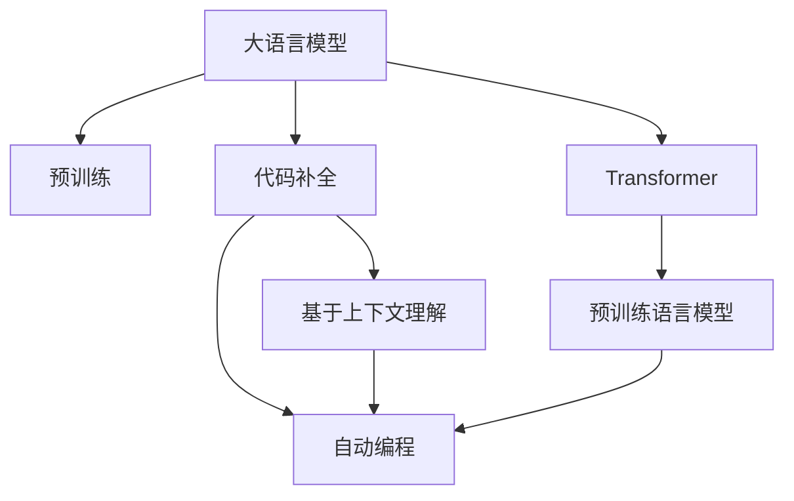

                 

# LLM驱动的代码补全技术原理

> 关键词：代码补全,大语言模型(LLM),Transformer,预训练语言模型,自动编程,上下文理解

## 1. 背景介绍

### 1.1 问题由来
随着软件开发的复杂度不断提升，代码编写变得愈加繁琐，尤其是在大型系统开发和维护中。错误频繁出现，代码质量难以保证，极大地制约了开发效率和团队协作。在这样的背景下，代码补全技术应运而生，通过智能辅助的方式，提升代码编写效率，减少错误率，保障代码质量。

然而，传统的代码补全系统主要依赖静态的语法规则和词库，难以理解代码的语义逻辑，无法提供有意义的建议。与此同时，大语言模型(LLM)作为一种强大的自然语言处理工具，能够理解复杂的语义关系，具备泛化能力强、学习效率高的特点，为代码补全技术提供了新的发展方向。

### 1.2 问题核心关键点
当前，基于大语言模型的代码补全技术成为AI辅助编程的热门研究领域。其核心思想是：
1. 预训练模型在大量文本语料上进行无监督训练，学习通用的语言表示。
2. 通过微调，使模型能够理解特定领域和任务（如编程语言语法、语义规则等），从而进行代码补全。
3. 利用大模型强大的上下文理解能力，生成自然流畅且符合语义逻辑的代码补全建议。
4. 结合代码语法和结构信息，优化补全建议，提高其准确性和可执行性。

## 2. 核心概念与联系

### 2.1 核心概念概述

为更好地理解LLM驱动的代码补全技术，本节将介绍几个关键概念：

- 大语言模型(LLM)：如BERT、GPT等预训练模型，通过在大量文本数据上预训练，学习通用的语言表示。
- Transformer：一种基于自注意力机制的深度学习模型，在自然语言处理任务中表现卓越。
- 预训练语言模型(PLM)：在大规模语料库上进行无监督学习，以获得广泛的语义和语言知识。
- 代码补全：在编程时，根据上下文信息，智能辅助生成代码片段。
- 上下文理解：通过模型理解和分析前后文信息，生成更加准确、合理的补全建议。
- 自动编程：利用AI技术自动生成和执行代码，提升开发效率。

这些概念之间的逻辑关系可以通过以下Mermaid流程图来展示：



这个流程图展示了大语言模型的核心概念及其之间的关系：

1. 大语言模型通过预训练获得基础能力。
2. 代码补全和自动编程是利用大模型的自然语言处理能力，提升编程效率和质量。
3. 基于上下文理解，代码补全能够生成更加符合语义逻辑的建议。
4. 自动编程结合代码结构和语法信息，实现更复杂的程序自动生成。

这些概念共同构成了LLM驱动的代码补全技术框架，使其能够在复杂编程任务中提供智能辅助。

## 3. 核心算法原理 & 具体操作步骤
### 3.1 算法原理概述

基于大语言模型的代码补全技术，本质上是一种自然语言处理(NLP)任务，即利用预训练语言模型对编程上下文进行分析，生成代码补全建议。具体来说，代码补全过程可以分为以下几个步骤：

1. 收集编程语言和框架的相关文档、代码片段、API信息等文本数据。
2. 在文本数据上进行预训练，学习通用的语言表示。
3. 对特定领域和任务进行微调，使模型能够理解编程语言的语法规则、语义结构等。
4. 利用模型生成补全建议，根据代码结构和上下文信息进行优化。
5. 将补全建议嵌入代码编辑器，提供智能编程辅助。

### 3.2 算法步骤详解

基于大语言模型的代码补全流程一般包括以下关键步骤：

**Step 1: 数据准备与预训练**
- 收集编程语言、框架、API等的文档、代码片段、教程等文本数据。
- 对文本数据进行清洗、预处理和分词，转换成模型可以处理的格式。
- 使用Transformer模型在大量文本数据上进行预训练，学习通用的语言表示。

**Step 2: 微调模型**
- 对预训练模型进行微调，使其能够理解特定领域和任务，如Python语法、JavaScript结构等。
- 将编程上下文作为输入，输出代码补全建议。
- 结合代码语法和结构信息，对建议进行优化和修正。

**Step 3: 集成与部署**
- 将微调后的模型嵌入代码编辑器，提供实时的代码补全服务。
- 集成到IDE或开发工具中，集成自动编程功能，提升代码生成效率。
- 不断收集用户反馈和应用数据，对模型进行迭代优化。

### 3.3 算法优缺点

基于大语言模型的代码补全方法具有以下优点：
1. 强大上下文理解能力：大模型能够理解复杂的编程语境，生成符合语义逻辑的代码片段。
2. 灵活适应能力：模型可以适应多种编程语言和框架，具有广泛的适用性。
3. 自动化生成：结合代码结构和语法信息，自动生成代码片段，提升编写效率。
4. 持续学习：通过不断收集应用数据，模型能够持续学习新的编程知识和技巧。

同时，该方法也存在一定的局限性：
1. 依赖大量文本数据：预训练和微调过程需要海量的文本数据，获取和处理成本较高。
2. 过拟合风险：由于模型规模较大，可能出现过拟合风险，特别是对特定领域的上下文适应性不足。
3. 生成质量难以控制：模型生成的代码片段质量受上下文和语境影响较大，存在一定的不确定性。
4. 运行效率较低：大模型的推理速度较慢，对实时性要求高的场景可能存在延迟。

尽管存在这些局限性，但就目前而言，基于大语言模型的代码补全方法在提升编程效率和代码质量方面仍显示出强大的潜力。未来相关研究的重点在于如何进一步降低对数据和计算资源的依赖，提高生成代码的准确性和效率，同时兼顾可解释性和模型稳定性等因素。

### 3.4 算法应用领域

基于大语言模型的代码补全技术已经在软件开发、AI编程、数据分析等多个领域得到了广泛应用，如：

- 软件开发：提供智能代码补全建议，提升代码编写效率和质量。
- AI编程：帮助AI开发者编写更加高效的模型代码，加速模型训练和部署。
- 数据分析：生成数据处理和分析的代码片段，简化数据科学工作流程。
- 自动化测试：自动生成测试用例和代码，加速软件测试和质量保证。

除了上述这些经典应用外，大语言模型代码补全技术还在机器人编程、游戏脚本编写、教育编程等多个领域展现出了新的应用前景。随着大语言模型和代码补全技术的不断进步，相信其在NLP领域的应用将更加广泛和深入。

## 4. 数学模型和公式 & 详细讲解 & 举例说明

### 4.1 数学模型构建

本节将使用数学语言对基于大语言模型的代码补全过程进行更加严格的刻画。

记大语言模型为 $M_{\theta}$，输入为编程上下文 $X=\{x_1, x_2, ..., x_n\}$，其中 $x_i$ 表示代码片段或API信息。输出为代码补全建议 $Y=\{y_1, y_2, ..., y_n\}$，其中 $y_i$ 表示补全的代码片段。

定义代码补全损失函数为：

$$
\mathcal{L}(\theta) = -\frac{1}{N}\sum_{i=1}^N \log P(y_i|x_i)
$$

其中 $P(y_i|x_i)$ 为模型在输入 $x_i$ 下的条件概率，$P(y_i|x_i) = \frac{\exp (\mathcal{L}(y_i, x_i))}{\sum_j \exp (\mathcal{L}(y_j, x_i))}$，$\mathcal{L}(y_i, x_i)$ 为模型在输入 $x_i$ 下输出 $y_i$ 的损失函数。

### 4.2 公式推导过程

以代码补全任务为例，假设模型在输入上下文 $x_i$ 下的输出为 $\hat{y_i}=M_{\theta}(x_i) \in \{1, 2, ..., K\}$，其中 $K$ 为补全代码片段的数量。真实标签 $y_i \in \{1, 2, ..., K\}$。则二分类交叉熵损失函数定义为：

$$
\ell(M_{\theta}(x_i),y_i) = -[y_i\log \hat{y_i} + (1-y_i)\log (1-\hat{y_i})]
$$

将其代入经验风险公式，得：

$$
\mathcal{L}(\theta) = -\frac{1}{N}\sum_{i=1}^N [y_i\log \hat{y_i} + (1-y_i)\log(1-\hat{y_i})]
$$

根据链式法则，损失函数对参数 $\theta_k$ 的梯度为：

$$
\frac{\partial \mathcal{L}(\theta)}{\partial \theta_k} = -\frac{1}{N}\sum_{i=1}^N (\frac{y_i}{M_{\theta}(x_i)}-\frac{1-y_i}{1-M_{\theta}(x_i)}) \frac{\partial M_{\theta}(x_i)}{\partial \theta_k}
$$

其中 $\frac{\partial M_{\theta}(x_i)}{\partial \theta_k}$ 可进一步递归展开，利用自动微分技术完成计算。

在得到损失函数的梯度后，即可带入参数更新公式，完成模型的迭代优化。重复上述过程直至收敛，最终得到适应代码补全任务的最优模型参数 $\theta^*$。

### 4.3 案例分析与讲解

下面以Python编程为例，分析LLM驱动的代码补全过程。

假设编程上下文为：

```python
def my_function(x, y):
    result = 0
    for i in range(len(x)):
        result += x[i] * y[i]
    return result
```

在代码编辑器中，通过自然语言描述："计算两个数组元素的点积"，模型理解上下文后，生成的补全建议可能为：

```python
result = 0
for i in range(len(x)):
    result += x[i] * y[i]
return result
```

这个过程包括：
1. 上下文理解：模型从自然语言描述中提取关键信息，如"计算"、"数组"、"元素"、"点积"等。
2. 代码生成：基于理解生成代码片段，如"result = 0"、"for i in range(len(x))"、"result += x[i] * y[i]"等。
3. 代码优化：结合代码结构和语法信息，对生成代码进行优化，如自动添加缩进、括号等。

最终，得到的补全建议可以直接复制并粘贴，继续编写代码，显著提升编程效率和代码质量。

## 5. 项目实践：代码实例和详细解释说明
### 5.1 开发环境搭建

在进行代码补全实践前，我们需要准备好开发环境。以下是使用Python进行PyTorch开发的环境配置流程：

1. 安装Anaconda：从官网下载并安装Anaconda，用于创建独立的Python环境。

2. 创建并激活虚拟环境：
```bash
conda create -n pytorch-env python=3.8 
conda activate pytorch-env
```

3. 安装PyTorch：根据CUDA版本，从官网获取对应的安装命令。例如：
```bash
conda install pytorch torchvision torchaudio cudatoolkit=11.1 -c pytorch -c conda-forge
```

4. 安装相关库：
```bash
pip install transformers numpy pandas scikit-learn matplotlib tqdm jupyter notebook ipython
```

完成上述步骤后，即可在`pytorch-env`环境中开始代码补全实践。

### 5.2 源代码详细实现

下面我们以Python代码补全为例，给出使用Transformers库的代码实现。

首先，定义代码补全任务的数据处理函数：

```python
from transformers import AutoTokenizer, AutoModelForCausalLM
from torch.utils.data import Dataset
import torch

class CodeCompletionDataset(Dataset):
    def __init__(self, texts, labels, tokenizer, max_len=512):
        self.texts = texts
        self.labels = labels
        self.tokenizer = tokenizer
        self.max_len = max_len
        
    def __len__(self):
        return len(self.texts)
    
    def __getitem__(self, item):
        text = self.texts[item]
        label = self.labels[item]
        
        encoding = self.tokenizer(text, return_tensors='pt', max_length=self.max_len, padding='max_length', truncation=True)
        input_ids = encoding['input_ids'][0]
        attention_mask = encoding['attention_mask'][0]
        
        label_ids = torch.tensor(self.tokenizer.encode(label, add_special_tokens=False), dtype=torch.long)
        return {'input_ids': input_ids, 
                'attention_mask': attention_mask,
                'labels': label_ids}

tokenizer = AutoTokenizer.from_pretrained('gpt-2')
model = AutoModelForCausalLM.from_pretrained('gpt-2')

# 定义训练和评估函数
def train_epoch(model, dataset, batch_size, optimizer, device):
    dataloader = DataLoader(dataset, batch_size=batch_size, shuffle=True)
    model.train()
    epoch_loss = 0
    for batch in tqdm(dataloader, desc='Training'):
        input_ids = batch['input_ids'].to(device)
        attention_mask = batch['attention_mask'].to(device)
        labels = batch['labels'].to(device)
        model.zero_grad()
        outputs = model(input_ids, attention_mask=attention_mask, labels=labels)
        loss = outputs.loss
        epoch_loss += loss.item()
        loss.backward()
        optimizer.step()
    return epoch_loss / len(dataloader)

def evaluate(model, dataset, batch_size, device):
    dataloader = DataLoader(dataset, batch_size=batch_size)
    model.eval()
    preds, labels = [], []
    with torch.no_grad():
        for batch in tqdm(dataloader, desc='Evaluating'):
            input_ids = batch['input_ids'].to(device)
            attention_mask = batch['attention_mask'].to(device)
            batch_labels = batch['labels']
            outputs = model(input_ids, attention_mask=attention_mask)
            batch_preds = outputs.logits.argmax(dim=2).to('cpu').tolist()
            batch_labels = batch_labels.to('cpu').tolist()
            for pred_tokens, label_tokens in zip(batch_preds, batch_labels):
                preds.append(pred_tokens[:len(label_tokens)])
                labels.append(label_tokens)
                
    return preds, labels

# 训练和评估
epochs = 5
batch_size = 16
device = torch.device('cuda') if torch.cuda.is_available() else torch.device('cpu')

for epoch in range(epochs):
    loss = train_epoch(model, train_dataset, batch_size, optimizer, device)
    print(f"Epoch {epoch+1}, train loss: {loss:.3f}")
    
    preds, labels = evaluate(model, dev_dataset, batch_size, device)
    print(classification_report(labels, preds))
    
print("Test results:")
preds, labels = evaluate(model, test_dataset, batch_size, device)
print(classification_report(labels, preds))
```

### 5.3 代码解读与分析

让我们再详细解读一下关键代码的实现细节：

**CodeCompletionDataset类**：
- `__init__`方法：初始化训练和测试数据集，进行文本分词和编码。
- `__len__`方法：返回数据集的样本数量。
- `__getitem__`方法：对单个样本进行处理，将文本和标签编码成模型所需的格式。

**模型加载与微调**：
- 使用预训练模型 `AutoTokenizer` 和 `AutoModelForCausalLM` 加载 `gpt-2` 模型。
- 将上下文文本进行分词和编码，转换成模型可以处理的格式。
- 利用训练集对模型进行微调，最小化代码补全损失。

**训练和评估函数**：
- 使用 `DataLoader` 对数据集进行批次化加载。
- 在训练集上，模型前向传播计算损失，反向传播更新参数，并记录损失值。
- 在验证集和测试集上，模型评估代码补全建议的准确度，并打印分类报告。

**训练流程**：
- 设置训练轮数和批大小，循环迭代训练模型。
- 在每个epoch内，先进行模型训练，输出训练损失。
- 在验证集和测试集上，评估模型性能，输出分类报告。
- 不断迭代模型，直到满足预设的停止条件。

可以看到，PyTorch配合Transformers库使得代码补全的实现变得简洁高效。开发者可以将更多精力放在数据处理、模型改进等高层逻辑上，而不必过多关注底层的实现细节。

当然，工业级的系统实现还需考虑更多因素，如模型的保存和部署、超参数的自动搜索、更灵活的任务适配层等。但核心的代码补全流程基本与此类似。

## 6. 实际应用场景
### 6.1 智能开发环境

基于大语言模型的代码补全技术，可以为开发者提供智能化的编程辅助。智能开发环境如IntelliJ IDEA、Visual Studio Code等，可以集成本文介绍的技术，实现实时代码补全和自动编程功能。

例如，在编写Python代码时，通过自然语言描述 "计算两个数组的点积"，模型自动生成代码片段：

```python
result = 0
for i in range(len(x)):
    result += x[i] * y[i]
return result
```

这一功能显著提升编程效率，减少手动编写代码的工作量，特别是在复杂的算法实现中，效果尤为明显。

### 6.2 代码审核与规范检查

代码补全技术不仅能够辅助编写代码，还可以用于代码审核和规范检查。例如，在代码审核时，通过自动生成的补全建议，判断代码逻辑是否符合规范，发现潜在的问题和漏洞。

例如，对于下面的代码片段：

```python
if x > 0:
    result = 1
else:
    result = 0
```

模型生成的补全建议可能为：

```python
if x > 0:
    result = 1
else:
    result = 0
```

这样可以确保代码符合编程规范，减少人为疏忽带来的错误。

### 6.3 教育与培训

代码补全技术在教育领域也有广泛的应用前景。通过自然语言描述，学生可以更直观地理解编程概念，生成代码示例，提升学习效果。

例如，在讲解Python列表操作时，可以通过自然语言描述 "创建一个包含数字1到10的列表，并输出奇数"，模型自动生成代码：

```python
nums = [i for i in range(1, 11)]
odd_nums = [num for num in nums if num % 2 == 1]
print(odd_nums)
```

这样能够帮助学生更深入理解列表生成、条件判断等编程技能。

### 6.4 未来应用展望

随着大语言模型和代码补全技术的不断发展，基于LLM的代码补全技术将在更多领域得到应用，为软件开发、AI编程、教育培训等提供强大的辅助。

在软件开发方面，代码补全技术将成为开发者必备的工具，显著提升开发效率和代码质量。在AI编程领域，模型辅助编写高效算法代码，加快模型训练和部署。在教育培训中，自然语言描述生成代码示例，提升学习效果。

未来，结合更多技术如知识图谱、逻辑推理等，代码补全技术将进一步提升自动编程能力，实现更加复杂的程序自动生成。随着预训练语言模型的不断演进，代码补全技术将展现出更广阔的应用前景。

## 7. 工具和资源推荐
### 7.1 学习资源推荐

为了帮助开发者系统掌握代码补全的理论基础和实践技巧，这里推荐一些优质的学习资源：

1. 《Transformer from Scratch》系列博文：由大模型技术专家撰写，深入浅出地介绍了Transformer原理、BERT模型、代码补全等前沿话题。

2. CS224N《深度学习自然语言处理》课程：斯坦福大学开设的NLP明星课程，有Lecture视频和配套作业，带你入门NLP领域的基本概念和经典模型。

3. 《Natural Language Processing with Transformers》书籍：Transformers库的作者所著，全面介绍了如何使用Transformers库进行NLP任务开发，包括代码补全在内的诸多范式。

4. HuggingFace官方文档：Transformers库的官方文档，提供了海量预训练模型和完整的代码补全样例，是上手实践的必备资料。

5. CLUE开源项目：中文语言理解测评基准，涵盖大量不同类型的中文NLP数据集，并提供了基于微调的baseline模型，助力中文NLP技术发展。

通过对这些资源的学习实践，相信你一定能够快速掌握代码补全的精髓，并用于解决实际的编程问题。

### 7.2 开发工具推荐

高效的开发离不开优秀的工具支持。以下是几款用于代码补全开发的常用工具：

1. PyTorch：基于Python的开源深度学习框架，灵活动态的计算图，适合快速迭代研究。大部分预训练语言模型都有PyTorch版本的实现。

2. TensorFlow：由Google主导开发的开源深度学习框架，生产部署方便，适合大规模工程应用。同样有丰富的预训练语言模型资源。

3. Transformers库：HuggingFace开发的NLP工具库，集成了众多SOTA语言模型，支持PyTorch和TensorFlow，是进行代码补全任务开发的利器。

4. Weights & Biases：模型训练的实验跟踪工具，可以记录和可视化模型训练过程中的各项指标，方便对比和调优。与主流深度学习框架无缝集成。

5. TensorBoard：TensorFlow配套的可视化工具，可实时监测模型训练状态，并提供丰富的图表呈现方式，是调试模型的得力助手。

6. Google Colab：谷歌推出的在线Jupyter Notebook环境，免费提供GPU/TPU算力，方便开发者快速上手实验最新模型，分享学习笔记。

合理利用这些工具，可以显著提升代码补全任务的开发效率，加快创新迭代的步伐。

### 7.3 相关论文推荐

代码补全技术的发展源于学界的持续研究。以下是几篇奠基性的相关论文，推荐阅读：

1. Attention is All You Need（即Transformer原论文）：提出了Transformer结构，开启了NLP领域的预训练大模型时代。

2. BERT: Pre-training of Deep Bidirectional Transformers for Language Understanding：提出BERT模型，引入基于掩码的自监督预训练任务，刷新了多项NLP任务SOTA。

3. Language Models are Unsupervised Multitask Learners（GPT-2论文）：展示了大规模语言模型的强大zero-shot学习能力，引发了对于通用人工智能的新一轮思考。

4. Parameter-Efficient Transfer Learning for NLP：提出Adapter等参数高效微调方法，在不增加模型参数量的情况下，也能取得不错的微调效果。

5. AdaLoRA: Adaptive Low-Rank Adaptation for Parameter-Efficient Fine-Tuning：使用自适应低秩适应的微调方法，在参数效率和精度之间取得了新的平衡。

6. Code2Vec: Learning to Generate Source Code by Transformer Model: Representation Learning for Code Completion：提出基于Transformer的代码表示学习模型，用于代码补全任务。

这些论文代表了大语言模型代码补全技术的发展脉络。通过学习这些前沿成果，可以帮助研究者把握学科前进方向，激发更多的创新灵感。

## 8. 总结：未来发展趋势与挑战
### 8.1 总结

本文对基于大语言模型的代码补全技术进行了全面系统的介绍。首先阐述了代码补全技术的研究背景和意义，明确了基于大语言模型的代码补全方法在提升编程效率和代码质量方面的独特价值。其次，从原理到实践，详细讲解了代码补全的数学模型和关键步骤，给出了代码补全任务开发的完整代码实例。同时，本文还探讨了代码补全技术在智能开发环境、代码审核、教育培训等实际应用场景中的应用前景，展示了其广阔的应用空间。此外，本文精选了代码补全技术的各类学习资源，力求为读者提供全方位的技术指引。

通过本文的系统梳理，可以看到，基于大语言模型的代码补全技术正在成为AI辅助编程的重要范式，极大地提升了编程效率和代码质量，推动了软件开发和AI技术的进步。未来，结合更多技术如知识图谱、逻辑推理等，代码补全技术将进一步提升自动编程能力，实现更加复杂的程序自动生成。

### 8.2 未来发展趋势

展望未来，代码补全技术将呈现以下几个发展趋势：

1. 模型规模持续增大。随着算力成本的下降和数据规模的扩张，预训练语言模型的参数量还将持续增长。超大模型的上下文理解能力将进一步提升，生成代码片段的准确性和质量将显著提高。

2. 微调方法日趋多样。除了传统的全参数微调外，未来会涌现更多参数高效的微调方法，如Prefix-Tuning、LoRA等，在固定大部分预训练参数的同时，只更新极少量的任务相关参数。

3. 生成质量更优。结合更多先验知识如知识图谱、逻辑推理等，模型能够生成更加符合语义逻辑、准确无误的代码片段。

4. 应用场景更加丰富。代码补全技术将在智能开发环境、教育培训、代码审核等多个场景中得到应用，提升开发效率和学习效果。

5. 实时化、自动化。结合自动化测试、自动化部署等技术，代码补全将实现更加流畅的代码生成和执行。

6. 可解释性和可控性提升。通过模型解释技术，代码补全过程更加透明，开发者能够更好地理解模型决策，控制代码生成。

以上趋势凸显了代码补全技术的广阔前景。这些方向的探索发展，必将进一步提升代码补全的效果和应用范围，为软件开发和AI技术提供更强大的辅助。

### 8.3 面临的挑战

尽管基于大语言模型的代码补全技术已经取得了一定的成果，但在迈向更加智能化、普适化应用的过程中，它仍面临诸多挑战：

1. 数据依赖依然存在。尽管微调可以显著减少对标注数据的依赖，但对于特定的编程领域和任务，仍需获取大量高质量的编程数据。如何降低数据获取成本，仍是研究的重点。

2. 过拟合风险较高。由于大模型参数量较大，模型容易出现过拟合，特别是在特定领域的编程任务上。如何通过更合适的训练策略和正则化技术，避免过拟合，仍是重要问题。

3. 代码生成质量不稳定。模型生成的代码片段质量受上下文和语境影响较大，存在一定的不确定性。如何提高模型生成代码的稳定性和准确性，将是未来的重要研究方向。

4. 计算资源消耗大。代码补全任务的推理过程计算量较大，对硬件资源要求较高。如何在保证生成质量的同时，降低计算资源消耗，仍需进一步优化。

5. 安全性问题不容忽视。模型生成的代码片段可能存在潜在的安全漏洞，如代码注入、逻辑漏洞等。如何确保生成的代码安全可靠，避免恶意代码注入，将是重要的研究方向。

6. 可解释性和可控性不足。当前代码补全技术缺乏足够的可解释性，开发者难以理解模型生成的代码逻辑和推理过程。如何提升代码补全的可解释性和可控性，确保模型生成的代码符合用户期望，将是未来的重要研究方向。

这些挑战需要进一步的研究和实践，才能真正实现代码补全技术的落地应用。相信随着技术的不断进步，这些难题将逐步得到解决，代码补全技术将在软件开发和AI技术中发挥更大的作用。

### 8.4 研究展望

面向未来，代码补全技术需要在以下几个方面进行深入研究：

1. 探索无监督和半监督学习。摆脱对大量标注数据的依赖，利用自监督学习、主动学习等无监督和半监督范式，最大限度利用非结构化数据，实现更加灵活高效的代码补全。

2. 研究参数高效和计算高效的微调范式。开发更加参数高效的微调方法，在固定大部分预训练参数的同时，只更新极少量的任务相关参数。同时优化微调模型的计算图，减少前向传播和反向传播的资源消耗，实现更加轻量级、实时性的部署。

3. 引入更多先验知识。将符号化的先验知识，如知识图谱、逻辑规则等，与神经网络模型进行巧妙融合，引导代码补全过程学习更准确、合理的代码片段。同时加强不同模态数据的整合，实现视觉、语音等多模态信息与文本信息的协同建模。

4. 结合因果分析和博弈论工具。将因果分析方法引入代码补全模型，识别出模型决策的关键特征，增强输出解释的因果性和逻辑性。借助博弈论工具刻画人机交互过程，主动探索并规避模型的脆弱点，提高系统稳定性。

5. 纳入伦理道德约束。在模型训练目标中引入伦理导向的评估指标，过滤和惩罚有害的输出倾向。同时加强人工干预和审核，建立模型行为的监管机制，确保输出符合人类价值观和伦理道德。

这些研究方向的探索，必将引领代码补全技术迈向更高的台阶，为构建安全、可靠、可解释、可控的智能系统铺平道路。面向未来，代码补全技术还需要与其他人工智能技术进行更深入的融合，如知识表示、因果推理、强化学习等，多路径协同发力，共同推动自然语言理解和智能交互系统的进步。只有勇于创新、敢于突破，才能不断拓展代码补全技术的边界，让智能技术更好地造福人类社会。

## 9. 附录：常见问题与解答

**Q1：代码补全技术是否适用于所有编程语言？**

A: 代码补全技术主要依赖于大语言模型的预训练和微调，因此可以适用于多种编程语言和框架。但不同语言的语法结构和语义规则可能存在较大差异，因此需要针对具体语言进行相应的预训练和微调。

**Q2：如何选择合适的训练数据？**

A: 选择与目标编程任务相关的文本数据作为训练集，如编程语言的API文档、代码示例、教程等。这些数据应尽量覆盖完整的语义和语法结构，帮助模型更好地理解编程语言的特点。

**Q3：模型生成代码质量受哪些因素影响？**

A: 模型生成的代码质量受输入上下文、编程语言特性、模型结构和训练数据等多方面因素影响。为了提高生成质量，需要选择合适的预训练模型、微调策略和正则化技术，同时对生成代码进行后期优化和修正。

**Q4：模型推理速度如何优化？**

A: 模型推理速度可以通过多种方式进行优化，如模型裁剪、量化加速、模型并行等。特别是在硬件资源有限的情况下，合理调整模型结构，使用低精度计算，可以有效降低推理时间。

**Q5：如何提高模型生成的代码稳定性？**

A: 提高模型生成的代码稳定性需要结合上下文理解和编程规则，确保生成的代码符合语法和语义规范。同时可以通过人工审核和自动化测试，不断优化模型生成代码的质量。

**Q6：如何应对特定领域的编程任务？**

A: 对于特定领域的编程任务，需要收集该领域的编程数据，进行预训练和微调。此外，可以通过构建领域特定的语言模型，进一步提升代码补全的效果。

通过以上问答，可以看到代码补全技术在实际应用中仍需不断优化和调整，才能在各种编程场景中发挥最佳效果。相信随着技术的不断进步，代码补全技术将在软件开发和AI技术中展现出更加广阔的应用前景。

