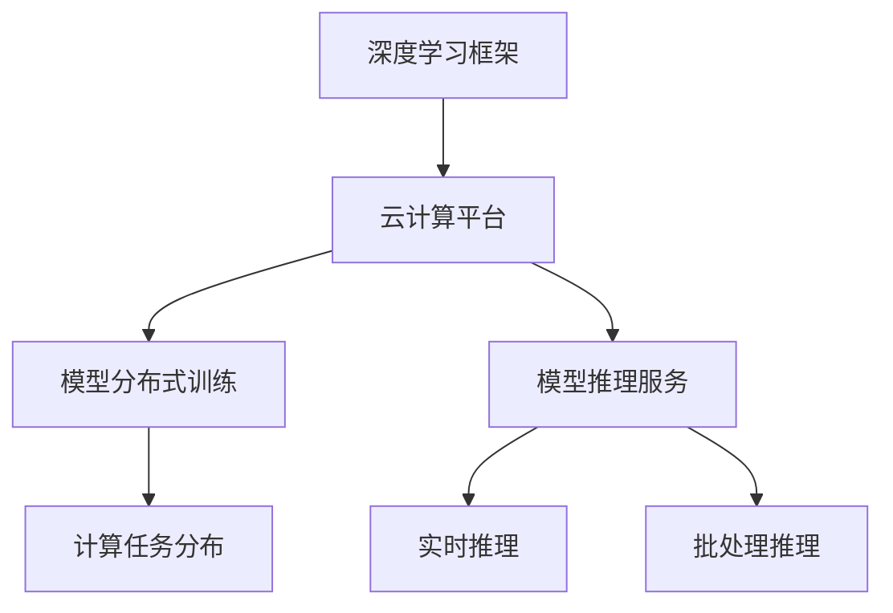

                 

# Lepton AI团队实力：深度学习框架云计算专家携手

> 关键词：Lepton AI, 深度学习框架, 云计算, 专家携手, 深度学习与云计算的融合

## 1. 背景介绍

### 1.1 问题由来
深度学习在过去几年中取得了显著的进步，尤其在计算机视觉、自然语言处理等领域的突破性进展，使得这一技术成为人工智能领域的研究热点。然而，深度学习的核心模型（如卷积神经网络、循环神经网络等）对计算资源的需求非常高，普通PC或工作站已无法满足其高性能计算需求。

为了解决这一问题，深度学习与云计算的融合成为了一种必然的趋势。云平台，如AWS、Google Cloud、阿里云等，拥有强大且稳定的计算资源，可以支持大规模的深度学习训练和推理。与此同时，基于云计算的深度学习框架，如TensorFlow、PyTorch、MXNet等，也迅速崛起，成为各大深度学习专家和开发者首选的计算工具。

### 1.2 问题核心关键点
深度学习框架与云计算的结合，不仅带来了性能上的提升，还推动了深度学习的普及与产业化。云计算平台可以提供强大的计算资源，为深度学习模型提供充沛的算力支持。而深度学习框架则提供了便利的API接口和高效的计算工具，降低了深度学习应用的门槛。

这种结合使得深度学习从研究实验室的学术领域逐渐渗透到产业化的实际应用场景中，推动了诸多行业领域的智能化升级，如自动驾驶、医疗影像分析、金融风险评估等。

## 2. 核心概念与联系

### 2.1 核心概念概述

为了更好地理解深度学习框架与云计算的结合，本节将介绍几个关键概念：

- **深度学习框架**：如TensorFlow、PyTorch、MXNet等，是深度学习模型的核心工具，提供了模型定义、训练、推理等一整套流程。
- **云计算平台**：如AWS、Google Cloud、阿里云等，提供高性能计算资源和稳定的网络环境，支持大规模深度学习模型的训练和部署。
- **模型分布式训练**：将深度学习模型的计算任务分布到多个计算节点上，提高计算效率和训练速度。
- **模型推理服务**：通过云计算平台提供的API接口，对训练好的模型进行推理计算，提供实时或批处理服务。

这些核心概念之间通过云计算平台实现了紧密的联系，共同构建了深度学习应用的生态系统。

### 2.2 核心概念原理和架构的 Mermaid 流程图



这个流程图展示了一个深度学习应用的全流程，从模型定义到计算资源的使用，再到训练和推理服务，云计算平台在其中起到了至关重要的作用。

## 3. 核心算法原理 & 具体操作步骤

### 3.1 算法原理概述

基于深度学习框架与云计算结合的微调方法，其核心思想是将大规模深度学习模型的计算任务分布到云计算平台上，利用其丰富的计算资源进行高效训练。具体而言，通过以下步骤实现：

1. 选择合适的深度学习框架和云平台，进行环境搭建。
2. 设计合适的模型结构和超参数，进行模型训练。
3. 在云平台提供的数据集上进行分布式训练，优化模型参数。
4. 将训练好的模型进行推理部署，提供服务。

### 3.2 算法步骤详解

基于深度学习框架与云计算结合的微调方法一般包括以下关键步骤：

**Step 1: 环境搭建**

1. 选择合适的云计算平台，如AWS、Google Cloud、阿里云等。
2. 选择合适的深度学习框架，如TensorFlow、PyTorch、MXNet等，并部署到云平台。
3. 安装所需的依赖包，配置环境变量，确保深度学习框架正常运行。

**Step 2: 模型设计**

1. 选择合适的深度学习模型结构，如卷积神经网络、循环神经网络、Transformer等。
2. 确定模型超参数，如学习率、批大小、迭代次数等。
3. 定义模型的损失函数和优化器。

**Step 3: 模型训练**

1. 收集训练数据，划分训练集、验证集和测试集。
2. 将数据集上传到云平台，设置数据路径。
3. 使用深度学习框架进行分布式训练，调整模型参数。
4. 定期在验证集上评估模型性能，调整超参数。

**Step 4: 模型部署**

1. 将训练好的模型保存为模型文件。
2. 在云平台提供推理服务，使用API接口进行推理计算。
3. 部署模型于云平台，确保其可伸缩性和可用性。

### 3.3 算法优缺点

基于深度学习框架与云计算结合的微调方法具有以下优点：

1. **高效计算**：云平台提供了强大的计算资源，支持大规模深度学习模型的训练，提升训练速度。
2. **灵活部署**：云平台提供了丰富的服务选项，可以快速部署和扩展深度学习模型，支持多种应用场景。
3. **易于使用**：深度学习框架提供了简便的API接口，降低了深度学习应用的门槛。

但该方法也存在一些局限性：

1. **数据依赖**：深度学习模型需要大量标注数据进行训练，数据获取成本较高。
2. **网络延迟**：云平台和本地设备的通信延迟可能影响模型的训练速度。
3. **安全风险**：数据和模型上传云平台，可能面临安全风险。

尽管如此，通过深度学习框架与云计算的紧密结合，我们仍然可以实现高效、灵活、可扩展的深度学习应用，解决传统PC或工作站难以支持的问题。

### 3.4 算法应用领域

深度学习框架与云计算结合的微调方法在多个领域得到了广泛应用，如：

- **计算机视觉**：如图像分类、目标检测、人脸识别等。
- **自然语言处理**：如文本分类、情感分析、机器翻译等。
- **语音识别**：如语音转换、语音识别、情感分析等。
- **推荐系统**：如协同过滤、基于深度学习的推荐算法等。
- **医疗影像分析**：如病灶检测、CT影像分析等。

## 4. 数学模型和公式 & 详细讲解 & 举例说明

### 4.1 数学模型构建

以卷积神经网络（CNN）为例，构建一个简单的图像分类模型。假设输入为$x \in \mathbb{R}^{n_x}$，输出为$y \in \mathbb{R}^{n_y}$，其中$n_x$和$n_y$分别为输入和输出的维度。

模型的损失函数通常采用交叉熵损失：

$$
\mathcal{L}(\theta) = -\frac{1}{N}\sum_{i=1}^N \sum_{j=1}^{n_y} y_{i,j}\log\hat{y}_{i,j}
$$

其中$\hat{y}_{i,j}$为模型预测的输出，$y_{i,j}$为真实的标签。

模型的优化目标是最小化损失函数，即找到最优参数：

$$
\theta^* = \mathop{\arg\min}_{\theta} \mathcal{L}(\theta)
$$

在实践中，我们通常使用基于梯度的优化算法，如AdamW、SGD等，来近似求解上述最优化问题。

### 4.2 公式推导过程

以AdamW优化算法为例，推导其更新公式。

AdamW算法更新公式为：

$$
\theta_{t+1} = \theta_t - \eta \frac{m_t}{\sqrt{v_t} + \epsilon}
$$

其中$\eta$为学习率，$m_t$和$v_t$分别为一阶动量和二阶动量，$\epsilon$为正则化项。一阶动量和二阶动量的更新公式如下：

$$
m_t = \beta_1 m_{t-1} + (1-\beta_1)\nabla_{\theta}\mathcal{L}(\theta_t)
$$
$$
v_t = \beta_2 v_{t-1} + (1-\beta_2)(\nabla_{\theta}\mathcal{L}(\theta_t))^2
$$

其中$\beta_1$和$\beta_2$为衰减率，通常在0.9左右。

### 4.3 案例分析与讲解

以图像分类为例，使用卷积神经网络进行模型训练。具体步骤如下：

1. 准备数据集，如CIFAR-10，将其分为训练集、验证集和测试集。
2. 定义卷积神经网络模型，如LeNet、VGGNet、ResNet等。
3. 使用训练集进行模型训练，调整模型参数。
4. 在验证集上评估模型性能，调整超参数。
5. 使用测试集进行模型测试，评估最终性能。

## 5. 项目实践：代码实例和详细解释说明

### 5.1 开发环境搭建

以TensorFlow为例，搭建一个深度学习模型的开发环境：

1. 安装TensorFlow：使用pip安装TensorFlow，支持GPU加速。
2. 安装相关依赖包：如numpy、pandas、scikit-learn等。
3. 配置环境变量：设置PATH、LD_LIBRARY_PATH等变量，确保TensorFlow正常运行。

### 5.2 源代码详细实现

以图像分类为例，实现一个简单的卷积神经网络模型：

```python
import tensorflow as tf

# 定义卷积神经网络模型
model = tf.keras.Sequential([
    tf.keras.layers.Conv2D(32, (3, 3), activation='relu', input_shape=(32, 32, 3)),
    tf.keras.layers.MaxPooling2D((2, 2)),
    tf.keras.layers.Flatten(),
    tf.keras.layers.Dense(10, activation='softmax')
])

# 编译模型，设置优化器和损失函数
model.compile(optimizer='adam', loss='sparse_categorical_crossentropy', metrics=['accuracy'])

# 训练模型
model.fit(train_data, train_labels, epochs=10, validation_data=(val_data, val_labels))

# 测试模型
test_loss, test_acc = model.evaluate(test_data, test_labels)
print('Test accuracy:', test_acc)
```

### 5.3 代码解读与分析

这段代码实现了一个简单的卷积神经网络模型，并使用TensorFlow进行训练和评估。其中，`Sequential`类用于构建模型，`Conv2D`、`MaxPooling2D`、`Flatten`、`Dense`等层用于定义网络结构。`compile`方法用于设置优化器、损失函数和评价指标。`fit`方法用于训练模型，`evaluate`方法用于评估模型性能。

## 6. 实际应用场景

### 6.1 智能视频监控

深度学习与云计算的结合，使得智能视频监控系统成为可能。传统视频监控依赖人工进行实时分析，不仅成本高，且难以保持高准确率。基于深度学习框架与云计算的结合，可以实现自动目标检测、人脸识别、行为分析等功能，大幅提升监控系统的智能化水平。

具体而言，将摄像头采集到的视频流上传至云平台，使用深度学习模型进行目标检测和行为分析。模型在云平台中进行训练和推理，能够实时处理视频流，提供高效、准确的监控服务。

### 6.2 自动驾驶

自动驾驶技术需要大量的计算资源进行数据处理和模型推理，基于深度学习框架与云计算结合的微调方法，可以实现实时、高效、准确的自动驾驶系统。

具体而言，将车辆传感器采集到的数据上传至云平台，使用深度学习模型进行图像识别、道路识别、路径规划等功能。模型在云平台中进行训练和推理，能够实时处理传感器数据，提供高效的自动驾驶服务。

### 6.3 智能推荐系统

基于深度学习框架与云计算结合的微调方法，可以实现高效、个性化的智能推荐系统。传统推荐系统依赖人工进行特征工程，难以满足实时性和个性化的需求。通过深度学习模型和云计算平台，可以实现基于用户行为和兴趣的实时推荐。

具体而言，将用户的历史行为数据上传至云平台，使用深度学习模型进行特征提取和推荐计算。模型在云平台中进行训练和推理，能够实时处理用户行为数据，提供个性化的推荐服务。

### 6.4 未来应用展望

未来，深度学习框架与云计算的结合将继续拓展其应用范围，推动更多的智能化升级。

- **智能制造**：通过深度学习模型和云计算平台，实现生产线的智能优化，提升生产效率和产品质量。
- **智能医疗**：利用深度学习模型和云计算平台，进行医学影像分析、病灶检测等功能，提高医疗诊断的准确率和效率。
- **智能交通**：通过深度学习模型和云计算平台，实现交通流预测、信号控制等功能，提高交通管理水平。
- **智能城市**：利用深度学习模型和云计算平台，进行城市交通管理、环境监测等功能，提升城市治理水平。

## 7. 工具和资源推荐

### 7.1 学习资源推荐

为了帮助开发者系统掌握深度学习框架与云计算结合的理论基础和实践技巧，这里推荐一些优质的学习资源：

1. TensorFlow官方文档：详细介绍了TensorFlow的使用方法、API接口和实例代码。
2. PyTorch官方文档：介绍了PyTorch的使用方法、API接口和实例代码。
3. Google Cloud机器学习指南：详细介绍了Google Cloud平台的使用方法、机器学习API接口和实例代码。
4. 《深度学习实战》书籍：由深度学习专家撰写，介绍了深度学习模型的构建、训练、推理等流程。
5. 《深度学习框架教程》视频课程：介绍深度学习框架的使用方法和实例代码，适合初学者入门。

通过对这些资源的学习实践，相信你一定能够快速掌握深度学习框架与云计算结合的精髓，并用于解决实际的深度学习问题。

### 7.2 开发工具推荐

高效的使用工具是深度学习框架与云计算结合开发的关键。以下是几款常用的开发工具：

1. Jupyter Notebook：一个交互式的编程环境，支持Python、TensorFlow等框架。
2. Google Colab：一个在线Jupyter Notebook环境，免费提供GPU/TPU算力，方便开发者快速上手实验。
3. TensorBoard：TensorFlow的可视化工具，可以实时监测模型训练状态，并提供丰富的图表呈现方式。
4. TensorFlow Extended（TFX）：Google推出的机器学习平台，支持深度学习模型训练、部署、监控等流程。
5. AWS SageMaker：亚马逊提供的深度学习平台，支持模型训练、部署、监控等流程。

这些工具可以帮助开发者高效、便捷地进行深度学习模型开发和训练，加速深度学习应用的落地。

### 7.3 相关论文推荐

深度学习框架与云计算结合的研究源于学界的持续研究。以下是几篇奠基性的相关论文，推荐阅读：

1. Imagenet Classification with Deep Convolutional Neural Networks：介绍卷积神经网络在图像分类中的应用，标志着深度学习在计算机视觉领域的突破。
2. Efficient Estimation of Word Representations in Vector Space：提出Word2Vec模型，引入词向量表示，推动了自然语言处理的发展。
3. Deep Learning with Large Adaptive Learning Rates：提出AdaGrad算法，解决了深度学习中学习率自适应调整的问题。
4. Feature Pyramid Networks for Object Detection：提出特征金字塔网络，解决了目标检测中的尺度问题。
5. Attention Is All You Need：提出Transformer结构，开启了深度学习在自然语言处理领域的预训练大模型时代。

这些论文代表了大模型结合云计算的理论基础，为深度学习应用的进一步发展奠定了坚实基础。

## 8. 总结：未来发展趋势与挑战

### 8.1 总结

本文对基于深度学习框架与云计算结合的微调方法进行了全面系统的介绍。首先阐述了深度学习框架和云计算的结合背景，明确了这一结合在性能提升、应用普及等方面的独特价值。其次，从原理到实践，详细讲解了深度学习框架与云计算结合的数学原理和关键步骤，给出了深度学习模型开发的完整代码实例。同时，本文还广泛探讨了深度学习框架与云计算结合的应用场景，展示了其广泛的适用性。

通过本文的系统梳理，可以看到，深度学习框架与云计算的结合正成为深度学习应用的重要趋势，极大地提升了深度学习模型的性能和应用范围，推动了深度学习技术的产业化进程。未来，伴随深度学习框架和云计算技术的进一步发展，基于深度学习框架与云计算结合的微调方法必将带来更多的应用创新，进一步推动人工智能技术的普及和应用。

### 8.2 未来发展趋势

展望未来，深度学习框架与云计算的结合将呈现以下几个发展趋势：

1. **模型规模持续增大**：深度学习框架与云计算的结合使得大规模深度学习模型的训练成为可能，模型的参数量将进一步增加，推动了深度学习技术的进一步发展。
2. **模型部署灵活性提高**：云计算平台提供了多样化的服务选项，支持深度学习模型的灵活部署和扩展，提高模型的可伸缩性和可用性。
3. **模型推理效率提升**：通过云计算平台的优化和资源调度，深度学习模型的推理效率将进一步提升，支持大规模的实时推理应用。
4. **模型安全性和隐私保护增强**：云计算平台提供了安全的网络环境和数据保护机制，增强了深度学习模型的安全性。
5. **跨领域应用拓展**：深度学习框架与云计算的结合将拓展到更多的应用领域，如自动驾驶、智能医疗、智能制造等，推动这些领域的智能化升级。

以上趋势凸显了深度学习框架与云计算结合的广阔前景，这些方向的探索发展，必将进一步提升深度学习模型的性能和应用范围，推动深度学习技术的产业化进程。

### 8.3 面临的挑战

尽管深度学习框架与云计算的结合已经取得了瞩目成就，但在迈向更加智能化、普适化应用的过程中，它仍面临诸多挑战：

1. **数据获取成本高**：深度学习模型需要大量的标注数据进行训练，数据获取成本较高。
2. **网络延迟影响**：云平台和本地设备的通信延迟可能影响模型的训练速度和推理效率。
3. **模型可解释性不足**：深度学习模型的决策过程缺乏可解释性，难以进行调试和优化。
4. **模型安全和隐私保护**：数据和模型上传云平台，可能面临安全风险。

尽管如此，通过深度学习框架与云计算的紧密结合，我们仍然可以实现高效、灵活、可扩展的深度学习应用，解决传统PC或工作站难以支持的问题。

### 8.4 研究展望

面对深度学习框架与云计算结合所面临的挑战，未来的研究需要在以下几个方面寻求新的突破：

1. **探索低成本的数据获取方法**：利用无监督学习和自监督学习等方法，降低深度学习模型对标注数据的依赖。
2. **优化模型训练和推理效率**：通过分布式训练和异构计算等方法，优化深度学习模型的训练和推理效率。
3. **提升模型的可解释性**：通过可视化工具和方法，增强深度学习模型的可解释性和可理解性。
4. **增强模型的安全性和隐私保护**：通过数据加密、访问控制等方法，增强深度学习模型的安全性和隐私保护。

这些研究方向将推动深度学习框架与云计算结合技术的进一步发展，提升深度学习模型的性能和应用范围，推动深度学习技术的普及和应用。

## 9. 附录：常见问题与解答

**Q1：深度学习框架与云计算结合是否适用于所有深度学习任务？**

A: 深度学习框架与云计算结合适用于大多数深度学习任务，特别是对于需要大规模计算资源的任务，如图像分类、目标检测、机器翻译等。但对于一些需要精细调优的任务，如自然语言生成、语音识别等，可能需要进行针对性的优化。

**Q2：使用深度学习框架与云计算结合进行模型训练，如何控制计算资源的使用？**

A: 云计算平台提供了灵活的资源调度机制，可以控制计算资源的使用。通常可以使用容器技术（如Docker）进行模型封装，控制模型的计算资源消耗。同时，可以通过设置计算资源的上限和下限，控制模型的资源使用。

**Q3：如何处理深度学习模型与云计算结合中的数据传输问题？**

A: 数据传输是深度学习模型与云计算结合中的一个瓶颈，可以通过数据压缩、异步传输等方法进行优化。同时，可以采用分布式训练技术，将数据分散存储在不同的节点上，减少数据传输的延迟。

**Q4：如何提高深度学习模型与云计算结合的安全性和隐私保护？**

A: 深度学习模型与云计算结合需要考虑数据和模型的安全性。可以采用数据加密、访问控制等方法，增强数据和模型的安全保护。同时，可以采用分布式训练和联邦学习等方法，降低数据上传的风险。

通过以上方法的综合运用，可以有效解决深度学习模型与云计算结合中的数据传输、资源控制、安全性等问题，提升模型的训练和推理效率，推动深度学习技术的广泛应用。

