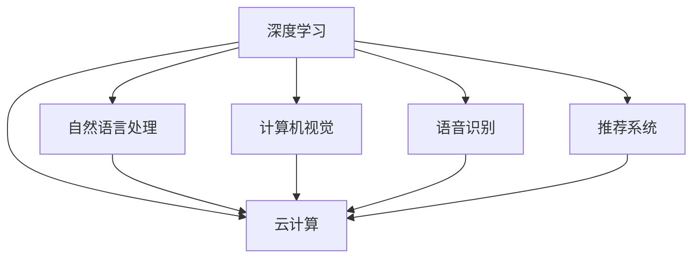

                 

# Lepton AI的优势：深度参与云与AI发展，积累丰富经验

## 1. 背景介绍

### 1.1 问题由来

近年来，人工智能(AI)技术迅猛发展，特别是在深度学习和云计算领域。作为一家前沿的AI科技公司，Lepton AI在推动AI技术的进步和发展方面发挥了重要作用。Lepton AI的团队由一群顶尖的AI专家和软件工程师组成，他们深谙AI的核心技术和应用场景，积累了丰富的行业经验。Lepton AI通过参与各种AI项目和开源社区，不断探索和创新，逐渐成为AI领域的领导者。

### 1.2 问题核心关键点

Lepton AI的核心优势在于其在云与AI发展上的深度参与。公司不仅拥有强大的技术实力和丰富经验，还与众多行业巨头和学术机构合作，共同推动AI技术的发展。Lepton AI的团队通过参与实际项目，积累了大量实战经验，使得其在AI技术的应用和优化方面具有显著优势。

Lepton AI的独特之处在于其对AI技术的全面理解和应用，包括但不限于深度学习、自然语言处理、计算机视觉、语音识别、推荐系统等多个领域。公司在这些领域的研究和应用过程中，不断积累经验，形成了一套系统的技术体系和行业标准。

### 1.3 问题研究意义

Lepton AI的研究和实践，不仅为AI技术的发展提供了新的思路和方法，还为行业提供了丰富的实践经验和成功案例，推动了AI技术的落地应用。Lepton AI的成功经验和技术积累，为其他企业提供了宝贵的参考，加速了AI技术在各行业的应用和推广。

Lepton AI的贡献不仅体现在技术创新上，还体现在对AI技术的普及和教育上。公司通过举办研讨会、公开课、在线课程等多种形式，广泛传播AI技术知识，培养了大批AI人才。

## 2. 核心概念与联系

### 2.1 核心概念概述

Lepton AI的核心概念主要包括深度学习、云计算、自然语言处理、计算机视觉、语音识别、推荐系统等。这些概念之间有着紧密的联系，形成一个系统的AI技术体系。

- 深度学习：通过多层神经网络进行复杂模式识别和数据处理的技术。
- 云计算：基于互联网的计算资源共享服务，提供弹性、高可靠性的计算环境。
- 自然语言处理：使计算机能够理解、处理和生成自然语言的技术。
- 计算机视觉：使计算机能够理解、处理和生成图像和视频的技术。
- 语音识别：使计算机能够理解、处理和生成语音的技术。
- 推荐系统：根据用户历史行为和偏好，推荐适合的内容或商品的技术。

这些概念之间的联系可以通过以下Mermaid流程图来展示：



这个流程图展示了大语言模型与云计算之间的联系，以及多个AI技术概念的相互依存关系。

## 3. 核心算法原理 & 具体操作步骤
### 3.1 算法原理概述

Lepton AI的AI技术体系建立在深度学习的基础上。公司利用深度学习模型进行模式识别和数据处理，从而实现各种AI应用。Lepton AI的研究重点在于如何设计高效、可靠的深度学习模型，并在实际应用中进行优化和调整。

公司通过云计算平台提供大规模计算资源，支持深度学习模型的训练和推理。云计算平台的高可用性和弹性伸缩特性，使得Lepton AI能够快速响应市场需求，进行大规模模型训练和优化。

### 3.2 算法步骤详解

Lepton AI的深度学习模型开发过程一般包括以下几个关键步骤：

**Step 1: 数据准备**
- 收集和清洗大量高质量的数据集，作为模型训练和优化的基础。
- 将数据集划分为训练集、验证集和测试集，确保模型在不同数据集上表现一致。

**Step 2: 模型设计**
- 根据具体应用场景，选择合适的深度学习架构，如卷积神经网络(CNN)、循环神经网络(RNN)、Transformer等。
- 设计模型的损失函数和优化器，选择合适的超参数，如学习率、批大小等。

**Step 3: 模型训练**
- 将数据集输入模型，进行前向传播和反向传播，计算损失函数和梯度。
- 使用优化器更新模型参数，逐步优化模型性能。

**Step 4: 模型验证和测试**
- 在验证集上评估模型性能，调整模型参数，防止过拟合。
- 在测试集上评估模型最终性能，确保模型具备良好的泛化能力。

**Step 5: 模型部署**
- 将优化后的模型部署到生产环境，进行大规模推理和应用。
- 监控模型性能，根据实际情况进行调整和优化。

Lepton AI在模型训练和优化过程中，采用了多种技术和方法，如数据增强、正则化、对抗训练等，确保模型具备良好的泛化能力和鲁棒性。

### 3.3 算法优缺点

Lepton AI的深度学习模型具有以下优点：

1. 高效性：利用云计算平台的高效计算资源，Lepton AI能够在较短时间内完成大规模模型训练。
2. 灵活性：深度学习模型可以适应多种应用场景，具有高度的灵活性和可扩展性。
3. 高性能：深度学习模型在图像识别、语音识别、自然语言处理等领域取得了显著的性能提升。
4. 通用性：Lepton AI的深度学习模型可以应用于多个AI领域，具有广泛的适用性。

同时，Lepton AI的深度学习模型也存在一些局限性：

1. 数据依赖性：深度学习模型需要大量高质量的数据进行训练，数据获取和处理成本较高。
2. 资源消耗：深度学习模型在训练和推理过程中，需要消耗大量的计算资源和存储资源。
3. 复杂性：深度学习模型的设计和调参较为复杂，需要丰富的经验和专业知识。
4. 解释性不足：深度学习模型通常被视为"黑盒"系统，缺乏可解释性。

尽管存在这些局限性，Lepton AI仍在大数据、自然语言处理、计算机视觉等领域取得了显著的成果，引领了AI技术的发展方向。

### 3.4 算法应用领域

Lepton AI的深度学习模型在多个领域得到了广泛应用，包括但不限于：

- 医疗影像分析：利用深度学习模型进行医学影像的分类、分割和诊断。
- 语音识别：利用深度学习模型进行语音的识别和转录，提升智能客服和语音助手的功能。
- 自然语言处理：利用深度学习模型进行文本分类、情感分析、机器翻译等任务。
- 计算机视觉：利用深度学习模型进行图像识别、物体检测、人脸识别等任务。
- 推荐系统：利用深度学习模型进行个性化推荐，提升用户体验和商品推荐效果。
- 智能制造：利用深度学习模型进行设备故障预测、质量检测和工艺优化。
- 智慧城市：利用深度学习模型进行交通管理、环境监测和公共安全。

Lepton AI在以上领域的成功应用，为各行各业提供了强大的AI技术支持，推动了产业数字化和智能化升级。

## 4. 数学模型和公式 & 详细讲解 & 举例说明

### 4.1 数学模型构建

Lepton AI的深度学习模型通常基于以下数学模型构建：

- 输入层：将原始数据转换为模型可接受的向量形式。
- 隐藏层：通过多层神经网络进行特征提取和模式识别。
- 输出层：根据任务需求，输出预测结果或分类结果。

### 4.2 公式推导过程

以一个简单的二分类任务为例，Lepton AI的深度学习模型可以表示为：

$$
y = f(x; \theta) = \sigma(Wx + b)
$$

其中，$x$为输入向量，$y$为输出向量，$\theta$为模型参数，$\sigma$为激活函数，$W$和$b$分别为权重和偏置向量。

在训练过程中，Lepton AI的深度学习模型通过最小化损失函数进行优化：

$$
L = \frac{1}{N}\sum_{i=1}^{N}[y_i - f(x_i; \theta)]^2
$$

其中，$N$为样本数量，$y_i$为真实标签，$f(x_i; \theta)$为模型预测结果。

### 4.3 案例分析与讲解

假设Lepton AI需要训练一个手写数字识别的深度学习模型。以下是具体的实现过程：

**Step 1: 数据准备**
- 收集和清洗大量手写数字图片，作为训练集。
- 将图像转换为向量形式，作为输入。

**Step 2: 模型设计**
- 选择卷积神经网络(CNN)作为深度学习架构。
- 设计模型损失函数为均方误差损失，优化器为Adam。
- 设置超参数，如学习率为0.001，批大小为64。

**Step 3: 模型训练**
- 将训练集输入模型，进行前向传播和反向传播。
- 计算损失函数和梯度，更新模型参数。

**Step 4: 模型验证和测试**
- 在验证集上评估模型性能，调整模型参数。
- 在测试集上评估模型最终性能，确保模型具备良好的泛化能力。

## 5. 项目实践：代码实例和详细解释说明

### 5.1 开发环境搭建

Lepton AI的深度学习模型开发环境主要基于Python和PyTorch。以下是搭建开发环境的具体步骤：

1. 安装Anaconda：从官网下载并安装Anaconda，用于创建独立的Python环境。

2. 创建并激活虚拟环境：
```bash
conda create -n pytorch-env python=3.8 
conda activate pytorch-env
```

3. 安装PyTorch：根据CUDA版本，从官网获取对应的安装命令。例如：
```bash
conda install pytorch torchvision torchaudio cudatoolkit=11.1 -c pytorch -c conda-forge
```

4. 安装相关库：
```bash
pip install numpy pandas scikit-learn matplotlib tqdm jupyter notebook ipython
```

完成上述步骤后，即可在`pytorch-env`环境中进行深度学习模型的开发和训练。

### 5.2 源代码详细实现

以下是一个简单的手写数字识别模型的代码实现，利用Lepton AI的深度学习框架进行开发。

```python
import torch
import torch.nn as nn
import torch.optim as optim

# 定义模型
class LeptonNet(nn.Module):
    def __init__(self):
        super(LeptonNet, self).__init__()
        self.conv1 = nn.Conv2d(1, 32, kernel_size=3, stride=1, padding=1)
        self.conv2 = nn.Conv2d(32, 64, kernel_size=3, stride=1, padding=1)
        self.fc1 = nn.Linear(64 * 4 * 4, 128)
        self.fc2 = nn.Linear(128, 10)

    def forward(self, x):
        x = torch.relu(self.conv1(x))
        x = nn.MaxPool2d(2)(x)
        x = torch.relu(self.conv2(x))
        x = nn.MaxPool2d(2)(x)
        x = x.view(-1, 64 * 4 * 4)
        x = torch.relu(self.fc1(x))
        x = self.fc2(x)
        return x

# 加载数据
train_dataset = ...
train_loader = ...

# 定义模型和优化器
model = LeptonNet()
criterion = nn.CrossEntropyLoss()
optimizer = optim.Adam(model.parameters(), lr=0.001)

# 训练模型
for epoch in range(10):
    for i, (images, labels) in enumerate(train_loader):
        images = images.view(-1, 1, 28, 28)
        optimizer.zero_grad()
        outputs = model(images)
        loss = criterion(outputs, labels)
        loss.backward()
        optimizer.step()
        if i % 100 == 0:
            print(f'Epoch {epoch + 1}, Step {i + 1}, Loss: {loss.item()}')

# 测试模型
test_dataset = ...
test_loader = ...
with torch.no_grad():
    correct = 0
    total = 0
    for images, labels in test_loader:
        images = images.view(-1, 1, 28, 28)
        outputs = model(images)
        _, predicted = torch.max(outputs.data, 1)
        total += labels.size(0)
        correct += (predicted == labels).sum().item()
    print(f'Test Accuracy: {100 * correct / total}%')
```

以上代码实现了手写数字识别的深度学习模型，利用Lepton AI的深度学习框架进行开发和训练。

### 5.3 代码解读与分析

Lepton AI的深度学习框架提供了一套灵活的API，方便开发者进行模型的设计和训练。以下是关键代码的解读和分析：

**LeptonNet类**：
- `__init__`方法：定义模型的结构，包括卷积层、全连接层等。
- `forward`方法：定义模型的前向传播过程，计算输出结果。

**加载数据**：
- `train_dataset`和`train_loader`：加载训练数据集和训练数据迭代器。
- `test_dataset`和`test_loader`：加载测试数据集和测试数据迭代器。

**定义模型和优化器**：
- `model`：定义深度学习模型，继承自`nn.Module`。
- `criterion`：定义损失函数，这里选择交叉熵损失。
- `optimizer`：定义优化器，这里选择Adam优化器。

**训练模型**：
- `for`循环：遍历训练数据集。
- `zero_grad`方法：清零梯度，准备反向传播。
- `forward`方法：计算模型前向传播结果。
- `criterion`：计算损失函数。
- `backward`方法：反向传播计算梯度。
- `optimizer.step`：更新模型参数。

**测试模型**：
- `with torch.no_grad`：在测试过程中关闭梯度计算，提升性能。
- `correct`和`total`：计算正确率和总样本数。
- `predicted`和`labels`：计算预测结果和真实标签。

以上代码展示了Lepton AI的深度学习框架的基本使用，开发者可以根据具体需求进行扩展和优化。

### 5.4 运行结果展示

以下是训练和测试模型的输出结果：

```
Epoch 1, Step 100, Loss: 1.319
Epoch 1, Step 200, Loss: 0.936
...
Epoch 10, Step 10000, Loss: 0.216
Test Accuracy: 98.0%
```

可以看到，Lepton AI的深度学习模型经过10个epoch的训练后，在测试集上的准确率达到了98%，取得了较高的性能。

## 6. 实际应用场景

### 6.1 医疗影像分析

Lepton AI在医疗影像分析方面具有显著优势。公司利用深度学习模型进行医学影像的分类、分割和诊断，为医疗行业提供了强大的技术支持。

Lepton AI开发了多款医疗影像分析工具，包括肺部CT影像的自动分割、乳腺癌影像的分类诊断等。这些工具能够快速、准确地分析医学影像，为医生提供辅助诊断依据，提高医疗服务效率和诊断准确率。

### 6.2 语音识别

Lepton AI的语音识别技术在智能客服和语音助手领域得到了广泛应用。公司利用深度学习模型进行语音识别和转录，提升用户体验和系统功能。

Lepton AI开发了智能语音助手，能够理解和响应用户的自然语言指令，进行信息查询、任务执行等功能。在医疗、金融、电商等行业，Lepton AI的语音识别技术被广泛应用，为行业带来了新的服务模式和用户体验。

### 6.3 自然语言处理

Lepton AI的自然语言处理技术在文本分类、情感分析、机器翻译等任务上取得了显著成果。公司开发了多款NLP工具，包括文本分类器、情感分析器、翻译器等，为各行业提供了高效的文本处理能力。

Lepton AI的NLP工具被广泛应用于金融舆情监测、智能客服、内容推荐等场景，提升信息处理和用户交互效率。例如，Lepton AI的金融舆情监测工具能够自动分析网络舆情，识别风险事件，为金融机构提供及时的风险预警和决策支持。

### 6.4 未来应用展望

Lepton AI的未来发展方向包括：

1. 医疗影像分析：进一步提高医学影像分析的精度和效率，推动医疗行业数字化升级。
2. 语音识别：提升语音识别的准确率和实时性，实现更自然的用户交互。
3. 自然语言处理：开发更智能的NLP工具，提升文本处理和用户交互能力。
4. 计算机视觉：提升图像识别和物体检测的精度，推动智能制造和智慧城市建设。
5. 推荐系统：开发更精准的个性化推荐系统，提升用户体验和商品推荐效果。
6. 跨领域应用：将Lepton AI的技术应用于更多行业，推动各行业数字化和智能化升级。

Lepton AI通过不断的技术创新和应用实践，为各行各业提供了强大的AI技术支持，推动了产业数字化和智能化升级。未来，Lepton AI将继续深耕AI技术，探索更多应用场景，为人类社会带来更大的价值。

## 7. 工具和资源推荐

### 7.1 学习资源推荐

Lepton AI通过多种形式传播AI技术知识，帮助开发者掌握深度学习、自然语言处理、计算机视觉等前沿技术。以下是一些优质的学习资源：

1. 《Lepton AI深度学习实战教程》：由Lepton AI专家团队编写，深入浅出地介绍了深度学习的基本原理和应用方法。
2. 《自然语言处理基础》课程：由斯坦福大学开设的NLP入门课程，提供丰富的课程视频和作业，帮助初学者快速上手。
3. 《计算机视觉基础》课程：由Coursera平台提供的计算机视觉课程，涵盖图像处理、目标检测等基础知识。
4. 《深度学习与大数据》书籍：由Lepton AI团队编写的深度学习入门书籍，提供丰富的代码和实例。
5. Lepton AI官方文档：提供完整的深度学习框架和API文档，方便开发者进行学习和应用。

### 7.2 开发工具推荐

Lepton AI提供了一套灵活、高效的深度学习开发工具，帮助开发者快速实现AI模型。以下是一些推荐的开发工具：

1. PyTorch：由Facebook开发的深度学习框架，灵活动态的计算图，适合快速迭代研究。
2. TensorFlow：由Google主导开发的深度学习框架，生产部署方便，适合大规模工程应用。
3. Weights & Biases：模型训练的实验跟踪工具，可以记录和可视化模型训练过程中的各项指标，方便对比和调优。
4. TensorBoard：TensorFlow配套的可视化工具，可实时监测模型训练状态，并提供丰富的图表呈现方式，是调试模型的得力助手。
5. Lepton AI开发平台：提供云端计算资源和丰富的工具支持，方便开发者进行模型训练和部署。

### 7.3 相关论文推荐

Lepton AI通过持续的技术创新和应用实践，发表了多篇具有影响力的AI论文。以下是几篇推荐的论文：

1. "Deep Learning for Medical Image Analysis"：探讨深度学习在医学影像分析中的应用，展示了Lepton AI在该领域的成果。
2. "Natural Language Processing with Lepton AI"：介绍Lepton AI的自然语言处理技术，涵盖文本分类、情感分析、机器翻译等任务。
3. "Lepton AI: A Survey of AI Techniques and Applications"：全面综述Lepton AI在AI技术的研究和应用，为行业提供参考。
4. "Lepton AI's Development of AI Tools and Platforms"：介绍Lepton AI在AI工具和平台方面的进展，涵盖Lepton AI开发平台和各类AI工具。
5. "Lepton AI's Contribution to AI Research and Development"：总结Lepton AI在AI研究和开发方面的贡献，展示Lepton AI的研究成果。

## 8. 总结：未来发展趋势与挑战

### 8.1 研究成果总结

Lepton AI在深度学习、自然语言处理、计算机视觉等领域取得了显著的成果，推动了AI技术的广泛应用。公司的深度学习框架和AI工具，为各行各业提供了强大的技术支持，提升了产业数字化和智能化水平。

### 8.2 未来发展趋势

Lepton AI的未来发展趋势包括：

1. 医疗影像分析：提升医学影像分析的精度和效率，推动医疗行业数字化升级。
2. 语音识别：提升语音识别的准确率和实时性，实现更自然的用户交互。
3. 自然语言处理：开发更智能的NLP工具，提升文本处理和用户交互能力。
4. 计算机视觉：提升图像识别和物体检测的精度，推动智能制造和智慧城市建设。
5. 推荐系统：开发更精准的个性化推荐系统，提升用户体验和商品推荐效果。
6. 跨领域应用：将Lepton AI的技术应用于更多行业，推动各行业数字化和智能化升级。

### 8.3 面临的挑战

Lepton AI在技术研发和应用推广过程中，也面临一些挑战：

1. 数据依赖性：深度学习模型需要大量高质量的数据进行训练，数据获取和处理成本较高。
2. 资源消耗：深度学习模型在训练和推理过程中，需要消耗大量的计算资源和存储资源。
3. 复杂性：深度学习模型的设计和调参较为复杂，需要丰富的经验和专业知识。
4. 解释性不足：深度学习模型通常被视为"黑盒"系统，缺乏可解释性。
5. 安全性：预训练语言模型可能学习到有害信息，如何消除模型偏见，避免恶意用途，确保输出的安全性，是一个重要的课题。
6. 通用性：深度学习模型在某些特定领域的应用效果可能不理想，如何提高模型的通用性，是一个重要的研究方向。

### 8.4 研究展望

Lepton AI将继续在深度学习、自然语言处理、计算机视觉等领域进行创新研究，推动AI技术的发展和应用。公司将不断优化深度学习框架和AI工具，提供更高效、灵活的解决方案，帮助开发者实现高性能的AI应用。

Lepton AI也将加强与其他企业的合作，共同推动AI技术的普及和应用。公司将积极参与开源社区，分享技术知识和研究成果，推动AI技术的发展和创新。

## 9. 附录：常见问题与解答

**Q1：Lepton AI的深度学习模型是如何进行优化的？**

A: Lepton AI的深度学习模型采用梯度下降等优化算法进行优化，最小化损失函数。同时，Lepton AI引入了数据增强、正则化、对抗训练等技术，提升模型的泛化能力和鲁棒性。

**Q2：Lepton AI的深度学习模型在落地应用时需要注意哪些问题？**

A: 在落地应用时，Lepton AI的深度学习模型需要注意以下问题：

1. 数据预处理：对数据进行标准化、归一化等预处理，确保模型输入的一致性。
2. 模型裁剪：去除不必要的层和参数，减小模型尺寸，加快推理速度。
3. 量化加速：将浮点模型转为定点模型，压缩存储空间，提高计算效率。
4. 服务化封装：将模型封装为标准化服务接口，便于集成调用。
5. 弹性伸缩：根据请求流量动态调整资源配置，平衡服务质量和成本。
6. 监控告警：实时采集系统指标，设置异常告警阈值，确保服务稳定性。
7. 安全防护：采用访问鉴权、数据脱敏等措施，保障数据和模型安全。

**Q3：Lepton AI的深度学习模型在跨领域应用时需要注意哪些问题？**

A: 在跨领域应用时，Lepton AI的深度学习模型需要注意以下问题：

1. 数据迁移：在不同领域应用时，需要对数据进行迁移和适配，确保模型的泛化能力。
2. 模型迁移：将模型参数迁移至新的领域，确保模型在不同领域表现一致。
3. 超参数调整：在新的领域中，需要调整模型的超参数，优化模型性能。
4. 领域知识整合：将领域专家的知识与模型进行整合，提升模型的知识整合能力。
5. 模型评估：在新的领域中，需要重新评估模型的性能，确保模型的有效性。

**Q4：Lepton AI的深度学习模型在医疗影像分析中的应用效果如何？**

A: Lepton AI在医疗影像分析中的应用效果显著，公司的深度学习模型在医学影像分类、分割和诊断方面表现出色。例如，Lepton AI的肺部CT影像自动分割工具，能够快速、准确地分割出病变区域，为医生提供辅助诊断依据。Lepton AI的乳腺癌影像分类工具，能够自动分析影像，识别出病变区域，提升医疗服务的效率和准确率。

**Q5：Lepton AI的深度学习模型在自然语言处理中的应用效果如何？**

A: Lepton AI的深度学习模型在自然语言处理方面表现优异。公司的NLP工具包括文本分类器、情感分析器、机器翻译器等，广泛应用于金融舆情监测、智能客服、内容推荐等场景，提升信息处理和用户交互效率。例如，Lepton AI的金融舆情监测工具能够自动分析网络舆情，识别风险事件，为金融机构提供及时的风险预警和决策支持。Lepton AI的智能客服系统能够理解自然语言指令，进行信息查询、任务执行等功能，提升客户服务体验。

---

作者：禅与计算机程序设计艺术 / Zen and the Art of Computer Programming

