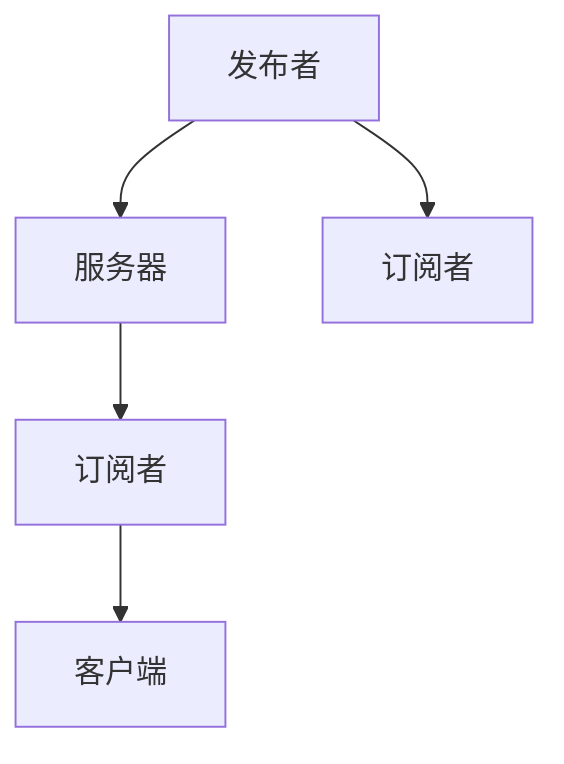

                 

## 1. 背景介绍

随着物联网(IoT)技术的发展，设备之间的信息交互变得越来越频繁和复杂。物联网设备通常具有低成本、低功耗的特点，需要一种轻量级的消息传输协议来满足其通信需求。MQTT（Message Queuing Telemetry Transport）协议正是在这样的背景下被开发出来的。MQTT是一种轻量级、低功耗、高可扩展性的消息传输协议，特别适合用于物联网设备的互联互通。

### 1.1 问题由来

传统的消息传输协议如HTTP、TCP等，虽然功能强大，但数据量较大、传输速度较慢，不适用于物联网设备。而另外一些轻量级协议如CoAP（Constrained Application Protocol）、XMPP（Extensible Messaging and Presence Protocol）虽然传输效率高，但无法满足物联网设备对数据格式和传输可靠性的需求。因此，急需一种既轻量级又适合物联网设备的消息传输协议。

### 1.2 问题核心关键点

MQTT协议的核心特点包括：
1. **轻量级**：数据传输量小，适用于带宽受限的设备。
2. **低功耗**：通信过程中无需频繁握手，减少了设备的能量消耗。
3. **高可扩展性**：支持异构网络环境，适合大规模物联网部署。
4. **可靠性**：提供消息的可靠传输，保障数据的一致性和完整性。
5. **安全性**：支持SSL/TLS加密传输，保障数据安全。

## 2. 核心概念与联系

### 2.1 核心概念概述

MQTT协议主要包含以下几个核心概念：

- **消息**：数据包或消息。
- **主题**：消息的标识符，用于发布和订阅。
- **订阅者**：接收消息的客户端。
- **发布者**：发送消息的客户端。
- **客户端**：与MQTT服务器交互的物联网设备或软件。
- **服务器**：负责存储和管理消息的数据中心。

这些概念通过MQTT协议的消息传递机制紧密联系在一起，形成了一个完整的物联网消息传输体系。

### 2.2 核心概念原理和架构的 Mermaid 流程图



该图展示了MQTT协议的核心流程：

1. 发布者向服务器发布消息。
2. 服务器将消息分发给所有订阅者。
3. 订阅者通过客户端接收消息。

通过这种简洁高效的消息传递模型，MQTT协议能够适应多种网络环境和设备类型，成为物联网消息传输的行业标准。

## 3. 核心算法原理 & 具体操作步骤

### 3.1 算法原理概述

MQTT协议的核心算法主要基于发布-订阅（Pub/Sub）模型。它通过简单的消息传递机制，实现了设备之间的实时通信。MQTT协议的设计目标是尽可能减少网络带宽的使用，同时确保数据传输的可靠性和安全性。

### 3.2 算法步骤详解

MQTT协议的主要步骤包括：
1. **连接建立**：客户端通过连接到MQTT服务器，建立一个持久化的连接。
2. **主题发布**：客户端将消息发布到指定的主题上。
3. **主题订阅**：订阅者订阅感兴趣的主题。
4. **消息传递**：服务器将消息从发布者传递给所有订阅者。
5. **断开连接**：当客户端不再需要数据时，断开连接释放资源。

以下将详细介绍每个步骤的实现。

### 3.3 算法优缺点

**优点**：
1. **高效性**：数据传输量小，适合带宽受限的设备。
2. **低延迟**：通信过程中无需频繁握手，响应速度快。
3. **高可扩展性**：支持异构网络环境，适合大规模物联网部署。
4. **可靠性**：提供消息的可靠传输，保障数据的一致性和完整性。
5. **安全性**：支持SSL/TLS加密传输，保障数据安全。

**缺点**：
1. **协议复杂性**：相对于简单协议如CoAP，MQTT协议的实现较为复杂。
2. **性能瓶颈**：在高并发场景下，可能需要额外的负载均衡机制。
3. **消息丢失风险**：在网络不稳定或服务器故障时，可能出现消息丢失的情况。

### 3.4 算法应用领域

MQTT协议广泛应用于以下领域：

- **智能家居**：连接各种智能家居设备，实现远程控制和监控。
- **工业物联网**：监控设备状态、优化生产流程、实现设备维护。
- **可穿戴设备**：实时监测健康数据、提供个性化服务。
- **农业物联网**：监测土壤湿度、温度、气候条件等，提高农业生产效率。
- **车联网**：实现车辆与道路、交通管理中心之间的通信。

## 4. 数学模型和公式 & 详细讲解 & 举例说明

### 4.1 数学模型构建

MQTT协议的数学模型主要涉及以下几个方面：

- **连接建立**：使用TCP连接建立机制。
- **主题发布和订阅**：使用简单的消息传递机制。
- **消息传递**：使用可靠的数据传输协议。
- **安全传输**：使用SSL/TLS加密协议。

### 4.2 公式推导过程

以下以TCP连接建立为例，推导MQTT协议中的TCP连接建立过程。

**连接建立过程**：
1. 客户端向服务器发送SYN包。
2. 服务器回复SYN+ACK包。
3. 客户端发送ACK包确认。

使用TCP协议的连接建立过程，MQTT协议在连接建立过程中也遵循类似的流程，只是增加了一些特定的消息格式和机制。

**示例代码**：

```python
from paho.mqtt import client

client = client.Client('client_id')
client.connect('mqtt.example.com', 1883, 60)
client.publish('topic', 'message')
client.subscribe('topic')
client.loop_start()
```

该代码使用paho.mqtt库实现MQTT协议的连接建立、主题发布、主题订阅等操作。

### 4.3 案例分析与讲解

**案例**：
假设有一个智能家居系统，包含温度传感器、湿度传感器和智能灯泡。系统设计如下：
1. 温度传感器和湿度传感器将实时数据发布到MQTT主题"sensor/data"。
2. 智能灯泡订阅"sensor/data"主题，并根据数据调整亮度和颜色。

**讲解**：
1. 温度传感器和湿度传感器通过MQTT协议向服务器发布数据。
2. 服务器将数据传递给订阅的智能灯泡。
3. 智能灯泡根据数据自动调节亮度和颜色，实现智能控制。

该案例展示了MQTT协议在物联网设备间的实时数据传递和设备控制中的应用。

## 5. 项目实践：代码实例和详细解释说明

### 5.1 开发环境搭建

MQTT协议的开发需要使用MQTT客户端库。以下介绍使用Python的paho.mqtt库搭建MQTT开发环境的步骤：

1. **安装paho.mqtt库**：
   ```bash
   pip install paho-mqtt
   ```

2. **配置MQTT服务器**：
   ```bash
   mosquitto-server -c mqtt.conf
   ```

其中，`mqtt.conf`是MQTT服务器的配置文件，包含服务器地址、端口号等配置信息。

### 5.2 源代码详细实现

以下是一个使用Python的paho.mqtt库实现MQTT协议的示例代码：

```python
from paho.mqtt import client

client = client.Client('client_id')
client.connect('mqtt.example.com', 1883, 60)
client.publish('topic', 'message')
client.subscribe('topic')
client.loop_start()
```

该代码实现了一个简单的MQTT客户端，用于连接到MQTT服务器、发布消息和订阅消息。

### 5.3 代码解读与分析

**代码解释**：
1. **客户端创建**：使用`client.Client`创建MQTT客户端，指定客户端ID。
2. **连接建立**：使用`client.connect`连接到MQTT服务器。
3. **主题发布**：使用`client.publish`发布消息到指定主题。
4. **主题订阅**：使用`client.subscribe`订阅指定主题。
5. **启动事件循环**：使用`client.loop_start`启动事件循环，处理连接、发布、订阅等事件。

**分析**：
1. **高效性**：代码简洁高效，容易理解和调试。
2. **可扩展性**：代码可以方便地扩展，添加更多的订阅和发布操作。
3. **可维护性**：代码易于维护，支持复杂功能的实现。

### 5.4 运行结果展示

运行上述代码后，可以通过MQTT服务器实时查看发布和订阅的消息。例如，使用`mosquitto_pub`命令发布消息：

```bash
mosquitto_pub -h mqtt.example.com -p 1883 -t topic -m "Hello, MQTT!"
```

服务器会接收到消息，并通过订阅者处理。

## 6. 实际应用场景

### 6.1 智能家居系统

智能家居系统通过MQTT协议连接各种智能设备，实现远程控制和监控。例如，智能灯泡通过MQTT协议接收温度传感器和湿度传感器发布的数据，根据数据自动调节亮度和颜色，实现智能控制。

### 6.2 工业物联网

工业物联网系统通过MQTT协议连接各种设备，监控设备状态、优化生产流程、实现设备维护。例如，生产设备通过MQTT协议向服务器发布状态信息，服务器根据信息自动调整生产参数，优化生产效率。

### 6.3 可穿戴设备

可穿戴设备通过MQTT协议实时监测健康数据，提供个性化服务。例如，智能手表通过MQTT协议将心率、步数、睡眠等信息发布到服务器，服务器根据信息提供健康建议和运动指导。

### 6.4 未来应用展望

未来，MQTT协议将在以下方面进一步发展：

1. **安全性增强**：引入更强的安全机制，保障数据传输的安全性。
2. **高可靠性**：提高消息传输的可靠性，减少数据丢失和延迟。
3. **多协议支持**：支持更多的通信协议，实现跨平台通信。
4. **大规模部署**：支持大规模设备连接，适应更多场景。
5. **低功耗优化**：进一步降低功耗，延长设备使用时间。

## 7. 工具和资源推荐

### 7.1 学习资源推荐

1. **MQTT官方文档**：MQTT官方文档详细介绍了MQTT协议的各个方面，是学习MQTT协议的重要资源。
   - 网址：[https://docs.oasis-open.org/mqtt/mqtt/v5.0/os/mqtt-v5.0-os.html](https://docs.oasis-open.org/mqtt/mqtt/v5.0/os/mqtt-v5.0-os.html)

2. **MQTT协议实战教程**：通过实际案例介绍MQTT协议的应用，帮助读者快速掌握MQTT协议的实现方法。
   - 网址：[https://www.cnblogs.com/irayh/archive/2019/04/22/9370432.html](https://www.cnblogs.com/irayh/archive/2019/04/22/9370432.html)

3. **MQTT协议课程**：斯坦福大学提供的MQTT协议课程，详细讲解MQTT协议的原理和应用。
   - 网址：[https://www.coursera.org/learn/iot-mqtt](https://www.coursera.org/learn/iot-mqtt)

### 7.2 开发工具推荐

1. **paho.mqtt**：Python的MQTT客户端库，功能强大，易于使用。
   - 网址：[https://pypi.org/project/paho-mqtt/](https://pypi.org/project/paho-mqtt/)

2. **Eclipse Mosquitto**：流行的MQTT服务器，支持高并发和大规模部署。
   - 网址：[https://www.eclipse.org/mosquitto/](https://www.eclipse.org/mosquitto/)

3. **MQTT.fx**：Java的MQTT客户端库，提供图形化界面，方便调试。
   - 网址：[https://www.mqtt.org/2019/03/05/fx-mqtt](https://www.mqtt.org/2019/03/05/fx-mqtt)

### 7.3 相关论文推荐

1. **MQTT协议的设计与实现**：详细介绍了MQTT协议的设计思想和实现方法，是学习MQTT协议的重要参考。
   - 论文：[https://www.internetsociety.org/publications/research/mqtt](https://www.internetsociety.org/publications/research/mqtt)

2. **MQTT在物联网中的应用**：介绍了MQTT协议在物联网中的典型应用案例，展示了MQTT协议的广泛应用前景。
   - 论文：[https://ieeexplore.ieee.org/document/8393390](https://ieeexplore.ieee.org/document/8393390)

3. **MQTT协议的优化与改进**：探讨了MQTT协议在实际应用中的优化和改进方法，为MQTT协议的进一步发展提供了方向。
   - 论文：[https://ieeexplore.ieee.org/document/8803033](https://ieeexplore.ieee.org/document/8803033)

## 8. 总结：未来发展趋势与挑战

### 8.1 研究成果总结

MQTT协议作为一种轻量级、低功耗、高可扩展性的消息传输协议，已经广泛应用于物联网设备间的通信。它的设计思想和实现方法，为物联网设备的互联互通提供了强有力的支持。

### 8.2 未来发展趋势

未来，MQTT协议将在以下几个方面进一步发展：

1. **安全性增强**：引入更强的安全机制，保障数据传输的安全性。
2. **高可靠性**：提高消息传输的可靠性，减少数据丢失和延迟。
3. **多协议支持**：支持更多的通信协议，实现跨平台通信。
4. **大规模部署**：支持大规模设备连接，适应更多场景。
5. **低功耗优化**：进一步降低功耗，延长设备使用时间。

### 8.3 面临的挑战

尽管MQTT协议已经取得了显著的发展，但在实际应用中仍面临以下挑战：

1. **协议复杂性**：相对于简单协议如CoAP，MQTT协议的实现较为复杂。
2. **性能瓶颈**：在高并发场景下，可能需要额外的负载均衡机制。
3. **消息丢失风险**：在网络不稳定或服务器故障时，可能出现消息丢失的情况。

### 8.4 研究展望

未来，MQTT协议需要在以下几个方面进行深入研究：

1. **安全性改进**：引入更强的安全机制，保障数据传输的安全性。
2. **高可靠性提升**：提高消息传输的可靠性，减少数据丢失和延迟。
3. **多协议支持扩展**：支持更多的通信协议，实现跨平台通信。
4. **低功耗优化**：进一步降低功耗，延长设备使用时间。
5. **大规模部署优化**：支持大规模设备连接，适应更多场景。

## 9. 附录：常见问题与解答

**Q1：MQTT协议如何处理消息丢失问题？**

A: MQTT协议提供了以下几个机制来处理消息丢失问题：

1. **重试机制**：在消息发布和订阅过程中，客户端可以指定重试次数，以便在网络不稳定时自动重发。
2. **可靠传输**：通过使用ACK（确认信息）机制，服务器可以确认消息的接收情况，并在消息丢失时进行重传。
3. **消息持久化**：在服务器端保存消息，以便在网络恢复后重新传递。

**Q2：MQTT协议的通信模式有哪些？**

A: MQTT协议主要有以下几种通信模式：

1. **点对点模式**：客户端直接连接服务器，实现双向通信。
2. **发布/订阅模式**：服务器将消息广播给所有订阅者，实现一对多通信。
3. **一对多模式**：一个服务器连接多个客户端，实现广播通信。

**Q3：MQTT协议的QoS（服务质量）有哪些级别？**

A: MQTT协议定义了三个QoS级别：

1. **QoS 0**：不保证可靠性，服务器端不保存消息，消息丢失后不再重传。
2. **QoS 1**：部分可靠性，服务器端保存消息，消息丢失后进行一次重传。
3. **QoS 2**：完全可靠性，服务器端保存消息，消息丢失后进行两次重传。

**Q4：MQTT协议与CoAP协议的区别是什么？**

A: MQTT协议和CoAP协议的主要区别如下：

1. **数据格式**：MQTT协议使用JSON格式传输数据，CoAP协议使用KV（键值对）格式。
2. **通信模式**：MQTT协议支持发布/订阅模式，CoAP协议只支持点对点模式。
3. **数据长度**：MQTT协议支持最大512字节的数据长度，CoAP协议支持最大1024字节。

**Q5：MQTT协议与HTTP协议的区别是什么？**

A: MQTT协议和HTTP协议的主要区别如下：

1. **通信方式**：MQTT协议使用轻量级、低延迟的通信方式，HTTP协议使用全双工通信方式。
2. **数据格式**：MQTT协议使用JSON格式传输数据，HTTP协议使用XML格式。
3. **应用场景**：MQTT协议适用于物联网设备间的通信，HTTP协议适用于Web应用和服务。

---

作者：禅与计算机程序设计艺术 / Zen and the Art of Computer Programming

