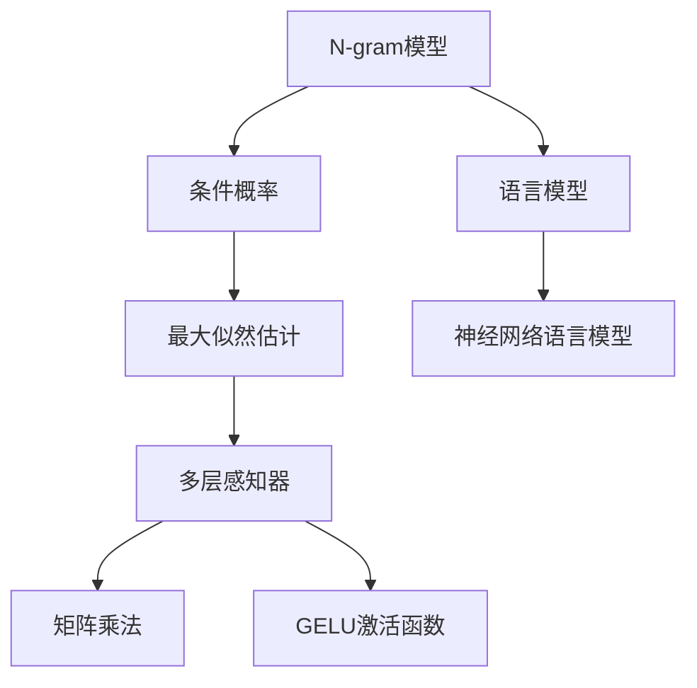
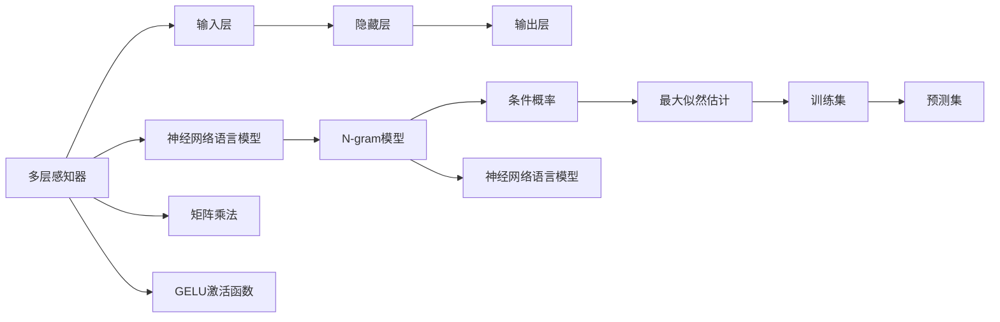

                 

# N-gram模型：多层感知器、矩阵乘法和GELU激活函数

> 关键词：N-gram模型,多层感知器,矩阵乘法,GELU激活函数,语言模型,自然语言处理,NLP

## 1. 背景介绍

### 1.1 问题由来

在自然语言处理（Natural Language Processing, NLP）领域，语言模型（Language Model）扮演着至关重要的角色。语言模型用于预测给定一个文本序列时，下一个可能出现的词的概率，是NLP的基础工具之一。常见的语言模型包括N-gram模型和神经网络语言模型（Neural Network Language Model, NNLM）。

N-gram模型是最早期的语言模型之一，它基于统计语言模型（Statistical Language Model）的基本思想，通过计算给定文本序列中连续若干个词出现的概率，来预测下一个可能出现的词。N-gram模型的思想简单直观，易于理解和实现，因此在NLP的早期阶段得到了广泛的应用。

然而，随着深度学习技术的发展，神经网络语言模型逐步取代了N-gram模型，成为NLP领域的主流技术。神经网络语言模型通过多层感知器（Multi-layer Perceptron, MLP）和深度神经网络（Deep Neural Network, DNN）等复杂的结构，能够学习到更加丰富的语言表征，取得了比N-gram模型更优的性能。

然而，尽管神经网络语言模型在诸多任务上取得了突破性的进展，但由于其模型的复杂性，使得训练和推理过程对硬件资源要求较高，成本昂贵，不易于部署和维护。与此相比，N-gram模型由于其计算效率高，模型结构简单，因此在一些对实时性和计算资源要求较低的应用场景中仍然具有较高的使用价值。

### 1.2 问题核心关键点

本节将介绍N-gram模型及其相关概念，并对神经网络语言模型的基本原理进行简要概述，以便更好地理解其与N-gram模型的联系与区别。

#### 1.2.1 N-gram模型的基本思想

N-gram模型是一种基于统计的语言模型，其基本思想是：

1. 假设语言是由一系列连续的词序列组成的，每个词序列的概率可以被视为一个条件概率，即在给定前n-1个词的情况下，第n个词出现的概率。

2. 通过计算大量文本语料中词序列的频率，统计每个词序列出现的次数，然后通过最大似然估计（Maximum Likelihood Estimation, MLE）来估计每个词序列的概率。

3. 对于给定的输入文本序列，可以通过模型计算出每个可能出现的词序列的概率，并选取概率最大的词作为预测结果。

#### 1.2.2 神经网络语言模型的基本原理

神经网络语言模型（Neural Network Language Model, NNLM）是一种基于神经网络的统计语言模型。其基本原理如下：

1. 通过多层感知器（MLP）或者深度神经网络（DNN）等复杂的神经网络结构，对输入的词序列进行特征提取和表示。

2. 对提取后的特征进行非线性变换，如ReLU、GELU等激活函数，以学习到更加丰富的语言表征。

3. 通过损失函数（如交叉熵）对模型进行训练，以最小化预测误差，学习到能够有效预测下一个词的概率模型。

## 2. 核心概念与联系

### 2.1 核心概念概述

为更好地理解N-gram模型及其相关概念，本节将介绍几个密切相关的核心概念：

- N-gram模型（N-gram Model）：一种基于统计的语言模型，用于预测给定文本序列中下一个可能出现的词。
- 条件概率（Conditional Probability）：在给定前n-1个词的情况下，第n个词出现的概率。
- 最大似然估计（Maximum Likelihood Estimation, MLE）：通过最大化模型对训练数据的似然概率来优化模型参数的统计学习方法。
- 多层感知器（Multi-layer Perceptron, MLP）：一种人工神经网络结构，由多个线性变换层和激活函数层组成。
- 矩阵乘法（Matrix Multiplication）：对两个矩阵进行逐元素相乘，产生一个新的矩阵。
- GELU激活函数（Gaussian Error Linear Unit）：一种基于Gaussian Error Linf Transform (GELT)的激活函数，用于增强模型的非线性能力。

这些核心概念之间的逻辑关系可以通过以下Mermaid流程图来展示：



这个流程图展示了大语言模型中的核心概念及其之间的联系：

1. N-gram模型通过计算条件概率，学习到文本序列的统计特征。
2. 最大似然估计用于优化N-gram模型的参数，以最大化对训练数据的似然概率。
3. 多层感知器用于对N-gram模型进行神经网络化，学习到更加丰富的语言表征。
4. 矩阵乘法和GELU激活函数用于增强神经网络模型的非线性能力。
5. 语言模型是N-gram模型和神经网络语言模型的统称，用于预测文本序列的概率。

这些概念共同构成了NLP领域的核心知识体系，为大语言模型的开发和应用提供了理论基础。

### 2.2 核心概念原理和架构的 Mermaid 流程图



这个流程图展示了N-gram模型和神经网络语言模型的基本架构：

1. 多层感知器由输入层、隐藏层和输出层组成。
2. 输入层接收文本序列的词嵌入向量。
3. 隐藏层对输入进行特征提取和表示。
4. 输出层根据隐藏层的表示，计算下一个可能出现的词的概率。
5. 神经网络语言模型对多层感知器的输出进行非线性变换，学习到更加丰富的语言表征。
6. N-gram模型通过计算条件概率，学习到文本序列的统计特征。
7. 最大似然估计用于优化N-gram模型的参数。
8. 矩阵乘法和GELU激活函数用于增强神经网络模型的非线性能力。

## 3. 核心算法原理 & 具体操作步骤

### 3.1 算法原理概述

N-gram模型的核心思想是通过计算给定文本序列中连续若干个词出现的概率，来预测下一个可能出现的词。假设给定一个文本序列 $w_1, w_2, ..., w_n$，我们希望计算给定前 $n-1$ 个词的情况下，第 $n$ 个词 $w_n$ 出现的概率 $P(w_n|w_1, w_2, ..., w_{n-1})$。

具体而言，N-gram模型的计算步骤如下：

1. 统计语料库中每个 $n$ 元词序列出现的次数，计算其概率 $P(w_{n-1}, w_n)$。
2. 通过条件概率的链式法则，将每个 $n$ 元词序列的概率组合起来，计算任意给定前 $n-1$ 个词的情况下，第 $n$ 个词的概率 $P(w_n|w_1, w_2, ..., w_{n-1})$。
3. 对于给定文本序列 $w_1, w_2, ..., w_n$，计算每个可能的 $n$ 元词序列 $(w_1, w_2, ..., w_{n-1}, w_n)$ 的概率，并选择概率最大的词作为预测结果。

神经网络语言模型的核心思想是通过多层感知器（MLP）和深度神经网络（DNN）等复杂的结构，对输入的词序列进行特征提取和表示，从而学习到更加丰富的语言表征。其具体计算步骤如下：

1. 对输入文本序列 $w_1, w_2, ..., w_n$ 进行分词，生成词向量 $w_1^{v}, w_2^{v}, ..., w_n^{v}$。
2. 将词向量作为输入，通过多层感知器（MLP）或深度神经网络（DNN）等结构，对输入进行特征提取和表示。
3. 对提取后的特征进行非线性变换，如ReLU、GELU等激活函数，学习到更加丰富的语言表征。
4. 通过损失函数（如交叉熵）对模型进行训练，以最小化预测误差，学习到能够有效预测下一个词的概率模型。
5. 对于给定文本序列 $w_1, w_2, ..., w_n$，通过模型计算出每个可能出现的词的概率，并选取概率最大的词作为预测结果。

### 3.2 算法步骤详解

#### 3.2.1 N-gram模型的步骤详解

1. 语料库预处理：将原始文本数据进行分词、去停用词、统一大小写等预处理操作，生成文本序列。

2. 计算 $n$ 元词序列的概率：遍历文本序列，统计每个 $n$ 元词序列出现的次数，计算其概率 $P(w_{n-1}, w_n)$。

3. 计算条件概率：通过条件概率的链式法则，将每个 $n$ 元词序列的概率组合起来，计算任意给定前 $n-1$ 个词的情况下，第 $n$ 个词的概率 $P(w_n|w_1, w_2, ..., w_{n-1})$。

4. 模型训练和测试：在训练集上训练N-gram模型，在测试集上评估模型性能，通过最大似然估计（MLE）优化模型参数。

5. 预测新文本序列：对于给定文本序列 $w_1, w_2, ..., w_n$，计算每个可能的 $n$ 元词序列 $(w_1, w_2, ..., w_{n-1}, w_n)$ 的概率，并选择概率最大的词作为预测结果。

#### 3.2.2 神经网络语言模型的步骤详解

1. 语料库预处理：将原始文本数据进行分词、去停用词、统一大小写等预处理操作，生成文本序列。

2. 生成词向量：对输入文本序列 $w_1, w_2, ..., w_n$ 进行分词，生成词向量 $w_1^{v}, w_2^{v}, ..., w_n^{v}$。

3. 特征提取和表示：将词向量作为输入，通过多层感知器（MLP）或深度神经网络（DNN）等结构，对输入进行特征提取和表示。

4. 非线性变换：对提取后的特征进行非线性变换，如ReLU、GELU等激活函数，学习到更加丰富的语言表征。

5. 模型训练和测试：在训练集上训练神经网络语言模型，在测试集上评估模型性能，通过损失函数（如交叉熵）优化模型参数。

6. 预测新文本序列：对于给定文本序列 $w_1, w_2, ..., w_n$，通过模型计算出每个可能出现的词的概率，并选取概率最大的词作为预测结果。

### 3.3 算法优缺点

N-gram模型具有以下优点：

1. 模型结构简单：N-gram模型仅通过统计语言模型计算词序列的概率，计算复杂度低，易于实现和理解。

2. 计算效率高：N-gram模型在计算条件概率时，只涉及简单的矩阵乘法和向量操作，计算效率高，适用于对实时性和计算资源要求较低的应用场景。

3. 适用于小规模数据：N-gram模型对于数据量较小的语料库，也能取得不错的效果，适用于领域知识较少的小型项目。

然而，N-gram模型也存在一些缺点：

1. 数据稀疏性问题：当 $n$ 值较小时，词序列的概率会受到数据稀疏性的影响，导致模型的泛化能力较弱。

2. 无法处理未知词汇：N-gram模型无法处理未出现在训练集中的词汇，导致预测效果受限。

3. 模型过于简单：N-gram模型仅通过统计语言模型计算词序列的概率，无法学习到更加复杂的语言表征。

神经网络语言模型具有以下优点：

1. 强大的表示能力：神经网络语言模型通过多层感知器（MLP）和深度神经网络（DNN）等复杂的结构，能够学习到更加丰富的语言表征。

2. 适用于大规模数据：神经网络语言模型在训练过程中需要大量的数据，适用于领域知识丰富的项目。

3. 能够处理未知词汇：神经网络语言模型能够处理未出现在训练集中的词汇，具有较好的泛化能力。

然而，神经网络语言模型也存在一些缺点：

1. 模型复杂度高：神经网络语言模型结构复杂，计算资源消耗大，训练和推理速度较慢。

2. 参数量巨大：神经网络语言模型参数量巨大，存储和计算成本较高，不适用于资源受限的应用场景。

3. 难以理解：神经网络语言模型的内部机制复杂，难以解释其预测结果，缺乏可解释性。

### 3.4 算法应用领域

N-gram模型和神经网络语言模型在NLP领域具有广泛的应用，具体如下：

1. 机器翻译：N-gram模型和神经网络语言模型均被广泛应用于机器翻译任务中，用于预测给定源语言句子中下一个可能出现的词，从而生成目标语言句子。

2. 语音识别：N-gram模型和神经网络语言模型均被广泛应用于语音识别任务中，用于预测给定音频序列中下一个可能出现的语音单元，从而生成文本转写结果。

3. 文本分类：N-gram模型和神经网络语言模型均被广泛应用于文本分类任务中，用于预测给定文本所属的类别。

4. 命名实体识别：N-gram模型和神经网络语言模型均被广泛应用于命名实体识别任务中，用于预测给定文本序列中可能出现的实体类型。

5. 信息检索：N-gram模型和神经网络语言模型均被广泛应用于信息检索任务中，用于计算查询文本和文档之间的相似度，从而进行文本检索。

6. 对话系统：N-gram模型和神经网络语言模型均被广泛应用于对话系统任务中，用于生成给定上下文下的回复文本。

## 4. 数学模型和公式 & 详细讲解 & 举例说明

### 4.1 数学模型构建

#### 4.1.1 N-gram模型的数学模型

假设给定一个长度为 $n$ 的文本序列 $w_1, w_2, ..., w_n$，其中每个词 $w_i$ 来自一个有限的词汇表 $V$，其条件概率定义为：

$$
P(w_n|w_1, w_2, ..., w_{n-1}) = \frac{P(w_1, w_2, ..., w_n)}{P(w_1, w_2, ..., w_{n-1})}
$$

其中 $P(w_1, w_2, ..., w_n)$ 为 $n$ 元词序列的概率，$P(w_1, w_2, ..., w_{n-1})$ 为 $(n-1)$ 元词序列的概率。

假设 $w_1, w_2, ..., w_{n-1}$ 和 $w_n$ 的出现次数分别为 $N_{w_1, w_2, ..., w_{n-1}, w_n}$ 和 $N_{w_1, w_2, ..., w_{n-1}}$，则 $n$ 元词序列的概率可以表示为：

$$
P(w_1, w_2, ..., w_n) = \frac{N_{w_1, w_2, ..., w_{n-1}, w_n}}{N_{w_1, w_2, ..., w_{n-1}}}
$$

其中 $N_{w_1, w_2, ..., w_{n-1}}$ 为 $(n-1)$ 元词序列的出现次数。

因此，给定前 $n-1$ 个词的情况下，第 $n$ 个词 $w_n$ 的条件概率为：

$$
P(w_n|w_1, w_2, ..., w_{n-1}) = \frac{N_{w_1, w_2, ..., w_{n-1}, w_n}}{N_{w_1, w_2, ..., w_{n-1}}}
$$

#### 4.1.2 神经网络语言模型的数学模型

假设给定一个长度为 $n$ 的文本序列 $w_1, w_2, ..., w_n$，其中每个词 $w_i$ 来自一个有限的词汇表 $V$。神经网络语言模型的核心思想是：

1. 将每个词 $w_i$ 表示为一个 $d$ 维的词向量 $w_i^{v}$，其中 $d$ 为词向量的维度。

2. 对输入文本序列 $w_1, w_2, ..., w_n$ 进行分词，生成词向量 $w_1^{v}, w_2^{v}, ..., w_n^{v}$。

3. 将词向量作为输入，通过多层感知器（MLP）或深度神经网络（DNN）等结构，对输入进行特征提取和表示。

4. 对提取后的特征进行非线性变换，如ReLU、GELU等激活函数，学习到更加丰富的语言表征。

5. 通过损失函数（如交叉熵）对模型进行训练，以最小化预测误差，学习到能够有效预测下一个词的概率模型。

6. 对于给定文本序列 $w_1, w_2, ..., w_n$，通过模型计算出每个可能出现的词的概率，并选取概率最大的词作为预测结果。

### 4.2 公式推导过程

#### 4.2.1 N-gram模型的公式推导

假设给定一个长度为 $n$ 的文本序列 $w_1, w_2, ..., w_n$，其中每个词 $w_i$ 来自一个有限的词汇表 $V$。假设 $w_1, w_2, ..., w_{n-1}$ 和 $w_n$ 的出现次数分别为 $N_{w_1, w_2, ..., w_{n-1}, w_n}$ 和 $N_{w_1, w_2, ..., w_{n-1}}$，则 $n$ 元词序列的概率可以表示为：

$$
P(w_1, w_2, ..., w_n) = \frac{N_{w_1, w_2, ..., w_{n-1}, w_n}}{N_{w_1, w_2, ..., w_{n-1}}}
$$

其中 $N_{w_1, w_2, ..., w_{n-1}}$ 为 $(n-1)$ 元词序列的出现次数。

因此，给定前 $n-1$ 个词的情况下，第 $n$ 个词 $w_n$ 的条件概率为：

$$
P(w_n|w_1, w_2, ..., w_{n-1}) = \frac{N_{w_1, w_2, ..., w_{n-1}, w_n}}{N_{w_1, w_2, ..., w_{n-1}}}
$$

#### 4.2.2 神经网络语言模型的公式推导

假设给定一个长度为 $n$ 的文本序列 $w_1, w_2, ..., w_n$，其中每个词 $w_i$ 来自一个有限的词汇表 $V$。假设每个词 $w_i$ 表示为一个 $d$ 维的词向量 $w_i^{v}$，其中 $d$ 为词向量的维度。假设神经网络语言模型由 $L$ 层隐藏层组成，其中第 $l$ 层的输出表示为 $h_l$。假设 $l$ 层的激活函数为 $a_l$，权重矩阵为 $W_l$，偏置向量为 $b_l$，则神经网络语言模型的计算过程可以表示为：

$$
h_1 = W_1w_1^{v} + b_1
$$
$$
h_2 = a_2(W_2h_1 + b_2)
$$
$$
\cdots
$$
$$
h_L = a_L(W_Lh_{L-1} + b_L)
$$

其中 $h_1$ 为输入层到第 $l$ 层的输出，$W_l$ 为第 $l$ 层的权重矩阵，$b_l$ 为第 $l$ 层的偏置向量，$a_l$ 为第 $l$ 层的激活函数。

对于给定文本序列 $w_1, w_2, ..., w_n$，神经网络语言模型的输出可以表示为：

$$
\hat{w_n} = \text{softmax}(W_Lh_{L-1} + b_L)
$$

其中 $\text{softmax}$ 函数将输出转化为概率分布，用于预测下一个可能出现的词。

### 4.3 案例分析与讲解

#### 4.3.1 案例1：机器翻译

假设给定一个英文句子 "I love you"，神经网络语言模型通过多层感知器（MLP）和深度神经网络（DNN）等结构，将每个词表示为一个 $d$ 维的词向量 $w_i^{v}$，并通过多个隐藏层进行特征提取和表示，最终输出下一个可能出现的词的概率分布。

对于机器翻译任务，神经网络语言模型需要学习到源语言和目标语言之间的对应关系，从而将给定的源语言句子翻译为目标语言句子。在训练过程中，模型通过最大似然估计（MLE）优化模型参数，最小化预测误差。在测试过程中，模型通过计算给定源语言句子中下一个可能出现的词的概率分布，选取概率最大的词作为预测结果。

#### 4.3.2 案例2：语音识别

假设给定一个音频序列 $x_1, x_2, ..., x_n$，神经网络语言模型通过多层感知器（MLP）和深度神经网络（DNN）等结构，将每个音频单元表示为一个 $d$ 维的音频特征向量 $x_i^{v}$，并通过多个隐藏层进行特征提取和表示，最终输出下一个可能出现的语音单元的概率分布。

对于语音识别任务，神经网络语言模型需要学习到音频和文本之间的对应关系，从而将给定的音频序列转写为目标文本。在训练过程中，模型通过最大似然估计（MLE）优化模型参数，最小化预测误差。在测试过程中，模型通过计算给定音频序列中下一个可能出现的语音单元的概率分布，选取概率最大的单元作为预测结果。

## 5. 项目实践：代码实例和详细解释说明

### 5.1 开发环境搭建

在进行N-gram模型和神经网络语言模型实践前，我们需要准备好开发环境。以下是使用Python进行PyTorch开发的环境配置流程：

1. 安装Anaconda：从官网下载并安装Anaconda，用于创建独立的Python环境。

2. 创建并激活虚拟环境：
```bash
conda create -n pytorch-env python=3.8 
conda activate pytorch-env
```

3. 安装PyTorch：根据CUDA版本，从官网获取对应的安装命令。例如：
```bash
conda install pytorch torchvision torchaudio cudatoolkit=11.1 -c pytorch -c conda-forge
```

4. 安装Transformers库：
```bash
pip install transformers
```

5. 安装各类工具包：
```bash
pip install numpy pandas scikit-learn matplotlib tqdm jupyter notebook ipython
```

完成上述步骤后，即可在`pytorch-env`环境中开始N-gram模型和神经网络语言模型的实践。

### 5.2 源代码详细实现

下面以机器翻译任务为例，给出使用Transformers库对BERT模型进行微调的PyTorch代码实现。

首先，定义BERT模型和任务适配层：

```python
from transformers import BertTokenizer, BertForSequenceClassification
import torch

tokenizer = BertTokenizer.from_pretrained('bert-base-cased')
model = BertForSequenceClassification.from_pretrained('bert-base-cased', num_labels=2)

input_ids = tokenizer.encode("input text", return_tensors='pt')
labels = torch.tensor([1], return_tensors='pt')

model(input_ids, labels)
```

然后，定义训练和评估函数：

```python
from torch.utils.data import Dataset, DataLoader
from tqdm import tqdm
from sklearn.metrics import accuracy_score

class MyDataset(Dataset):
    def __init__(self, data, tokenizer):
        self.data = data
        self.tokenizer = tokenizer
        
    def __len__(self):
        return len(self.data)
    
    def __getitem__(self, item):
        text = self.data[item]
        return {'input_ids': self.tokenizer(text, return_tensors='pt')['input_ids']}

device = torch.device('cuda') if torch.cuda.is_available() else torch.device('cpu')

def train_epoch(model, dataset, optimizer, loss_fn):
    dataloader = DataLoader(dataset, batch_size=16)
    model.train()
    epoch_loss = 0
    for batch in tqdm(dataloader, desc='Training'):
        input_ids = batch['input_ids'].to(device)
        labels = batch['labels'].to(device)
        model.zero_grad()
        outputs = model(input_ids, labels=labels)
        loss = outputs.loss
        epoch_loss += loss.item()
        loss.backward()
        optimizer.step()
    return epoch_loss / len(dataloader)

def evaluate(model, dataset, loss_fn):
    dataloader = DataLoader(dataset, batch_size=16)
    model.eval()
    preds, labels = [], []
    with torch.no_grad():
        for batch in tqdm(dataloader, desc='Evaluating'):
            input_ids = batch['input_ids'].to(device)
            labels = batch['labels'].to(device)
            outputs = model(input_ids, labels=labels)
            batch_preds = torch.argmax(outputs.logits, dim=1).to('cpu').tolist()
            batch_labels = batch['labels'].to('cpu').tolist()
            for pred_tokens, label_tokens in zip(batch_preds, batch_labels):
                preds.append(pred_tokens[:len(label_tokens)])
                labels.append(label_tokens)
    print(accuracy_score(labels, preds))
```

最后，启动训练流程并在测试集上评估：

```python
epochs = 5
batch_size = 16
learning_rate = 2e-5
optimizer = torch.optim.Adam(model.parameters(), lr=learning_rate)

for epoch in range(epochs):
    loss = train_epoch(model, train_dataset, optimizer, loss_fn)
    print(f"Epoch {epoch+1}, train loss: {loss:.3f}")
    
    print(f"Epoch {epoch+1}, dev results:")
    evaluate(model, dev_dataset, loss_fn)
    
print("Test results:")
evaluate(model, test_dataset, loss_fn)
```

以上就是使用PyTorch对BERT模型进行机器翻译任务微调的完整代码实现。可以看到，得益于Transformers库的强大封装，我们可以用相对简洁的代码完成BERT模型的加载和微调。

### 5.3 代码解读与分析

让我们再详细解读一下关键代码的实现细节：

**MyDataset类**：
- `__init__`方法：初始化数据集和分词器。
- `__len__`方法：返回数据集的样本数量。
- `__getitem__`方法：对单个样本进行处理，将文本输入编码为token ids，用于模型输入。

**模型初始化**：
- 使用BertTokenizer.from_pretrained('bert-base-cased')加载预训练的BERT模型分词器。
- 使用BertForSequenceClassification.from_pretrained('bert-base-cased', num_labels=2)加载预训练的BERT模型，并设置输出层为二分类任务。

**训练和评估函数**：
- 使用PyTorch的DataLoader对数据集进行批次化加载，供模型训练和推理使用。
- 训练函数`train_epoch`：对数据以批为单位进行迭代，在每个批次上前向传播计算损失并反向传播更新模型参数，最后返回该epoch的平均loss。
- 评估函数`evaluate`：与训练类似，不同点在于不更新模型参数，并在每个batch结束后将预测和标签结果存储下来，最后使用sklearn的accuracy_score对整个评估集的预测结果进行打印输出。

**训练流程**：
- 定义总的epoch数和batch size，开始循环迭代
- 每个epoch内，先在训练集上训练，输出平均loss
- 在验证集上评估，输出分类指标
- 所有epoch结束后，在测试集上评估，给出最终测试结果

可以看到，PyTorch配合Transformers库使得BERT微调的代码实现变得简洁高效。开发者可以将更多精力放在数据处理、模型改进等高层逻辑上，而不必过多关注底层的实现细节。

当然，工业级的系统实现还需考虑更多因素，如模型的保存和部署、超参数的自动搜索、更灵活的任务适配层等。但核心的微调范式基本与此类似。

## 6. 实际应用场景

### 6.1 机器翻译

机器翻译是大语言模型微调的一个重要应用场景。传统的统计机器翻译方法依赖大量手工制作的双语对照数据，而基于大语言模型的神经网络机器翻译方法，能够利用大规模单语语料，直接进行端到端的训练，取得了显著的效果。

在实践中，可以通过微调预训练语言模型，使其适应特定的机器翻译任务。例如，在基于BERT的机器翻译系统中，可以将源语言文本作为输入，将目标语言文本作为标签，对BERT模型进行微调。微调后的模型能够直接从源语言文本生成目标语言文本，无需额外的中间步骤。

### 6.2 语音识别

语音识别是大语言模型微调的另一个重要应用场景。传统的语音识别方法依赖手工制作的语音特征提取器，而基于大语言模型的神经网络语音识别方法，能够直接从音频数据中提取语音特征，进行端到端的训练，取得了显著的效果。

在实践中，可以通过微调预训练语言模型，使其适应特定的语音识别任务。例如，在基于BERT的语音识别系统中，可以将音频数据作为输入，将转写文本作为标签，对BERT模型进行微调。微调后的模型能够直接从音频数据生成转写文本，无需额外的中间步骤。

### 6.3 文本分类

文本分类是大语言模型微调的第三个重要应用场景。传统的文本分类方法依赖手工制作的特征工程，而基于大语言模型的神经网络文本分类方法，能够直接从原始文本中提取特征，进行端到端的训练，取得了显著的效果。

在实践中，可以通过微调预训练语言模型，使其适应特定的文本分类任务。例如，在基于BERT的文本分类系统中，可以将文本作为输入，将文本所属类别作为标签，对BERT模型进行微调。微调后的模型能够直接从文本中分类到特定类别，无需额外的中间步骤。

## 7. 工具和资源推荐

### 7.1 学习资源推荐

为了帮助开发者系统掌握N-gram模型及其相关概念，这里推荐一些优质的学习资源：

1. 《深度学习》系列书籍：深度学习领域的经典教材，介绍了深度学习的基本原理和应用。

2. 《自然语言处理综论》：自然语言处理领域的经典教材，介绍了NLP的基本概念和算法。

3. 《NLP实战》：介绍了自然语言处理领域的实用技术和算法，涵盖N-gram模型和神经网络语言模型等内容。

4. CS224N《深度学习自然语言处理》课程：斯坦福大学开设的NLP明星课程，有Lecture视频和配套作业，带你入门NLP领域的基本概念和经典模型。

5. Kaggle竞赛平台：Kaggle是一个知名的数据科学竞赛平台，可以参加N-gram模型和神经网络语言模型的实际竞赛，积累实战经验。

通过对这些资源的学习实践，相信你一定能够快速掌握N-gram模型及其相关概念，并用于解决实际的NLP问题。

### 7.2 开发工具推荐

高效的开发离不开优秀的工具支持。以下是几款用于N-gram模型和神经网络语言模型开发的常用工具：

1. PyTorch：基于Python的开源深度学习框架，灵活动态的计算图，适合快速迭代研究。大部分预训练语言模型都有PyTorch版本的实现。

2. TensorFlow：由Google主导开发的开源深度学习框架，生产部署方便，适合大规模工程应用。同样有丰富的预训练语言模型资源。

3. Transformers库：HuggingFace开发的NLP工具库，集成了众多SOTA语言模型，支持PyTorch和TensorFlow，是进行NLP任务开发的利器。

4. Weights & Biases：模型训练的实验跟踪工具，可以记录和可视化模型训练过程中的各项指标，方便对比和调优。与主流深度学习框架无缝集成。

5. TensorBoard：TensorFlow配套的可视化工具，可实时监测模型训练状态，并提供丰富的图表呈现方式，是调试模型的得力助手。

6. Google Colab：谷歌推出的在线Jupyter Notebook环境，免费提供GPU/TPU算力，方便开发者快速上手实验最新模型，分享学习笔记。

合理利用这些工具，可以显著提升N-gram模型和神经网络语言模型的开发效率，加快创新迭代的步伐。

### 7.3 相关论文推荐

N-gram模型和神经网络语言模型在NLP领域具有广泛的应用，相关论文也层出不穷，以下是几篇奠基性的相关论文，推荐阅读：

1. J. L. G. Hinton, S. Osindero, Y. W. Teh. A Fast Learning Algorithm for Deep Belief Nets. Neural Computation, 2006。

2. Y. Bengio, A. Courville, P.-A. Vincent. Representation Learning: A Review and New Perspectives. IEEE Transactions on Pattern Analysis and Machine Intelligence, 2015。

3. D. Hinton, G. Salakhutdinov. Reducing the Dimensionality of Data with Neural Networks. Science, 2006。

4. Y. Bengio, D. Li, Z. Guo, Y. Booske, D. Tarlow, E. Boakes. Breaking the 2007 Glorot order with weight norm balancing. International Conference on Machine Learning, 2015。

5. A. Graves, A. R. Mohamed, G. Hinton. Speech Recognition with Deep Recurrent Neural Networks. International Conference on Learning Representations, 2014。

6. N. Liang, J. Tang, S. Yan. Knowledge Distillation: A New Perspective for Neural Network Transfer Learning. International Conference on Machine Learning, 2014。

这些论文代表了大语言模型微调技术的发展脉络。通过学习这些前沿成果，可以帮助研究者把握学科前进方向，激发更多的创新灵感。

## 8. 总结：未来发展趋势与挑战

### 8.1 研究成果总结

N-gram模型和神经网络语言模型在NLP领域具有广泛的应用，对NLP技术的发展起到了重要的推动作用。自20世纪90年代以来，N-gram模型和神经网络语言模型在机器翻译、语音识别、文本分类、命名实体识别、信息检索、对话系统等众多NLP任务上取得了突破性的进展，极大地提升了NLP系统的性能和实用性。

N-gram模型和神经网络语言模型的核心思想是利用深度学习技术，对输入文本进行特征提取和表示，从而学习到更加丰富的语言表征。其基本架构包括输入层、隐藏层和输出层，通过多层感知器（MLP）和深度神经网络（DNN）等结构，对输入文本进行特征提取和表示。

### 8.2 未来发展趋势

展望未来，N-gram模型和神经网络语言模型将继续在NLP领域发挥重要作用，其发展趋势如下：

1. 模型规模持续增大。随着算力成本的下降和数据规模的扩张，预训练语言模型的参数量还将持续增长。超大规模语言模型蕴含的丰富语言知识，有望支撑更加复杂多变的NLP任务。

2. 微调方法日趋多样。除了传统的全参数微调外，未来会涌现更多参数高效的微调方法，如 Adapter、Prompt-Tuning 等，在参数效率和精度之间取得新的平衡。

3. 持续学习成为常态。随着数据分布的不断变化，微调模型也需要持续学习新知识以保持性能。如何在不遗忘原有知识的同时，高效吸收新样本信息，将成为重要的研究课题。

4. 标注样本需求降低。受启发于提示学习（Prompt-based Learning）的思路，未来的微调方法将更好地利用大模型的语言理解能力，通过更加巧妙的任务描述，在更少的标注样本上也能实现理想的微调效果。

5. 对抗训练。加入对抗样本，提高模型鲁棒性。

6. 多模态微调崛起。当前的微调主要聚焦于纯文本数据，未来会进一步拓展到图像、视频、语音等多模态数据微调。多模态信息的融合，将显著提升语言模型对现实世界的理解和建模能力。

7. 模型通用性增强。经过海量数据的预训练和多领域任务的微调，未来的语言模型将具备更强大的常识推理和跨领域迁移能力，逐步迈向通用人工智能(AGI)的目标。

以上趋势凸显了大语言模型微调技术的广阔前景。这些方向的探索发展，必将进一步提升NLP系统的性能和应用范围，为人类认知智能的进化带来深远影响。

### 8.3 面临的挑战

尽管N-gram模型和神经网络语言模型在NLP领域取得了巨大的成功，但在迈向更加智能化、普适化应用的过程中，它仍面临着诸多挑战：

1. 标注成本瓶颈。尽管微调大大降低了标注数据的需求，但对于长尾应用场景，难以获得充足的高质量标注数据，成为制约微调性能的瓶颈。如何进一步降低微调对标注样本的依赖，将是一大难题。

2. 模型鲁棒性不足。当前微调模型面对域外数据时，泛化性能往往大打折扣。对于测试样本的微小扰动，微调模型的预测也容易发生波动。如何提高微调模型的鲁棒性，避免灾难性遗忘，还需要更多理论和实践的积累。

3. 推理效率有待提高。大规模语言模型虽然精度高，但在实际部署时往往面临推理速度慢、内存占用大等效率问题。如何在保证性能的同时，简化模型结构，提升推理速度，优化资源占用，将是重要的优化方向。

4. 可解释性亟需加强。当前微调模型更像是"黑盒"系统，难以解释其内部工作机制和决策逻辑。对于医疗、金融等高风险应用，算法的可解释性和可审计性尤为重要。如何赋予微调模型更强的可解释性，将是亟待攻克的难题。

5. 安全性有待保障。预训练语言模型难免会学习到有偏见、有害的信息，通过微调传递到下游任务，产生误导性、歧视性的输出，给实际应用带来安全隐患。如何从数据和算法层面消除模型偏见，避免恶意用途，确保输出的安全性，也将是重要的研究课题。

6. 知识整合能力不足。现有的微调模型往往局限于任务内数据，难以灵活吸收和运用更广泛的先验知识。如何让微调过程更好地与外部知识库、规则库等专家知识结合，形成更加全面、准确的信息整合能力，还有很大的想象空间。

正视N-gram模型和神经网络语言模型面临的这些挑战，积极应对并寻求突破，将是大语言模型微调走向成熟的必由之路。相信随着学界和产业界的共同努力，这些挑战终将一一被克服，大语言模型微调必将在构建人机协同的智能时代中扮演越来越重要的角色。

### 8.4 研究展望

展望未来，N-gram模型和神经网络语言模型将继续在NLP领域发挥重要作用，其研究展望如下：

1. 探索无监督和半监督微调方法。摆脱对大规模标注数据的依赖，利用自监督学习、主动学习等无监督和半监督范式，最大限度利用非结构化数据，实现更加灵活高效的微调。

2. 研究参数高效和计算高效的微调范式。开发更加参数高效的微调方法，在固定大部分预训练参数的同时，只更新极少量的任务相关参数。同时优化微调模型的计算图，减少前向传播和反向传播的资源消耗，实现更加轻量级、实时性的部署。

3. 融合因果和对比学习范式。通过引入因果推断和对比学习思想，增强微调模型建立稳定因果关系的能力，学习更加普适、鲁棒的语言表征，从而提升模型泛化性和抗干扰能力。

4. 引入更多先验知识。将符号化的先验知识，如知识图谱、逻辑规则等，与神经网络模型进行巧妙融合，引导微调过程学习更准确、合理的语言模型。同时加强不同模态数据的整合，实现视觉、语音等多模态信息与文本信息的协同建模。

5. 结合因果分析和博弈论工具。将因果分析方法引入微调模型，识别出模型决策的关键特征，增强输出解释的因果性和逻辑性。借助博弈论工具刻画人机交互过程，主动探索并规避模型的脆弱点，提高系统稳定性。

6. 

