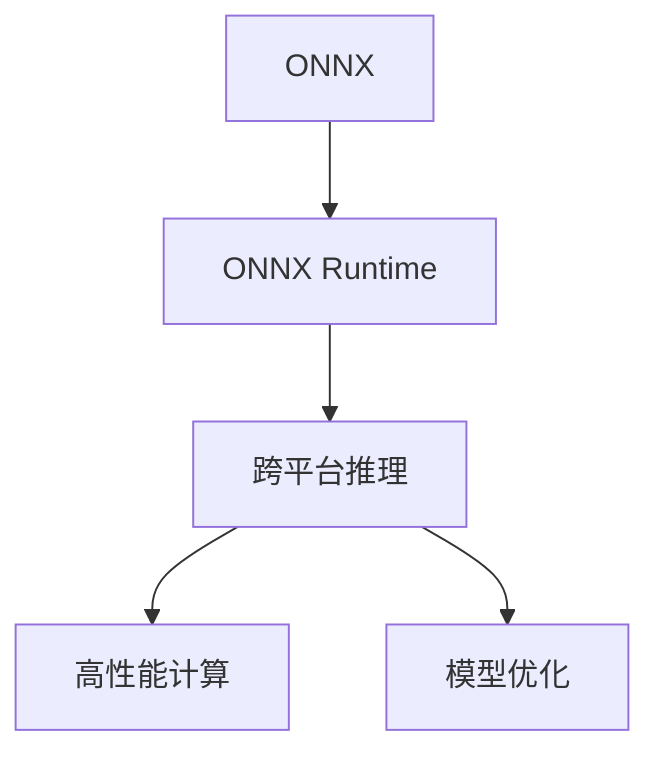

                 

# ONNX Runtime 部署：跨平台推理

> 关键词：ONNX, 跨平台推理, 高性能计算, 模型优化, 部署工具, 云计算

## 1. 背景介绍

### 1.1 问题由来
随着深度学习技术的迅速发展，模型规模和复杂度不断提升，对硬件资源的依赖也日益增长。如何在不同的硬件平台上高效地部署和推理模型，成为了一个重要的研究课题。Open Neural Network Exchange (ONNX)应运而生，其设计初衷是实现模型跨平台、跨框架的通用性。ONNX Runtime则是一个支持ONNX模型在多种硬件和操作系统上高效推理的库，是部署ONNX模型的关键组件。本文将介绍ONNX Runtime的部署与推理机制，并探讨其在跨平台、高性能计算和模型优化中的应用。

### 1.2 问题核心关键点
ONNX Runtime是一个开源的跨平台推理库，支持在CPU、GPU、移动设备等多种硬件上高效推理ONNX模型。其核心优势在于提供了一个统一的接口，使得开发者能够轻松地在不同的平台上部署和推理模型，同时支持模型的优化和调整。ONNX Runtime的目标是通过标准化的模型格式和推理引擎，实现模型的跨框架、跨平台兼容性和高性能计算。

## 2. 核心概念与联系

### 2.1 核心概念概述

为更好地理解ONNX Runtime的部署与推理机制，本节将介绍几个关键概念：

- **ONNX**：Open Neural Network Exchange，一种标准化的模型格式，旨在实现模型跨框架、跨平台的兼容性。
- **ONNX Runtime**：一个支持ONNX模型在多种硬件上高效推理的库，提供统一的接口和优化工具。
- **跨平台推理**：指模型在不同硬件和操作系统上都能高效、准确地进行推理。
- **高性能计算**：通过优化模型、算法和硬件资源，提升模型的推理速度和效率。
- **模型优化**：通过剪枝、量化、融合等手段，减少模型的大小和计算量，提升推理速度和准确性。

这些概念之间的逻辑关系可以通过以下Mermaid流程图来展示：



这个流程图展示了ONNX和ONNX Runtime如何通过跨平台推理、高性能计算和模型优化，实现模型的广泛应用。

## 3. 核心算法原理 & 具体操作步骤
### 3.1 算法原理概述

ONNX Runtime的部署与推理机制基于以下两个核心原理：

1. **模型转换**：将不同的深度学习框架模型转换成ONNX模型，使得模型能够在ONNX Runtime上进行推理。
2. **异构计算**：利用不同的硬件平台（如CPU、GPU、FPGA等）进行模型推理，提升推理效率和准确性。

ONNX Runtime的部署与推理流程如图1所示：


### 3.2 算法步骤详解

1. **模型转换**：
   - 将现有的深度学习框架模型（如TensorFlow、PyTorch、Keras等）转换成ONNX模型。可以使用ONNX的转换工具，如ONNX Converter。
   - 将转换后的ONNX模型输入到ONNX Runtime中，生成适用于目标硬件的推理图。

2. **硬件选择**：
   - 根据目标硬件平台（如CPU、GPU、FPGA等）选择合适的ONNX Runtime推理引擎。
   - 在ONNX Runtime中配置硬件资源，包括CPU核心的数量、内存大小、线程数等。

3. **推理优化**：
   - 利用ONNX Runtime提供的优化工具（如模型剪枝、量化、混合精度等），优化模型以提升推理速度和准确性。
   - 对模型进行微调，以适应特定的应用场景和数据分布。

4. **模型部署**：
   - 将优化后的模型导出为ONNX格式，并部署到目标平台上。
   - 对部署后的模型进行监控和评估，确保其性能和稳定性。

### 3.3 算法优缺点

ONNX Runtime的部署与推理机制具有以下优点：

1. **跨平台兼容性**：ONNX Runtime支持多种硬件平台和操作系统，能够在不同的设备上进行推理。
2. **高效推理**：通过优化模型和硬件资源，能够显著提升模型的推理速度和效率。
3. **模型优化灵活**：提供了丰富的模型优化工具，支持剪枝、量化、混合精度等优化手段。

同时，ONNX Runtime也存在一些缺点：

1. **转换复杂**：现有的深度学习框架模型转换为ONNX模型的过程较为复杂，需要一定的技术积累。
2. **硬件依赖**：ONNX Runtime依赖特定的硬件平台，需要根据目标设备选择合适的推理引擎。
3. **性能损耗**：模型在转换和优化过程中可能存在一定的性能损耗，需要评估和优化。

### 3.4 算法应用领域

ONNX Runtime在以下几个领域得到了广泛应用：

1. **嵌入式设备**：如智能家居、物联网等，需要在资源受限的设备上进行模型推理。
2. **云计算**：如云服务器、边缘计算等，需要高效、可靠地部署和管理模型。
3. **高性能计算**：如科学计算、图像处理等，需要快速、准确地进行模型推理。
4. **移动端应用**：如智能手机、平板等，需要在移动设备上进行模型推理。
5. **实时应用**：如自动驾驶、实时监控等，需要实时、高效的模型推理。

## 4. 数学模型和公式 & 详细讲解 & 举例说明

### 4.1 数学模型构建

ONNX Runtime的部署与推理机制基于图神经网络（Graph Neural Network, GNN）的框架。在ONNX Runtime中，模型的推理过程被表示为一个有向无环图（DAG），图中的节点代表模型中的操作，边代表数据流向。图1展示了ONNX Runtime中模型推理的数学模型：

```math
G = (V, E)
```

其中，$V$表示图中的节点，$E$表示边。每个节点$v_i$代表模型中的一个操作，$E$表示操作之间的数据流向。

### 4.2 公式推导过程

ONNX Runtime的推理过程包括两个主要步骤：模型转换和推理计算。以下将详细推导这两个步骤的公式。

1. **模型转换**：
   - 将深度学习框架模型转换为ONNX模型，生成ONNX图。
   - 将ONNX图转换为ONNX Runtime可执行的推理图。

2. **推理计算**：
   - 根据推理图进行推理计算，得到模型的输出结果。

### 4.3 案例分析与讲解

以TensorFlow模型转换为ONNX模型的过程为例，进行详细分析。

1. **模型转换**：
   - 使用ONNX Converter将TensorFlow模型转换为ONNX模型。
   - 将转换后的ONNX模型输入到ONNX Runtime中，生成适用于目标硬件的推理图。

2. **推理计算**：
   - 在ONNX Runtime中配置硬件资源，选择合适的推理引擎。
   - 对模型进行优化和调整，确保其性能和准确性。
   - 将优化后的模型部署到目标平台上，进行实时推理计算。

## 5. 项目实践：代码实例和详细解释说明
### 5.1 开发环境搭建

在进行ONNX Runtime部署实践前，我们需要准备好开发环境。以下是使用Python进行ONNX Runtime开发的环境配置流程：

1. 安装Anaconda：从官网下载并安装Anaconda，用于创建独立的Python环境。

2. 创建并激活虚拟环境：
```bash
conda create -n onnx-env python=3.8 
conda activate onnx-env
```

3. 安装ONNX Runtime：根据CUDA版本，从官网获取对应的安装命令。例如：
```bash
conda install onnxruntime onnxruntime-gpu onnxruntime-cpu -c conda-forge
```

4. 安装各类工具包：
```bash
pip install numpy pandas scikit-learn matplotlib tqdm jupyter notebook ipython
```

完成上述步骤后，即可在`onnx-env`环境中开始ONNX Runtime的部署实践。

### 5.2 源代码详细实现

以下是一个使用ONNX Runtime在CPU上进行推理的Python代码实现：

```python
import onnxruntime as ort
import numpy as np

# 加载模型
session = ort.InferenceSession("path/to/model.onnx")

# 创建输入
input_name = session.get_inputs()[0].name
input_data = np.random.rand(1, 28, 28).astype(np.float32)
input_data = input_data.reshape(1, 28, 28, 1)

# 执行推理
output_name = session.get_outputs()[0].name
output_data = session.run([output_name], {input_name: input_data})

# 输出结果
print(output_data[0])
```

### 5.3 代码解读与分析

让我们再详细解读一下关键代码的实现细节：

**Session类**：
- `InferenceSession`类：用于加载和推理ONNX模型。在创建`InferenceSession`对象时，需要指定模型的路径。
- `get_inputs`和`get_outputs`方法：用于获取模型的输入和输出信息。
- `run`方法：执行推理计算，返回模型的输出结果。

**input_name和output_name**：
- `input_name`：模型的输入名称，在模型定义时指定。
- `output_name`：模型的输出名称，在模型定义时指定。

**输入数据准备**：
- 创建随机数生成器，生成28x28的图像数据。
- 将输入数据转换为模型期望的格式，包括形状和数据类型。

**执行推理**：
- 使用`run`方法执行推理计算，将输入数据传入模型，得到输出结果。
- 输出结果的维度根据模型定义，可能是一个标量、向量或矩阵。

## 6. 实际应用场景
### 6.1 智能家居系统

智能家居系统需要实时响应用户的指令，对家庭设备进行控制和监控。基于ONNX Runtime的跨平台推理技术，可以将深度学习模型部署在各种嵌入式设备上，实现模型的高效推理。

在技术实现上，可以收集用户的行为数据，训练一个深度学习模型，用于语音识别和指令理解。将训练好的模型转换为ONNX格式，并部署到智能家居设备上，实时推理用户的语音指令，控制家中的智能设备。

### 6.2 边缘计算

边缘计算是一种将数据处理和推理任务从中心服务器迁移到边缘设备的计算方式，以减少延迟和带宽开销。基于ONNX Runtime的跨平台推理技术，可以实现模型在边缘设备上的高效部署和推理。

在技术实现上，可以将深度学习模型转换为ONNX格式，并部署到边缘设备上。例如，将视频流数据在边缘设备上进行推理，实时检测和识别物体，反馈到中心服务器进行进一步处理。

### 6.3 实时图像处理

实时图像处理需要对摄像头采集的图像数据进行实时处理和推理，例如人脸识别、行为分析等。基于ONNX Runtime的跨平台推理技术，可以将深度学习模型部署在嵌入式设备或云服务器上，实现模型的实时推理。

在技术实现上，可以使用ONNX Runtime对深度学习模型进行推理优化，生成高效的推理图。将优化后的模型部署到目标设备上，实时处理和推理图像数据，进行人脸识别、行为分析等任务。

### 6.4 未来应用展望

随着ONNX Runtime的不断发展，基于跨平台推理技术的应用场景将不断拓展，为物联网、智能家居、实时监控等领域的智能化升级提供新的技术手段。未来，ONNX Runtime将支持更多硬件平台和深度学习框架，推动跨平台计算和推理技术的普及应用。

## 7. 工具和资源推荐
### 7.1 学习资源推荐

为了帮助开发者系统掌握ONNX Runtime的部署与推理技术，这里推荐一些优质的学习资源：

1. ONNX官方文档：详细介绍了ONNX Runtime的安装、配置和使用方法，是入门必备资料。
2. ONNX Runtime社区：提供丰富的示例代码和社区支持，助力开发者快速上手。
3. PyTorch官方文档：PyTorch深度学习框架的官方文档，提供了将PyTorch模型转换为ONNX模型的教程。
4. TensorFlow官方文档：TensorFlow深度学习框架的官方文档，提供了将TensorFlow模型转换为ONNX模型的教程。
5. HuggingFace官方文档：HuggingFace深度学习框架的官方文档，提供了将HuggingFace模型转换为ONNX模型的教程。

通过对这些资源的学习实践，相信你一定能够快速掌握ONNX Runtime的部署与推理技术，并用于解决实际的NLP问题。

### 7.2 开发工具推荐

高效的开发离不开优秀的工具支持。以下是几款用于ONNX Runtime开发和推理的常用工具：

1. PyTorch：基于Python的开源深度学习框架，提供了将PyTorch模型转换为ONNX模型的工具。
2. TensorFlow：由Google主导开发的开源深度学习框架，支持将TensorFlow模型转换为ONNX模型的工具。
3. HuggingFace：提供了多种预训练模型和转换工具，方便开发者快速部署和推理。
4. ONNX Converter：用于将深度学习框架模型转换为ONNX模型的开源工具。
5. ONNX Runtime社区：提供了丰富的示例代码和社区支持，助力开发者快速上手。

合理利用这些工具，可以显著提升ONNX Runtime的开发效率，加快创新迭代的步伐。

### 7.3 相关论文推荐

ONNX Runtime的发展源于学界的持续研究。以下是几篇奠基性的相关论文，推荐阅读：

1. ONNX: A Uniform Model-Representing Format for Machine Learning: This paper introduces ONNX, a standardized format for machine learning models that enables model interchangeability and compatibility across different deep learning frameworks.
2. ONNX Runtime: A Cross-Platform Optimized Deep Learning Inference Library: This paper introduces ONNX Runtime, a cross-platform optimized deep learning inference library that supports ONNX models on various hardware accelerators.
3. ONNX Compiler for PyTorch: This paper presents the ONNX Compiler for PyTorch, a tool that converts PyTorch models into ONNX format for efficient inference.
4. Efficient Model Conversion: This paper explores efficient model conversion techniques for deep learning frameworks, including the use of ONNX as an intermediate representation.
5. Cross-Platform Deep Learning Inference: This paper discusses cross-platform deep learning inference techniques, including the use of ONNX for model exchange and optimization.

这些论文代表了大语言模型微调技术的发展脉络。通过学习这些前沿成果，可以帮助研究者把握学科前进方向，激发更多的创新灵感。

## 8. 总结：未来发展趋势与挑战

### 8.1 总结

本文对ONNX Runtime的部署与推理机制进行了全面系统的介绍。首先阐述了ONNX Runtime在跨平台推理中的核心优势和应用场景，明确了其在模型转换、硬件选择、推理优化等方面的关键步骤。其次，从原理到实践，详细讲解了ONNX Runtime的数学模型和核心算法，给出了模型转换和推理计算的具体实现代码。同时，本文还探讨了ONNX Runtime在智能家居、边缘计算、实时图像处理等多个领域的应用前景，展示了跨平台推理技术的广阔应用空间。

通过对ONNX Runtime的学习和实践，开发者能够更好地掌握跨平台推理技术，并将其应用于实际的NLP问题中。未来，伴随着ONNX Runtime的持续优化和升级，相信其在跨平台计算和推理领域将发挥更加重要的作用，推动人工智能技术的广泛应用。

### 8.2 未来发展趋势

展望未来，ONNX Runtime在以下几个方面将呈现新的发展趋势：

1. **模型转换自动化**：未来的模型转换工具将更加智能化，能够自动分析模型结构和算法特点，生成优化的ONNX模型。
2. **跨框架兼容性**：未来的ONNX Runtime将支持更多深度学习框架和模型，实现跨框架的模型互操作。
3. **硬件优化**：未来的ONNX Runtime将支持更多硬件平台和加速器，提供更加高效的推理引擎。
4. **推理优化**：未来的ONNX Runtime将提供更多的优化工具，如剪枝、量化、混合精度等，提升模型的推理速度和准确性。
5. **边缘计算支持**：未来的ONNX Runtime将更加支持边缘计算和物联网设备，提供轻量级的推理引擎和资源管理工具。
6. **实时推理**：未来的ONNX Runtime将支持更多实时推理应用，如视频流处理、自动驾驶等，提供低延迟、高吞吐的推理引擎。

以上趋势凸显了ONNX Runtime在跨平台计算和推理领域的发展潜力。这些方向的探索发展，将进一步提升ONNX Runtime的性能和应用范围，推动人工智能技术的普及应用。

### 8.3 面临的挑战

尽管ONNX Runtime在跨平台推理领域取得了显著进展，但在迈向更加智能化、普适化应用的过程中，仍面临诸多挑战：

1. **模型转换复杂性**：现有的深度学习框架模型转换为ONNX模型的过程较为复杂，需要一定的技术积累。
2. **硬件依赖**：ONNX Runtime依赖特定的硬件平台，需要根据目标设备选择合适的推理引擎。
3. **性能损耗**：模型在转换和优化过程中可能存在一定的性能损耗，需要评估和优化。
4. **推理效率**：现有的ONNX Runtime推理引擎可能无法满足高性能计算和大规模数据处理的需求。
5. **资源管理**：在边缘计算和嵌入式设备上，ONNX Runtime需要更加灵活的资源管理和调度策略。
6. **安全性**：在部署和推理过程中，需要确保模型的安全性，避免数据泄露和模型被篡改。

这些挑战凸显了ONNX Runtime在跨平台计算和推理领域的复杂性，需要进一步优化和改进。

### 8.4 研究展望

面对ONNX Runtime在跨平台计算和推理领域所面临的诸多挑战，未来的研究需要在以下几个方面寻求新的突破：

1. **自动化模型转换**：研究自动化的模型转换工具，降低开发者对技术积累的依赖，提升转换效率。
2. **跨框架兼容性**：开发跨框架的模型转换和推理引擎，支持更多深度学习框架和模型。
3. **硬件优化**：研究硬件加速技术，如GPU、FPGA、ASIC等，提供更加高效的推理引擎。
4. **推理优化**：研究优化算法和工具，如剪枝、量化、混合精度等，提升模型的推理速度和准确性。
5. **边缘计算支持**：研究边缘计算的资源管理和调度策略，提供轻量级的推理引擎和资源管理工具。
6. **实时推理**：研究实时推理算法和工具，支持更多的实时推理应用。

这些研究方向的探索，将推动ONNX Runtime在跨平台计算和推理领域的进一步发展，为人工智能技术的普及应用提供新的技术手段。

## 9. 附录：常见问题与解答

**Q1：什么是ONNX Runtime？**

A: ONNX Runtime是一个支持ONNX模型在多种硬件上高效推理的库，提供统一的接口和优化工具。它支持CPU、GPU、移动设备等多种硬件平台，能够实现跨平台的模型推理。

**Q2：如何将深度学习框架模型转换为ONNX模型？**

A: 可以使用ONNX Converter工具将深度学习框架模型转换为ONNX模型。具体步骤包括：
1. 在深度学习框架中训练模型。
2. 使用ONNX Converter将训练好的模型转换为ONNX格式。
3. 将转换后的ONNX模型输入到ONNX Runtime中，生成适用于目标硬件的推理图。

**Q3：ONNX Runtime支持哪些硬件平台？**

A: ONNX Runtime支持多种硬件平台，包括CPU、GPU、FPGA等。需要根据目标设备选择合适的推理引擎。

**Q4：如何在ONNX Runtime中进行模型优化？**

A: 在ONNX Runtime中，可以使用多种优化工具，如剪枝、量化、混合精度等，提升模型的推理速度和准确性。具体步骤包括：
1. 加载模型。
2. 创建优化后的推理图。
3. 配置硬件资源，选择合适的推理引擎。
4. 执行推理计算，得到优化后的模型输出。

**Q5：ONNX Runtime的部署和推理流程是怎样的？**

A: 使用ONNX Runtime进行模型部署和推理的流程如下：
1. 模型转换：将深度学习框架模型转换为ONNX模型。
2. 硬件选择：根据目标硬件平台选择合适的ONNX Runtime推理引擎。
3. 推理优化：使用ONNX Runtime提供的优化工具，优化模型以提升推理速度和准确性。
4. 模型部署：将优化后的模型导出为ONNX格式，并部署到目标平台上。
5. 模型推理：在目标平台上执行推理计算，得到模型的输出结果。

通过本文的系统梳理，可以看到，ONNX Runtime在跨平台计算和推理领域具有广泛的应用前景，其部署与推理机制能够显著提升深度学习模型的性能和应用范围。未来，伴随着ONNX Runtime的持续优化和升级，相信其在跨平台计算和推理领域将发挥更加重要的作用，推动人工智能技术的广泛应用。

