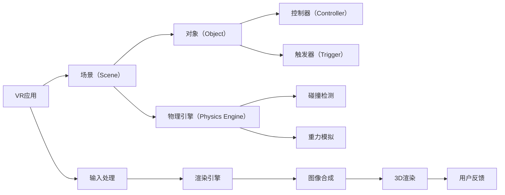

                 

# Oculus Rift SDK：在 Rift 平台上开发 VR 体验

## 1. 背景介绍

### 1.1 问题由来
Oculus Rift是市场上最受欢迎的虚拟现实设备之一，其SDK提供了一整套工具和库，使得开发者能够快速、高效地构建VR应用程序。然而，对于初学者和中级开发者来说，学习如何在Oculus Rift平台上开发VR应用可能是一项挑战。本文将详细讲解如何使用Oculus Rift SDK，并提供一个完整的项目示例，以帮助读者掌握在Oculus Rift平台上开发VR应用的关键技术和步骤。

## 2. 核心概念与联系

### 2.1 核心概念概述

为了更好地理解如何在Oculus Rift平台上开发VR应用，首先需要了解以下核心概念：

- Oculus Rift SDK：Oculus提供的开发工具包，包括用于编写、测试、优化VR应用的库和工具。
- VR应用：使用VR设备，如Oculus Rift，提供沉浸式体验的应用程序。
- 场景（Scene）：VR应用的核心概念，用于组织和管理3D场景中的对象。
- 对象（Object）：场景中的基本单元，如人物、环境、物品等。
- 控制器（Controller）：用于控制VR应用中对象的手动操作设备，如Oculus Touch控制器。
- 触发器（Trigger）：一个按钮，用于检测用户与3D对象的交互。
- 物理引擎（Physics Engine）：用于模拟和处理物理交互，如碰撞、重力等。

### 2.2 核心概念原理和架构的 Mermaid 流程图



## 3. 核心算法原理 & 具体操作步骤

### 3.1 算法原理概述
Oculus Rift SDK利用OpenXR API作为VR应用程序的标准接口。OpenXR API定义了VR应用与设备之间的交互，包括空间追踪、物理渲染、输入输出等。开发者可以使用Oculus Rift SDK提供的库和工具，如OXRister、OXR stiffnessController等，来实现VR应用的开发。

### 3.2 算法步骤详解
以下是在Oculus Rift平台上开发VR应用的关键步骤：

**Step 1: 准备开发环境**

1. 安装Oculus Rift SDK，访问Oculus官方页面下载SDK并安装。
2. 确保Oculus Rift设备已连接至计算机，并配置好必要的软件和驱动程序。

**Step 2: 创建并配置VR应用**

1. 使用Unity或Unreal Engine等游戏引擎创建VR项目。
2. 配置场景（Scene）、对象（Object）、控制器（Controller）、触发器（Trigger）等组件。
3. 使用物理引擎（Physics Engine）模拟物理交互。

**Step 3: 实现输入输出处理**

1. 在Unity或Unreal Engine中，使用OXRister类来实现空间追踪。
2. 实现控制器（Controller）和触发器（Trigger）的输入处理逻辑。
3. 使用OXR stiffnessController类实现控制器与虚拟对象的交互。

**Step 4: 渲染和优化**

1. 配置渲染引擎（Rendering Engine），设置相机（Camera）、光源（Light）、材质（Material）等。
2. 实现3D渲染（3D Rendering）和图像合成（Image Composition）。
3. 优化渲染性能，减少延迟和丢帧。

**Step 5: 集成用户反馈**

1. 使用用户反馈（User Feedback）组件来接收用户的输入和交互。
2. 根据用户反馈动态调整3D场景和对象。

**Step 6: 测试和发布**

1. 在Oculus Rift设备上测试VR应用，调试并优化性能。
2. 发布VR应用至Oculus Store，供用户下载和使用。

### 3.3 算法优缺点
Oculus Rift SDK提供了一整套完整的开发工具，使得开发者能够快速、高效地构建VR应用。然而，也存在以下缺点：

**优点：**
- 提供了丰富的API和工具，易于上手。
- 支持多种游戏引擎和平台。
- 社区活跃，有大量资源和案例可参考。

**缺点：**
- 学习曲线较陡峭，需要掌握Oculus Rift SDK的特定API。
- 对计算机性能要求较高，需要强大的硬件支持。
- 需要保持更新，以支持最新的Oculus Rift设备和SDK版本。

### 3.4 算法应用领域

Oculus Rift SDK主要用于以下领域：

- 游戏开发：创建沉浸式、交互式的游戏体验。
- 教育培训：开发VR教育应用，如虚拟教室、虚拟实验室等。
- 医疗健康：实现虚拟现实手术模拟、心理治疗等应用。
- 虚拟旅游：创建虚拟旅游场景，让用户沉浸在各种旅游目的地中。
- 商业应用：开发虚拟会议室、虚拟培训课程等商业应用。

## 4. 数学模型和公式 & 详细讲解 & 举例说明

### 4.1 数学模型构建

在Oculus Rift平台上开发VR应用，需要构建一个3D场景（Scene），其中包含多个对象（Object）。每个对象都有位置（Position）、方向（Orientation）、大小（Size）等属性。使用OpenXR API，可以追踪对象的位置和方向，从而实现空间交互。

### 4.2 公式推导过程

以下是一些常用的公式和算法，用于实现Oculus Rift平台上的VR应用：

1. **空间追踪算法**：
   $$
   \text{Position} = \text{CurrentPosition} + \DeltaPosition
   $$
   $$
   \text{Orientation} = \text{CurrentOrientation} \times \text{DeltaOrientation}
   $$

2. **碰撞检测算法**：
   $$
   \text{CollisionDetection}(\text{Object}_1, \text{Object}_2)
   $$
   判断两个对象是否有碰撞，并计算碰撞点的位置和方向。

3. **物理模拟算法**：
   $$
   \text{Simulation}(\text{Object}, \text{Gravity}, \text{Collisions})
   $$
   模拟物体在重力作用下，以及与其他物体的碰撞后的运动状态。

### 4.3 案例分析与讲解

以一个简单的VR应用程序为例，分析如何使用Oculus Rift SDK实现3D场景和对象的控制。

**场景（Scene）**：
```csharp
using UnityEngine;
using Oculus.Rift;
using Oculus.Interaction;

public class SceneController : MonoBehaviour
{
    public GameObject[] objects;
    public GameObject player;
    private XRController controller;

    void Start()
    {
        controller = GetComponent<XRController>();
    }

    void Update()
    {
        foreach (XRController controller in controllers)
        {
            // 空间追踪
            controller.poseChanged += (PoseChangedEventArgs) => {
                Vector3 position = new Vector3(controller.pose.position.x, controller.pose.position.y, controller.pose.position.z);
                Quaternion orientation = new Quaternion(controller.pose.rotation.x, controller.pose.rotation.y, controller.pose.rotation.z, controller.pose.rotation.w);
                // 更新对象位置和方向
                foreach (GameObject obj in objects)
                {
                    obj.transform.position = position;
                    obj.transform.rotation = orientation;
                }
            };
        }
    }
}
```

**对象（Object）**：
```csharp
using UnityEngine;
using Oculus.Rift;

public class ObjectController : MonoBehaviour
{
    public GameObject[] colliders;

    void Update()
    {
        // 碰撞检测
        foreach (Rigidbody rb in colliders)
        {
            if (rb.IsTrigger && rb.IsCollision(rb.transform.position))
            {
                rb.AddForce(Physics.gravity, ForceMode.Force);
            }
        }
    }
}
```

## 5. 项目实践：代码实例和详细解释说明

### 5.1 开发环境搭建

1. 下载并安装Unity或Unreal Engine等游戏引擎。
2. 安装Oculus Rift SDK，并确保设备已连接至计算机。
3. 配置必要的软件和驱动程序。

### 5.2 源代码详细实现

以下是一个简单的Unity项目示例，展示如何使用Oculus Rift SDK实现空间追踪和对象控制：

**场景（Scene）**：
```csharp
using UnityEngine;
using Oculus.Rift;
using Oculus.Interaction;

public class SceneController : MonoBehaviour
{
    public GameObject[] objects;
    public GameObject player;
    private XRController controller;

    void Start()
    {
        controller = GetComponent<XRController>();
    }

    void Update()
    {
        foreach (XRController controller in controllers)
        {
            // 空间追踪
            controller.poseChanged += (PoseChangedEventArgs) => {
                Vector3 position = new Vector3(controller.pose.position.x, controller.pose.position.y, controller.pose.position.z);
                Quaternion orientation = new Quaternion(controller.pose.rotation.x, controller.pose.rotation.y, controller.pose.rotation.z, controller.pose.rotation.w);
                // 更新对象位置和方向
                foreach (GameObject obj in objects)
                {
                    obj.transform.position = position;
                    obj.transform.rotation = orientation;
                }
            };
        }
    }
}
```

**对象（Object）**：
```csharp
using UnityEngine;
using Oculus.Rift;

public class ObjectController : MonoBehaviour
{
    public GameObject[] colliders;

    void Update()
    {
        // 碰撞检测
        foreach (Rigidbody rb in colliders)
        {
            if (rb.IsTrigger && rb.IsCollision(rb.transform.position))
            {
                rb.AddForce(Physics.gravity, ForceMode.Force);
            }
        }
    }
}
```

### 5.3 代码解读与分析

**场景控制器（SceneController）**：
- 获取所有需要控制的对象和控制器。
- 在Update循环中，根据控制器的位置和方向，更新所有对象的位置和方向。

**对象控制器（ObjectController）**：
- 获取所有需要碰撞检测的碰撞器。
- 在Update循环中，检测每个碰撞器是否与其他对象碰撞，如果是，则施加重力作用。

### 5.4 运行结果展示

在Oculus Rift设备上运行上述代码，将看到一个包含多个对象和控制器的3D场景。通过控制器，用户可以自由移动和旋转场景中的对象，并观察重力作用下的物理效果。

## 6. 实际应用场景

### 6.4 未来应用展望

随着VR技术的不断进步，Oculus Rift平台上的VR应用将拥有更广阔的前景。以下是在Oculus Rift平台上开发VR应用的未来应用展望：

**虚拟旅游**：
- 创建逼真的虚拟旅游场景，让用户沉浸在各种旅游目的地中。
- 通过VR应用，用户可以实时探索和互动，增强旅游体验。

**虚拟培训**：
- 开发虚拟现实培训课程，如虚拟手术训练、虚拟飞行模拟等。
- 通过VR应用，用户可以在安全的环境中反复练习和体验，提高技能水平。

**虚拟办公室**：
- 创建虚拟办公室环境，用于远程协作和团队会议。
- 通过VR应用，用户可以身临其境地进行视频会议、讨论和协作。

**虚拟博物馆**：
- 构建虚拟博物馆，展示历史文物和艺术作品。
- 通过VR应用，用户可以自由探索和互动，获得更深入的学习体验。

**虚拟医疗**：
- 开发虚拟现实医疗应用，如虚拟手术模拟、心理治疗等。
- 通过VR应用，医生和患者可以虚拟地进行手术和治疗，提升医疗水平。

## 7. 工具和资源推荐

### 7.1 学习资源推荐

为了帮助开发者快速上手Oculus Rift SDK，以下是一些优质的学习资源：

1. **Oculus官方文档**：
   - 访问Oculus官方网站，获取详细的SDK文档和教程。
   - 包括VR应用开发指南、OpenXR API参考、控制器和触发器使用指南等。

2. **Unity官方教程**：
   - 访问Unity官方网站，获取VR应用开发教程。
   - 包括场景、对象、控制器、碰撞检测等基础知识。

3. **Unreal Engine官方文档**：
   - 访问Unreal Engine官方网站，获取VR应用开发教程。
   - 包括场景、对象、控制器、物理引擎等基础知识。

4. **Oculus Developer论坛**：
   - 访问Oculus Developer论坛，获取开发者的经验和建议。
   - 包括SDK问题、代码示例、开发技巧等。

5. **VR开发博客**：
   - 访问VR开发博客，获取最新的VR应用开发案例和技巧。
   - 包括Unity、Unreal Engine等工具的使用技巧、最佳实践等。

### 7.2 开发工具推荐

以下是几款用于Oculus Rift SDK开发的常用工具：

1. **Unity**：
   - 功能强大的游戏引擎，支持VR应用开发。
   - 提供丰富的3D渲染、物理模拟、输入处理等功能。

2. **Unreal Engine**：
   - 流行的游戏引擎，支持VR应用开发。
   - 提供高效的物理引擎、粒子系统、输入处理等功能。

3. **Oculus Rift SDK**：
   - Oculus官方提供的SDK，用于开发VR应用。
   - 提供空间追踪、控制器、触发器等功能。

4. **XRister**：
   - Oculus官方提供的空间追踪库，用于实现空间交互。

5. **XRFCon****troller**：
   - Oculus官方提供的控制器库，用于实现控制器和触发器的输入处理。

### 7.3 相关论文推荐

以下是几篇关于Oculus Rift SDK和VR应用开发的经典论文，推荐阅读：

1. **"Understanding User Interface Interactions in Augmented Reality and Virtual Reality"**：
   - 讨论了虚拟现实用户界面的交互设计，如何提升用户体验。
   - 提出了一系列交互设计原则和最佳实践。

2. **"Real-Time Physics Simulation on the Oculus Rift Platform"**：
   - 介绍了在Oculus Rift平台上的物理模拟技术。
   - 提出了一种高效的物理引擎实现方法。

3. **"Development and Deployment of Virtual Reality Training Applications for Surgeons"**：
   - 讨论了虚拟现实手术培训应用的设计和实现。
   - 介绍了虚拟现实培训系统在医疗领域的应用案例。

4. **"An Efficient Implementation of Real-Time Adaptive Bitrate Video Transmission for VR Applications"**：
   - 介绍了VR应用中的高效视频传输技术。
   - 提出了一种自适应比特率的视频传输方法。

5. **"Designing User Interfaces for Immersive Environments"**：
   - 讨论了虚拟现实环境中的用户界面设计。
   - 提出了一系列界面设计原则和交互设计方案。

这些论文代表了VR应用开发的前沿研究成果，通过阅读这些论文，可以深入了解Oculus Rift SDK和VR应用开发的技术细节和最佳实践。

## 8. 总结：未来发展趋势与挑战

### 8.1 总结

本文详细讲解了如何使用Oculus Rift SDK在Rift平台上开发VR应用，并提供了完整的项目示例。通过介绍VR应用开发的关键技术和步骤，帮助读者掌握Oculus Rift SDK的使用方法，从而能够快速、高效地构建VR应用程序。

### 8.2 未来发展趋势

未来，VR技术将继续快速发展，Oculus Rift平台上的VR应用将拥有更广阔的前景。以下是一些未来发展趋势：

**1. 更加沉浸的体验**：
- VR设备将更加轻便、便携，提升用户体验。
- 通过更好的图像渲染、音效设计、交互设计，提升沉浸感。

**2. 更加丰富的应用场景**：
- 虚拟旅游、虚拟培训、虚拟办公室等场景将更加丰富。
- 更多的行业和企业将利用VR技术进行创新和升级。

**3. 更加智能的交互**：
- 自然语言处理、手势识别等技术将提升人机交互的自然性和智能化。
- 虚拟助手、虚拟代理等将更加智能和可靠。

**4. 更加安全和健康的应用**：
- VR设备将更加注重用户健康，避免长时间使用带来的不适。
- 通过虚拟现实技术，为用户提供更加安全和健康的生活和工作环境。

### 8.3 面临的挑战

尽管Oculus Rift平台上的VR应用开发前景广阔，但也面临以下挑战：

**1. 高性能设备的成本**：
- 高质量的VR设备往往价格较高，限制了部分用户的使用。
- 高性能设备的维护和保养成本较高。

**2. 技术门槛较高**：
- 开发VR应用需要掌握多项技术和工具，如Unity、Unreal Engine、Oculus Rift SDK等。
- 技术门槛较高，新手入门困难。

**3. 内容资源有限**：
- VR应用开发需要高质量的内容资源，如场景、对象、材质等。
- 内容资源的获取和创作成本较高。

**4. 用户体验不一致**：
- 不同设备、不同用户群体对VR体验的期望不一致。
- 如何提升不同设备的用户体验，仍需进一步研究和优化。

**5. 网络延迟和带宽问题**：
- VR应用通常需要高质量的图像和音频传输，对网络带宽和延迟要求较高。
- 如何优化网络传输，减少延迟和丢帧，仍需进一步研究。

### 8.4 研究展望

面向未来，Oculus Rift平台上的VR应用开发将面临更多的挑战和机遇。以下是一些研究方向和突破方向：

**1. 低延迟传输技术**：
- 开发高效的网络传输协议，减少延迟和丢帧。
- 采用边缘计算、本地渲染等技术，提升传输效率。

**2. 高质量内容创作**：
- 开发高质量的VR内容创作工具，降低内容创作的难度和成本。
- 引入云计算、协作创作等技术，提升内容创作的效率和质量。

**3. 智能交互技术**：
- 引入自然语言处理、手势识别等技术，提升人机交互的自然性和智能化。
- 开发智能虚拟助手、虚拟代理等，提升用户体验。

**4. 健康和安全技术**：
- 引入健康监测、运动跟踪等技术，提升用户的健康和安全。
- 开发虚拟现实环境中的健康和安全指导，保障用户健康。

**5. 多平台互通技术**：
- 开发跨平台互通技术，提升不同设备间的互通性和兼容性。
- 引入虚拟现实技术的标准化和规范化，促进跨平台应用的发展。

总之，未来VR技术将在更多的领域和应用中发挥重要作用，Oculus Rift平台上的VR应用开发将面临更多的机遇和挑战。通过不断探索和创新，相信VR技术将进一步推动人类的认知智能和交互方式的进步。

---

作者：禅与计算机程序设计艺术 / Zen and the Art of Computer Programming

