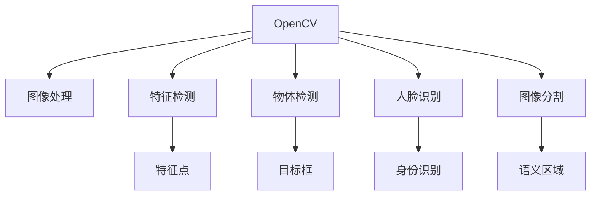

                 

# OpenCV计算机视觉：图像处理和机器视觉实践

> 关键词：OpenCV, 图像处理, 机器视觉, 深度学习, 计算机视觉, 特征检测, 物体检测, 人脸识别, 图像分割, 实时应用

## 1. 背景介绍

### 1.1 问题由来

随着计算机视觉技术的快速发展，OpenCV（Open Source Computer Vision Library）作为开源计算机视觉库，因其功能丰富、性能优秀、易用性高，逐渐成为计算机视觉研究与开发的标配工具。OpenCV在图像处理、特征检测、目标识别、物体跟踪等领域提供了强大的算法支持和丰富的工具集，广泛应用于机器人视觉、智能监控、医学影像分析、增强现实等众多领域。

### 1.2 问题核心关键点

OpenCV的核心优势在于其高效、易用的编程接口，以及强大的算法支持库。OpenCV支持C++、Python等多种编程语言，提供了从基础图像处理到复杂计算机视觉任务的完备工具链。其高效的底层实现和优化的算法引擎使得OpenCV在图像处理速度上具有显著优势，同时兼容主流深度学习框架，如TensorFlow、PyTorch等，能够无缝集成深度学习模型，提供端到端解决方案。

OpenCV的主要应用场景包括：

- 图像处理：如图像滤波、边缘检测、形态学操作等。
- 特征检测：如SIFT、SURF、ORB等。
- 物体检测：如Haar、HOG、Faster R-CNN、YOLO等。
- 人脸识别：如Eigenfaces、LBP等。
- 图像分割：如GrabCut、基于深度学习的分割方法等。

### 1.3 问题研究意义

掌握OpenCV库不仅有助于快速开发计算机视觉应用，还能深入理解图像处理和计算机视觉的基本原理。OpenCV丰富的算法支持库和易用的编程接口，使得开发者能够专注于算法设计和模型优化，降低技术入门的门槛，缩短产品开发周期。

## 2. 核心概念与联系

### 2.1 核心概念概述

- **OpenCV库**：一个开源计算机视觉库，支持多种编程语言，提供从图像处理到计算机视觉的完备工具链。
- **图像处理**：对数字图像进行增强、滤波、变换、分割等操作，提高图像质量和可用性。
- **特征检测**：从图像中提取具有唯一性和稳定性的特征点，用于物体匹配、跟踪、识别等。
- **物体检测**：在图像中定位并识别目标物体，广泛应用于目标识别、行为分析等领域。
- **人脸识别**：通过图像或视频中的人脸特征，识别身份信息，是生物识别的重要组成部分。
- **图像分割**：将图像分为多个具有语义意义的区域，为图像理解和分析提供基础。

这些概念相互联系，共同构成了计算机视觉的基石。图像处理为特征检测和物体检测提供基础，特征检测和物体检测是人脸识别和图像分割的前提。通过OpenCV，开发者可以轻松地集成这些技术，构建功能强大的计算机视觉应用。

### 2.2 核心概念原理和架构的 Mermaid 流程图



这个流程图展示了OpenCV核心概念之间的联系：

1. 通过OpenCV库提供的函数和算法，可以进行图像处理操作。
2. 图像处理后的图像可以用于特征检测，提取特征点。
3. 特征点可以用于物体检测，定位并识别物体。
4. 物体检测结果可以用于人脸识别，识别人脸身份。
5. 物体检测结果也可以用于图像分割，将图像分为具有语义意义的区域。

## 3. 核心算法原理 & 具体操作步骤

### 3.1 算法原理概述

OpenCV库提供了丰富的图像处理和计算机视觉算法，以下是几个核心算法的原理概述：

- **Canny边缘检测**：通过计算图像梯度，检测出图像中的边缘信息。
- **HOG特征检测**：通过计算图像的梯度方向直方图，提取物体的轮廓特征。
- **Haar特征检测**：基于Haar小波变换，检测出物体的形状和位置特征。
- **SIFT特征检测**：通过尺度不变特征变换，检测出图像中的局部特征点。
- **深度学习物体检测**：使用卷积神经网络（CNN）等深度学习模型，检测并定位图像中的物体。

### 3.2 算法步骤详解

这里以Canny边缘检测为例，详细讲解其具体操作步骤：

1. **预处理图像**：对输入图像进行灰度化、高斯滤波等预处理，减少噪声干扰。
2. **计算梯度**：对预处理后的图像计算水平和垂直方向的梯度，得到梯度幅值和方向。
3. **非极大值抑制（Non-Maximum Suppression, NMS）**：对梯度幅值和方向进行NMS操作，抑制梯度峰值周围的非极大值。
4. **双阈值筛选**：设定高阈值和高阈值，将梯度峰值分为强边缘和弱边缘，保留强边缘。
5. **边缘连接**：将弱边缘与强边缘连接，形成连续的边缘线。

通过上述步骤，可以有效地检测出图像中的边缘信息。

### 3.3 算法优缺点

Canny边缘检测的优点包括：

- **鲁棒性好**：对噪声不敏感，边缘检测结果稳定可靠。
- **精度高**：通过非极大值抑制和双阈值筛选，可以提取出准确的边缘信息。
- **适用范围广**：适用于各种类型的图像，适用于各种光照和视角。

Canny边缘检测的缺点包括：

- **计算量大**：需要计算梯度、非极大值抑制、双阈值筛选等操作，计算量较大。
- **参数选择复杂**：需要选择合适的梯度滤波器、双阈值等参数，参数选择不当会影响边缘检测效果。

### 3.4 算法应用领域

Canny边缘检测在计算机视觉中有着广泛的应用，例如：

- **物体检测和识别**：通过边缘检测，定位物体的轮廓，实现物体检测和识别。
- **机器人导航**：在机器人视觉系统中，边缘检测用于导航和障碍物检测。
- **图像处理**：用于图像分割、特征提取等，是图像处理的重要基础。
- **医学影像分析**：用于医学影像的边缘检测，提取病灶边缘，辅助诊断。
- **视频处理**：用于视频帧的特征提取，实现视频跟踪和分析。

## 4. 数学模型和公式 & 详细讲解 & 举例说明

### 4.1 数学模型构建

OpenCV库中，图像处理和计算机视觉算法通常基于数学模型和算法实现。这里以Canny边缘检测为例，构建其数学模型。

Canny边缘检测的数学模型包括以下几个步骤：

1. **梯度计算**：
   $$
   I_x = \frac{\partial I}{\partial x}, \quad I_y = \frac{\partial I}{\partial y}
   $$
   其中 $I$ 为灰度图像，$I_x$ 和 $I_y$ 分别为图像的x和y方向的梯度。

2. **梯度幅值和方向计算**：
   $$
   G_x = \sqrt{I_x^2 + I_y^2}, \quad \theta = \arctan\left(\frac{I_y}{I_x}\right)
   $$
   其中 $G_x$ 为梯度幅值，$\theta$ 为梯度方向。

3. **非极大值抑制**：
   $$
   G_{NMS}(x,y) = \max_{\theta} G_x(x,y-\frac{1}{2})
   $$
   对梯度幅值进行NMS操作，抑制梯度峰值周围的非极大值。

4. **双阈值筛选**：
   $$
   T_{high}, \quad T_{low}
   $$
   设定高阈值 $T_{high}$ 和低阈值 $T_{low}$，将梯度峰值分为强边缘和弱边缘。

5. **边缘连接**：
   $$
   E = \{(x,y)|G_{NMS}(x,y) \geq T_{high}, \text{or} G_{NMS}(x,y) \geq T_{low} \text{and} \nexists (x',y') \text{with} G_{NMS}(x',y') \geq T_{high}
   $$
   将弱边缘与强边缘连接，形成连续的边缘线。

### 4.2 公式推导过程

以梯度计算为例，推导其公式：

假设输入图像为 $I(x,y)$，其x方向的梯度为：
$$
I_x = \frac{\partial I}{\partial x} = \sum_{n=-N}^{N} \sum_{m=-N}^{N} \omega(n,m) \cdot (I(x+n,y+m)-I(x,y))
$$

其中 $\omega(n,m)$ 为权重函数，$N$ 为卷积核大小。同样，y方向的梯度为：
$$
I_y = \frac{\partial I}{\partial y} = \sum_{n=-N}^{N} \sum_{m=-N}^{N} \omega(n,m) \cdot (I(x+n,y+m)-I(x,y))
$$

### 4.3 案例分析与讲解

以医学影像中的边缘检测为例，分析Canny边缘检测的应用。

在医学影像中，病灶边缘的检测对疾病诊断具有重要意义。Canny边缘检测可以用于提取病灶轮廓，辅助医生进行病灶定位和诊断。以下是一个具体的实现案例：

1. **数据准备**：准备一张医学影像，并进行预处理，如图像灰度化、归一化等。
2. **Canny边缘检测**：使用OpenCV库中的Canny函数进行边缘检测，提取病灶轮廓。
3. **后处理**：对检测结果进行后处理，如去除噪声、连接边缘等。
4. **病灶定位**：将检测到的病灶轮廓与已知的病灶位置进行比对，辅助医生进行病灶定位。

## 5. 项目实践：代码实例和详细解释说明

### 5.1 开发环境搭建

要进行OpenCV的图像处理和计算机视觉开发，需要准备以下开发环境：

1. **安装OpenCV库**：使用pip安装OpenCV库，例如：
   ```
   pip install opencv-python
   ```
2. **安装Python库**：安装必要的Python库，如numpy、matplotlib等，例如：
   ```
   pip install numpy matplotlib
   ```
3. **安装深度学习框架**：如果需要集成深度学习模型，还需要安装TensorFlow、PyTorch等框架，例如：
   ```
   pip install tensorflow
   ```

### 5.2 源代码详细实现

以下是一个使用OpenCV进行Canny边缘检测的Python代码示例：

```python
import cv2
import numpy as np
import matplotlib.pyplot as plt

# 读取图像
img = cv2.imread('image.jpg', 0)

# 高斯滤波
img_blur = cv2.GaussianBlur(img, (5, 5), 0)

# Canny边缘检测
img_canny = cv2.Canny(img_blur, 100, 200)

# 显示图像
plt.imshow(img_canny, cmap='gray')
plt.show()
```

### 5.3 代码解读与分析

- **读取图像**：使用OpenCV的imread函数读取图像，并进行灰度化处理。
- **高斯滤波**：使用OpenCV的GaussianBlur函数对图像进行高斯滤波，减少噪声干扰。
- **Canny边缘检测**：使用OpenCV的Canny函数进行边缘检测，设置阈值为100和200。
- **显示图像**：使用Matplotlib显示检测结果。

## 6. 实际应用场景

### 6.1 智能监控

在智能监控系统中，OpenCV可以用于实时视频流的图像处理和计算机视觉任务。例如：

- **人脸识别**：在视频流中检测人脸，提取人脸特征，进行身份识别。
- **行为分析**：通过人体姿态估计、行为轨迹分析，检测异常行为。
- **物体跟踪**：在视频流中检测并跟踪物体，实现目标跟踪和监控。

### 6.2 医疗影像分析

在医疗影像分析中，OpenCV可以用于医学影像的边缘检测和特征提取，辅助医生进行疾病诊断。例如：

- **病灶检测**：在医学影像中检测病灶边缘，辅助医生进行病灶定位和诊断。
- **手术导航**：在手术视频中检测并跟踪工具，实现手术导航和辅助。
- **三维重建**：通过边缘检测和特征提取，进行三维重建和可视化。

### 6.3 机器人视觉

在机器人视觉系统中，OpenCV可以用于图像处理和计算机视觉任务。例如：

- **导航**：通过边缘检测和物体检测，实现机器人导航和避障。
- **目标识别**：在视频流中检测并识别目标物体，实现物体识别和跟踪。
- **自主导航**：通过目标检测和行为分析，实现机器人的自主导航和任务执行。

### 6.4 未来应用展望

随着OpenCV和深度学习技术的发展，未来计算机视觉将迎来更多的应用场景。例如：

- **自动驾驶**：通过摄像头和激光雷达的数据融合，实现自动驾驶中的目标检测和行为分析。
- **增强现实**：通过深度学习和计算机视觉技术，实现虚拟物体的识别和定位，增强现实体验。
- **智能家居**：通过摄像头和传感器数据，实现智能家居中的行为分析和场景感知。
- **工业自动化**：通过计算机视觉技术，实现工业中的质量检测、缺陷分析等自动化任务。

## 7. 工具和资源推荐

### 7.1 学习资源推荐

1. **OpenCV官方文档**：OpenCV官方提供了详尽的文档和示例代码，是学习OpenCV的最佳资源。
2. **计算机视觉课程**：如Coursera上的《Computer Vision: Models, Learning, and Inference》课程，系统讲解计算机视觉的基础知识和前沿技术。
3. **书籍推荐**：如《OpenCV 4 Computer Vision with Python》和《Mastering OpenCV 4 with Python》，深入介绍OpenCV库的使用和实践技巧。
4. **GitHub项目**：如OpenCV官方提供的示例项目，可以查看和借鉴优秀代码。

### 7.2 开发工具推荐

1. **IDE开发环境**：如PyCharm、Visual Studio Code等，提供高效的代码编写和调试功能。
2. **数据处理工具**：如Matplotlib、Scikit-Image等，用于图像处理和可视化。
3. **深度学习框架**：如TensorFlow、PyTorch等，集成深度学习模型，实现端到端解决方案。
4. **数据库管理工具**：如MySQL、MongoDB等，用于存储和管理图像和计算机视觉数据。

### 7.3 相关论文推荐

1. **深度学习物体检测**：如Faster R-CNN、YOLO等算法，是OpenCV中常用的深度学习模型。
2. **人脸识别**：如Eigenfaces、LBP等算法，是OpenCV中常用的人脸识别方法。
3. **图像分割**：如GrabCut、基于深度学习的分割方法，是OpenCV中常用的图像分割算法。

## 8. 总结：未来发展趋势与挑战

### 8.1 研究成果总结

OpenCV库作为计算机视觉的重要工具，已经广泛应用于图像处理、物体检测、人脸识别、图像分割等多个领域。OpenCV的易用性和高效性，使其成为计算机视觉领域的重要基础。

### 8.2 未来发展趋势

未来OpenCV的发展趋势包括：

- **深度学习集成**：OpenCV将更加集成深度学习技术，提供端到端解决方案，提升计算机视觉的精度和效率。
- **实时处理能力**：OpenCV将更加注重实时处理能力，支持高效的图像和视频流处理，满足实时应用需求。
- **跨平台支持**：OpenCV将支持更多的平台和语言，提升其应用的广泛性和便捷性。
- **大规模数据处理**：OpenCV将支持大规模数据处理，提升其在处理高分辨率图像和视频流方面的能力。
- **多模态融合**：OpenCV将支持多模态数据的融合，提升其对多模态数据的处理能力，如图像+深度学习模型、图像+文本等。

### 8.3 面临的挑战

尽管OpenCV在计算机视觉领域已经取得了显著成果，但仍面临一些挑战：

- **计算资源消耗**：大规模图像和视频流的处理需要高性能计算资源，如何优化计算效率是一个挑战。
- **模型泛化能力**：深度学习模型在特定场景下具有较好的泛化能力，但在大规模、复杂场景下仍需进一步优化。
- **实时性要求**：实时应用场景对图像和视频流的处理速度和延迟要求较高，如何提升实时性是一个挑战。
- **算法鲁棒性**：不同光照、视角、噪声等条件下，如何保证算法的鲁棒性和稳定性是一个挑战。

### 8.4 研究展望

未来OpenCV的研究方向包括：

- **模型优化**：优化深度学习模型的结构和训练方法，提升其精度和效率。
- **算法改进**：改进图像处理和计算机视觉算法，提升其鲁棒性和实时性。
- **跨平台优化**：优化OpenCV在不同平台上的运行效率，提升其应用的广泛性。
- **多模态融合**：研究图像+深度学习模型、图像+文本等多模态数据融合方法，提升其处理复杂场景的能力。
- **实时处理技术**：研究实时图像和视频流的处理技术，提升其处理大规模数据的能力。

## 9. 附录：常见问题与解答

**Q1: 什么是OpenCV库？**

A: OpenCV（Open Source Computer Vision Library）是一个开源计算机视觉库，提供了丰富的图像处理和计算机视觉算法，支持C++、Python等多种编程语言，广泛应用于机器人视觉、智能监控、医学影像分析等领域。

**Q2: OpenCV在图像处理中的主要功能有哪些？**

A: OpenCV在图像处理中的主要功能包括：图像滤波、边缘检测、形态学操作、图像变换、特征提取等。这些功能为计算机视觉任务提供了基础支持。

**Q3: 如何进行人脸识别？**

A: 人脸识别可以通过OpenCV中的Eigenfaces、LBP等算法实现。首先需要采集人脸图像，并进行预处理，如灰度化、归一化等。然后对人脸图像进行特征提取，使用分类器进行识别，最后输出识别结果。

**Q4: 如何使用OpenCV进行深度学习模型的集成？**

A: 使用OpenCV可以方便地集成深度学习模型，如TensorFlow、PyTorch等。首先需要安装深度学习框架，然后使用OpenCV中的深度学习接口，将模型加载到OpenCV中，进行端到端处理。

**Q5: OpenCV在实时应用中需要注意哪些问题？**

A: 在实时应用中，需要注意以下几点：

1. 图像和视频流的实时处理速度，避免过高的计算延迟。
2. 计算资源消耗，避免因处理大量数据导致系统崩溃。
3. 算法鲁棒性，确保算法在不同光照、视角、噪声等条件下具有稳定性。
4. 数据存储和传输，避免因数据量过大导致系统卡顿或崩溃。

总之，OpenCV作为计算机视觉的重要工具，在图像处理和计算机视觉任务中具有广泛的应用。掌握OpenCV的算法和使用方法，对于计算机视觉领域的研究和应用具有重要意义。

