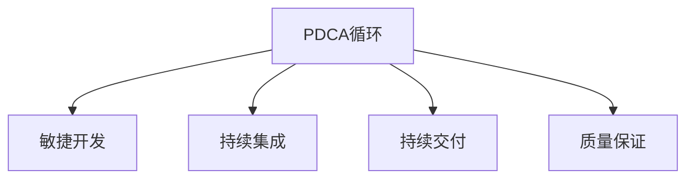

                 

# PDCA实践:持续改进的指南

持续改进是软件开发、项目管理、产品迭代中永恒的主题。PDCA循环（Plan-Do-Check-Act，即计划-执行-检查-行动）作为一种系统性的方法论，被广泛应用于质量管理、过程控制和项目管理等各个领域。本文将深入探讨PDCA循环在软件工程中的应用，并提供详细的实施指南，帮助团队和企业实现高效、持续的改进。

## 1. 背景介绍

### 1.1 问题由来

在软件开发过程中，项目需求变化、技术迭代迅速、团队协作复杂等因素，使得软件项目面临着诸多不确定性和挑战。如何有效应对这些变化，实现产品质量、效率和成本的持续优化，成为项目管理的关键。PDCA循环作为一种结构化的管理方法，能够帮助团队在迭代中不断审视和调整，确保项目的顺利进行和成功交付。

### 1.2 问题核心关键点

PDCA循环是一种基于数据驱动、持续优化的管理方法，通过不断重复“计划-执行-检查-行动”四个阶段，实现项目管理的高效性和灵活性。具体而言，PDCA循环的关键点包括：

- 计划(Plan)：明确项目目标、范围和策略，制定详细的实施计划。
- 执行(Do)：按照计划执行，确保任务的顺利推进。
- 检查(Check)：评估执行结果与预期目标的差距，识别问题和改进点。
- 行动(Act)：针对发现的问题，制定改进措施，并实施和验证改进效果。

通过PDCA循环的反复迭代，团队能够在项目执行过程中持续优化，提升项目质量和效率。

### 1.3 问题研究意义

PDCA循环在软件工程中的应用，具有以下重要意义：

1. **提高项目管理效率**：通过系统化的管理方法，PDCA循环帮助团队在项目执行过程中及时发现和解决问题，避免因突发情况导致的项目延期和成本超支。
2. **提升产品质量**：通过不断的检查和改进，PDCA循环确保软件项目的各个阶段都能够达到预期的质量标准。
3. **增强团队协作**：PDCA循环强调团队在项目执行过程中的合作与沟通，有助于提升团队的凝聚力和协作能力。
4. **促进持续创新**：PDCA循环鼓励团队在执行过程中不断探索和尝试新的方法和技术，推动项目的持续创新。
5. **支持快速适应变化**：PDCA循环通过持续的“检查-行动”机制，帮助团队快速应对需求变化和技术挑战，确保项目的顺利推进。

## 2. 核心概念与联系

### 2.1 核心概念概述

为更好地理解PDCA循环在软件工程中的应用，本节将介绍几个密切相关的核心概念：

- PDCA循环：一种基于数据驱动、持续优化的管理方法，通过不断重复“计划-执行-检查-行动”四个阶段，实现项目管理的高效性和灵活性。
- 敏捷开发：一种迭代、快速响应变化的开发方法，强调客户反馈和团队协作。
- 持续集成(CI)：一种软件开发实践，通过频繁集成和测试，实现快速交付和反馈。
- 持续交付(CD)：一种交付策略，通过自动化测试和部署，实现软件的快速发布和更新。
- 质量保证(QA)：一种确保软件产品质量的方法，通过测试和验证，保障软件功能、性能和安全性。

这些核心概念之间的逻辑关系可以通过以下Mermaid流程图来展示：



这个流程图展示的核心概念及其之间的关系：

1. PDCA循环是敏捷开发、持续集成、持续交付和质量保证的基础管理方法。
2. 敏捷开发通过迭代和快速响应变化，提升了PDCA循环的灵活性和适应性。
3. 持续集成和持续交付通过频繁的代码集成和测试，支持PDCA循环的快速迭代和持续优化。
4. 质量保证通过严格的质量管理和测试验证，确保PDCA循环实施的效果和质量。

## 3. 核心算法原理 & 具体操作步骤

### 3.1 算法原理概述

PDCA循环的核心思想是通过不断重复“计划-执行-检查-行动”四个阶段，实现项目的持续改进。在软件开发过程中，PDCA循环的每个阶段都有具体的实施步骤和工具方法，帮助团队高效地执行和管理项目。

### 3.2 算法步骤详解

PDCA循环在软件开发中的应用主要包括以下四个步骤：

**Step 1: 计划(Plan)**
- **目标设定**：明确项目的目标和范围，确保所有团队成员对项目目标有清晰的认识。
- **需求分析**：与客户和利益相关者沟通，收集需求和约束条件，制定详细的需求规格。
- **设计方案**：设计项目的整体架构和详细设计，包括技术选型、依赖关系和接口定义等。
- **资源规划**：确定项目所需的资源，包括人力、设备和工具等。

**Step 2: 执行(Do)**
- **任务分配**：将项目任务分解为可管理的子任务，分配给团队成员。
- **代码编写**：按照设计方案编写代码，并进行单元测试和集成测试。
- **功能开发**：实现项目的核心功能，并进行功能验证和测试。
- **系统集成**：将各个模块集成起来，进行系统测试和验收。

**Step 3: 检查(Check)**
- **进度跟踪**：定期跟踪项目进度，评估任务完成情况。
- **质量评估**：通过代码评审、测试报告和用户反馈等手段，评估项目质量。
- **风险管理**：识别项目中的风险和问题，制定应对措施。
- **改进措施**：针对发现的问题，制定改进措施，并评估改进效果。

**Step 4: 行动(Act)**
- **优化方案**：根据检查阶段的结果，优化项目计划和执行策略。
- **问题解决**：针对发现的问题，实施改进措施，确保问题得到有效解决。
- **持续改进**：在项目的各个阶段持续应用PDCA循环，确保项目的持续优化。

### 3.3 算法优缺点

PDCA循环在软件开发中的应用，具有以下优点：

1. **灵活性和适应性**：PDCA循环能够灵活应对项目中的各种变化和挑战，确保项目的顺利推进。
2. **系统性和结构化**：PDCA循环通过明确的步骤和方法，实现项目的系统化管理和优化。
3. **数据驱动**：PDCA循环依赖于数据驱动的决策和改进，确保管理过程的科学性和有效性。
4. **团队协作**：PDCA循环强调团队在项目执行过程中的合作与沟通，提升团队的凝聚力和协作能力。
5. **持续改进**：PDCA循环通过不断的“检查-行动”机制，实现项目的持续优化和提升。

同时，PDCA循环也存在一定的局限性：

1. **实施复杂**：PDCA循环的实施需要系统性的管理工具和方法，对团队和管理者的要求较高。
2. **资源投入大**：PDCA循环的实施需要大量的资源投入，包括人力、设备和工具等。
3. **文化转变**：PDCA循环的实施需要团队和管理者文化上的转变，对传统项目管理和开发方式提出挑战。

尽管存在这些局限性，但就目前而言，PDCA循环仍然是最主流和有效的项目管理方法之一。未来相关研究的重点在于如何进一步简化PDCA循环的实施流程，降低资源投入，同时兼顾其灵活性和系统性。

### 3.4 算法应用领域

PDCA循环在软件开发中的应用领域非常广泛，涵盖几乎所有常见的软件开发和项目管理场景，例如：

- **敏捷开发项目**：通过PDCA循环的“计划-执行-检查-行动”机制，确保敏捷开发项目的灵活性和高效性。
- **持续集成和持续交付(CI/CD)**：通过PDCA循环的迭代和持续优化，支持CI/CD的快速交付和反馈。
- **质量保证和测试**：通过PDCA循环的质量评估和改进措施，确保软件质量和安全。
- **需求管理和变更控制**：通过PDCA循环的需求分析和风险管理，实现高效的需求管理和变更控制。
- **团队管理和协作**：通过PDCA循环的团队协作和沟通，提升团队的凝聚力和工作效率。
- **项目管理和监控**：通过PDCA循环的进度跟踪和问题解决，实现项目的系统化管理和监控。

## 4. 数学模型和公式 & 详细讲解 & 举例说明

### 4.1 数学模型构建

在软件开发过程中，PDCA循环的实施涉及多个阶段和多个参与者，因此需要一个结构化的数学模型来描述其运作过程。以下是一个简化的PDCA循环数学模型：

**输入变量**：
- $P$：项目目标和范围
- $D$：需求规格和设计方案
- $R$：所需资源和工具

**输出变量**：
- $E$：项目执行结果
- $Q$：项目质量评估结果
- $C$：项目进度和风险管理结果
- $A$：改进措施和优化方案

**状态变量**：
- $P'$：下一轮计划的修正目标
- $D'$：下一轮执行的修正方案
- $R'$：下一轮执行的修正资源
- $E'$：下一轮执行的修正结果
- $Q'$：下一轮质量评估的修正结果
- $C'$：下一轮风险管理的修正结果
- $A'$：下一轮改进措施的修正方案

**数学模型**：
- 计划阶段：$P' = f(P, D, R)$
- 执行阶段：$E' = g(D', R', E)$
- 检查阶段：$Q' = h(E', C', Q)$
- 行动阶段：$A' = i(Q', E', A)$

其中，$f$、$g$、$h$、$i$分别表示计划、执行、检查、行动阶段的函数。

### 4.2 公式推导过程

以下我们以敏捷开发项目为例，推导PDCA循环的数学模型和公式。

**计划阶段**：
- 目标设定：$P = \{G_1, G_2, ..., G_n\}$
- 需求分析：$D = \{R_1, R_2, ..., R_m\}$
- 设计方案：$D' = f(P, D)$

其中，$G_i$表示项目目标，$R_i$表示需求规格。

**执行阶段**：
- 任务分配：$E = \{T_1, T_2, ..., T_k\}$
- 代码编写：$E' = g(D', E)$

其中，$T_i$表示任务，$E'$表示代码实现。

**检查阶段**：
- 进度跟踪：$C = \{PCT_1, PCT_2, ..., PCT_l\}$
- 质量评估：$Q = \{TQ_1, TQ_2, ..., TQ_m\}$
- 风险管理：$C' = h(E', C, Q)$

其中，$PCT_i$表示任务进度，$TQ_i$表示任务质量，$C'$表示风险管理结果。

**行动阶段**：
- 优化方案：$A = \{AP_1, AP_2, ..., AP_n\}$
- 问题解决：$E'' = i(Q', E', A)$

其中，$AP_i$表示改进措施，$E''$表示优化后的执行结果。

### 4.3 案例分析与讲解

假设一个敏捷开发项目，其需求为开发一个电商网站的搜索功能。项目团队通过PDCA循环的步骤如下：

**计划阶段**：
- 目标设定：开发一个高效的搜索功能，提升用户体验。
- 需求分析：定义搜索功能的规格和性能指标。
- 设计方案：设计搜索算法和前端界面。

**执行阶段**：
- 任务分配：将开发任务分配给前端、后端和测试团队。
- 代码编写：前端编写UI界面，后端编写搜索算法。
- 功能开发：实现搜索功能，并进行测试。

**检查阶段**：
- 进度跟踪：定期检查任务进度，评估开发进展。
- 质量评估：通过代码评审和测试报告，评估搜索功能的质量。
- 风险管理：识别代码复杂度、性能瓶颈等风险，制定应对措施。

**行动阶段**：
- 优化方案：针对发现的问题，优化搜索算法和界面设计。
- 问题解决：修正代码缺陷，提升性能。

通过PDCA循环的实施，团队能够高效地完成搜索功能的开发，并不断优化提升，确保项目的成功交付。

## 5. 项目实践：代码实例和详细解释说明

### 5.1 开发环境搭建

在进行PDCA实践前，我们需要准备好开发环境。以下是使用Jenkins进行CI/CD环境配置的流程：

1. 安装Jenkins：从官网下载并安装Jenkins，并部署在服务器上。
2. 配置插件：安装必要的插件，如Git、Maven、SonarQube等，确保Jenkins具备完整的CI/CD功能。
3. 配置源代码管理：配置Jenkins与Git仓库的连接，并设置构建项目的Git地址和分支。
4. 配置构建工具：配置Jenkins与构建工具（如Maven）的连接，并设置构建项目的POM文件路径。
5. 配置质量检查工具：配置Jenkins与质量检查工具（如SonarQube）的连接，并设置检查项目的SonarQube地址和配置文件路径。

完成上述步骤后，即可在Jenkins环境中开始CI/CD实践。

### 5.2 源代码详细实现

下面我们以敏捷开发项目为例，给出使用Jenkins进行CI/CD的PyTorch代码实现。

首先，定义Jenkins的配置文件`Jenkinsfile`：

```groovy
pipeline {
    agent any

    stages {
        stage('Build') {
            steps {
                sh 'git clone https://github.com/your-repo/your-project.git'
                sh 'cd your-project && mvn clean install'
            }
        }

        stage('Test') {
            steps {
                sh 'mvn clean test'
                sh 'mvn site'
                sh 'mvn sonar:sonar'
            }
        }

        stage('Deploy') {
            steps {
                sh 'mvn clean deploy'
            }
        }
    }
}
```

然后，定义项目的构建脚本`pom.xml`：

```xml
<project xmlns="http://maven.apache.org/POM/4.0.0"
         xmlns:xsi="http://www.w3.org/2001/XMLSchema-instance"
         xsi:schemaLocation="http://maven.apache.org/POM/4.0.0 http://maven.apache.org/xsd/maven-4.0.0.xsd">
    <modelVersion>4.0.0</modelVersion>

    <groupId>com.example</groupId>
    <artifactId>your-project</artifactId>
    <version>1.0-SNAPSHOT</version>

    <parent>
        <groupId>org.springframework.boot</groupId>
        <artifactId>spring-boot-starter-parent</artifactId>
        <version>2.5.5</version>
        <relativePath/> <!-- 从Maven项目的pom.xml的<parent>标签的relativePath属性中确定父项目相对子项目的路径 -->
    </parent>

    <properties>
        <java.version>11</java.version>
    </properties>

    <dependencyManagement>
        <dependencies>
            <dependency>
                <groupId>org.springframework.boot</groupId>
                <artifactId>spring-boot-dependencies</artifactId>
                <version>2.5.5</version>
                <type>pom</type>
                <scope>import</scope>
            </dependency>
        </dependencies>
    </dependencyManagement>

    <dependencies>
        <dependency>
            <groupId>org.springframework.boot</groupId>
            <artifactId>spring-boot-starter-web</artifactId>
        </dependency>
        <dependency>
            <groupId>org.springframework.boot</groupId>
            <artifactId>spring-boot-starter-data-jpa</artifactId>
        </dependency>
        <dependency>
            <groupId>org.springframework.boot</groupId>
            <artifactId>spring-boot-starter-security</artifactId>
        </dependency>
        <dependency>
            <groupId>com.example</groupId>
            <artifactId>your-project</artifactId>
            <version>1.0-SNAPSHOT</version>
        </dependency>
    </dependencies>

    <build>
        <plugins>
            <plugin>
                <groupId>org.springframework.boot</groupId>
                <artifactId>spring-boot-maven-plugin</artifactId>
            </plugin>
        </plugins>
    </build>

    <reporting>
        <plugins>
            <plugin>
                <groupId>org.springframework.boot</groupId>
                <artifactId>spring-boot-maven-plugin</artifactId>
            </plugin>
        </plugins>
    </reporting>

</project>
```

接着，定义项目的Git仓库和Jenkins项目的配置，确保Jenkins能够顺利构建和部署项目。

最后，在Jenkins上运行构建任务，通过持续集成和持续交付，确保项目的快速交付和高质量交付。

### 5.3 代码解读与分析

让我们再详细解读一下关键代码的实现细节：

**Jenkinsfile**：
- `pipeline`：定义Jenkins流水线。
- `agent any`：指定任意的Jenkins代理服务器。
- `stages`：定义Jenkins流水线的阶段，包括构建、测试和部署。
- `steps`：定义每个阶段的执行步骤，如代码克隆、构建、测试、部署等。
- `sh`：在Jenkins中执行Shell命令。

**pom.xml**：
- `project`：定义Maven项目的元数据。
- `groupId`：定义项目的组ID。
- `artifactId`：定义项目的Artifact ID。
- `version`：定义项目的版本号。
- `parent`：定义项目的父POM。
- `properties`：定义项目的属性。
- `dependencyManagement`：定义项目的依赖管理。
- `dependencies`：定义项目的依赖。
- `build`：定义项目的构建。
- `plugins`：定义项目的插件。
- `reporting`：定义项目的报告。

通过Jenkins的实践，我们可以看到PDCA循环在敏捷开发项目中的应用，通过持续集成和持续交付，实现项目的快速迭代和高效交付。

## 6. 实际应用场景

### 6.1 智能客服系统

基于PDCA循环的敏捷开发方法，智能客服系统的构建可以更加高效、灵活。传统的客服系统往往需要人工干预，响应速度慢，客户满意度低。而使用敏捷开发方法，智能客服系统可以实时收集客户反馈，快速响应客户需求，提升客户体验。

在实际应用中，团队可以通过PDCA循环，对智能客服系统进行持续优化和改进。例如：

- 计划阶段：明确系统需求和功能目标。
- 执行阶段：开发和部署智能客服系统。
- 检查阶段：收集客户反馈，评估系统性能。
- 行动阶段：根据客户反馈，优化系统功能，提升用户体验。

通过PDCA循环的持续改进，智能客服系统能够不断优化，提升客户满意度，减少人工干预，实现智能化的客户服务。

### 6.2 金融舆情监测

金融舆情监测是一个对市场舆情进行实时监控和分析的过程。传统的金融舆情监测往往依赖人工监控，耗费大量人力和时间。而使用敏捷开发方法，金融舆情监测系统可以通过持续集成和持续交付，实现实时监控和快速响应。

在实际应用中，团队可以通过PDCA循环，对金融舆情监测系统进行持续优化和改进。例如：

- 计划阶段：明确系统需求和功能目标。
- 执行阶段：开发和部署金融舆情监测系统。
- 检查阶段：实时监控舆情变化，评估系统性能。
- 行动阶段：根据舆情变化，优化系统算法，提升监测效果。

通过PDCA循环的持续改进，金融舆情监测系统能够快速响应用户需求，实时监控市场舆情，提升金融风险防范能力。

### 6.3 个性化推荐系统

个性化推荐系统是一个通过用户行为数据，为用户推荐个性化内容的过程。传统的个性化推荐系统往往依赖人工干预，推荐效果不佳。而使用敏捷开发方法，个性化推荐系统可以通过持续集成和持续交付，实现快速迭代和优化。

在实际应用中，团队可以通过PDCA循环，对个性化推荐系统进行持续优化和改进。例如：

- 计划阶段：明确系统需求和功能目标。
- 执行阶段：开发和部署个性化推荐系统。
- 检查阶段：收集用户反馈，评估推荐效果。
- 行动阶段：根据用户反馈，优化推荐算法，提升推荐效果。

通过PDCA循环的持续改进，个性化推荐系统能够不断优化，提升推荐效果，满足用户需求，提升用户满意度。

### 6.4 未来应用展望

随着敏捷开发方法和PDCA循环的不断演进，未来在软件开发和项目管理中的应用将更加广泛和深入。例如：

- **敏捷开发**：通过PDCA循环，敏捷开发方法将更加灵活和高效，能够快速响应需求变化和技术挑战。
- **持续集成和持续交付(CI/CD)**：通过PDCA循环的持续集成和持续交付，系统能够快速迭代和优化，实现高质量交付。
- **质量保证和测试**：通过PDCA循环的质量保证和测试，确保系统的质量和安全性。
- **需求管理和变更控制**：通过PDCA循环的需求管理和变更控制，实现高效的项目管理和优化。
- **团队管理和协作**：通过PDCA循环的团队管理和协作，提升团队的凝聚力和工作效率。
- **项目管理和监控**：通过PDCA循环的项目管理和监控，实现系统的系统化管理和监控。

总之，PDCA循环在软件开发和项目管理中的应用，将不断拓展，为企业的持续创新和发展提供有力支撑。

## 7. 工具和资源推荐

### 7.1 学习资源推荐

为了帮助开发者系统掌握PDCA循环的理论基础和实践技巧，这里推荐一些优质的学习资源：

1. **《精益软件开发》**：Eric Ries著，系统介绍精益开发方法和实践。
2. **《敏捷软件开发：原则、模式与实践》**：Robert C. Martin著，详细介绍敏捷开发的原则和实践。
3. **《CI/CD最佳实践》**：Docker官方文档，详细介绍CI/CD的实施方法和工具。
4. **《Jenkins用户指南》**：Jenkins官方文档，详细介绍Jenkins的使用方法和插件。
5. **《持续交付实践》**：Bryce Suber著，详细介绍持续交付的实践和挑战。

通过对这些资源的学习实践，相信你一定能够快速掌握PDCA循环的精髓，并用于解决实际的项目管理问题。

### 7.2 开发工具推荐

高效的开发离不开优秀的工具支持。以下是几款用于PDCA循环开发和实施的常用工具：

1. **Jenkins**：开源持续集成和持续交付工具，支持大规模分布式构建和部署。
2. **Git**：分布式版本控制系统，支持版本控制和协作开发。
3. **Maven**：Java项目构建工具，支持自动化构建和依赖管理。
4. **SonarQube**：代码质量检查工具，支持静态代码分析和持续集成。
5. **JIRA**：项目管理工具，支持敏捷开发和任务跟踪。

合理利用这些工具，可以显著提升PDCA循环的实施效率，加快创新迭代的步伐。

### 7.3 相关论文推荐

PDCA循环在软件开发中的应用，源于学界的持续研究。以下是几篇奠基性的相关论文，推荐阅读：

1. **《敏捷软件开发：原则、模式与实践》**：Robert C. Martin著，详细介绍敏捷开发的原则和实践。
2. **《精益软件开发：关于构建快速、可部署软件的精益方法》**：Eric Ries著，详细介绍精益开发的方法和实践。
3. **《持续交付：构建、测试和部署软件》**：Dave Farley和Patrick Debois著，详细介绍持续交付的实践和挑战。
4. **《Jenkins：自动化、持续集成和持续交付》**：Jenkins官方文档，详细介绍Jenkins的使用方法和插件。
5. **《敏捷实践指南》**：The Agile Manifesto，详细介绍敏捷开发的原则和实践。

这些论文代表了大模型微调技术的发展脉络。通过学习这些前沿成果，可以帮助研究者把握学科前进方向，激发更多的创新灵感。

## 8. 总结：未来发展趋势与挑战

### 8.1 研究成果总结

本文对PDCA循环在软件工程中的应用进行了全面系统的介绍。首先阐述了PDCA循环在软件开发中的重要性，明确了PDCA循环在项目管理中的关键地位。其次，从原理到实践，详细讲解了PDCA循环的数学模型和实施步骤，提供了完整的代码实例和详细解释说明。同时，本文还广泛探讨了PDCA循环在软件开发中的应用场景，展示了PDCA循环的广泛适用性和灵活性。

通过本文的系统梳理，可以看到，PDCA循环在软件开发和项目管理中的应用，能够帮助团队在项目执行过程中不断优化和改进，实现高效、灵活的管理。

### 8.2 未来发展趋势

展望未来，PDCA循环在软件工程中的应用将呈现以下几个发展趋势：

1. **灵活性和适应性**：随着敏捷开发和持续交付的普及，PDCA循环将更加灵活和适应性，能够快速响应需求变化和技术挑战。
2. **自动化和智能化**：通过引入自动化工具和智能化技术，PDCA循环将实现更高的效率和精确度，提升项目管理的效果。
3. **数据驱动和可视化**：通过数据驱动的管理和可视化工具，PDCA循环将实现更科学、直观的管理效果。
4. **文化融合和组织变革**：随着PDCA循环的推广，项目管理文化和组织变革也将同步推进，提升团队的管理能力和协作水平。
5. **多项目管理**：随着企业规模的扩大，PDCA循环将应用于更复杂、更庞大的项目体系，实现多项目管理的高效协调。

以上趋势凸显了PDCA循环在软件开发和项目管理中的应用前景。这些方向的探索发展，必将进一步提升项目管理的高效性和灵活性，推动企业数字化转型的步伐。

### 8.3 面临的挑战

尽管PDCA循环在软件开发中的应用已经取得了显著的成效，但在实施过程中仍面临诸多挑战：

1. **组织文化阻力**：PDCA循环的实施需要团队和管理者文化上的转变，对传统项目管理方式提出挑战。
2. **技术复杂性**：PDCA循环的实施需要系统化的管理工具和技术支持，对技术要求较高。
3. **资源投入大**：PDCA循环的实施需要大量的资源投入，包括人力、设备和工具等。
4. **过程优化**：PDCA循环的实施需要不断优化和改进，以适应项目的变化和挑战。
5. **绩效评估**：PDCA循环的实施需要科学、合理的绩效评估和反馈机制，以确保管理效果。

尽管存在这些挑战，但通过积极应对和不断优化，PDCA循环将在软件开发和项目管理中发挥更大的作用，推动企业的持续创新和发展。

### 8.4 研究展望

面对PDCA循环实施过程中面临的挑战，未来的研究需要在以下几个方面寻求新的突破：

1. **引入新技术和工具**：通过引入新技术和工具，提升PDCA循环的实施效率和效果。例如，引入人工智能、大数据等技术，提升项目管理的智能化水平。
2. **优化流程和规范**：通过优化PDCA循环的流程和规范，提升项目管理的高效性和科学性。例如，引入精益管理、六西格玛等方法，提升项目管理的精细化水平。
3. **提升团队能力**：通过提升团队的管理能力和技术水平，确保PDCA循环的顺利实施和持续改进。例如，开展管理培训和技术培训，提升团队的综合素质和能力。
4. **加强协作和沟通**：通过加强团队和管理者之间的协作和沟通，确保PDCA循环的顺利实施和持续改进。例如，引入敏捷开发、Scrum等协作方法，提升团队的协作能力。
5. **引入反馈和改进**：通过引入反馈和改进机制，确保PDCA循环的持续优化和改进。例如，建立持续改进的反馈机制，定期评估和优化PDCA循环的效果。

这些研究方向的探索，必将引领PDCA循环在软件工程中的应用不断深化，为企业的持续创新和发展提供有力支撑。

## 9. 附录：常见问题与解答

**Q1：PDCA循环是否适用于所有软件开发项目？**

A: PDCA循环在软件开发项目中的应用具有很强的适应性和灵活性，适用于各种规模和类型的项目。无论是在敏捷开发、持续交付还是在传统开发中，PDCA循环都能够帮助团队高效管理项目，提升项目管理效果。

**Q2：PDCA循环在实施过程中需要注意哪些问题？**

A: PDCA循环在实施过程中需要注意以下问题：

1. **团队文化**：PDCA循环的实施需要团队和管理者文化上的转变，对传统项目管理方式提出挑战。需要通过培训和文化建设，逐步提升团队的接受度和适应性。
2. **工具和资源**：PDCA循环的实施需要系统化的管理工具和资源支持，需要投入大量的资源和人力。需要选择合适的工具和资源，确保PDCA循环的顺利实施。
3. **流程优化**：PDCA循环的实施需要不断优化和改进，以适应项目的变化和挑战。需要定期评估PDCA循环的效果，进行持续改进。
4. **绩效评估**：PDCA循环的实施需要科学、合理的绩效评估和反馈机制，以确保管理效果。需要通过定期评估和反馈，优化PDCA循环的实施效果。

**Q3：如何评估PDCA循环的实施效果？**

A: 评估PDCA循环的实施效果主要从以下几个方面进行：

1. **项目进度**：评估项目任务的完成情况和进度，确保项目按时交付。
2. **项目质量**：评估项目交付的质量，确保项目满足需求和规范。
3. **资源利用率**：评估项目的资源利用率，确保资源的高效使用。
4. **风险管理**：评估项目的风险管理效果，确保项目的稳定性和可持续性。
5. **团队协作**：评估团队的协作效果，确保团队的凝聚力和工作效率。
6. **客户满意度**：评估客户的满意度，确保项目能够满足客户的需求和期望。

通过评估PDCA循环的实施效果，可以及时发现问题，进行改进和优化，确保PDCA循环的顺利实施和持续改进。

**Q4：PDCA循环与其他项目管理方法有何不同？**

A: PDCA循环与其他项目管理方法的不同点在于：

1. **持续优化**：PDCA循环通过不断的“检查-行动”机制，实现项目的持续优化和改进。其他项目管理方法可能缺乏持续优化机制，导致项目难以适应变化和挑战。
2. **数据驱动**：PDCA循环依赖于数据驱动的决策和改进，确保管理过程的科学性和有效性。其他项目管理方法可能缺乏数据支持，导致管理决策的盲目性和随意性。
3. **团队协作**：PDCA循环强调团队在项目执行过程中的合作与沟通，提升团队的凝聚力和工作效率。其他项目管理方法可能缺乏团队协作机制，导致团队效率低下。
4. **灵活性和适应性**：PDCA循环通过敏捷开发和持续交付等方法，实现项目的高效性和灵活性。其他项目管理方法可能缺乏灵活性和适应性，导致项目难以应对变化和挑战。

总之，PDCA循环在项目管理中的应用，能够通过持续优化和数据驱动，实现项目的灵活性和高效性，提升项目管理的效果和水平。

---

作者：禅与计算机程序设计艺术 / Zen and the Art of Computer Programming

