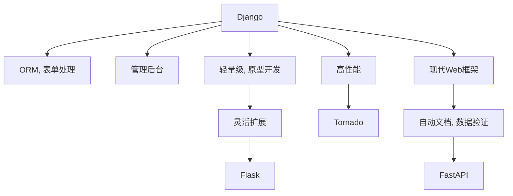

                 

# Python Web 框架比较：探索适合项目的最佳选择

## 1. 背景介绍

Web框架是现代Web应用开发的核心工具之一，它提供了丰富的API和工具，帮助我们更高效地构建Web应用。在Python社区，有很多优秀的Web框架可供选择，比如Django、Flask、Tornado等。不同的框架有不同的特点和适用场景。本文将对这几个主要Python Web框架进行详细比较，帮助开发者找到最适合自己项目的框架。

## 2. 核心概念与联系

### 2.1 核心概念概述

为更好地理解这些框架，本节将介绍几个密切相关的核心概念：

- **Django**：一个高层次的Web框架，提供了丰富的ORM、表单处理、管理后台等功能，适合快速搭建大型Web应用。
- **Flask**：一个轻量级的Web框架，提供了灵活的扩展机制，适合小型项目和快速原型开发。
- **Tornado**：一个高性能的Web框架，适用于I/O密集型应用，适合高并发场景。
- **FastAPI**：一个基于Python 3.6+的现代Web框架，提供了自动生成的API文档和强大的数据验证功能。

这些核心概念之间的逻辑关系可以通过以下Mermaid流程图来展示：



这个流程图展示了一些主要Python Web框架的核心概念及其之间的关系：

1. **Django**提供了ORM、表单处理、管理后台等功能。
2. **Flask**是一个轻量级的框架，适合快速原型开发。
3. **Tornado**适用于高性能的I/O密集型应用。
4. **FastAPI**是一个现代Web框架，提供了自动文档和数据验证功能。

## 3. 核心算法原理 & 具体操作步骤

### 3.1 算法原理概述

Web框架的核心原理是处理HTTP请求，生成HTTP响应。当用户在浏览器中输入URL，Web框架会通过路由规则找到对应的视图函数或处理函数，执行相应的业务逻辑，并最终生成HTML、JSON等格式的响应。

以Django为例，路由规则在URLconf中定义，视图函数和模型通过ORM进行交互，请求和响应的处理通过view.py和模板系统实现。Flask则更加灵活，请求和响应的处理在app.py中实现，支持多种模板引擎。Tornado利用异步IO，支持大量并发连接。FastAPI则提供了自动生成的API文档和数据验证功能。

### 3.2 算法步骤详解

以Django为例，下面详细介绍其基本的使用步骤：

1. **环境搭建**：
   - 安装Django，可以使用pip install django。
   - 创建新的Django项目，使用django-admin startproject。
   - 创建新的Django应用，使用python manage.py startapp。

2. **定义路由**：
   - 在urls.py中定义路由规则，使用from django.urls import path。
   - 定义视图函数，使用def view(request)。

3. **实现业务逻辑**：
   - 在view函数中实现具体的业务逻辑，处理请求和响应。
   - 使用Django的ORM进行数据交互，使用models.py定义模型。

4. **处理请求和响应**：
   - 在views.py中定义视图函数，使用request对象获取请求信息。
   - 使用render函数渲染HTML模板，使用response对象返回HTTP响应。

5. **运行和调试**：
   - 使用python manage.py runserver启动本地服务器。
   - 在浏览器中访问对应的URL，查看生成的响应内容。

### 3.3 算法优缺点

Django框架的优点包括：

- 高层次的抽象，可以快速搭建大型Web应用。
- 丰富的内置功能，如ORM、表单处理、管理后台等。
- 稳定的性能，经过多年的发展和测试。

Django框架的缺点包括：

- 过重的功能，增加了应用的复杂性。
- 灵活性不足，定制化开发难度大。

Flask框架的优点包括：

- 轻量级，易于上手。
- 灵活的扩展机制，支持多种模板引擎。
- 高可定制性，适合快速原型开发。

Flask框架的缺点包括：

- 缺乏内置功能，需要自行实现。
- 扩展性不够，不适合大型项目。

Tornado框架的优点包括：

- 高性能的异步IO处理。
- 支持高并发连接。
- 简单易用，适合I/O密集型应用。

Tornado框架的缺点包括：

- 缺乏内置功能，需要自行实现。
- 文档和社区支持不够丰富。

FastAPI框架的优点包括：

- 现代Web框架，支持自动文档和数据验证。
- 强大的依赖注入机制。
- 高性能，适合大规模应用。

FastAPI框架的缺点包括：

- 学习曲线较陡峭。
- 依赖Python 3.6及以上版本。

### 3.4 算法应用领域

不同的框架适用于不同的应用场景：

- **Django**：适合大型、复杂的Web应用，如电商平台、内容管理系统等。
- **Flask**：适合快速原型开发、小型项目，如API服务、个人博客等。
- **Tornado**：适合高性能的I/O密集型应用，如实时聊天、游戏服务器等。
- **FastAPI**：适合现代Web应用，如API服务、微服务架构等。

## 4. 数学模型和公式 & 详细讲解 & 举例说明

### 4.1 数学模型构建

Web框架的数学模型主要关注如何处理HTTP请求和响应，生成有效的API。以Django为例，其基本流程如下：

1. **接收请求**：获取URL、HTTP方法等信息，解析请求体。
2. **路由匹配**：根据URL和HTTP方法，匹配对应的视图函数。
3. **视图处理**：调用视图函数，处理请求，生成响应。
4. **渲染响应**：将视图函数生成的响应渲染为HTML、JSON等格式，返回客户端。

### 4.2 公式推导过程

以Django的路由规则为例，推导过程如下：

1. **路由规则**：定义路由规则，使用from django.urls import path。
2. **视图函数**：定义视图函数，使用def view(request)。
3. **请求处理**：在view函数中处理请求，使用request对象获取请求信息。
4. **响应渲染**：使用render函数渲染HTML模板，生成响应。

### 4.3 案例分析与讲解

以Flask为例，分析其基本的路由规则：

```python
from flask import Flask

app = Flask(__name__)

@app.route('/')
def index():
    return 'Hello, World!'
```

该代码定义了一个Flask应用，并设置了默认的路由规则。当用户访问根URL时，会触发index函数，返回“Hello, World!”字符串。

## 5. 项目实践：代码实例和详细解释说明

### 5.1 开发环境搭建

以下是使用Python搭建Django应用的步骤：

1. 安装Python和Django。
2. 创建新的Django项目，使用django-admin startproject。
3. 创建新的Django应用，使用python manage.py startapp。
4. 编写URLconf和views.py，定义路由和视图函数。
5. 编写models.py，定义数据模型。
6. 运行本地服务器，使用python manage.py runserver。

### 5.2 源代码详细实现

以下是Django应用的基本代码实现：

```python
# settings.py
# 设置Django环境配置

# urls.py
# 定义路由规则

# models.py
# 定义数据模型

# views.py
# 定义视图函数

# admin.py
# 定义管理后台

# urls.py
# 定义管理后台路由

# wsgi.py
# 定义WSGI处理函数

# settings.py
# 设置WSGI配置

# urls.py
# 定义Web应用路由

# views.py
# 定义视图函数
```

### 5.3 代码解读与分析

在Django应用中，路由规则、视图函数和模型通过Python代码实现，具有高度的可维护性和可扩展性。每个模块都具有明确的职责，使得代码结构清晰，易于理解和调试。

## 6. 实际应用场景

### 6.1 电商平台

电商平台的Web应用需要处理大量的用户交互和数据交互，适合使用Django框架。Django提供了丰富的ORM功能，可以快速进行数据访问和操作。同时，Django的管理后台和表单处理功能，可以大大简化应用的开发和维护。

### 6.2 个人博客

个人博客是一个小型Web应用，适合使用Flask框架。Flask的灵活扩展机制和轻量级特点，使其易于上手，可以快速实现个人博客的功能。同时，Flask支持多种模板引擎，可以根据自己的喜好选择最合适的渲染方式。

### 6.3 实时聊天系统

实时聊天系统是一个高性能的I/O密集型应用，适合使用Tornado框架。Tornado的异步IO处理和支持高并发连接的特点，使其在处理大量实时消息时表现出色。同时，Tornado的简单易用性，也使得应用的开发和维护更加高效。

### 6.4 微服务架构

微服务架构是一种现代化的Web应用架构，适合使用FastAPI框架。FastAPI的自动文档和数据验证功能，使得API开发更加高效，同时，FastAPI的高性能和强大的依赖注入机制，也使得微服务架构的实现更加便捷。

## 7. 工具和资源推荐

### 7.1 学习资源推荐

1. **Django官方文档**：Django官方文档详细介绍了Django框架的各个组件和使用方法。
2. **Flask官方文档**：Flask官方文档提供了详细的教程和API文档，适合新手入门。
3. **Tornado官方文档**：Tornado官方文档介绍了Tornado的异步IO处理和框架特性。
4. **FastAPI官方文档**：FastAPI官方文档介绍了FastAPI的自动文档和数据验证功能。

### 7.2 开发工具推荐

1. **PyCharm**：一款优秀的Python开发工具，提供了丰富的插件和功能，支持Django、Flask等框架。
2. **Visual Studio Code**：一款轻量级的开发工具，支持Python和Flask、Tornado、FastAPI等框架。
3. **Postman**：一款API测试工具，支持HTTP请求和响应调试。

### 7.3 相关论文推荐

1. **Django: The Web Framework for Humans**：Django官方博客，介绍了Django框架的开发历程和特点。
2. **Flask: Micro Web Frameworks for Python**：Flask官方博客，介绍了Flask框架的核心理念和使用方式。
3. **Tornado: Python Web Server and Web Application Framework**：Tornado官方文档，介绍了Tornado的异步IO处理和框架特性。
4. **FastAPI: The Fast (web) API framework for Python 3.6+ based on async and dependency injection**：FastAPI官方文档，介绍了FastAPI的自动文档和数据验证功能。

## 8. 总结：未来发展趋势与挑战

### 8.1 总结

本文对主要Python Web框架进行了详细比较，帮助开发者找到最适合自己项目的框架。通过分析Django、Flask、Tornado、FastAPI等框架的特点和适用场景，可以更好地理解不同框架的优缺点。

### 8.2 未来发展趋势

未来Web框架的发展趋势包括：

1. **高性能**：随着Web应用的复杂性和数据量的增加，高性能的框架将更加重要。
2. **全栈开发**：未来的框架将更加注重全栈开发，提供更多的内置功能和插件。
3. **社区支持**：强大的社区支持是框架长期发展的关键，将会有更多的开发者参与社区建设和贡献。
4. **跨平台支持**：未来的框架将支持更多平台和操作系统，如移动端、嵌入式设备等。

### 8.3 面临的挑战

Web框架在未来的发展中面临以下挑战：

1. **性能瓶颈**：随着Web应用的数据量和复杂性增加，现有的框架在处理大量数据时可能出现性能瓶颈。
2. **安全性问题**：Web应用的安全性问题日益严重，框架需要在安全性方面提供更多的保障。
3. **学习曲线**：新框架的引入可能增加开发者的学习成本，需要更多的培训和文档支持。
4. **可扩展性**：框架的可扩展性直接影响到应用的开发和维护，需要不断优化和改进。

### 8.4 研究展望

未来的研究将在以下几个方面进行探索：

1. **性能优化**：研究如何优化框架的性能，处理大量数据和高并发请求。
2. **安全性保障**：研究如何提高框架的安全性，防止SQL注入、跨站脚本等攻击。
3. **学习曲线降低**：研究如何降低框架的学习成本，提供更多的培训和文档支持。
4. **跨平台支持**：研究如何支持更多的平台和操作系统，如移动端、嵌入式设备等。

## 9. 附录：常见问题与解答

**Q1: 如何选择适合自己的Web框架？**

A: 选择Web框架需要考虑多个因素，包括应用类型、开发团队的技术栈、项目的复杂度等。Django适合大型、复杂的Web应用，Flask适合小型项目和快速原型开发，Tornado适合高性能的I/O密集型应用，FastAPI适合现代Web应用。

**Q2: Django和Flask的性能差距大吗？**

A: Django是一个高层次的框架，提供了丰富的功能，但可能会增加应用的复杂性和性能开销。Flask是一个轻量级的框架，适合快速原型开发，性能表现也不错。但在处理大量数据和高并发请求时，Django的优势会更加明显。

**Q3: Tornado和FastAPI在性能上有差别吗？**

A: Tornado是一个高性能的框架，适合I/O密集型应用，但缺乏内置功能，需要自行实现。FastAPI是一个现代Web框架，支持自动文档和数据验证，性能表现也非常出色，适合大规模应用。

**Q4: 如何平衡Web框架的复杂度和性能？**

A: 平衡Web框架的复杂度和性能，需要根据具体项目的需求进行选择。对于大型、复杂的Web应用，Django的丰富功能和稳定性可能更合适。而对于小型项目或快速原型开发，Flask和Tornado的轻量级和灵活性可能更合适。

**Q5: 如何选择Web框架的模板引擎？**

A: 选择模板引擎需要考虑应用的需求和开发团队的技术栈。Django提供了Django模板引擎，Flask支持多种模板引擎，Tornado和FastAPI也有自己的模板引擎。建议根据项目需求选择最适合的模板引擎。

**Q6: 如何评估Web框架的性能？**

A: 评估Web框架的性能需要综合考虑多个因素，包括响应时间、吞吐量、并发连接数等。可以使用工具如Apache Benchmark、LoadRunner等进行性能测试，并结合实际应用情况进行评估。

---

作者：禅与计算机程序设计艺术 / Zen and the Art of Computer Programming

