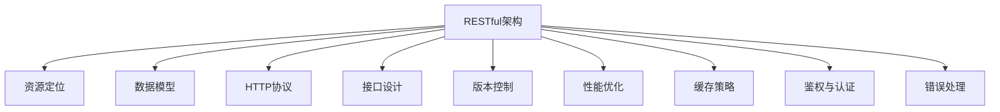

                 

# RESTful API设计：构建可扩展的Web服务

> 关键词：RESTful API, Web服务, 可扩展性, 安全性, HTTP协议, 数据模型, 接口设计, 数据传输格式, API版本控制, 性能优化, 缓存策略, 鉴权与认证, 错误处理

## 1. 背景介绍

### 1.1 问题由来
随着互联网技术的发展，Web服务在现代应用中扮演着越来越重要的角色。从电子商务、社交网络到云计算、物联网，Web服务无处不在，为各行各业提供了强大的支撑。而设计良好的Web服务API，是保障Web服务稳定、高效运行的基础。

然而，在Web服务开发和维护的过程中，API设计问题频发，如接口不一致、数据格式混乱、请求响应冗长、版本更新频繁、安全漏洞等，这些问题严重影响了Web服务的质量和用户体验。因此，如何设计出高质量、高性能、安全的RESTful API，成为当前Web服务开发的焦点。

### 1.2 问题核心关键点
本节将阐述RESTful API设计的核心概念和关键点，包括RESTful架构、资源定位、数据模型、HTTP协议、接口设计、版本控制、性能优化、缓存策略、鉴权与认证等，为后续深入分析提供基础。

1. **RESTful架构**：基于REST（Representational State Transfer）架构风格，通过资源、表示、状态和操作来构建Web服务。

2. **资源定位**：使用统一的资源标识符（URI）来定位资源，使用HTTP方法（GET、POST、PUT、DELETE等）来进行资源操作。

3. **数据模型**：定义Web服务所支持的数据格式和表示方式，如JSON、XML、GraphQL等。

4. **HTTP协议**：基于HTTP协议进行数据传输和状态管理，合理使用HTTP状态码和响应头来传达信息和错误。

5. **接口设计**：接口设计是API设计的核心，包括接口路径、请求参数、返回数据、错误码和文档等要素。

6. **版本控制**：通过API版本控制，避免旧API兼容性问题，保持新API和旧API的平滑过渡。

7. **性能优化**：通过合理设计接口、使用缓存、减少网络传输量等手段，提升API性能。

8. **缓存策略**：使用缓存技术减少服务器压力，提升API响应速度。

9. **鉴权与认证**：通过鉴权和认证机制，保障API访问的安全性。

10. **错误处理**：定义统一的错误处理机制，避免API出现不稳定情况。

## 2. 核心概念与联系

### 2.1 核心概念概述

为更好地理解RESTful API设计的原理和架构，本节将介绍几个密切相关的核心概念：

- **RESTful架构**：REST架构是一种软件架构风格，通过资源、表示、状态和操作来构建Web服务。RESTful API是基于REST架构风格的Web API设计风格。

- **资源定位**：RESTful API通过URI来定位资源，URI是资源的唯一标识符，采用层级结构表示资源的组成关系。

- **数据模型**：定义Web服务所支持的数据格式和表示方式，如JSON、XML、GraphQL等。

- **HTTP协议**：RESTful API基于HTTP协议进行数据传输和状态管理，合理使用HTTP状态码和响应头来传达信息和错误。

- **接口设计**：接口设计是API设计的核心，包括接口路径、请求参数、返回数据、错误码和文档等要素。

- **版本控制**：通过API版本控制，避免旧API兼容性问题，保持新API和旧API的平滑过渡。

- **性能优化**：通过合理设计接口、使用缓存、减少网络传输量等手段，提升API性能。

- **缓存策略**：使用缓存技术减少服务器压力，提升API响应速度。

- **鉴权与认证**：通过鉴权和认证机制，保障API访问的安全性。

- **错误处理**：定义统一的错误处理机制，避免API出现不稳定情况。

这些核心概念之间的逻辑关系可以通过以下Mermaid流程图来展示：



这个流程图展示了一系列RESTful API设计中常用的概念及其之间的联系，每个概念都是构建高效、稳定Web服务的关键组成部分。

## 3. 核心算法原理 & 具体操作步骤
### 3.1 算法原理概述

RESTful API设计是基于REST架构风格的Web服务API设计，其核心原理包括资源定位、HTTP方法、数据模型、接口设计、版本控制、性能优化、缓存策略、鉴权与认证、错误处理等。

通过RESTful API设计，可以实现Web服务的资源管理和状态转移，使得Web服务具有可扩展性、可维护性、可移植性等优点。RESTful API设计的主要目标是为Web服务提供一个清晰、统一、高效、安全的API接口，使其易于开发、维护和扩展。

### 3.2 算法步骤详解

RESTful API设计主要包括以下几个步骤：

**Step 1: 资源定义**
- 定义Web服务中的资源，如用户、订单、文章等。
- 确定资源的唯一标识符（URI），采用层级结构表示资源的组成关系。
- 确定资源的操作，如创建、读取、更新、删除（CRUD）。

**Step 2: HTTP方法选择**
- 根据资源操作选择HTTP方法，如GET用于读取资源，POST用于创建资源，PUT用于更新资源，DELETE用于删除资源。
- 确定HTTP请求的参数，如URL参数、请求体参数等。
- 确定HTTP响应的数据格式和内容，如JSON、XML等。

**Step 3: 数据模型设计**
- 定义Web服务支持的数据模型，包括数据类型、数据结构、数据关系等。
- 确定数据模型与Web服务的映射关系，如将用户数据模型映射到用户资源。

**Step 4: 接口设计**
- 定义API接口路径，如/users、/articles等。
- 确定API接口的请求参数，如id、name等。
- 确定API接口的返回数据，如JSON、XML等。
- 确定API接口的错误码和错误信息，如404 Not Found、500 Internal Server Error等。
- 编写API接口文档，如Swagger、OpenAPI等。

**Step 5: 版本控制**
- 定义API接口的版本，如v1、v2等。
- 确定API接口的兼容性，避免旧API兼容性问题。
- 确定API接口的升级方式，如向后兼容、不兼容等。

**Step 6: 性能优化**
- 设计合理的API接口路径，减少网络传输量。
- 使用缓存技术，减少服务器压力。
- 优化数据模型和数据传输格式，提高API性能。

**Step 7: 缓存策略**
- 确定缓存的类型，如浏览器缓存、CDN缓存等。
- 确定缓存的有效期，避免缓存过期。
- 确定缓存的失效规则，避免缓存失效导致的错误。

**Step 8: 鉴权与认证**
- 选择鉴权和认证方式，如基本认证、令牌认证等。
- 确定鉴权和认证的流程，如登录、注册等。
- 确定鉴权和认证的策略，如单点登录、OAuth等。

**Step 9: 错误处理**
- 定义统一的错误处理机制，如错误码、错误信息等。
- 确定错误处理的方式，如直接返回错误信息、重定向等。
- 确定错误处理的逻辑，如日志记录、错误提示等。

通过上述步骤，可以构建出符合RESTful API设计标准的Web服务API，确保Web服务的稳定、高效、安全。

### 3.3 算法优缺点

RESTful API设计具有以下优点：

1. 简洁明了：RESTful API设计遵循REST架构风格，设计思路简单，易于理解和实现。
2. 易于扩展：RESTful API设计具有良好的扩展性，可以通过增加新资源、新操作等方式进行扩展。
3. 统一规范：RESTful API设计遵循统一的规范和标准，便于开发者和用户使用。
4. 高性能：RESTful API设计优化了网络传输和数据模型，提升了Web服务的性能。

同时，RESTful API设计也存在一些缺点：

1. 复杂性高：RESTful API设计需要考虑多个方面的因素，如资源定位、HTTP方法、数据模型等，设计复杂度较高。
2. 版本控制复杂：RESTful API设计需要考虑版本控制的策略，避免旧API兼容性问题，实现起来较为复杂。
3. 安全性问题：RESTful API设计需要考虑鉴权和认证，安全性问题不容忽视。
4. 缺乏事务控制：RESTful API设计缺乏事务控制机制，可能影响数据的完整性和一致性。

尽管存在这些缺点，但就目前而言，RESTful API设计仍然是Web服务开发的主流范式。未来相关研究的重点在于如何进一步降低设计复杂度，提高版本控制的灵活性，加强API的安全性和事务控制能力。

### 3.4 算法应用领域

RESTful API设计广泛应用于各种Web服务场景，包括电子商务、社交网络、云计算、物联网等。具体应用领域包括：

1. **电子商务**：如商品信息查询、订单管理、支付服务。
2. **社交网络**：如用户信息管理、文章发布、评论管理。
3. **云计算**：如云存储、云服务、云应用等。
4. **物联网**：如设备数据采集、数据存储、数据分析等。

除了这些常见应用外，RESTful API设计还在金融、医疗、教育、政府等多个领域得到广泛应用，为各行各业提供高效、稳定的Web服务。

## 4. 数学模型和公式 & 详细讲解 & 举例说明
### 4.1 数学模型构建

RESTful API设计主要涉及HTTP协议、接口设计、数据模型等方面，下面将分别介绍这些方面的数学模型构建。

#### HTTP协议

HTTP协议是RESTful API设计的基础，其核心是HTTP方法、状态码和响应头。HTTP方法包括GET、POST、PUT、DELETE等，用于表示Web服务的操作。HTTP状态码用于表示Web服务的状态，如200 OK、404 Not Found等。响应头用于提供额外的信息，如Content-Type、Cache-Control等。

定义HTTP协议的数学模型如下：

- 请求路径：URL
- HTTP方法：HTTP动词
- 请求参数：URL参数、请求体参数等
- 响应数据：JSON、XML等
- 状态码：HTTP状态码
- 响应头：HTTP响应头

#### 接口设计

接口设计是RESTful API设计的核心，其数学模型如下：

- API接口路径：URL
- HTTP方法：HTTP动词
- 请求参数：URL参数、请求体参数等
- 返回数据：JSON、XML等
- 错误码：HTTP状态码
- 错误信息：JSON、XML等

#### 数据模型

数据模型是RESTful API设计的关键，其数学模型如下：

- 数据类型：基本类型、复杂类型等
- 数据结构：数组、对象等
- 数据关系：一对一、一对多、多对多等
- 数据表示：JSON、XML等

### 4.2 公式推导过程

#### HTTP协议

HTTP协议的公式推导如下：

- 请求路径：`GET /users/1`
- HTTP方法：`GET`
- 请求参数：`id=1`
- 响应数据：`{"name": "Tom", "age": 18}`
- 状态码：`200 OK`
- 响应头：`Content-Type: application/json`

#### 接口设计

接口设计的公式推导如下：

- API接口路径：`/users`
- HTTP方法：`POST`
- 请求参数：`{"name": "Tom", "age": 18}`
- 返回数据：`{"id": 1}`
- 错误码：`201 Created`
- 错误信息：`{"message": "User created successfully"}`

#### 数据模型

数据模型的公式推导如下：

- 数据类型：`{"name": "Tom", "age": 18}`
- 数据结构：`{"name": "Tom", "age": 18}`
- 数据关系：`1:1`
- 数据表示：`{"name": "Tom", "age": 18}`

### 4.3 案例分析与讲解

#### 案例一：用户管理API

定义一个用户管理的RESTful API，包含以下功能：

1. 获取用户列表：`GET /users`
2. 获取单个用户信息：`GET /users/{id}`
3. 创建用户：`POST /users`
4. 更新用户信息：`PUT /users/{id}`
5. 删除用户：`DELETE /users/{id}`

其中，用户信息包含姓名、年龄、地址等。API接口设计如下：

- API接口路径：
  - `GET /users`: `/users`
  - `GET /users/{id}`: `/users/{id}`
  - `POST /users`: `/users`
  - `PUT /users/{id}`: `/users/{id}`
  - `DELETE /users/{id}`: `/users/{id}`
- HTTP方法：
  - `GET /users`: `GET`
  - `GET /users/{id}`: `GET`
  - `POST /users`: `POST`
  - `PUT /users/{id}`: `PUT`
  - `DELETE /users/{id}`: `DELETE`
- 请求参数：
  - `GET /users`: 无
  - `GET /users/{id}`: `{id}`
  - `POST /users`: `{"name": "Tom", "age": 18}`
  - `PUT /users/{id}`: `{id: 1, name: "Tom", age: 18}`
  - `DELETE /users/{id}`: `{id: 1}`
- 返回数据：
  - `GET /users`: `[{"id": 1, "name": "Tom", "age": 18}]`
  - `GET /users/{id}`: `{"id": 1, "name": "Tom", "age": 18}`
  - `POST /users`: `{"id": 2}`
  - `PUT /users/{id}`: `{"id": 1, "name": "Tom", "age": 18}`
  - `DELETE /users/{id}`: `{"message": "User deleted successfully"}`

#### 案例二：文章管理API

定义一个文章管理的RESTful API，包含以下功能：

1. 获取文章列表：`GET /articles`
2. 获取单个文章信息：`GET /articles/{id}`
3. 创建文章：`POST /articles`
4. 更新文章信息：`PUT /articles/{id}`
5. 删除文章：`DELETE /articles/{id}`

其中，文章信息包含标题、作者、发布时间等。API接口设计如下：

- API接口路径：
  - `GET /articles`: `/articles`
  - `GET /articles/{id}`: `/articles/{id}`
  - `POST /articles`: `/articles`
  - `PUT /articles/{id}`: `/articles/{id}`
  - `DELETE /articles/{id}`: `/articles/{id}`
- HTTP方法：
  - `GET /articles`: `GET`
  - `GET /articles/{id}`: `GET`
  - `POST /articles`: `POST`
  - `PUT /articles/{id}`: `PUT`
  - `DELETE /articles/{id}`: `DELETE`
- 请求参数：
  - `GET /articles`: 无
  - `GET /articles/{id}`: `{id}`
  - `POST /articles`: `{"title": "文章标题", "author": "文章作者", "publish_date": "2022-01-01"}` 
  - `PUT /articles/{id}`: `{id: 1, title: "文章标题", author: "文章作者", publish_date: "2022-01-01"}` 
  - `DELETE /articles/{id}`: `{id: 1}`
- 返回数据：
  - `GET /articles`: `[{"id": 1, "title": "文章标题", "author": "文章作者", "publish_date": "2022-01-01"}]`
  - `GET /articles/{id}`: `{"id": 1, "title": "文章标题", "author": "文章作者", "publish_date": "2022-01-01"}`
  - `POST /articles`: `{"id": 2}`
  - `PUT /articles/{id}`: `{"id": 1, "title": "文章标题", "author": "文章作者", "publish_date": "2022-01-01"}`
  - `DELETE /articles/{id}`: `{"message": "Article deleted successfully"}`

## 5. 项目实践：代码实例和详细解释说明
### 5.1 开发环境搭建

在进行RESTful API设计实践前，我们需要准备好开发环境。以下是使用Python和Flask框架进行RESTful API开发的配置流程：

1. 安装Anaconda：从官网下载并安装Anaconda，用于创建独立的Python环境。

2. 创建并激活虚拟环境：
```bash
conda create -n flask-env python=3.8 
conda activate flask-env
```

3. 安装Flask：从官网下载并安装Flask，用于快速搭建Web服务。
```bash
pip install flask
```

4. 安装Flask-RESTful：Flask-RESTful是基于Flask的RESTful API扩展库，用于简化RESTful API开发。
```bash
pip install flask-restful
```

5. 安装Flask-Cors：用于解决跨域请求问题，确保RESTful API可以在不同域间进行数据传输。
```bash
pip install flask-cors
```

完成上述步骤后，即可在`flask-env`环境中开始RESTful API开发实践。

### 5.2 源代码详细实现

下面我们以用户管理API为例，给出使用Flask进行RESTful API开发的PyTorch代码实现。

首先，定义用户管理的API路径和请求方法：

```python
from flask import Flask, jsonify, request
from flask_restful import Resource, Api
import random

app = Flask(__name__)
api = Api(app)

users = []

class UserList(Resource):
    def get(self):
        return jsonify(users)

    def post(self):
        data = request.get_json()
        users.append(data)
        return jsonify(data), 201

    def delete(self, user_id):
        for u in users:
            if u['id'] == user_id:
                users.remove(u)
                return jsonify({"message": "User deleted successfully"}), 200
        return jsonify({"message": "User not found"}), 404

api.add_resource(UserList, '/users')
```

然后，启动API服务并测试：

```python
if __name__ == '__main__':
    app.run(debug=True)
```

启动后，可以通过以下URL测试API：

- 获取用户列表：`GET /users`
- 创建用户：`POST /users`
- 删除用户：`DELETE /users/{id}`

可以看到，使用Flask和Flask-RESTful可以快速构建RESTful API服务。通过定义API路径和请求方法，即可实现CRUD操作。

### 5.3 代码解读与分析

让我们再详细解读一下关键代码的实现细节：

**UserList类**：
- `get`方法：获取用户列表，返回JSON格式的用户信息列表。
- `post`方法：创建用户，将请求体中的数据添加到用户列表中，并返回JSON格式的用户信息。
- `delete`方法：删除用户，根据ID查找并删除指定用户，并返回JSON格式的删除结果。

**app.run(debug=True)**：
- 启动Flask应用程序，开启调试模式，显示错误信息。

通过上述代码，可以看到Flask-RESTful框架简化了RESTful API的开发，使得API路径、请求方法、数据传输等关键要素的实现变得简洁高效。

当然，工业级的系统实现还需考虑更多因素，如日志记录、异常处理、安全性增强、缓存策略等。但核心的RESTful API开发流程基本与此类似。

## 6. 实际应用场景
### 6.1 智能客服系统

RESTful API在大规模智能客服系统中有着广泛应用。传统客服系统依赖人力，高峰期响应速度慢，且成本高。而基于RESTful API的智能客服系统可以24/7全天候服务，快速响应用户查询，提升客户满意度。

具体实现时，可以将用户查询的API路径映射到不同知识库的查询结果，通过API接口进行信息检索和结果返回，实现自动回复和人工干预的协同工作，提升客服系统的智能化水平。

### 6.2 金融舆情监测

金融行业需要对市场舆情进行实时监测，以应对负面信息的传播，避免金融风险。基于RESTful API的金融舆情监测系统可以自动抓取网络新闻、评论等数据，通过API接口进行文本分类和情感分析，实时监测舆情变化，并自动报警，保障金融安全。

### 6.3 个性化推荐系统

个性化推荐系统需要根据用户历史行为数据和实时行为数据进行推荐，而基于RESTful API的推荐系统可以通过API接口获取用户数据和推荐结果，实现推荐模型的实时更新和推荐结果的动态生成，提升推荐效果和用户满意度。

### 6.4 未来应用展望

随着RESTful API技术的不断成熟，其在各行各业的应用场景将进一步拓展，带来更多的创新突破。

在智慧医疗领域，RESTful API可用于医疗信息查询、电子病历管理、在线诊断等，提升医疗服务的智能化水平。

在智能教育领域，RESTful API可用于学习资源管理、学情分析、智能答疑等，因材施教，提升教育公平性和教学质量。

在智慧城市治理中，RESTful API可用于城市事件监测、舆情分析、应急指挥等，提高城市管理的自动化和智能化水平。

此外，在企业生产、社会治理、文娱传媒等众多领域，RESTful API也将不断得到应用，为各行各业带来新的机遇和挑战。

## 7. 工具和资源推荐
### 7.1 学习资源推荐

为了帮助开发者系统掌握RESTful API设计的理论基础和实践技巧，这里推荐一些优质的学习资源：

1. 《RESTful API设计指南》系列博文：由知名API专家撰写，深入浅出地介绍了RESTful API设计的核心概念和最佳实践。

2. RESTful API设计课程：Coursera、Udemy等平台提供的RESTful API设计课程，涵盖RESTful API设计原理、实战案例、最佳实践等内容。

3. 《RESTful API设计模式》书籍：介绍RESTful API设计的经典模式和设计原则，帮助开发者构建高效、可扩展的API接口。

4. Swagger和OpenAPI文档：Swagger和OpenAPI是RESTful API设计的标准工具，提供API文档生成、API测试、API监控等功能，是RESTful API开发必备资源。

5. Postman：Postman是一款流行的API测试工具，支持自动化测试、API文档生成等功能，是RESTful API开发的好帮手。

通过对这些资源的学习实践，相信你一定能够快速掌握RESTful API设计的精髓，并用于解决实际的Web服务问题。

### 7.2 开发工具推荐

高效的开发离不开优秀的工具支持。以下是几款用于RESTful API开发常用的工具：

1. Flask：基于Python的轻量级Web框架，使用简单，灵活度高，是RESTful API开发的首选框架。

2. Django REST framework：基于Django的RESTful API扩展库，提供了丰富的API开发功能，如认证、权限、序列化等。

3. Express：基于Node.js的Web框架，速度快，灵活性高，适合构建高性能的RESTful API。

4. Spring Boot：基于Java的Web框架，提供了RESTful API开发所需的全部功能，如路由、请求处理、响应处理等。

5. Swagger：提供API文档生成、API测试、API监控等功能，是RESTful API开发的好帮手。

6. Postman：提供了API测试、API文档生成等功能，是RESTful API开发的好帮手。

合理利用这些工具，可以显著提升RESTful API的开发效率，加快创新迭代的步伐。

### 7.3 相关论文推荐

RESTful API设计的研究涉及多个领域，包括计算机网络、软件工程、人工智能等。以下是几篇奠基性的相关论文，推荐阅读：

1. Roy Fielding. Architectural Styles and the Design of Network-based Software Architectures. IEEE, 2000。介绍了REST架构风格的基本概念和设计原则。

2. Leonard Richardson, Niall Richard Murphy, et al. Representing and Navigating RESTful Web Resources: The Problem of Uniform Resource Identifiers. IJCSN, 2008。讨论了REST架构中URI设计的基本原则和最佳实践。

3. Leonid Shifman, et al. RESTful Web APIs Design Principles and Practices. O'Reilly, 2010。详细介绍了RESTful API设计的核心原则和最佳实践。

4. YAGR, et al. RESTful Web Services Security: Recommendations and Architectural Principles. IEEE, 2012。探讨了RESTful API安全性设计的基本原则和最佳实践。

5. Leandro Boulos, et al. RESTful Web Services: A Survey and Comparative Analysis. JSA, 2016。对RESTful API设计进行了全面分析，对比了多种API设计风格。

这些论文代表了大规模Web服务API设计的研究进展，通过学习这些前沿成果，可以帮助研究者把握学科前进方向，激发更多的创新灵感。

## 8. 总结：未来发展趋势与挑战
### 8.1 总结

本文对RESTful API设计的核心概念和关键点进行了全面系统的介绍。首先阐述了RESTful API设计的背景和意义，明确了RESTful API设计的核心要素。其次，从原理到实践，详细讲解了RESTful API设计的数学模型和关键步骤，给出了RESTful API设计任务的完整代码实例。同时，本文还广泛探讨了RESTful API设计在多个行业领域的应用前景，展示了RESTful API设计的巨大潜力。最后，本文精选了RESTful API设计的各类学习资源，力求为读者提供全方位的技术指引。

通过本文的系统梳理，可以看到，RESTful API设计是构建高质量Web服务的基础，具有简洁、高效、可扩展的特点。RESTful API设计不仅应用于Web服务开发，还可以扩展到移动应用、IoT设备等领域，为各行各业提供高效、安全的API接口。未来，RESTful API设计将进一步拓展应用场景，推动Web服务、移动应用、IoT设备的智能化水平，为人类社会带来更多的创新和突破。

### 8.2 未来发展趋势

展望未来，RESTful API设计将呈现以下几个发展趋势：

1. 简洁性提升：RESTful API设计将更加注重简洁性，减少冗余操作，提高接口的易用性和可维护性。

2. 安全性和隐私保护：RESTful API设计将更加注重安全性，引入更多的鉴权和认证机制，保障数据隐私和系统安全。

3. 自动化和智能化：RESTful API设计将更加注重自动化和智能化，引入AI、ML等技术，提升API的智能化水平。

4. 跨平台兼容性和一致性：RESTful API设计将更加注重跨平台兼容性和一致性，支持多种语言和平台，保障API的一致性和稳定性。

5. 高性能和低延迟：RESTful API设计将更加注重高性能和低延迟，优化数据传输和处理，提升API的响应速度和吞吐量。

6. 微服务和API网关：RESTful API设计将更加注重微服务和API网关，通过微服务和API网关优化API的性能和扩展性。

以上趋势凸显了RESTful API设计的发展方向，未来的RESTful API设计需要更加注重简洁性、安全性、自动化、跨平台兼容性、高性能和低延迟等关键要素，提升API的智能化水平和用户体验。

### 8.3 面临的挑战

尽管RESTful API设计已经取得了显著进展，但在迈向更加智能化、普适化应用的过程中，它仍面临诸多挑战：

1. 设计复杂性高：RESTful API设计需要考虑多个方面的因素，如资源定位、HTTP方法、数据模型等，设计复杂度较高。

2. 版本控制复杂：RESTful API设计需要考虑版本控制的策略，避免旧API兼容性问题，实现起来较为复杂。

3. 安全性问题：RESTful API设计需要考虑鉴权和认证，安全性问题不容忽视。

4. 事务控制问题：RESTful API设计缺乏事务控制机制，可能影响数据的完整性和一致性。

5. 缺乏灵活性：RESTful API设计不够灵活，无法适应复杂的数据结构和业务逻辑。

6. 性能瓶颈：RESTful API设计可能存在性能瓶颈，如网络延迟、服务器响应速度等。

尽管存在这些挑战，但就目前而言，RESTful API设计仍是Web服务开发的主流范式。未来相关研究的重点在于如何进一步降低设计复杂度，提高版本控制的灵活性，加强API的安全性和事务控制能力。

### 8.4 研究展望

面对RESTful API设计所面临的诸多挑战，未来的研究需要在以下几个方面寻求新的突破：

1. 引入AI、ML等技术：引入AI、ML等技术，提升API的智能化水平和自动化程度，减少人工干预。

2. 设计更灵活的API接口：引入数据模型、事件驱动等技术，设计更灵活的API接口，适应复杂的数据结构和业务逻辑。

3. 优化性能和扩展性：优化RESTful API的设计和实现，引入缓存、负载均衡等技术，提升API的性能和扩展性。

4. 增强安全性和隐私保护：引入更多的鉴权和认证机制，保障数据隐私和系统安全。

5. 实现事务控制：引入事务控制机制，保障数据的完整性和一致性。

这些研究方向的探索，必将引领RESTful API设计技术迈向更高的台阶，为构建高效、稳定、智能的Web服务提供新的解决方案。面向未来，RESTful API设计需要与其他AI、ML等技术进行更深入的融合，多路径协同发力，共同推动Web服务技术的进步。

## 9. 附录：常见问题与解答

**Q1: RESTful API设计是否适用于所有Web服务场景？**

A: RESTful API设计适用于大多数Web服务场景，但在某些特定场景下，如实时数据流处理、高并发事务处理等，RESTful API设计可能存在不足。对于这些场景，可能需要引入其他技术，如事件驱动、微服务等，来提升Web服务的性能和可扩展性。

**Q2: RESTful API设计如何应对高并发请求？**

A: 高并发请求是RESTful API设计的一大挑战，可以采用以下措施应对：

1. 使用缓存技术，减少服务器压力。
2. 引入负载均衡技术，分布式处理请求。
3. 使用异步处理技术，提高响应速度。
4. 使用限流技术，控制请求速率。

**Q3: RESTful API设计如何保障安全性？**

A: RESTful API设计需要引入鉴权和认证机制，保障数据的安全性。可以采用以下措施保障安全性：

1. 使用HTTPS协议，保障数据传输的安全性。
2. 使用鉴权和认证机制，如基本认证、令牌认证、OAuth等。
3. 使用SSL证书，保障服务器的安全性。

**Q4: RESTful API设计如何优化性能？**

A: RESTful API设计可以通过以下措施优化性能：

1. 使用缓存技术，减少服务器压力。
2. 优化数据模型和数据传输格式，减少网络传输量。
3. 优化API接口路径，减少请求次数。
4. 引入异步处理技术，提高响应速度。

**Q5: RESTful API设计如何实现跨平台兼容性？**

A: RESTful API设计需要引入通用的数据格式和传输协议，保障跨平台兼容性。可以采用以下措施实现跨平台兼容性：

1. 使用通用的数据格式，如JSON、XML等。
2. 使用标准化的传输协议，如HTTP、HTTPS等。
3. 使用API网关技术，统一管理API接口。

这些措施可以帮助RESTful API设计更好地适应不同平台和环境，提升API的跨平台兼容性和一致性。

---

作者：禅与计算机程序设计艺术 / Zen and the Art of Computer Programming

