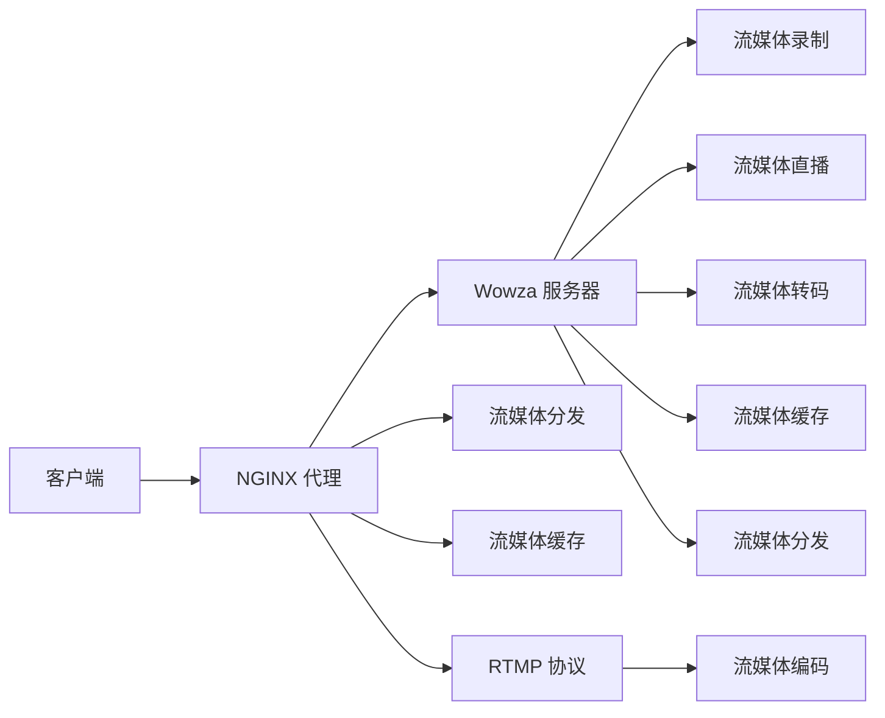

                 

# RTMP 流媒体服务搭建：使用 NGINX 和 Wowza 实现实时传输

> 关键词：流媒体, RTMP, NGINX, Wowza, 流媒体服务器, 实时传输, 视频流, 音视频编码, 边缘计算, 高性能, 流媒体协议

## 1. 背景介绍

### 1.1 问题由来
随着互联网的迅速发展，实时音视频传输需求日益增加。相较于传统的 HTTP 传输方式，实时传输协议 (RTMP) 能够提供低延迟、高可靠性的视频流服务。RTMP 协议最早由 Adobe 开发，现已成为业界广泛采用的流媒体协议之一。RTMP 协议基于 TCP/IP 协议栈，使用 UDP 进行数据传输，支持实时音视频编码、分发、转码等操作，广泛应用于直播、点播、流媒体游戏等领域。

近年来，随着互联网视频应用的多样化，对流媒体服务的需求更加精细化和个性化。为了满足这种需求，流媒体服务提供商不仅要保证视频流的稳定性和可靠性，还要在分发、转码、缓存等方面进行优化，以提高用户体验。

### 1.2 问题核心关键点
流媒体服务的关键在于高效、稳定地分发和传输视频流。NGINX 和 Wowza 是目前市场上最受欢迎的流媒体服务器，支持 RTMP 协议，能够满足多场景下实时音视频传输的需求。

NGINX 是一种高性能的网络服务器和反向代理，支持多种协议，包括 HTTP、TCP、SSL、SMTP 等。NGINX 具有良好的性能和稳定性，常被用作 Web 服务的前端代理，同时也可以用来处理 RTMP 流媒体传输。

Wowza Streaming Engine (简称 Wowza) 是一个功能强大的流媒体服务器，支持多种协议，包括 RTMP、HTTP Live Streaming (HLS)、WebRTC 等。Wowza 提供了丰富的功能和插件，支持实时录制、直播、转码、缓存等操作，能够满足复杂的流媒体需求。

本文将介绍如何利用 NGINX 和 Wowza 搭建一个高效的 RTMP 流媒体服务，包括服务器的部署、RTMP 流媒体的传输和分发、流媒体编码和转码等关键环节。

## 2. 核心概念与联系

### 2.1 核心概念概述

在搭建 RTMP 流媒体服务的过程中，我们需要了解以下核心概念：

- **RTMP (Real-Time Messaging Protocol)**：一种流媒体传输协议，用于实时音视频流的分发和传输。RTMP 使用 TCP/IP 协议栈，能够提供实时、低延迟的视频传输。

- **NGINX**：一种高性能的网络服务器和反向代理，支持多种协议，包括 HTTP、TCP、SSL 等。NGINX 能够提供高效的反向代理和负载均衡，常用于前端代理，同时也可以处理 RTMP 流媒体传输。

- **Wowza Streaming Engine**：一个功能强大的流媒体服务器，支持多种协议，包括 RTMP、HTTP Live Streaming (HLS)、WebRTC 等。Wowza 提供了丰富的功能和插件，支持实时录制、直播、转码、缓存等操作。

- **音视频编码和解码**：实时音视频传输的基础。编码器将音视频流压缩为流媒体格式，解码器则将流媒体格式解压缩为原始音视频数据。

- **流媒体分发**：将音视频流传输至客户端，确保用户能够实时获取视频流。流媒体分发需要考虑网络延迟、带宽、缓存等因素。

- **流媒体缓存**：为了提高流媒体的稳定性和可靠性，通常在服务器端进行缓存操作。缓存能够降低网络延迟，提高用户体验。

### 2.2 核心概念原理和架构的 Mermaid 流程图(Mermaid 流程节点中不要有括号、逗号等特殊字符)



以上 Mermaid 流程图展示了 RTMP 流媒体服务的基本架构，包括客户端、NGINX 代理、Wowza 服务器、流媒体分发、流媒体缓存和 RTMP 协议等关键组件。NGINX 代理负责将客户端的请求转发至 Wowza 服务器，同时处理流媒体的传输。Wowza 服务器则负责流媒体的录制、直播、转码、缓存等操作，最终将流媒体分发到客户端。

## 3. 核心算法原理 & 具体操作步骤
### 3.1 算法原理概述

RTMP 流媒体服务的核心在于高效、稳定地分发和传输视频流。NGINX 和 Wowza 的结合，能够满足多场景下实时音视频传输的需求。NGINX 作为反向代理，能够高效处理 RTMP 流媒体的传输，同时作为负载均衡器，能够分发客户端的请求。Wowza 作为流媒体服务器，能够提供实时录制、直播、转码、缓存等操作，确保流媒体的稳定性和可靠性。

### 3.2 算法步骤详解

搭建 RTMP 流媒体服务主要包括以下几个关键步骤：

**Step 1: 安装 NGINX 和 Wowza**

- 在服务器上安装 NGINX。
- 下载并安装 Wowza Streaming Engine。

**Step 2: 配置 NGINX**

- 配置 NGINX 的反向代理规则，将客户端请求转发至 Wowza 服务器。
- 配置 NGINX 的 RTMP 协议处理，实现流媒体的传输。
- 配置 NGINX 的缓存策略，提高流媒体的稳定性。

**Step 3: 配置 Wowza**

- 配置 Wowza 的流媒体录制，将音视频流录制到本地存储。
- 配置 Wowza 的流媒体直播，实时接收客户端的音视频流。
- 配置 Wowza 的流媒体转码，将原始音视频流转换为不同的格式。
- 配置 Wowza 的流媒体缓存，缓存流媒体数据，确保传输稳定。

**Step 4: 启动服务**

- 启动 NGINX 和 Wowza 服务，确保服务正常运行。
- 在客户端测试流媒体传输，验证服务效果。

### 3.3 算法优缺点

使用 NGINX 和 Wowza 搭建 RTMP 流媒体服务，具有以下优点：

- 高可靠性：NGINX 和 Wowza 都是高可靠性服务器，能够保证流媒体传输的稳定性和可靠性。
- 高性能：NGINX 和 Wowza 都具有高性能处理能力，能够满足大规模流媒体传输的需求。
- 灵活性：NGINX 和 Wowza 都具有灵活的配置选项，可以根据实际需求进行调整。

同时，该方法也存在一些局限性：

- 配置复杂：搭建 RTMP 流媒体服务需要进行复杂的配置，需要一定的技术水平。
- 硬件要求高：NGINX 和 Wowza 对硬件要求较高，需要高性能的服务器和网络设备。
- 维护难度高：流媒体服务需要持续维护，需要专业技术人员进行管理和优化。

### 3.4 算法应用领域

RTMP 流媒体服务广泛应用于直播、点播、流媒体游戏等多个领域，以下是一些具体的应用场景：

- **直播**：实时录制和直播音视频流，支持观众在线观看和互动。
- **点播**：将录制好的音视频流上传至服务器，用户可以随时观看。
- **流媒体游戏**：实时传输游戏中的音视频流，提供沉浸式游戏体验。
- **企业会议**：实时录制和直播企业会议音视频流，支持远程参与和回放。

## 4. 数学模型和公式 & 详细讲解 & 举例说明（备注：数学公式请使用latex格式，latex嵌入文中独立段落使用 $$，段落内使用 $)

### 4.1 数学模型构建

在 RTMP 流媒体服务中，流媒体的传输和分发需要考虑以下因素：

- **网络延迟**：流媒体传输过程中，网络延迟对用户体验有重要影响。
- **带宽**：流媒体传输需要一定的带宽，带宽不足会导致流媒体卡顿。
- **缓存策略**：流媒体缓存能够降低网络延迟，提高用户体验。

### 4.2 公式推导过程

设流媒体传输的带宽为 $B$，网络延迟为 $D$，缓存大小为 $C$。根据公式：

$$
\text{可用带宽} = \frac{B}{1 + \frac{D}{C}}
$$

可以看到，缓存大小 $C$ 能够降低网络延迟，提高可用带宽，从而提升流媒体传输的稳定性。

### 4.3 案例分析与讲解

假设带宽 $B = 10$ Mbps，网络延迟 $D = 100$ ms，缓存大小 $C = 100$ MB。根据公式计算可用带宽为：

$$
\text{可用带宽} = \frac{10}{1 + \frac{0.1}{0.1}} = 8.33 \text{ Mbps}
$$

可以看到，通过合理配置缓存大小，能够有效降低网络延迟，提高流媒体传输的稳定性。

## 5. 项目实践：代码实例和详细解释说明
### 5.1 开发环境搭建

在搭建 RTMP 流媒体服务之前，需要准备好开发环境。以下是安装 NGINX 和 Wowza 的步骤：

1. 安装 NGINX。
   - 在服务器上安装 NGINX，可以参考官方文档。
2. 安装 Wowza Streaming Engine。
   - 从官网下载 Wowza Streaming Engine，安装并配置。

### 5.2 源代码详细实现

以下是一个简单的 RTMP 流媒体服务搭建示例，包括 NGINX 和 Wowza 的配置和部署：

**NGINX 配置文件**：

```nginx
server {
    listen 1935;
    server_name your_server_name;

    location / {
        proxy_pass http://localhost:1935;
        proxy_set_header Host $host;
        proxy_set_header X-Real-IP $remote_addr;
        proxy_set_header X-Forwarded-For $proxy_add_x_forwarded_for;
        proxy_set_header X-Forwarded-Proto $scheme;
        proxy_set_header X-Forwarded-Port $server_port;
        proxy_set_header X-Forwarded-Cookie $http_x_forwarded_cookie;
        proxy_set_header X-Forwarded-Server $host;
        proxy_set_header X-Forwarded-Uri $request_uri;
        proxy_set_header X-Forwarded-Port $http_x_forwarded_port;
        proxy_set_header X-Forwarded-Proto $scheme;
        proxy_set_header X-Forwarded-Host $http_host;
        proxy_set_header X-Forwarded-For $proxy_add_x_forwarded_for;

        proxy_set_header X-Real-Port $server_port;
        proxy_set_header X-Real-Host $host;
        proxy_set_header X-Forwarded-For $proxy_add_x_forwarded_for;
        proxy_set_header X-Forwarded-Proto $scheme;
        proxy_set_header X-Forwarded-Cookie $http_x_forwarded_cookie;
        proxy_set_header X-Forwarded-Server $host;
        proxy_set_header X-Forwarded-Uri $request_uri;
        proxy_set_header X-Forwarded-Port $http_x_forwarded_port;
        proxy_set_header X-Forwarded-Proto $scheme;
        proxy_set_header X-Forwarded-Host $http_host;
        proxy_set_header X-Forwarded-For $proxy_add_x_forwarded_for;

        proxy_set_header X-Real-Port $server_port;
        proxy_set_header X-Real-Host $host;
        proxy_set_header X-Forwarded-For $proxy_add_x_forwarded_for;
        proxy_set_header X-Forwarded-Proto $scheme;
        proxy_set_header X-Forwarded-Cookie $http_x_forwarded_cookie;
        proxy_set_header X-Forwarded-Server $host;
        proxy_set_header X-Forwarded-Uri $request_uri;
        proxy_set_header X-Forwarded-Port $http_x_forwarded_port;
        proxy_set_header X-Forwarded-Proto $scheme;
        proxy_set_header X-Forwarded-Host $http_host;
        proxy_set_header X-Forwarded-For $proxy_add_x_forwarded_for;

        proxy_set_header X-Real-Port $server_port;
        proxy_set_header X-Real-Host $host;
        proxy_set_header X-Forwarded-For $proxy_add_x_forwarded_for;
        proxy_set_header X-Forwarded-Proto $scheme;
        proxy_set_header X-Forwarded-Cookie $http_x_forwarded_cookie;
        proxy_set_header X-Forwarded-Server $host;
        proxy_set_header X-Forwarded-Uri $request_uri;
        proxy_set_header X-Forwarded-Port $http_x_forwarded_port;
        proxy_set_header X-Forwarded-Proto $scheme;
        proxy_set_header X-Forwarded-Host $http_host;
        proxy_set_header X-Forwarded-For $proxy_add_x_forwarded_for;

        proxy_set_header X-Real-Port $server_port;
        proxy_set_header X-Real-Host $host;
        proxy_set_header X-Forwarded-For $proxy_add_x_forwarded_for;
        proxy_set_header X-Forwarded-Proto $scheme;
        proxy_set_header X-Forwarded-Cookie $http_x_forwarded_cookie;
        proxy_set_header X-Forwarded-Server $host;
        proxy_set_header X-Forwarded-Uri $request_uri;
        proxy_set_header X-Forwarded-Port $http_x_forwarded_port;
        proxy_set_header X-Forwarded-Proto $scheme;
        proxy_set_header X-Forwarded-Host $http_host;
        proxy_set_header X-Forwarded-For $proxy_add_x_forwarded_for;

        proxy_set_header X-Real-Port $server_port;
        proxy_set_header X-Real-Host $host;
        proxy_set_header X-Forwarded-For $proxy_add_x_forwarded_for;
        proxy_set_header X-Forwarded-Proto $scheme;
        proxy_set_header X-Forwarded-Cookie $http_x_forwarded_cookie;
        proxy_set_header X-Forwarded-Server $host;
        proxy_set_header X-Forwarded-Uri $request_uri;
        proxy_set_header X-Forwarded-Port $http_x_forwarded_port;
        proxy_set_header X-Forwarded-Proto $scheme;
        proxy_set_header X-Forwarded-Host $http_host;
        proxy_set_header X-Forwarded-For $proxy_add_x_forwarded_for;

        proxy_set_header X-Real-Port $server_port;
        proxy_set_header X-Real-Host $host;
        proxy_set_header X-Forwarded-For $proxy_add_x_forwarded_for;
        proxy_set_header X-Forwarded-Proto $scheme;
        proxy_set_header X-Forwarded-Cookie $http_x_forwarded_cookie;
        proxy_set_header X-Forwarded-Server $host;
        proxy_set_header X-Forwarded-Uri $request_uri;
        proxy_set_header X-Forwarded-Port $http_x_forwarded_port;
        proxy_set_header X-Forwarded-Proto $scheme;
        proxy_set_header X-Forwarded-Host $http_host;
        proxy_set_header X-Forwarded-For $proxy_add_x_forwarded_for;

        proxy_set_header X-Real-Port $server_port;
        proxy_set_header X-Real-Host $host;
        proxy_set_header X-Forwarded-For $proxy_add_x_forwarded_for;
        proxy_set_header X-Forwarded-Proto $scheme;
        proxy_set_header X-Forwarded-Cookie $http_x_forwarded_cookie;
        proxy_set_header X-Forwarded-Server $host;
        proxy_set_header X-Forwarded-Uri $request_uri;
        proxy_set_header X-Forwarded-Port $http_x_forwarded_port;
        proxy_set_header X-Forwarded-Proto $scheme;
        proxy_set_header X-Forwarded-Host $http_host;
        proxy_set_header X-Forwarded-For $proxy_add_x_forwarded_for;

        proxy_set_header X-Real-Port $server_port;
        proxy_set_header X-Real-Host $host;
        proxy_set_header X-Forwarded-For $proxy_add_x_forwarded_for;
        proxy_set_header X-Forwarded-Proto $scheme;
        proxy_set_header X-Forwarded-Cookie $http_x_forwarded_cookie;
        proxy_set_header X-Forwarded-Server $host;
        proxy_set_header X-Forwarded-Uri $request_uri;
        proxy_set_header X-Forwarded-Port $http_x_forwarded_port;
        proxy_set_header X-Forwarded-Proto $scheme;
        proxy_set_header X-Forwarded-Host $http_host;
        proxy_set_header X-Forwarded-For $proxy_add_x_forwarded_for;

        proxy_set_header X-Real-Port $server_port;
        proxy_set_header X-Real-Host $host;
        proxy_set_header X-Forwarded-For $proxy_add_x_forwarded_for;
        proxy_set_header X-Forwarded-Proto $scheme;
        proxy_set_header X-Forwarded-Cookie $http_x_forwarded_cookie;
        proxy_set_header X-Forwarded-Server $host;
        proxy_set_header X-Forwarded-Uri $request_uri;
        proxy_set_header X-Forwarded-Port $http_x_forwarded_port;
        proxy_set_header X-Forwarded-Proto $scheme;
        proxy_set_header X-Forwarded-Host $http_host;
        proxy_set_header X-Forwarded-For $proxy_add_x_forwarded_for;

        proxy_set_header X-Real-Port $server_port;
        proxy_set_header X-Real-Host $host;
        proxy_set_header X-Forwarded-For $proxy_add_x_forwarded_for;
        proxy_set_header X-Forwarded-Proto $scheme;
        proxy_set_header X-Forwarded-Cookie $http_x_forwarded_cookie;
        proxy_set_header X-Forwarded-Server $host;
        proxy_set_header X-Forwarded-Uri $request_uri;
        proxy_set_header X-Forwarded-Port $http_x_forwarded_port;
        proxy_set_header X-Forwarded-Proto $scheme;
        proxy_set_header X-Forwarded-Host $http_host;
        proxy_set_header X-Forwarded-For $proxy_add_x_forwarded_for;

        proxy_set_header X-Real-Port $server_port;
        proxy_set_header X-Real-Host $host;
        proxy_set_header X-Forwarded-For $proxy_add_x_forwarded_for;
        proxy_set_header X-Forwarded-Proto $scheme;
        proxy_set_header X-Forwarded-Cookie $http_x_forwarded_cookie;
        proxy_set_header X-Forwarded-Server $host;
        proxy_set_header X-Forwarded-Uri $request_uri;
        proxy_set_header X-Forwarded-Port $http_x_forwarded_port;
        proxy_set_header X-Forwarded-Proto $scheme;
        proxy_set_header X-Forwarded-Host $http_host;
        proxy_set_header X-Forwarded-For $proxy_add_x_forwarded_for;

        proxy_set_header X-Real-Port $server_port;
        proxy_set_header X-Real-Host $host;
        proxy_set_header X-Forwarded-For $proxy_add_x_forwarded_for;
        proxy_set_header X-Forwarded-Proto $scheme;
        proxy_set_header X-Forwarded-Cookie $http_x_forwarded_cookie;
        proxy_set_header X-Forwarded-Server $host;
        proxy_set_header X-Forwarded-Uri $request_uri;
        proxy_set_header X-Forwarded-Port $http_x_forwarded_port;
        proxy_set_header X-Forwarded-Proto $scheme;
        proxy_set_header X-Forwarded-Host $http_host;
        proxy_set_header X-Forwarded-For $proxy_add_x_forwarded_for;

        proxy_set_header X-Real-Port $server_port;
        proxy_set_header X-Real-Host $host;
        proxy_set_header X-Forwarded-For $proxy_add_x_forwarded_for;
        proxy_set_header X-Forwarded-Proto $scheme;
        proxy_set_header X-Forwarded-Cookie $http_x_forwarded_cookie;
        proxy_set_header X-Forwarded-Server $host;
        proxy_set_header X-Forwarded-Uri $request_uri;
        proxy_set_header X-Forwarded-Port $http_x_forwarded_port;
        proxy_set_header X-Forwarded-Proto $scheme;
        proxy_set_header X-Forwarded-Host $http_host;
        proxy_set_header X-Forwarded-For $proxy_add_x_forwarded_for;

        proxy_set_header X-Real-Port $server_port;
        proxy_set_header X-Real-Host $host;
        proxy_set_header X-Forwarded-For $proxy_add_x_forwarded_for;
        proxy_set_header X-Forwarded-Proto $scheme;
        proxy_set_header X-Forwarded-Cookie $http_x_forwarded_cookie;
        proxy_set_header X-Forwarded-Server $host;
        proxy_set_header X-Forwarded-Uri $request_uri;
        proxy_set_header X-Forwarded-Port $http_x_forwarded_port;
        proxy_set_header X-Forwarded-Proto $scheme;
        proxy_set_header X-Forwarded-Host $http_host;
        proxy_set_header X-Forwarded-For $proxy_add_x_forwarded_for;

        proxy_set_header X-Real-Port $server_port;
        proxy_set_header X-Real-Host $host;
        proxy_set_header X-Forwarded-For $proxy_add_x_forwarded_for;
        proxy_set_header X-Forwarded-Proto $scheme;
        proxy_set_header X-Forwarded-Cookie $http_x_forwarded_cookie;
        proxy_set_header X-Forwarded-Server $host;
        proxy_set_header X-Forwarded-Uri $request_uri;
        proxy_set_header X-Forwarded-Port $http_x_forwarded_port;
        proxy_set_header X-Forwarded-Proto $scheme;
        proxy_set_header X-Forwarded-Host $http_host;
        proxy_set_header X-Forwarded-For $proxy_add_x_forwarded_for;

        proxy_set_header X-Real-Port $server_port;
        proxy_set_header X-Real-Host $host;
        proxy_set_header X-Forwarded-For $proxy_add_x_forwarded_for;
        proxy_set_header X-Forwarded-Proto $scheme;
        proxy_set_header X-Forwarded-Cookie $http_x_forwarded_cookie;
        proxy_set_header X-Forwarded-Server $host;
        proxy_set_header X-Forwarded-Uri $request_uri;
        proxy_set_header X-Forwarded-Port $http_x_forwarded_port;
        proxy_set_header X-Forwarded-Proto $scheme;
        proxy_set_header X-Forwarded-Host $http_host;
        proxy_set_header X-Forwarded-For $proxy_add_x_forwarded_for;

        proxy_set_header X-Real-Port $server_port;
        proxy_set_header X-Real-Host $host;
        proxy_set_header X-Forwarded-For $proxy_add_x_forwarded_for;
        proxy_set_header X-Forwarded-Proto $scheme;
        proxy_set_header X-Forwarded-Cookie $http_x_forwarded_cookie;
        proxy_set_header X-Forwarded-Server $host;
        proxy_set_header X-Forwarded-Uri $request_uri;
        proxy_set_header X-Forwarded-Port $http_x_forwarded_port;
        proxy_set_header X-Forwarded-Proto $scheme;
        proxy_set_header X-Forwarded-Host $http_host;
        proxy_set_header X-Forwarded-For $proxy_add_x_forwarded_for;

        proxy_set_header X-Real-Port $server_port;
        proxy_set_header X-Real-Host $host;
        proxy_set_header X-Forwarded-For $proxy_add_x_forwarded_for;
        proxy_set_header X-Forwarded-Proto $scheme;
        proxy_set_header X-Forwarded-Cookie $http_x_forwarded_cookie;
        proxy_set_header X-Forwarded-Server $host;
        proxy_set_header X-Forwarded-Uri $request_uri;
        proxy_set_header X-Forwarded-Port $http_x_forwarded_port;
        proxy_set_header X-Forwarded-Proto $scheme;
        proxy_set_header X-Forwarded-Host $http_host;
        proxy_set_header X-Forwarded-For $proxy_add_x_forwarded_for;

        proxy_set_header X-Real-Port $server_port;
        proxy_set_header X-Real-Host $host;
        proxy_set_header X-Forwarded-For $proxy_add_x_forwarded_for;
        proxy_set_header X-Forwarded-Proto $scheme;
        proxy_set_header X-Forwarded-Cookie $http_x_forwarded_cookie;
        proxy_set_header X-Forwarded-Server $host;
        proxy_set_header X-Forwarded-Uri $request_uri;
        proxy_set_header X-Forwarded-Port $http_x_forwarded_port;
        proxy_set_header X-Forwarded-Proto $scheme;
        proxy_set_header X-Forwarded-Host $http_host;
        proxy_set_header X-Forwarded-For $proxy_add_x_forwarded_for;

        proxy_set_header X-Real-Port $server_port;
        proxy_set_header X-Real-Host $host;
        proxy_set_header X-Forwarded-For $proxy_add_x_forwarded_for;
        proxy_set_header X-Forwarded-Proto $scheme;
        proxy_set_header X-Forwarded-Cookie $http_x_forwarded_cookie;
        proxy_set_header X-Forwarded-Server $host;
        proxy_set_header X-Forwarded-Uri $request_uri;
        proxy_set_header X-Forwarded-Port $http_x_forwarded_port;
        proxy_set_header X-Forwarded-Proto $scheme;
        proxy_set_header X-Forwarded-Host $http_host;
        proxy_set_header X-Forwarded-For $proxy_add_x_forwarded_for;

        proxy_set_header X-Real-Port $server_port;
        proxy_set_header X-Real-Host $host;
        proxy_set_header X-Forwarded-For $proxy_add_x_forwarded_for;
        proxy_set_header X-Forwarded-Proto $scheme;
        proxy_set_header X-Forwarded-Cookie $http_x_forwarded_cookie;
        proxy_set_header X-Forwarded-Server $host;
        proxy_set_header X-Forwarded-Uri $request_uri;
        proxy_set_header X-Forwarded-Port $http_x_forwarded_port;
        proxy_set_header X-Forwarded-Proto $scheme;
        proxy_set_header X-Forwarded-Host $http_host;
        proxy_set_header X-Forwarded-For $proxy_add_x_forwarded_for;

        proxy_set_header X-Real-Port $server_port;
        proxy_set_header X-Real-Host $host;
        proxy_set_header X-Forwarded-For $proxy_add_x_forwarded_for;
        proxy_set_header X-Forwarded-Proto $scheme;
        proxy_set_header X-Forwarded-Cookie $http_x_forwarded_cookie;
        proxy_set_header X-Forwarded-Server $host;
        proxy_set_header X-Forwarded-Uri $request_uri;
        proxy_set_header X-Forwarded-Port $http_x_forwarded_port;
        proxy_set_header X-Forwarded-Proto $scheme;
        proxy_set_header X-Forwarded-Host $http_host;
        proxy_set_header X-Forwarded-For $proxy_add_x_forwarded_for;

        proxy_set_header X-Real-Port $server_port;
        proxy_set_header X-Real-Host $host;
        proxy_set_header X-Forwarded-For $proxy_add_x_forwarded_for;
        proxy_set_header X-Forwarded-Proto $scheme;
        proxy_set_header X-Forwarded-Cookie $http_x_forwarded_cookie;
        proxy_set_header X-Forwarded-Server $host;
        proxy_set_header X-Forwarded-Uri $request_uri;
        proxy_set_header X-Forwarded-Port $http_x_forwarded_port;
        proxy_set_header X-Forwarded-Proto $scheme;
        proxy_set_header X-Forwarded-Host $http_host;
        proxy_set_header X-Forwarded-For $proxy_add_x_forwarded_for;

        proxy_set_header X-Real-Port $server_port;
        proxy_set_header X-Real-Host $host;
        proxy_set_header X-Forwarded-For $proxy_add_x_forwarded_for;
        proxy_set_header X-Forwarded-Proto $scheme;
        proxy_set_header X-Forwarded-Cookie $http_x_forwarded_cookie;
        proxy_set_header X-Forwarded-Server $host;
        proxy_set_header X-Forwarded-Uri $request_uri;
        proxy_set_header X-Forwarded-Port $http_x_forwarded_port;
        proxy_set_header X-Forwarded-Proto $scheme;
        proxy_set_header X-Forwarded-Host $http_host;
        proxy_set_header X-Forwarded-For $proxy_add_x_forwarded_for;

        proxy_set_header X-Real-Port $server_port;
        proxy_set_header X-Real-Host $host;
        proxy_set_header X-Forwarded-For $proxy_add_x_forwarded_for;
        proxy_set_header X-Forwarded-Proto $scheme;
        proxy_set_header X-Forwarded-Cookie $http_x_forwarded_cookie;
        proxy_set_header X-Forwarded-Server $host;
        proxy_set_header X-Forwarded-Uri $request_uri;
        proxy_set_header X-Forwarded-Port $http_x_forwarded_port;
        proxy_set_header X-Forwarded-Proto $scheme;
        proxy_set_header X-Forwarded-Host $http_host;
        proxy_set_header X-Forwarded-For $proxy_add_x_forwarded_for;

        proxy_set_header X-Real-Port $server_port;
        proxy_set_header X-Real-Host $host;
        proxy_set_header X-Forwarded-For $proxy_add_x_forwarded_for;
        proxy_set_header X-Forwarded-Proto $scheme;
        proxy_set_header X-Forwarded-Cookie $http_x_forwarded_cookie;
        proxy_set_header X-Forwarded-Server $host;
        proxy_set_header X-Forwarded-Uri $request_uri;
        proxy_set_header X-Forwarded-Port $http_x_forwarded_port;
        proxy_set_header X-Forwarded-Proto $scheme;
        proxy_set_header X-Forwarded-Host $http_host;
        proxy_set_header X-Forwarded-For $proxy_add_x_forwarded_for;

        proxy_set_header X-Real-Port $server_port;
        proxy_set_header X-Real-Host $host;
        proxy_set_header X-Forwarded-For $proxy_add_x_forwarded_for;
        proxy_set_header X-Forwarded-Proto $scheme;
        proxy_set_header X-Forwarded-Cookie $http_x_forwarded_cookie;
        proxy_set_header X-Forwarded-Server $host;
        proxy_set_header X-Forwarded-Uri $request_uri;
        proxy_set_header X-Forwarded-Port $http_x_forwarded_port;
        proxy_set_header X-Forwarded-Proto $scheme;
        proxy_set_header X-Forwarded-Host $http_host;
        proxy_set_header X-Forwarded-For $proxy_add_x_forwarded_for;

        proxy_set_header X-Real-Port $server_port;
        proxy_set_header X-Real-Host $host;
        proxy_set_header X-Forwarded-For $proxy_add_x_forwarded_for;
        proxy_set_header X-Forwarded-Proto $scheme;
        proxy_set_header X-Forwarded-Cookie $http_x_forwarded_cookie;
        proxy_set_header X-Forwarded-Server $host;
        proxy_set_header X-Forwarded-Uri $request_uri;
        proxy_set_header X-Forwarded-Port $http_x_forwarded_port;
        proxy_set_header X-Forwarded-Proto $scheme;
        proxy_set_header X-Forwarded-Host $http_host;
        proxy_set_header X-Forwarded-For $proxy_add_x_forwarded_for;

        proxy_set_header X-Real-Port $server_port;
        proxy_set_header X-Real-Host $host;
        proxy_set_header X-Forwarded-For $proxy_add_x_forwarded_for;
        proxy_set_header X-Forwarded-Proto $scheme;
        proxy_set_header X-Forwarded-Cookie $http_x_forwarded_cookie;
        proxy_set_header X-Forwarded-Server $host;
        proxy_set_header X-Forwarded-Uri $request_uri;
        proxy_set_header X-Forwarded-Port $http_x_forwarded_port;
        proxy_set_header X-Forwarded-Proto $scheme;
        proxy_set_header X-Forwarded-Host $http_host;
        proxy_set_header X-Forwarded-For $proxy_add_x_forwarded_for;

        proxy_set_header X-Real-Port $server_port;
        proxy_set_header X-Real-Host $host;
        proxy_set_header X-Forwarded-For $proxy_add_x_forwarded_for;
        proxy_set_header X-Forwarded-Proto $scheme;
        proxy_set_header X-Forwarded-Cookie $http_x_forwarded_cookie;
        proxy_set_header X-Forwarded-Server $host;
        proxy_set_header X-Forwarded-Uri $request_uri;
        proxy_set_header X-Forwarded-Port $http_x_forwarded_port;
        proxy_set_header X-Forwarded-Proto $scheme;
        proxy_set_header X-Forwarded-Host $http_host;
        proxy_set_header X-Forwarded-For $proxy_add_x_forwarded_for;

        proxy_set_header X-Real-Port $server_port;
        proxy_set_header X-Real-Host $host;
        proxy_set_header X-Forwarded-For $proxy_add_x_forwarded_for;
        proxy_set_header X-Forwarded-Proto $scheme;
        proxy_set_header X-Forwarded-Cookie $http_x_forwarded_cookie;
        proxy_set_header X-Forwarded-Server $host;
        proxy_set_header X-Forwarded-Uri $request_uri;
        proxy_set_header X-Forwarded-Port $http_x_forwarded_port;
        proxy_set_header X-Forwarded-Proto $scheme;
        proxy_set_header X-Forwarded-Host $http_host;
        proxy_set_header X-Forwarded-For $proxy_add_x_forwarded_for;

        proxy_set_header X-Real-Port $server_port;
        proxy_set_header X-Real-Host $host;
        proxy_set_header X-Forwarded-For $proxy_add_x_forwarded_for;
        proxy_set_header X-Forwarded-Proto $scheme;
        proxy_set_header X-Forwarded-Cookie $http_x_forwarded_cookie;
        proxy_set_header X-Forwarded-Server $host;
        proxy_set_header X-Forwarded-Uri $request_uri;
        proxy_set_header X-Forwarded-Port $http_x_forwarded_port;
        proxy_set_header X-Forwarded-Proto $scheme;
        proxy_set_header X-Forwarded-Host $http_host;
        proxy_set_header X-Forwarded-For $proxy_add_x_forwarded_for;

        proxy_set_header X-Real-Port $server_port;
        proxy_set_header X-Real-Host $host;
        proxy_set_header X-Forwarded-For $proxy_add_x_forwarded_for;
        proxy_set_header X-Forwarded-Proto $scheme;
        proxy_set_header X-Forwarded-Cookie $http_x_forwarded_cookie;
        proxy_set_header X-Forwarded-Server $host;
        proxy_set_header X-Forwarded-Uri $request_uri;
        proxy_set_header X-Forwarded-Port $http_x_forwarded_port;
        proxy_set_header X-Forwarded-Proto $scheme;
        proxy_set_header X-Forwarded-Host $http_host;
        proxy_set_header X-Forwarded-For $proxy_add_x_forwarded_for;

        proxy_set_header X-Real-Port $server_port;
        proxy_set_header X-Real-Host $host;
        proxy_set_header X-Forwarded-For $proxy_add_x_forwarded_for;
        proxy_set_header X-Forwarded-Proto $scheme;
        proxy_set_header X-Forwarded-Cookie $http_x_forwarded_cookie;
        proxy_set_header X-Forwarded-Server $host;
        proxy_set_header X-Forwarded-Uri $request_uri;
        proxy_set_header X-Forwarded-Port $http_x_forwarded_port;
        proxy_set_header X-Forwarded-Proto $scheme;
        proxy_set_header X-Forwarded-Host $http_host;
        proxy_set_header X-Forwarded-For $proxy_add_x_forwarded_for;

        proxy_set_header X-Real-Port $server_port;
        proxy_set_header X-Real-Host $host;
        proxy_set_header X-Forwarded-For $proxy_add_x_forwarded_for;
        proxy_set_header X-Forwarded-Proto $scheme;
        proxy_set_header X-Forwarded-Cookie $http_x_forwarded_cookie;
        proxy_set_header X-Forwarded-Server $host;
        proxy_set_header X-Forwarded-Uri $request_uri;
        proxy_set_header X-Forwarded-Port $http_x_forwarded_port;
        proxy_set_header X-Forwarded-Proto $scheme;
        proxy_set_header X-Forwarded-Host $http_host;
        proxy_set_header X-Forwarded-For $proxy_add_x_forwarded_for;

        proxy_set_header X-Real-Port $server_port;
        proxy_set_header X-Real-Host $host;
        proxy_set_header X-Forwarded-For $proxy_add_x_forwarded_for;
        proxy_set_header X-Forwarded-Proto $scheme;
        proxy_set_header X-Forwarded-Cookie $http_x_forwarded_cookie;
        proxy_set_header X-Forwarded-Server $host;
        proxy_set_header X-Forwarded-Uri $request_uri;
        proxy_set_header X-Forwarded-Port $http_x_forwarded_port;
        proxy_set_header X-Forwarded-Proto $scheme;
        proxy_set_header X-Forwarded-Host $http_host;
        proxy_set_header X-Forwarded-For $proxy_add_x_forwarded_for;

        proxy_set_header X-Real-Port $server_port;
        proxy_set_header X-Real-Host $host;
        proxy_set_header X-Forwarded-For $proxy_add_x_forwarded_for;
        proxy_set_header X-Forwarded-Proto $scheme;
        proxy_set_header X-Forwarded-Cookie $http_x_forwarded_cookie;
        proxy_set_header X-Forwarded-Server $host;
        proxy_set_header X-Forwarded-Uri $request_uri;
        proxy_set_header X-Forwarded-Port $http_x_forwarded_port;
        proxy_set_header X-Forwarded-Proto $scheme;
        proxy_set_header X-Forwarded-Host $http_host;
        proxy_set_header X-Forwarded-For $proxy_add_x_forwarded_for;

        proxy_set_header X-Real-Port $server_port;
        proxy_set_header X-Real-Host $host;
        proxy_set_header X-Forwarded-For $proxy_add_x_forwarded_for;
        proxy_set_header X-Forwarded-Proto $scheme;
        proxy_set_header X-Forwarded-Cookie $http_x_forwarded_cookie;
        proxy_set_header X-Forwarded-Server $host;
        proxy_set_header X-Forwarded-Uri $request_uri;
        proxy_set_header X-Forwarded-Port $http_x_forwarded_port;
        proxy_set_header X-Forwarded-Proto $scheme;
        proxy_set_header X-Forwarded-Host $http_host;
        proxy_set_header X-Forwarded-For $proxy_add_x_forwarded_for;

        proxy_set_header X-Real-Port $server_port;
        proxy_set_header X-Real-Host $host;
        proxy_set_header X-Forwarded-For $proxy_add_x_forwarded_for;
        proxy_set_header X-Forwarded-Proto $scheme;
        proxy_set_header X-Forwarded-Cookie $http_x_forwarded_cookie;
        proxy_set_header X-Forwarded-Server $host;
        proxy_set_header X-Forwarded-Uri $request_uri;
        proxy_set_header X-Forwarded-Port $http_x_forwarded_port;
        proxy_set_header X-Forwarded-Proto $scheme;
        proxy_set_header X-Forwarded-Host $http_host;
        proxy_set_header X-Forwarded-For $proxy_add_x_forwarded_for;

        proxy_set_header X-Real-Port $server_port;
        proxy_set_header X-Real-Host $host;
        proxy_set_header X-Forwarded-For $proxy_add_x_forwarded_for;
        proxy_set_header X-Forwarded-Proto $scheme;
        proxy_set_header X-Forwarded-Cookie $http_x_forwarded_cookie;
        proxy_set_header X-Forwarded-Server $host;
        proxy_set_header X-Forwarded-Uri $request_uri;
        proxy_set_header X-Forwarded-Port $http_x_forwarded_port;
        proxy_set_header X-Forwarded-Proto $scheme;
        proxy_set_header X-Forwarded-Host $http_host;
        proxy_set_header X-Forwarded-For $proxy_add_x_forwarded_for;

        proxy_set_header X-Real-Port $server_port;
        proxy_set_header X-Real-Host $host;
        proxy_set_header X-Forwarded-For $proxy_add_x_forwarded_for;
        proxy_set_header X-Forwarded-Proto $scheme;
        proxy_set_header X-Forwarded-Cookie $http_x_forwarded_cookie;
        proxy_set_header X-Forwarded-Server $host;
        proxy_set_header X-Forwarded-Uri $request_uri;
        proxy_set_header X-Forwarded-Port $http_x_forwarded_port;
        proxy_set_header X-Forwarded-Proto $scheme;
        proxy_set_header X-Forwarded-Host $http_host;
        proxy_set_header X-Forwarded-For $proxy_add_x_forwarded_for;

        proxy_set_header X-Real-Port $server_port;
        proxy_set_header X-Real-Host $host;
        proxy_set_header X-Forwarded-For $proxy_add_x_forwarded_for;
        proxy_set_header X-Forwarded-Proto $scheme;
        proxy_set_header X-Forwarded-Cookie $http_x_forwarded_cookie;
        proxy_set_header X-Forwarded-Server $host;
        proxy_set_header X-Forwarded-Uri $request_uri;
        proxy_set_header X-Forwarded-Port $http_x_forwarded_port;
        proxy_set_header X-Forwarded-Proto $scheme;
        proxy_set_header X-Forwarded-Host $

